# 演化策略

<cite>
**本文档中引用的文件**
- [evolving_strategy.py](file://rdagent/components/coder/CoSTEER/evolving_strategy.py)
- [task.py](file://rdagent/components/coder/CoSTEER/task.py)
- [knowledge_management.py](file://rdagent/components/coder/CoSTEER/knowledge_management.py)
- [evaluators.py](file://rdagent/components/coder/CoSTEER/evaluators.py)
- [evolvable_subjects.py](file://rdagent/components/coder/CoSTEER/evolvable_subjects.py)
- [config.py](file://rdagent/components/coder/CoSTEER/config.py)
- [__init__.py](file://rdagent/components/coder/CoSTEER/__init__.py)
- [evolving_framework.py](file://rdagent/core/evolving_framework.py)
- [data_science/conf.py](file://rdagent/components/coder/data_science/conf.py)
- [ensemble/__init__.py](file://rdagent/components/coder/data_science/ensemble/__init__.py)
- [pipeline/__init__.py](file://rdagent/components/coder/data_science/pipeline/__init__.py)
- [factor_coder/evolving_strategy.py](file://rdagent/components/coder/factor_coder/evolving_strategy.py)
</cite>

## 目录
1. [引言](#引言)
2. [项目结构概览](#项目结构概览)
3. [EvolvingStrategy抽象基类设计](#evolvingstrategy抽象基类设计)
4. [核心接口规范](#核心接口规范)
5. [CoSTEER策略实现详解](#costeer策略实现详解)
6. [EvolvableSubject设计](#evolvablesubject设计)
7. [Evaluators评估机制](#evaluators评估机制)
8. [知识管理与迭代优化](#知识管理与迭代优化)
9. [数据科学编码器实现](#数据科学编码器实现)
10. [创建新演化策略指南](#创建新演化策略指南)
11. [最佳实践与故障排除](#最佳实践与故障排除)
12. [总结](#总结)

## 引言

CoSTEER（Collaborative Software Team Evolutionary Engine）是一个基于协作软件团队演化的智能代码生成系统。该系统通过多进程并行任务处理、知识增强和迭代优化机制，实现了高效的代码演化策略。本文档深入分析`EvolvingStrategy`抽象基类的设计原理和接口规范，详细解释CoSTEER策略如何通过多个模块协同工作来实现智能化的代码生成。

## 项目结构概览

CoSTEER系统采用模块化架构设计，主要包含以下核心组件：

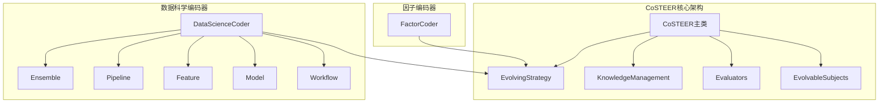

**图表来源**
- [__init__.py](file://rdagent/components/coder/CoSTEER/__init__.py#L1-L50)
- [evolving_strategy.py](file://rdagent/components/coder/CoSTEER/evolving_strategy.py#L1-L30)

**章节来源**
- [__init__.py](file://rdagent/components/coder/CoSTEER/__init__.py#L1-L177)
- [evolving_strategy.py](file://rdagent/components/coder/CoSTEER/evolving_strategy.py#L1-L135)

## EvolvingStrategy抽象基类设计

### 基础架构

`MultiProcessEvolvingStrategy`是CoSTEER系统中所有演化策略的抽象基类，它继承自`EvolvingStrategy`并提供了多进程并行处理能力。

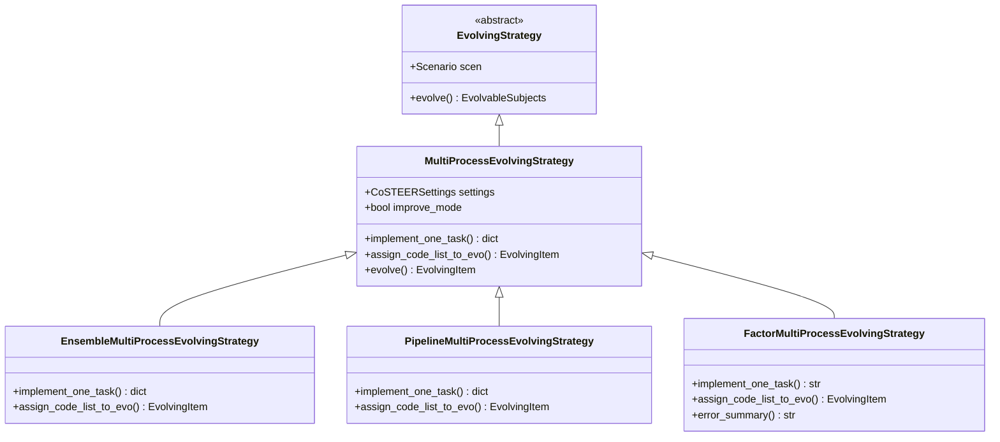

**图表来源**
- [evolving_strategy.py](file://rdagent/components/coder/CoSTEER/evolving_strategy.py#L15-L50)
- [ensemble/__init__.py](file://rdagent/components/coder/data_science/ensemble/__init__.py#L30-L80)
- [pipeline/__init__.py](file://rdagent/components/coder/data_science/pipeline/__init__.py#L30-L80)
- [factor_coder/evolving_strategy.py](file://rdagent/components/coder/factor_coder/evolving_strategy.py#L15-L60)

### 设计原则

1. **抽象层次清晰**：基类定义通用接口，子类实现具体逻辑
2. **并行处理支持**：内置多进程并行执行能力
3. **灵活配置**：支持改进模式和多种参数配置
4. **扩展性强**：便于添加新的演化策略类型

**章节来源**
- [evolving_strategy.py](file://rdagent/components/coder/CoSTEER/evolving_strategy.py#L15-L135)

## 核心接口规范

### evolve方法契约

`evolve`方法是`EvolvingStrategy`的核心接口，定义了演化过程的标准契约：

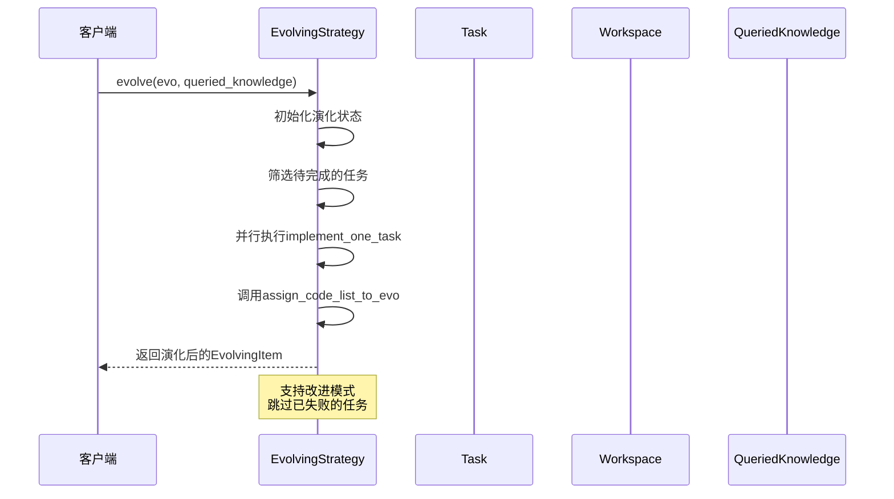

**图表来源**
- [evolving_strategy.py](file://rdagent/components/coder/CoSTEER/evolving_strategy.py#L60-L135)

#### 方法签名与参数

| 参数 | 类型 | 描述 | 必需 |
|------|------|------|------|
| `evo` | `EvolvingItem` | 待演化的实验对象 | 是 |
| `queried_knowledge` | `CoSTEERQueriedKnowledge \| None` | 查询到的知识 | 否 |
| `evolving_trace` | `list[EvoStep]` | 演化历史记录 | 否 |
| `**kwargs` | `Any` | 扩展参数 | 否 |

#### 返回值规范

- **成功**：返回更新后的`EvolvingItem`实例
- **异常**：抛出`NotImplementedError`或特定业务异常
- **状态**：保持不可变性，返回全新的演化结果

### implement_one_task方法契约

每个具体的演化策略都必须实现`implement_one_task`方法：

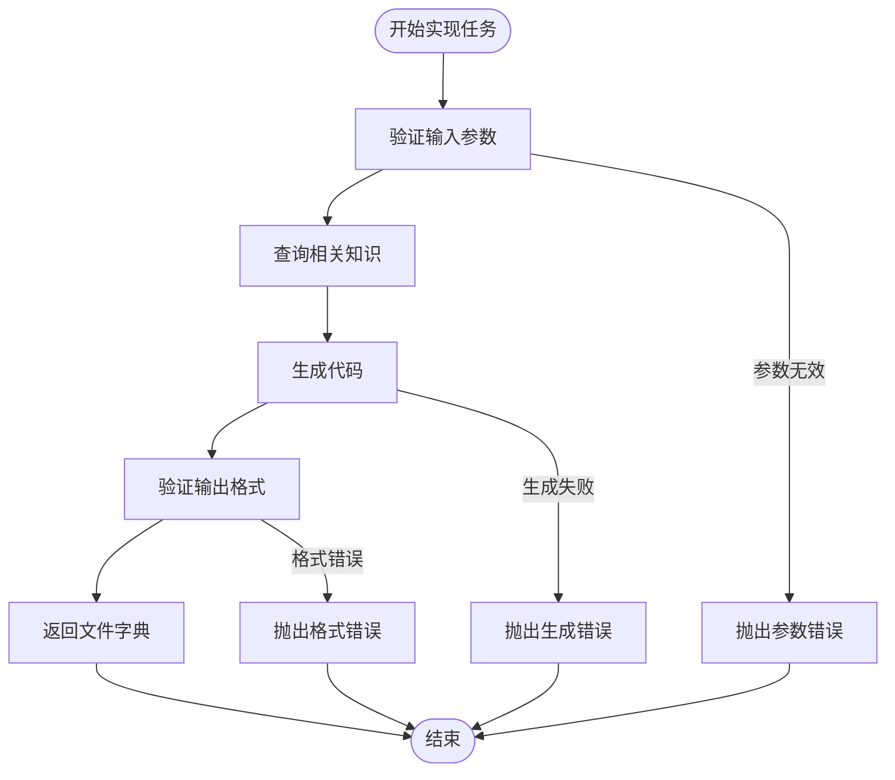

**图表来源**
- [evolving_strategy.py](file://rdagent/components/coder/CoSTEER/evolving_strategy.py#L30-L50)

#### 方法规范

| 组件 | 规范要求 |
|------|----------|
| 输入参数 | `target_task: Task`, `queried_knowledge: QueriedKnowledge \| None`, `workspace: FBWorkspace \| None`, `prev_task_feedback: CoSTEERSingleFeedback \| None` |
| 输出格式 | `{<filename>: <content>}` 字典结构 |
| 特殊键 | 支持`KEY_CHANGE_SUMMARY`用于变更摘要 |
| 错误处理 | 抛出适当的业务异常 |
| 并发安全 | 确保线程安全性 |

**章节来源**
- [evolving_strategy.py](file://rdagent/components/coder/CoSTEER/evolving_strategy.py#L30-L135)

## CoSTEER策略实现详解

### 多进程并行处理机制

CoSTEER采用多进程并行处理来提高演化效率：

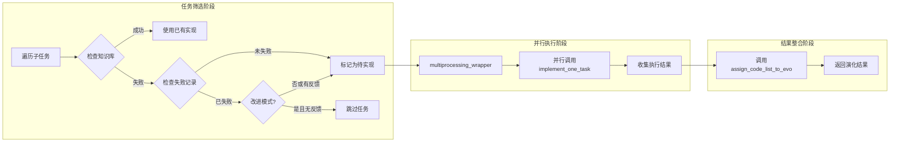

**图表来源**
- [evolving_strategy.py](file://rdagent/components/coder/CoSTEER/evolving_strategy.py#L70-L110)

### 改进模式机制

CoSTEER支持改进模式，只对之前失败的任务进行重新尝试：

| 模式 | 条件 | 行为 |
|------|------|------|
| 标准模式 | `improve_mode=False` | 对所有任务进行尝试 |
| 改进模式 | `improve_mode=True` | 只对失败任务重新尝试 |
| 跳过条件 | 无失败反馈或任务已完成 | 跳过该任务 |

**章节来源**
- [evolving_strategy.py](file://rdagent/components/coder/CoSTEER/evolving_strategy.py#L15-L30)

## EvolvableSubject设计

### EvolvingItem架构

`EvolvingItem`是CoSTEER中演化目标的核心表示：

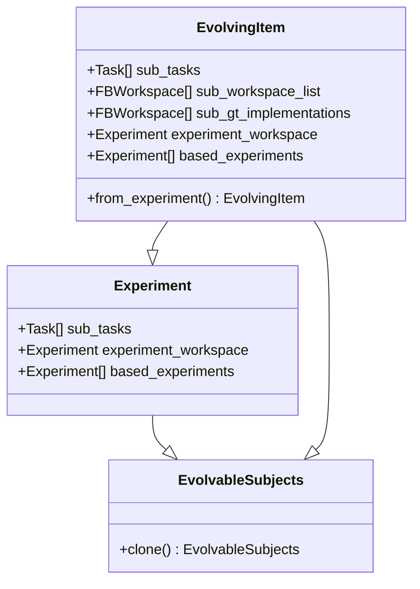

**图表来源**
- [evolvable_subjects.py](file://rdagent/components/coder/CoSTEER/evolvable_subjects.py#L5-L33)

### 子任务管理

EvolvingItem通过以下方式管理子任务：

| 属性 | 类型 | 描述 |
|------|------|------|
| `sub_tasks` | `list[Task]` | 子任务列表 |
| `sub_workspace_list` | `list[FBWorkspace]` | 子工作空间列表 |
| `sub_gt_implementations` | `list[FBWorkspace]` | 子任务参考实现 |
| `experiment_workspace` | `Experiment` | 实验工作空间 |

**章节来源**
- [evolvable_subjects.py](file://rdagent/components/coder/CoSTEER/evolvable_subjects.py#L5-L33)

## Evaluators评估机制

### 评估反馈体系

CoSTEER采用分层的评估反馈体系：

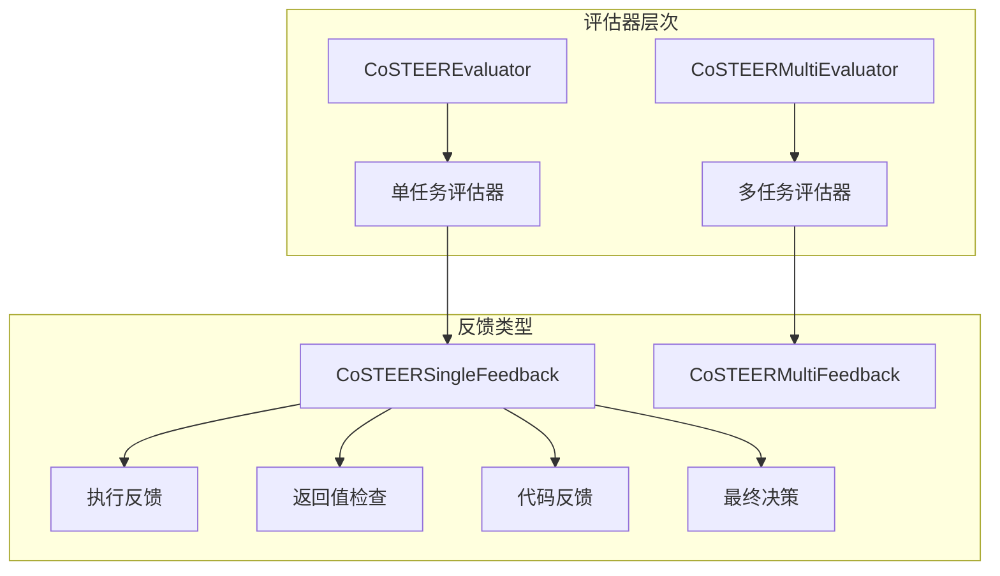

**图表来源**
- [evaluators.py](file://rdagent/components/coder/CoSTEER/evaluators.py#L20-L100)

### 单任务反馈结构

`CoSTEERSingleFeedback`包含完整的代码评估信息：

| 字段 | 类型 | 描述 |
|------|------|------|
| `execution` | `str` | 代码执行结果 |
| `return_checking` | `str \| None` | 返回值检查结果 |
| `code` | `str` | 代码内容 |
| `final_decision` | `bool \| None` | 最终评估决策 |

### 多任务反馈聚合

`CoSTEERMultiFeedback`负责聚合多个子任务的评估结果：

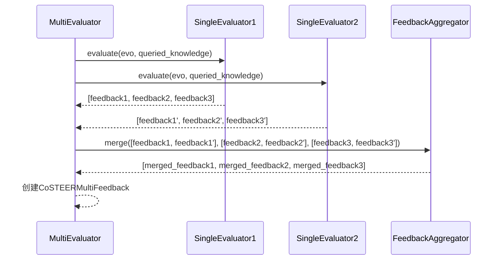

**图表来源**
- [evaluators.py](file://rdagent/components/coder/CoSTEER/evaluators.py#L250-L312)

**章节来源**
- [evaluators.py](file://rdagent/components/coder/CoSTEER/evaluators.py#L1-L312)

## 知识管理与迭代优化

### 知识库架构

CoSTEER采用分层的知识管理系统：

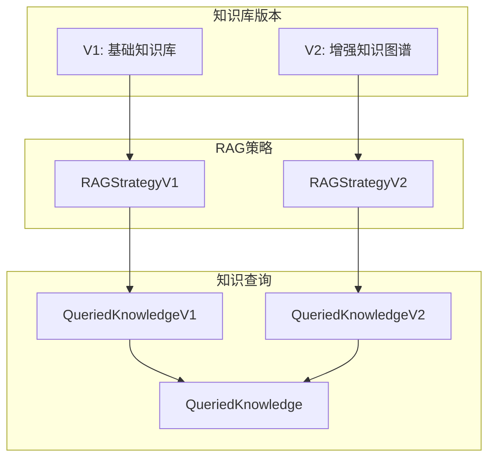

**图表来源**
- [knowledge_management.py](file://rdagent/components/coder/CoSTEER/knowledge_management.py#L50-L150)

### 知识查询策略

V2版本引入了更智能的知识查询策略：

| 查询类型 | 限制 | 描述 |
|----------|------|------|
| 组件查询 | `v2_query_component_limit` | 基于任务组件相似度查询 |
| 错误查询 | `v2_query_error_limit` | 基于错误类型相似度查询 |
| 历史查询 | `v2_query_former_trace_limit` | 基于历史失败轨迹查询 |
| 知识采样 | `v2_knowledge_sampler` | 随机采样减少计算量 |

### 迭代优化流程

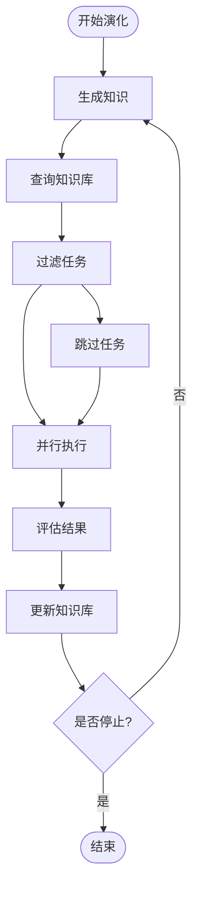

**图表来源**
- [knowledge_management.py](file://rdagent/components/coder/CoSTEER/knowledge_management.py#L300-L400)

**章节来源**
- [knowledge_management.py](file://rdagent/components/coder/CoSTEER/knowledge_management.py#L1-L964)

## 数据科学编码器实现

### 编码器类型架构

CoSTEER为不同的数据科学任务提供了专门的编码器：

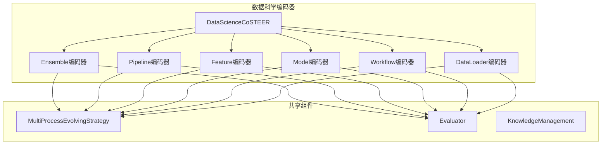

**图表来源**
- [ensemble/__init__.py](file://rdagent/components/coder/data_science/ensemble/__init__.py#L30-L50)
- [pipeline/__init__.py](file://rdagent/components/coder/data_science/pipeline/__init__.py#L30-L50)

### 具体实现差异

| 编码器 | 主要功能 | 实现特点 |
|--------|----------|----------|
| Ensemble | 集成学习模型 | 组合多个模型预测 |
| Pipeline | 数据处理流水线 | 端到端数据处理流程 |
| Feature | 特征工程 | 特征提取和变换 |
| Model | 机器学习模型 | 模型训练和调优 |
| Workflow | 工作流管理 | 复杂任务编排 |
| DataLoader | 数据加载器 | 数据预处理和加载 |

### 配置管理

数据科学编码器使用专门的配置类：

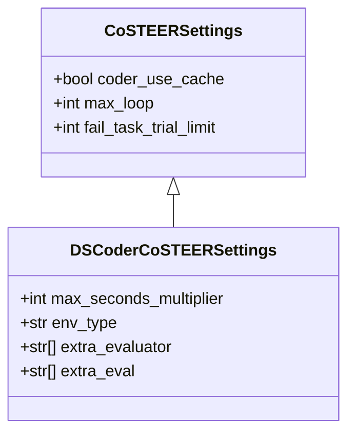

**图表来源**
- [config.py](file://rdagent/components/coder/CoSTEER/config.py#L5-L43)
- [data_science/conf.py](file://rdagent/components/coder/data_science/conf.py#L10-L30)

**章节来源**
- [ensemble/__init__.py](file://rdagent/components/coder/data_science/ensemble/__init__.py#L1-L165)
- [pipeline/__init__.py](file://rdagent/components/coder/data_science/pipeline/__init__.py#L1-L166)
- [data_science/conf.py](file://rdagent/components/coder/data_science/conf.py#L1-L88)

## 创建新演化策略指南

### 步骤1：继承基础类

创建新的演化策略需要继承`MultiProcessEvolvingStrategy`：

```python
class CustomMultiProcessEvolvingStrategy(MultiProcessEvolvingStrategy):
    def implement_one_task(
        self,
        target_task: Task,
        queried_knowledge: CoSTEERQueriedKnowledge | None = None,
        workspace: FBWorkspace | None = None,
        prev_task_feedback: CoSTEERSingleFeedback | None = None,
    ) -> dict[str, str]:
        # 实现具体的任务执行逻辑
        pass
        
    def assign_code_list_to_evo(self, code_list: list[dict], evo: EvolvingItem) -> None:
        # 将代码列表分配给演化项
        pass
```

### 步骤2：实现核心方法

#### implement_one_task实现要点

| 要素 | 要求 | 示例 |
|------|------|------|
| 输入验证 | 检查所有输入参数的有效性 | `assert target_task is not None` |
| 知识查询 | 利用`queried_knowledge`提升效率 | `similar_knowledge = queried_knowledge.get_similar()` |
| 代码生成 | 使用LLM或其他方法生成代码 | `code = generate_code(prompt)` |
| 结果验证 | 确保返回格式正确 | `assert isinstance(result, dict)` |
| 错误处理 | 提供有意义的错误信息 | `raise ValueError("Invalid task format")` |

#### assign_code_list_to_evo实现要点

```python
def assign_code_list_to_evo(self, code_list: list[dict[str, str]], evo: EvolvingItem) -> EvolvingItem:
    for index in range(len(evo.sub_tasks)):
        if code_list[index] is None:
            continue
        if evo.sub_workspace_list[index] is None:
            evo.sub_workspace_list[index] = evo.experiment_workspace
        evo.sub_workspace_list[index].inject_files(**code_list[index])
    return evo
```

### 步骤3：集成到CoSTEER系统

```python
class CustomCoSTEER(DSCoSTEER):
    def __init__(self, scen: Scenario, *args, **kwargs) -> None:
        settings = DSCoderCoSTEERSettings()
        eva = CoSTEERMultiEvaluator(CustomEvaluator(scen=scen), scen=scen)
        es = CustomMultiProcessEvolvingStrategy(scen=scen, settings=settings)
        
        super().__init__(
            *args,
            settings=settings,
            eva=eva,
            es=es,
            evolving_version=2,
            scen=scen,
            max_loop=DS_RD_SETTING.coder_max_loop,
            **kwargs,
        )
```

### 必须重写的方法

| 方法名 | 必需性 | 描述 |
|--------|--------|------|
| `implement_one_task` | 必需 | 实现单个任务的具体逻辑 |
| `assign_code_list_to_evo` | 必需 | 将代码分配给演化项 |
| `__init__` | 推荐 | 初始化策略特定的设置 |

### 最佳实践

1. **并发安全**：确保方法在多进程环境下安全
2. **错误处理**：提供详细的错误信息和恢复机制
3. **性能优化**：合理利用缓存和并行处理
4. **日志记录**：添加适当的调试和监控信息
5. **测试覆盖**：编写全面的单元测试和集成测试

**章节来源**
- [ensemble/__init__.py](file://rdagent/components/coder/data_science/ensemble/__init__.py#L30-L165)
- [pipeline/__init__.py](file://rdagent/components/coder/data_science/pipeline/__init__.py#L30-L166)

## 最佳实践与故障排除

### 性能优化建议

| 优化方向 | 建议措施 | 预期效果 |
|----------|----------|----------|
| 并行处理 | 合理设置`multi_proc_n`参数 | 提高处理速度3-5倍 |
| 知识缓存 | 启用`coder_use_cache` | 减少重复计算 |
| 内存管理 | 及时清理临时对象 | 降低内存占用 |
| 网络优化 | 使用本地LLM服务 | 减少网络延迟 |

### 常见问题与解决方案

| 问题类型 | 症状 | 解决方案 |
|----------|------|----------|
| 内存溢出 | 程序崩溃，内存不足 | 减少并行数量，增加内存限制 |
| 知识库查询慢 | 演化过程卡顿 | 优化查询算法，增加索引 |
| 代码生成失败 | 生成空代码或错误代码 | 调整提示词，增加验证步骤 |
| 评估不准确 | 反馈结果不稳定 | 增加评估器数量，改进评分标准 |

### 调试技巧

1. **启用详细日志**：设置合适的日志级别
2. **使用检查点**：定期保存演化状态
3. **监控资源使用**：跟踪CPU和内存消耗
4. **验证中间结果**：检查每步的输出质量

**章节来源**
- [config.py](file://rdagent/components/coder/CoSTEER/config.py#L1-L43)

## 总结

CoSTEER的`EvolvingStrategy`抽象基类设计体现了现代软件架构的最佳实践：

1. **清晰的抽象层次**：基类定义通用接口，子类实现具体逻辑
2. **强大的扩展性**：支持多种演化策略和场景
3. **高效的并行处理**：内置多进程支持，提升执行效率
4. **智能的知识管理**：基于知识图谱的迭代优化机制
5. **完善的评估体系**：多层次的反馈和评估机制

通过深入理解这些设计原理和实现细节，开发者可以：
- 创建适合自己需求的演化策略
- 优化现有策略的性能表现
- 扩展系统的功能边界
- 解决实际应用中的复杂问题

CoSTEER系统为智能化代码生成提供了一个强大而灵活的框架，其设计理念和实现方法值得在类似项目中借鉴和应用。