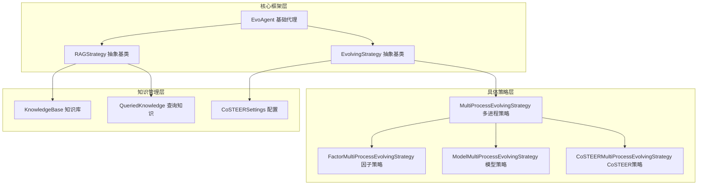
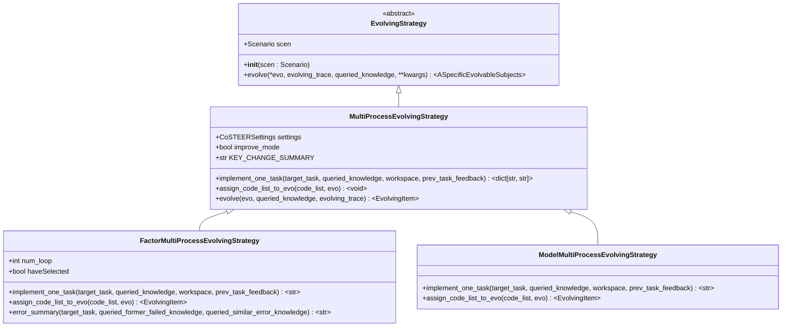
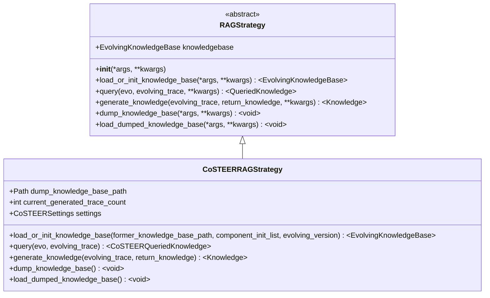
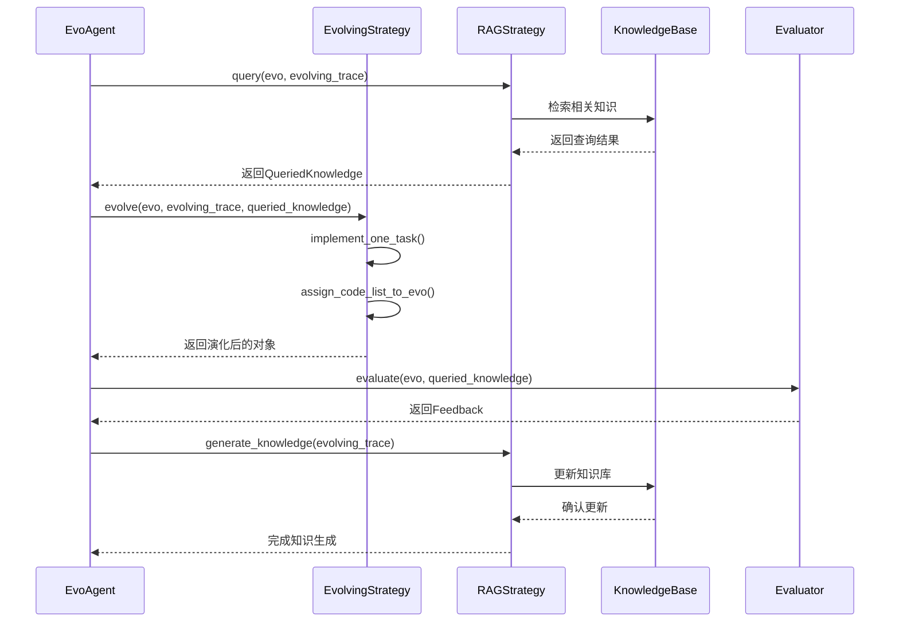
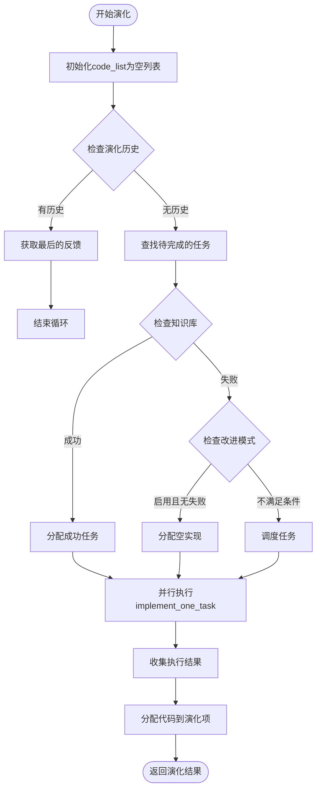
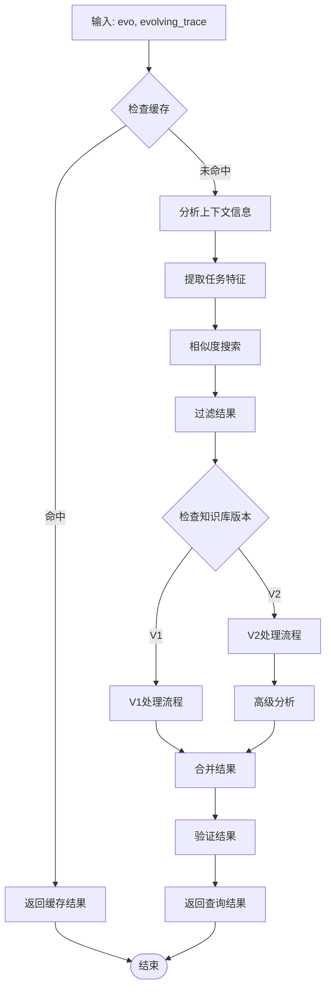
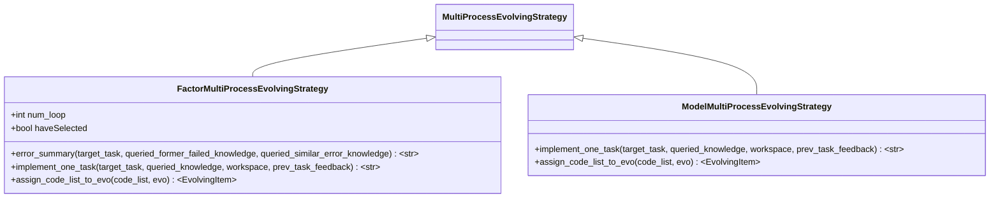
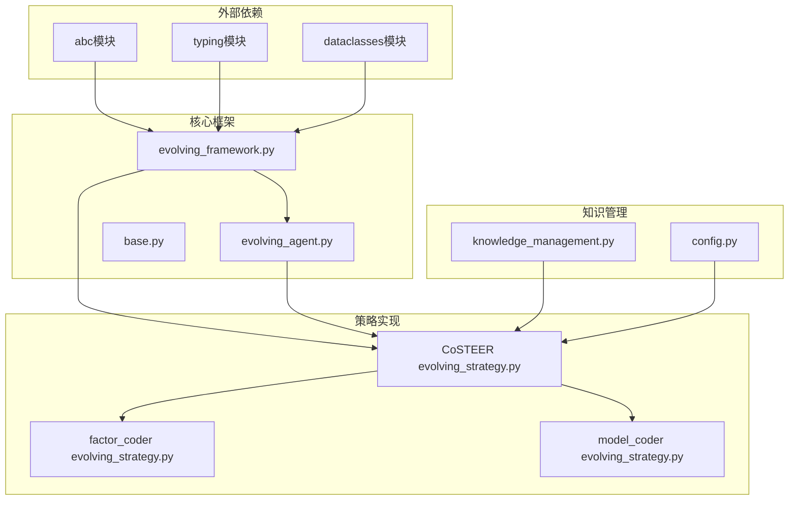

# 策略框架

<cite>
**本文档中引用的文件**
- [evolving_framework.py](file://rdagent/core/evolving_framework.py)
- [evolving_strategy.py](file://rdagent/components/coder/CoSTEER/evolving_strategy.py)
- [knowledge_management.py](file://rdagent/components/coder/CoSTEER/knowledge_management.py)
- [evolving_agent.py](file://rdagent/core/evolving_agent.py)
- [config.py](file://rdagent/components/coder/CoSTEER/config.py)
- [CoSTEER/__init__.py](file://rdagent/components/coder/CoSTEER/__init__.py)
- [factor_coder/evolving_strategy.py](file://rdagent/components/coder/factor_coder/evolving_strategy.py)
- [model_coder/evolving_strategy.py](file://rdagent/components/coder/model_coder/evolving_strategy.py)
</cite>

## 目录
1. [引言](#引言)
2. [项目结构概览](#项目结构概览)
3. [核心组件分析](#核心组件分析)
4. [架构概览](#架构概览)
5. [详细组件分析](#详细组件分析)
6. [依赖关系分析](#依赖关系分析)
7. [性能考虑](#性能考虑)
8. [故障排除指南](#故障排除指南)
9. [结论](#结论)

## 引言

`EvolvingStrategy`抽象基类是RD-Agent演化框架的核心组件，它定义了所有具体演化策略的通用接口和行为规范。该类作为演化算法的统一入口点，负责协调知识检索、代码生成和反馈评估等关键流程。通过继承和实现`EvolvingStrategy`，开发者可以创建自定义的演化策略，以适应不同的应用场景和问题域。

本文档深入分析了`EvolvingStrategy`的设计目标、核心方法接口、与`EvoAgent`的交互机制，以及与其他策略（如`RAGStrategy`）的关系。同时提供了完整的开发指南，帮助开发者理解如何正确继承和扩展该抽象基类。

## 项目结构概览

RD-Agent的策略框架采用分层架构设计，主要包含以下层次：

**图表来源**
- [evolving_framework.py](file://rdagent/core/evolving_framework.py#L59-L77)
- [evolving_strategy.py](file://rdagent/components/coder/CoSTEER/evolving_strategy.py#L20-L30)

**章节来源**
- [evolving_framework.py](file://rdagent/core/evolving_framework.py#L1-L128)
- [evolving_strategy.py](file://rdagent/components/coder/CoSTEER/evolving_strategy.py#L1-L135)

## 核心组件分析

### EvolvingStrategy抽象基类

`EvolvingStrategy`是整个演化框架的核心抽象基类，它定义了所有演化策略必须实现的基本接口：

**图表来源**
- [evolving_framework.py](file://rdagent/core/evolving_framework.py#L59-L77)
- [evolving_strategy.py](file://rdagent/components/coder/CoSTEER/evolving_strategy.py#L20-L30)
- [factor_coder/evolving_strategy.py](file://rdagent/components/coder/factor_coder/evolving_strategy.py#L18-L25)
- [model_coder/evolving_strategy.py](file://rdagent/components/coder/model_coder/evolving_strategy.py#L18-L25)

### RAGStrategy抽象基类

`RAGStrategy`实现了检索增强生成（Retrieval-Augmented Generation）策略，为演化过程提供智能知识支持：

**图表来源**
- [evolving_framework.py](file://rdagent/core/evolving_framework.py#L79-L127)
- [knowledge_management.py](file://rdagent/components/coder/CoSTEER/knowledge_management.py#L54-L79)

**章节来源**
- [evolving_framework.py](file://rdagent/core/evolving_framework.py#L59-L127)
- [knowledge_management.py](file://rdagent/components/coder/CoSTEER/knowledge_management.py#L54-L79)

## 架构概览

RD-Agent的策略框架采用模块化设计，通过清晰的职责分离实现高度可扩展性：

**图表来源**
- [evolving_agent.py](file://rdagent/core/evolving_agent.py#L82-L114)
- [evolving_framework.py](file://rdagent/core/evolving_framework.py#L79-L127)

## 详细组件分析

### EvolvingStrategy核心方法分析

#### evolve方法接口契约

`evolve`方法是`EvolvingStrategy`的核心抽象方法，定义了演化过程的标准接口：

| 参数名称 | 类型 | 描述 | 必需性 |
|---------|------|------|--------|
| `*evo` | `ASpecificEvolvableSubjects` | 可变参数，表示要演化的主体对象 | 必需 |
| `evolving_trace` | `list[EvoStep[ASpecificEvolvableSubjects]] \| None` | 演化历史记录，包含之前步骤的状态和反馈 | 可选 |
| `queried_knowledge` | `QueriedKnowledge \| None` | 从知识库查询到的相关知识 | 可选 |
| `**kwargs` | `Any` | 扩展参数，用于传递额外的配置信息 | 可选 |

返回值：`ASpecificEvolvableSubjects`类型，表示经过演化后的新主体对象。

#### 方法设计原理

`evolve`方法的设计遵循以下原则：
1. **通用性**：通过泛型参数支持不同类型的演化主体
2. **灵活性**：允许传入可选参数以适应不同的演化场景
3. **一致性**：确保所有具体策略都遵循相同的接口规范
4. **可扩展性**：通过kwargs参数支持未来功能扩展

### MultiProcessEvolvingStrategy多进程策略

`MultiProcessEvolvingStrategy`是`EvolvingStrategy`的具体实现，专门处理多任务并行演化：

**图表来源**
- [evolving_strategy.py](file://rdagent/components/coder/CoSTEER/evolving_strategy.py#L60-L134)

#### 关键特性

1. **并行处理**：使用`multiprocessing_wrapper`实现多任务并行执行
2. **改进模式**：支持仅对失败任务进行改进的优化模式
3. **动态调度**：根据知识库状态动态决定任务执行优先级
4. **错误处理**：提供完善的错误处理和重试机制

### RAGStrategy知识管理策略

#### query方法设计理念

`query`方法负责从知识库中检索相关信息，为演化过程提供智能指导：

**图表来源**
- [knowledge_management.py](file://rdagent/components/coder/CoSTEER/knowledge_management.py#L277-L320)

#### generate_knowledge方法设计

`generate_knowledge`方法负责基于演化历史生成新的知识，实现知识的自我进化：

| 版本 | 主要特性 | 知识类型 | 存储方式 |
|------|----------|----------|----------|
| V1 | 基础知识生成 | 成功案例、失败轨迹 | 字典映射 |
| V2 | 增强知识图谱 | 组件分析、错误分类 | 图数据库 |

**章节来源**
- [evolving_strategy.py](file://rdagent/components/coder/CoSTEER/evolving_strategy.py#L60-L134)
- [knowledge_management.py](file://rdagent/components/coder/CoSTEER/knowledge_management.py#L277-L320)

### 具体策略实现对比分析

#### FactorMultiProcessEvolvingStrategy vs ModelMultiProcessEvolvingStrategy

两种具体策略在实现细节上存在显著差异：

| 特性 | FactorMultiProcessEvolvingStrategy | ModelMultiProcessEvolvingStrategy |
|------|-----------------------------------|-----------------------------------|
| 错误处理 | 实现详细的错误总结机制 | 基础错误处理 |
| 代码格式 | JSON解析+正则提取 | JSON模式直接解析 |
| 提示词长度控制 | 动态调整策略 | 固定迭代次数 |
| 知识查询 | 支持错误知识检索 | 仅支持成功案例 |
| 工作空间管理 | 特殊的因子工作空间 | 标准模型工作空间 |

**图表来源**
- [factor_coder/evolving_strategy.py](file://rdagent/components/coder/factor_coder/evolving_strategy.py#L18-L25)
- [model_coder/evolving_strategy.py](file://rdagent/components/coder/model_coder/evolving_strategy.py#L18-L25)

**章节来源**
- [factor_coder/evolving_strategy.py](file://rdagent/components/coder/factor_coder/evolving_strategy.py#L18-L173)
- [model_coder/evolving_strategy.py](file://rdagent/components/coder/model_coder/evolving_strategy.py#L18-L89)

## 依赖关系分析

### 框架依赖图

**图表来源**
- [evolving_framework.py](file://rdagent/core/evolving_framework.py#L1-L15)
- [evolving_agent.py](file://rdagent/core/evolving_agent.py#L1-L15)

### 循环依赖检测

框架设计避免了循环依赖问题：
1. **单向依赖**：策略依赖于框架，但框架不依赖于具体策略
2. **接口隔离**：通过抽象基类实现松耦合设计
3. **职责分离**：每个模块都有明确的职责边界

**章节来源**
- [evolving_framework.py](file://rdagent/core/evolving_framework.py#L1-L128)
- [evolving_agent.py](file://rdagent/core/evolving_agent.py#L1-L116)

## 性能考虑

### 并行处理优化

多进程策略通过以下机制提升性能：

1. **任务分片**：将大任务分解为小任务并行处理
2. **资源池管理**：合理控制并发进程数量
3. **负载均衡**：动态分配任务避免资源浪费
4. **错误恢复**：提供完善的错误处理和重试机制

### 内存管理策略

1. **对象复制**：使用深拷贝避免副作用
2. **缓存机制**：智能缓存频繁访问的数据
3. **垃圾回收**：及时释放不再使用的资源
4. **内存监控**：提供内存使用情况的监控

### 知识库性能优化

1. **索引构建**：建立高效的搜索索引
2. **增量更新**：只更新变化的部分
3. **压缩存储**：使用压缩算法减少存储空间
4. **分布式缓存**：支持多节点共享知识库

## 故障排除指南

### 常见问题及解决方案

#### 策略继承问题

**问题**：继承`EvolvingStrategy`时忘记实现必需方法
**解决方案**：确保所有抽象方法都得到正确实现

**问题**：`evolve`方法签名不匹配
**解决方案**：严格遵循基类定义的参数类型和返回值要求

#### 知识库访问问题

**问题**：知识库查询超时
**解决方案**：优化查询算法或增加超时时间设置

**问题**：知识库损坏
**解决方案**：实现数据完整性检查和自动修复机制

#### 并行处理问题

**问题**：多进程死锁
**解决方案**：使用适当的同步机制和超时控制

**问题**：进程间通信失败
**解决方案**：实现可靠的序列化和反序列化机制

**章节来源**
- [evolving_strategy.py](file://rdagent/components/coder/CoSTEER/evolving_strategy.py#L60-L134)
- [knowledge_management.py](file://rdagent/components/coder/CoSTEER/knowledge_management.py#L54-L79)

## 结论

`EvolvingStrategy`抽象基类为RD-Agent的演化框架提供了坚实的基础架构。通过精心设计的接口和灵活的扩展机制，它成功地实现了以下目标：

1. **统一接口**：为所有演化策略提供一致的编程接口
2. **高度可扩展**：支持多种演化策略的并存和协作
3. **智能知识管理**：集成RAG技术实现智能化的演化过程
4. **性能优化**：通过并行处理和缓存机制提升效率
5. **易于维护**：清晰的职责分离和模块化设计

对于开发者而言，理解`EvolvingStrategy`的设计原理和实现细节，不仅有助于正确使用现有功能，更能为创建新的演化策略奠定坚实基础。随着AI技术的不断发展，这个框架将继续演进，为更复杂的演化任务提供支持。

未来的改进方向包括：
- 增强知识库的语义理解能力
- 支持更多的并行处理模式
- 提供更丰富的调试和监控工具
- 优化大规模数据集上的性能表现