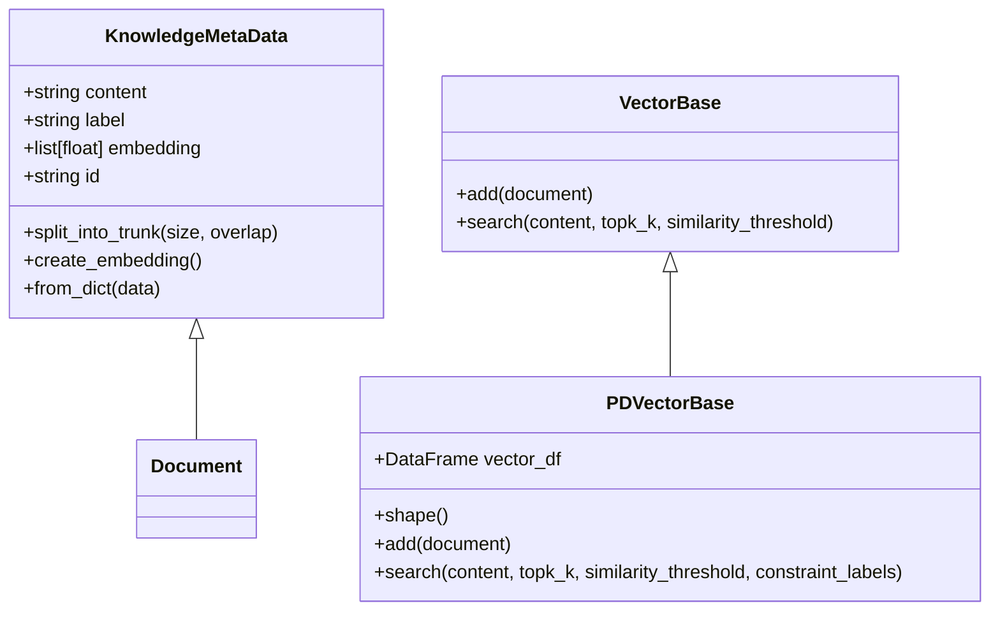
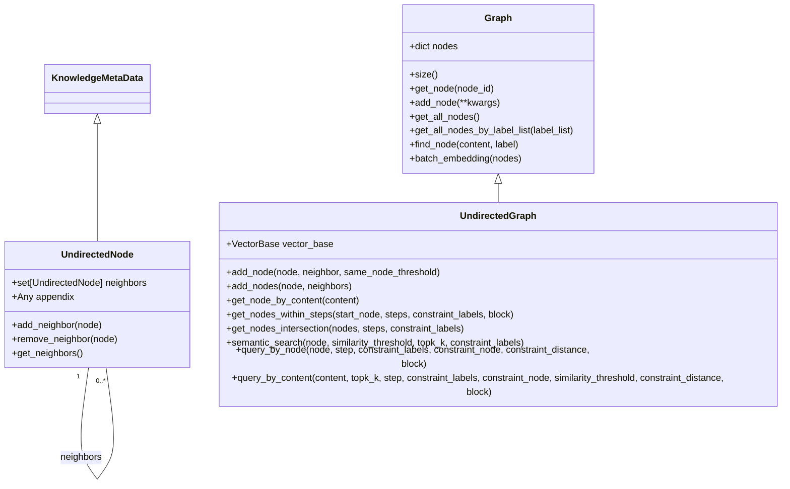
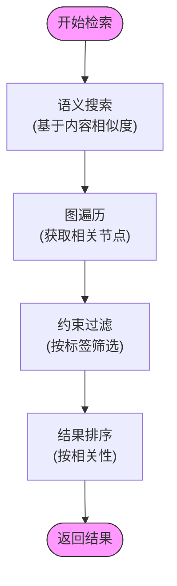
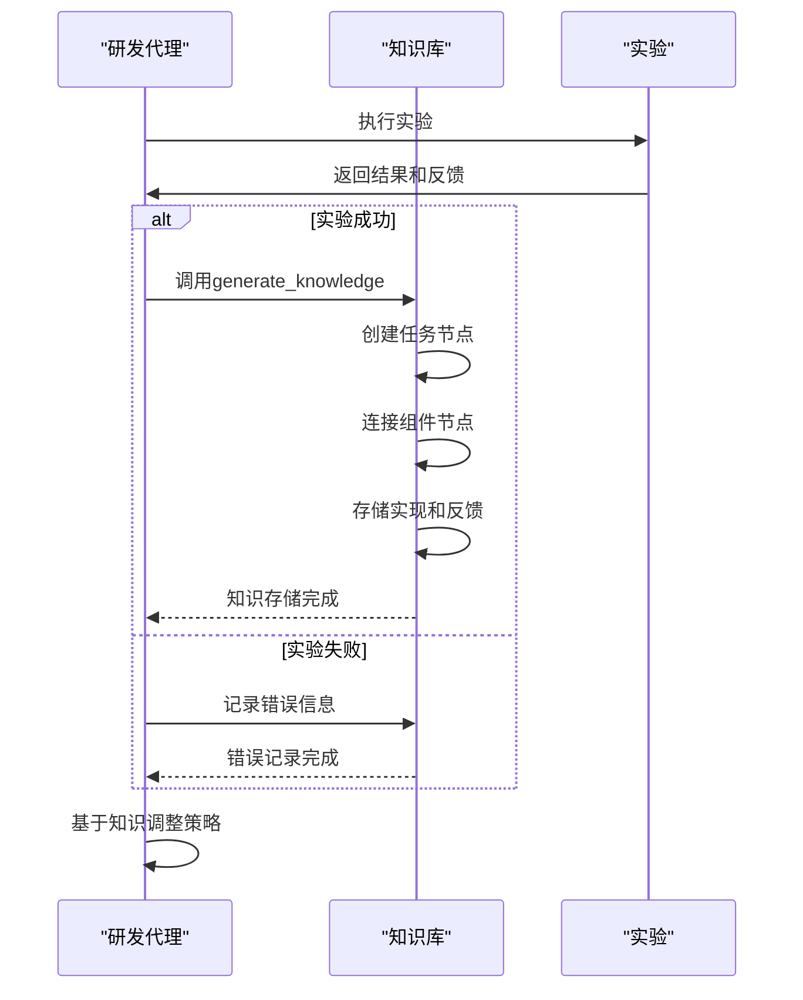
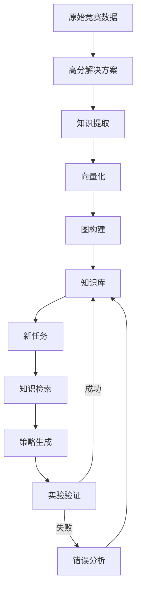

# RAG与知识管理

<cite>
**本文档引用的文件**
- [vector_base.py](file://rdagent/components/knowledge_management/vector_base.py) - *新增CoSTEERKnowledge和CoSTEERRAGStrategy类*
- [graph.py](file://rdagent/components/knowledge_management/graph.py) - *新增CoSTEERKnowledge和CoSTEERRAGStrategy类*
- [knowledge_management.py](file://rdagent/components/coder/CoSTEER/knowledge_management.py) - *新增CoSTEERKnowledge和CoSTEERRAGStrategy类*
- [extract_knowledge.py](file://rdagent/scenarios/kaggle/knowledge_management/extract_knowledge.py) - *新增CoSTEERKnowledge和CoSTEERRAGStrategy类*
- [proposal.py](file://rdagent/scenarios/kaggle/proposal/proposal.py) - *新增CoSTEERKnowledge和CoSTEERRAGStrategy类*
</cite>

## 更新摘要
**变更内容**
- 新增`CoSTEERKnowledge`类，用于封装完整的知识条目
- 新增`CoSTEERRAGStrategy`类，实现知识存储、检索和RAG策略
- 更新知识管理架构，支持版本化知识库管理
- 增强知识检索机制，支持组件和错误分析查询
- 完善知识反哺流程，提升研发效率

## 目录
1. [引言](#引言)
2. [RAG策略架构](#rag策略架构)
3. [向量数据库实现](#向量数据库实现)
4. [图数据库实现](#图数据库实现)
5. [知识检索机制](#知识检索机制)
6. [知识生成与反哺](#知识生成与反哺)
7. [量化策略场景应用](#量化策略场景应用)
8. [总结](#总结)

## 引言
检索增强生成（RAG）在RD-Agent中扮演着核心角色，通过结合向量数据库和图数据库来存储和检索历史实验知识。这种机制使系统能够避免重复错误并加速研发进程。本文将深入探讨`RAGStrategy`如何利用`vector_base.py`和`graph.py`来实现知识管理，并分析其在量化策略演化中的价值。

## RAG策略架构
RD-Agent中的RAG策略基于`RAGStrategy`抽象基类实现，该类定义了知识库加载、查询和生成的核心接口。`CoSTEERRAGStrategy`作为具体实现，继承了`RAGStrategy`并提供了版本化的知识库管理能力。

`RAGStrategy`的核心功能包括：
- `load_or_init_knowledge_base`：加载或初始化知识库
- `query`：根据当前任务查询相关知识
- `generate_knowledge`：将新的实验成果转化为知识并存储

系统支持两种知识库版本（V1和V2），其中V2版本引入了图结构来更好地表示知识间的关联关系。

**Section sources**
- [knowledge_management.py](file://rdagent/components/coder/CoSTEER/knowledge_management.py#L54-L79) - *新增CoSTEERKnowledge和CoSTEERRAGStrategy类*

## 向量数据库实现
向量数据库的实现位于`vector_base.py`文件中，主要由`VectorBase`和`PDVectorBase`类构成。该实现使用Pandas作为底层存储，并结合嵌入模型实现语义搜索。

### 核心组件
`KnowledgeMetaData`类是向量数据库的基础数据结构，包含以下属性：
- `content`：知识内容
- `label`：知识标签
- `embedding`：内容的向量嵌入
- `id`：基于内容生成的唯一标识

`PDVectorBase`类提供了向量存储的具体实现：
- `add`方法：将文档添加到向量数据库，自动创建嵌入
- `search`方法：基于语义相似度搜索相关文档
- `shape`方法：返回数据库的形状信息

**Diagram sources**
- [vector_base.py](file://rdagent/components/knowledge_management/vector_base.py#L1-L208) - *新增CoSTEERKnowledge和CoSTEERRAGStrategy类*

**Section sources**
- [vector_base.py](file://rdagent/components/knowledge_management/vector_base.py#L1-L208) - *新增CoSTEERKnowledge和CoSTEERRAGStrategy类*

## 图数据库实现
图数据库的实现位于`graph.py`文件中，基于`UndirectedGraph`和`UndirectedNode`类构建。该实现结合了向量搜索和图遍历能力，提供了更强大的知识检索功能。

### 节点结构
`UndirectedNode`继承自`KnowledgeMetaData`，增加了图结构相关的属性：
- `neighbors`：邻居节点集合
- `appendix`：附加信息存储

### 图操作
`UndirectedGraph`类提供了丰富的图操作方法：
- `add_node`：添加节点及其邻居关系
- `get_nodes_within_steps`：获取指定步数内的所有节点
- `semantic_search`：基于语义相似度的搜索
- `query_by_content`：结合语义搜索和图遍历的复合查询

**Diagram sources**
- [graph.py](file://rdagent/components/knowledge_management/graph.py#L0-L497) - *新增CoSTEERKnowledge和CoSTEERRAGStrategy类*

**Section sources**
- [graph.py](file://rdagent/components/knowledge_management/graph.py#L0-L497) - *新增CoSTEERKnowledge和CoSTEERRAGStrategy类*

## 知识检索机制
知识检索机制是RAG策略的核心，通过`query`方法实现。该机制结合了向量搜索和图遍历，能够根据当前任务从知识库中找到最相关的先验信息。

### 检索流程
1. **语义搜索**：首先使用`semantic_search`方法在向量空间中查找语义相似的节点
2. **图遍历**：然后使用`get_nodes_within_steps`方法沿图结构扩展搜索范围
3. **约束过滤**：通过`constraint_labels`参数限制结果的类型
4. **结果排序**：按相似度和连接关系对结果进行排序

### 复合查询
`query_by_content`方法提供了复合查询能力，能够同时考虑语义相似度和图结构关系。这对于复杂任务特别有用，例如：
- 查找与特定问题相关的成功案例
- 发现解决类似问题的不同方法
- 识别可能导致失败的错误模式

**Diagram sources**
- [graph.py](file://rdagent/components/knowledge_management/graph.py#L284-L315) - *新增CoSTEERKnowledge和CoSTEERRAGStrategy类*
- [knowledge_management.py](file://rdagent/components/coder/CoSTEER/knowledge_management.py#L790-L963) - *新增CoSTEERKnowledge和CoSTEERRAGStrategy类*

**Section sources**
- [graph.py](file://rdagent/components/knowledge_management/graph.py#L284-L315) - *新增CoSTEERKnowledge和CoSTEERRAGStrategy类*
- [knowledge_management.py](file://rdagent/components/coder/CoSTEER/knowledge_management.py#L790-L963) - *新增CoSTEERKnowledge和CoSTEERRAGStrategy类*

## 知识生成与反哺
知识生成与反哺机制通过`generate_knowledge`方法实现，将新的实验成果转化为结构化知识并存储到知识库中。

### 知识生成流程
1. **跟踪实验过程**：记录每个实验步骤的实现和反馈
2. **提取成功经验**：当任务成功完成时，将整个执行轨迹转化为知识
3. **构建知识图谱**：创建任务描述节点，并将其与组件节点、执行轨迹节点连接
4. **存储错误分析**：记录失败案例及其原因，避免重复错误

### 知识反哺
`update_success_task`方法负责将成功任务的知识反哺到知识库中：
- 创建任务描述节点
- 建立与相关组件节点的连接
- 存储完整的实现和反馈信息
- 维护节点到知识实例的映射

这种机制确保了知识库能够持续增长和进化，为未来的任务提供更有价值的参考。

**Diagram sources**
- [knowledge_management.py](file://rdagent/components/coder/CoSTEER/knowledge_management.py#L790-L963) - *新增CoSTEERKnowledge和CoSTEERRAGStrategy类*

**Section sources**
- [knowledge_management.py](file://rdagent/components/coder/CoSTEER/knowledge_management.py#L790-L963) - *新增CoSTEERKnowledge和CoSTEERRAGStrategy类*

## 量化策略场景应用
在量化策略研发场景中，知识管理机制发挥了重要作用，特别是在`rdagent/scenarios/qlib/knowledge_management/`中的具体用例。

### Kaggle知识库
Kaggle场景下的知识管理实现展示了RAG的实际应用：
- `extract_knowledge.py`：从高分答案中提取知识
- `vector_base.py`：实现向量搜索功能
- `graph.py`：构建知识图谱

### 知识提取流程
1. **数据收集**：从Kaggle竞赛中收集高分解决方案
2. **知识提取**：使用LLM分析并结构化知识
3. **向量化**：为知识内容创建嵌入向量
4. **图构建**：建立知识间的关联关系

### 应用价值
这种知识管理机制在量化策略演化中具有重要价值：
- **避免重复错误**：通过查询历史失败案例，避免重蹈覆辙
- **加速研发进程**：借鉴成功经验，快速迭代优化
- **创新启发**：结合不同领域的知识，激发创新思路
- **知识传承**：将专家经验系统化存储，实现知识传承

**Diagram sources**
- [extract_knowledge.py](file://rdagent/scenarios/kaggle/knowledge_management/extract_knowledge.py#L0-L64) - *新增CoSTEERKnowledge和CoSTEERRAGStrategy类*
- [proposal.py](file://rdagent/scenarios/kaggle/proposal/proposal.py#L57-L89) - *新增CoSTEERKnowledge和CoSTEERRAGStrategy类*

**Section sources**
- [extract_knowledge.py](file://rdagent/scenarios/kaggle/knowledge_management/extract_knowledge.py#L0-L64) - *新增CoSTEERKnowledge和CoSTEERRAGStrategy类*
- [proposal.py](file://rdagent/scenarios/kaggle/proposal/proposal.py#L57-L89) - *新增CoSTEERKnowledge和CoSTEERRAGStrategy类*

## 总结
RD-Agent中的RAG与知识管理机制通过结合向量数据库和图数据库，实现了高效的知识存储、检索和反哺。这种机制不仅能够避免重复错误，还能显著加速研发进程。

核心优势包括：
- **双重检索能力**：结合语义搜索和图遍历，提供更精准的知识检索
- **持续学习**：通过`generate_knowledge`机制，实现知识的持续积累和进化
- **结构化存储**：使用图结构表示知识间的关联，便于复杂查询
- **实际应用价值**：在量化策略等场景中，显著提升研发效率和质量

未来可以进一步优化的方向包括：
- 增强知识提取的自动化程度
- 优化图结构的构建算法
- 引入更多类型的知识源
- 提升检索效率和准确性

这种知识管理机制为AI驱动的研发代理提供了强大的认知基础，是实现持续学习和智能进化的关键组件。