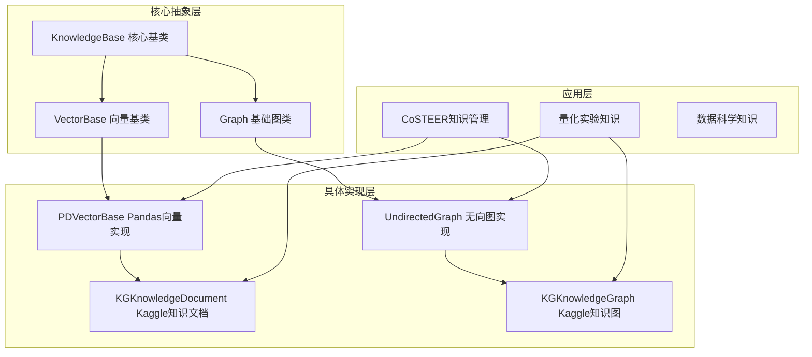
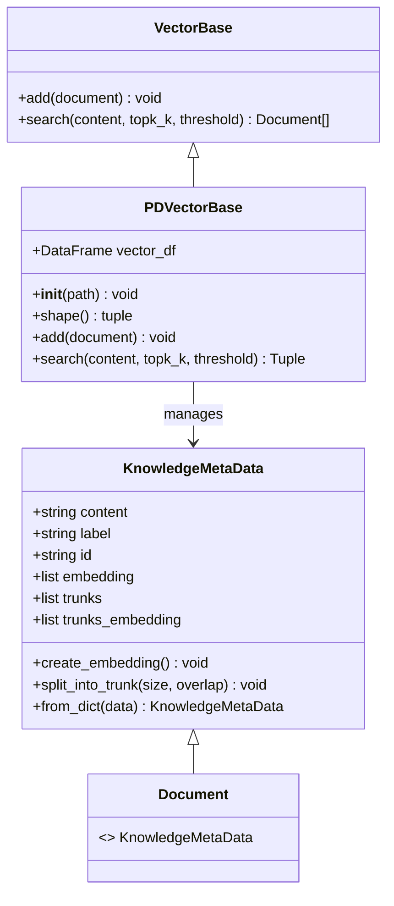
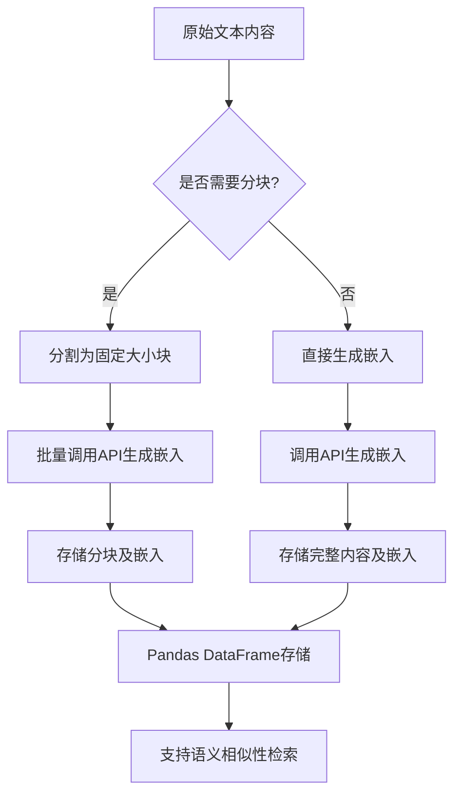
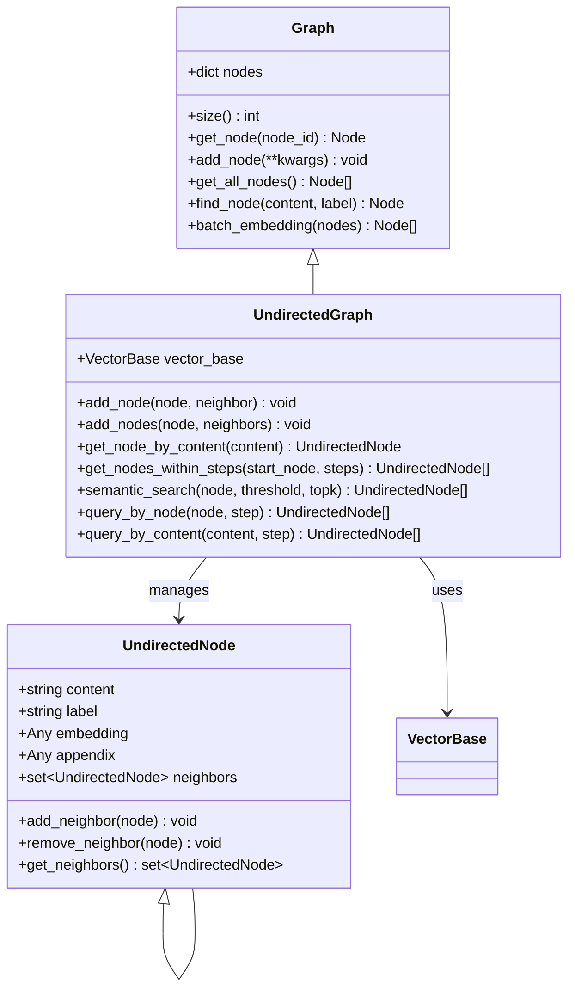
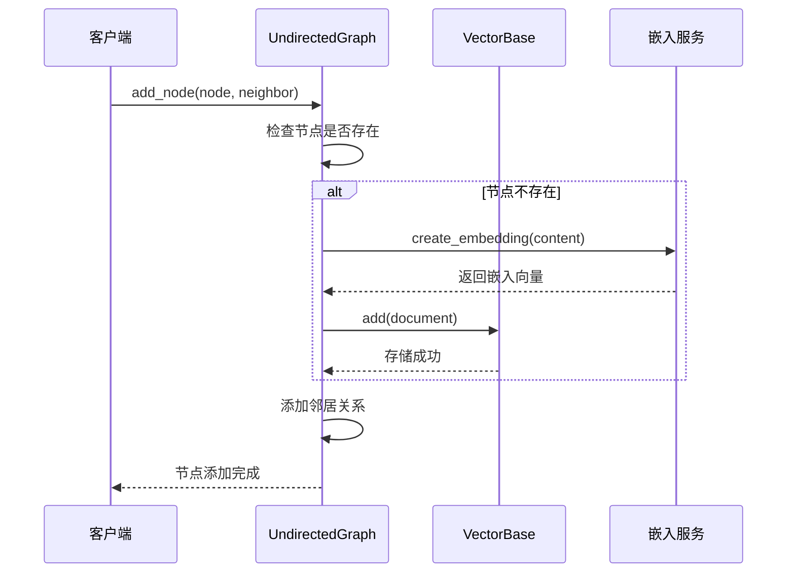
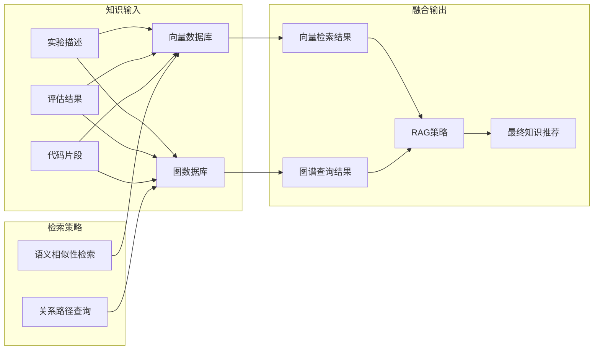
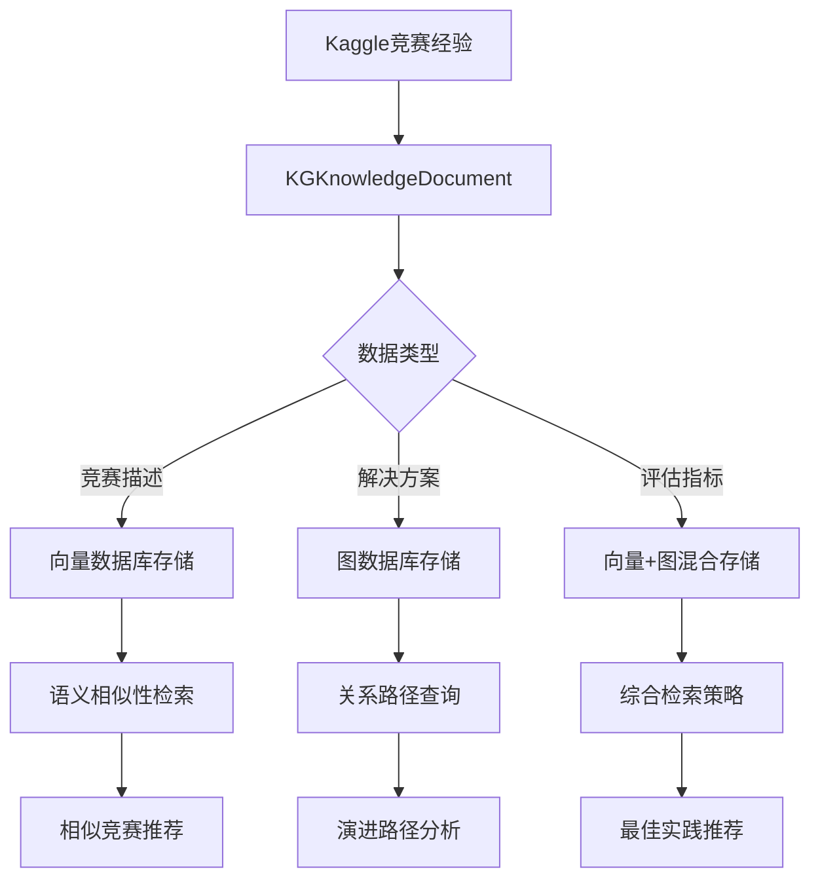

# 知识存储

<cite>
**本文档引用的文件**
- [vector_base.py](file://rdagent/components/knowledge_management/vector_base.py)
- [graph.py](file://rdagent/components/knowledge_management/graph.py)
- [kaggle_vector_base.py](file://rdagent/scenarios/kaggle/knowledge_management/vector_base.py)
- [kaggle_graph.py](file://rdagent/scenarios/kaggle/knowledge_management/graph.py)
- [knowledge_base.py](file://rdagent/core/knowledge_base.py)
- [costeer_knowledge_management.py](file://rdagent/components/coder/CoSTEER/knowledge_management.py)
- [README.md](file://rdagent/scenarios/kaggle/knowledge_management/README.md)
</cite>

## 目录
1. [引言](#引言)
2. [系统架构概览](#系统架构概览)
3. [向量数据库架构](#向量数据库架构)
4. [图数据库架构](#图数据库架构)
5. [双重存储机制协同工作](#双重存储机制协同工作)
6. [应用场景分析](#应用场景分析)
7. [性能优化策略](#性能优化策略)
8. [总结](#总结)

## 引言

RD-Agent采用了创新的双重知识存储架构，通过向量数据库和图数据库的有机结合，实现了高效的知识管理与检索。这种设计不仅支持传统的语义相似性检索，还能保留复杂的概念间关系，为RAG（检索增强生成）提供了坚实的基础。

该架构的核心优势在于：
- **语义理解**：通过向量嵌入捕捉知识的深层语义关系
- **结构化存储**：利用图数据库维护概念间的层次关系
- **高效检索**：结合两种存储方式的优势，提供多层次的知识检索
- **动态演化**：支持知识的持续积累和关系更新

## 系统架构概览

RD-Agent的知识存储系统采用分层架构设计，包含核心基类、具体实现和应用场景三个层次。

**图表来源**
- [knowledge_base.py](file://rdagent/core/knowledge_base.py#L1-L28)
- [vector_base.py](file://rdagent/components/knowledge_management/vector_base.py#L75-L99)
- [graph.py](file://rdagent/components/knowledge_management/graph.py#L50-L85)

**章节来源**
- [knowledge_base.py](file://rdagent/core/knowledge_base.py#L1-L28)
- [vector_base.py](file://rdagent/components/knowledge_management/vector_base.py#L1-L99)
- [graph.py](file://rdagent/components/knowledge_management/graph.py#L1-L85)

## 向量数据库架构

### 核心组件设计

向量数据库以`KnowledgeMetaData`为核心数据结构，支持文本内容的嵌入向量化和分块处理。

**图表来源**
- [vector_base.py](file://rdagent/components/knowledge_management/vector_base.py#L12-L45)
- [vector_base.py](file://rdagent/components/knowledge_management/vector_base.py#L75-L99)

### 嵌入向量化机制

系统支持两种嵌入生成策略：

1. **单文档嵌入**：直接对完整内容生成向量表示
2. **分块嵌入**：将长文档分割为固定大小的块，分别生成嵌入

**图表来源**
- [vector_base.py](file://rdagent/components/knowledge_management/vector_base.py#L18-L43)
- [vector_base.py](file://rdagent/components/knowledge_management/vector_base.py#L101-L140)

### 检索算法实现

向量数据库采用余弦相似度计算，支持多种检索策略：

| 检索参数 | 功能描述 | 默认值 | 使用场景 |
|---------|---------|--------|---------|
| content | 查询内容 | 必需 | 语义匹配查询 |
| topk_k | 返回结果数量 | None | 控制检索范围 |
| similarity_threshold | 相似度阈值 | 0 | 过滤低质量结果 |
| constraint_labels | 标签约束 | None | 类别过滤 |

**章节来源**
- [vector_base.py](file://rdagent/components/knowledge_management/vector_base.py#L101-L140)

## 图数据库架构

### 无向图节点模型

图数据库以`UndirectedNode`为核心，构建实验间的演化关系网络。

**图表来源**
- [graph.py](file://rdagent/components/knowledge_management/graph.py#L18-L44)
- [graph.py](file://rdagent/components/knowledge_management/graph.py#L85-L120)

### 关系图谱构建

图数据库支持多层级的关系查询，包括：

1. **直接邻居查询**：获取相邻节点
2. **距离限制查询**：在指定步数内查找节点
3. **交集查询**：获取多个节点共同连接的节点
4. **语义搜索**：基于内容相似度的节点查找

**图表来源**
- [graph.py](file://rdagent/components/knowledge_management/graph.py#L120-L180)

**章节来源**
- [graph.py](file://rdagent/components/knowledge_management/graph.py#L18-L180)

## 双重存储机制协同工作

### 协同工作机制

RD-Agent的双重存储架构通过以下方式实现协同工作：

**图表来源**
- [costeer_knowledge_management.py](file://rdagent/components/coder/CoSTEER/knowledge_management.py#L278-L350)

### 应用场景示例

#### Kaggle竞赛知识管理

Kaggle场景下的知识存储实现了专门化的双重架构：

**图表来源**
- [kaggle_vector_base.py](file://rdagent/scenarios/kaggle/knowledge_management/vector_base.py#L15-L50)
- [kaggle_graph.py](file://rdagent/scenarios/kaggle/knowledge_management/graph.py#L20-L60)

#### CoSTEER演化知识管理

在CoSTEER框架中，双重存储支持实验演化过程的知识管理：

| 存储类型 | 主要功能 | 数据内容 | 检索方式 |
|---------|---------|---------|---------|
| 向量数据库 | 语义相似性检索 | 实验描述、代码、结果 | 嵌入向量匹配 |
| 图数据库 | 关系路径查询 | 实验间依赖、继承关系 | 图遍历算法 |
| 混合模式 | 综合知识推荐 | 结构化知识、演化路径 | 多维度融合 |

**章节来源**
- [kaggle_vector_base.py](file://rdagent/scenarios/kaggle/knowledge_management/vector_base.py#L15-L100)
- [kaggle_graph.py](file://rdagent/scenarios/kaggle/knowledge_management/graph.py#L1-L60)
- [costeer_knowledge_management.py](file://rdagent/components/coder/CoSTEER/knowledge_management.py#L278-L400)

## 应用场景分析

### 场景一：Kaggle竞赛知识检索

在Kaggle竞赛场景中，系统能够：

1. **语义匹配**：根据问题描述找到相似的竞赛经验
2. **类别过滤**：按任务类型（分类、回归等）筛选相关经验
3. **评分参考**：考虑竞赛排名和得分进行排序
4. **上下文增强**：通过LLM进一步精炼检索结果

### 场景二：CoSTEER实验演化

在CoSTEER框架中，双重存储支持：

1. **失败追踪**：记录实验失败的原因和模式
2. **成功复现**：基于相似成功的实验进行指导
3. **错误分析**：通过错误节点图谱定位问题根源
4. **组件关联**：分析不同组件间的依赖关系

### 场景三：量化金融知识管理

在量化金融场景中，系统提供：

1. **因子知识库**：存储技术指标和因子构建方法
2. **模型演进**：记录模型改进的历史路径
3. **市场适应性**：基于历史表现的知识推荐
4. **风险控制**：通过关系图谱识别潜在风险模式

**章节来源**
- [kaggle_vector_base.py](file://rdagent/scenarios/kaggle/knowledge_management/vector_base.py#L250-L311)
- [costeer_knowledge_management.py](file://rdagent/components/coder/CoSTEER/knowledge_management.py#L400-L600)

## 性能优化策略

### 向量数据库优化

1. **批处理嵌入**：每次最多处理16个文本，平衡API限制和效率
2. **分块策略**：长文档自动分割，避免单次处理过大数据
3. **缓存机制**：已生成的嵌入向量进行持久化存储
4. **相似度计算**：使用余弦距离，计算效率高且准确

### 图数据库优化

1. **邻接表存储**：使用集合存储邻居关系，查找效率O(1)
2. **广度优先搜索**：支持指定步数内的节点查询
3. **交集优化**：利用集合操作快速计算节点交集
4. **坐标分配**：提供可视化支持，便于关系理解

### 检索性能优化

| 优化策略 | 实现方式 | 性能提升 | 适用场景 |
|---------|---------|---------|---------|
| 预计算嵌入 | 批量生成向量 | 减少实时计算开销 | 静态知识库 |
| 分层检索 | 先标签后语义 | 提高检索精度 | 大规模知识库 |
| 缓存策略 | 内存+磁盘缓存 | 减少重复计算 | 频繁访问场景 |
| 并行处理 | 多进程知识提取 | 加速大规模处理 | 批量知识导入 |

## 总结

RD-Agent的双重知识存储架构体现了现代AI系统设计的先进理念：

### 核心优势

1. **互补性**：向量数据库擅长语义理解，图数据库擅长关系建模
2. **灵活性**：支持多种应用场景和知识类型
3. **可扩展性**：模块化设计便于功能扩展
4. **实用性**：紧密结合实际业务需求

### 技术创新

- **混合存储**：首次在RAG系统中实现向量+图的双重存储
- **智能分块**：针对不同知识类型的分块策略
- **关系演化**：动态维护知识间的演化关系
- **多维度检索**：结合语义和结构的综合检索

### 应用价值

该架构为RD-Agent提供了强大的知识管理能力，支撑了从Kaggle竞赛到量化金融等多个复杂场景的应用，为AI Agent的智能化决策奠定了坚实的知识基础。

通过这种双重架构设计，RD-Agent不仅能够快速找到相似的知识，还能理解知识间的复杂关系，真正实现了"智能知识管理"的目标。