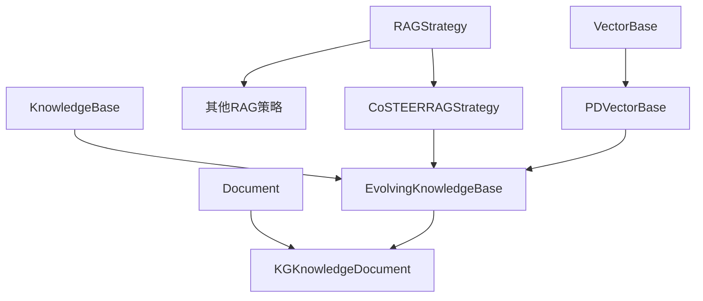
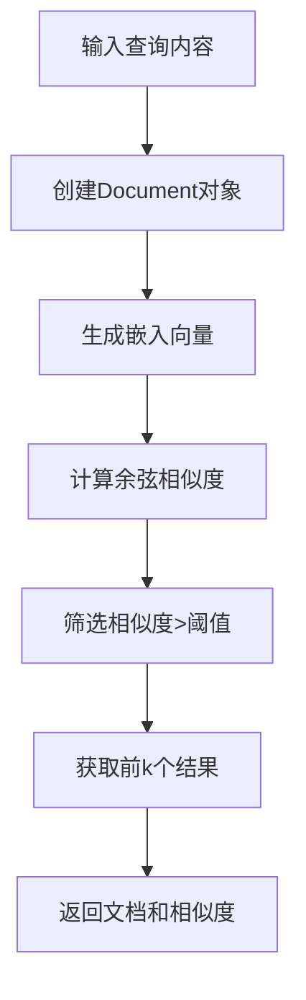
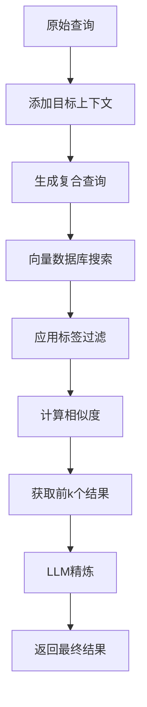
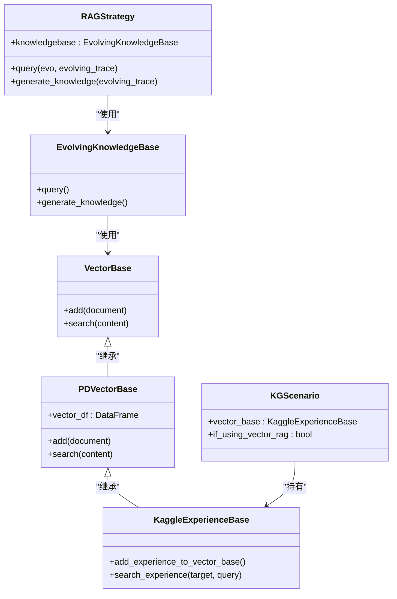

# 知识检索

<cite>
**本文档中引用的文件**  
- [RAGStrategy.query](file://rdagent/core/evolving_framework.py#L95-L101)
- [vector_base.py](file://rdagent/components/knowledge_management/vector_base.py#L167-L207)
- [KaggleExperienceBase.search_experience](file://rdagent/scenarios/kaggle/knowledge_management/vector_base.py#L215-L249)
- [KGScenario.vector_base](file://rdagent/scenarios/kaggle/experiment/scenario.py#L59)
- [generate_RAG_content](file://rdagent/scenarios/kaggle/proposal/proposal.py#L57-L89)
- [factor_proposal.py](file://rdagent/scenarios/qlib/proposal/factor_proposal.py#L34-L57)
</cite>

## 目录
1. [引言](#引言)
2. [知识检索架构](#知识检索架构)
3. [RAGStrategy.query方法实现机制](#ragstrategyquery方法实现机制)
4. [向量数据库检索流程](#向量数据库检索流程)
5. [因子提案场景中的知识检索应用](#因子提案场景中的知识检索应用)
6. [检索过滤与排序策略](#检索过滤与排序策略)
7. [知识检索系统组件关系](#知识检索系统组件关系)
8. [结论](#结论)

## 引言
知识检索系统是RD-Agent的核心组件之一，它通过检索增强生成（RAG）策略，将历史实验经验与当前研发任务相结合。该系统能够将当前`Experiment`的任务描述转换为嵌入向量，在向量数据库中执行相似性搜索，以定位历史中表现优异的相似实验。通过在因子提案场景中的应用，知识检索系统帮助新策略避免已知陷阱并借鉴成功模式，从而显著提升研发效率。

## 知识检索架构
知识检索系统采用分层架构设计，包含向量数据库、知识库和检索策略三个核心组件。系统通过`RAGStrategy`抽象基类定义了知识检索的标准接口，包括`query`、`generate_knowledge`等方法。具体的检索实现由子类完成，如`CoSTEERRAGStrategy`。向量数据库基于`PDVectorBase`实现，使用Pandas DataFrame存储文档及其嵌入向量，支持高效的相似性搜索。

**图源**  
- [evolving_framework.py](file://rdagent/core/evolving_framework.py#L80-L126)
- [vector_base.py](file://rdagent/components/knowledge_management/vector_base.py#L45-L99)

## RAGStrategy.query方法实现机制
`RAGStrategy.query`方法是知识检索系统的核心入口，定义在`rdagent/core/evolving_framework.py`中。该方法接收演化中的主体对象和演化轨迹作为输入，返回查询到的知识。作为抽象方法，它要求子类实现具体的检索逻辑。在Kaggle场景中，`KGScenario`类通过`vector_base`属性持有`KaggleExperienceBase`实例，该实例继承自`PDVectorBase`，提供了具体的向量搜索功能。

**本节来源**  
- [evolving_framework.py](file://rdagent/core/evolving_framework.py#L95-L101)
- [vector_base.py](file://rdagent/components/knowledge_management/vector_base.py#L167-L207)

## 向量数据库检索流程
向量数据库检索流程始于将查询内容转换为嵌入向量。系统使用`APIBackend().create_embedding`方法生成文本的嵌入表示。检索过程首先创建一个包含查询内容的`Document`对象，并为其生成嵌入向量。然后，在向量数据库中计算查询向量与所有存储向量的余弦相似度，筛选出相似度高于阈值的结果。最终返回前k个最相似的文档及其相似度分数。

**图源**  
- [vector_base.py](file://rdagent/components/knowledge_management/vector_base.py#L167-L207)

## 因子提案场景中的知识检索应用
在`rdagent/scenarios/qlib/`的因子提案场景中，知识检索系统通过`QlibFactorHypothesisGen`类实现。该类的`prepare_context`方法构建了包含历史假设和反馈的上下文，并根据演化历史阶段提供不同的RAG指导。在早期阶段（少于15轮），系统建议尝试最简单和最快的因子；在后期阶段，则建议尝试能实现高IC的机器学习因子。这种动态指导机制帮助研发过程从探索转向优化。

**本节来源**  
- [factor_proposal.py](file://rdagent/scenarios/qlib/proposal/factor_proposal.py#L34-L57)
- [quant_proposal.py](file://rdagent/scenarios/qlib/proposal/quant_proposal.py#L76-L96)

## 检索过滤与排序策略
检索过程中的过滤逻辑主要通过`constraint_labels`参数实现，该参数允许在搜索时指定标签约束，确保只返回特定类别的结果。在Kaggle场景中，`search_experience`方法通过修改查询来包含目标上下文，形成如"目标是{target}。我需要基于{target}查询{query}"的复合查询。排序策略基于余弦相似度，系统使用`nlargest`方法获取相似度最高的前k个结果。此外，系统还实现了LLM精炼机制，通过调用大语言模型对初步检索结果进行二次处理，提高检索质量。

**图源**  
- [vector_base.py](file://rdagent/scenarios/kaggle/knowledge_management/vector_base.py#L215-L249)
- [vector_base.py](file://rdagent/scenarios/kaggle/knowledge_management/vector_base.py#L251-L291)

## 知识检索系统组件关系
知识检索系统各组件之间存在紧密的协作关系。`RAGStrategy`作为策略接口，依赖`EvolvingKnowledgeBase`进行知识管理。`EvolvingKnowledgeBase`又依赖`VectorBase`进行向量存储和检索。在具体实现中，`KaggleExperienceBase`扩展了`PDVectorBase`，添加了Kaggle竞赛特有的元数据支持。`KGScenario`作为场景类，持有`vector_base`实例，将领域知识与检索系统连接起来。`generate_RAG_content`函数作为应用层接口，协调场景、轨迹和向量库，生成最终的RAG内容。

**图源**  
- [evolving_framework.py](file://rdagent/core/evolving_framework.py#L80-L126)
- [vector_base.py](file://rdagent/components/knowledge_management/vector_base.py#L127-L165)
- [scenario.py](file://rdagent/scenarios/kaggle/experiment/scenario.py#L59)

## 结论
知识检索系统通过`RAGStrategy.query`方法实现了高效的语义搜索能力。系统将`Experiment`的任务描述转换为嵌入向量，在向量数据库中执行相似性搜索，定位历史中表现优异的相似实验。在因子提案场景中，该系统通过动态的RAG指导，帮助新策略避免已知陷阱并借鉴成功模式。检索过程包含基于目标上下文的查询修改、标签过滤和基于余弦相似度的排序。通过LLM精炼机制，系统进一步提高了检索结果的相关性和质量，显著提升了研发效率。