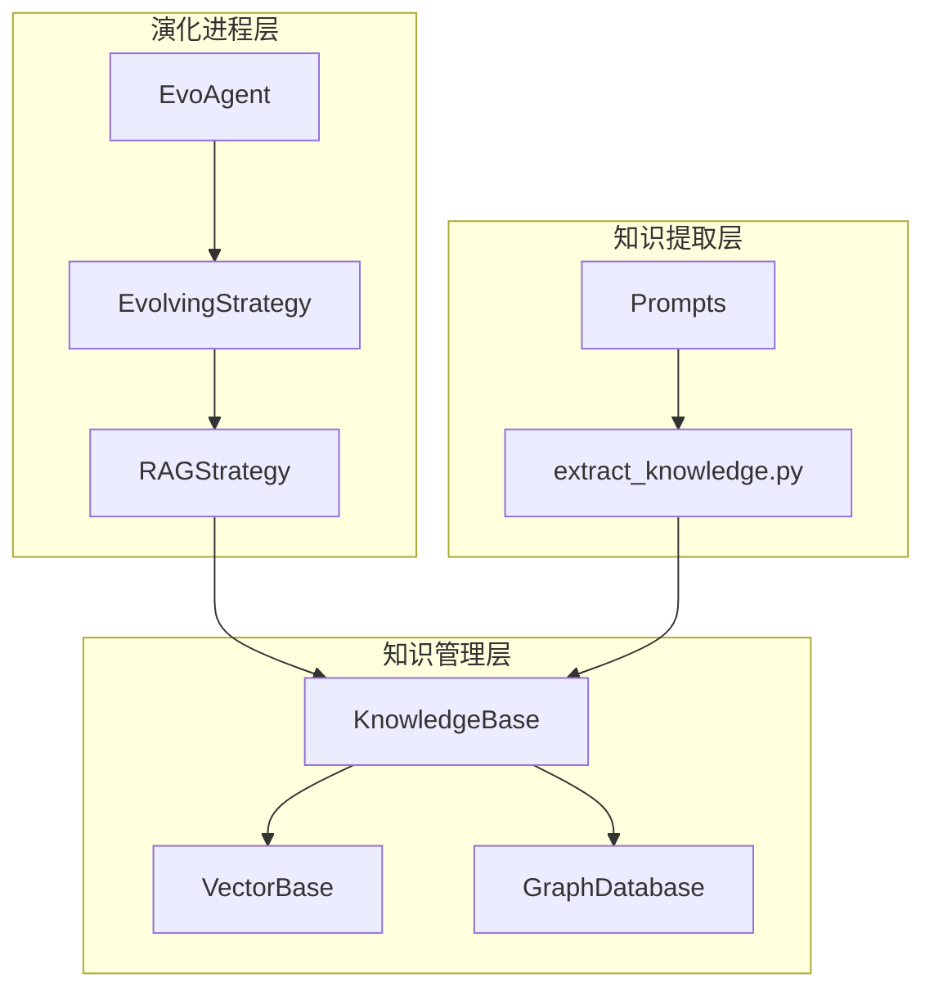
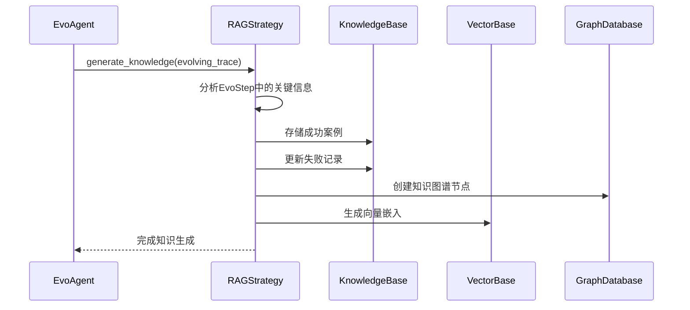
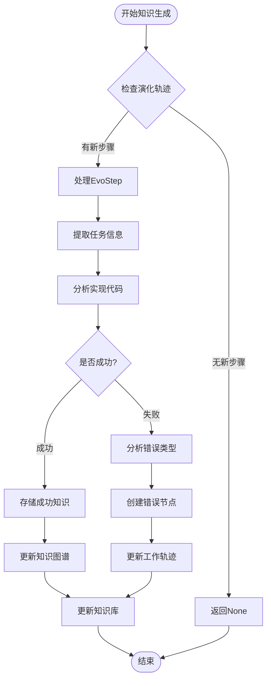
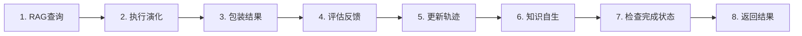
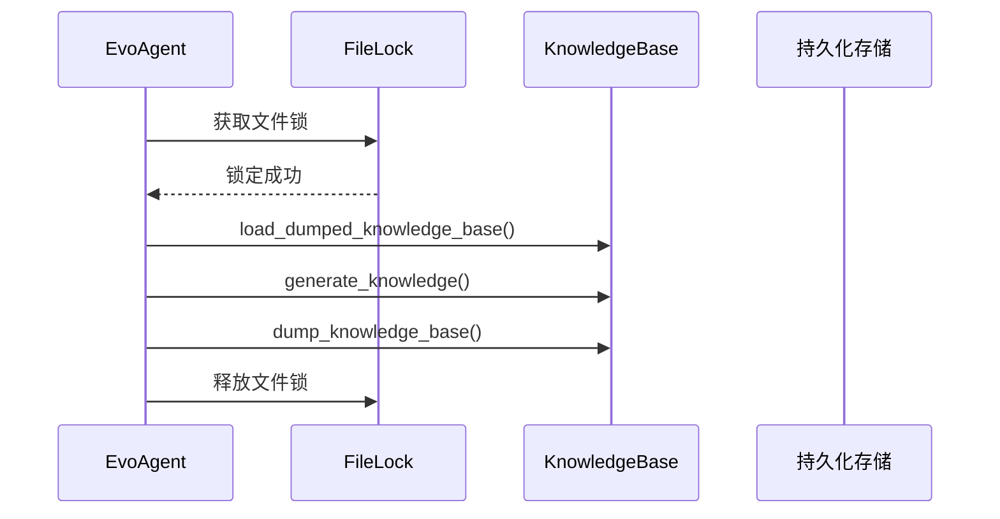
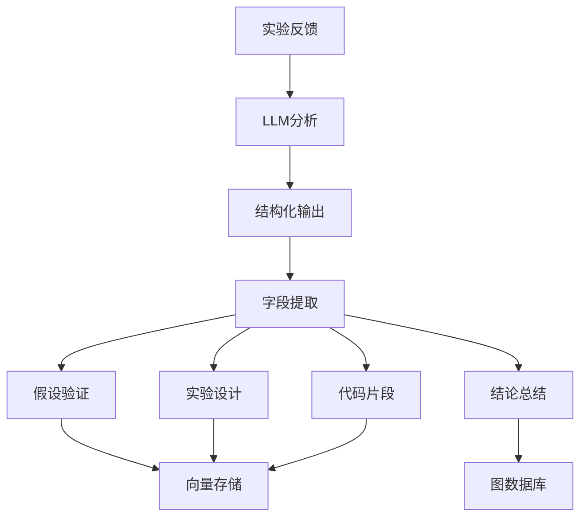
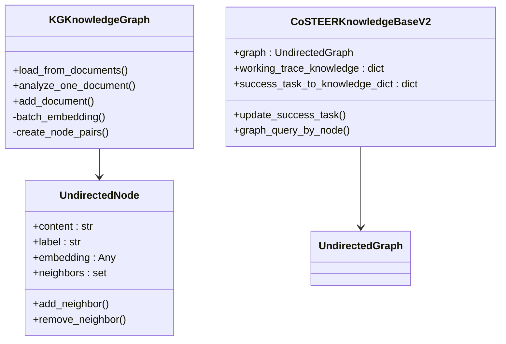
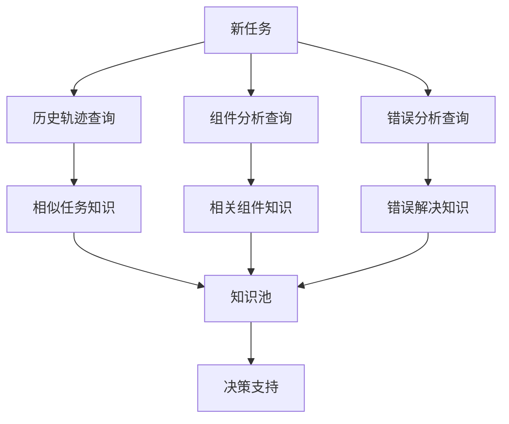
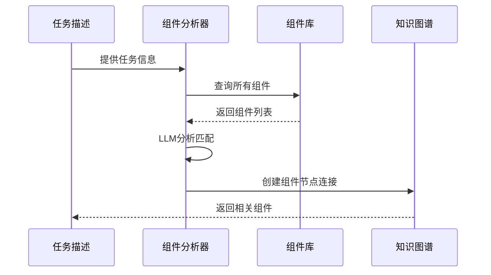
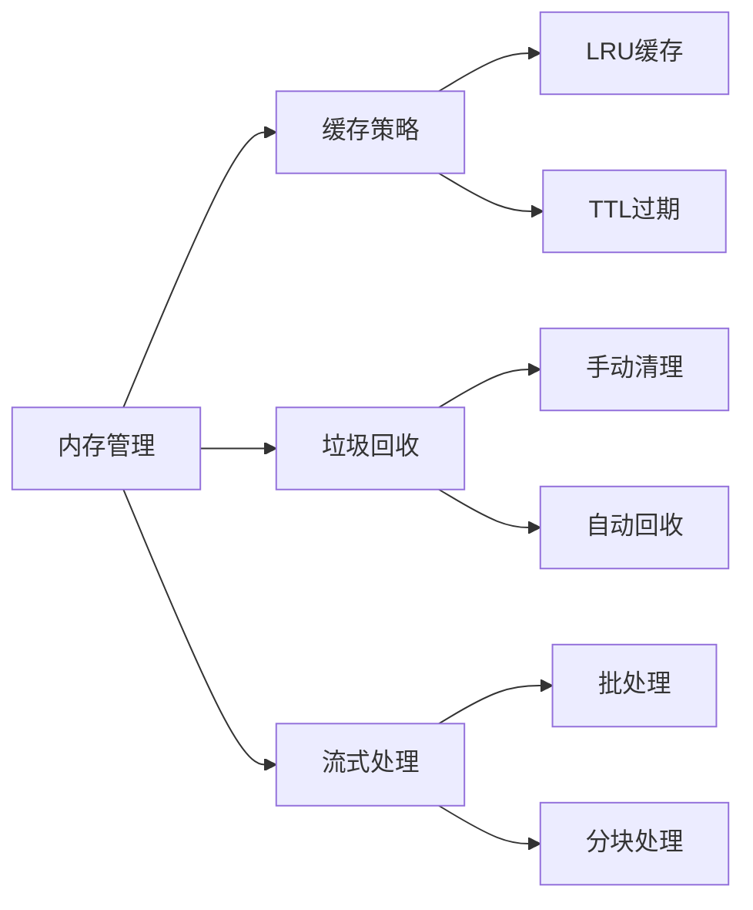

# 知识生成

<cite>
**本文档引用的文件**
- [evolving_agent.py](file://rdagent/core/evolving_agent.py)
- [evolving_framework.py](file://rdagent/core/evolving_framework.py)
- [knowledge_management.py](file://rdagent/components/coder/CoSTEER/knowledge_management.py)
- [extract_knowledge.py](file://rdagent/scenarios/kaggle/knowledge_management/extract_knowledge.py)
- [vector_base.py](file://rdagent/scenarios/kaggle/knowledge_management/vector_base.py)
- [graph.py](file://rdagent/scenarios/kaggle/knowledge_management/graph.py)
- [knowledge_base.py](file://rdagent/core/knowledge_base.py)
- [config.py](file://rdagent/components/coder/CoSTEER/config.py)
- [__init__.py](file://rdagent/components/coder/CoSTEER/__init__.py)
</cite>

## 目录
1. [引言](#引言)
2. [系统架构概述](#系统架构概述)
3. [核心组件分析](#核心组件分析)
4. [知识生成闭环流程](#知识生成闭环流程)
5. [知识提取规则](#知识提取规则)
6. [图数据库与向量库集成](#图数据库与向量库集成)
7. [持续进化机制](#持续进化机制)
8. [性能优化策略](#性能优化策略)
9. [故障排除指南](#故障排除指南)
10. [总结](#总结)

## 引言

RD-Agent系统通过构建一个完整的知识生成闭环，实现了从经验中学习的智能进化机制。该系统的核心在于`RAGStrategy.generate_knowledge`方法，它在`EvoAgent`完成每一轮演化后，自动提取`EvoStep`中的关键信息，并将其结构化地存储到向量库和图数据库中。这种机制使得整个系统能够不断积累经验，形成知识图谱，从而实现持续的智能进化。

## 系统架构概述

RD-Agent的知识生成系统采用分层架构设计，包含以下主要层次：

**图表来源**
- [evolving_agent.py](file://rdagent/core/evolving_agent.py#L48-L114)
- [knowledge_management.py](file://rdagent/components/coder/CoSTEER/knowledge_management.py#L263-L758)

**章节来源**
- [evolving_agent.py](file://rdagent/core/evolving_agent.py#L1-L114)
- [knowledge_management.py](file://rdagent/components/coder/CoSTEER/knowledge_management.py#L1-L964)

## 核心组件分析

### EvoAgent与RAGStrategy协作

EvoAgent是系统的核心执行器，负责协调整个演化过程。当启用知识自生功能时，EvoAgent会在每次演化完成后调用RAGStrategy进行知识生成。

**图表来源**
- [evolving_agent.py](file://rdagent/core/evolving_agent.py#L82-L114)
- [knowledge_management.py](file://rdagent/components/coder/CoSTEER/knowledge_management.py#L263-L301)

### CoSTEERRAGStrategyV2核心算法

CoSTEERRAGStrategyV2是知识生成的核心策略类，它实现了复杂的知识提取和存储逻辑：

**图表来源**
- [knowledge_management.py](file://rdagent/components/coder/CoSTEER/knowledge_management.py#L263-L301)

**章节来源**
- [knowledge_management.py](file://rdagent/components/coder/CoSTEER/knowledge_management.py#L263-L758)

## 知识生成闭环流程

### 演化循环中的知识生成触发点

知识生成在EvoAgent的演化循环中被精确控制，在第6步执行：

**图表来源**
- [evolving_agent.py](file://rdagent/core/evolving_agent.py#L82-L114)

### 文件锁保护机制

为确保多进程环境下的数据一致性，系统使用文件锁保护知识库的读写操作：

**图表来源**
- [evolving_agent.py](file://rdagent/core/evolving_agent.py#L95-L100)

**章节来源**
- [evolving_agent.py](file://rdagent/core/evolving_agent.py#L82-L114)

## 知识提取规则

### extract_knowledge.py中的提取规则

extract_knowledge.py定义了从不同来源提取知识的规则和流程：

#### 高分答案知识提取

系统通过LLM分析高分竞赛答案，提取结构化知识：

| 提取维度 | 描述 | 输出格式 |
|---------|------|----------|
| 竞赛名称 | 参与的Kaggle竞赛名称 | 字符串 |
| 任务类别 | 问题类型（分类/回归等） | 枚举值 |
| 领域标签 | 技术领域（特征工程/建模等） | 字符串列表 |
| 排名信息 | 最终排名和分数 | 数值型 |
| 实体关系 | 知识图谱实体和关系 | 结构化JSON |

#### 反馈知识提取

从实验反馈中提取可重用的知识：

**图表来源**
- [extract_knowledge.py](file://rdagent/scenarios/kaggle/knowledge_management/extract_knowledge.py#L8-L30)

**章节来源**
- [extract_knowledge.py](file://rdagent/scenarios/kaggle/knowledge_management/extract_knowledge.py#L1-L65)

## 图数据库与向量库集成

### 知识图谱构建

系统通过KGKnowledgeGraph类构建动态的知识图谱：

**图表来源**
- [graph.py](file://rdagent/scenarios/kaggle/knowledge_management/graph.py#L18-L115)
- [knowledge_management.py](file://rdagent/components/coder/CoSTEER/knowledge_management.py#L761-L839)

### 向量基存储

KaggleExperienceBase提供向量化的知识存储能力：

| 存储属性 | 类型 | 描述 |
|---------|------|------|
| content | str | 知识内容文本 |
| label | str | 知识标签 |
| embedding | ndarray | 向量嵌入 |
| competition_name | str | 竞赛名称 |
| task_category | str | 任务类别 |
| field | str | 领域分类 |
| ranking | int/str | 排名信息 |
| score | float | 成绩分数 |

**章节来源**
- [vector_base.py](file://rdagent/scenarios/kaggle/knowledge_management/vector_base.py#L1-L312)
- [graph.py](file://rdagent/scenarios/kaggle/knowledge_management/graph.py#L1-L116)

## 持续进化机制

### 知识累积与传播

系统通过多层次的知识查询策略实现知识的累积和传播：

**图表来源**
- [knowledge_management.py](file://rdagent/components/coder/CoSTEER/knowledge_management.py#L303-L320)

### 组件分析机制

系统通过自然语言描述的任务信息，自动匹配相关的技术组件：

**图表来源**
- [knowledge_management.py](file://rdagent/components/coder/CoSTEER/knowledge_management.py#L322-L345)

### 错误知识管理

系统对执行错误和值检查错误进行分类处理：

| 错误类型 | 处理方式 | 存储位置 |
|---------|----------|----------|
| 执行错误 | 解析堆栈信息，提取错误类型和行号 | 图数据库错误节点 |
| 值检查错误 | 正则表达式匹配，标准化错误描述 | 图数据库错误节点 |
| 未识别错误 | 创建通用错误节点 | 图数据库错误节点 |

**章节来源**
- [knowledge_management.py](file://rdagent/components/coder/CoSTEER/knowledge_management.py#L347-L390)

## 性能优化策略

### 并行处理与缓存

系统采用多种策略优化知识生成性能：

1. **多进程处理**：使用multiprocessing_wrapper并行分析文档
2. **向量化搜索**：批量创建嵌入向量，提高搜索效率
3. **知识采样**：通过v2_knowledge_sampler参数控制知识数量
4. **增量更新**：只处理新的演化步骤，避免重复计算

### 内存管理

**章节来源**
- [vector_base.py](file://rdagent/scenarios/kaggle/knowledge_management/vector_base.py#L200-L250)

## 故障排除指南

### 常见问题与解决方案

#### 知识生成失败

**问题症状**：知识生成过程中断或产生错误

**可能原因**：
1. LLM响应解析失败
2. 文件锁冲突
3. 知识库路径不存在

**解决方案**：
- 检查LLM API连接状态
- 验证文件锁路径权限
- 确认知识库目录存在

#### 知识检索不准确

**问题症状**：查询返回的相关度低

**可能原因**：
1. 嵌入向量质量差
2. 相似度阈值设置不当
3. 知识图谱节点稀疏

**解决方案**：
- 调整相似度阈值参数
- 增加训练数据量
- 优化知识图谱结构

**章节来源**
- [knowledge_management.py](file://rdagent/components/coder/CoSTEER/knowledge_management.py#L141-L176)

## 总结

RD-Agent的知识生成闭环系统通过精心设计的架构和算法，实现了从经验中学习的智能进化机制。系统的核心优势包括：

1. **自动化知识提取**：通过RAGStrategy自动从演化过程中提取关键知识
2. **多模态知识存储**：结合向量库和图数据库，提供丰富的知识表示形式
3. **智能知识查询**：基于组件分析、错误匹配等多种策略的知识检索
4. **持续进化能力**：通过知识累积实现系统的自我改进和优化

这种知识生成机制不仅提高了系统的智能化水平，还为未来的AI研究提供了宝贵的经验积累平台。随着知识库的不断增长，系统将展现出更强的学习能力和适应性，真正实现"从经验中学习"的目标。