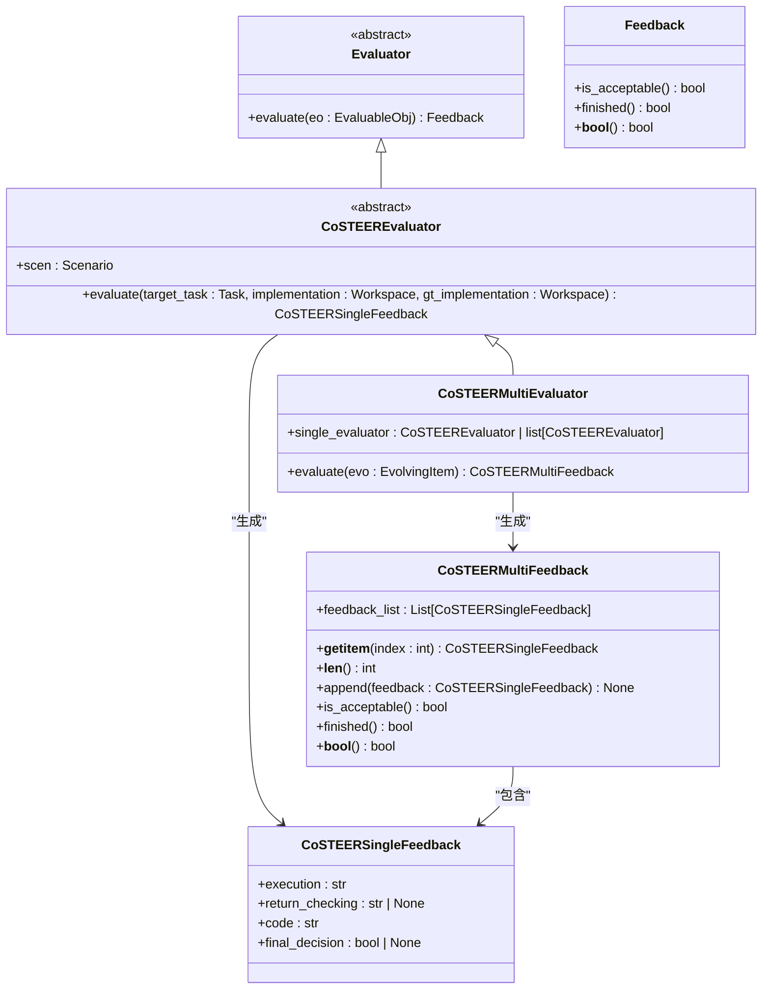
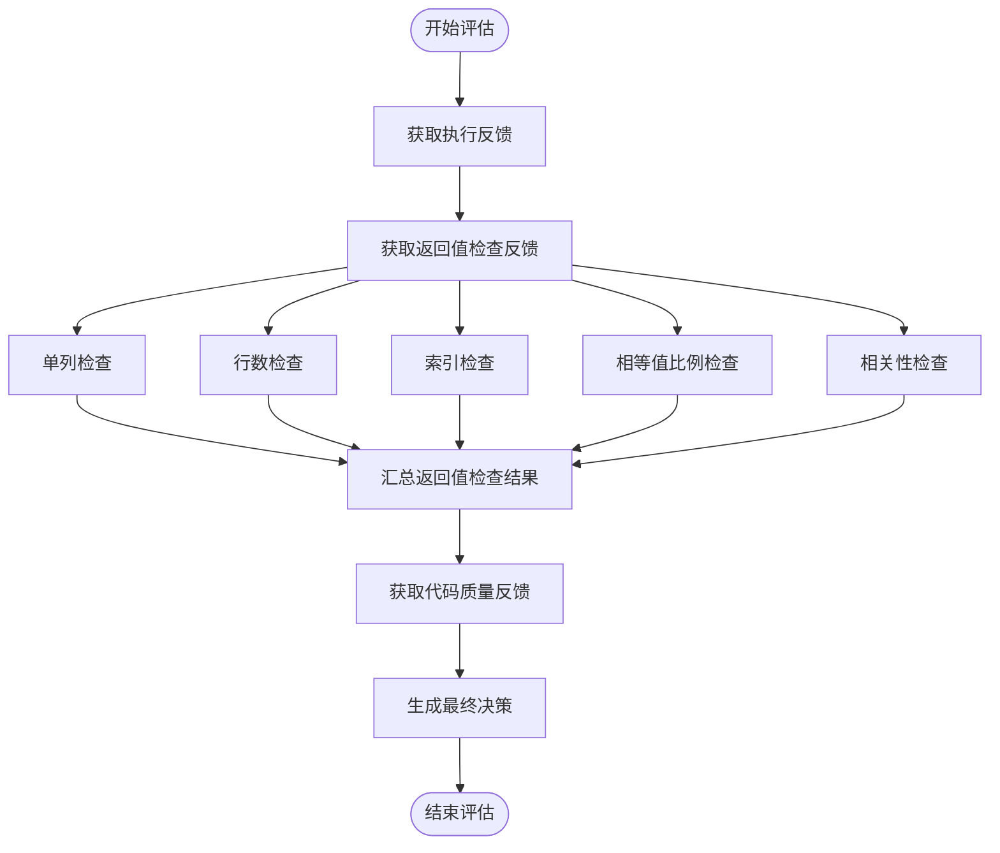
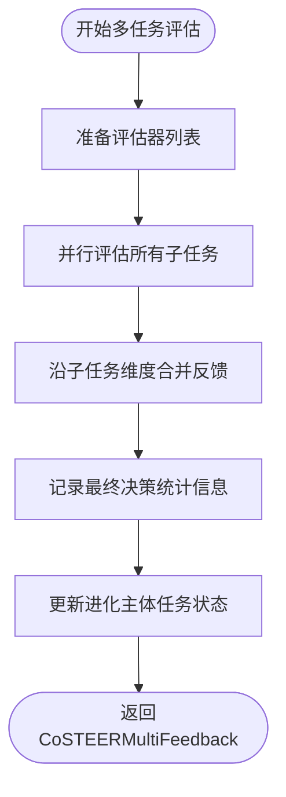
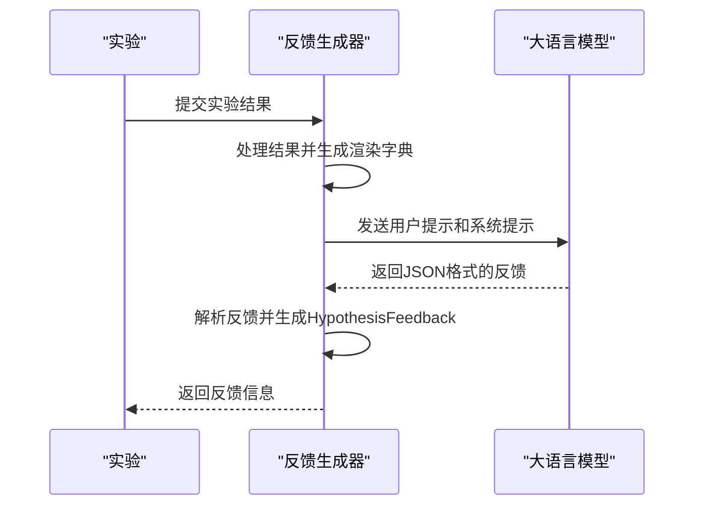

# 反馈与评估

<cite>
**本文档中引用的文件**  
- [evaluation.py](file://rdagent/core/evaluation.py) - *更新了反馈与评估框架*
- [evaluators.py](file://rdagent/components/coder/CoSTEER/evaluators.py) - *重构为四阶段评估流程并支持多任务并行评估*
- [CoSTEERMultiEvaluator.evaluate](file://rdagent/components/coder/CoSTEER/evaluators.py#L513-L629) - *新增多任务并行评估支持*
- [CoSTEERSingleFeedback](file://rdagent/components/coder/CoSTEER/evaluators.py#L47-L173) - *重构为四阶段评估设计*
- [CoSTEERMultiFeedback](file://rdagent/components/coder/CoSTEER/evaluators.py#L248-L384) - *新增多任务反馈容器*
- [FactorEvaluatorForCoder](file://rdagent/components/coder/factor_coder/evaluators.py#L19-L119) - *重构为四阶段评估流程*
- [kaggle_experiment.py](file://rdagent/scenarios/kaggle/experiment/kaggle_experiment.py) - *支持多任务并行评估*
- [scenario.py](file://rdagent/scenarios/kaggle/experiment/scenario.py) - *更新评估指标设计原则*
</cite>

## 更新摘要
**变更内容**   
- 将原有的三阶段评估流程重构为四阶段评估流程（执行、返回值检查、代码、最终决策）
- 新增多任务并行评估支持，通过`CoSTEERMultiEvaluator`实现
- 重构`CoSTEERSingleFeedback`数据结构，明确四阶段反馈字段
- 新增`CoSTEERMultiFeedback`容器类，支持多任务反馈管理
- 更新Kaggle竞赛场景下的闭环优化流程，支持多任务并行评估

## 目录
1. [引言](#引言)
2. [评估框架与核心组件](#评估框架与核心组件)
3. [四阶段评估流程](#四阶段评估流程)
4. [多任务并行评估机制](#多任务并行评估机制)
5. [反馈生成机制](#反馈生成机制)
6. [Kaggle竞赛场景下的闭环优化](#kaggle竞赛场景下的闭环优化)
7. [评估指标设计原则](#评估指标设计原则)
8. [结论](#结论)

## 引言
RD-Agent的反馈与评估机制是其闭环优化系统的核心组成部分。该机制通过定义明确的评估标准和流程，对代码执行结果进行系统性评估，并从中提取有价值的反馈信息，用于指导后续的演化过程。本文将详细阐述`Evaluation`类如何定义评估标准和流程，以及`eval_method.py`中提供的具体评估方法。同时，我们将以Kaggle竞赛场景为例，展示从代码执行、结果评估到生成反馈的完整链条。

## 评估框架与核心组件

RD-Agent的评估框架基于抽象基类`Evaluator`和数据类`Feedback`构建，形成了一个可扩展的评估体系。`Evaluator`作为抽象基类，定义了评估的核心接口，而具体的评估逻辑则由其子类实现。



**图示来源**
- [evaluation.py](file://rdagent/core/evaluation.py#L79-L109)
- [evaluators.py](file://rdagent/components/coder/CoSTEER/evaluators.py#L387-L461)
- [evaluators.py](file://rdagent/components/coder/CoSTEER/evaluators.py#L464-L629)
- [evaluators.py](file://rdagent/components/coder/CoSTEER/evaluators.py#L47-L173)
- [evaluators.py](file://rdagent/components/coder/CoSTEER/evaluators.py#L248-L384)

**本节来源**
- [evaluation.py](file://rdagent/core/evaluation.py#L79-L109)
- [evaluators.py](file://rdagent/components/coder/CoSTEER/evaluators.py#L387-L461)
- [evaluators.py](file://rdagent/components/coder/CoSTEER/evaluators.py#L464-L629)

## 四阶段评估流程

RD-Agent的评估流程采用四阶段、多维度的评估策略，确保评估结果的全面性和准确性。以因子编码（factor_coder）为例，评估流程主要分为四个阶段：执行、返回值检查、代码和最终决策。

### 执行
执行阶段主要检查代码执行过程中的输出和异常。系统会捕获代码执行的stdout，并过滤掉警告信息，形成执行反馈。这有助于识别代码运行时的错误和潜在问题。

### 返回值检查
返回值检查是评估的核心环节，主要通过`FactorValueEvaluator`类实现。该类会执行生成的代码和基准代码，获取各自的输出数据框（DataFrame），并进行多维度的比较。比较的维度包括：
- **单列检查**：验证生成的因子是否只包含一列。
- **行数检查**：验证生成的因子行数是否与基准一致。
- **索引检查**：验证生成的因子索引是否与基准一致。
- **相等值比例检查**：计算生成的因子与基准因子相等值的比例。
- **相关性检查**：计算生成的因子与基准因子的相关性（IC或Rank IC）。



**图示来源**
- [eva_utils.py](file://rdagent/components/coder/factor_coder/eva_utils.py#L102-L493)
- [evaluators.py](file://rdagent/components/coder/factor_coder/evaluators.py#L66-L85)

**本节来源**
- [eva_utils.py](file://rdagent/components/coder/factor_coder/eva_utils.py#L102-L493)
- [evaluators.py](file://rdagent/components/coder/factor_coder/evaluators.py#L66-L85)

### 代码
代码质量检查阶段主要通过`FactorCodeEvaluator`类实现。该类会分析生成的代码内容，检查代码风格、逻辑正确性、可读性等质量指标。代码反馈不仅包括具体的代码问题，还包括改进建议。

### 最终决策
最终决策由`FactorFinalDecisionEvaluator`类生成。该类会综合执行反馈、返回值检查反馈和代码反馈，通过大语言模型（LLM）生成最终的评估结果。决策逻辑如下：
1. 如果生成的因子值与基准因子值在小容差范围内完全相同，则认为实现正确。
2. 如果生成的因子值与基准因子值具有高相关性（IC或Rank IC），则认为实现正确。
3. 如果未提供基准因子值，则认为代码执行成功即为正确实现。

## 多任务并行评估机制

RD-Agent引入了`CoSTEERMultiEvaluator`类来支持多任务并行评估。该类能够同时评估多个子任务，显著提高评估效率。

### 并行评估流程
`CoSTEERMultiEvaluator`的评估流程包含两个主要阶段：
1. **并行评估阶段**：使用多进程并行评估每个子任务
2. **反馈聚合阶段**：将多个评估器的结果合并为统一的多任务反馈



**图示来源**
- [evaluators.py](file://rdagent/components/coder/CoSTEER/evaluators.py#L513-L629)

**本节来源**
- [evaluators.py](file://rdagent/components/coder/CoSTEER/evaluators.py#L513-L629)

### 多任务反馈容器
`CoSTEERMultiFeedback`类作为多任务反馈容器，提供了以下核心功能：
- **容器式设计**：支持索引、迭代、长度等标准容器操作
- **灵活的任务管理**：支持动态添加新的反馈
- **智能完成判断**：区分"可接受"和"已完成"两种状态
- **None值容忍**：能够处理跳过的任务（None反馈）

```python
class CoSTEERMultiFeedback(Feedback):
    """
    CoSTEER多任务反馈容器

    该类用于管理多个子任务的反馈结果，每个元素对应一个子任务的实现反馈。
    主要用于多任务并行评估场景，如多个因子实现、多个模型训练等。

    核心特性：
    - 容器式设计：支持索引、迭代、长度等标准容器操作
    - 灵活的任务管理：支持动态添加新的反馈
    - 智能完成判断：区分"可接受"和"已完成"两种状态
    - None值容忍：能够处理跳过的任务（None反馈）

    使用场景：
    - 量化因子开发：同时评估多个因子的实现质量
    - 模型集成开发：评估多个子模型的训练结果
    - 数据科学流程：评估数据处理流水线的各个步骤

    Attributes:
        feedback_list: CoSTEERSingle反馈列表，每个元素对应一个子任务的反馈
    """
```

**本节来源**
- [evaluators.py](file://rdagent/components/coder/CoSTEER/evaluators.py#L248-L384)

## 反馈生成机制

反馈生成机制是连接评估结果与后续演化的桥梁。系统通过`KGExperiment2Feedback`类生成反馈，该类会综合当前实验结果、基准实验结果和历史反馈，生成详细的反馈信息。



**图示来源**
- [feedback.py](file://rdagent/scenarios/kaggle/developer/feedback.py#L57-L138)

**本节来源**
- [feedback.py](file://rdagent/scenarios/kaggle/developer/feedback.py#L57-L138)

## Kaggle竞赛场景下的闭环优化

在Kaggle竞赛场景下，RD-Agent的闭环优化过程如下：
1. **代码执行**：系统执行生成的代码，获取模型准确率、因子IC值等执行结果。
2. **结果评估**：系统根据预定义的评估标准，对执行结果进行评估，生成评估反馈。
3. **反馈生成**：系统综合评估反馈和历史信息，生成指导性的反馈，用于指导下一轮演化。

以Kaggle竞赛为例，系统会根据竞赛的评估指标（如准确率、AUC等）对模型性能进行评估，并将评估结果与历史最佳结果进行比较。如果新模型性能优于历史最佳，则更新历史最佳结果；否则，根据反馈信息调整模型参数或特征工程策略，进行下一轮演化。

## 评估指标设计原则

评估指标的设计遵循以下原则：
- **可量化**：评估指标必须是可量化的，以便于系统进行自动化评估。
- **相关性**：评估指标必须与任务目标高度相关，确保评估结果的有效性。
- **可解释性**：评估指标必须具有良好的可解释性，便于开发者理解和分析。
- **鲁棒性**：评估指标必须具有良好的鲁棒性，能够抵御噪声和异常值的影响。

## 结论
RD-Agent的反馈与评估机制通过四阶段、多维度的评估策略，确保了评估结果的全面性和准确性。该机制不仅能够有效评估代码执行结果，还能生成有价值的反馈信息，用于指导后续的演化过程。在Kaggle竞赛场景下，该机制展现了强大的闭环优化能力，为自动化机器学习提供了有力支持。