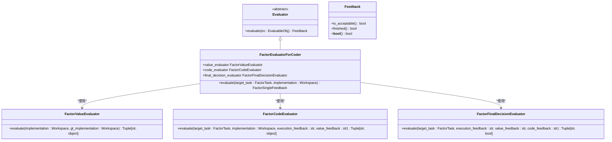
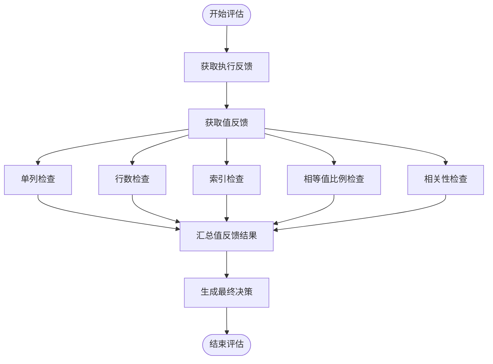
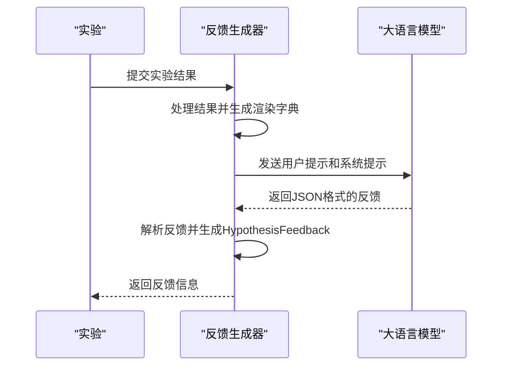

# 反馈与评估

<cite>
**本文档中引用的文件**  
- [evaluation.py](file://rdagent/core/evaluation.py)
- [eval_method.py](file://rdagent/components/benchmark/eval_method.py)
- [feedback.py](file://rdagent/scenarios/kaggle/developer/feedback.py)
- [evaluators.py](file://rdagent/components/coder/factor_coder/evaluators.py)
- [eva_utils.py](file://rdagent/components/coder/factor_coder/eva_utils.py)
- [workflow/eval.py](file://rdagent/components/coder/data_science/workflow/eval.py)
- [model/eval.py](file://rdagent/components/coder/data_science/model/eval.py)
- [ensemble/eval.py](file://rdagent/components/coder/data_science/ensemble/eval.py)
- [kaggle_experiment.py](file://rdagent/scenarios/kaggle/experiment/kaggle_experiment.py)
- [scenario.py](file://rdagent/scenarios/kaggle/experiment/scenario.py)
</cite>

## 目录
1. [引言](#引言)
2. [评估框架与核心组件](#评估框架与核心组件)
3. [评估标准与流程](#评估标准与流程)
4. [反馈生成机制](#反馈生成机制)
5. [Kaggle竞赛场景下的闭环优化](#kaggle竞赛场景下的闭环优化)
6. [评估指标设计原则](#评估指标设计原则)
7. [结论](#结论)

## 引言
RD-Agent的反馈与评估机制是其闭环优化系统的核心组成部分。该机制通过定义明确的评估标准和流程，对代码执行结果进行系统性评估，并从中提取有价值的反馈信息，用于指导后续的演化过程。本文将详细阐述`Evaluation`类如何定义评估标准和流程，以及`eval_method.py`中提供的具体评估方法。同时，我们将以Kaggle竞赛场景为例，展示从代码执行、结果评估到生成反馈的完整链条。

## 评估框架与核心组件

RD-Agent的评估框架基于抽象基类`Evaluator`和数据类`Feedback`构建，形成了一个可扩展的评估体系。`Evaluator`作为抽象基类，定义了评估的核心接口，而具体的评估逻辑则由其子类实现。

**图示来源**
- [evaluation.py](file://rdagent/core/evaluation.py#L30-L56)
- [evaluators.py](file://rdagent/components/coder/factor_coder/evaluators.py#L40-L129)
- [eva_utils.py](file://rdagent/components/coder/factor_coder/eva_utils.py#L102-L493)

**本节来源**
- [evaluation.py](file://rdagent/core/evaluation.py#L30-L56)
- [evaluators.py](file://rdagent/components/coder/factor_coder/evaluators.py#L40-L129)

## 评估标准与流程

RD-Agent的评估流程采用分阶段、多维度的评估策略，确保评估结果的全面性和准确性。以因子编码（factor_coder）为例，评估流程主要分为三个阶段：执行反馈、值反馈和最终决策。

### 执行反馈
执行反馈主要检查代码执行过程中的输出和异常。系统会捕获代码执行的stdout，并过滤掉警告信息，形成执行反馈。这有助于识别代码运行时的错误和潜在问题。

### 值反馈
值反馈是评估的核心环节，主要通过`FactorValueEvaluator`类实现。该类会执行生成的代码和基准代码，获取各自的输出数据框（DataFrame），并进行多维度的比较。比较的维度包括：
- **单列检查**：验证生成的因子是否只包含一列。
- **行数检查**：验证生成的因子行数是否与基准一致。
- **索引检查**：验证生成的因子索引是否与基准一致。
- **相等值比例检查**：计算生成的因子与基准因子相等值的比例。
- **相关性检查**：计算生成的因子与基准因子的相关性（IC或Rank IC）。

**图示来源**
- [eva_utils.py](file://rdagent/components/coder/factor_coder/eva_utils.py#L102-L493)
- [evaluators.py](file://rdagent/components/coder/factor_coder/evaluators.py#L66-L85)

**本节来源**
- [eva_utils.py](file://rdagent/components/coder/factor_coder/eva_utils.py#L102-L493)
- [evaluators.py](file://rdagent/components/coder/factor_coder/evaluators.py#L66-L85)

### 最终决策
最终决策由`FactorFinalDecisionEvaluator`类生成。该类会综合执行反馈、值反馈和代码反馈，通过大语言模型（LLM）生成最终的评估结果。决策逻辑如下：
1. 如果生成的因子值与基准因子值在小容差范围内完全相同，则认为实现正确。
2. 如果生成的因子值与基准因子值具有高相关性（IC或Rank IC），则认为实现正确。
3. 如果未提供基准因子值，则认为代码执行成功即为正确实现。

## 反馈生成机制

反馈生成机制是连接评估结果与后续演化的桥梁。系统通过`KGExperiment2Feedback`类生成反馈，该类会综合当前实验结果、基准实验结果和历史反馈，生成详细的反馈信息。

**图示来源**
- [feedback.py](file://rdagent/scenarios/kaggle/developer/feedback.py#L57-L138)

**本节来源**
- [feedback.py](file://rdagent/scenarios/kaggle/developer/feedback.py#L57-L138)

## Kaggle竞赛场景下的闭环优化

在Kaggle竞赛场景下，RD-Agent的闭环优化过程如下：
1. **代码执行**：系统执行生成的代码，获取模型准确率、因子IC值等执行结果。
2. **结果评估**：系统根据预定义的评估标准，对执行结果进行评估，生成评估反馈。
3. **反馈生成**：系统综合评估反馈和历史信息，生成指导性的反馈，用于指导下一轮演化。

以Kaggle竞赛为例，系统会根据竞赛的评估指标（如准确率、AUC等）对模型性能进行评估，并将评估结果与历史最佳结果进行比较。如果新模型性能优于历史最佳，则更新历史最佳结果；否则，根据反馈信息调整模型参数或特征工程策略，进行下一轮演化。

## 评估指标设计原则

评估指标的设计遵循以下原则：
- **可量化**：评估指标必须是可量化的，以便于系统进行自动化评估。
- **相关性**：评估指标必须与任务目标高度相关，确保评估结果的有效性。
- **可解释性**：评估指标必须具有良好的可解释性，便于开发者理解和分析。
- **鲁棒性**：评估指标必须具有良好的鲁棒性，能够抵御噪声和异常值的影响。

## 结论
RD-Agent的反馈与评估机制通过分阶段、多维度的评估策略，确保了评估结果的全面性和准确性。该机制不仅能够有效评估代码执行结果，还能生成有价值的反馈信息，用于指导后续的演化过程。在Kaggle竞赛场景下，该机制展现了强大的闭环优化能力，为自动化机器学习提供了有力支持。