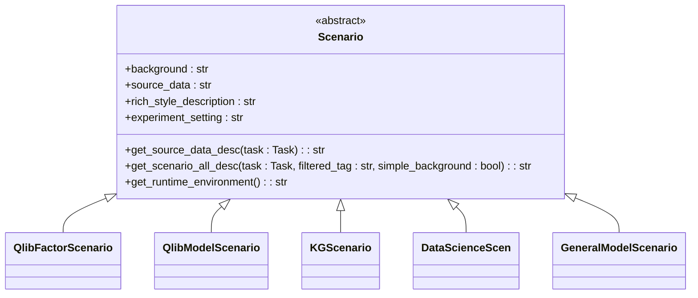
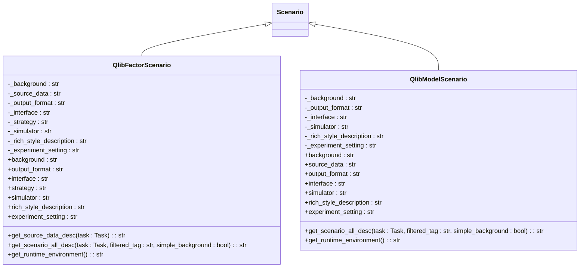
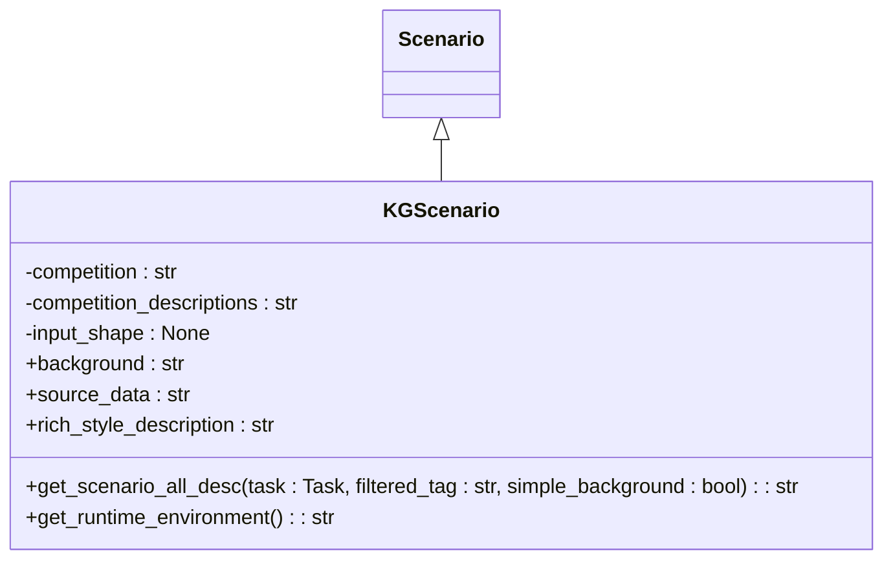
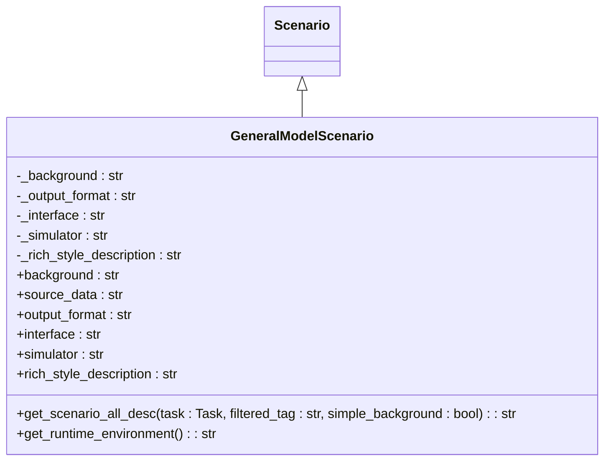
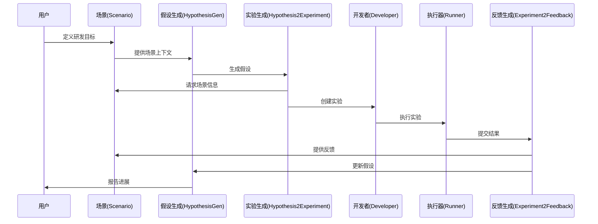
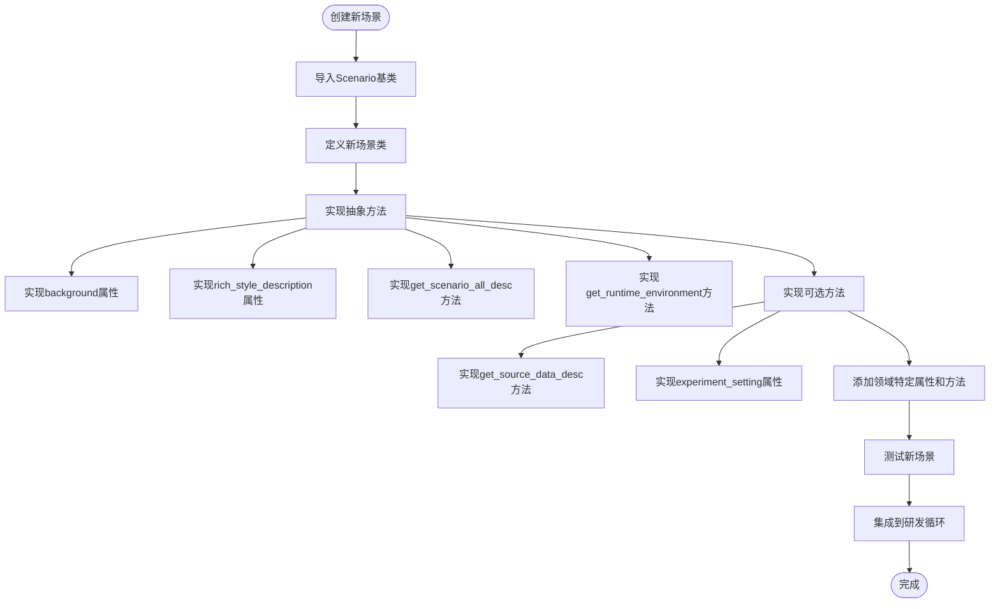

# 场景

<cite>
**本文档中引用的文件**  
- [scenario.py](file://rdagent/core/scenario.py)
- [quant.py](file://rdagent/app/qlib_rd_loop/quant.py)
- [loop.py](file://rdagent/app/kaggle/loop.py)
- [__init__.py](file://rdagent/scenarios/data_science/scen/__init__.py)
- [scenario.py](file://rdagent/scenarios/general_model/scenario.py)
- [factor_experiment.py](file://rdagent/scenarios/qlib/experiment/factor_experiment.py)
- [model_experiment.py](file://rdagent/scenarios/qlib/experiment/model_experiment.py)
- [scenario.py](file://rdagent/scenarios/kaggle/experiment/scenario.py)
</cite>

## 目录
1. [引言](#引言)
2. [核心场景抽象类设计](#核心场景抽象类设计)
3. [量化金融场景实现](#量化金融场景实现)
4. [Kaggle竞赛场景实现](#kaggle竞赛场景实现)
5. [通用模型场景实现](#通用模型场景实现)
6. [场景在研发循环中的协调作用](#场景在研发循环中的协调作用)
7. [定义新场景的示例](#定义新场景的示例)

## 引言
场景（Scenario）是RD-Agent框架中的核心概念，作为领域特定应用的入口点。它为不同研发领域（如量化金融、Kaggle竞赛等）提供了统一的接口，将高层目标转化为可执行的实验对象。场景类通过定义一系列抽象方法和属性，协调任务生成、实验创建和执行反馈等关键流程，使框架能够灵活适应各种应用场景。

## 核心场景抽象类设计
`rdagent.core.scenario.Scenario` 是一个抽象基类，定义了所有具体场景必须实现的核心接口。该类通过抽象方法和属性为不同领域的应用提供了统一的契约。

**Diagram sources**  
- [scenario.py](file://rdagent/core/scenario.py#L1-L64)

**Section sources**  
- [scenario.py](file://rdagent/core/scenario.py#L1-L64)

### 核心抽象属性
- **`background`**: 场景的背景信息，描述该领域的基本上下文
- **`rich_style_description`**: 用于展示的富文本风格描述
- **`get_runtime_environment`**: 获取运行环境信息的抽象方法

### 核心抽象方法
- **`get_scenario_all_desc`**: 结合所有描述信息生成完整的场景描述，可根据任务动态调整
- **`get_source_data_desc`**: 获取源数据描述，支持基于特定任务的定制化描述

### 默认实现方法
- **`source_data`**: 作为`get_source_data_desc`的便捷别名
- **`experiment_setting`**: 实验设置的可选属性，默认返回None

## 量化金融场景实现
在量化金融领域，RD-Agent提供了`QlibFactorScenario`和`QlibModelScenario`两个具体实现，分别用于因子研究和模型研究。

**Diagram sources**  
- [factor_experiment.py](file://rdagent/scenarios/qlib/experiment/factor_experiment.py#L23-L90)
- [model_experiment.py](file://rdagent/scenarios/qlib/experiment/model_experiment.py#L23-L82)

**Section sources**  
- [factor_experiment.py](file://rdagent/scenarios/qlib/experiment/factor_experiment.py#L23-L90)
- [model_experiment.py](file://rdagent/scenarios/qlib/experiment/model_experiment.py#L23-L82)

### Qlib因子场景特点
`QlibFactorScenario`为量化因子研究提供了完整的上下文信息：
- 包含因子研究的背景知识
- 提供源数据描述
- 定义因子输出格式和接口规范
- 包含交易策略和模拟器信息
- 支持完整的场景描述生成

### Qlib模型场景特点
`QlibModelScenario`专注于量化模型研究：
- 提供模型研究的背景知识
- 定义模型输出格式和接口规范
- 包含模型模拟器信息
- 支持完整的场景描述生成
- 运行环境基于模型专用环境配置

## Kaggle竞赛场景实现
Kaggle竞赛场景通过`KGScenario`类实现，继承了数据科学场景的通用能力并进行了特定扩展。

**Diagram sources**  
- [scenario.py](file://rdagent/scenarios/kaggle/experiment/scenario.py#L0-L40)

**Section sources**  
- [scenario.py](file://rdagent/scenarios/kaggle/experiment/scenario.py#L0-L40)

### Kaggle场景初始化
`KGScenario`的初始化过程包括：
1. 设置竞赛名称
2. 从Kaggle爬取竞赛描述
3. 初始化输入形状等竞赛特定信息

### 动作类型定义
Kaggle场景定义了四种核心动作类型：
- **特征处理** (`KG_ACTION_FEATURE_PROCESSING`)
- **特征工程** (`KG_ACTION_FEATURE_ENGINEERING`)
- **模型特征选择** (`KG_ACTION_MODEL_FEATURE_SELECTION`)
- **模型调优** (`KG_ACTION_MODEL_TUNING`)

这些动作类型指导了研发循环中的任务生成和执行流程。

## 通用模型场景实现
通用模型场景通过`GeneralModelScenario`类实现，为通用机器学习模型开发提供了基础框架。

**Diagram sources**  
- [scenario.py](file://rdagent/scenarios/general_model/scenario.py#L0-L55)

**Section sources**  
- [scenario.py](file://rdagent/scenarios/general_model/scenario.py#L0-L55)

### 通用模型场景特点
`GeneralModelScenario`提供了通用机器学习模型开发所需的核心信息：
- 模型开发背景知识
- 模型输出格式规范
- 代码接口规范
- 模型模拟器信息
- 富文本风格描述

值得注意的是，`source_data`属性在此场景中被明确标记为未实现，需要在具体应用中进行扩展。

## 场景在研发循环中的协调作用
场景类在RD-Agent的研发循环中扮演着关键的协调者角色，连接了高层目标与具体执行。

**Diagram sources**  
- [quant.py](file://rdagent/app/qlib_rd_loop/quant.py#L0-L143)
- [loop.py](file://rdagent/app/kaggle/loop.py#L0-L139)

**Section sources**  
- [quant.py](file://rdagent/app/qlib_rd_loop/quant.py#L0-L143)
- [loop.py](file://rdagent/app/kaggle/loop.py#L0-L139)

### 场景与EvoAgent的交互
在研发循环中，场景通过以下方式与EvoAgent组件交互：
1. **提供上下文**: 为假设生成器提供领域特定的背景知识
2. **指导实验创建**: 为实验生成器提供接口规范和输出格式
3. **配置运行环境**: 为执行器提供必要的运行时环境信息
4. **支持反馈生成**: 为反馈生成器提供评估标准和比较基准

### 场景驱动的任务转化
场景将高层目标转化为具体任务的流程：
1. 接收研发目标作为输入
2. 结合场景背景知识生成假设
3. 根据场景规范将假设转化为可执行的实验
4. 协调开发者创建具体的任务实现
5. 收集执行结果并生成反馈
6. 基于反馈迭代优化研发方向

## 定义新场景的示例
要为全新的应用领域定义一个新场景，需要继承`Scenario`基类并实现必要的抽象方法。

**Diagram sources**  
- [scenario.py](file://rdagent/core/scenario.py#L1-L64)
- [__init__.py](file://rdagent/scenarios/data_science/scen/__init__.py#L0-L289)

**Section sources**  
- [scenario.py](file://rdagent/core/scenario.py#L1-L64)
- [__init__.py](file://rdagent/scenarios/data_science/scen/__init__.py#L0-L289)

### 新场景实现步骤
1. **继承Scenario基类**: 创建新的场景类并继承`rdagent.core.scenario.Scenario`
2. **实现必需的抽象方法**: 包括`background`、`rich_style_description`、`get_scenario_all_desc`和`get_runtime_environment`
3. **提供场景特定信息**: 根据领域特点提供背景知识、数据描述、运行环境等信息
4. **集成到配置系统**: 在相应的配置文件中注册新场景
5. **测试和验证**: 确保新场景能正确驱动研发循环

通过这种方式，RD-Agent框架可以轻松扩展到新的应用领域，保持核心架构的一致性同时支持领域的特定需求。