# 场景与实验

<cite>
**本文档中引用的文件**
- [rdagent/core/scenario.py](file://rdagent/core/scenario.py)
- [rdagent/core/experiment.py](file://rdagent/core/experiment.py)
- [rdagent/scenarios/data_science/experiment/experiment.py](file://rdagent/scenarios/data_science/experiment/experiment.py)
- [rdagent/scenarios/data_science/scen/__init__.py](file://rdagent/scenarios/data_science/scen/__init__.py)
- [rdagent/scenarios/kaggle/experiment/scenario.py](file://rdagent/scenarios/kaggle/experiment/scenario.py)
- [rdagent/core/evolving_agent.py](file://rdagent/core/evolving_agent.py)
- [rdagent/components/coder/CoSTEER/evolvable_subjects.py](file://rdagent/components/coder/CoSTEER/evolvable_subjects.py)
- [rdagent/core/evolving_framework.py](file://rdagent/core/evolving_framework.py)
- [rdagent/scenarios/data_science/loop.py](file://rdagent/scenarios/data_science/loop.py)
- [rdagent/app/data_science/loop.py](file://rdagent/app/data_science/loop.py)
- [rdagent/scenarios/data_science/dev/runner.py](file://rdagent/scenarios/data_science/dev/runner.py)
- [rdagent/components/coder/data_science/share/ds_costeer.py](file://rdagent/components/coder/data_science/share/ds_costeer.py)
</cite>

## 目录
1. [引言](#引言)
2. [场景（Scenario）概念](#场景scenario概念)
3. [实验（Experiment）概念](#实验experiment概念)
4. [EvolvingItem与演化能力](#evolvingitem与演化能力)
5. [数据科学场景的具体实现](#数据科学场景的具体实现)
6. [组件协作关系](#组件协作关系)
7. [完整的执行流程](#完整的执行流程)
8. [总结](#总结)

## 引言

在RD-Agent框架中，场景（Scenario）和实验（Experiment）是两个核心概念，它们共同构成了系统应用边界和执行单元的基础架构。场景定义了特定领域的行为规范和环境约束，而实验则封装了具体的研发任务和执行过程。通过这种分层设计，RD-Agent能够灵活地适应不同的研究开发需求，同时保持代码结构的清晰性和可扩展性。

## 场景（Scenario）概念

### 基础抽象

场景（Scenario）是RD-Agent中定义特定领域行为的抽象基类，它为不同类型的场景提供了统一的接口规范。

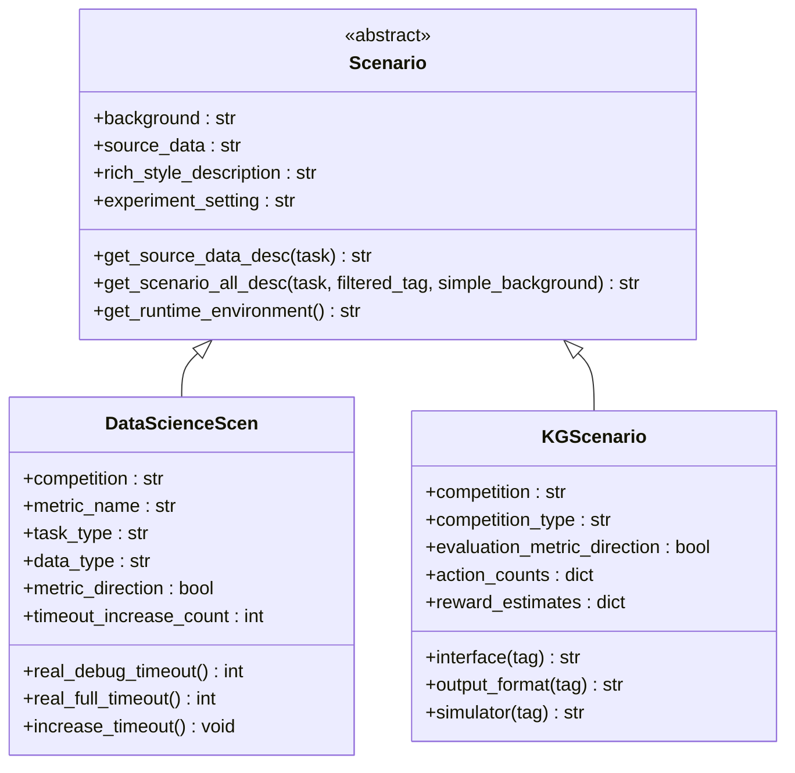

**图表来源**
- [rdagent/core/scenario.py](file://rdagent/core/scenario.py#L6-L64)
- [rdagent/scenarios/data_science/scen/__init__.py](file://rdagent/scenarios/data_science/scen/__init__.py#L18-L289)
- [rdagent/scenarios/kaggle/experiment/scenario.py](file://rdagent/scenarios/kaggle/experiment/scenario.py#L25-L281)

### 核心属性和方法

场景类定义了以下关键属性和方法：

| 属性/方法 | 类型 | 描述 |
|-----------|------|------|
| `background` | property | 提供场景背景信息 |
| `source_data` | property | 数据源描述的便捷访问 |
| `rich_style_description` | property | 富文本格式的场景描述 |
| `get_source_data_desc()` | method | 根据具体任务获取数据源描述 |
| `get_scenario_all_desc()` | method | 组合所有描述信息 |
| `get_runtime_environment()` | method | 获取运行时环境信息 |

### 场景的职责

场景的主要职责包括：
- **环境定义**：提供特定领域的环境配置和约束条件
- **数据管理**：描述可用的数据源和数据格式
- **评估标准**：定义性能评估指标和方向
- **资源分配**：管理计算资源和时间限制

**章节来源**
- [rdagent/core/scenario.py](file://rdagent/core/scenario.py#L6-L64)

## 实验（Experiment）概念

### 实验基础架构

实验（Experiment）是RD-Agent中封装具体研发任务的核心类，它继承自抽象基类并提供了完整的生命周期管理。

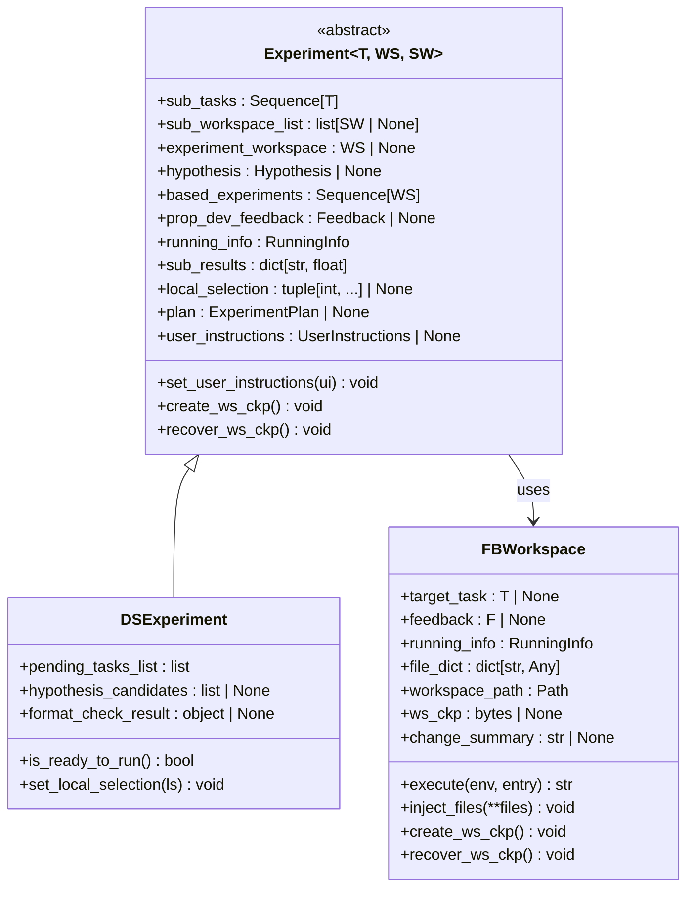

**图表来源**
- [rdagent/core/experiment.py](file://rdagent/core/experiment.py#L383-L482)
- [rdagent/scenarios/data_science/experiment/experiment.py](file://rdagent/scenarios/data_science/experiment/experiment.py#L9-L43)

### 实验的关键特性

实验类具有以下核心特性：

| 特性 | 类型 | 描述 |
|------|------|------|
| **子任务管理** | `Sequence[Task]` | 管理实验分解后的子任务列表 |
| **工作空间** | `Workspace` | 存储任务实现的工作区 |
| **假设支持** | `Hypothesis` | 可选的假设驱动实验 |
| **反馈机制** | `Feedback` | 开发者反馈的传递 |
| **运行信息** | `RunningInfo` | 记录实验执行状态 |
| **检查点功能** | `create_ws_ckp()` | 工作区状态保存和恢复 |

### 工作区（Workspace）系统

工作区是实验的重要组成部分，提供了代码管理和执行环境：

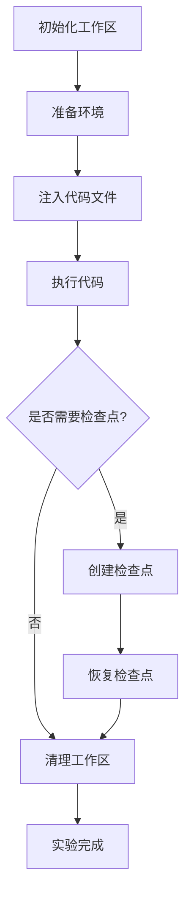

**图表来源**
- [rdagent/core/experiment.py](file://rdagent/core/experiment.py#L130-L382)

**章节来源**
- [rdagent/core/experiment.py](file://rdagent/core/experiment.py#L383-L482)
- [rdagent/scenarios/data_science/experiment/experiment.py](file://rdagent/scenarios/data_science/experiment/experiment.py#L9-L43)

## EvolvingItem与演化能力

### 演化项目（EvolvingItem）

EvolvingItem是Experiment和EvolvableSubjects的多重继承类，为实验添加了演化能力。

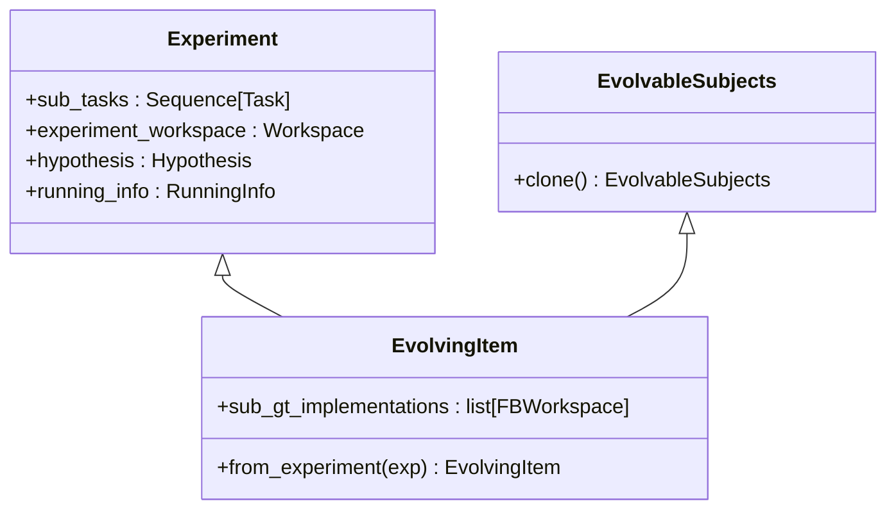

**图表来源**
- [rdagent/components/coder/CoSTEER/evolvable_subjects.py](file://rdagent/components/coder/CoSTEER/evolvable_subjects.py#L6-L32)

### 演化框架

演化框架提供了完整的演化策略和知识管理系统：

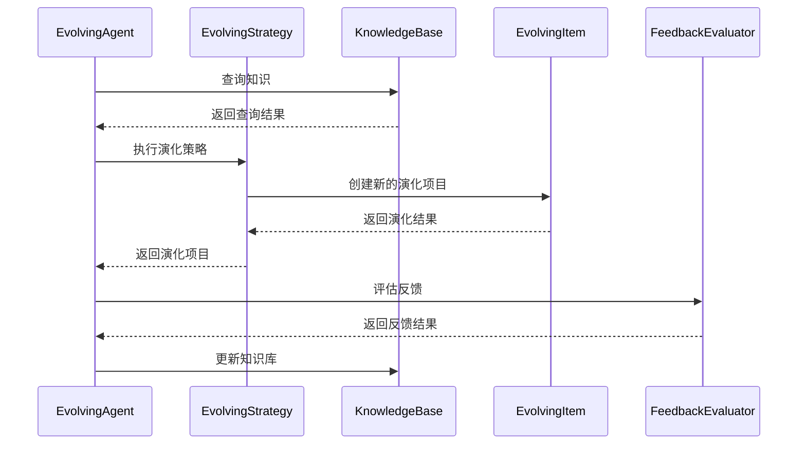

**图表来源**
- [rdagent/core/evolving_framework.py](file://rdagent/core/evolving_framework.py#L40-L127)
- [rdagent/core/evolving_agent.py](file://rdagent/core/evolving_agent.py#L50-L115)

**章节来源**
- [rdagent/components/coder/CoSTEER/evolvable_subjects.py](file://rdagent/components/coder/CoSTEER/evolvable_subjects.py#L6-L32)
- [rdagent/core/evolving_framework.py](file://rdagent/core/evolving_framework.py#L40-L127)

## 数据科学场景的具体实现

### DataScienceScen类

DataScienceScen是数据科学领域的具体场景实现，提供了丰富的功能特性：

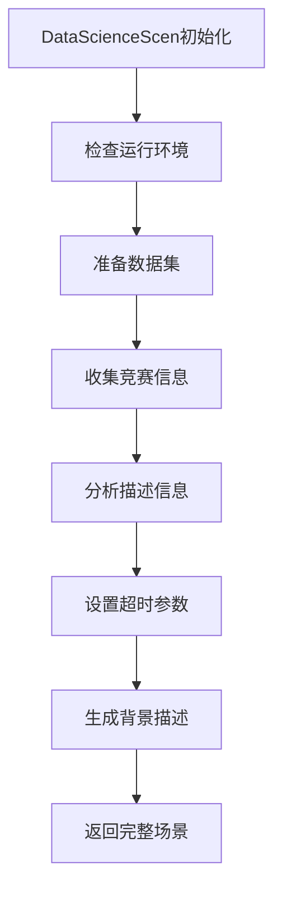

**图表来源**
- [rdagent/scenarios/data_science/scen/__init__.py](file://rdagent/scenarios/data_science/scen/__init__.py#L18-L80)

### 关键功能特性

DataScienceScen提供了以下核心功能：

| 功能 | 方法 | 描述 |
|------|------|------|
| **数据准备** | `_get_data_folder_description()` | 自动分析数据集结构 |
| **竞赛分析** | `_analysis_competition_description()` | 使用LLM分析竞赛要求 |
| **超时管理** | `real_debug_timeout()`, `real_full_timeout()` | 动态调整超时设置 |
| **环境配置** | `get_runtime_environment()` | 获取运行时环境信息 |
| **描述生成** | `get_scenario_all_desc()` | 生成完整的场景描述 |

### KaggleScen扩展

KaggleScen继承自DataScienceScen，专门针对Kaggle竞赛场景进行了优化：

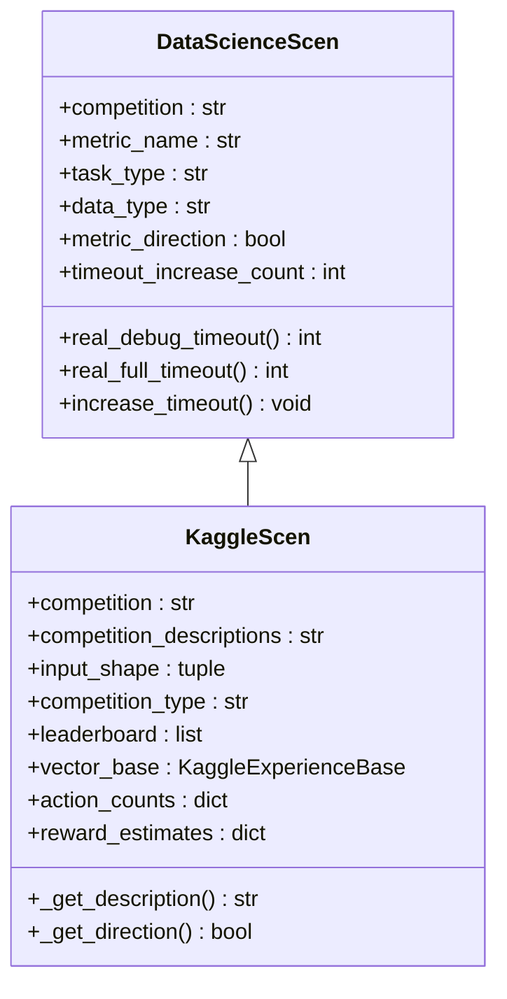

**图表来源**
- [rdagent/scenarios/data_science/scen/__init__.py](file://rdagent/scenarios/data_science/scen/__init__.py#L280-L289)
- [rdagent/scenarios/kaggle/experiment/scenario.py](file://rdagent/scenarios/kaggle/experiment/scenario.py#L25-L100)

**章节来源**
- [rdagent/scenarios/data_science/scen/__init__.py](file://rdagent/scenarios/data_science/scen/__init__.py#L18-L289)
- [rdagent/scenarios/kaggle/experiment/scenario.py](file://rdagent/scenarios/kaggle/experiment/scenario.py#L25-L281)

## 组件协作关系

### CoSTEER架构

RD-Agent采用CoSTEER（Collaborative Software Teamwork for Experimental Research）架构，将不同的研发任务分解为独立的组件：

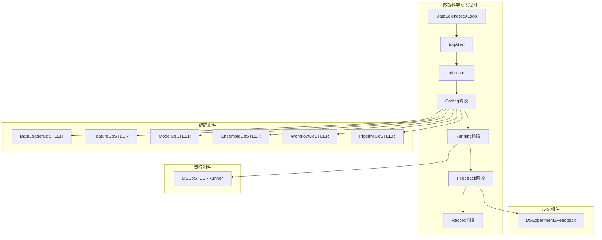

**图表来源**
- [rdagent/scenarios/data_science/loop.py](file://rdagent/scenarios/data_science/loop.py#L80-L120)

### 组件交互流程

各个组件之间的协作遵循以下流程：

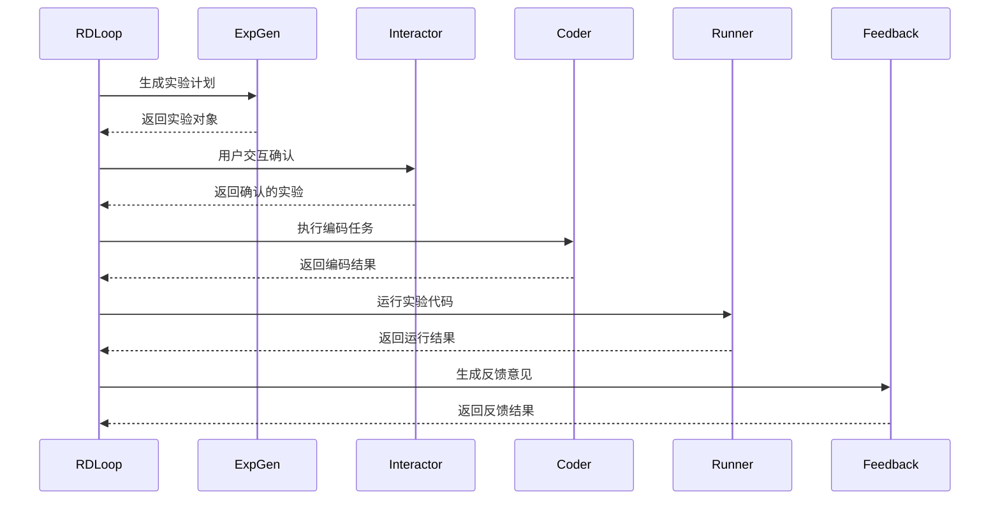

**图表来源**
- [rdagent/scenarios/data_science/loop.py](file://rdagent/scenarios/data_science/loop.py#L140-L210)

### 超时和资源管理

每个组件都具备智能的资源管理能力：

| 组件 | 资源管理 | 超时策略 |
|------|----------|----------|
| **Coder** | `real_debug_timeout()` | 基于任务复杂度动态调整 |
| **Runner** | `real_full_timeout()` | 基于剩余时间和历史表现 |
| **整体循环** | `increase_timeout()` | 失败时自动增加超时时间 |

**章节来源**
- [rdagent/scenarios/data_science/loop.py](file://rdagent/scenarios/data_science/loop.py#L80-L383)
- [rdagent/components/coder/data_science/share/ds_costeer.py](file://rdagent/components/coder/data_science/share/ds_costeer.py#L1-L9)

## 完整的执行流程

### 数据科学研发循环

数据科学场景的完整执行流程展示了场景与实验的协同工作机制：

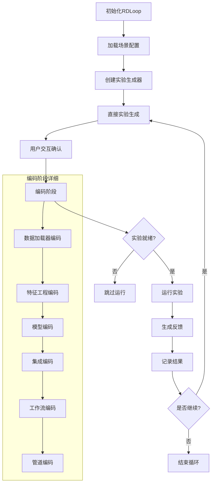

**图表来源**
- [rdagent/scenarios/data_science/loop.py](file://rdagent/scenarios/data_science/loop.py#L140-L210)

### 实验生命周期管理

实验在整个生命周期中经历多个状态转换：

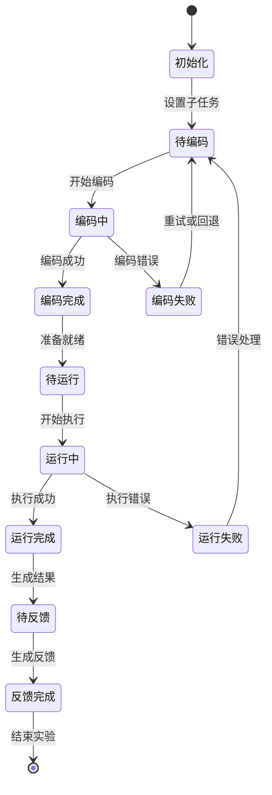

### 演化过程

通过演化Agent，实验可以进行自我改进：

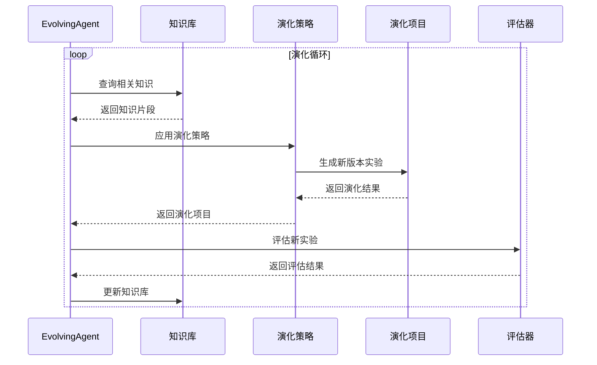

**图表来源**
- [rdagent/core/evolving_agent.py](file://rdagent/core/evolving_agent.py#L50-L115)

**章节来源**
- [rdagent/scenarios/data_science/loop.py](file://rdagent/scenarios/data_science/loop.py#L140-L383)
- [rdagent/core/evolving_agent.py](file://rdagent/core/evolving_agent.py#L50-L115)

## 总结

RD-Agent中的场景（Scenario）和实验（Experiment）概念构成了一个完整的研究开发框架。场景定义了应用边界和领域规范，实验封装了具体的研发任务和执行过程，而EvolvingItem则为实验添加了自我演化的能力。

这种设计带来了以下优势：

1. **模块化架构**：场景和实验的分离使得系统具有良好的可扩展性
2. **领域适配**：通过继承Scenario基类，可以轻松适配不同的研究领域
3. **自动化程度高**：CoSTEER架构实现了从任务生成到结果反馈的全自动化流程
4. **智能资源管理**：动态超时调整和资源分配提高了系统效率
5. **演化能力**：通过演化框架，实验可以不断自我改进和优化

通过这种分层设计，RD-Agent不仅能够处理复杂的研发任务，还能够适应不断变化的需求，为人工智能驱动的研究开发提供了强大的基础设施。