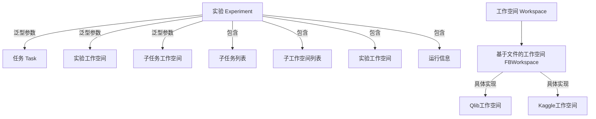
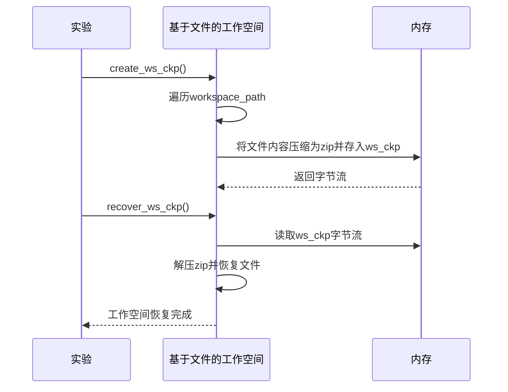
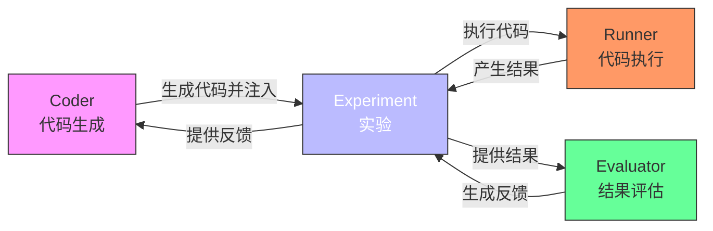

# 实验

<cite>
**本文档中引用的文件**  
- [experiment.py](file://rdagent/core/experiment.py)
- [factor_experiment.py](file://rdagent/scenarios/qlib/experiment/factor_experiment.py)
- [kaggle_experiment.py](file://rdagent/scenarios/kaggle/experiment/kaggle_experiment.py)
- [factor.py](file://rdagent/components/coder/factor_coder/factor.py)
- [model.py](file://rdagent/components/coder/model_coder/model.py)
- [workspace.py](file://rdagent/scenarios/qlib/experiment/workspace.py)
- [workspace.py](file://rdagent/scenarios/kaggle/experiment/workspace.py)
- [evolving_strategy.py](file://rdagent/components/coder/CoSTEER/evolving_strategy.py)
- [evolving_framework.py](file://rdagent/core/evolving_framework.py)
- [evolvable_subjects.py](file://rdagent/components/coder/CoSTEER/evolvable_subjects.py)
</cite>

## 目录
1. [引言](#引言)
2. [实验系统架构](#实验系统架构)
3. [核心组件分析](#核心组件分析)
4. [具体场景实现](#具体场景实现)
5. [演化能力集成](#演化能力集成)
6. [研发闭环协作流程](#研发闭环协作流程)
7. [结论](#结论)

## 引言
在RD-Agent系统中，"实验"（Experiment）作为最小可执行研发单元，扮演着核心角色。它不仅封装了研发任务的完整生命周期，还通过精心设计的序列化机制和状态管理，实现了任务在不同组件间的无缝流转。本文档将深入剖析`rdagent.core.experiment.Experiment`基类的设计原理，展示其在量化金融（Qlib）和数据科学竞赛（Kaggle）等不同场景下的定制化实现，并阐明其如何通过`EvolvingItem`包装器获得演化能力，最终与`Coder`、`Runner`和`Evaluator`组件协同工作，构建一个完整的自动化研发闭环。

## 实验系统架构
RD-Agent的实验系统采用分层架构设计，以`Experiment`基类为核心，通过泛型参数支持不同类型的任务和工作空间。该系统将研发任务分解为可管理的子任务，并通过工作空间（Workspace）来组织和管理任务的实现代码、数据和执行环境。



**图示来源**  
- [experiment.py](file://rdagent/core/experiment.py#L384-L481)
- [workspace.py](file://rdagent/scenarios/qlib/experiment/workspace.py#L1-L59)
- [workspace.py](file://rdagent/scenarios/kaggle/experiment/workspace.py#L1-L97)

## 核心组件分析
`Experiment`类是整个研发流程的基石，其设计体现了高内聚、低耦合的原则。它通过`__init__`、`to_dict`和`from_dict`方法实现了任务的序列化与状态管理。

### Experiment基类结构
`Experiment`基类是一个抽象基类（ABC），采用泛型设计以支持不同类型的任务和工作空间。其核心属性包括：
- `sub_tasks`: 一个`Sequence[ASpecificTask]`，存储构成实验的子任务列表。
- `sub_workspace_list`: 一个`list[ASpecificWSForSubTasks | None]`，与`sub_tasks`一一对应，存储每个子任务的实现工作空间。
- `experiment_workspace`: 一个`ASpecificWSForExperiment | None`，用于存储整个实验的共享工作空间或最终产物。
- `running_info`: 一个`RunningInfo`对象，用于存储实验的执行结果和运行时间。

**Section sources**
- [experiment.py](file://rdagent/core/experiment.py#L384-L481)

### 序列化与状态管理
`Experiment`类通过`create_ws_ckp`和`recover_ws_ckp`方法实现了工作空间的检查点功能，这是其状态管理的核心机制。



**图示来源**  
- [experiment.py](file://rdagent/core/experiment.py#L458-L481)
- [experiment.py](file://rdagent/core/experiment.py#L250-L355)

`create_ws_ckp`方法会遍历`experiment_workspace`和所有`sub_workspace_list`中的工作空间，将它们的内容压缩成一个zip文件，并将其字节流存储在`ws_ckp`属性中。`recover_ws_ckp`方法则负责从`ws_ckp`中读取字节流，解压并恢复工作空间的原始状态。这一机制确保了实验状态可以在多轮迭代中被精确地保存和恢复，为自动化研发流程的可靠性提供了保障。

## 具体场景实现
`Experiment`基类通过继承和组合的方式，在不同应用场景中实现了高度定制化的功能。以下分析两个典型场景：Qlib因子实验和Kaggle竞赛实验。

### Qlib因子实验实现
在量化金融场景中，`QlibFactorExperiment`继承了`FactorExperiment`，并定制了其`experiment_workspace`。

```python
class QlibFactorExperiment(FactorExperiment[FactorTask, QlibFBWorkspace, FactorFBWorkspace]):
    def __init__(self, *args, **kwargs) -> None:
        super().__init__(*args, **kwargs)
        self.experiment_workspace = QlibFBWorkspace(template_folder_path=Path(__file__).parent / "factor_template")
        self.stdout = ""
```

`QlibFBWorkspace`继承自`FBWorkspace`，并在初始化时通过`inject_code_from_folder`方法将位于`factor_template`目录下的模板代码注入到工作空间中。这确保了每个因子实验都从一个标准化的、包含必要配置和脚本的环境开始。`QlibFBWorkspace`还重写了`execute`方法，使其能够调用Qlib框架的`qrun`命令来执行回测，并解析回测结果。

**Section sources**
- [factor_experiment.py](file://rdagent/scenarios/qlib/experiment/factor_experiment.py#L1-L90)
- [workspace.py](file://rdagent/scenarios/qlib/experiment/workspace.py#L1-L59)

### Kaggle竞赛实验实现
在数据科学竞赛场景中，`KGModelExperiment`和`KGFactorExperiment`分别继承了`ModelExperiment`和`FeatureExperiment`。

```python
class KGModelExperiment(ModelExperiment[ModelTask, KGFBWorkspace, ModelFBWorkspace]):
    def __init__(self, *args, source_feature_size: int = None, **kwargs) -> None:
        super().__init__(*args, **kwargs)
        self.experiment_workspace = KGFBWorkspace(
            template_folder_path=Path(__file__).resolve().parent / "templates" / KAGGLE_IMPLEMENT_SETTING.competition
        )
        # ... 初始化data_description
```

`KGFBWorkspace`同样继承自`FBWorkspace`，并注入了特定于Kaggle竞赛的模板代码。它提供了`generate_preprocess_data`方法来预处理竞赛数据，并通过`execute`方法在Docker环境中运行提交脚本，最终读取`submission_score.csv`文件来获取评分结果。这种设计使得实验能够无缝集成到Kaggle竞赛的提交和评估流程中。

**Section sources**
- [kaggle_experiment.py](file://rdagent/scenarios/kaggle/experiment/kaggle_experiment.py#L1-L82)
- [workspace.py](file://rdagent/scenarios/kaggle/experiment/workspace.py#L1-L97)

## 演化能力集成
为了支持多轮迭代优化，RD-Agent引入了`EvolvingItem`包装器，为`Experiment`添加了演化能力。

### EvolvingItem包装器
`EvolvingItem`类定义在`rdagent/components/coder/CoSTEER/evolvable_subjects.py`中，它同时继承了`Experiment`和`EvolvableSubjects`。

```python
class EvolvingItem(Experiment, EvolvableSubjects):
    """
    Intermediate item of factor implementation.
    """

    def __init__(
        self,
        sub_tasks: list[Task],
        sub_gt_implementations: list[FBWorkspace] = None,
    ):
        Experiment.__init__(self, sub_tasks=sub_tasks)
        # ... 初始化其他属性

    @classmethod
    def from_experiment(cls, exp: Experiment) -> "EvolvingItem":
        ei = cls(sub_tasks=exp.sub_tasks)
        ei.based_experiments = exp.based_experiments
        ei.experiment_workspace = exp.experiment_workspace
        return ei
```

`EvolvingItem`作为`Experiment`和`EvolvableSubjects`的多重继承体，使其既能作为研发任务的载体，又能作为演化算法的操作对象。`from_experiment`类方法提供了一种便捷的方式，将一个普通的`Experiment`实例转换为具有演化能力的`EvolvingItem`。

### 演化流程集成
在`CoSTEER`研发策略中，`develop`方法会将传入的`Experiment`转换为`EvolvingItem`，然后交由`RAGEvoAgent`进行多轮演化。

```python
def develop(self, exp: Experiment) -> Experiment:
    evo_exp = EvolvingItem.from_experiment(exp)
    self.evolve_agent = RAGEvoAgent[EvolvingItem](
        # ... 配置演化代理
    )
    for evo_exp in self.evolve_agent.multistep_evolve(evo_exp, self.evaluator):
        # ... 在每轮演化后评估并决定是否保留
        if update_fallback:
            fallback_evo_exp = deepcopy(evo_exp)
            fallback_evo_exp.create_ws_ckp()
```

演化代理会根据评估反馈（`Evaluator`提供）和检索到的知识（`RAG`提供），对`EvolvingItem`进行修改。`create_ws_ckp`的调用确保了在每轮迭代中，成功的实验状态都能被安全地保存下来，防止在后续失败的迭代中丢失。

**Section sources**
- [evolvable_subjects.py](file://rdagent/components/coder/CoSTEER/evolvable_subjects.py#L1-L31)
- [__init__.py](file://rdagent/components/coder/CoSTEER/__init__.py#L73-L135)

## 研发闭环协作流程
`Experiment`与`Coder`、`Runner`和`Evaluator`组件的协作，构成了RD-Agent的核心研发闭环。

### 协作流程
1.  **Coder (代码生成)**: `Coder`组件接收一个`Experiment`实例，其中包含了待实现的`sub_tasks`。它根据任务描述和场景背景，生成实现代码，并将其注入到`sub_workspace_list`的相应工作空间中。
2.  **Runner (代码执行)**: `Runner`组件接收一个已完成代码生成的`Experiment`。它调用`experiment_workspace`或`sub_workspace_list`中的`execute`方法，在隔离的环境（如Docker容器）中运行代码，并将执行结果（如模型输出、回测报告）存储在`running_info.result`中。
3.  **Evaluator (结果评估)**: `Evaluator`组件接收一个已执行的`Experiment`。它分析`running_info.result`，并与预期结果或基线进行比较，生成一个`Feedback`对象。这个反馈被赋值给`Experiment`的`feedback`属性。
4.  **迭代优化**: `Feedback`被返回给`Coder`或演化框架，作为下一轮代码生成或演化的依据。`Experiment`的检查点机制确保了整个状态可以被恢复，从而支持多轮迭代。



此闭环流程实现了从任务到代码、从执行到评估、从反馈到再生成的自动化循环，而`Experiment`作为贯穿始终的载体，保证了信息的完整传递和状态的持续演进。

**图示来源**  
- [__init__.py](file://rdagent/components/coder/CoSTEER/__init__.py#L73-L135)
- [eval.py](file://rdagent/scenarios/data_science/dev/runner/eval.py#L68-L104)

## 结论
`Experiment`作为RD-Agent中最小可执行研发单元，其设计精巧且功能强大。通过`Experiment`基类的泛型设计和`FBWorkspace`的文件系统抽象，系统实现了对多样化研发任务的统一建模。`create_ws_ckp`和`recover_ws_ckp`机制为实验状态的持久化和恢复提供了可靠保障。在具体场景中，通过继承和组合，`Experiment`能够灵活地适应Qlib和Kaggle等不同环境的需求。更重要的是，通过`EvolvingItem`包装器，`Experiment`获得了参与多轮迭代优化的演化能力。最终，`Experiment`作为核心载体，与`Coder`、`Runner`和`Evaluator`组件紧密协作，构建了一个完整的、自动化的研发闭环，极大地提升了AI驱动研发的效率和智能化水平。