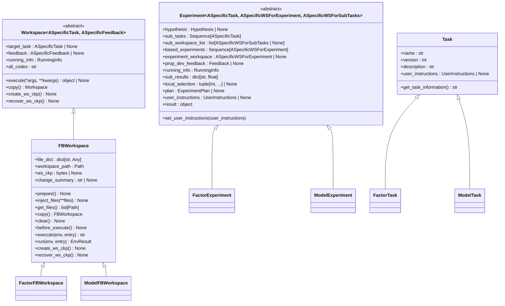
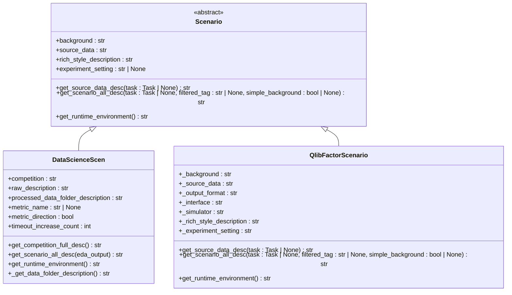
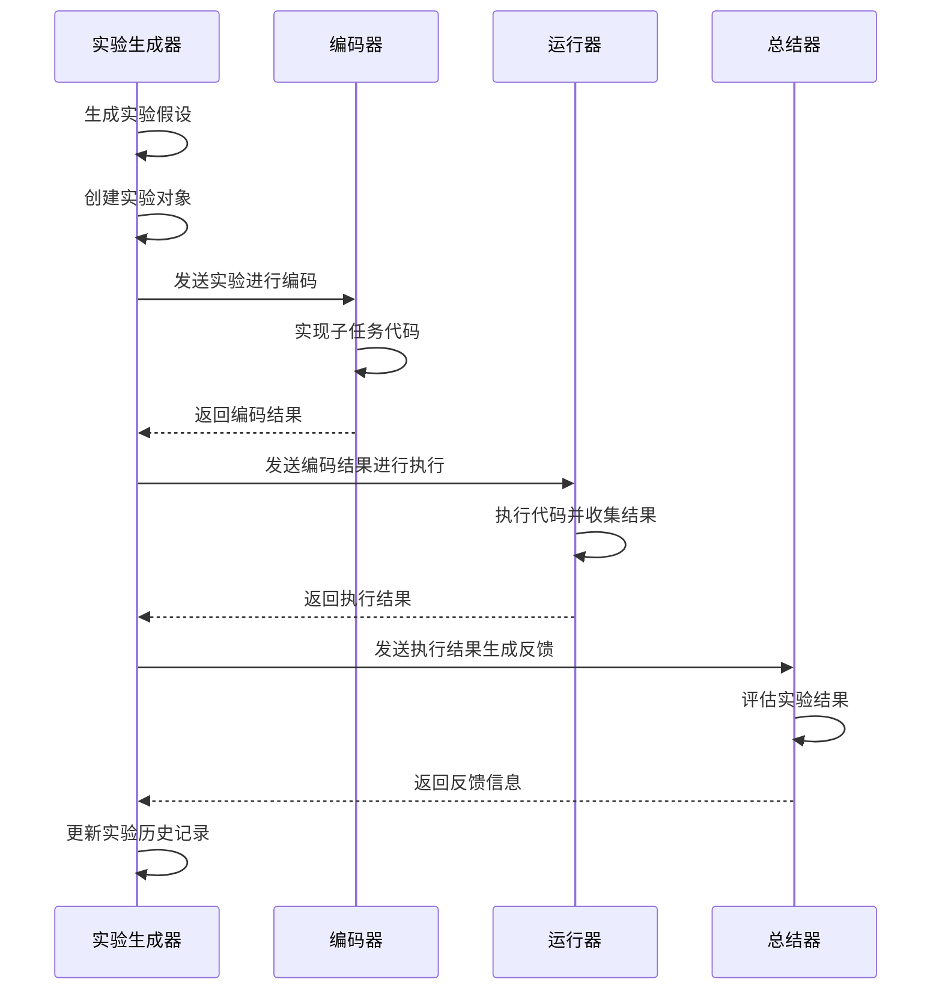
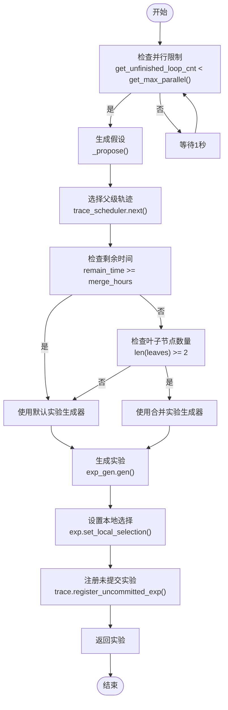

# 实验管理

<cite>
**本文档中引用的文件**  
- [experiment.py](file://rdagent/core/experiment.py)
- [scenario.py](file://rdagent/core/scenario.py)
- [loop.py](file://rdagent/app/data_science/loop.py)
- [quant.py](file://rdagent/app/qlib_rd_loop/quant.py)
- [factor.py](file://rdagent/components/coder/factor_coder/factor.py)
- [model.py](file://rdagent/components/coder/model_coder/model.py)
- [data_science\scen\__init__.py](file://rdagent/scenarios/data_science/scen/__init__.py)
- [factor_experiment.py](file://rdagent/scenarios/qlib/experiment/factor_experiment.py)
- [experiment_loader.py](file://rdagent/components/loader/experiment_loader.py)
- [rd_loop.py](file://rdagent/components/workflow/rd_loop.py)
- [conf.py](file://rdagent/core/conf.py)
</cite>

## 目录
1. [引言](#引言)
2. [实验基类设计](#实验基类设计)
3. [场景抽象类](#场景抽象类)
4. [实验生命周期管理](#实验生命周期管理)
5. [实验配置继承与覆盖](#实验配置继承与覆盖)
6. [实验依赖与并行执行](#实验依赖与并行执行)
7. [实验隔离与可复现性](#实验隔离与可复现性)
8. [实验调试最佳实践](#实验调试最佳实践)
9. [自定义实验类型开发指南](#自定义实验类型开发指南)
10. [结论](#结论)

## 引言
RD-Agent的实验管理体系是一个结构化的框架，用于管理和执行各种类型的自动化研发实验。该体系通过定义清晰的基类和抽象接口，支持数据科学实验、量化因子实验等多种应用场景。系统采用模块化设计，将实验的生命周期划分为明确的阶段，包括初始化、执行、监控和结果收集。通过灵活的配置机制和强大的依赖管理，该体系能够支持复杂的实验流程和并行执行策略，同时确保实验结果的可复现性。

**Section sources**
- [experiment.py](file://rdagent/core/experiment.py#L1-L50)
- [scenario.py](file://rdagent/core/scenario.py#L1-L10)

## 实验基类设计
实验基类`Experiment`是RD-Agent实验管理体系的核心，采用泛型设计以支持不同类型的任务和工作空间。该基类定义了实验的基本结构和行为，包括子任务列表、工作空间管理、假设关联和运行信息跟踪。`Experiment`类通过`Generic[ASpecificTask, ASpecificWSForExperiment, ASpecificWSForSubTasks]`泛型参数，实现了对特定任务类型、实验工作空间和子任务工作空间的类型安全支持。

基类中定义了多个关键属性：`sub_tasks`存储实验的子任务序列，`sub_workspace_list`管理每个子任务的工作空间实现，`based_experiments`记录基于先前实验的依赖关系，`experiment_workspace`用于存放实验级别的工作空间。此外，`running_info`属性跟踪实验的执行结果和运行时间，`sub_results`字典存储子任务的评估结果。

对于数据科学实验和量化因子实验，系统通过继承`Experiment`基类并结合特定的`Task`和`Workspace`类型来实现差异化。例如，`FactorExperiment`专门用于量化因子实验，而数据科学实验则使用`PipelineTask`等具体任务类型。这种设计模式既保证了代码的复用性，又提供了足够的灵活性来适应不同领域的特定需求。

**Diagram sources**
- [experiment.py](file://rdagent/core/experiment.py#L300-L482)
- [factor.py](file://rdagent/components/coder/factor_coder/factor.py#L1-L232)
- [model.py](file://rdagent/components/coder/model_coder/model.py#L1-L163)

**Section sources**
- [experiment.py](file://rdagent/core/experiment.py#L300-L482)
- [factor.py](file://rdagent/components/coder/factor_coder/factor.py#L1-L232)
- [model.py](file://rdagent/components/coder/model_coder/model.py#L1-L163)

## 场景抽象类
`Scenario`抽象类定义了特定领域实验的模板和执行流程，为不同类型的实验提供了统一的接口。该类通过一系列抽象属性和方法，规范了实验背景、数据描述、运行环境等关键信息的获取方式。`Scenario`类的设计遵循单一职责原则，专注于场景相关的配置和描述，而不涉及具体的方法实现细节。

核心属性包括`background`（背景信息）、`source_data`（源数据描述）、`rich_style_description`（富文本描述）和`experiment_setting`（实验设置）。这些属性通过具体的实现类来提供实际内容，如`DataScienceScen`用于数据科学场景，`QlibFactorScenario`用于量化因子场景。`get_scenario_all_desc`方法将所有描述信息整合成一个完整的场景描述字符串，供实验生成器使用。

在量化因子实验中，`QlibFactorScenario`通过模板文件（如`qlib_factor_background`、`qlib_factor_interface`等）构建详细的场景描述，涵盖了因子实现的接口规范、输出格式、模拟器使用方法等。而在数据科学实验中，`DataScienceScen`则通过分析竞赛描述和数据文件，动态生成任务类型、数据类型、评估指标等关键信息，为实验提供上下文支持。

**Diagram sources**
- [scenario.py](file://rdagent/core/scenario.py#L1-L64)
- [data_science\scen\__init__.py](file://rdagent/scenarios/data_science/scen/__init__.py#L1-L290)
- [factor_experiment.py](file://rdagent/scenarios/qlib/experiment/factor_experiment.py#L1-L90)

**Section sources**
- [scenario.py](file://rdagent/core/scenario.py#L1-L64)
- [data_science\scen\__init__.py](file://rdagent/scenarios/data_science/scen/__init__.py#L1-L290)
- [factor_experiment.py](file://rdagent/scenarios/qlib/experiment/factor_experiment.py#L1-L90)

## 实验生命周期管理
实验的生命周期管理涵盖了从初始化到结果收集的完整流程。`Experiment`类的初始化过程接收子任务序列、基础实验和假设作为参数，建立实验的基本结构。在执行阶段，系统通过`execute`方法协调各个组件的工作，确保实验按预定流程进行。

实验的执行流程通常包括以下几个阶段：首先，`direct_exp_gen`方法生成新的实验假设；然后，`coding`阶段由开发者实现具体的代码；接着，`running`阶段执行代码并收集结果；最后，`feedback`阶段生成反馈信息，用于指导后续的实验迭代。每个阶段都有明确的输入和输出，形成了一个闭环的自动化研发流程。

在量化因子实验中，`QuantRDLoop`类实现了这一生命周期管理。它通过异步方法`direct_exp_gen`等待执行槽位，选择父级轨迹，并生成新的实验。`coding`和`running`方法分别调用因子编码器和运行器来完成代码实现和执行。如果执行过程中出现异常，`feedback`方法会生成相应的反馈信息，否则由总结器生成评估反馈。这种设计确保了实验流程的稳定性和可预测性。

**Diagram sources**
- [quant.py](file://rdagent/app/qlib_rd_loop/quant.py#L1-L143)
- [rd_loop.py](file://rdagent/components/workflow/rd_loop.py#L1-L92)

**Section sources**
- [quant.py](file://rdagent/app/qlib_rd_loop/quant.py#L1-L143)
- [rd_loop.py](file://rdagent/components/workflow/rd_loop.py#L1-L92)

## 实验配置继承与覆盖
实验配置的继承与覆盖机制通过`set_user_instructions`方法实现，允许在实验级别设置用户指令，并将其传播到所有相关的任务和工作空间。当调用`set_user_instructions`时，系统会检查输入参数的类型，如果是列表则转换为`UserInstructions`对象，然后将其赋值给`self.user_instructions`。

该方法会遍历`sub_workspace_list`中的所有工作空间，将用户指令传递给每个非空工作空间的目标任务。同时，也会更新`sub_tasks`列表中所有任务的用户指令。如果`experiment_workspace`存在且其目标任务不为空，也会更新其用户指令。这种设计确保了用户指令在整个实验层级中的一致性。

配置的继承机制还体现在场景类的初始化过程中。例如，在`DataScienceScen`中，系统会根据竞赛名称加载相应的配置，并通过LLM分析竞赛描述来动态生成任务类型、数据类型、评估指标等配置信息。这些配置信息随后被用于指导实验的生成和执行，实现了从高层次场景描述到具体实验配置的自动转换。

**Section sources**
- [experiment.py](file://rdagent/core/experiment.py#L420-L448)
- [data_science\scen\__init__.py](file://rdagent/scenarios/data_science/scen/__init__.py#L1-L290)

## 实验依赖与并行执行
实验间依赖关系的处理通过`based_experiments`属性实现，该属性存储了当前实验所依赖的先前实验序列。在并行执行策略方面，系统通过`RD_AGENT_SETTINGS.get_max_parallel()`方法获取最大并行数，并在`direct_exp_gen`等异步方法中使用信号量控制并发执行的实验数量。

在数据科学实验中，`ParallelMultiTraceExpGen`类实现了复杂的并行执行逻辑。它通过`trace_scheduler`调度器选择父级轨迹，并在满足并行限制条件时生成新的实验。系统会检查剩余时间和叶子节点数量，决定是采用默认实验生成器、合并实验生成器还是多样性注入策略。这种动态调度机制确保了资源的有效利用和实验的多样性。

对于量化因子实验，`QuantRDLoop`类通过`get_unfinished_loop_cnt`方法监控未完成的循环数量，并在低于最大并行数时生成新的实验。这种设计避免了资源过载，同时保证了实验流程的连续性。系统还支持通过`checkout`参数控制日志会话路径，允许在不中断现有流程的情况下启动新的并行实验。

**Diagram sources**
- [quant.py](file://rdagent/app/qlib_rd_loop/quant.py#L1-L143)
- [rd_loop.py](file://rdagent/components/workflow/rd_loop.py#L1-L92)
- [data_science\proposal\exp_gen\router\__init__.py](file://rdagent/scenarios/data_science/proposal/exp_gen/router/__init__.py#L1-L141)

**Section sources**
- [quant.py](file://rdagent/app/qlib_rd_loop/quant.py#L1-L143)
- [rd_loop.py](file://rdagent/components/workflow/rd_loop.py#L1-L92)
- [data_science\proposal\exp_gen\router\__init__.py](file://rdagent/scenarios/data_science/proposal/exp_gen/router/__init__.py#L1-L141)

## 实验隔离与可复现性
实验隔离机制通过`FBWorkspace`类的`workspace_path`和`ws_ckp`属性实现。每个实验工作空间都有唯一的路径（基于UUID生成），确保了不同实验之间的物理隔离。`create_ws_ckp`和`recover_ws_ckp`方法提供了工作空间的检查点功能，通过ZIP压缩包的形式保存和恢复工作空间状态，保证了实验结果的可复现性。

`create_ws_ckp`方法将工作空间目录的内容压缩成内存中的字节流，并存储在`ws_ckp`属性中。它会处理符号链接和普通文件，对于大文件有大小限制（由`workspace_ckp_size_limit`配置），以保持检查点的轻量化。`recover_ws_ckp`方法则从检查点数据中恢复工作空间，重建目录结构、文件内容和符号链接。

此外，系统还通过`inject_files`方法实现了代码注入的隔离。该方法允许动态地向工作空间注入代码文件，支持文件的创建、更新和删除操作。通过`DEL_KEY`标记，可以明确指示删除特定文件，确保了工作空间状态的精确控制。这种设计使得实验可以在干净的环境中重复执行，消除了外部干扰。

**Section sources**
- [experiment.py](file://rdagent/core/experiment.py#L150-L299)
- [conf.py](file://rdagent/core/conf.py#L1-L110)

## 实验调试最佳实践
实验调试的最佳实践包括日志追踪和中间状态保存。系统通过`rdagent_logger`提供详细的日志记录功能，关键对象和方法的执行都会被记录下来。例如，在`QuantRDLoop`的各个阶段，都会调用`logger.log_object`记录假设、实验、反馈等对象，便于后续分析和调试。

中间状态保存通过工作空间的检查点机制实现。`create_ws_ckp`方法在执行前创建内存检查点，`recover_ws_ckp`方法在需要时恢复状态。这种机制不仅支持实验的断点续跑，还便于在出现问题时回溯到之前的稳定状态。对于长时间运行的实验，系统还支持通过`timeout`参数控制执行时间，避免无限期等待。

在数据科学实验中，`DataScienceRDLoop`提供了`checkout`和`checkout_path`参数，允许从指定路径恢复实验状态。这使得开发者可以在不丢失进度的情况下进行调试和优化。同时，`step_n`和`loop_n`参数提供了精细的控制能力，可以指定运行的步数或循环次数，便于逐步验证实验逻辑。

**Section sources**
- [quant.py](file://rdagent/app/qlib_rd_loop/quant.py#L1-L143)
- [loop.py](file://rdagent/app/data_science/loop.py#L1-L80)
- [experiment.py](file://rdagent/core/experiment.py#L150-L299)

## 自定义实验类型开发指南
为新场景开发者提供创建自定义实验类型的完整指南，需要实现必要的抽象方法和满足配置要求。首先，需要继承`Scenario`抽象类并实现其所有抽象方法，包括`background`、`rich_style_description`、`get_scenario_all_desc`和`get_runtime_environment`。这些方法提供了场景的基本描述信息。

其次，需要定义具体的`Task`子类来表示特定领域的任务。例如，可以创建`CustomTask`类，继承自`Task`并添加领域特定的属性和方法。同样，需要创建相应的`Workspace`子类，如`CustomFBWorkspace`，实现`execute`、`copy`、`create_ws_ckp`等抽象方法。

在实验配置方面，需要在`conf.py`中添加相应的设置项，并在场景类的初始化过程中加载这些配置。对于复杂的实验流程，可以继承`RDLoop`类并重写`direct_exp_gen`、`coding`、`running`和`feedback`等方法，以实现定制化的执行逻辑。

最后，需要确保新实验类型能够与现有的工作流集成。这包括实现相应的加载器（Loader）、编码器（Coder）和运行器（Runner），并将其注册到系统的配置中。通过遵循这些步骤，开发者可以轻松地扩展RD-Agent的实验管理体系，支持新的应用场景。

**Section sources**
- [scenario.py](file://rdagent/core/scenario.py#L1-L64)
- [experiment.py](file://rdagent/core/experiment.py#L1-L482)
- [conf.py](file://rdagent/core/conf.py#L1-L110)

## 结论
RD-Agent的实验管理体系通过精心设计的基类和抽象接口，提供了一个灵活而强大的框架来支持各种自动化研发实验。该体系的核心优势在于其模块化设计、清晰的生命周期管理、灵活的配置机制和强大的并行执行能力。通过`Experiment`基类和`Scenario`抽象类的组合，系统能够适应从数据科学到量化金融等多种应用场景。

实验的隔离机制和可复现性保证确保了实验结果的可靠性和可验证性，而详细的日志追踪和调试支持则大大提高了开发效率。对于新场景的开发者，系统提供了清晰的扩展接口和开发指南，使得添加新的实验类型变得简单而直观。总体而言，RD-Agent的实验管理体系为自动化研发提供了一个坚实的基础，有望在未来的AI驱动研发中发挥重要作用。