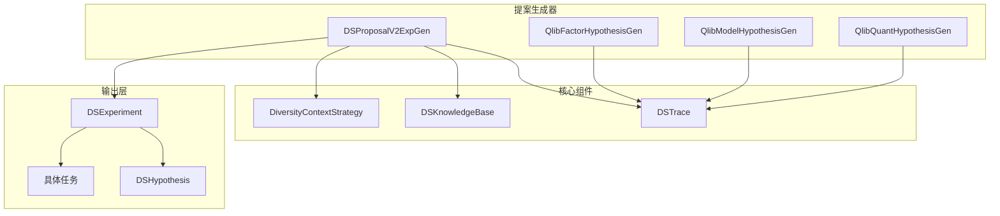
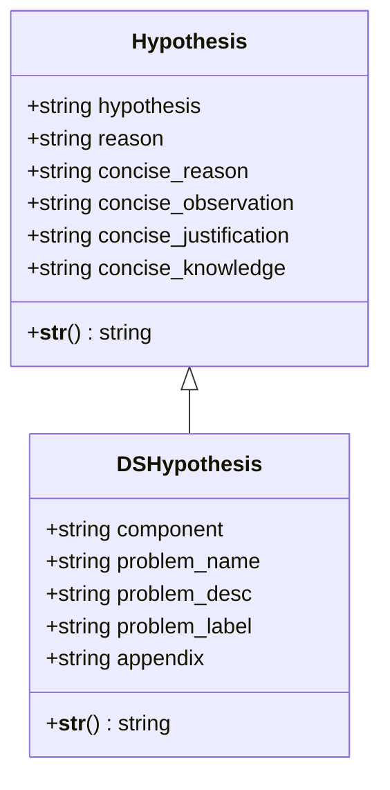
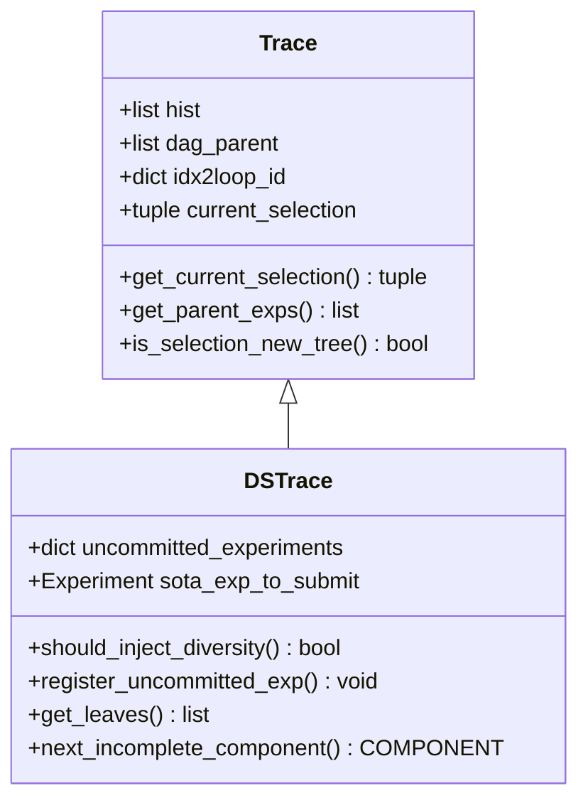
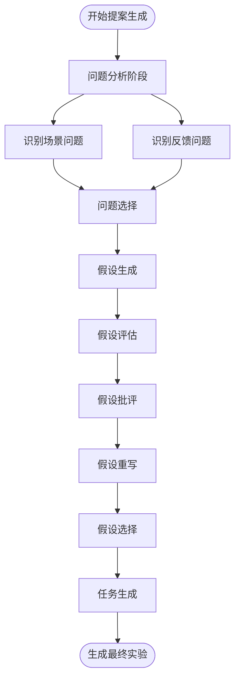
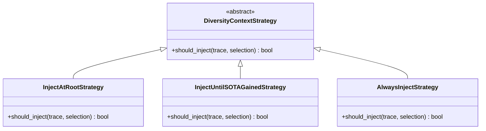
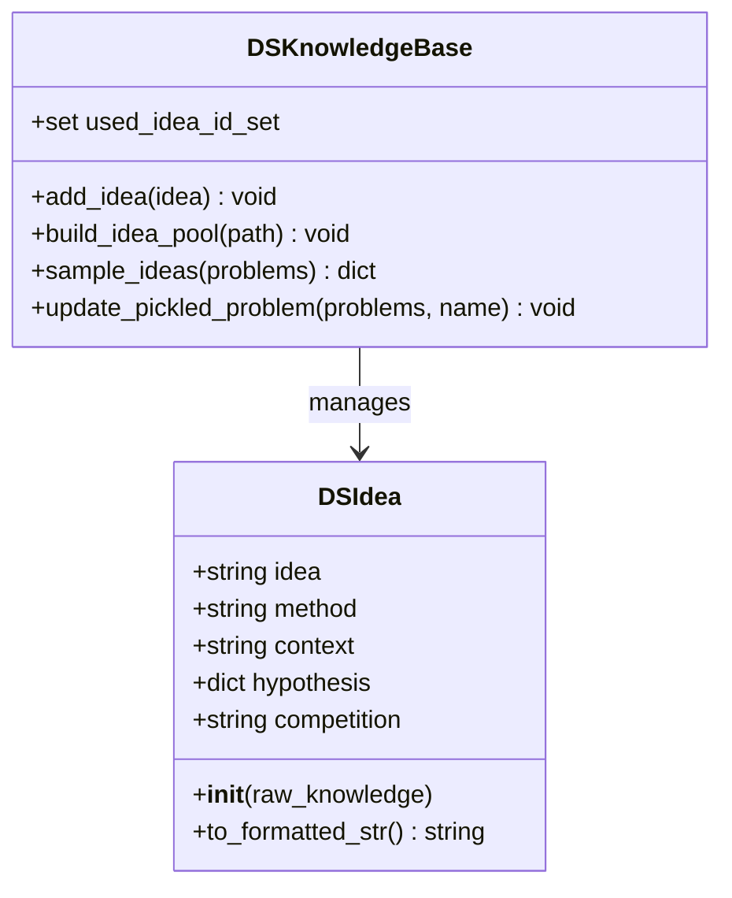
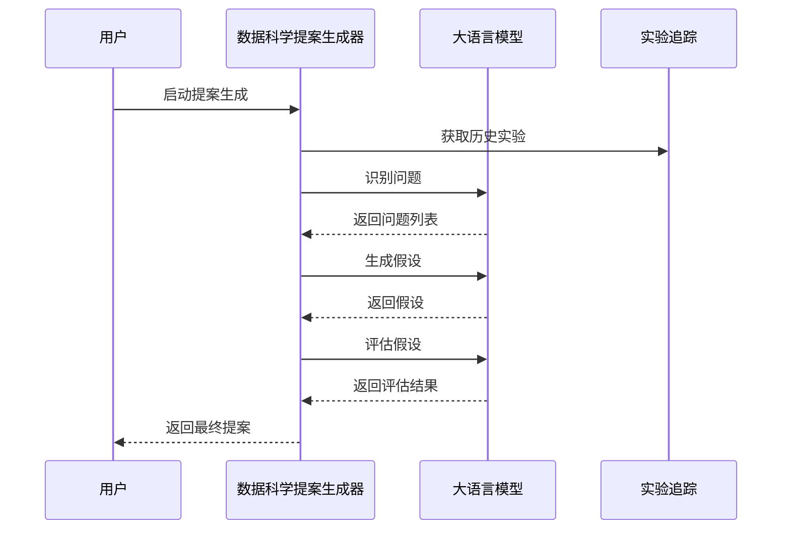
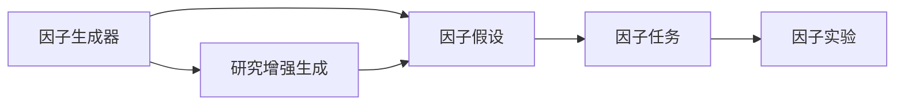
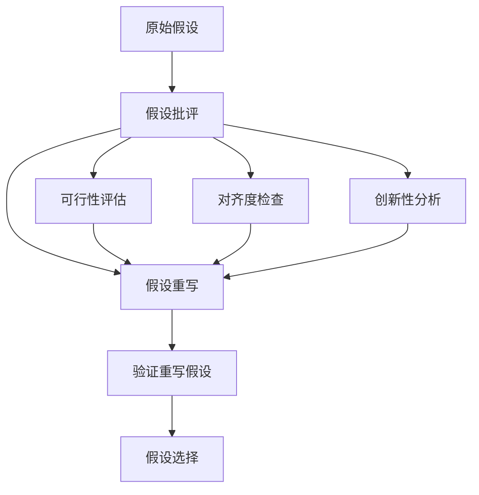

# 提案机制

<cite>
**本文档中引用的文件**
- [proposal.py](file://rdagent/scenarios/data_science/proposal/exp_gen/proposal.py)
- [diversity_strategy.py](file://rdagent/scenarios/data_science/proposal/exp_gen/diversity_strategy.py)
- [idea_pool.py](file://rdagent/scenarios/data_science/proposal/exp_gen/idea_pool.py)
- [base.py](file://rdagent/scenarios/data_science/proposal/exp_gen/base.py)
- [prompts.yaml](file://rdagent/scenarios/data_science/proposal/exp_gen/prompts.yaml)
- [prompts_v2.yaml](file://rdagent/scenarios/data_science/proposal/exp_gen/prompts_v2.yaml)
- [utils.py](file://rdagent/scenarios/data_science/proposal/exp_gen/utils.py)
- [factor_proposal.py](file://rdagent/scenarios/qlib/proposal/factor_proposal.py)
- [model_proposal.py](file://rdagent/scenarios/qlib/proposal/model_proposal.py)
- [quant_proposal.py](file://rdagent/scenarios/qlib/proposal/quant_proposal.py)
- [proposal.py](file://rdagent/core/proposal.py)
- [conf.py](file://rdagent/app/data_science/conf.py)
</cite>

## 目录
1. [概述](#概述)
2. [提案系统架构](#提案系统架构)
3. [核心组件分析](#核心组件分析)
4. [提案生成流程](#提案生成流程)
5. [多样性策略机制](#多样性策略机制)
6. [创意池管理](#创意池管理)
7. [场景特定实现](#场景特定实现)
8. [提示模板系统](#提示模板系统)
9. [评估与筛选机制](#评估与筛选机制)
10. [配置与调优](#配置与调优)
11. [实际应用案例](#实际应用案例)
12. [开发者指南](#开发者指南)

## 概述

RD-Agent的提案机制（Proposal System）是一个基于LLM驱动的研究假设生成系统，旨在通过智能分析历史实验结果和当前挑战，生成具有创新性和可行性的研究假设。该系统支持多种数据科学场景，包括Kaggle竞赛、量化金融等，并提供了灵活的配置选项来平衡创新性与保守性。

### 核心特性

- **多阶段提案生成**：包含问题识别、假设提出、评估和优化等多个阶段
- **多样性策略**：通过不同的注入策略确保探索的多样性
- **创意池管理**：基于知识图谱的idea池管理和语义检索
- **场景适配**：针对不同领域（数据科学、量化金融）提供专门的实现
- **LLM引导**：通过精心设计的提示模板引导LLM生成高质量假设

## 提案系统架构



**图表来源**
- [proposal.py](file://rdagent/scenarios/data_science/proposal/exp_gen/proposal.py#L1-L50)
- [base.py](file://rdagent/scenarios/data_science/proposal/exp_gen/base.py#L1-L50)

**章节来源**
- [proposal.py](file://rdagent/scenarios/data_science/proposal/exp_gen/proposal.py#L1-L100)
- [base.py](file://rdagent/scenarios/data_science/proposal/exp_gen/base.py#L1-L100)

## 核心组件分析

### DSHypothesis类

DSHypothesis是提案系统的核心数据结构，继承自基础Hypothesis类，扩展了针对数据科学场景的特定属性。



**图表来源**
- [base.py](file://rdagent/scenarios/data_science/proposal/exp_gen/base.py#L10-L40)
- [proposal.py](file://rdagent/scenarios/data_science/proposal/exp_gen/proposal.py#L1-L50)

### DSTrace类

DSTrace负责维护实验历史和跟踪状态，支持复杂的多分支探索结构。



**图表来源**
- [base.py](file://rdagent/scenarios/data_science/proposal/exp_gen/base.py#L50-L150)

**章节来源**
- [base.py](file://rdagent/scenarios/data_science/proposal/exp_gen/base.py#L1-L200)

## 提案生成流程

提案生成遵循严格的多阶段流程，确保每个假设都经过充分的分析和评估。



**图表来源**
- [proposal.py](file://rdagent/scenarios/data_science/proposal/exp_gen/proposal.py#L600-L700)
- [prompts_v2.yaml](file://rdagent/scenarios/data_science/proposal/exp_gen/prompts_v2.yaml#L1-L100)

### 问题识别阶段

系统通过两个主要渠道识别潜在的问题：

1. **场景问题识别**：基于当前竞争场景和最佳实践
2. **反馈问题识别**：基于历史实验的反馈和失败模式

### 假设生成阶段

使用LLM根据识别的问题生成具体的假设，重点关注：
- 针对性：直接解决识别的问题
- 可测试性：能够通过实验验证
- 创新性：提供新的视角或方法

**章节来源**
- [proposal.py](file://rdagent/scenarios/data_science/proposal/exp_gen/proposal.py#L600-L800)
- [prompts_v2.yaml](file://rdagent/scenarios/data_science/proposal/exp_gen/prompts_v2.yaml#L1-L200)

## 多样性策略机制

多样性策略确保提案系统的探索不会陷入局部最优，通过不同的注入策略维持探索的广度。



**图表来源**
- [diversity_strategy.py](file://rdagent/scenarios/data_science/proposal/exp_gen/diversity_strategy.py#L1-L69)

### 策略类型详解

1. **InjectAtRootStrategy**：仅在创建新子追踪根节点时注入多样性上下文
2. **InjectUntilSOTAGainedStrategy**：在当前子追踪中首次获得SOTA前持续注入多样性
3. **AlwaysInjectStrategy**：始终注入多样性上下文

**章节来源**
- [diversity_strategy.py](file://rdagent/scenarios/data_science/proposal/exp_gen/diversity_strategy.py#L1-L69)

## 创意池管理

创意池（Idea Pool）是提案系统的重要组成部分，通过知识图谱存储和检索成功案例中的想法。



**图表来源**
- [idea_pool.py](file://rdagent/scenarios/data_science/proposal/exp_gen/idea_pool.py#L1-L100)

### 创意池功能

1. **知识存储**：以结构化方式存储成功的实验想法
2. **语义检索**：基于问题描述进行相似想法的语义匹配
3. **多样性保证**：避免重复使用相同的创意
4. **跨场景迁移**：支持将其他场景的成功经验迁移到当前场景

**章节来源**
- [idea_pool.py](file://rdagent/scenarios/data_science/proposal/exp_gen/idea_pool.py#L1-L186)

## 场景特定实现

提案系统针对不同领域提供了专门的实现，满足各领域的特殊需求。

### 数据科学场景（ExpGen）

数据科学场景的提案生成专注于Kaggle竞赛等任务，支持完整的机器学习管道开发。



**图表来源**
- [proposal.py](file://rdagent/scenarios/data_science/proposal/exp_gen/proposal.py#L200-L300)

### 量化金融场景

量化金融场景分为因子提案和模型提案两个主要类别。

#### 因子提案（Factor Proposal）

因子提案专注于技术指标和特征工程的创新。



**图表来源**
- [factor_proposal.py](file://rdagent/scenarios/qlib/proposal/factor_proposal.py#L1-L50)

#### 模型提案（Model Proposal）

模型提案关注于预测模型的架构和训练策略改进。

**章节来源**
- [factor_proposal.py](file://rdagent/scenarios/qlib/proposal/factor_proposal.py#L1-L133)
- [model_proposal.py](file://rdagent/scenarios/qlib/proposal/model_proposal.py#L1-L160)
- [quant_proposal.py](file://rdagent/scenarios/qlib/proposal/quant_proposal.py#L1-L180)

## 提示模板系统

提示模板系统是提案生成的核心，通过精心设计的模板引导LLM产生高质量的假设。

### V1与V2对比

系统提供了两套不同的提示模板：

1. **V1模板**：传统的单一阶段提案生成
2. **V2模板**：分阶段的精细化提案生成流程

### 关键提示模板

#### 场景问题识别

```yaml
scenario_problem:
  system: |
    
    分析竞争场景和当前最佳实践，识别关键挑战...
  user: |
    # 竞赛描述
    {{ scenario_desc }}
    
    # 当前最佳实践
    {{ sota_exp_desc }}
```

#### 假设生成

```yaml
hypothesis_gen:
  system: |
    
    基于识别的问题生成具体假设...
  user: |
    # 竞赛描述
    {{ scenario_desc }}
    
    # 识别的问题
    {{ problems }}
```

**章节来源**
- [prompts.yaml](file://rdagent/scenarios/data_science/proposal/exp_gen/prompts.yaml#L1-L350)
- [prompts_v2.yaml](file://rdagent/scenarios/data_science/proposal/exp_gen/prompts_v2.yaml#L1-L800)

## 评估与筛选机制

提案系统实现了多层次的评估和筛选机制，确保只有高质量的假设才能进入实验阶段。

### 假设评估维度

1. **挑战-假设对齐度**：假设是否直接解决了识别的挑战
2. **预期影响**：假设实施后可能带来的改进程度
3. **新颖性**：假设相对于历史尝试的新颖程度
4. **可行性**：假设在现有约束下实现的可能性
5. **风险-回报平衡**：潜在收益与实施风险的权衡

### 批评与重写流程



**图表来源**
- [proposal.py](file://rdagent/scenarios/data_science/proposal/exp_gen/proposal.py#L700-L800)

**章节来源**
- [proposal.py](file://rdagent/scenarios/data_science/proposal/exp_gen/proposal.py#L700-L900)

## 配置与调优

提案系统提供了丰富的配置选项，允许用户根据具体需求调整系统的创新性与保守性平衡。

### 主要配置参数

| 参数名 | 类型 | 默认值 | 描述 |
|--------|------|--------|------|
| enable_knowledge_base | bool | False | 是否启用创意池 |
| enable_research_rag | bool | False | 是否启用研究RAG |
| enable_hypo_critique_rewrite | bool | False | 是否启用假设批评重写 |
| enable_cross_trace_diversity | bool | True | 是否启用跨追踪多样性 |
| diversity_injection_strategy | str | InjectUntilSOTAGainedStrategy | 多样性注入策略 |
| enable_generate_unique_hypothesis | bool | False | 是否生成唯一假设 |

### 创新性与保守性平衡

系统通过以下机制平衡创新性与保守性：

1. **多样性策略控制**：通过不同的注入策略控制探索范围
2. **创意池限制**：避免过度依赖历史成功案例
3. **假设评估阈值**：设置最低质量标准
4. **Sibling多样性检查**：确保并行探索的多样性

**章节来源**
- [conf.py](file://rdagent/app/data_science/conf.py#L1-L207)

## 实际应用案例

### 案例1：Kaggle竞赛场景

在一个Kaggle分类竞赛中，提案系统的工作流程如下：

1. **问题识别**：发现数据不平衡和特征工程不足
2. **假设生成**：提出使用SMOTE处理不平衡和集成多种特征工程技术
3. **评估筛选**：通过多维度评估选择最具潜力的假设
4. **任务生成**：生成具体的特征工程和模型集成任务

### 案例2：量化金融场景

在量化金融领域，系统针对不同的投资策略进行提案：

1. **因子提案**：基于市场行为特征生成新的技术指标
2. **模型提案**：提出改进的预测模型架构
3. **组合策略**：设计更有效的资产配置策略

## 开发者指南

### 自定义提案策略

开发者可以通过继承基类来实现自定义的提案策略：

```python
class CustomHypothesisGen(HypothesisGen):
    def gen(self, trace: Trace, plan: ExperimentPlan | None = None) -> Hypothesis:
        # 实现自定义的假设生成逻辑
        pass
```

### 添加新的场景支持

1. 继承基础场景类
2. 实现特定的提案生成逻辑
3. 定义相应的提示模板
4. 注册到系统配置中

### 性能优化建议

1. **缓存策略**：缓存频繁使用的LLM响应
2. **批处理**：批量处理多个提案生成请求
3. **异步执行**：使用异步模式提高并发性能
4. **资源管理**：合理分配计算资源

**章节来源**
- [proposal.py](file://rdagent/scenarios/data_science/proposal/exp_gen/proposal.py#L1-L1502)
- [base.py](file://rdagent/core/proposal.py#L1-L390)

## 结论

RD-Agent的提案机制通过智能化的问题识别、假设生成和评估筛选，为数据科学研究提供了强大的自动化支持。其模块化的架构设计、多样性的探索策略和丰富的配置选项，使其能够适应各种复杂的研究场景，显著提升研究效率和创新水平。

通过持续的优化和扩展，提案机制将继续在推动人工智能研究方法学的发展中发挥重要作用。