# 核心概念

<cite>
**本文档引用的文件**
- [evolving_agent.py](file://rdagent/core/evolving_agent.py)
- [scenario.py](file://rdagent/core/scenario.py)
- [experiment.py](file://rdagent/core/experiment.py)
- [evolving_framework.py](file://rdagent/core/evolving_framework.py)
- [base.py](file://rdagent/components/agent/base.py)
- [vector_base.py](file://rdagent/components/knowledge_management/vector_base.py)
- [knowledge_base.py](file://rdagent/core/knowledge_base.py)
- [knowledge_management.py](file://rdagent/components/coder/CoSTEER/knowledge_management.py)
- [evolving_strategy.py](file://rdagent/components/coder/CoSTEER/evolving_strategy.py)
- [scen/__init__.py](file://rdagent/scenarios/data_science/scen/__init__.py)
- [experiment.py](file://rdagent/scenarios/data_science/experiment/experiment.py)
- [evaluation.py](file://rdagent/core/evaluation.py)
- [evaluators.py](file://rdagent/components/coder/CoSTEER/evaluators.py)
</cite>

## 目录
1. [引言](#引言)
2. [项目结构概览](#项目结构概览)
3. [演化代理（Evolving Agent）](#演化代理evolving-agent)
4. [场景（Scenario）](#场景scenario)
5. [实验（Experiment）与任务（Task）](#实验experiment与任务task)
6. [检索增强生成（RAG）机制](#检索增强生成rag机制)
7. [反馈与评估系统](#反馈与评估系统)
8. [闭环优化流程](#闭环优化流程)
9. [架构总结](#架构总结)

## 引言

RD-Agent是一个基于人工智能的研发自动化框架，旨在通过智能代理驱动的研发循环实现代码的自动演化和优化。该框架的核心思想是模拟人类研发人员的工作流程，通过迭代式的演化过程不断改进解决方案的质量。

框架的设计哲学建立在以下核心概念之上：
- **演化驱动**：通过多步骤的演化策略实现持续改进
- **知识积累**：构建动态的知识库支持智能决策
- **闭环反馈**：建立完整的评估-反馈-优化循环
- **模块化设计**：支持不同领域的定制化扩展

## 项目结构概览

RD-Agent采用分层架构设计，主要包含以下核心模块：

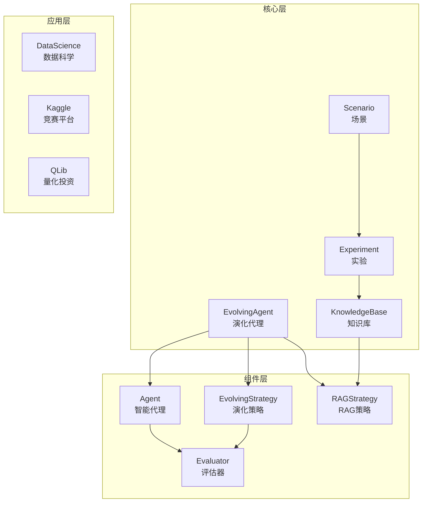

**图表来源**
- [evolving_agent.py](file://rdagent/core/evolving_agent.py#L1-L116)
- [scenario.py](file://rdagent/core/scenario.py#L1-L65)
- [experiment.py](file://rdagent/core/experiment.py#L1-L483)

## 演化代理（Evolving Agent）

### RAGEvoAgent核心架构

RAGEvoAgent是RD-Agent框架的核心引擎，负责驱动整个研发循环。它继承自抽象基类EvoAgent，并实现了`multistep_evolve`方法来管理演化过程。

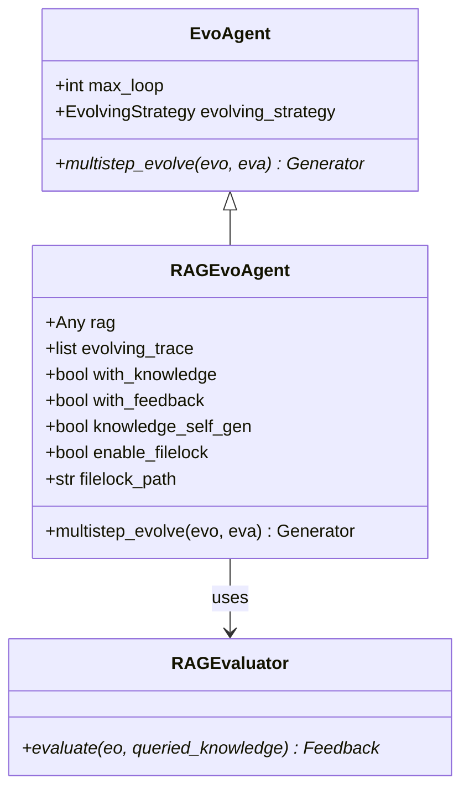

**图表来源**
- [evolving_agent.py](file://rdagent/core/evolving_agent.py#L15-L116)

### 多步演化流程

`multistep_evolve`方法实现了七阶段的演化循环：

1. **RAG查询**：从知识库检索相关经验
2. **演化操作**：应用演化策略生成新版本
3. **结果封装**：将演化结果打包为EvoStep
4. **评估反馈**：执行评估获得反馈信息
5. **轨迹更新**：记录演化历史
6. **知识自生**：生成新的知识条目
7. **完成检查**：验证是否达到终止条件

**图表来源**
- [evolving_agent.py](file://rdagent/core/evolving_agent.py#L75-L114)

**章节来源**
- [evolving_agent.py](file://rdagent/core/evolving_agent.py#L46-L114)

## 场景（Scenario）

### 场景作为应用入口点

Scenario类定义了特定应用领域的环境和约束条件，为实验提供上下文信息。它包含了背景信息、数据描述、运行时环境等关键要素。

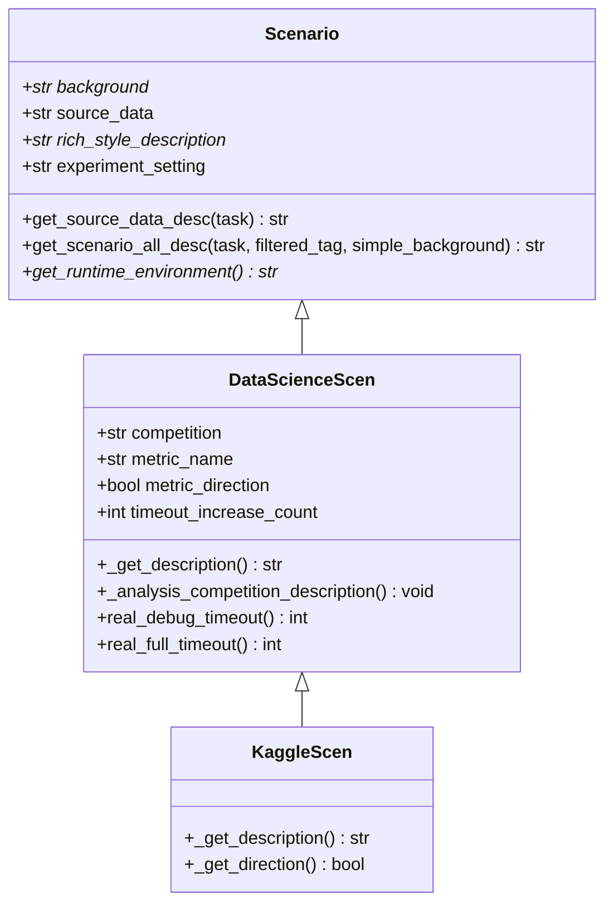

**图表来源**
- [scenario.py](file://rdagent/core/scenario.py#L5-L65)
- [scen/__init__.py](file://rdagent/scenarios/data_science/scen/__init__.py#L20-L289)

### 场景的核心职责

1. **背景信息提供**：描述领域特性和问题背景
2. **数据源管理**：提供数据集描述和访问接口
3. **环境配置**：定义运行时环境要求
4. **约束定义**：设置性能和质量约束

**章节来源**
- [scenario.py](file://rdagent/core/scenario.py#L1-L65)
- [scen/__init__.py](file://rdagent/scenarios/data_science/scen/__init__.py#L1-L289)

## 实验（Experiment）与任务（Task）

### 实验与任务层次结构

RD-Agent采用分层的任务组织结构，Experiment作为高层容器，Task作为具体的工作单元。

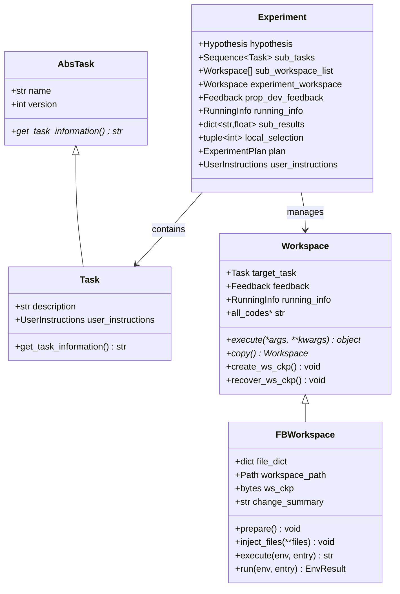

**图表来源**
- [experiment.py](file://rdagent/core/experiment.py#L25-L483)

### 工作空间机制

FBWorkspace提供了文件系统级别的工作空间管理，支持代码注入、执行和状态恢复：

1. **代码注入**：动态修改文件内容
2. **环境准备**：设置运行时环境
3. **执行控制**：执行代码并捕获输出
4. **状态管理**：创建和恢复检查点

**章节来源**
- [experiment.py](file://rdagent/core/experiment.py#L1-L483)

## 检索增强生成（RAG）机制

### RAGStrategy架构设计

RAG（Retrieval Augmented Generation）机制是RD-Agent知识管理的核心，通过检索历史经验来指导新代码生成。

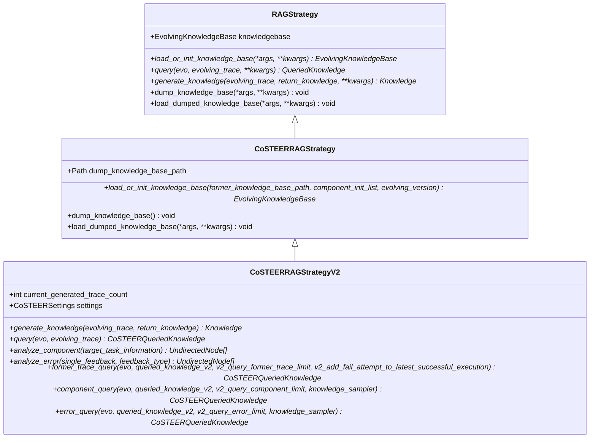

**图表来源**
- [evolving_framework.py](file://rdagent/core/evolving_framework.py#L85-L127)
- [knowledge_management.py](file://rdagent/components/coder/CoSTEER/knowledge_management.py#L54-L79)

### 知识库查询策略

CoSTEERRAGStrategyV2实现了多层次的知识查询机制：

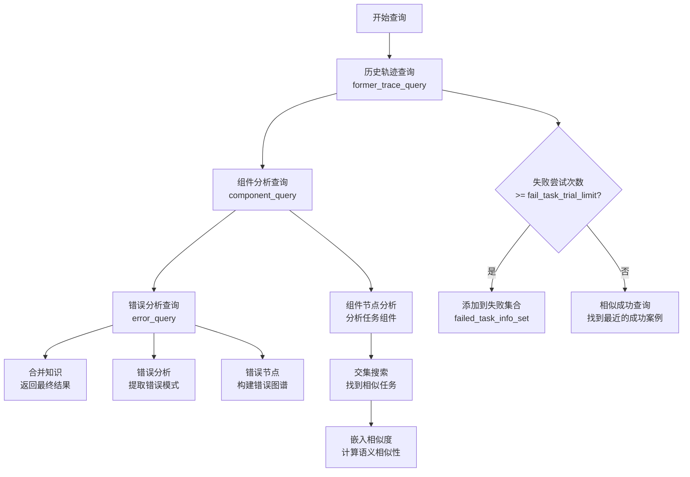

**图表来源**
- [knowledge_management.py](file://rdagent/components/coder/CoSTEER/knowledge_management.py#L350-L450)

### 向量知识库实现

框架支持基于向量的高效知识检索：

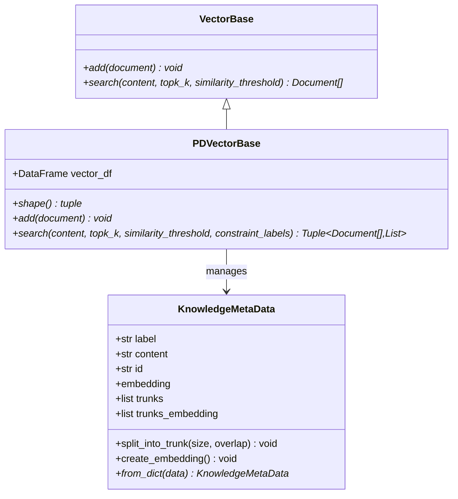

**图表来源**
- [vector_base.py](file://rdagent/components/knowledge_management/vector_base.py#L50-L208)

**章节来源**
- [evolving_framework.py](file://rdagent/core/evolving_framework.py#L85-L127)
- [knowledge_management.py](file://rdagent/components/coder/CoSTEER/knowledge_management.py#L1-L964)
- [vector_base.py](file://rdagent/components/knowledge_management/vector_base.py#L1-L208)

## 反馈与评估系统

### 评估器架构

RD-Agent采用分层的评估体系，支持多种评估维度和粒度：

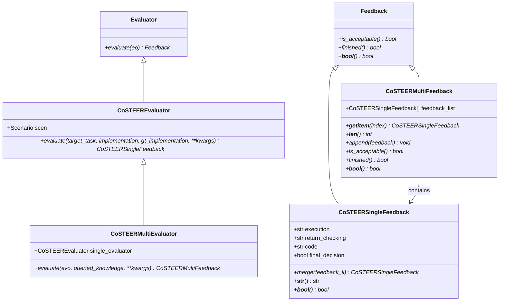

**图表来源**
- [evaluation.py](file://rdagent/core/evaluation.py#L1-L58)
- [evaluators.py](file://rdagent/components/coder/CoSTEER/evaluators.py#L1-L312)

### 多维度反馈机制

CoSTEERSingleFeedback提供了细粒度的反馈信息：

1. **执行反馈**：代码执行过程中的输出和错误
2. **返回值检查**：验证函数返回值的正确性
3. **代码质量**：代码风格和规范性评估
4. **最终决策**：综合判断是否成功

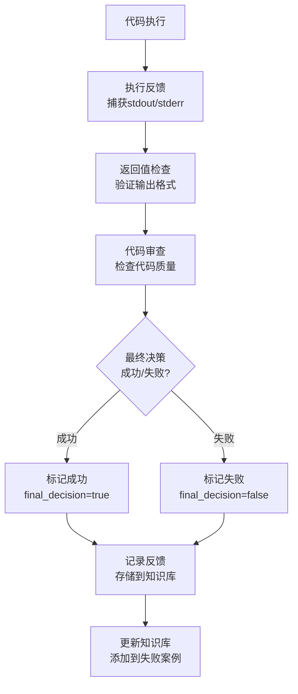

**图表来源**
- [evaluators.py](file://rdagent/components/coder/CoSTEER/evaluators.py#L25-L100)

**章节来源**
- [evaluation.py](file://rdagent/core/evaluation.py#L1-L58)
- [evaluators.py](file://rdagent/components/coder/CoSTEER/evaluators.py#L1-L312)

## 闭环优化流程

### 整体演化循环

RD-Agent通过完整的闭环系统实现持续优化：

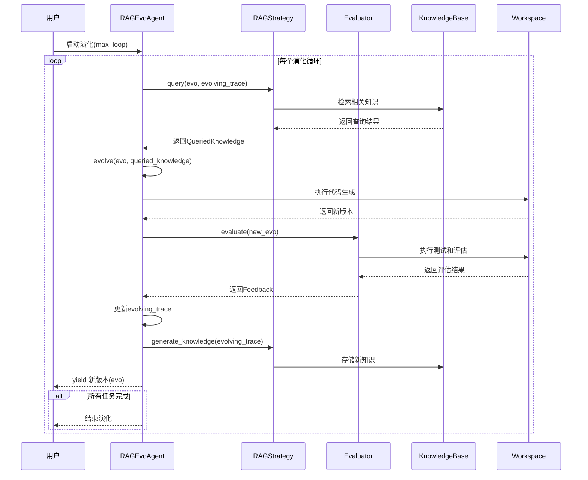

**图表来源**
- [evolving_agent.py](file://rdagent/core/evolving_agent.py#L75-L114)

### 知识积累与传承

框架通过知识库实现经验的积累和传承：

1. **成功案例存储**：记录成功的解决方案
2. **失败模式分析**：识别和避免常见错误
3. **组件知识图谱**：构建领域知识网络
4. **错误修复模式**：学习错误修复策略

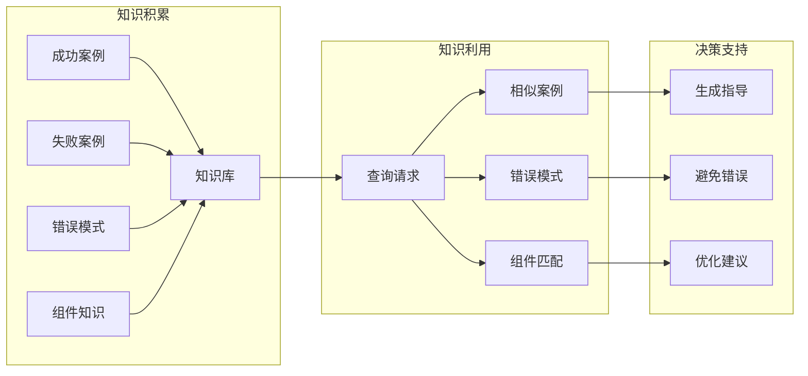

**章节来源**
- [evolving_agent.py](file://rdagent/core/evolving_agent.py#L75-L114)
- [knowledge_management.py](file://rdagent/components/coder/CoSTEER/knowledge_management.py#L300-L400)

## 架构总结

RD-Agent框架通过以下核心设计原则实现智能化的研发自动化：

### 设计原则

1. **模块化架构**：清晰的层次划分和职责分离
2. **可扩展性**：支持不同领域的定制化实现
3. **知识驱动**：基于历史经验的智能决策
4. **闭环优化**：完整的评估-反馈-改进循环
5. **并发处理**：支持多任务并行演化

### 技术特色

- **多模态知识管理**：结合向量检索和图谱推理
- **智能演化策略**：基于组件分析和错误模式的学习
- **分布式知识共享**：支持多个代理间的知识同步
- **实时监控反馈**：提供详细的演化过程跟踪

### 应用价值

RD-Agent框架为AI驱动的研发提供了完整的基础设施，能够：
- 自动化复杂系统的开发流程
- 提高代码质量和开发效率
- 减少重复性工作和错误率
- 支持跨领域的知识迁移

通过深入理解这些核心概念，开发者可以更好地掌握RD-Agent的工作原理，并根据具体需求进行定制化扩展。