# 核心概念

<cite>
**本文档引用的文件**
- [evolving_agent.py](file://rdagent/core/evolving_agent.py)
<<<<<<< HEAD
- [scenario.py](file://rdagent/core/scenario.py)
- [experiment.py](file://rdagent/core/experiment.py)
- [evolving_framework.py](file://rdagent/core/evolving_framework.py)
- [base.py](file://rdagent/components/agent/base.py)
- [vector_base.py](file://rdagent/components/knowledge_management/vector_base.py)
- [knowledge_base.py](file://rdagent/core/knowledge_base.py)
- [knowledge_management.py](file://rdagent/components/coder/CoSTEER/knowledge_management.py)
- [evolving_strategy.py](file://rdagent/components/coder/CoSTEER/evolving_strategy.py)
- [scen/__init__.py](file://rdagent/scenarios/data_science/scen/__init__.py)
- [experiment.py](file://rdagent/scenarios/data_science/experiment/experiment.py)
- [evaluation.py](file://rdagent/core/evaluation.py)
- [evaluators.py](file://rdagent/components/coder/CoSTEER/evaluators.py)
=======
- [evolving_framework.py](file://rdagent/core/evolving_framework.py)
- [knowledge_base.py](file://rdagent/core/knowledge_base.py)
- [proposal.py](file://rdagent/core/proposal.py)
- [experiment.py](file://rdagent/core/experiment.py)
- [scenario.py](file://rdagent/core/scenario.py)
- [evaluation.py](file://rdagent/core/evaluation.py)
- [CoSTEER/__init__.py](file://rdagent/components/coder/CoSTEER/__init__.py)
- [evolving_strategy.py](file://rdagent/components/coder/CoSTEER/evolving_strategy.py)
- [knowledge_management.py](file://rdagent/components/coder/CoSTEER/knowledge_management.py)
- [rd_loop.py](file://rdagent/components/workflow/rd_loop.py)
- [loop.py](file://rdagent/app/data_science/loop.py)
>>>>>>> 553228cf4b951bda668568f1ff4a2970581ffb9f
</cite>

## 目录
1. [引言](#引言)
<<<<<<< HEAD
2. [项目结构概览](#项目结构概览)
3. [演化代理（Evolving Agent）](#演化代理evolving-agent)
4. [场景（Scenario）](#场景scenario)
5. [实验（Experiment）与任务（Task）](#实验experiment与任务task)
6. [检索增强生成（RAG）机制](#检索增强生成rag机制)
7. [反馈与评估系统](#反馈与评估系统)
8. [闭环优化流程](#闭环优化流程)
9. [架构总结](#架构总结)

## 引言

RD-Agent是一个基于人工智能的研发自动化框架，旨在通过智能代理驱动的研发循环实现代码的自动演化和优化。该框架的核心思想是模拟人类研发人员的工作流程，通过迭代式的演化过程不断改进解决方案的质量。

框架的设计哲学建立在以下核心概念之上：
- **演化驱动**：通过多步骤的演化策略实现持续改进
- **知识积累**：构建动态的知识库支持智能决策
- **闭环反馈**：建立完整的评估-反馈-优化循环
- **模块化设计**：支持不同领域的定制化扩展

## 项目结构概览

RD-Agent采用分层架构设计，主要包含以下核心模块：

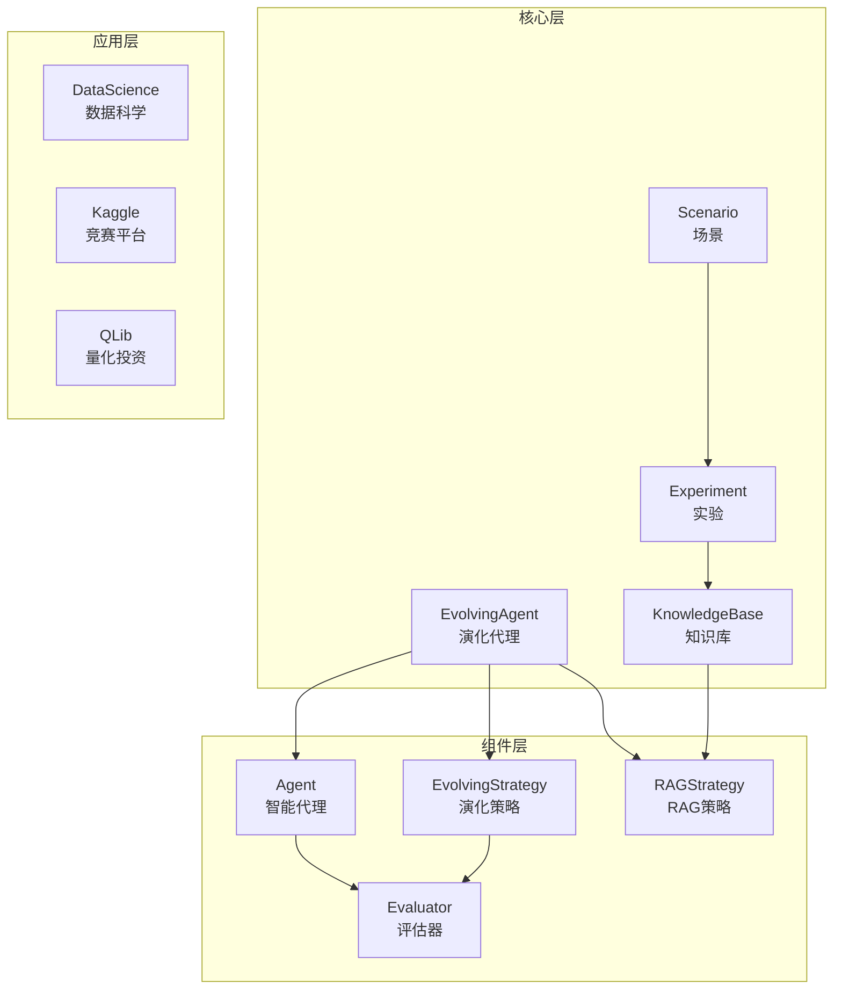
```mermaid
graph TB
subgraph "核心层"
EA[EvolvingAgent<br/>演化代理]
SC[Scenario<br/>场景]
EX[Experiment<br/>实验]
KB[KnowledgeBase<br/>知识库]
end
subgraph "组件层"
AG[Agent<br/>智能代理]
EV[Evaluator<br/>评估器]
ES[EvolvingStrategy<br/>演化策略]
RAG[RAGStrategy<br/>RAG策略]
end
subgraph "应用层"
DS[DataScience<br/>数据科学]
KAG[Kaggle<br/>竞赛平台]
QLIB[QLib<br/>量化投资]
end
EA --> AG
EA --> ES
EA --> RAG
SC --> EX
EX --> KB
KB --> RAG
AG --> EV
ES --> EV
```

**图表来源**
- [evolving_agent.py](file://rdagent/core/evolving_agent.py#L1-L116)
- [scenario.py](file://rdagent/core/scenario.py#L1-L65)
- [experiment.py](file://rdagent/core/experiment.py#L1-L483)

## 演化代理（Evolving Agent）

### RAGEvoAgent核心架构

RAGEvoAgent是RD-Agent框架的核心引擎，负责驱动整个研发循环。它继承自抽象基类EvoAgent，并实现了`multistep_evolve`方法来管理演化过程。

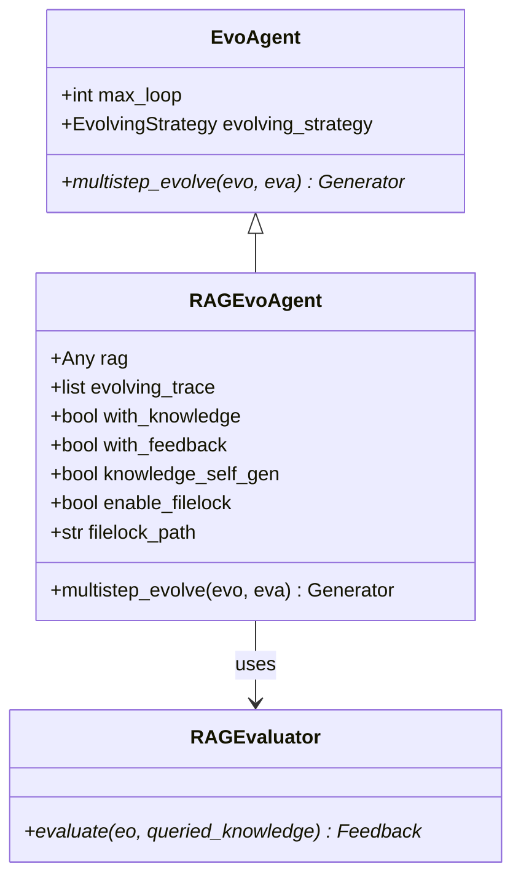
```mermaid
classDiagram
class EvoAgent {
+int max_loop
+EvolvingStrategy evolving_strategy
+multistep_evolve(evo, eva)* Generator
}
class RAGEvoAgent {
+Any rag
+list evolving_trace
+bool with_knowledge
+bool with_feedback
+bool knowledge_self_gen
+bool enable_filelock
+str filelock_path
+multistep_evolve(evo, eva) Generator
}
class RAGEvaluator {
+evaluate(eo, queried_knowledge)* Feedback
}
EvoAgent <|-- RAGEvoAgent
RAGEvoAgent --> RAGEvaluator : uses
```

**图表来源**
- [evolving_agent.py](file://rdagent/core/evolving_agent.py#L15-L116)

### 多步演化流程

`multistep_evolve`方法实现了七阶段的演化循环：

1. **RAG查询**：从知识库检索相关经验
2. **演化操作**：应用演化策略生成新版本
3. **结果封装**：将演化结果打包为EvoStep
4. **评估反馈**：执行评估获得反馈信息
5. **轨迹更新**：记录演化历史
6. **知识自生**：生成新的知识条目
7. **完成检查**：验证是否达到终止条件

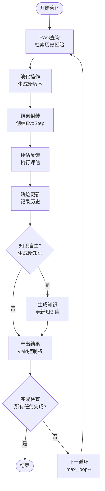
```mermaid
flowchart TD
Start([开始演化]) --> RAGQuery["RAG查询<br/>检索历史经验"]
RAGQuery --> Evolve["演化操作<br/>生成新版本"]
Evolve --> Package["结果封装<br/>创建EvoStep"]
Package --> Evaluate["评估反馈<br/>执行评估"]
Evaluate --> UpdateTrace["轨迹更新<br/>记录历史"]
UpdateTrace --> SelfGen{"知识自生?<br/>生成新知识"}
SelfGen --> |是| GenKnowledge["生成知识<br/>更新知识库"]
SelfGen --> |否| Yield["产出结果<br/>yield控制权"]
GenKnowledge --> Yield
Yield --> Check{"完成检查<br/>所有任务完成?"}
Check --> |是| End([结束])
Check --> |否| NextLoop["下一循环<br/>max_loop--"]
NextLoop --> RAGQuery
```

**图表来源**
- [evolving_agent.py](file://rdagent/core/evolving_agent.py#L75-L114)

**章节来源**
- [evolving_agent.py](file://rdagent/core/evolving_agent.py#L46-L114)

## 场景（Scenario）

### 场景作为应用入口点

Scenario类定义了特定应用领域的环境和约束条件，为实验提供上下文信息。它包含了背景信息、数据描述、运行时环境等关键要素。

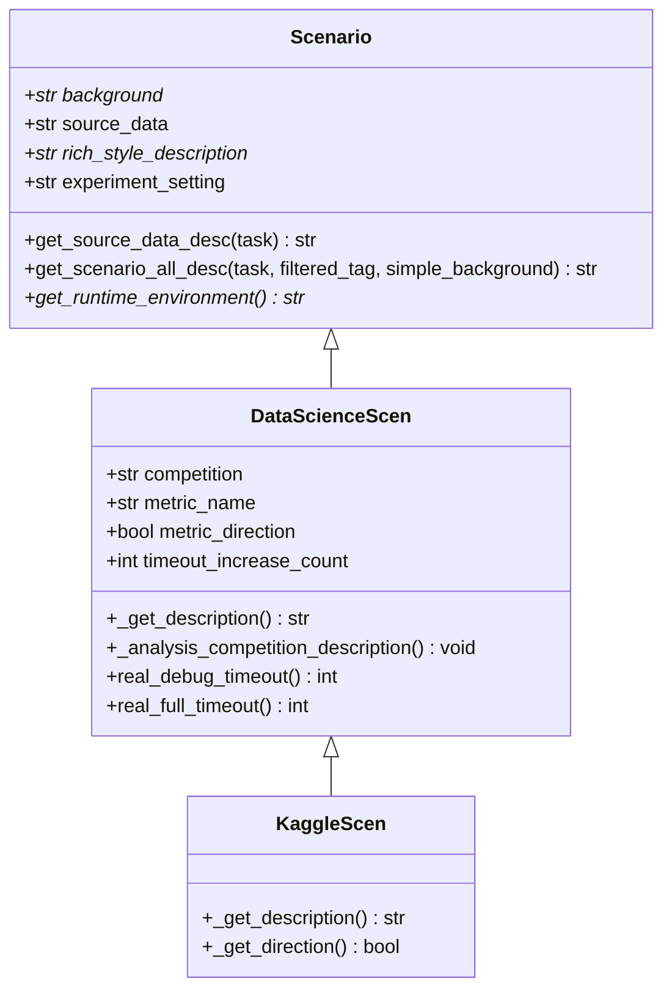
```mermaid
classDiagram
class Scenario {
+str background*
+str source_data
+str rich_style_description*
+get_source_data_desc(task) str
+get_scenario_all_desc(task, filtered_tag, simple_background) str
+get_runtime_environment()* str
+str experiment_setting
}
class DataScienceScen {
+str competition
+str metric_name
+bool metric_direction
+int timeout_increase_count
+_get_description() str
+_analysis_competition_description() void
+real_debug_timeout() int
+real_full_timeout() int
}
class KaggleScen {
+_get_description() str
+_get_direction() bool
}
Scenario <|-- DataScienceScen
DataScienceScen <|-- KaggleScen
```

**图表来源**
- [scenario.py](file://rdagent/core/scenario.py#L5-L65)
- [scen/__init__.py](file://rdagent/scenarios/data_science/scen/__init__.py#L20-L289)

### 场景的核心职责

1. **背景信息提供**：描述领域特性和问题背景
2. **数据源管理**：提供数据集描述和访问接口
3. **环境配置**：定义运行时环境要求
4. **约束定义**：设置性能和质量约束

**章节来源**
- [scenario.py](file://rdagent/core/scenario.py#L1-L65)
- [scen/__init__.py](file://rdagent/scenarios/data_science/scen/__init__.py#L1-L289)

## 实验（Experiment）与任务（Task）

### 实验与任务层次结构

RD-Agent采用分层的任务组织结构，Experiment作为高层容器，Task作为具体的工作单元。

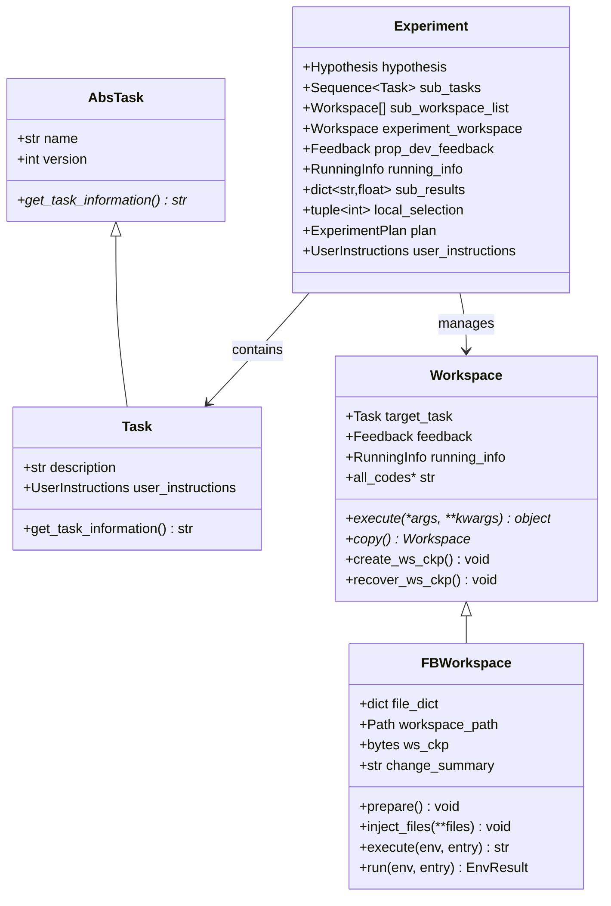
```mermaid
classDiagram
class AbsTask {
+str name
+int version
+get_task_information()* str
}
class Task {
+str description
+UserInstructions user_instructions
+get_task_information() str
}
class Workspace {
+Task target_task
+Feedback feedback
+RunningInfo running_info
+execute(*args, **kwargs)* object
+copy()* Workspace
+all_codes* str
+create_ws_ckp() void
+recover_ws_ckp() void
}
class FBWorkspace {
+dict file_dict
+Path workspace_path
+bytes ws_ckp
+str change_summary
+prepare() void
+inject_files(**files) void
+execute(env, entry) str
+run(env, entry) EnvResult
}
class Experiment {
+Hypothesis hypothesis
+Sequence~Task~ sub_tasks
+Workspace[] sub_workspace_list
+Workspace experiment_workspace
+Feedback prop_dev_feedback
+RunningInfo running_info
+dict~str,float~ sub_results
+tuple~int~ local_selection
+ExperimentPlan plan
+UserInstructions user_instructions
}
AbsTask <|-- Task
Workspace <|-- FBWorkspace
Experiment --> Task : contains
Experiment --> Workspace : manages
```

**图表来源**
- [experiment.py](file://rdagent/core/experiment.py#L25-L483)

### 工作空间机制

FBWorkspace提供了文件系统级别的工作空间管理，支持代码注入、执行和状态恢复：

1. **代码注入**：动态修改文件内容
2. **环境准备**：设置运行时环境
3. **执行控制**：执行代码并捕获输出
4. **状态管理**：创建和恢复检查点

**章节来源**
- [experiment.py](file://rdagent/core/experiment.py#L1-L483)

## 检索增强生成（RAG）机制

### RAGStrategy架构设计

RAG（Retrieval Augmented Generation）机制是RD-Agent知识管理的核心，通过检索历史经验来指导新代码生成。

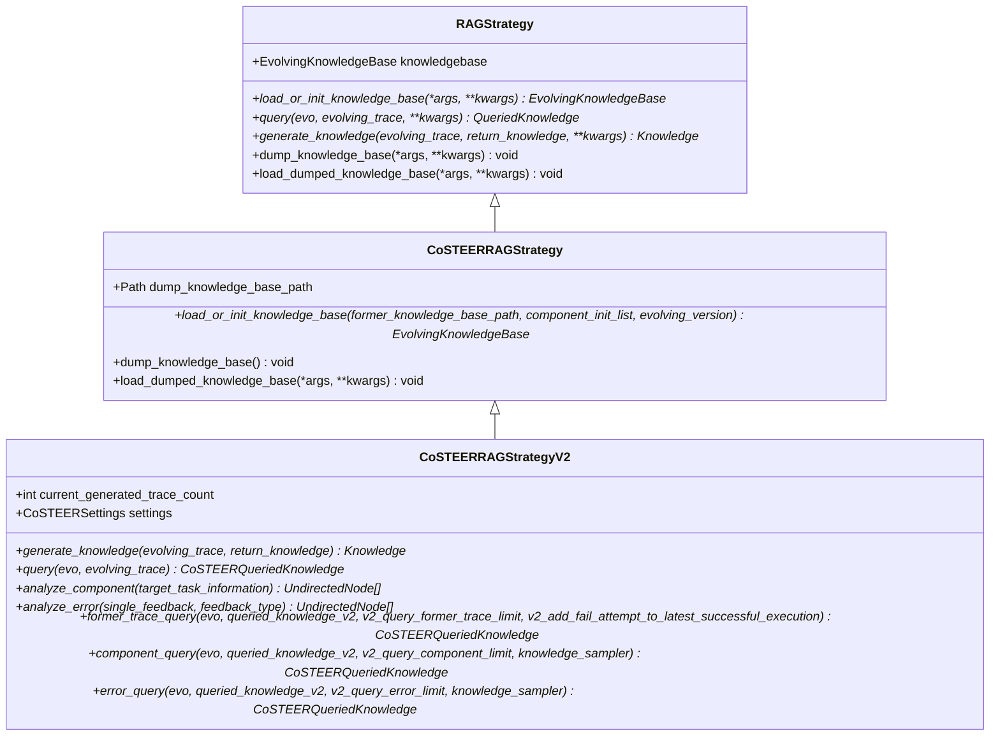
```mermaid
classDiagram
class RAGStrategy {
+EvolvingKnowledgeBase knowledgebase
+load_or_init_knowledge_base(*args, **kwargs)* EvolvingKnowledgeBase
+query(evo, evolving_trace, **kwargs)* QueriedKnowledge
+generate_knowledge(evolving_trace, return_knowledge, **kwargs)* Knowledge
+dump_knowledge_base(*args, **kwargs) void
+load_dumped_knowledge_base(*args, **kwargs) void
}
class CoSTEERRAGStrategy {
+Path dump_knowledge_base_path
+load_or_init_knowledge_base(former_knowledge_base_path, component_init_list, evolving_version)* EvolvingKnowledgeBase
+dump_knowledge_base() void
+load_dumped_knowledge_base(*args, **kwargs) void
}
class CoSTEERRAGStrategyV2 {
+int current_generated_trace_count
+CoSTEERSettings settings
+generate_knowledge(evolving_trace, return_knowledge)* Knowledge
+query(evo, evolving_trace)* CoSTEERQueriedKnowledge
+analyze_component(target_task_information)* UndirectedNode[]
+analyze_error(single_feedback, feedback_type)* UndirectedNode[]
+former_trace_query(evo, queried_knowledge_v2, v2_query_former_trace_limit, v2_add_fail_attempt_to_latest_successful_execution)* CoSTEERQueriedKnowledge
+component_query(evo, queried_knowledge_v2, v2_query_component_limit, knowledge_sampler)* CoSTEERQueriedKnowledge
+error_query(evo, queried_knowledge_v2, v2_query_error_limit, knowledge_sampler)* CoSTEERQueriedKnowledge
}
RAGStrategy <|-- CoSTEERRAGStrategy
CoSTEERRAGStrategy <|-- CoSTEERRAGStrategyV2
```

**图表来源**
- [evolving_framework.py](file://rdagent/core/evolving_framework.py#L85-L127)
- [knowledge_management.py](file://rdagent/components/coder/CoSTEER/knowledge_management.py#L54-L79)

### 知识库查询策略

CoSTEERRAGStrategyV2实现了多层次的知识查询机制：

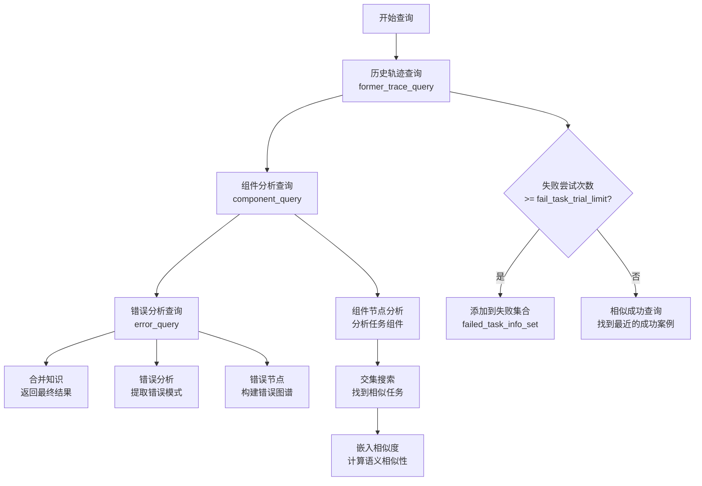
```mermaid
flowchart TD
QueryStart["开始查询"] --> FormerTrace["历史轨迹查询<br/>former_trace_query"]
FormerTrace --> Component["组件分析查询<br/>component_query"]
Component --> Error["错误分析查询<br/>error_query"]
Error --> Merge["合并知识<br/>返回最终结果"]
FormerTrace --> FailAttempt{"失败尝试次数<br/>>= fail_task_trial_limit?"}
FailAttempt --> |是| AddToFailed["添加到失败集合<br/>failed_task_info_set"]
FailAttempt --> |否| SimilarSuccess["相似成功查询<br/>找到最近的成功案例"]
Component --> ComponentNodes["组件节点分析<br/>分析任务组件"]
ComponentNodes --> Intersection["交集搜索<br/>找到相似任务"]
Intersection --> Embedding["嵌入相似度<br/>计算语义相似性"]
Error --> ErrorAnalysis["错误分析<br/>提取错误模式"]
Error --> ErrorNodes["错误节点<br/>构建错误图谱"]
```

**图表来源**
- [knowledge_management.py](file://rdagent/components/coder/CoSTEER/knowledge_management.py#L350-L450)

### 向量知识库实现

框架支持基于向量的高效知识检索：

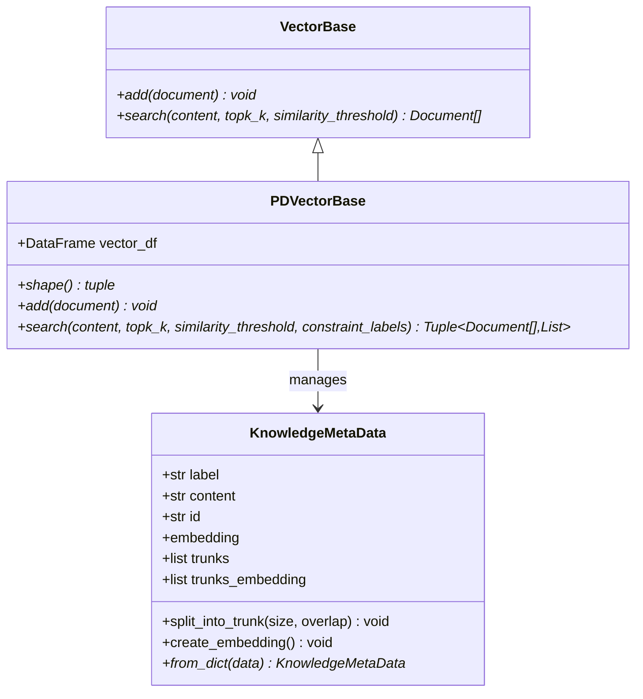
```mermaid
classDiagram
class VectorBase {
+add(document)* void
+search(content, topk_k, similarity_threshold)* Document[]
}
class PDVectorBase {
+DataFrame vector_df
+shape()* tuple
+add(document)* void
+search(content, topk_k, similarity_threshold, constraint_labels)* Tuple~Document[],List~
}
class KnowledgeMetaData {
+str label
+str content
+str id
+embedding
+list trunks
+list trunks_embedding
+split_into_trunk(size, overlap) void
+create_embedding() void
+from_dict(data)* KnowledgeMetaData
}
VectorBase <|-- PDVectorBase
PDVectorBase --> KnowledgeMetaData : manages
```

**图表来源**
- [vector_base.py](file://rdagent/components/knowledge_management/vector_base.py#L50-L208)

**章节来源**
- [evolving_framework.py](file://rdagent/core/evolving_framework.py#L85-L127)
- [knowledge_management.py](file://rdagent/components/coder/CoSTEER/knowledge_management.py#L1-L964)
- [vector_base.py](file://rdagent/components/knowledge_management/vector_base.py#L1-L208)

## 反馈与评估系统

### 评估器架构

RD-Agent采用分层的评估体系，支持多种评估维度和粒度：

```mermaid
classDiagram
class Evaluator {
+evaluate(eo)* Feedback
}
class CoSTEEREvaluator {
+Scenario scen
+evaluate(target_task, implementation, gt_implementation, **kwargs)* CoSTEERSingleFeedback
}
class CoSTEERMultiEvaluator {
+CoSTEEREvaluator single_evaluator
+evaluate(evo, queried_knowledge, **kwargs)* CoSTEERMultiFeedback
}
=======
2. [进化式开发框架](#进化式开发框架)
3. [R&D双循环架构](#rd双循环架构)
4. [CoSTEER代码生成框架](#costeer代码生成框架)
5. [提案系统](#提案系统)
6. [知识库系统](#知识库系统)
7. [关键数据模型](#关键数据模型)
8. [架构可视化](#架构可视化)
9. [现实应用场景](#现实应用场景)
10. [总结](#总结)

## 引言

RD-Agent是一个革命性的自动化研发平台，旨在通过人工智能技术实现工业级数据驱动研发过程的自动化。该系统的核心理念是将传统的研发流程分解为两个相互协作的循环：研究循环（Research Loop）负责提出新想法和假设，开发循环（Development Loop）负责实现这些想法并验证其有效性。

系统采用"读取-实现-创新"的方法论，通过三个主要组件：
- **读取（Read）**：从真实世界材料中提取关键公式、特征和模型
- **实现（Implement）**：将提取的内容转化为可运行的代码
- **创新（Innovate）**：基于当前知识和观察提出新的想法

这种设计使得RD-Agent能够自动演进研发解决方案，产生具有重要工业价值的结果。

## 进化式开发框架

### EvolvingAgent核心机制

Evolutionary Agent（进化代理）是RD-Agent的核心驱动力，负责驱动实验的迭代和优化。它采用多步骤演化策略，通过知识查询、演化操作、评估反馈和知识自我生成等环节形成完整的闭环。

```mermaid
flowchart TD
Start([开始演化]) --> RAG["RAG知识查询<br/>查询相关知识"]
RAG --> Evolve["演化操作<br/>基于知识改进方案"]
Evolve --> Evaluate["评估反馈<br/>执行结果评估"]
Evaluate --> Check{"是否完成任务?"}
Check --> |否| UpdateTrace["更新演化轨迹"]
UpdateTrace --> SelfGen{"知识自生?"}
SelfGen --> |是| GenKnowledge["生成新知识"]
GenKnowledge --> SaveKB["保存知识库"]
SaveKB --> RAG
Check --> |是| End([结束演化])
SelfGen --> |否| RAG
```

**图表来源**
- [evolving_agent.py](file://rdagent/core/evolving_agent.py#L75-L115)

### 多步演化过程

RAGEvoAgent实现了复杂的多步演化过程，每个循环包含以下关键步骤：

1. **RAG知识查询**：从知识库中检索相关信息
2. **演化操作**：基于查询到的知识改进可演化对象
3. **反馈评估**：对演化结果进行评估
4. **轨迹更新**：记录演化历史
5. **知识自生**：根据演化经验生成新知识

**章节来源**
- [evolving_agent.py](file://rdagent/core/evolving_agent.py#L75-L115)

### 演化策略接口

系统定义了灵活的演化策略接口，支持不同的演化方法：

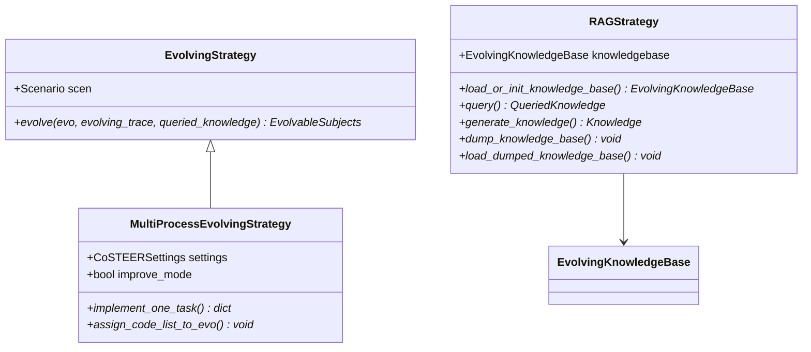
```mermaid
classDiagram
class EvolvingStrategy {
+Scenario scen
+evolve(evo, evolving_trace, queried_knowledge)* EvolvableSubjects
}
class MultiProcessEvolvingStrategy {
+CoSTEERSettings settings
+bool improve_mode
+implement_one_task()* dict
+assign_code_list_to_evo()* void
}
class RAGStrategy {
+EvolvingKnowledgeBase knowledgebase
+load_or_init_knowledge_base()* EvolvingKnowledgeBase
+query()* QueriedKnowledge
+generate_knowledge()* Knowledge
+dump_knowledge_base()* void
+load_dumped_knowledge_base()* void
}
EvolvingStrategy <|-- MultiProcessEvolvingStrategy
RAGStrategy --> EvolvingKnowledgeBase
```

**图表来源**
- [evolving_framework.py](file://rdagent/core/evolving_framework.py#L50-L127)
- [evolving_strategy.py](file://rdagent/components/coder/CoSTEER/evolving_strategy.py#L15-L134)

**章节来源**
- [evolving_framework.py](file://rdagent/core/evolving_framework.py#L50-L127)
- [evolving_strategy.py](file://rdagent/components/coder/CoSTEER/evolving_strategy.py#L15-L134)

## R&D双循环架构

### 架构概览

R&D双循环架构是RD-Agent的核心设计理念，将研发过程分解为两个相互独立又紧密协作的循环：

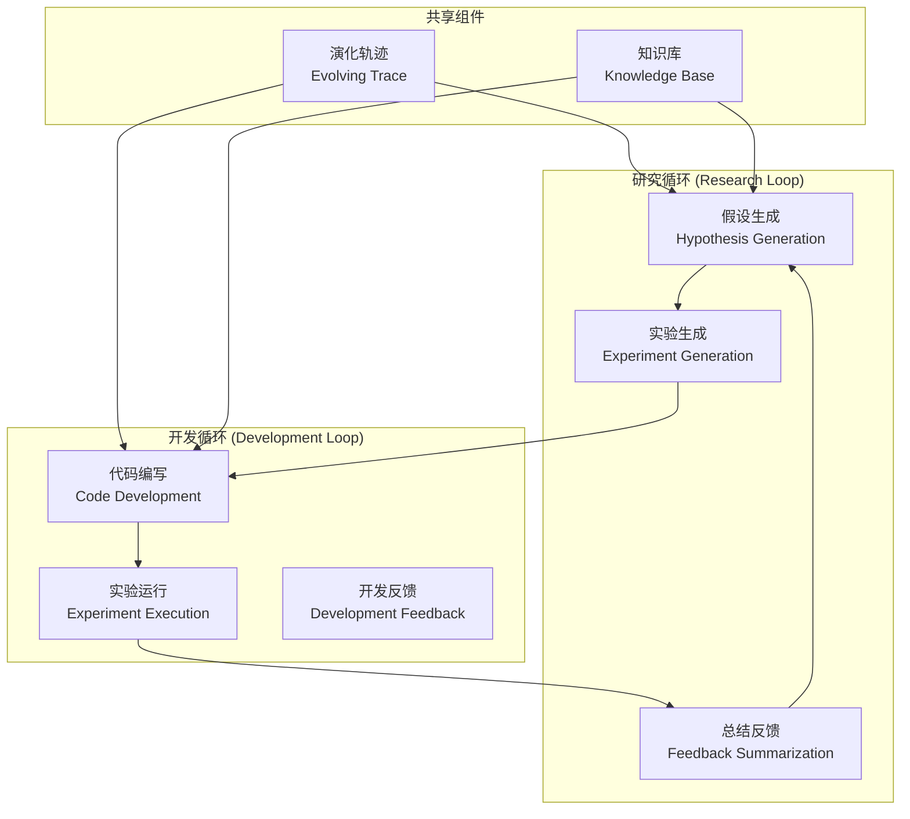
```mermaid
graph TB
subgraph "研究循环 (Research Loop)"
HypoGen["假设生成<br/>Hypothesis Generation"]
ExpGen["实验生成<br/>Experiment Generation"]
Summarize["总结反馈<br/>Feedback Summarization"]
end
subgraph "开发循环 (Development Loop)"
Coder["代码编写<br/>Code Development"]
Runner["实验运行<br/>Experiment Execution"]
DevFeedback["开发反馈<br/>Development Feedback"]
end
subgraph "共享组件"
Trace["演化轨迹<br/>Evolving Trace"]
Knowledge["知识库<br/>Knowledge Base"]
end
HypoGen --> ExpGen
ExpGen --> Coder
Coder --> Runner
Runner --> Summarize
Summarize --> HypoGen
Trace --> HypoGen
Trace --> Coder
Knowledge --> HypoGen
Knowledge --> Coder
```

**图表来源**
- [rd_loop.py](file://rdagent/components/workflow/rd_loop.py#L30-L92)

### 研究循环详解

研究循环专注于创新性思维和假设生成，包含以下核心阶段：

1. **假设生成（Hypothesis Generation）**：基于当前知识和观察生成新的研究假设
2. **实验生成（Experiment Generation）**：将抽象假设转化为具体可执行的实验计划
3. **反馈总结（Feedback Summarization）**：对实验结果进行分析和总结

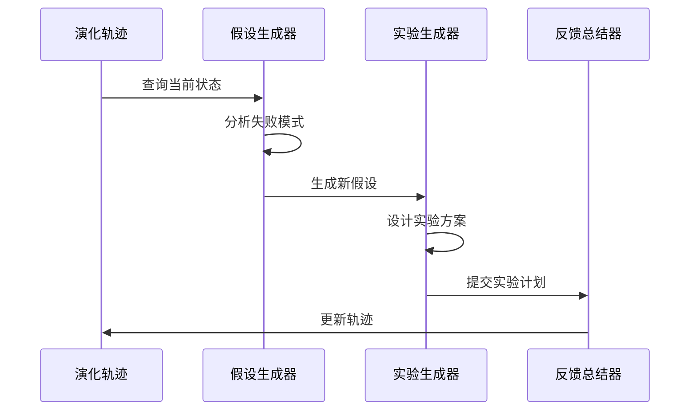
```mermaid
sequenceDiagram
participant Trace as 演化轨迹
participant HG as 假设生成器
participant EG as 实验生成器
participant Sum as 反馈总结器
Trace->>HG : 查询当前状态
HG->>HG : 分析失败模式
HG->>EG : 生成新假设
EG->>EG : 设计实验方案
EG->>Sum : 提交实验计划
Sum->>Trace : 更新轨迹
```

**图表来源**
- [rd_loop.py](file://rdagent/components/workflow/rd_loop.py#L45-L92)

### 开发循环详解

开发循环负责将研究循环产生的假设转化为实际的代码实现和实验执行：

1. **代码开发（Code Development）**：将实验计划转化为可运行的代码
2. **实验执行（Experiment Execution）**：运行生成的代码并收集结果
3. **开发反馈（Development Feedback）**：评估执行结果的质量和效果

**章节来源**
- [rd_loop.py](file://rdagent/components/workflow/rd_loop.py#L30-L92)

## CoSTEER代码生成框架

### 框架概述

CoSTEER（Collaborative Software Testing and Evolutionary Experimentation and Refinement）是RD-Agent的核心代码生成框架，专门设计用于处理复杂的数据科学项目。该框架采用协同演化策略，支持多个子任务的并行开发和知识共享。

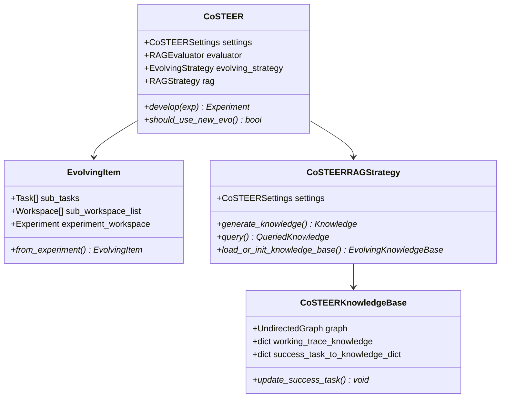
```mermaid
classDiagram
class CoSTEER {
+CoSTEERSettings settings
+RAGEvaluator evaluator
+EvolvingStrategy evolving_strategy
+RAGStrategy rag
+develop(exp)* Experiment
+should_use_new_evo()* bool
}
class EvolvingItem {
+Task[] sub_tasks
+Workspace[] sub_workspace_list
+Experiment experiment_workspace
+from_experiment()* EvolvingItem
}
class CoSTEERRAGStrategy {
+CoSTEERSettings settings
+generate_knowledge()* Knowledge
+query()* QueriedKnowledge
+load_or_init_knowledge_base()* EvolvingKnowledgeBase
}
class CoSTEERKnowledgeBase {
+UndirectedGraph graph
+dict working_trace_knowledge
+dict success_task_to_knowledge_dict
+update_success_task()* void
}
CoSTEER --> EvolvingItem
CoSTEER --> CoSTEERRAGStrategy
CoSTEERRAGStrategy --> CoSTEERKnowledgeBase
```

**图表来源**
- [CoSTEER/__init__.py](file://rdagent/components/coder/CoSTEER/__init__.py#L15-L176)
- [knowledge_management.py](file://rdagent/components/coder/CoSTEER/knowledge_management.py#L15-L964)

### 演化策略与知识管理

CoSTEER框架实现了两种版本的演化策略和知识管理系统：

#### 版本1：基础知识管理
- 基于简单的成功/失败任务集合
- 使用向量嵌入进行相似度搜索
- 支持历史轨迹查询

#### 版本2：增强知识管理
- 引入知识图谱结构
- 支持组件分析和错误节点识别
- 实现更精细的知识聚合策略

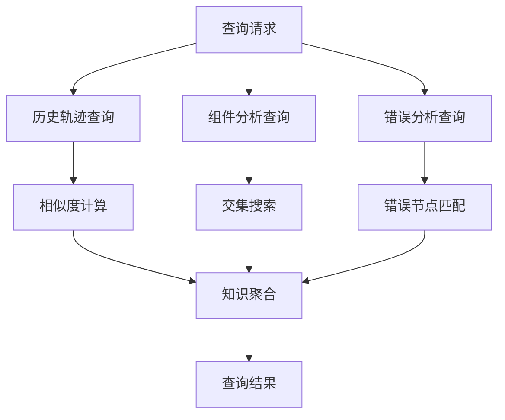
```mermaid
flowchart TD
Query["查询请求"] --> FormerTrace["历史轨迹查询"]
Query --> Component["组件分析查询"]
Query --> Error["错误分析查询"]
FormerTrace --> Similarity["相似度计算"]
Component --> Intersection["交集搜索"]
Error --> ErrorNodes["错误节点匹配"]
Similarity --> Aggregate["知识聚合"]
Intersection --> Aggregate
ErrorNodes --> Aggregate
Aggregate --> Result["查询结果"]
```

**图表来源**
- [knowledge_management.py](file://rdagent/components/coder/CoSTEER/knowledge_management.py#L400-L799)

### 协作演化机制

CoSTEER支持多进程协作演化，能够同时处理多个子任务：

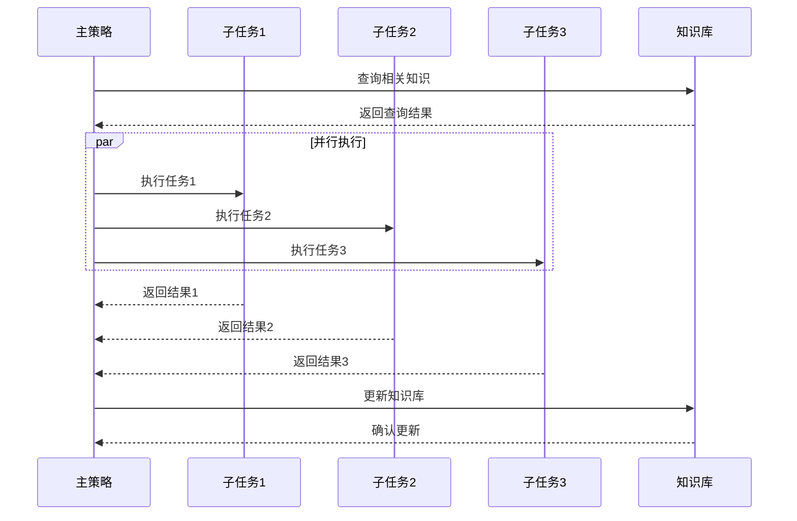
```mermaid
sequenceDiagram
participant MS as 主策略
participant MT1 as 子任务1
participant MT2 as 子任务2
participant MT3 as 子任务3
participant KB as 知识库
MS->>KB : 查询相关知识
KB-->>MS : 返回查询结果
par 并行执行
MS->>MT1 : 执行任务1
MS->>MT2 : 执行任务2
MS->>MT3 : 执行任务3
end
MT1-->>MS : 返回结果1
MT2-->>MS : 返回结果2
MT3-->>MS : 返回结果3
MS->>KB : 更新知识库
KB-->>MS : 确认更新
```

**图表来源**
- [evolving_strategy.py](file://rdagent/components/coder/CoSTEER/evolving_strategy.py#L70-L134)

**章节来源**
- [CoSTEER/__init__.py](file://rdagent/components/coder/CoSTEER/__init__.py#L15-L176)
- [knowledge_management.py](file://rdagent/components/coder/CoSTEER/knowledge_management.py#L15-L964)
- [evolving_strategy.py](file://rdagent/components/coder/CoSTEER/evolving_strategy.py#L15-L134)

## 提案系统

### 假设生成机制

提案系统的核心是假设生成器（HypothesisGen），它负责从当前的研究轨迹中生成新的研究假设。系统采用多层次的假设生成策略：

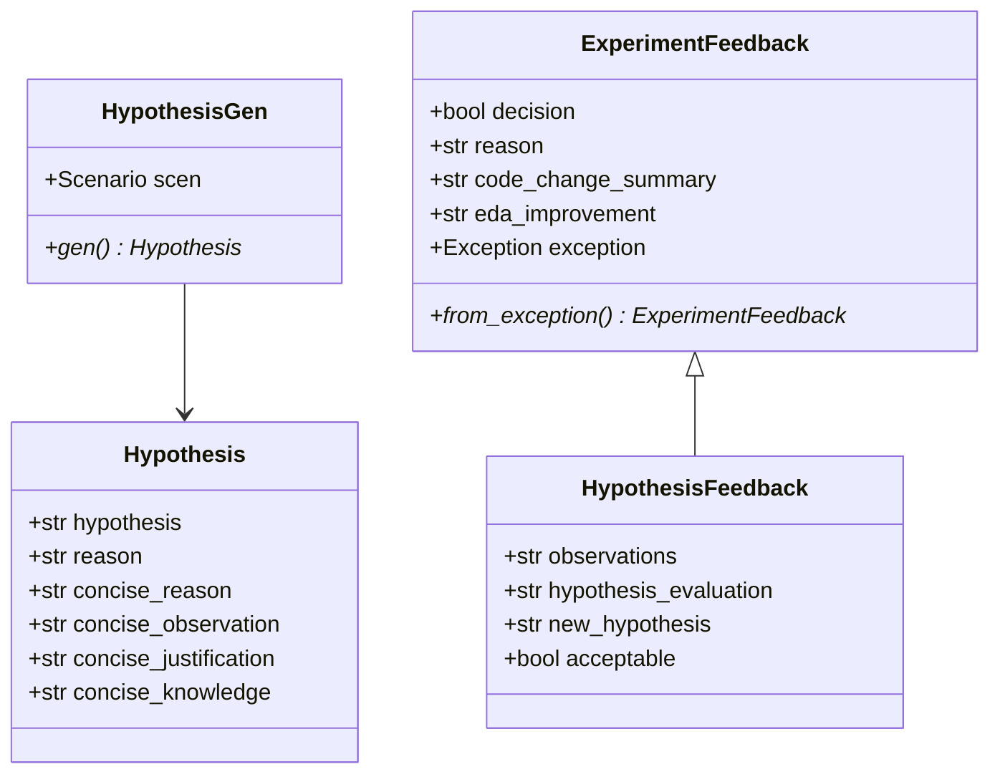
```mermaid
classDiagram
class Hypothesis {
+str hypothesis
+str reason
+str concise_reason
+str concise_observation
+str concise_justification
+str concise_knowledge
}
class HypothesisGen {
+Scenario scen
+gen()* Hypothesis
}
class ExperimentFeedback {
+bool decision
+str reason
+str code_change_summary
+str eda_improvement
+Exception exception
+from_exception()* ExperimentFeedback
}
class HypothesisFeedback {
+str observations
+str hypothesis_evaluation
+str new_hypothesis
+bool acceptable
}
HypothesisGen --> Hypothesis
ExperimentFeedback <|-- HypothesisFeedback
```

**图表来源**
- [proposal.py](file://rdagent/core/proposal.py#L20-L389)

### 多样化假设筛选

提案系统实现了智能的假设筛选机制，确保生成的假设既具有创新性又具备可行性：

1. **观察分析**：基于当前实验结果和失败模式进行深入分析
2. **假设评估**：对候选假设进行质量评估
3. **新假设生成**：根据评估结果生成改进后的假设
4. **接受标准**：设定严格的接受标准确保假设质量

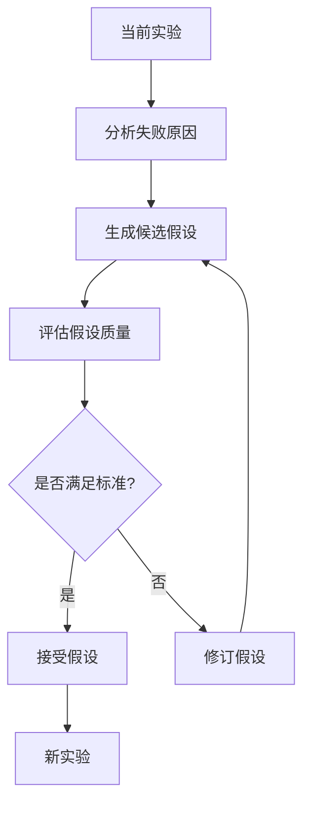
```mermaid
flowchart TD
CurrentExp["当前实验"] --> Analyze["分析失败原因"]
Analyze --> Generate["生成候选假设"]
Generate --> Evaluate["评估假设质量"]
Evaluate --> Filter{"是否满足标准?"}
Filter --> |是| Accept["接受假设"]
Filter --> |否| Revise["修订假设"]
Revise --> Generate
Accept --> NewExp["新实验"]
```

**图表来源**
- [proposal.py](file://rdagent/core/proposal.py#L350-L389)

### 轨迹管理系统

提案系统维护了一个复杂的演化轨迹（Trace）系统，用于跟踪整个研发过程：

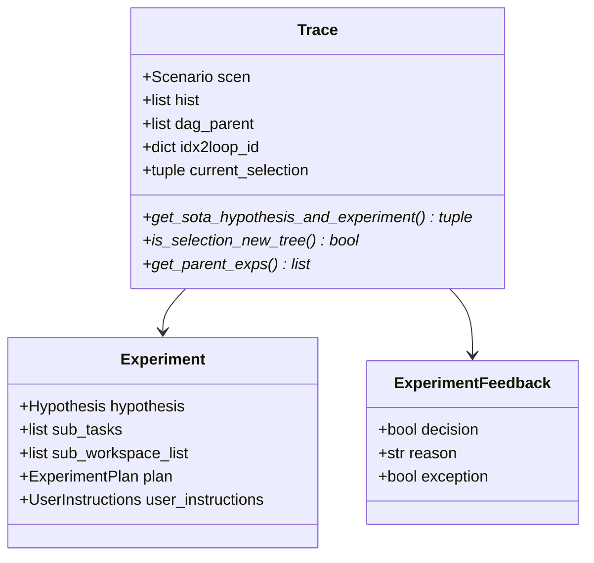
```mermaid
classDiagram
class Trace {
+Scenario scen
+list hist
+list dag_parent
+dict idx2loop_id
+tuple current_selection
+get_sota_hypothesis_and_experiment()* tuple
+is_selection_new_tree()* bool
+get_parent_exps()* list
}
class Experiment {
+Hypothesis hypothesis
+list sub_tasks
+list sub_workspace_list
+ExperimentPlan plan
+UserInstructions user_instructions
}
class ExperimentFeedback {
+bool decision
+str reason
+bool exception
}
Trace --> Experiment
Trace --> ExperimentFeedback
```

**图表来源**
- [proposal.py](file://rdagent/core/proposal.py#L100-L250)

**章节来源**
- [proposal.py](file://rdagent/core/proposal.py#L20-L389)

## 知识库系统

### 知识库架构

知识库系统是RD-Agent的核心基础设施，负责存储和管理所有研发过程中的经验和知识。系统采用分层架构设计：

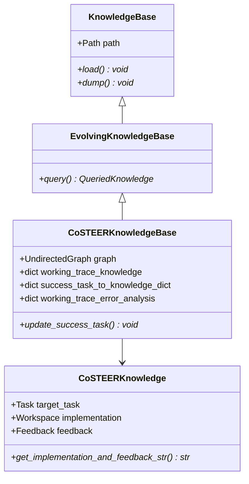
```mermaid
classDiagram
class KnowledgeBase {
+Path path
+load()* void
+dump()* void
}
class EvolvingKnowledgeBase {
+query()* QueriedKnowledge
}
class CoSTEERKnowledgeBase {
+UndirectedGraph graph
+dict working_trace_knowledge
+dict success_task_to_knowledge_dict
+dict working_trace_error_analysis
+update_success_task()* void
}
class CoSTEERKnowledge {
+Task target_task
+Workspace implementation
+Feedback feedback
+get_implementation_and_feedback_str()* str
}
KnowledgeBase <|-- EvolvingKnowledgeBase
EvolvingKnowledgeBase <|-- CoSTEERKnowledgeBase
CoSTEERKnowledgeBase --> CoSTEERKnowledge
```

**图表来源**
- [knowledge_base.py](file://rdagent/core/knowledge_base.py#L7-L27)
- [knowledge_management.py](file://rdagent/components/coder/CoSTEER/knowledge_management.py#L800-L964)

### 跨实验经验积累

知识库系统实现了高效的跨实验经验积累机制：

1. **成功案例存储**：将成功的实验方案和对应的反馈信息存储起来
2. **失败模式分析**：记录失败实验的原因和可能的改进方向
3. **相似性搜索**：基于向量嵌入和图结构进行相似实验的快速查找
4. **知识图谱构建**：建立实验之间的关联关系网络

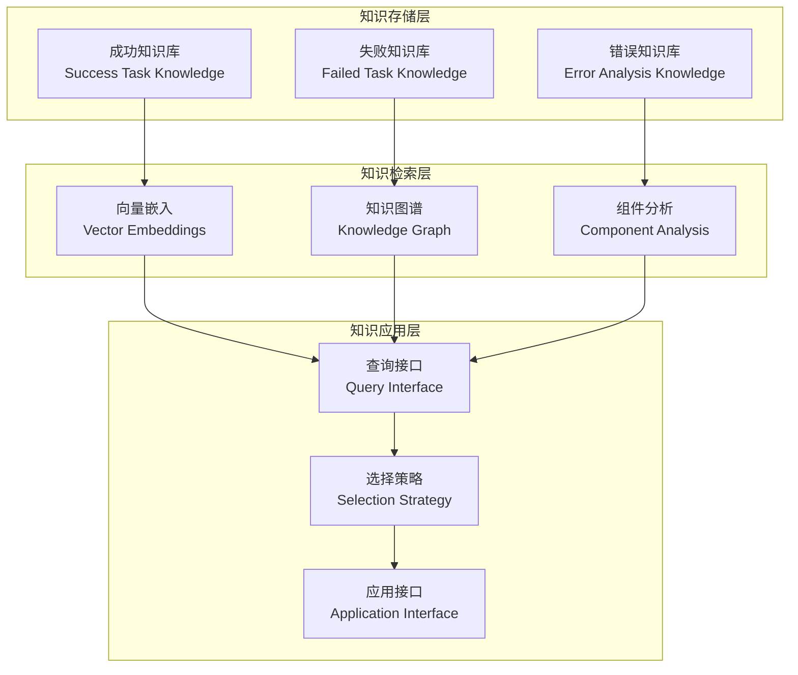
```mermaid
graph TD
subgraph "知识存储层"
SuccessKB["成功知识库<br/>Success Task Knowledge"]
FailKB["失败知识库<br/>Failed Task Knowledge"]
ErrorKB["错误知识库<br/>Error Analysis Knowledge"]
end
subgraph "知识检索层"
Embedding["向量嵌入<br/>Vector Embeddings"]
Graph["知识图谱<br/>Knowledge Graph"]
Component["组件分析<br/>Component Analysis"]
end
subgraph "知识应用层"
Query["查询接口<br/>Query Interface"]
Selection["选择策略<br/>Selection Strategy"]
Application["应用接口<br/>Application Interface"]
end
SuccessKB --> Embedding
FailKB --> Graph
ErrorKB --> Component
Embedding --> Query
Graph --> Query
Component --> Query
Query --> Selection
Selection --> Application
```

**图表来源**
- [knowledge_management.py](file://rdagent/components/coder/CoSTEER/knowledge_management.py#L400-L799)

### 知识演化机制

知识库支持动态的知识演化和更新：

```mermaid
sequenceDiagram
participant Exp as 实验
participant KB as 知识库
participant Graph as 图谱
participant Embed as 嵌入
Exp->>KB : 提交实验结果
KB->>KB : 分析实验反馈
KB->>Graph : 更新知识图谱
KB->>Embed : 计算向量嵌入
Graph->>Graph : 添加新节点
Graph->>Graph : 建立连接关系
Embed->>Embed : 更新向量空间
Embed->>Embed : 重新计算相似度
Note over KB,Embed : 知识库自动演化
```

**图表来源**
- [knowledge_management.py](file://rdagent/components/coder/CoSTEER/knowledge_management.py#L500-L600)

**章节来源**
- [knowledge_base.py](file://rdagent/core/knowledge_base.py#L7-L27)
- [knowledge_management.py](file://rdagent/components/coder/CoSTEER/knowledge_management.py#L800-L964)

## 关键数据模型

### Hypothesis（假设）

假设是提案系统的核心输出，代表了研究者的新颖想法和预测：

| 属性 | 类型 | 描述 | 用途 |
|------|------|------|------|
| hypothesis | str | 假设陈述 | 描述预期的研究发现 |
| reason | str | 推理过程 | 解释为什么提出这个假设 |
| concise_reason | str | 简洁推理 | 高亮关键推理要点 |
| concise_observation | str | 简洁观察 | 总结相关观察结果 |
| concise_justification | str | 简洁论证 | 支持假设的关键理由 |
| concise_knowledge | str | 简洁知识 | 相关背景知识摘要 |

### Experiment（实验）

实验是假设的具体实施方案，包含了完整的实验设计和执行计划：

| 属性 | 类型 | 描述 | 生命周期 |
|------|------|------|----------|
| hypothesis | Hypothesis \| None | 关联的假设 | 创建时设置 |
| sub_tasks | Sequence[Task] | 子任务列表 | 实验设计阶段 |
| sub_workspace_list | list[Workspace \| None] | 子任务工作区 | 实验执行阶段 |
| experiment_workspace | Workspace \| None | 实验主工作区 | 实验执行阶段 |
| prop_dev_feedback | Feedback \| None | 开发者反馈 | 结果评估阶段 |
| running_info | RunningInfo | 运行信息 | 整个生命周期 |
| sub_results | dict[str, float] | 子结果 | 实验完成后填充 |
| plan | ExperimentPlan \| None | 实验计划 | 实验设计阶段 |
| user_instructions | UserInstructions \| None | 用户指令 | 实验配置阶段 |

### Feedback（反馈）

反馈系统提供了标准化的评估机制，支持多种类型的反馈：

```mermaid
classDiagram
>>>>>>> 553228cf4b951bda668568f1ff4a2970581ffb9f
class Feedback {
+is_acceptable()* bool
+finished()* bool
+__bool__()* bool
}
<<<<<<< HEAD
class CoSTEERSingleFeedback {
+str execution
+str return_checking
+str code
+bool final_decision
+merge(feedback_li)* CoSTEERSingleFeedback
+__str__() str
+__bool__()* bool
}
class CoSTEERMultiFeedback {
+CoSTEERSingleFeedback[] feedback_list
+__getitem__(index)* CoSTEERSingleFeedback
+__len__()* int
+append(feedback)* void
+is_acceptable()* bool
+finished()* bool
+__bool__()* bool
}
Evaluator <|-- CoSTEEREvaluator
CoSTEEREvaluator <|-- CoSTEERMultiEvaluator
Feedback <|-- CoSTEERSingleFeedback
Feedback <|-- CoSTEERMultiFeedback
CoSTEERMultiFeedback --> CoSTEERSingleFeedback : contains
```

**图表来源**
- [evaluation.py](file://rdagent/core/evaluation.py#L1-L58)
- [evaluators.py](file://rdagent/components/coder/CoSTEER/evaluators.py#L1-L312)

### 多维度反馈机制

CoSTEERSingleFeedback提供了细粒度的反馈信息：

1. **执行反馈**：代码执行过程中的输出和错误
2. **返回值检查**：验证函数返回值的正确性
3. **代码质量**：代码风格和规范性评估
4. **最终决策**：综合判断是否成功

```mermaid
flowchart TD
Execute["代码执行"] --> ExecFeedback["执行反馈<br/>捕获stdout/stderr"]
ExecFeedback --> ReturnCheck["返回值检查<br/>验证输出格式"]
ReturnCheck --> CodeReview["代码审查<br/>检查代码质量"]
CodeReview --> FinalDecision{"最终决策<br/>成功/失败?"}
FinalDecision --> |成功| Success["标记成功<br/>final_decision=true"]
FinalDecision --> |失败| Failure["标记失败<br/>final_decision=false"]
Success --> LogFeedback["记录反馈<br/>存储到知识库"]
Failure --> LogFeedback
LogFeedback --> UpdateKnowledge["更新知识库<br/>添加到失败案例"]
```

**图表来源**
- [evaluators.py](file://rdagent/components/coder/CoSTEER/evaluators.py#L25-L100)

**章节来源**
- [evaluation.py](file://rdagent/core/evaluation.py#L1-L58)
- [evaluators.py](file://rdagent/components/coder/CoSTEER/evaluators.py#L1-L312)

## 闭环优化流程

### 整体演化循环

RD-Agent通过完整的闭环系统实现持续优化：

```mermaid
sequenceDiagram
participant User as 用户
participant Agent as RAGEvoAgent
participant RAG as RAGStrategy
participant Eval as Evaluator
participant KB as KnowledgeBase
participant WS as Workspace
User->>Agent : 启动演化(max_loop)
loop 每个演化循环
Agent->>RAG : query(evo, evolving_trace)
RAG->>KB : 检索相关知识
KB-->>RAG : 返回查询结果
RAG-->>Agent : 返回QueriedKnowledge
Agent->>Agent : evolve(evo, queried_knowledge)
Agent->>WS : 执行代码生成
WS-->>Agent : 返回新版本
Agent->>Eval : evaluate(new_evo)
Eval->>WS : 执行测试和评估
WS-->>Eval : 返回评估结果
Eval-->>Agent : 返回Feedback
Agent->>Agent : 更新evolving_trace
Agent->>RAG : generate_knowledge(evolving_trace)
RAG->>KB : 存储新知识
Agent-->>User : yield 新版本(evo)
alt 所有任务完成
Agent-->>User : 结束演化
end
end
```

**图表来源**
- [evolving_agent.py](file://rdagent/core/evolving_agent.py#L75-L114)

### 知识积累与传承

框架通过知识库实现经验的积累和传承：

1. **成功案例存储**：记录成功的解决方案
2. **失败模式分析**：识别和避免常见错误
3. **组件知识图谱**：构建领域知识网络
4. **错误修复模式**：学习错误修复策略

```mermaid
graph LR
subgraph "知识积累"
Success["成功案例"] --> KB["知识库"]
Failure["失败案例"] --> KB
Error["错误模式"] --> KB
Component["组件知识"] --> KB
end
subgraph "知识利用"
KB --> Query["查询请求"]
Query --> Similar["相似案例"]
Query --> ErrorPattern["错误模式"]
Query --> ComponentMatch["组件匹配"]
end
subgraph "决策支持"
Similar --> Guidance["生成指导"]
ErrorPattern --> Avoidance["避免错误"]
ComponentMatch --> Optimization["优化建议"]
end
```

**章节来源**
- [evolving_agent.py](file://rdagent/core/evolving_agent.py#L75-L114)
- [knowledge_management.py](file://rdagent/components/coder/CoSTEER/knowledge_management.py#L300-L400)

## 架构总结

RD-Agent框架通过以下核心设计原则实现智能化的研发自动化：

### 设计原则

1. **模块化架构**：清晰的层次划分和职责分离
2. **可扩展性**：支持不同领域的定制化实现
3. **知识驱动**：基于历史经验的智能决策
4. **闭环优化**：完整的评估-反馈-改进循环
5. **并发处理**：支持多任务并行演化

### 技术特色

- **多模态知识管理**：结合向量检索和图谱推理
- **智能演化策略**：基于组件分析和错误模式的学习
- **分布式知识共享**：支持多个代理间的知识同步
- **实时监控反馈**：提供详细的演化过程跟踪

### 应用价值

RD-Agent框架为AI驱动的研发提供了完整的基础设施，能够：
- 自动化复杂系统的开发流程
- 提高代码质量和开发效率
- 减少重复性工作和错误率
- 支持跨领域的知识迁移

通过深入理解这些核心概念，开发者可以更好地掌握RD-Agent的工作原理，并根据具体需求进行定制化扩展。
=======
class ExperimentFeedback {
+bool decision
+str reason
+str code_change_summary
+str eda_improvement
+Exception exception
+from_exception()* ExperimentFeedback
}
class HypothesisFeedback {
+str observations
+str hypothesis_evaluation
+str new_hypothesis
+bool acceptable
}
Feedback <|-- ExperimentFeedback
ExperimentFeedback <|-- HypothesisFeedback
```

**图表来源**
- [proposal.py](file://rdagent/core/proposal.py#L50-L100)
- [evaluation.py](file://rdagent/core/evaluation.py#L8-L57)

### RunningInfo（运行信息）

运行信息记录了实验的执行状态和性能指标：

| 字段 | 类型 | 描述 | 更新时机 |
|------|------|------|----------|
| result | object | 实验结果 | 实验完成后 |
| running_time | float \| None | 运行时间 | 执行过程中 |

**章节来源**
- [proposal.py](file://rdagent/core/proposal.py#L20-L389)
- [experiment.py](file://rdagent/core/experiment.py#L50-L482)
- [evaluation.py](file://rdagent/core/evaluation.py#L8-L57)

## 架构可视化

### 系统整体架构

```mermaid
graph TB
subgraph "用户界面层"
CLI["命令行接口"]
WebUI["Web用户界面"]
Monitor["监控系统"]
end
subgraph "业务逻辑层"
RDLoop["R&D循环控制器"]
ProposalSys["提案系统"]
CoSTEER["CoSTEER框架"]
Scenario["场景管理"]
end
subgraph "核心引擎层"
EvolvingAgent["进化代理"]
KnowledgeBase["知识库"]
Evaluator["评估器"]
Workspace["工作区管理"]
end
subgraph "基础设施层"
VectorDB["向量数据库"]
GraphDB["图数据库"]
FileSystem["文件系统"]
Config["配置管理"]
end
CLI --> RDLoop
WebUI --> RDLoop
Monitor --> RDLoop
RDLoop --> ProposalSys
RDLoop --> CoSTEER
RDLoop --> Scenario
ProposalSys --> EvolvingAgent
CoSTEER --> EvolvingAgent
CoSTEER --> KnowledgeBase
Scenario --> Evaluator
EvolvingAgent --> Workspace
KnowledgeBase --> VectorDB
KnowledgeBase --> GraphDB
Workspace --> FileSystem
RDLoop --> Config
```

**图表来源**
- [rd_loop.py](file://rdagent/components/workflow/rd_loop.py#L30-L92)
- [CoSTEER/__init__.py](file://rdagent/components/coder/CoSTEER/__init__.py#L15-L176)

### 数据流架构

```mermaid
flowchart LR
subgraph "输入层"
Data["原始数据"]
Prompt["提示模板"]
Config["配置参数"]
end
subgraph "处理层"
HypoGen["假设生成"]
ExpGen["实验生成"]
CodeDev["代码开发"]
Exec["实验执行"]
end
subgraph "存储层"
KB["知识库"]
Trace["演化轨迹"]
Results["实验结果"]
end
subgraph "输出层"
Report["报告生成"]
Metrics["指标统计"]
Insights["洞察提取"]
end
Data --> HypoGen
Prompt --> ExpGen
Config --> CodeDev
HypoGen --> ExpGen
ExpGen --> CodeDev
CodeDev --> Exec
Exec --> KB
Exec --> Trace
Exec --> Results
KB --> Report
Trace --> Metrics
Results --> Insights
```

**图表来源**
- [loop.py](file://rdagent/app/data_science/loop.py#L20-L80)

## 现实应用场景

### 自动量化工厂

在金融量化领域，RD-Agent可以自动构建因子模型和交易策略：

**类比**：就像一个专业的量化分析师，能够自动阅读市场研究报告，提取关键因子，构建模型并进行回测验证。

**应用场景**：
- 因子挖掘：自动从财务报表中提取有价值的因子
- 模型构建：基于历史数据训练预测模型
- 策略优化：不断迭代优化交易策略

### 数据挖掘代理

在数据科学领域，RD-Agent能够自动进行数据分析和模型构建：

**类比**：如同一位经验丰富的数据科学家，能够自动探索数据集，发现隐藏模式，构建预测模型。

**应用场景**：
- 特征工程：自动识别和创建有意义的特征
- 模型选择：自动比较不同算法的性能
- 超参数调优：自动寻找最优模型参数

### 研究助手

在学术研究领域，RD-Agent可以帮助研究人员快速阅读和理解大量文献：

**类比**：就像一位博学的研究助理，能够快速浏览大量论文，提取关键信息并生成摘要。

**应用场景**：
- 文献综述：自动整理和分析相关研究
- 方法提取：从论文中提取实验方法
- 结果验证：自动复现和验证实验结果

### Kaggle竞赛代理

在机器学习竞赛中，RD-Agent能够自动进行模型调参和特征工程：

**类比**：如同一位经验丰富的竞赛选手，能够快速尝试各种方法，找到最佳解决方案。

**应用场景**：
- 特征工程：自动创建和选择特征
- 模型集成：自动组合多个模型
- 超参数优化：自动搜索最优参数

## 总结

RD-Agent的核心概念体系体现了现代人工智能在研发自动化领域的创新突破。通过进化式开发框架、R&D双循环架构、CoSTEER代码生成框架、提案系统和知识库系统的有机结合，该系统实现了：

1. **智能化的假设生成**：基于深度学习的假设生成器能够从复杂数据中提炼出有价值的研究方向
2. **自动化的代码生成**：CoSTEER框架支持复杂的多任务并行开发，显著提升开发效率
3. **知识驱动的迭代优化**：完善的知识库系统确保每次迭代都能建立在前次经验的基础之上
4. **灵活的场景适配**：模块化的设计使得系统能够适应不同的研发场景和需求

这种设计不仅大幅提升了研发效率，更重要的是建立了可复制、可扩展的研发自动化范式，为工业界的数据驱动研发提供了强有力的技术支撑。随着技术的不断发展，RD-Agent有望在更多领域发挥重要作用，推动整个行业的研发模式变革。
>>>>>>> 553228cf4b951bda668568f1ff4a2970581ffb9f
