# 核心概念

<cite>
**本文档引用的文件**
- [evolving_agent.py](file://rdagent/core/evolving_agent.py)
- [evolving_framework.py](file://rdagent/core/evolving_framework.py)
- [knowledge_base.py](file://rdagent/core/knowledge_base.py)
- [proposal.py](file://rdagent/core/proposal.py)
- [experiment.py](file://rdagent/core/experiment.py)
- [scenario.py](file://rdagent/core/scenario.py)
- [evaluation.py](file://rdagent/core/evaluation.py)
- [CoSTEER/__init__.py](file://rdagent/components/coder/CoSTEER/__init__.py)
- [evolving_strategy.py](file://rdagent/components/coder/CoSTEER/evolving_strategy.py)
- [knowledge_management.py](file://rdagent/components/coder/CoSTEER/knowledge_management.py)
- [rd_loop.py](file://rdagent/components/workflow/rd_loop.py)
- [loop.py](file://rdagent/app/data_science/loop.py)
</cite>

## 目录
1. [引言](#引言)
2. [进化式开发框架](#进化式开发框架)
3. [R&D双循环架构](#rd双循环架构)
4. [CoSTEER代码生成框架](#costeer代码生成框架)
5. [提案系统](#提案系统)
6. [知识库系统](#知识库系统)
7. [关键数据模型](#关键数据模型)
8. [架构可视化](#架构可视化)
9. [现实应用场景](#现实应用场景)
10. [总结](#总结)

## 引言

RD-Agent是一个革命性的自动化研发平台，旨在通过人工智能技术实现工业级数据驱动研发过程的自动化。该系统的核心理念是将传统的研发流程分解为两个相互协作的循环：研究循环（Research Loop）负责提出新想法和假设，开发循环（Development Loop）负责实现这些想法并验证其有效性。

系统采用"读取-实现-创新"的方法论，通过三个主要组件：
- **读取（Read）**：从真实世界材料中提取关键公式、特征和模型
- **实现（Implement）**：将提取的内容转化为可运行的代码
- **创新（Innovate）**：基于当前知识和观察提出新的想法

这种设计使得RD-Agent能够自动演进研发解决方案，产生具有重要工业价值的结果。

## 进化式开发框架

### EvolvingAgent核心机制

Evolutionary Agent（进化代理）是RD-Agent的核心驱动力，负责驱动实验的迭代和优化。它采用多步骤演化策略，通过知识查询、演化操作、评估反馈和知识自我生成等环节形成完整的闭环。

**图表来源**
- [evolving_agent.py](file://rdagent/core/evolving_agent.py#L75-L115)

### 多步演化过程

RAGEvoAgent实现了复杂的多步演化过程，每个循环包含以下关键步骤：

1. **RAG知识查询**：从知识库中检索相关信息
2. **演化操作**：基于查询到的知识改进可演化对象
3. **反馈评估**：对演化结果进行评估
4. **轨迹更新**：记录演化历史
5. **知识自生**：根据演化经验生成新知识

**章节来源**
- [evolving_agent.py](file://rdagent/core/evolving_agent.py#L75-L115)

### 演化策略接口

系统定义了灵活的演化策略接口，支持不同的演化方法：

**图表来源**
- [evolving_framework.py](file://rdagent/core/evolving_framework.py#L50-L127)
- [evolving_strategy.py](file://rdagent/components/coder/CoSTEER/evolving_strategy.py#L15-L134)

**章节来源**
- [evolving_framework.py](file://rdagent/core/evolving_framework.py#L50-L127)
- [evolving_strategy.py](file://rdagent/components/coder/CoSTEER/evolving_strategy.py#L15-L134)

## R&D双循环架构

### 架构概览

R&D双循环架构是RD-Agent的核心设计理念，将研发过程分解为两个相互独立又紧密协作的循环：

**图表来源**
- [rd_loop.py](file://rdagent/components/workflow/rd_loop.py#L30-L92)

### 研究循环详解

研究循环专注于创新性思维和假设生成，包含以下核心阶段：

1. **假设生成（Hypothesis Generation）**：基于当前知识和观察生成新的研究假设
2. **实验生成（Experiment Generation）**：将抽象假设转化为具体可执行的实验计划
3. **反馈总结（Feedback Summarization）**：对实验结果进行分析和总结

**图表来源**
- [rd_loop.py](file://rdagent/components/workflow/rd_loop.py#L45-L92)

### 开发循环详解

开发循环负责将研究循环产生的假设转化为实际的代码实现和实验执行：

1. **代码开发（Code Development）**：将实验计划转化为可运行的代码
2. **实验执行（Experiment Execution）**：运行生成的代码并收集结果
3. **开发反馈（Development Feedback）**：评估执行结果的质量和效果

**章节来源**
- [rd_loop.py](file://rdagent/components/workflow/rd_loop.py#L30-L92)

## CoSTEER代码生成框架

### 框架概述

CoSTEER（Collaborative Software Testing and Evolutionary Experimentation and Refinement）是RD-Agent的核心代码生成框架，专门设计用于处理复杂的数据科学项目。该框架采用协同演化策略，支持多个子任务的并行开发和知识共享。

**图表来源**
- [CoSTEER/__init__.py](file://rdagent/components/coder/CoSTEER/__init__.py#L15-L176)
- [knowledge_management.py](file://rdagent/components/coder/CoSTEER/knowledge_management.py#L15-L964)

### 演化策略与知识管理

CoSTEER框架实现了两种版本的演化策略和知识管理系统：

#### 版本1：基础知识管理
- 基于简单的成功/失败任务集合
- 使用向量嵌入进行相似度搜索
- 支持历史轨迹查询

#### 版本2：增强知识管理
- 引入知识图谱结构
- 支持组件分析和错误节点识别
- 实现更精细的知识聚合策略

**图表来源**
- [knowledge_management.py](file://rdagent/components/coder/CoSTEER/knowledge_management.py#L400-L799)

### 协作演化机制

CoSTEER支持多进程协作演化，能够同时处理多个子任务：

**图表来源**
- [evolving_strategy.py](file://rdagent/components/coder/CoSTEER/evolving_strategy.py#L70-L134)

**章节来源**
- [CoSTEER/__init__.py](file://rdagent/components/coder/CoSTEER/__init__.py#L15-L176)
- [knowledge_management.py](file://rdagent/components/coder/CoSTEER/knowledge_management.py#L15-L964)
- [evolving_strategy.py](file://rdagent/components/coder/CoSTEER/evolving_strategy.py#L15-L134)

## 提案系统

### 假设生成机制

提案系统的核心是假设生成器（HypothesisGen），它负责从当前的研究轨迹中生成新的研究假设。系统采用多层次的假设生成策略：

**图表来源**
- [proposal.py](file://rdagent/core/proposal.py#L20-L389)

### 多样化假设筛选

提案系统实现了智能的假设筛选机制，确保生成的假设既具有创新性又具备可行性：

1. **观察分析**：基于当前实验结果和失败模式进行深入分析
2. **假设评估**：对候选假设进行质量评估
3. **新假设生成**：根据评估结果生成改进后的假设
4. **接受标准**：设定严格的接受标准确保假设质量

**图表来源**
- [proposal.py](file://rdagent/core/proposal.py#L350-L389)

### 轨迹管理系统

提案系统维护了一个复杂的演化轨迹（Trace）系统，用于跟踪整个研发过程：

**图表来源**
- [proposal.py](file://rdagent/core/proposal.py#L100-L250)

**章节来源**
- [proposal.py](file://rdagent/core/proposal.py#L20-L389)

## 知识库系统

### 知识库架构

知识库系统是RD-Agent的核心基础设施，负责存储和管理所有研发过程中的经验和知识。系统采用分层架构设计：

**图表来源**
- [knowledge_base.py](file://rdagent/core/knowledge_base.py#L7-L27)
- [knowledge_management.py](file://rdagent/components/coder/CoSTEER/knowledge_management.py#L800-L964)

### 跨实验经验积累

知识库系统实现了高效的跨实验经验积累机制：

1. **成功案例存储**：将成功的实验方案和对应的反馈信息存储起来
2. **失败模式分析**：记录失败实验的原因和可能的改进方向
3. **相似性搜索**：基于向量嵌入和图结构进行相似实验的快速查找
4. **知识图谱构建**：建立实验之间的关联关系网络

```mermaid
graph TD
subgraph "知识存储层"
SuccessKB["成功知识库<br/>Success Task Knowledge"]
FailKB["失败知识库<br/>Failed Task Knowledge"]
ErrorKB["错误知识库<br/>Error Analysis Knowledge"]
end
subgraph "知识检索层"
Embedding["向量嵌入<br/>Vector Embeddings"]
Graph["知识图谱<br/>Knowledge Graph"]
Component["组件分析<br/>Component Analysis"]
end
subgraph "知识应用层"
Query["查询接口<br/>Query Interface"]
Selection["选择策略<br/>Selection Strategy"]
Application["应用接口<br/>Application Interface"]
end
SuccessKB --> Embedding
FailKB --> Graph
ErrorKB --> Component
Embedding --> Query
Graph --> Query
Component --> Query
Query --> Selection
Selection --> Application
```

**图表来源**
- [knowledge_management.py](file://rdagent/components/coder/CoSTEER/knowledge_management.py#L400-L799)

### 知识演化机制

知识库支持动态的知识演化和更新：

**图表来源**
- [knowledge_management.py](file://rdagent/components/coder/CoSTEER/knowledge_management.py#L500-L600)

**章节来源**
- [knowledge_base.py](file://rdagent/core/knowledge_base.py#L7-L27)
- [knowledge_management.py](file://rdagent/components/coder/CoSTEER/knowledge_management.py#L800-L964)

## 关键数据模型

### Hypothesis（假设）

假设是提案系统的核心输出，代表了研究者的新颖想法和预测：

| 属性 | 类型 | 描述 | 用途 |
|------|------|------|------|
| hypothesis | str | 假设陈述 | 描述预期的研究发现 |
| reason | str | 推理过程 | 解释为什么提出这个假设 |
| concise_reason | str | 简洁推理 | 高亮关键推理要点 |
| concise_observation | str | 简洁观察 | 总结相关观察结果 |
| concise_justification | str | 简洁论证 | 支持假设的关键理由 |
| concise_knowledge | str | 简洁知识 | 相关背景知识摘要 |

### Experiment（实验）

实验是假设的具体实施方案，包含了完整的实验设计和执行计划：

| 属性 | 类型 | 描述 | 生命周期 |
|------|------|------|----------|
| hypothesis | Hypothesis \| None | 关联的假设 | 创建时设置 |
| sub_tasks | Sequence[Task] | 子任务列表 | 实验设计阶段 |
| sub_workspace_list | list[Workspace \| None] | 子任务工作区 | 实验执行阶段 |
| experiment_workspace | Workspace \| None | 实验主工作区 | 实验执行阶段 |
| prop_dev_feedback | Feedback \| None | 开发者反馈 | 结果评估阶段 |
| running_info | RunningInfo | 运行信息 | 整个生命周期 |
| sub_results | dict[str, float] | 子结果 | 实验完成后填充 |
| plan | ExperimentPlan \| None | 实验计划 | 实验设计阶段 |
| user_instructions | UserInstructions \| None | 用户指令 | 实验配置阶段 |

### Feedback（反馈）

反馈系统提供了标准化的评估机制，支持多种类型的反馈：

**图表来源**
- [proposal.py](file://rdagent/core/proposal.py#L50-L100)
- [evaluation.py](file://rdagent/core/evaluation.py#L8-L57)

### RunningInfo（运行信息）

运行信息记录了实验的执行状态和性能指标：

| 字段 | 类型 | 描述 | 更新时机 |
|------|------|------|----------|
| result | object | 实验结果 | 实验完成后 |
| running_time | float \| None | 运行时间 | 执行过程中 |

**章节来源**
- [proposal.py](file://rdagent/core/proposal.py#L20-L389)
- [experiment.py](file://rdagent/core/experiment.py#L50-L482)
- [evaluation.py](file://rdagent/core/evaluation.py#L8-L57)

## 架构可视化

### 系统整体架构

**图表来源**
- [rd_loop.py](file://rdagent/components/workflow/rd_loop.py#L30-L92)
- [CoSTEER/__init__.py](file://rdagent/components/coder/CoSTEER/__init__.py#L15-L176)

### 数据流架构

**图表来源**
- [loop.py](file://rdagent/app/data_science/loop.py#L20-L80)

## 现实应用场景

### 自动量化工厂

在金融量化领域，RD-Agent可以自动构建因子模型和交易策略：

**类比**：就像一个专业的量化分析师，能够自动阅读市场研究报告，提取关键因子，构建模型并进行回测验证。

**应用场景**：
- 因子挖掘：自动从财务报表中提取有价值的因子
- 模型构建：基于历史数据训练预测模型
- 策略优化：不断迭代优化交易策略

### 数据挖掘代理

在数据科学领域，RD-Agent能够自动进行数据分析和模型构建：

**类比**：如同一位经验丰富的数据科学家，能够自动探索数据集，发现隐藏模式，构建预测模型。

**应用场景**：
- 特征工程：自动识别和创建有意义的特征
- 模型选择：自动比较不同算法的性能
- 超参数调优：自动寻找最优模型参数

### 研究助手

在学术研究领域，RD-Agent可以帮助研究人员快速阅读和理解大量文献：

**类比**：就像一位博学的研究助理，能够快速浏览大量论文，提取关键信息并生成摘要。

**应用场景**：
- 文献综述：自动整理和分析相关研究
- 方法提取：从论文中提取实验方法
- 结果验证：自动复现和验证实验结果

### Kaggle竞赛代理

在机器学习竞赛中，RD-Agent能够自动进行模型调参和特征工程：

**类比**：如同一位经验丰富的竞赛选手，能够快速尝试各种方法，找到最佳解决方案。

**应用场景**：
- 特征工程：自动创建和选择特征
- 模型集成：自动组合多个模型
- 超参数优化：自动搜索最优参数

## 总结

RD-Agent的核心概念体系体现了现代人工智能在研发自动化领域的创新突破。通过进化式开发框架、R&D双循环架构、CoSTEER代码生成框架、提案系统和知识库系统的有机结合，该系统实现了：

1. **智能化的假设生成**：基于深度学习的假设生成器能够从复杂数据中提炼出有价值的研究方向
2. **自动化的代码生成**：CoSTEER框架支持复杂的多任务并行开发，显著提升开发效率
3. **知识驱动的迭代优化**：完善的知识库系统确保每次迭代都能建立在前次经验的基础之上
4. **灵活的场景适配**：模块化的设计使得系统能够适应不同的研发场景和需求

这种设计不仅大幅提升了研发效率，更重要的是建立了可复制、可扩展的研发自动化范式，为工业界的数据驱动研发提供了强有力的技术支撑。随着技术的不断发展，RD-Agent有望在更多领域发挥重要作用，推动整个行业的研发模式变革。