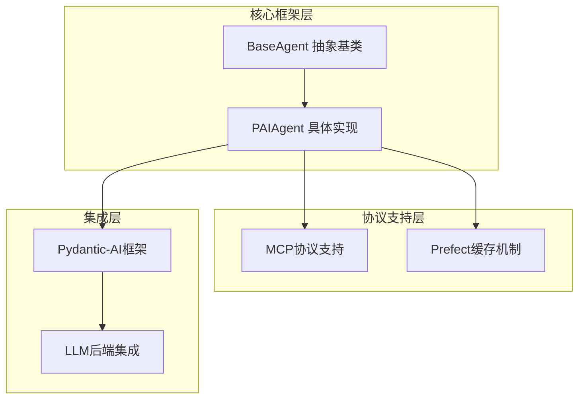
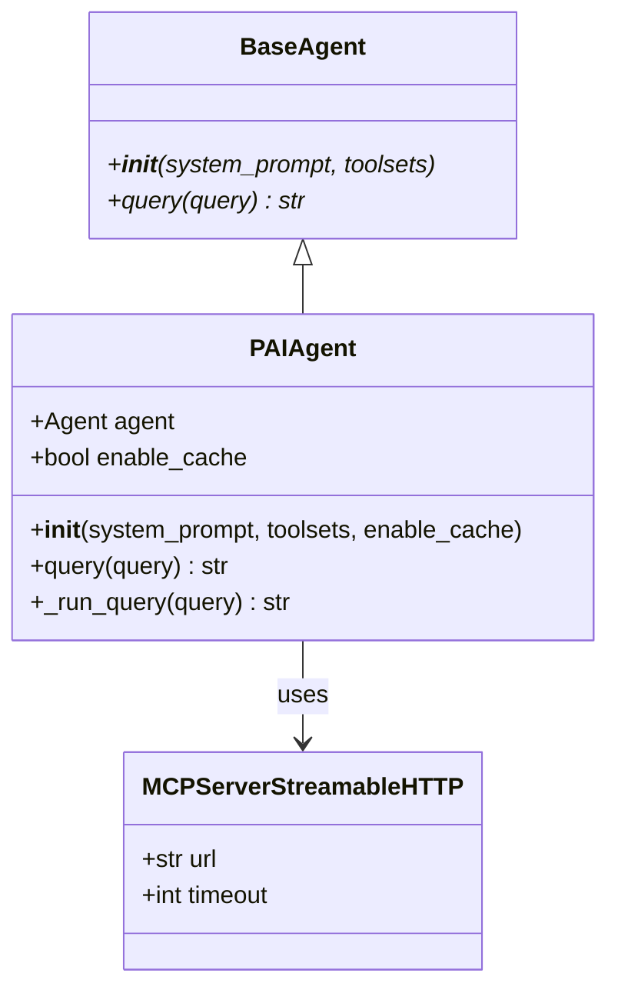
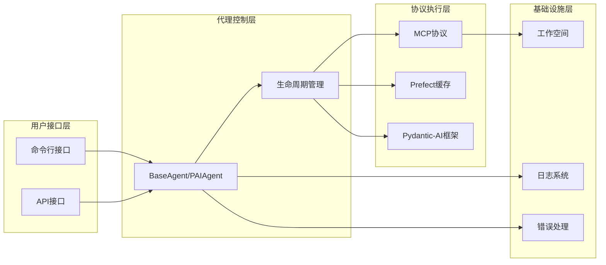
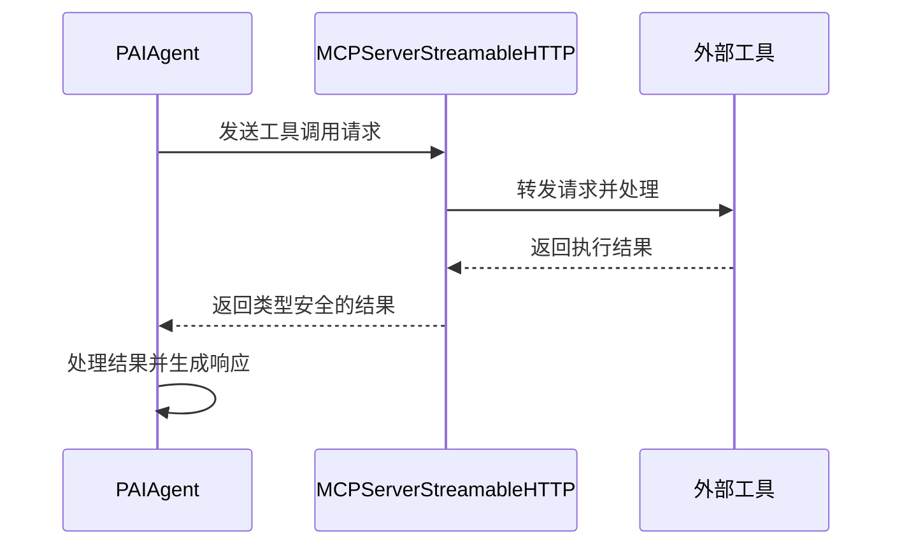
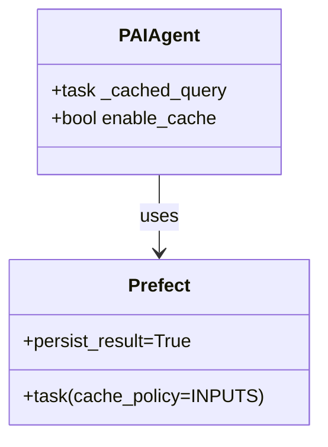
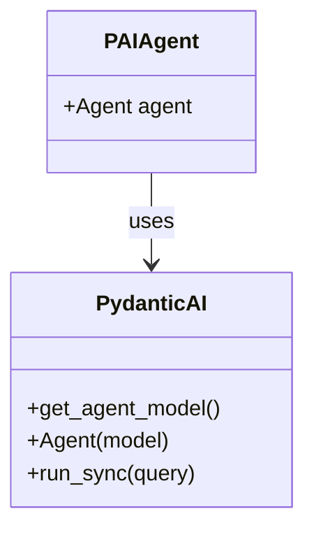
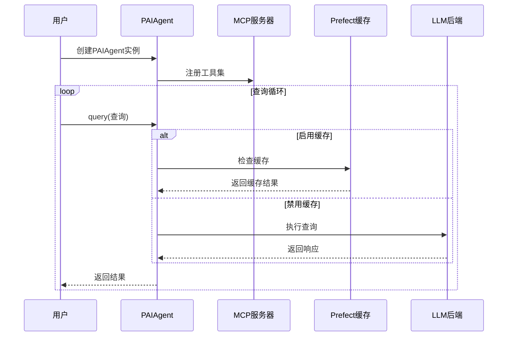
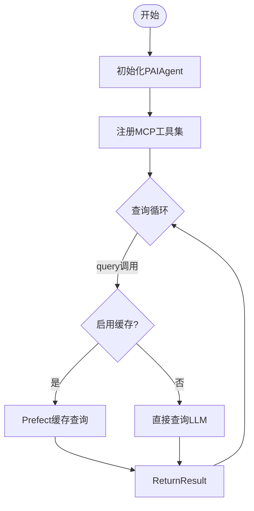
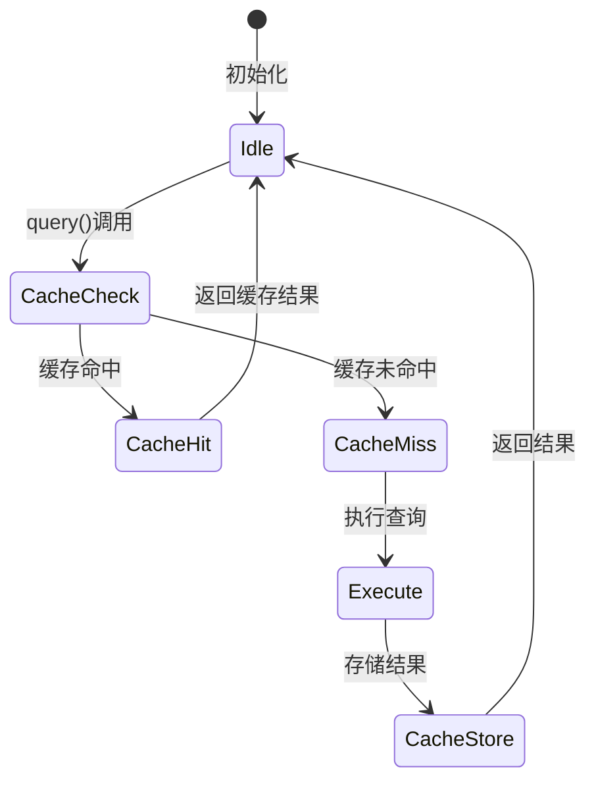
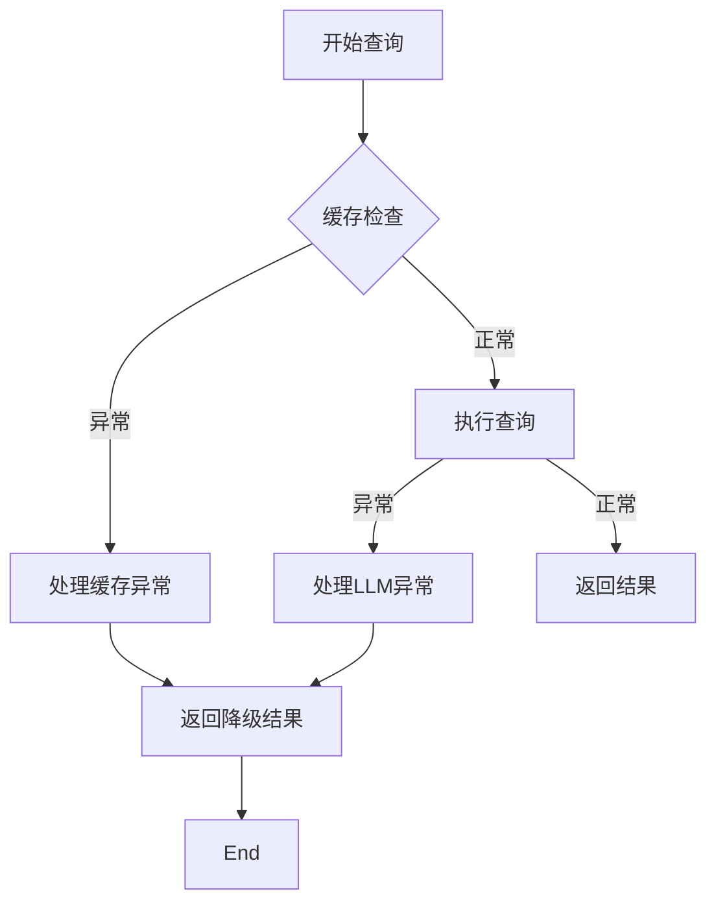

# 代理架构

<cite>
**本文档中引用的文件**
- [base.py](file://rdagent/components/agent/base.py) - *新增PAIAgent类，支持Pydantic-AI框架和MCP协议*
- [pydantic_ai.py](file://rdagent/oai/backend/pydantic_ai.py) - *Pydantic-AI框架适配器实现*
- [context7/__init__.py](file://rdagent/components/agent/context7/__init__.py) - *基于PAIAgent的具体实现*
- [rag/__init__.py](file://rdagent/components/agent/rag/__init__.py) - *RAG场景下的PAIAgent实现*
- [test_prefect_cache.py](file://test/oai/test_prefect_cache.py) - *Prefect缓存机制测试用例*
</cite>

## 更新摘要
**变更内容**
- 新增PAIAgent类，作为基于Pydantic-AI框架的默认智能体实现
- 集成MCP（Model Context Protocol）协议支持，实现工具调用功能
- 引入可选的Prefect缓存机制，提升重复查询性能
- 更新智能体架构设计，反映新的继承关系和交互模式
- 新增缓存机制和MCP协议的配置说明

## 目录
1. [引言](#引言)
2. [项目结构概览](#项目结构概览)
3. [核心组件分析](#核心组件分析)
4. [架构设计概览](#架构设计概览)
5. [详细组件分析](#详细组件分析)
6. [代理生命周期与交互流程](#代理生命周期与交互流程)
7. [状态管理机制](#状态管理机制)
8. [错误处理策略](#错误处理策略)
9. [配置参数详解](#配置参数详解)
10. [开发指南](#开发指南)
11. [总结](#总结)

## 引言

智能体架构是RD-Agent框架中的核心组件，负责在复杂的实验环境中进行智能决策和任务执行。该架构采用分层设计，通过抽象基类和具体实现的分离，提供了高度可扩展和可定制的智能体能力。本文档详细阐述了`BaseAgent`抽象基类的设计理念，`PAIAgent`如何继承并扩展其功能以支持Pydantic-AI框架、MCP协议和可选的Prefect缓存机制。同时，文档还介绍了与其他核心组件的交互关系。

## 项目结构概览

智能体架构在RD-Agent项目中的组织结构体现了清晰的分层设计理念：



**图表来源**
- [base.py](file://rdagent/components/agent/base.py#L37-L84)
- [base.py](file://rdagent/components/agent/base.py#L87-L203)

## 核心组件分析

### BaseAgent抽象基类

`BaseAgent`是智能体架构的核心抽象基类，定义了智能体的基本接口和职责：



**图表来源**
- [base.py](file://rdagent/components/agent/base.py#L37-L84)
- [base.py](file://rdagent/components/agent/base.py#L87-L203)

**章节来源**
- [base.py](file://rdagent/components/agent/base.py#L37-L84)

### PAIAgent智能体实现

`PAIAgent`继承自`BaseAgent`，是RD-Agent的默认智能体实现，基于Pydantic-AI框架构建，提供完整的LLM集成、MCP协议支持和可选的缓存机制。

#### 核心特性
- **Pydantic-AI集成**：使用现代的AI智能体框架
- **MCP协议支持**：集成Model Context Protocol，支持工具调用
- **可选缓存**：通过Prefect提供持久化缓存能力
- **异步支持**：基于nest_asyncio的异步执行
- **类型安全**：完整的类型注解和验证

#### 初始化参数详解

| 参数名称 | 类型 | 默认值 | 描述 |
|---------|------|--------|------|
| `system_prompt` | str | 必需 | 系统提示词，定义智能体的角色、能力和行为规范 |
| `toolsets` | list[str \| MCPServerStreamableHTTP] | 必需 | MCP服务器列表，支持URL或实例格式 |
| `enable_cache` | bool | False | 是否启用Prefect缓存机制 |

**章节来源**
- [base.py](file://rdagent/components/agent/base.py#L125-L178)

## 架构设计概览

智能体架构采用了多层解耦的设计模式，确保各组件间的松耦合和高内聚：



**图表来源**
- [base.py](file://rdagent/components/agent/base.py#L87-L203)
- [pydantic_ai.py](file://rdagent/oai/backend/pydantic_ai.py#L27-L63)

## 详细组件分析

### MCP协议支持

MCP (Model Context Protocol) 协议支持智能体与外部工具的交互：



**图表来源**
- [base.py](file://rdagent/components/agent/base.py#L172-L173)

### 缓存机制

基于Prefect的缓存机制显著提升重复查询的性能：



**图表来源**
- [base.py](file://rdagent/components/agent/base.py#L177-L178)
- [test_prefect_cache.py](file://test/oai/test_prefect_cache.py#L12-L14)

### Pydantic-AI集成

Pydantic-AI框架提供了现代化的智能体开发能力：



**图表来源**
- [pydantic_ai.py](file://rdagent/oai/backend/pydantic_ai.py#L27-L63)

## 代理生命周期与交互流程

智能体的完整生命周期包含多个关键阶段，每个阶段都有明确的职责和交互模式：



**图表来源**
- [base.py](file://rdagent/components/agent/base.py#L188-L203)

### 关键方法调用流程

智能体的核心方法调用遵循严格的顺序和依赖关系：



**图表来源**
- [base.py](file://rdagent/components/agent/base.py#L188-L203)

## 状态管理机制

智能体实现了复杂的状态管理机制，确保交互过程的可控性和可追溯性：

### 属性状态管理

智能体维护以下关键属性状态：

| 字段名称 | 类型 | 描述 |
|---------|------|------|
| `agent` | Agent | Pydantic-AI智能体实例 |
| `enable_cache` | bool | 缓存启用标志 |
| `_cached_query` | task | 缓存查询函数（可选） |

### 缓存状态管理

缓存机制采用INPUTS策略，基于输入参数进行智能缓存：



**章节来源**
- [base.py](file://rdagent/components/agent/base.py#L177-L178)

## 错误处理策略

智能体实现了多层次的错误处理机制，确保系统的稳定性和容错能力：

### 异常处理流程



**章节来源**
- [base.py](file://rdagent/components/agent/base.py#L184-L186)

## 配置参数详解

### PAIAgent配置参数

| 配置项 | 类型 | 默认值 | 用途 |
|--------|------|--------|------|
| `system_prompt` | str | 必需 | 定义智能体角色和行为规范 |
| `toolsets` | list | 必需 | MCP服务器列表 |
| `enable_cache` | bool | False | 是否启用Prefect缓存 |

### 缓存配置说明

启用缓存前需要：
1. 启动Prefect服务器：`prefect server start`
2. 设置环境变量：`export PREFECT_API_URL=http://localhost:4200/api`
3. 确保有足够的存储空间用于缓存数据

**性能考虑**：
- 缓存能显著提升重复查询的性能
- 但会增加存储开销和首次查询的延迟
- 建议在生产环境中启用，开发环境中按需启用

**章节来源**
- [base.py](file://rdagent/components/agent/base.py#L146-L156)

## 开发指南

### 自定义智能体实现

开发者可以通过继承`PAIAgent`基类来实现自定义的智能体：

```python
# 示例：自定义智能体实现
class CustomAgent(PAIAgent):
    def __init__(self):
        super().__init__(
            system_prompt="你是一个专业的机器学习工程师",
            toolsets=["http://localhost:8000/mcp"],
            enable_cache=True
        )
```

### MCP工具集成

集成MCP工具的实现示例：

```python
# 示例：MCP工具集成
from pydantic_ai.mcp import MCPServerStreamableHTTP
toolsets = [MCPServerStreamableHTTP("http://tools-server:8080/mcp")]
agent = PAIAgent(system_prompt="...", toolsets=toolsets)
```

### 缓存机制使用

使用Prefect缓存机制的示例：

```python
# 示例：启用缓存的智能体
agent = PAIAgent(
    system_prompt="你是一个数据分析专家",
    toolsets=["http://tools-server:8080/mcp"],
    enable_cache=True
)
```

### 最佳实践建议

1. **缓存策略**：在生产环境中启用缓存以提升性能
2. **错误处理**：在关键操作点添加适当的错误处理
3. **性能监控**：监控智能体的响应时间和资源使用
4. **日志记录**：详细记录智能体的关键操作
5. **测试覆盖**：为每个智能体编写充分的单元测试

## 总结

智能体架构通过精心设计的分层结构和模块化组件，提供了一个强大而灵活的智能决策平台。`BaseAgent`抽象基类定义了智能体的基本框架，`PAIAgent`通过集成Pydantic-AI框架、MCP协议和可选的Prefect缓存机制扩展了其能力。

该架构的主要优势包括：
- **现代化框架**：基于Pydantic-AI的现代智能体开发框架
- **协议支持**：集成MCP协议实现强大的工具调用能力
- **性能优化**：通过Prefect缓存机制显著提升重复查询性能
- **类型安全**：完整的类型注解和验证确保代码质量
- **可扩展性**：支持多种场景的自定义实现

对于开发者而言，理解这套架构设计不仅有助于更好地使用RD-Agent框架，也为构建类似的智能体系统提供了宝贵的参考和指导。