# 演化代理架构设计技术文档

<cite>
**本文档中引用的文件**
- [evolving_agent.py](file://rdagent/core/evolving_agent.py)
- [evolving_framework.py](file://rdagent/core/evolving_framework.py)
- [evaluation.py](file://rdagent/core/evaluation.py)
- [__init__.py](file://rdagent/components/coder/CoSTEER/__init__.py)
- [knowledge_management.py](file://rdagent/components/coder/CoSTEER/knowledge_management.py)
- [config.py](file://rdagent/components/coder/CoSTEER/config.py)
- [developer.py](file://rdagent/core/developer.py)
- [scenario.py](file://rdagent/core/scenario.py)
</cite>

## 目录
1. [引言](#引言)
2. [项目结构概览](#项目结构概览)
3. [核心组件分析](#核心组件分析)
4. [架构设计概览](#架构设计概览)
5. [详细组件分析](#详细组件分析)
6. [代理生命周期与交互流程](#代理生命周期与交互流程)
7. [状态管理机制](#状态管理机制)
8. [错误处理策略](#错误处理策略)
9. [配置参数详解](#配置参数详解)
10. [开发指南](#开发指南)
11. [总结](#总结)

## 引言

演化代理（Evolving Agent）是RD-Agent框架中的核心组件，负责在复杂的实验环境中进行智能演化和优化。该架构采用分层设计，通过抽象基类和具体实现的分离，提供了高度可扩展和可定制的演化能力。本文档详细阐述了`EvoAgent`抽象基类的设计理念，`RAGEvoAgent`如何继承并扩展其功能以支持知识增强，以及与其他核心组件的交互关系。

## 项目结构概览

演化代理架构在RD-Agent项目中的组织结构体现了清晰的分层设计理念：

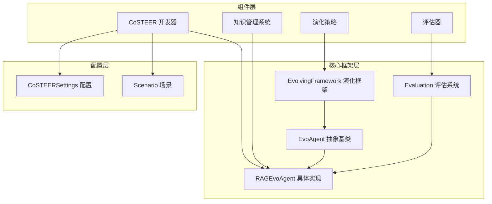

**图表来源**
- [evolving_agent.py](file://rdagent/core/evolving_agent.py#L18-L32)
- [__init__.py](file://rdagent/components/coder/CoSTEER/__init__.py#L17-L40)

## 核心组件分析

### EvoAgent抽象基类

`EvoAgent`是演化代理架构的核心抽象基类，定义了演化过程的基本接口和职责：

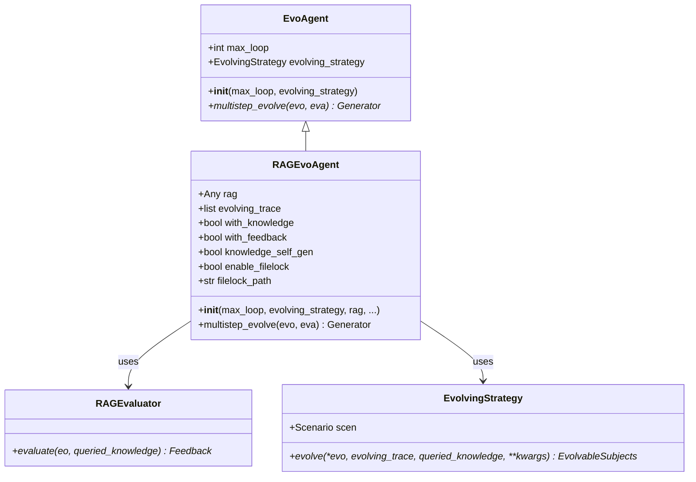

**图表来源**
- [evolving_agent.py](file://rdagent/core/evolving_agent.py#L18-L32)
- [evolving_agent.py](file://rdagent/core/evolving_agent.py#L46-L114)

**章节来源**
- [evolving_agent.py](file://rdagent/core/evolving_agent.py#L18-L114)

### RAGEvoAgent知识增强演化代理

`RAGEvoAgent`继承自`EvoAgent`，专门设计用于支持知识增强的演化过程。它扩展了基础代理的功能，集成了检索增强生成（RAG）能力和自我演化知识管理：

#### 核心特性
- **知识查询集成**：通过RAG系统查询相关知识
- **演化轨迹跟踪**：维护完整的演化历史记录
- **自我知识生成**：支持知识库的动态更新
- **并发安全控制**：提供文件锁机制确保数据一致性

#### 初始化参数详解

| 参数名称 | 类型 | 默认值 | 描述 |
|---------|------|--------|------|
| `max_loop` | int | 必需 | 最大演化循环次数 |
| `evolving_strategy` | EvolvingStrategy | 必需 | 演化策略实例 |
| `rag` | Any | 必需 | 知识检索系统实例 |
| `with_knowledge` | bool | False | 是否启用知识查询 |
| `with_feedback` | bool | True | 是否启用反馈机制 |
| `knowledge_self_gen` | bool | False | 是否允许自我知识生成 |
| `enable_filelock` | bool | False | 是否启用文件锁保护 |
| `filelock_path` | str \| None | None | 文件锁路径 |

**章节来源**
- [evolving_agent.py](file://rdagent/core/evolving_agent.py#L48-L80)

## 架构设计概览

演化代理架构采用了多层解耦的设计模式，确保各组件间的松耦合和高内聚：

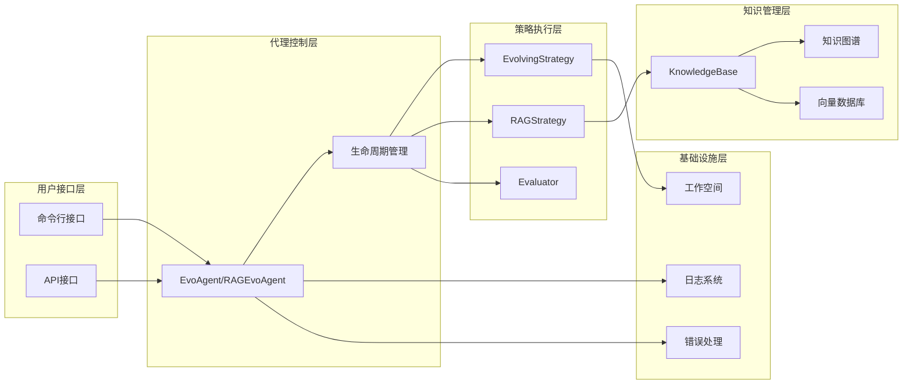

**图表来源**
- [evolving_agent.py](file://rdagent/core/evolving_agent.py#L46-L114)
- [knowledge_management.py](file://rdagent/components/coder/CoSTEER/knowledge_management.py#L54-L79)

## 详细组件分析

### 演化策略（EvolvingStrategy）

演化策略定义了具体的演化算法和逻辑，是演化过程的核心执行引擎：

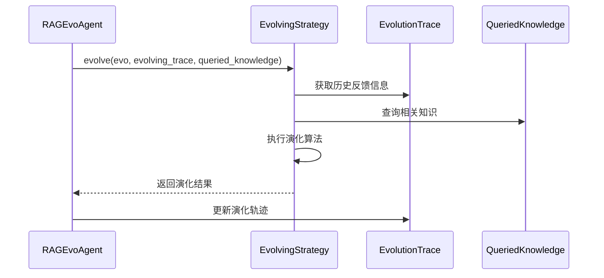

**图表来源**
- [evolving_framework.py](file://rdagent/core/evolving_framework.py#L63-L80)

### 知识管理系统

知识管理系统提供了完整的知识存储、检索和更新功能：

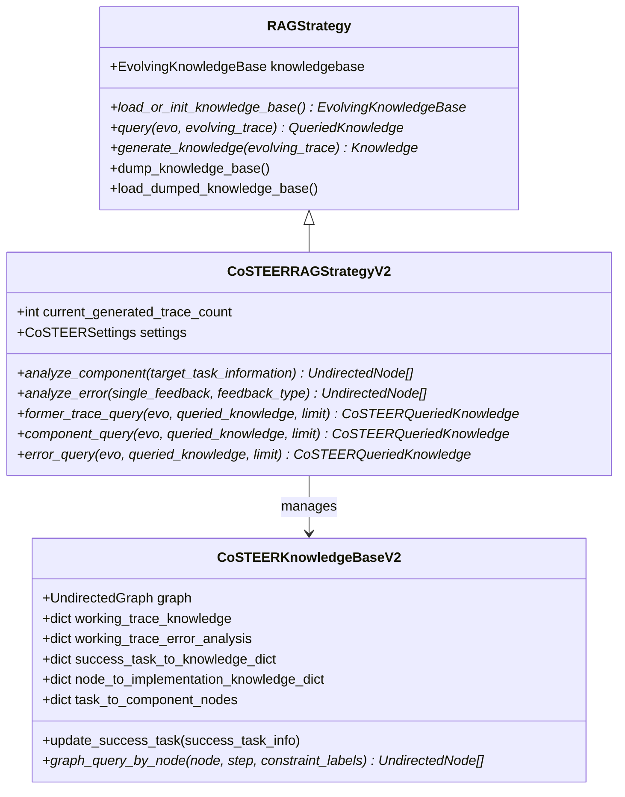

**图表来源**
- [knowledge_management.py](file://rdagent/components/coder/CoSTEER/knowledge_management.py#L54-L79)
- [knowledge_management.py](file://rdagent/components/coder/CoSTEER/knowledge_management.py#L700-L750)

**章节来源**
- [knowledge_management.py](file://rdagent/components/coder/CoSTEER/knowledge_management.py#L54-L799)

### 评估系统

评估系统负责对演化结果进行质量评估和反馈生成：

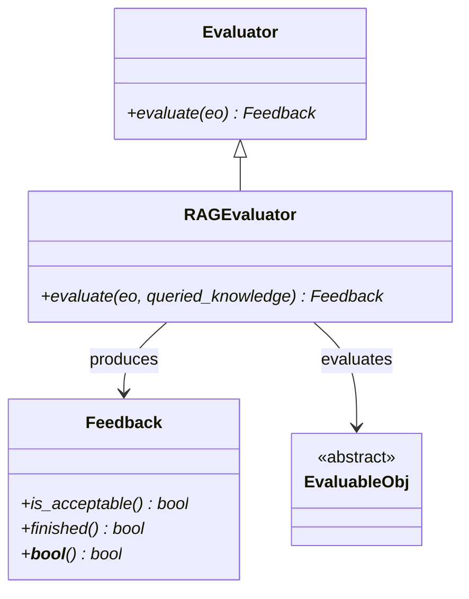

**图表来源**
- [evaluation.py](file://rdagent/core/evaluation.py#L35-L57)

**章节来源**
- [evaluation.py](file://rdagent/core/evaluation.py#L1-L57)

## 代理生命周期与交互流程

演化代理的完整生命周期包含多个关键阶段，每个阶段都有明确的职责和交互模式：

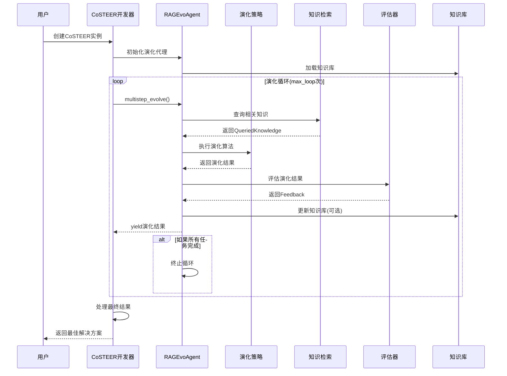

**图表来源**
- [__init__.py](file://rdagent/components/coder/CoSTEER/__init__.py#L95-L176)
- [evolving_agent.py](file://rdagent/core/evolving_agent.py#L82-L114)

### 关键方法调用流程

演化代理的核心方法调用遵循严格的顺序和依赖关系：

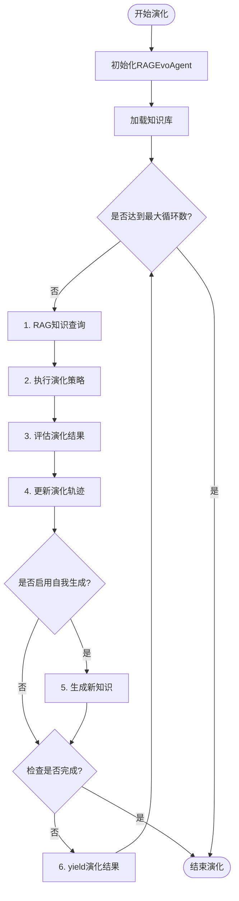

**图表来源**
- [evolving_agent.py](file://rdagent/core/evolving_agent.py#L82-L114)

**章节来源**
- [__init__.py](file://rdagent/components/coder/CoSTEER/__init__.py#L95-L176)

## 状态管理机制

演化代理实现了复杂的状态管理机制，确保演化过程的可控性和可追溯性：

### 演化轨迹追踪

演化代理维护一个完整的演化轨迹列表，记录每次演化的关键信息：

| 字段名称 | 类型 | 描述 |
|---------|------|------|
| `evolvable_subjects` | ASpecificEvolvableSubjects | 当前演化对象 |
| `queried_knowledge` | QueriedKnowledge \| None | 查询到的相关知识 |
| `feedback` | Feedback \| None | 评估反馈结果 |

### 知识库状态管理

知识库采用增量更新策略，支持并发访问控制：

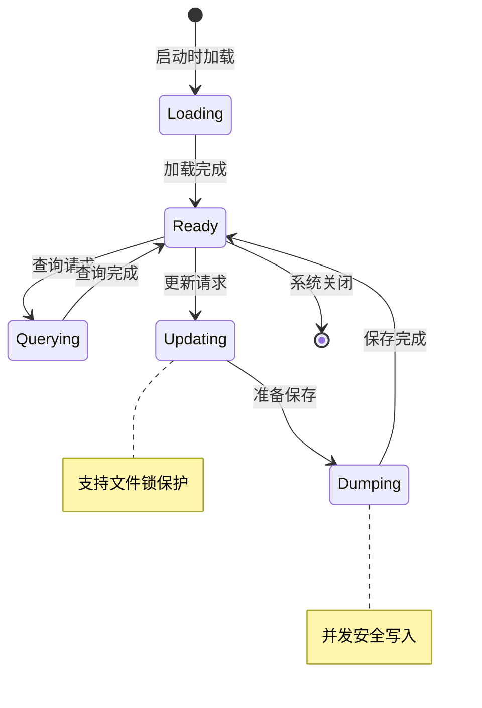

**章节来源**
- [evolving_framework.py](file://rdagent/core/evolving_framework.py#L40-L50)
- [knowledge_management.py](file://rdagent/components/coder/CoSTEER/knowledge_management.py#L70-L90)

## 错误处理策略

演化代理实现了多层次的错误处理机制，确保系统的稳定性和容错能力：

### 异常类型与处理

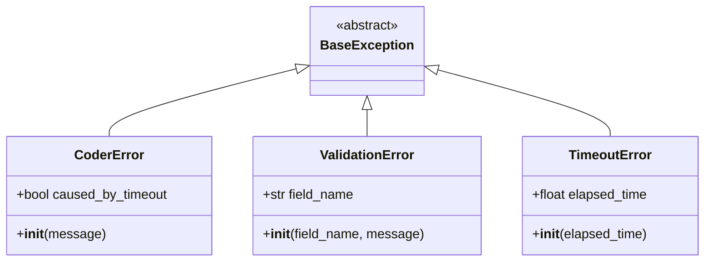

### 错误恢复机制

演化代理采用回退（Fallback）策略处理失败情况：

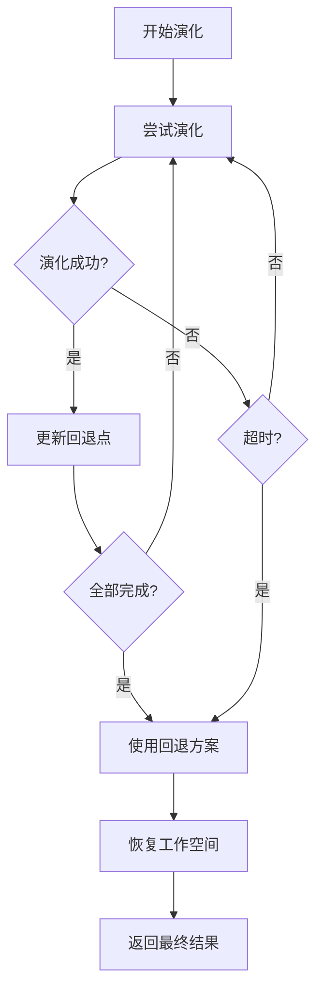

**图表来源**
- [__init__.py](file://rdagent/components/coder/CoSTEER/__init__.py#L137-L176)

**章节来源**
- [__init__.py](file://rdagent/components/coder/CoSTEER/__init__.py#L137-L176)

## 配置参数详解

### CoSTEERSettings配置类

演化代理的配置通过`CoSTEERSettings`类进行统一管理：

| 配置项 | 类型 | 默认值 | 用途 |
|--------|------|--------|------|
| `coder_use_cache` | bool | False | 是否使用缓存加速 |
| `max_loop` | int | 10 | 最大演化循环数 |
| `fail_task_trial_limit` | int | 20 | 失败任务重试限制 |
| `v2_query_component_limit` | int | 1 | 组件查询限制 |
| `v2_query_error_limit` | int | 1 | 错误查询限制 |
| `v2_query_former_trace_limit` | int | 3 | 历史轨迹查询限制 |
| `knowledge_base_path` | str \| None | None | 知识库路径 |
| `new_knowledge_base_path` | str \| None | None | 新知识库路径 |
| `enable_filelock` | bool | False | 是否启用文件锁 |
| `filelock_path` | str \| None | None | 文件锁文件路径 |

### 动态配置调整

演化代理支持运行时动态调整部分配置参数，以适应不同的演化需求：

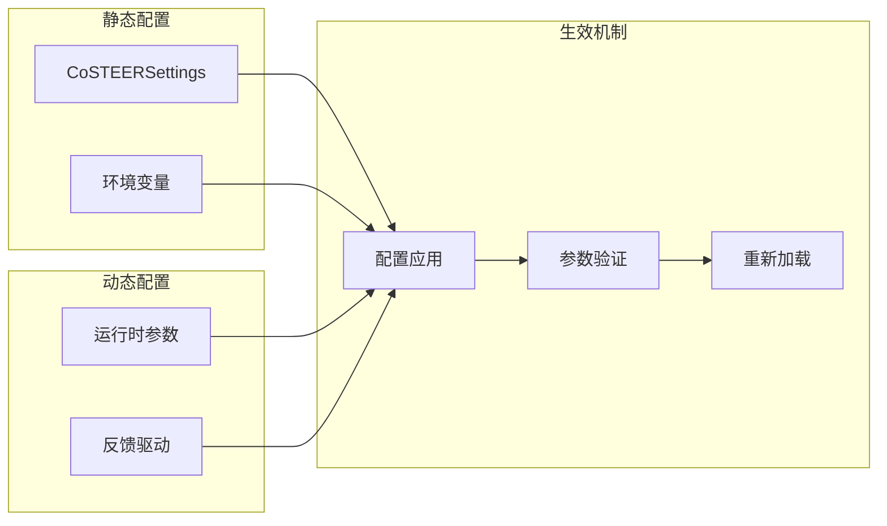

**章节来源**
- [config.py](file://rdagent/components/coder/CoSTEER/config.py#L1-L42)

## 开发指南

### 自定义演化策略

开发者可以通过继承`EvolvingStrategy`基类来实现自定义的演化算法：

```python
# 示例：自定义演化策略实现
class CustomEvolvingStrategy(EvolvingStrategy):
    def evolve(self, *evo, evolving_trace=None, queried_knowledge=None, **kwargs):
        # 实现自定义演化逻辑
        pass
```

### 自定义评估器

评估器的实现需要遵循特定的接口规范：

```python
# 示例：自定义评估器实现
class CustomEvaluator(RAGEvaluator):
    def evaluate(self, eo, queried_knowledge=None):
        # 实现评估逻辑
        pass
```

### 知识库扩展

开发者可以基于现有的知识库架构扩展新的知识存储方式：

```python
# 示例：自定义知识库实现
class CustomKnowledgeBase(EvolvingKnowledgeBase):
    def query(self):
        # 实现查询逻辑
        pass
```

### 最佳实践建议

1. **模块化设计**：保持各组件的独立性和可替换性
2. **错误边界**：在关键操作点添加适当的错误处理
3. **性能监控**：监控演化过程的性能指标
4. **日志记录**：详细记录演化过程的关键步骤
5. **测试覆盖**：为每个组件编写充分的单元测试

## 总结

演化代理架构通过精心设计的分层结构和模块化组件，提供了一个强大而灵活的演化计算平台。`EvoAgent`抽象基类定义了演化过程的基本框架，`RAGEvoAgent`通过集成知识增强功能扩展了其能力，而与`EvolvingStrategy`、`RAGStrategy`、`Coder`和`Evaluator`等核心组件的紧密协作，确保了整个系统的协调运作。

该架构的主要优势包括：
- **高度可扩展性**：通过抽象接口支持多种演化策略和评估方法
- **知识驱动**：集成RAG能力实现智能化的知识利用
- **容错性强**：完善的错误处理和恢复机制
- **并发安全**：支持多代理并发演化而不冲突
- **可配置性**：丰富的配置选项满足不同应用场景需求

对于开发者而言，理解这套架构设计不仅有助于更好地使用RD-Agent框架，也为构建类似的演化计算系统提供了宝贵的参考和指导。