# 代理类型

<cite>
**本文档中引用的文件**
- [rdagent/core/evolving_agent.py](file://rdagent/core/evolving_agent.py)
- [rdagent/components/coder/CoSTEER/__init__.py](file://rdagent/components/coder/CoSTEER/__init__.py)
- [rdagent/components/coder/CoSTEER/knowledge_management.py](file://rdagent/components/coder/CoSTEER/knowledge_management.py)
- [rdagent/components/coder/CoSTEER/config.py](file://rdagent/components/coder/CoSTEER/config.py)
- [rdagent/scenarios/qlib/proposal/quant_proposal.py](file://rdagent/scenarios/qlib/proposal/quant_proposal.py)
- [rdagent/core/evolving_framework.py](file://rdagent/core/evolving_framework.py)
- [rdagent/components/coder/CoSTEER/evaluators.py](file://rdagent/components/coder/CoSTEER/evaluators.py)
</cite>

## 目录
1. [引言](#引言)
2. [项目结构概述](#项目结构概述)
3. [核心代理类型](#核心代理类型)
4. [架构概览](#架构概览)
5. [详细组件分析](#详细组件分析)
6. [RAG策略集成机制](#rag策略集成机制)
7. [反馈注入机制](#反馈注入机制)
8. [量化策略联合演化应用](#量化策略联合演化应用)
9. [性能考虑](#性能考虑)
10. [故障排除指南](#故障排除指南)
11. [结论](#结论)

## 引言

RD-Agent框架提供了两种主要的演化代理类型：`EvoAgent`和`RAGEvoAgent`。这两种代理类型在设计理念、功能特性和应用场景上存在显著差异。`EvoAgent`作为基础演化代理，提供基本的演化能力；而`RAGEvoAgent`通过集成RAG（检索增强生成）策略和反馈注入机制，实现了更智能的知识驱动演化过程。

本文档将深入分析这两种代理类型的区别与适用场景，详细阐述`RAGEvoAgent`如何通过`with_knowledge`装饰器集成`RAGStrategy`，实现从历史实验中检索知识来指导新代码生成，并解释`with_feedback`装饰器如何将评估结果注入演化过程。同时，结合`rdagent/scenarios/qlib/proposal/quant_proposal.py`中的用例，说明不同代理类型在量化策略联合演化中的具体应用。

## 项目结构概述

RD-Agent框架采用模块化设计，核心代理类型位于以下关键目录中：

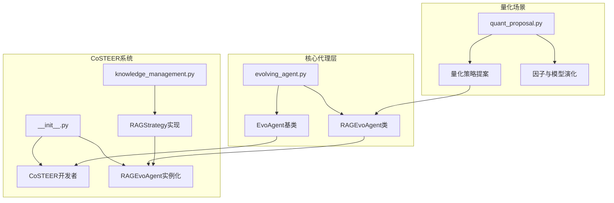

**图表来源**
- [rdagent/core/evolving_agent.py](file://rdagent/core/evolving_agent.py#L18-L32)
- [rdagent/components/coder/CoSTEER/__init__.py](file://rdagent/components/coder/CoSTEER/__init__.py#L15-L50)

**章节来源**
- [rdagent/core/evolving_agent.py](file://rdagent/core/evolving_agent.py#L1-L116)
- [rdagent/components/coder/CoSTEER/__init__.py](file://rdagent/components/coder/CoSTEER/__init__.py#L1-L177)

## 核心代理类型

### EvoAgent基础架构

`EvoAgent`是所有演化代理的基础抽象类，定义了演化代理的核心接口和行为模式：

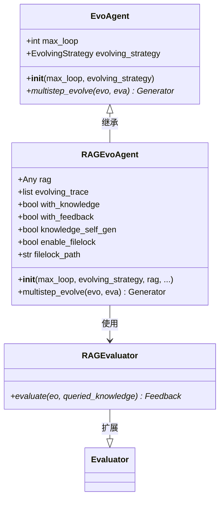

**图表来源**
- [rdagent/core/evolving_agent.py](file://rdagent/core/evolving_agent.py#L18-L32)
- [rdagent/core/evolving_agent.py](file://rdagent/core/evolving_agent.py#L46-L114)

### RAGEvoAgent特性对比

| 特性 | EvoAgent | RAGEvoAgent |
|------|----------|-------------|
| **基础功能** | 基本演化循环 | 知识驱动演化 |
| **知识集成** | 不支持 | 支持with_knowledge装饰器 |
| **反馈机制** | 基础反馈 | with_feedback装饰器 |
| **自我演化** | 不支持 | 支持知识自生成功能 |
| **并发安全** | 无锁机制 | 文件锁保护 |
| **配置灵活性** | 基础配置 | 完整配置选项 |

**章节来源**
- [rdagent/core/evolving_agent.py](file://rdagent/core/evolving_agent.py#L46-L114)

## 架构概览

RD-Agent代理系统的整体架构体现了从简单到复杂的渐进式设计：

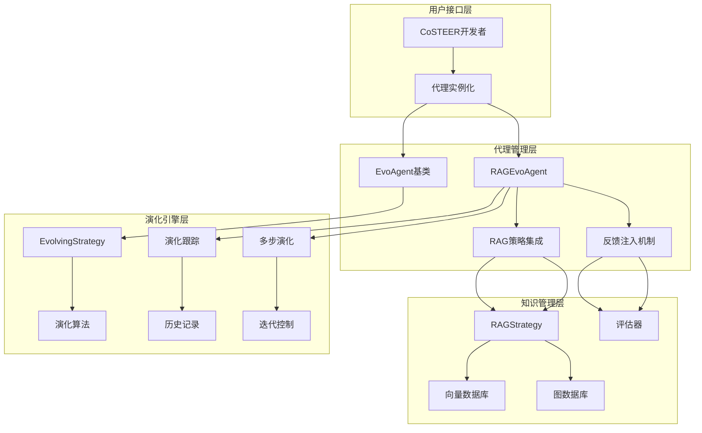

**图表来源**
- [rdagent/components/coder/CoSTEER/__init__.py](file://rdagent/components/coder/CoSTEER/__init__.py#L15-L50)
- [rdagent/core/evolving_framework.py](file://rdagent/core/evolving_framework.py#L80-L126)

## 详细组件分析

### EvoAgent实现细节

`EvoAgent`作为抽象基类，定义了演化代理的核心接口：

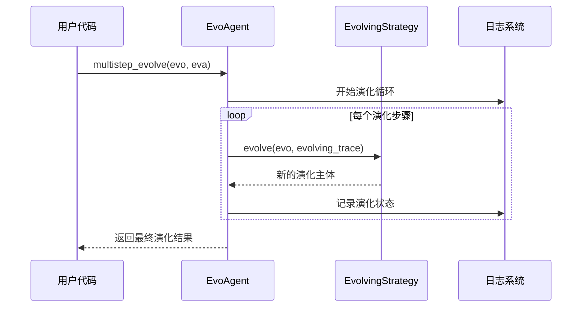

**图表来源**
- [rdagent/core/evolving_agent.py](file://rdagent/core/evolving_agent.py#L25-L32)

### RAGEvoAgent详细流程

`RAGEvoAgent`在基础演化基础上增加了知识检索和反馈注入功能：

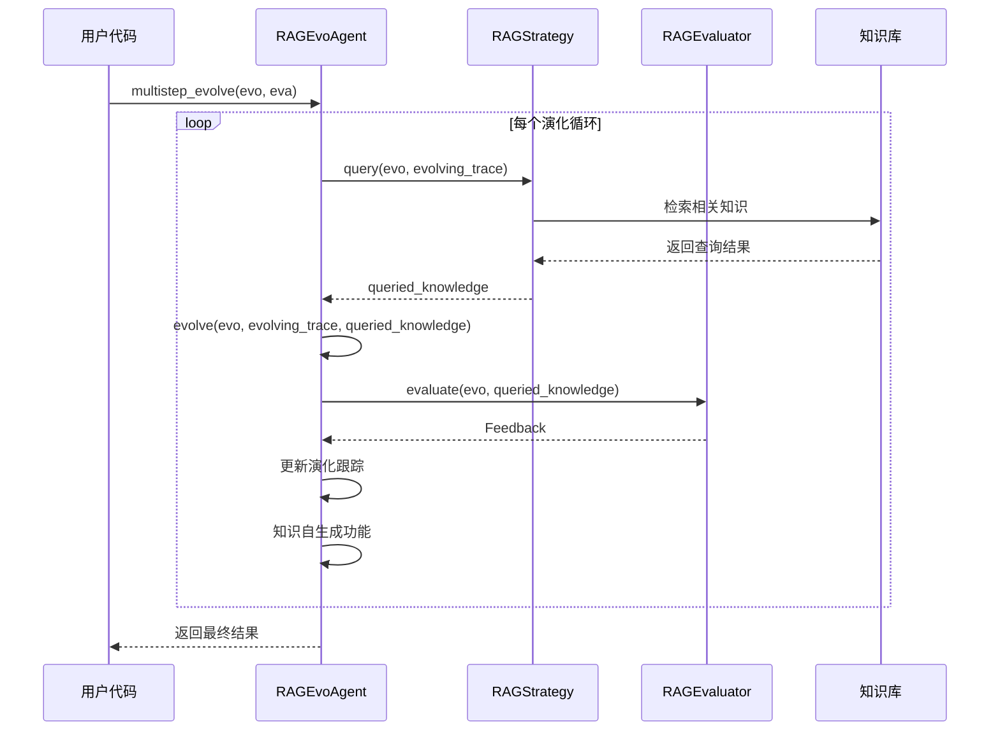

**图表来源**
- [rdagent/core/evolving_agent.py](file://rdagent/core/evolving_agent.py#L65-L114)

**章节来源**
- [rdagent/core/evolving_agent.py](file://rdagent/core/evolving_agent.py#L46-L114)

## RAG策略集成机制

### with_knowledge装饰器原理

`with_knowledge`装饰器是`RAGEvoAgent`实现知识驱动演化的核心机制。该装饰器通过以下方式工作：

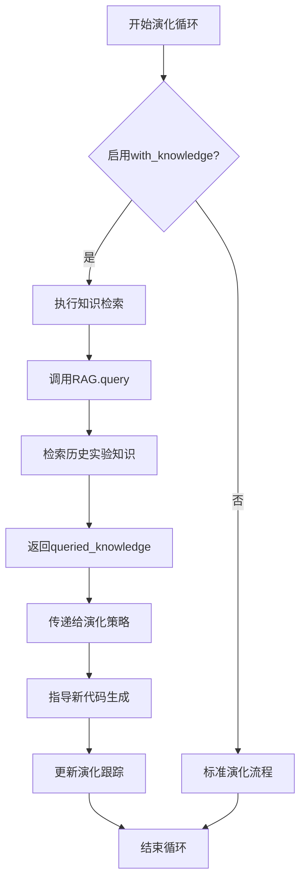

**图表来源**
- [rdagent/core/evolving_agent.py](file://rdagent/core/evolving_agent.py#L70-L75)

### RAGStrategy实现架构

`RAGStrategy`提供了知识检索和管理的抽象接口：

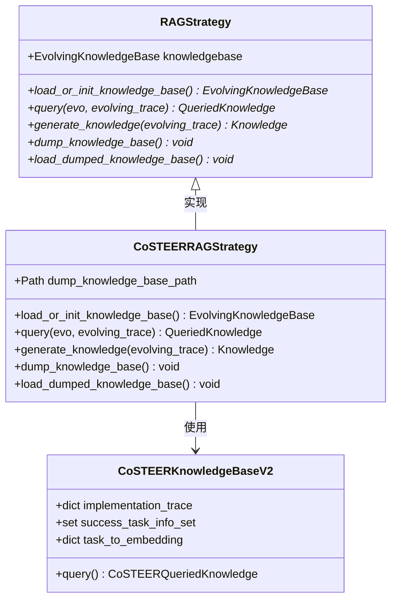

**图表来源**
- [rdagent/core/evolving_framework.py](file://rdagent/core/evolving_framework.py#L80-L126)
- [rdagent/components/coder/CoSTEER/knowledge_management.py](file://rdagent/components/coder/CoSTEER/knowledge_management.py#L54-L79)

**章节来源**
- [rdagent/core/evolving_framework.py](file://rdagent/core/evolving_framework.py#L80-L126)
- [rdagent/components/coder/CoSTEER/knowledge_management.py](file://rdagent/components/coder/CoSTEER/knowledge_management.py#L54-L139)

## 反馈注入机制

### with_feedback装饰器功能

`with_feedback`装饰器负责将评估结果注入演化过程，形成闭环反馈系统：

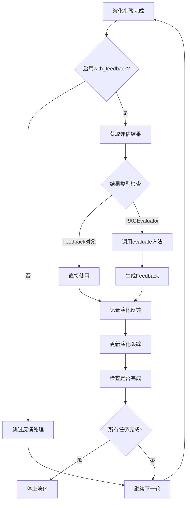

**图表来源**
- [rdagent/core/evolving_agent.py](file://rdagent/core/evolving_agent.py#L85-L95)

### 多重反馈系统

CoSTEER系统实现了复杂的多重反馈机制：

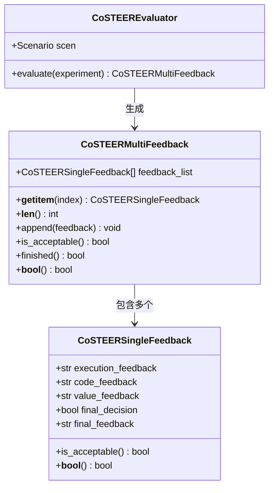

**图表来源**
- [rdagent/components/coder/CoSTEER/evaluators.py](file://rdagent/components/coder/CoSTEER/evaluators.py#L186-L223)

**章节来源**
- [rdagent/components/coder/CoSTEER/evaluators.py](file://rdagent/components/coder/CoSTEER/evaluators.py#L155-L223)

## 量化策略联合演化应用

### CoSTEER在量化场景中的应用

在量化金融领域，CoSTEER系统通过`RAGEvoAgent`实现了因子和模型的联合演化：

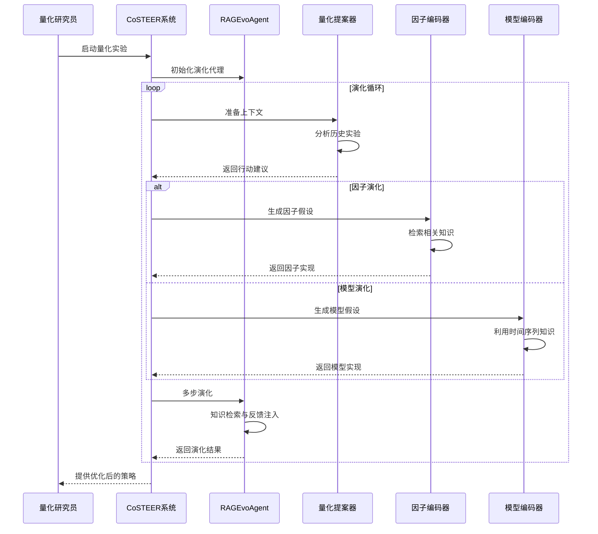

**图表来源**
- [rdagent/scenarios/qlib/proposal/quant_proposal.py](file://rdagent/scenarios/qlib/proposal/quant_proposal.py#L40-L96)
- [rdagent/components/coder/CoSTEER/__init__.py](file://rdagent/components/coder/CoSTEER/__init__.py#L95-L140)

### 量化策略演化决策机制

量化场景中的代理类型选择基于以下原则：

| 场景条件 | 推荐代理类型 | 原因 |
|----------|--------------|------|
| **初始探索阶段** | `EvoAgent` | 需要快速原型验证 |
| **知识积累阶段** | `RAGEvoAgent(with_knowledge=True)` | 利用历史经验加速演化 |
| **优化改进阶段** | `RAGEvoAgent(with_knowledge=True, with_feedback=True)` | 结合知识和反馈进行精细化优化 |
| **大规模并行演化** | `RAGEvoAgent(with_knowledge=True, enable_filelock=True)` | 支持并发知识共享 |

**章节来源**
- [rdagent/scenarios/qlib/proposal/quant_proposal.py](file://rdagent/scenarios/qlib/proposal/quant_proposal.py#L40-L180)

## 性能考虑

### 内存和计算优化

不同代理类型在性能特征上存在显著差异：

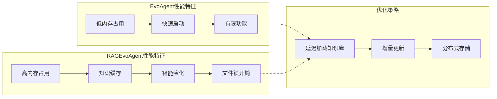

### 配置优化建议

根据不同的使用场景，推荐以下配置参数：

| 使用场景 | max_loop | with_knowledge | with_feedback | knowledge_self_gen |
|----------|----------|----------------|---------------|-------------------|
| **快速原型** | 5 | False | True | False |
| **知识积累** | 10 | True | True | True |
| **生产环境** | 15 | True | True | True |
| **并行实验** | 10 | True | True | False |

**章节来源**
- [rdagent/components/coder/CoSTEER/config.py](file://rdagent/components/coder/CoSTEER/config.py#L10-L42)

## 故障排除指南

### 常见问题及解决方案

#### 知识检索失败
- **症状**: `queried_knowledge`为None
- **原因**: RAG策略未正确初始化或知识库为空
- **解决方案**: 检查`knowledge_base_path`配置，确保知识库已正确构建

#### 并发访问冲突
- **症状**: 文件锁异常或数据竞争
- **原因**: 多进程同时访问知识库
- **解决方案**: 启用`enable_filelock`并设置正确的`filelock_path`

#### 反馈注入失效
- **症状**: 演化过程不响应评估结果
- **原因**: `with_feedback`配置错误或评估器返回无效反馈
- **解决方案**: 验证评估器实现和反馈格式

**章节来源**
- [rdagent/components/coder/CoSTEER/__init__.py](file://rdagent/components/coder/CoSTEER/__init__.py#L95-L176)

## 结论

RD-Agent框架通过`EvoAgent`和`RAGEvoAgent`两种代理类型，为不同复杂度的演化任务提供了灵活的解决方案。`EvoAgent`作为基础代理，适用于简单的演化需求；而`RAGEvoAgent`通过集成`with_knowledge`和`with_feedback`装饰器，实现了智能化的知识驱动演化过程。

在量化策略联合演化场景中，`RAGEvoAgent`展现了强大的知识利用能力和反馈驱动优化效果。通过合理的配置和使用策略，可以显著提升量化策略研发的效率和质量。随着知识库的不断积累和反馈机制的完善，这种智能演化系统将在量化金融领域发挥越来越重要的作用。

未来的发展方向包括：
- 更高效的向量检索算法
- 自适应的反馈权重机制
- 分布式知识共享架构
- 多模态知识融合技术

这些改进将进一步提升代理类型在复杂量化策略演化中的应用价值。