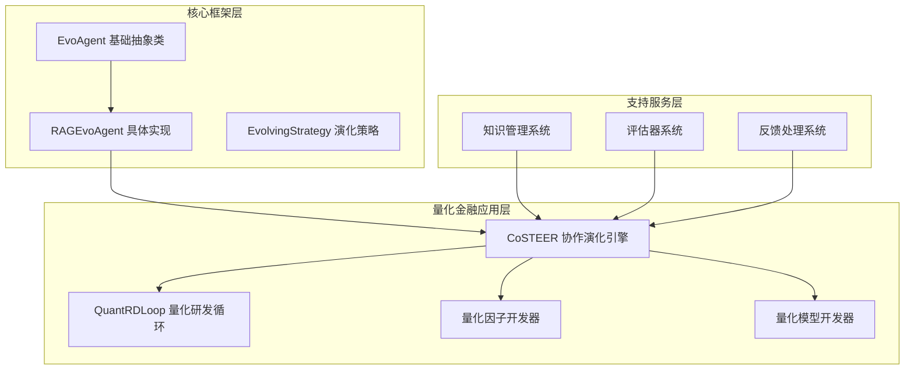
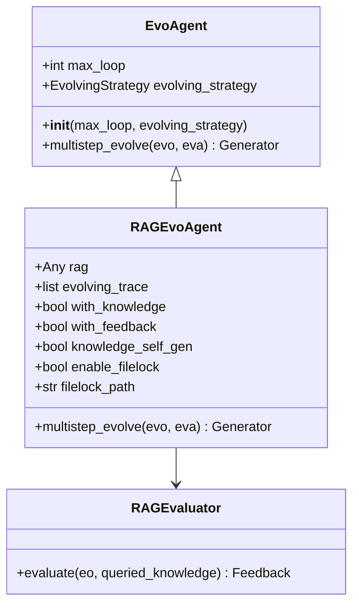
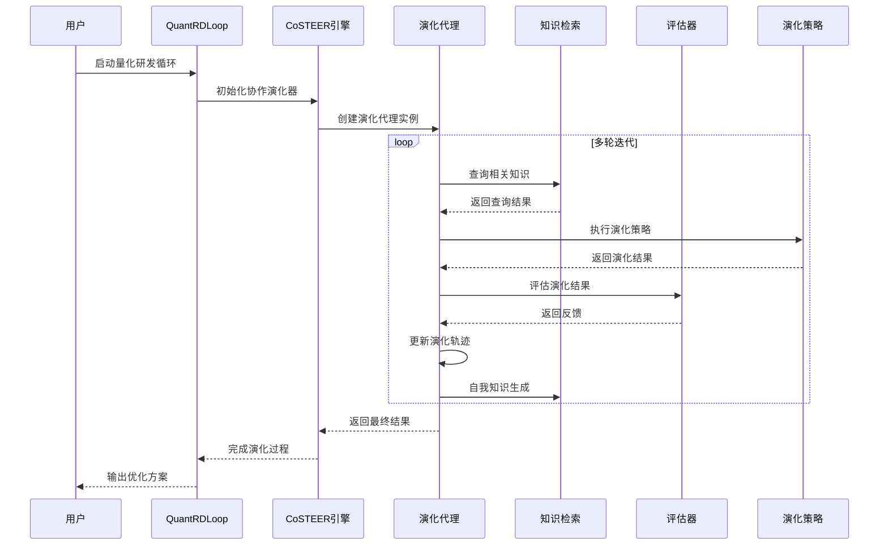
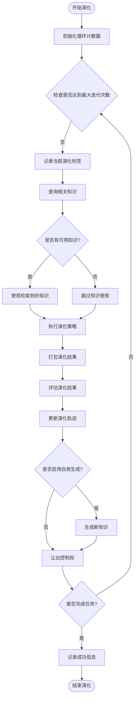
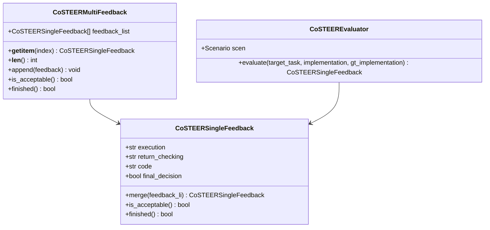
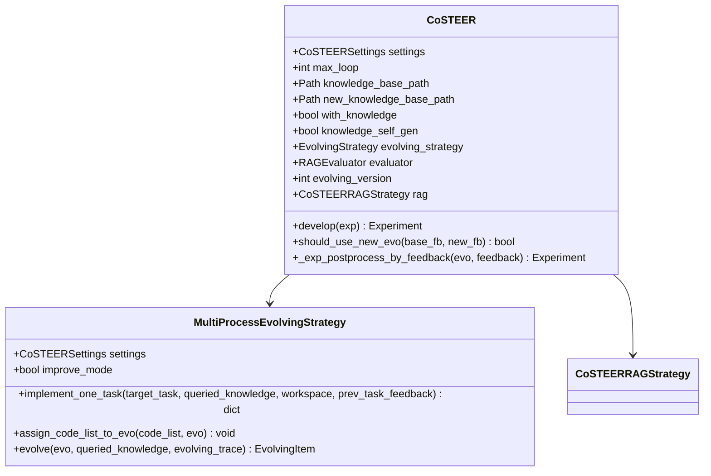
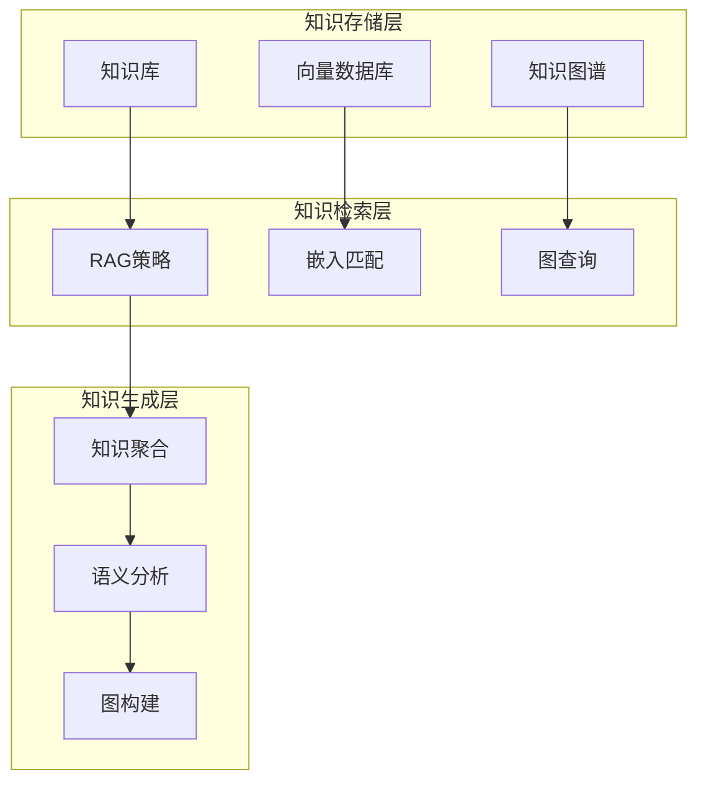
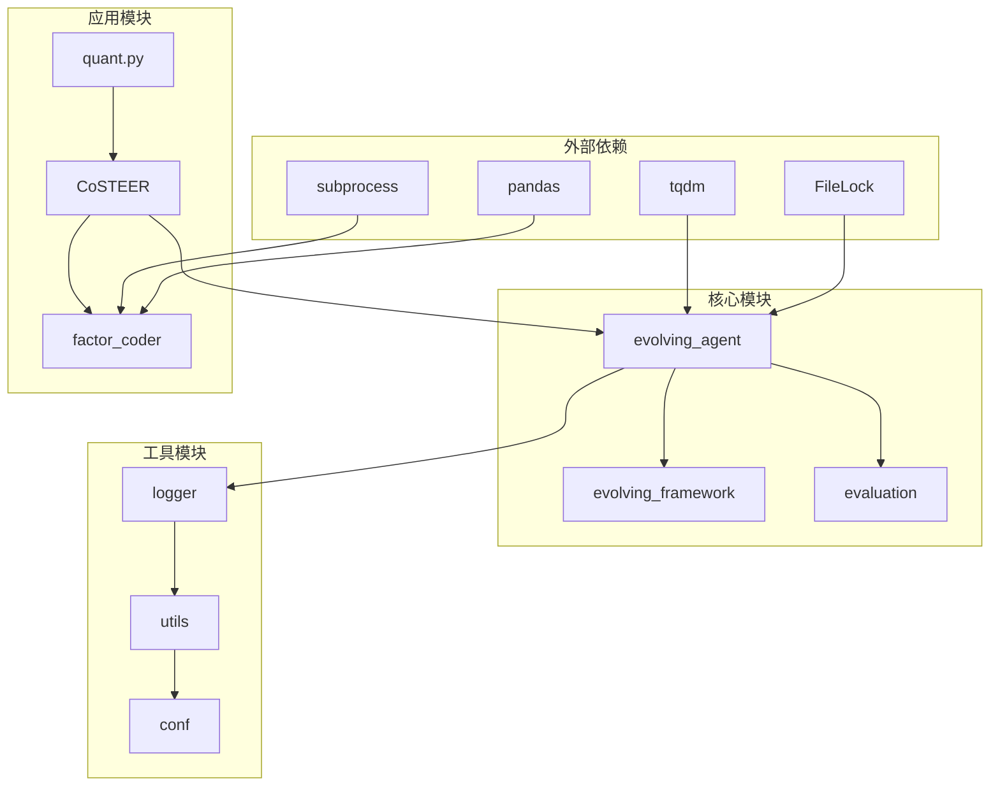

# 演化代理

<cite>
**本文档引用的文件**
- [evolving_agent.py](file://rdagent/core/evolving_agent.py)
- [quant.py](file://rdagent/app/qlib_rd_loop/quant.py)
- [CoSTEER/__init__.py](file://rdagent/components/coder/CoSTEER/__init__.py)
- [CoSTEER/evolving_strategy.py](file://rdagent/components/coder/CoSTEER/evolving_strategy.py)
- [CoSTEER/knowledge_management.py](file://rdagent/components/coder/CoSTEER/knowledge_management.py)
- [CoSTEER/evaluators.py](file://rdagent/components/coder/CoSTEER/evaluators.py)
- [factor_coder/factor.py](file://rdagent/components/coder/factor_coder/factor.py)
- [conf.py](file://rdagent/app/qlib_rd_loop/conf.py)
</cite>

## 目录
1. [引言](#引言)
2. [项目结构概述](#项目结构概述)
3. [核心组件分析](#核心组件分析)
4. [架构概览](#架构概览)
5. [详细组件分析](#详细组件分析)
6. [依赖关系分析](#依赖关系分析)
7. [性能考虑](#性能考虑)
8. [故障排除指南](#故障排除指南)
9. [结论](#结论)

## 引言

演化代理（Evolving Agent）是RD-Agent智能核心的重要组成部分，负责在量化金融场景中实现自动化的实验设计、代码生成、执行和优化过程。该系统通过多轮迭代的方式，结合知识检索（RAG）、反馈循环和演化策略，驱动复杂的科学发现和技术创新流程。

演化代理的核心设计理念是模拟生物进化过程，在软件开发和科学研究中实现智能化的试错学习。通过`EvoAgent`和`RAGEvoAgent`类的协同工作，系统能够在没有人工干预的情况下，自主地探索解决方案空间，不断改进和优化实验结果。

## 项目结构概述

演化代理系统采用分层架构设计，主要包含以下核心模块：

**图表来源**
- [evolving_agent.py](file://rdagent/core/evolving_agent.py#L18-L114)
- [quant.py](file://rdagent/app/qlib_rd_loop/quant.py#L20-L143)
- [CoSTEER/__init__.py](file://rdagent/components/coder/CoSTEER/__init__.py#L20-L176)

## 核心组件分析

### EvoAgent 抽象基类

`EvoAgent`是演化代理系统的基础抽象类，定义了所有演化代理必须实现的核心接口。它采用泛型设计，支持不同类型的任务和评估器。

**图表来源**
- [evolving_agent.py](file://rdagent/core/evolving_agent.py#L18-L114)

**章节来源**
- [evolving_agent.py](file://rdagent/core/evolving_agent.py#L18-L114)

### RAGEvoAgent 具体实现

`RAGEvoAgent`是演化代理的具体实现，专门针对量化金融场景进行了优化。它集成了知识检索、反馈处理和自我演化功能。

该类的核心特性包括：
- **知识检索集成**：通过`rag`参数集成向量数据库和知识图谱
- **反馈循环**：支持实时的评估和反馈处理
- **自我演化**：能够根据历史经验自我改进
- **并发控制**：使用文件锁确保知识库更新的安全性

**章节来源**
- [evolving_agent.py](file://rdagent/core/evolving_agent.py#L46-L114)

## 架构概览

演化代理系统采用多层架构模式，实现了高度模块化和可扩展的设计：

**图表来源**
- [quant.py](file://rdagent/app/qlib_rd_loop/quant.py#L20-L143)
- [CoSTEER/__init__.py](file://rdagent/components/coder/CoSTEER/__init__.py#L73-L176)
- [evolving_agent.py](file://rdagent/core/evolving_agent.py#L69-L114)

## 详细组件分析

### multistep_evolve 方法详解

`multistep_evolve`方法是演化代理的核心算法，实现了多轮迭代的演化过程。该方法采用生成器模式，允许调用者对每一轮迭代进行精确控制。

**图表来源**
- [evolving_agent.py](file://rdagent/core/evolving_agent.py#L69-L114)

该方法的执行流程包含以下关键步骤：

1. **知识检索阶段**：通过RAG系统查询与当前演化状态相关的知识
2. **演化策略执行**：应用预定义的演化策略生成新的解决方案
3. **结果评估**：使用评估器对演化结果进行质量评估
4. **轨迹更新**：将本次演化结果添加到演化轨迹中
5. **自我演化**：根据历史经验生成新的知识条目
6. **终止条件检查**：判断是否达到收敛条件或最大迭代次数

**章节来源**
- [evolving_agent.py](file://rdagent/core/evolving_agent.py#L69-L114)

### 装饰器增强机制

演化代理系统通过装饰器模式增强了代理的能力，主要包括`with_feedback`和`with_knowledge`两个核心装饰器。

#### with_feedback 装饰器

`with_feedback`装饰器负责处理演化过程中的反馈循环。它确保每次演化都能获得有效的评估结果，并根据反馈调整后续的演化策略。

**图表来源**
- [CoSTEER/evaluators.py](file://rdagent/components/coder/CoSTEER/evaluators.py#L20-L311)

#### with_knowledge 装饰器

`with_knowledge`装饰器集成了知识管理系统，使演化代理能够利用历史经验和外部知识源来指导演化过程。

**章节来源**
- [CoSTEER/evaluators.py](file://rdagent/components/coder/CoSTEER/evaluators.py#L20-L311)

### CoSTEER 协作演化引擎

CoSTEER（Collaborative STEERING）是演化代理系统的核心引擎，实现了多智能体协作的演化模式。

**图表来源**
- [CoSTEER/__init__.py](file://rdagent/components/coder/CoSTEER/__init__.py#L20-L176)
- [CoSTEER/evolving_strategy.py](file://rdagent/components/coder/CoSTEER/evolving_strategy.py#L15-L134)

**章节来源**
- [CoSTEER/__init__.py](file://rdagent/components/coder/CoSTEER/__init__.py#L20-L176)

### 知识管理系统

演化代理系统配备了先进的知识管理系统，支持向量检索、知识图谱和语义相似性分析。

**图表来源**
- [CoSTEER/knowledge_management.py](file://rdagent/components/coder/CoSTEER/knowledge_management.py#L1-L799)

**章节来源**
- [CoSTEER/knowledge_management.py](file://rdagent/components/coder/CoSTEER/knowledge_management.py#L1-L799)

## 依赖关系分析

演化代理系统的依赖关系呈现清晰的层次结构：

**图表来源**
- [evolving_agent.py](file://rdagent/core/evolving_agent.py#L1-L15)
- [quant.py](file://rdagent/app/qlib_rd_loop/quant.py#L1-L15)

**章节来源**
- [evolving_agent.py](file://rdagent/core/evolving_agent.py#L1-L15)
- [CoSTEER/__init__.py](file://rdagent/components/coder/CoSTEER/__init__.py#L1-L15)

## 性能考虑

演化代理系统在设计时充分考虑了性能优化，采用了多种策略来提高效率：

### 并发处理
- 使用`multiprocessing_wrapper`实现多进程并行演化
- 支持批量任务处理以减少系统开销
- 实现任务优先级调度机制

### 缓存机制
- 内置代码执行缓存避免重复计算
- 知识库持久化存储减少加载时间
- 结果缓存机制加速相似任务处理

### 内存管理
- 采用生成器模式减少内存占用
- 实现对象池化机制复用资源
- 及时清理临时数据防止内存泄漏

## 故障排除指南

### 常见问题及解决方案

#### 演化停滞问题
当演化过程陷入局部最优时，可以通过以下方式解决：
- 调整`max_loop`参数增加探索时间
- 启用`knowledge_self_gen`功能激活自我演化
- 修改`evolving_strategy`策略参数

#### 知识检索失败
如果RAG系统无法找到相关知识：
- 检查知识库路径配置
- 验证向量数据库连接状态
- 调整相似度阈值参数

#### 评估器异常
评估过程中出现错误时：
- 检查输入数据格式和完整性
- 验证评估器配置参数
- 查看详细的错误日志信息

**章节来源**
- [CoSTEER/__init__.py](file://rdagent/components/coder/CoSTEER/__init__.py#L100-L176)

## 结论

演化代理系统作为RD-Agent智能核心，成功地将生物进化原理应用于软件开发和科学研究领域。通过`EvoAgent`和`RAGEvoAgent`类的精心设计，以及`multistep_evolve`方法的高效实现，系统能够在复杂的应用场景中实现自动化、智能化的试错学习。

该系统的主要优势包括：
- **高度模块化**：清晰的分层架构便于维护和扩展
- **强大的知识管理**：集成的RAG系统提供丰富的上下文信息
- **灵活的演化策略**：支持多种演化模式适应不同场景需求
- **完善的反馈机制**：实时的评估和反馈确保演化方向正确

在量化金融领域的应用表明，演化代理系统能够显著提高因子开发和模型优化的效率，为金融机构提供了强有力的技术支撑。随着系统的不断完善和优化，它将在更多领域发挥重要作用，推动人工智能技术在科学研究和工程实践中的广泛应用。