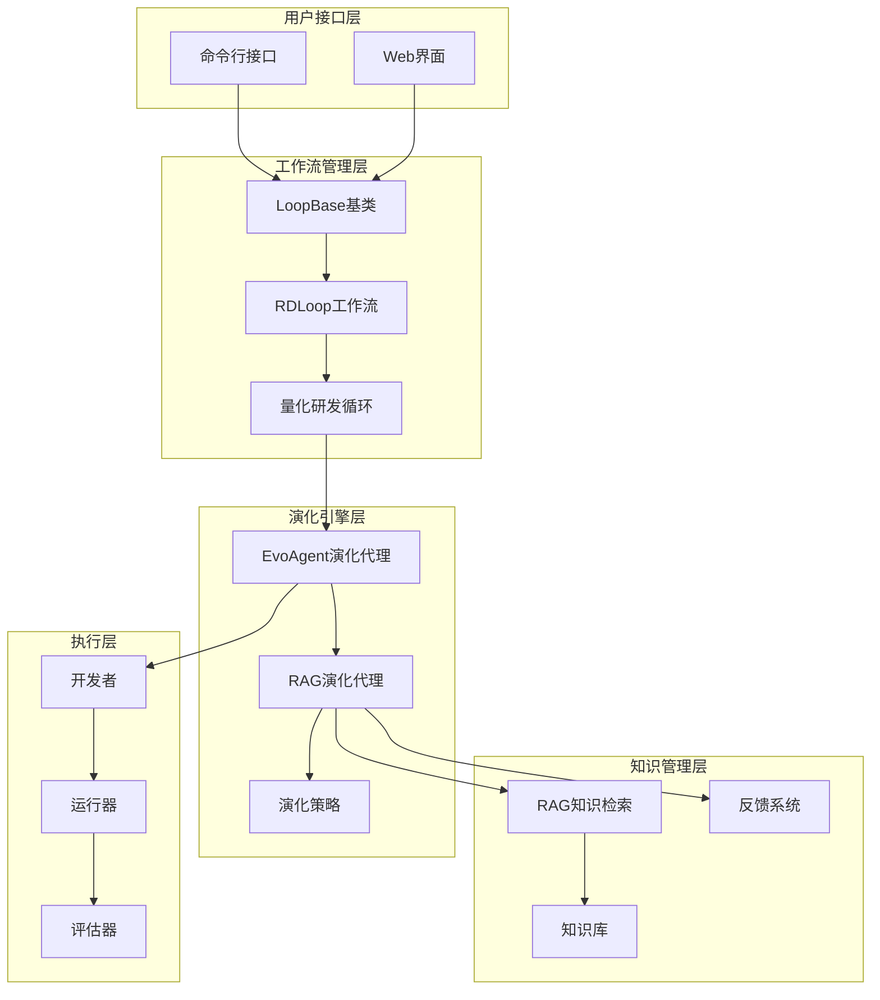
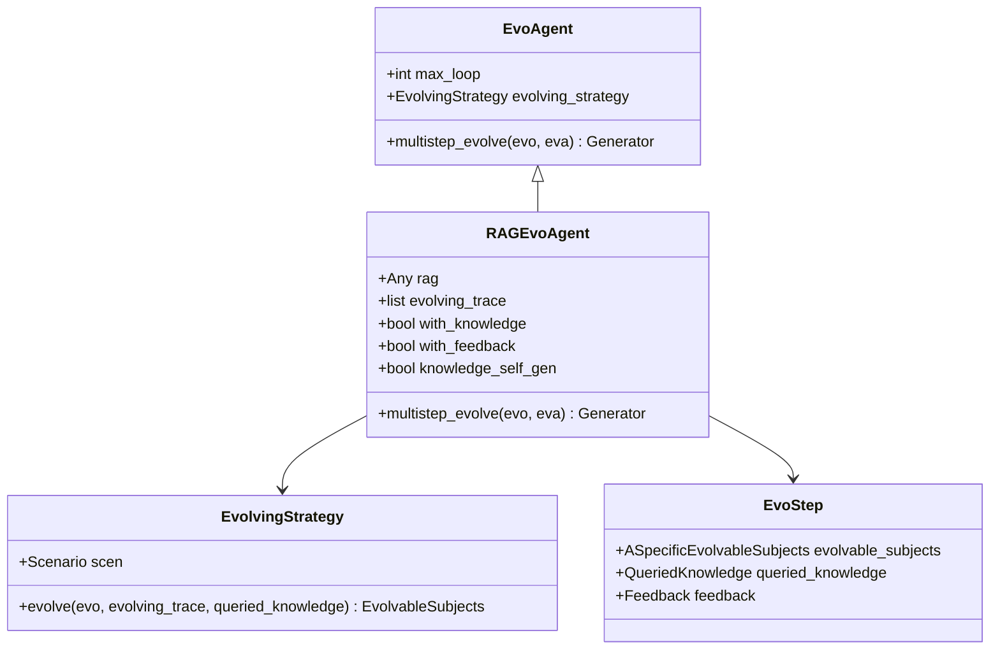
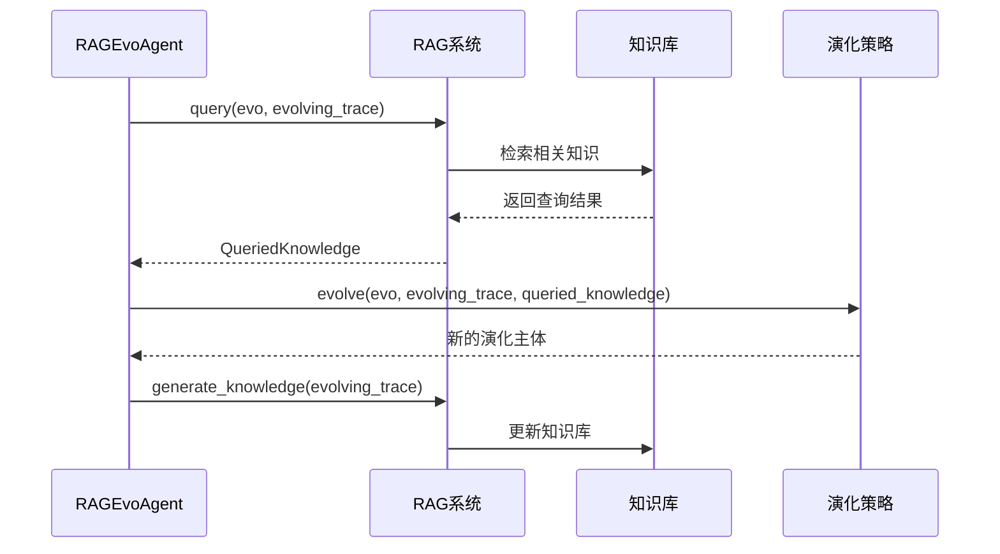
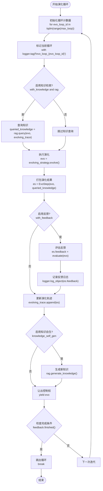
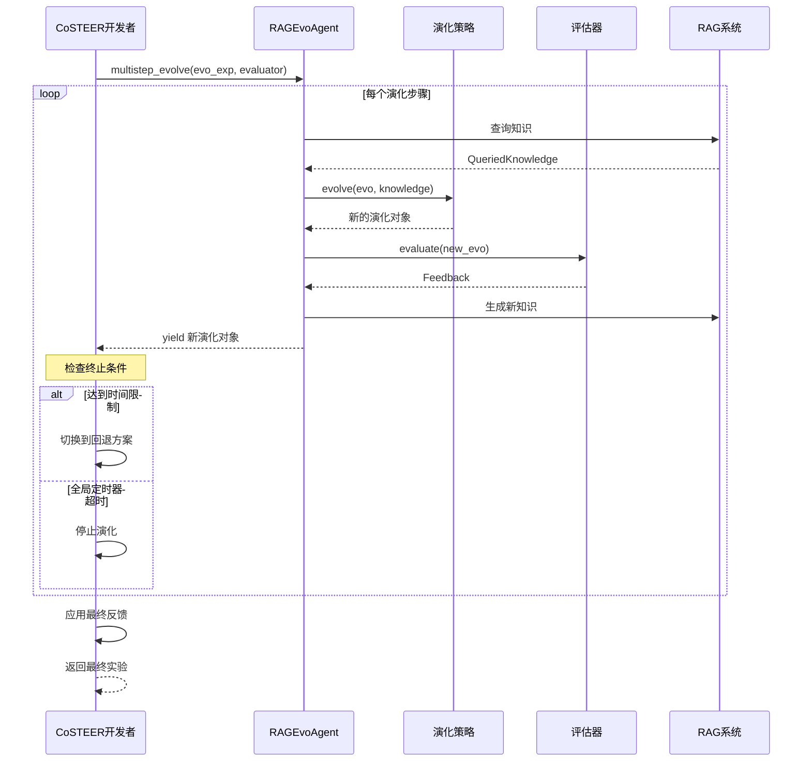
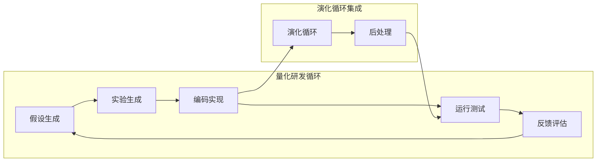
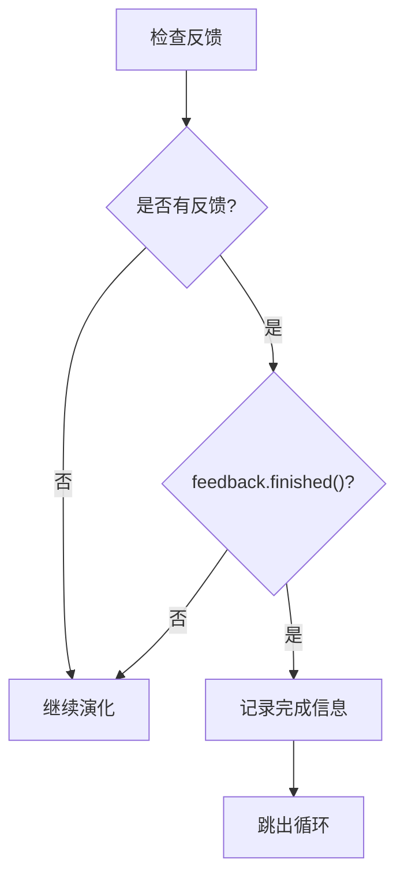
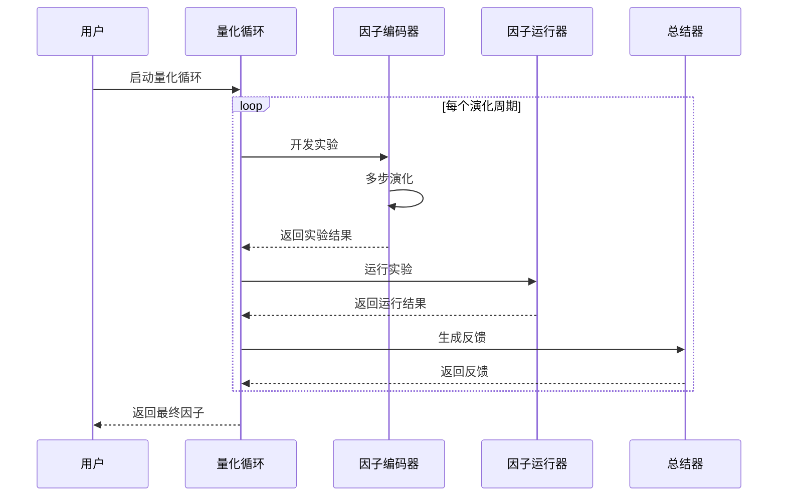
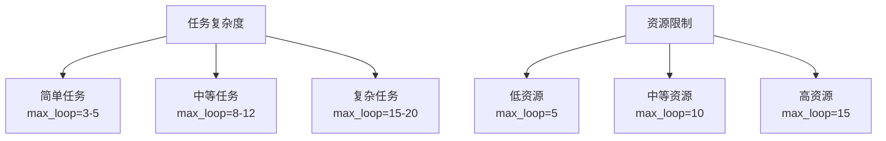
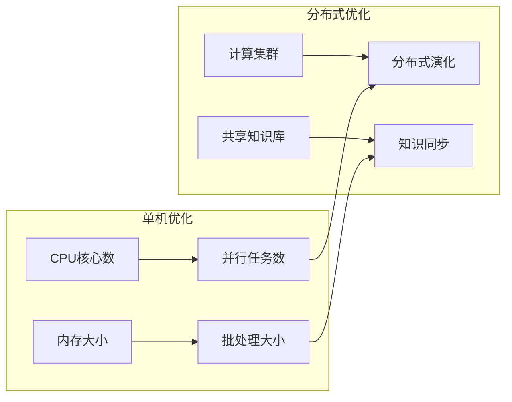

# 演化循环

<cite>
**本文档中引用的文件**
- [rdagent/core/evolving_agent.py](file://rdagent/core/evolving_agent.py)
- [rdagent/core/evolving_framework.py](file://rdagent/core/evolving_framework.py)
- [rdagent/components/workflow/rd_loop.py](file://rdagent/components/workflow/rd_loop.py)
- [rdagent/app/qlib_rd_loop/quant.py](file://rdagent/app/qlib_rd_loop/quant.py)
- [rdagent/app/CI/run.py](file://rdagent/app/CI/run.py)
- [rdagent/utils/workflow/loop.py](file://rdagent/utils/workflow/loop.py)
- [rdagent/components/coder/CoSTEER/__init__.py](file://rdagent/components/coder/CoSTEER/__init__.py)
- [rdagent/app/qlib_rd_loop/conf.py](file://rdagent/app/qlib_rd_loop/conf.py)
- [rdagent/core/developer.py](file://rdagent/core/developer.py)
- [rdagent/components/coder/CoSTEER/knowledge_management.py](file://rdagent/components/coder/CoSTEER/knowledge_management.py)
- [rdagent/components/coder/CoSTEER/evolving_strategy.py](file://rdagent/components/coder/CoSTEER/evolving_strategy.py)
</cite>

## 目录
1. [简介](#简介)
2. [系统架构概览](#系统架构概览)
3. [核心组件分析](#核心组件分析)
4. [EvoAgent.multistep_evolve方法详解](#evoagentmultistep_evolve方法详解)
5. [演化循环的执行流程](#演化循环的执行流程)
6. [终止条件与监控机制](#终止条件与监控机制)
7. [实际应用场景](#实际应用场景)
8. [性能优化建议](#性能优化建议)
9. [故障排除指南](#故障排除指南)
10. [总结](#总结)

## 简介

演化循环（Evolution Loop）是RD-Agent框架中的核心机制，它通过迭代式的演化过程实现智能体对复杂任务的持续改进。该循环协调了`evolve`（演化）、`feedback`（反馈）和`knowledge`（知识）三个核心阶段，形成一个闭环的学习和优化系统。

演化循环的设计理念基于以下核心原则：
- **迭代式改进**：通过多次迭代逐步提升解决方案的质量
- **知识驱动**：利用历史反馈和查询知识指导当前演化
- **自适应终止**：根据性能指标自动判断是否达到最优解
- **并行处理**：支持多任务并行演化以提高效率

## 系统架构概览

演化循环的整体架构采用分层设计，从底层到顶层包括：



**图表来源**
- [rdagent/utils/workflow/loop.py](file://rdagent/utils/workflow/loop.py#L80-L120)
- [rdagent/components/workflow/rd_loop.py](file://rdagent/components/workflow/rd_loop.py#L25-L45)
- [rdagent/core/evolving_agent.py](file://rdagent/core/evolving_agent.py#L18-L32)

## 核心组件分析

### EvoAgent基础类

EvoAgent是演化循环的核心抽象类，定义了演化代理的基本接口和行为模式。



**图表来源**
- [rdagent/core/evolving_agent.py](file://rdagent/core/evolving_agent.py#L18-L32)
- [rdagent/core/evolving_agent.py](file://rdagent/core/evolving_agent.py#L46-L80)
- [rdagent/core/evolving_framework.py](file://rdagent/core/evolving_framework.py#L40-L50)

### RAG知识检索系统

RAG（Retrieval-Augmented Generation）系统为演化过程提供智能知识支持：



**图表来源**
- [rdagent/core/evolving_agent.py](file://rdagent/core/evolving_agent.py#L69-L114)
- [rdagent/core/evolving_framework.py](file://rdagent/core/evolving_framework.py#L80-L127)

**章节来源**
- [rdagent/core/evolving_agent.py](file://rdagent/core/evolving_agent.py#L18-L114)
- [rdagent/core/evolving_framework.py](file://rdagent/core/evolving_framework.py#L59-L127)

### 演化框架核心抽象基类

#### EvolvingKnowledgeBase（演化知识库）

`EvolvingKnowledgeBase`是继承自`KnowledgeBase`的抽象基类，专门用于支持演化过程中的知识管理。它提供了知识查询、存储和检索功能。

**关键方法**：
- `query()`: 从知识库中查询相关知识
- `load_or_init_knowledge_base()`: 加载或初始化知识库
- `generate_knowledge()`: 基于演化轨迹生成新知识
- `dump_knowledge_base()`: 持久化知识库
- `load_dumped_knowledge_base()`: 加载持久化的知识库

该类为CoSTEER框架提供了版本化知识管理能力，支持V1和V2两个版本的知识库结构。

**章节来源**
- [rdagent/core/evolving_framework.py](file://rdagent/core/evolving_framework.py#L50-L68)

#### EvolvingStrategy（演化策略）

`EvolvingStrategy`是演化算法的核心接口抽象基类，所有具体的演化策略都需要继承此类。它负责根据历史反馈和查询知识来改进可进化对象。

**关键方法**：
- `evolve()`: 执行进化操作，接收当前演化对象、历史轨迹和查询知识作为输入，返回进化后的新对象
- `__init__(scen: Scenario)`: 初始化演化策略，接收场景实例作为上下文信息

该类通过泛型约束确保类型安全，是实现多进程并行任务执行和智能任务调度的基础。

**章节来源**
- [rdagent/core/evolving_framework.py](file://rdagent/core/evolving_framework.py#L116-L157)

#### RAGStrategy（检索增强生成策略）

`RAGStrategy`实现了检索增强生成（Retrieval-Augmented Generation）机制，结合知识检索和生成来改进演化策略的效果。

**关键方法**：
- `load_or_init_knowledge_base()`: 加载或初始化知识库
- `query(evo, evolving_trace)`: 根据当前状态和历史轨迹查询相关知识
- `generate_knowledge(evolving_trace)`: 基于演化轨迹生成新知识
- `dump_knowledge_base()`: 持久化知识库
- `load_dumped_knowledge_base()`: 加载持久化的知识库

该策略实现了知识的闭环管理，从查询到生成再到持久化，构成了完整的知识生命周期。

**章节来源**
- [rdagent/core/evolving_framework.py](file://rdagent/core/evolving_framework.py#L160-L264)

## EvoAgent.multistep_evolve方法详解

### 方法签名与参数

`multistep_evolve`方法是演化循环的核心入口，它接受演化对象和评估器作为输入，并返回一个生成器，允许调用者控制演化过程的进度。

### 内部执行流程

演化循环的内部执行遵循严格的三阶段模式：



**图表来源**
- [rdagent/core/evolving_agent.py](file://rdagent/core/evolving_agent.py#L69-L114)

### 关键阶段详解

#### 1. RAG知识检索阶段

在每个演化步骤开始时，系统会根据当前状态和历史轨迹查询相关知识：

- **知识查询**：使用RAG系统检索与当前演化状态相关的最佳实践和解决方案
- **上下文构建**：将查询到的知识与当前演化对象结合，形成丰富的上下文信息
- **知识过滤**：根据知识的相关性和质量进行筛选和排序

在CoSTEER框架中，`CoSTEERRAGStrategyV2`实现了复杂的知识查询逻辑，包括基于组件的查询、基于错误的查询和基于历史轨迹的查询。

**章节来源**
- [rdagent/components/coder/CoSTEER/knowledge_management.py](file://rdagent/components/coder/CoSTEER/knowledge_management.py#L404-L821)

#### 2. 演化执行阶段

演化策略负责根据当前状态和可用知识生成新的演化对象：

- **策略选择**：根据问题类型和演化目标选择合适的演化策略
- **知识整合**：将查询到的知识融入演化过程中
- **创新生成**：基于现有知识和约束条件生成新的解决方案

`MultiProcessEvolvingStrategy`是核心的演化策略实现，它通过以下步骤执行演化：
1. 识别需要实现的子任务
2. 复用已成功任务的实现
3. 并行执行待实现的任务
4. 更新进化主体

**章节来源**
- [rdagent/components/coder/CoSTEER/evolving_strategy.py](file://rdagent/components/coder/CoSTEER/evolving_strategy.py#L135-L235)

#### 3. 反馈评估阶段

系统对生成的演化对象进行评估和反馈：

- **多维度评估**：从功能正确性、性能指标、代码质量等多个维度进行评估
- **反馈聚合**：将多个评估器的反馈结果进行聚合和综合
- **决策制定**：基于评估结果决定是否继续演化或终止循环

**章节来源**
- [rdagent/core/evolving_agent.py](file://rdagent/core/evolving_agent.py#L69-L114)

## 演化循环的执行流程

### CoSTEER开发者中的应用

在CoSTEER开发者中，演化循环通过更复杂的控制逻辑实现：



**图表来源**
- [rdagent/components/coder/CoSTEER/__init__.py](file://rdagent/components/coder/CoSTEER/__init__.py#L107-L135)

### 量化研发循环中的应用

在量化研发循环中，演化循环被集成到更复杂的工作流中：



**图表来源**
- [rdagent/app/qlib_rd_loop/quant.py](file://rdagent/app/qlib_rd_loop/quant.py#L60-L90)

## 终止条件与监控机制

### 多层次终止条件

演化循环实现了多层次的终止条件检查：

#### 1. 迭代次数限制

基于`max_loop`参数控制最大迭代次数：

| 参数 | 类型 | 默认值 | 描述 |
|------|------|--------|------|
| max_loop | int | 10 | 最大演化迭代次数 |
| loop_n | Optional[int] | None | 剩余循环次数 |

#### 2. 性能达标条件

通过反馈系统的`finished()`方法判断是否达到预期性能：



**图表来源**
- [rdagent/core/evolving_agent.py](file://rdagent/core/evolving_agent.py#L105-L114)

#### 3. 时间限制监控

支持基于时间和全局定时器的超时控制：

| 监控类型 | 实现方式 | 配置参数 |
|----------|----------|----------|
| 单次演化超时 | datetime.now() - start_datetime | max_seconds |
| 全局定时器 | RD_Agent_TIMER_wrapper.timer | all_duration |
| 步骤计数 | step_n | step_n |

#### 4. 异常处理机制

系统提供了完善的异常处理和恢复机制：

- **跳过循环错误**：可配置的错误类型列表，允许跳过特定错误
- **回退机制**：当演化失败时自动回退到之前的最优状态
- **检查点保存**：定期保存演化状态以支持中断恢复

**章节来源**
- [rdagent/core/evolving_agent.py](file://rdagent/core/evolving_agent.py#L105-L114)
- [rdagent/utils/workflow/loop.py](file://rdagent/utils/workflow/loop.py#L150-L180)

## 实际应用场景

### 量化因子开发场景

在量化因子开发中，演化循环被用于自动化地生成和优化交易因子：



**图表来源**
- [rdagent/app/qlib_rd_loop/quant.py](file://rdagent/app/qlib_rd_loop/quant.py#L60-L90)

### 配置参数示例

量化循环的关键配置参数：

| 配置项 | 默认值 | 描述 |
|--------|--------|------|
| evolving_n | 10 | 演化迭代次数 |
| action_selection | "bandit" | 动作选择策略 |
| max_parallel | 4 | 并行执行数量 |

### 错误处理与恢复

系统提供了多种错误处理策略：

- **因子提取失败**：`FactorEmptyError`异常处理
- **模型训练失败**：`ModelEmptyError`异常处理  
- **演化超时**：自动回退到最优已知状态
- **全局超时**：停止所有正在进行的任务

**章节来源**
- [rdagent/app/qlib_rd_loop/quant.py](file://rdagent/app/qlib_rd_loop/quant.py#L25-L45)
- [rdagent/app/qlib_rd_loop/conf.py](file://rdagent/app/qlib_rd_loop/conf.py#L50-L70)

## 性能优化建议

### 调整迭代次数

根据具体任务复杂度和资源限制调整迭代次数：



### 反馈阈值优化

合理设置反馈评估的阈值可以显著影响演化效果：

| 评估维度 | 推荐阈值 | 说明 |
|----------|----------|------|
| 执行成功率 | > 0.8 | 任务执行成功的最低要求 |
| 性能提升率 | > 0.1 | 相比上一轮的最小提升 |
| 代码质量评分 | > 0.7 | 代码质量和可维护性评分 |

### 并行化策略

利用多核CPU和分布式计算资源：



### 知识库优化

- **知识更新频率**：平衡知识更新的及时性和系统稳定性
- **知识存储策略**：采用增量更新而非全量重建
- **缓存机制**：对频繁访问的知识进行缓存

### 监控指标

关键性能指标（KPI）监控：

| 指标类别 | 具体指标 | 目标值 |
|----------|----------|--------|
| 效率指标 | 每轮平均耗时 | < 30分钟 |
| 质量指标 | 最终成功率 | > 0.9 |
| 资源指标 | CPU利用率 | 60-80% |
| 成本指标 | 总计算成本 | 控制在预算内 |

## 故障排除指南

### 常见问题诊断

#### 1. 演化循环卡死

**症状**：循环无法正常推进，停留在某个步骤

**可能原因**：
- 知识库查询超时
- 演化策略执行异常
- 反馈评估器崩溃

**解决方法**：
- 检查网络连接和知识库服务
- 增加超时时间设置
- 启用调试日志查看详细错误信息

#### 2. 性能不提升

**症状**：多次迭代后性能没有改善

**可能原因**：
- 演化策略过于保守
- 知识库质量不高
- 反馈指标设置不合理

**解决方法**：
- 调整演化策略参数
- 清空并重新构建知识库
- 重新设计评估指标

#### 3. 内存泄漏

**症状**：长时间运行后内存占用持续增长

**可能原因**：
- 知识库累积过多数据
- 循环引用导致垃圾回收失败
- 大量中间结果未清理

**解决方法**：
- 定期清理无用知识条目
- 使用弱引用避免循环引用
- 实现定期内存清理机制

### 调试工具和技巧

#### 日志分析

启用详细日志记录：

```python
# 设置日志级别
import logging
logging.getLogger('rdagent').setLevel(logging.DEBUG)

# 分析演化轨迹
for idx, step in enumerate(evolve_agent.evolving_trace):
    print(f"Step {idx}: {step.evolvable_subjects}")
    if step.feedback:
        print(f"  Feedback: {step.feedback}")
```

#### 性能分析

使用性能分析工具识别瓶颈：

- **CPU分析**：使用cProfile分析函数调用时间
- **内存分析**：使用memory_profiler监控内存使用
- **并发分析**：使用asyncio的调试功能

#### 状态检查

定期检查系统状态：

```python
# 检查演化轨迹长度
print(f"Evolving trace length: {len(evolve_agent.evolving_trace)}")

# 检查知识库状态
if hasattr(evolve_agent, 'rag'):
    kb_status = evolve_agent.rag.knowledgebase.get_status()
    print(f"Knowledge base: {kb_status}")
```

**章节来源**
- [rdagent/core/evolving_agent.py](file://rdagent/core/evolving_agent.py#L105-L114)
- [rdagent/utils/workflow/loop.py](file://rdagent/utils/workflow/loop.py#L150-L180)

## 总结

演化循环作为RD-Agent框架的核心机制，通过精心设计的三阶段流程（evolve、feedback、knowledge）实现了智能化的迭代优化。其主要特点包括：

### 核心优势

1. **自适应学习**：通过知识检索和反馈机制实现持续学习
2. **灵活控制**：支持多种终止条件和监控策略
3. **可扩展性**：模块化设计便于添加新的演化策略和评估器
4. **容错能力**：完善的异常处理和恢复机制

### 应用价值

- **自动化程度高**：减少人工干预，提高研发效率
- **质量保证**：通过多轮迭代确保解决方案质量
- **知识积累**：系统化的知识管理和传承
- **成本控制**：合理的资源分配和使用优化

### 发展方向

未来演化循环可以在以下方面进一步发展：

1. **智能策略选择**：基于任务特征自动选择最优演化策略
2. **强化学习集成**：引入强化学习算法优化演化过程
3. **多模态知识融合**：整合文本、代码、图表等多种类型的知识
4. **实时协作**：支持多人协同的演化过程管理

演化循环的设计体现了现代AI系统中学习、推理和决策的有机结合，为复杂任务的自动化解决提供了强有力的支撑。随着技术的不断发展，这一机制将在更多领域发挥重要作用。