# 知识管理系统

<cite>
**本文档引用的文件**
- [knowledge_base.py](file://rdagent/core/knowledge_base.py)
- [graph.py](file://rdagent/components/knowledge_management/graph.py)
- [vector_base.py](file://rdagent/components/knowledge_management/vector_base.py)
- [extract_knowledge.py](file://rdagent/scenarios/kaggle/knowledge_management/extract_knowledge.py)
- [kaggle_graph.py](file://rdagent/scenarios/kaggle/knowledge_management/graph.py)
- [kaggle_vector_base.py](file://rdagent/scenarios/kaggle/knowledge_management/vector_base.py)
- [costeer_knowledge_management.py](file://rdagent/components/coder/CoSTEER/knowledge_management.py)
- [idea_pool.py](file://rdagent/scenarios/data_science/proposal/exp_gen/idea_pool.py)
- [prompts.yaml](file://rdagent/scenarios/kaggle/knowledge_management/prompts.yaml)
- [llm_utils.py](file://rdagent/oai/llm_utils.py)
</cite>

## 目录
1. [引言](#引言)
2. [系统架构概览](#系统架构概览)
3. [核心组件分析](#核心组件分析)
4. [知识存储机制](#知识存储机制)
5. [知识检索与查询](#知识检索与查询)
6. [知识提取与构建](#知识提取与构建)
7. [知识一致性与版本控制](#知识一致性与版本控制)
8. [扩展指南](#扩展指南)
9. [总结](#总结)

## 引言

RD-Agent的知识管理系统是一个复杂而精密的架构，旨在跨实验积累和利用历史经验。该系统通过结合图数据库（Graph）和向量数据库（VectorBase）两种存储方式，实现了知识的智能存储、检索和更新机制。系统能够处理实验、假设、代码片段等多种类型的知识，并通过语义相似性搜索支持新提案的生成。

## 系统架构概览

RD-Agent的知识管理系统采用分层架构设计，包含核心知识基类、多种知识存储实现和专门的应用场景模块。

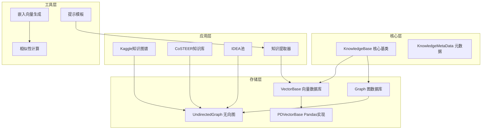

**图表来源**
- [knowledge_base.py](file://rdagent/core/knowledge_base.py#L1-L28)
- [vector_base.py](file://rdagent/components/knowledge_management/vector_base.py#L1-L50)
- [graph.py](file://rdagent/components/knowledge_management/graph.py#L1-L50)

**章节来源**
- [knowledge_base.py](file://rdagent/core/knowledge_base.py#L1-L28)
- [vector_base.py](file://rdagent/components/knowledge_management/vector_base.py#L1-L209)
- [graph.py](file://rdagent/components/knowledge_management/graph.py#L1-L498)

## 核心组件分析

### KnowledgeBase 基础类

KnowledgeBase是整个知识管理系统的基础抽象类，提供了知识持久化的基本功能。

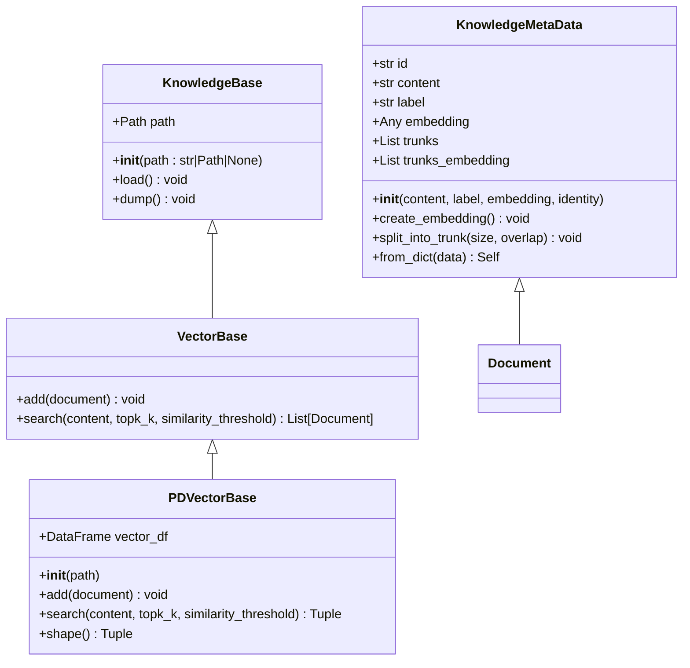

**图表来源**
- [knowledge_base.py](file://rdagent/core/knowledge_base.py#L8-L28)
- [vector_base.py](file://rdagent/components/knowledge_management/vector_base.py#L10-L83)

### 图数据库实现

图数据库通过UndirectedGraph类实现，支持节点间的双向连接和复杂的图遍历算法。

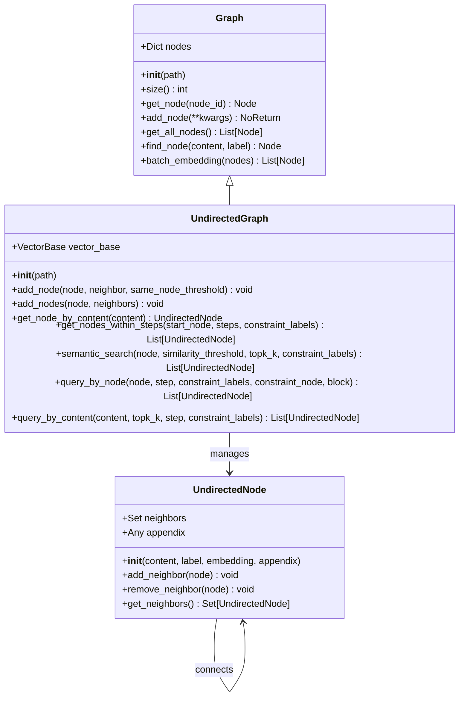

**图表来源**
- [graph.py](file://rdagent/components/knowledge_management/graph.py#L40-L150)
- [graph.py](file://rdagent/components/knowledge_management/graph.py#L150-L300)

**章节来源**
- [graph.py](file://rdagent/components/knowledge_management/graph.py#L40-L498)
- [vector_base.py](file://rdagent/components/knowledge_management/vector_base.py#L1-L209)

## 知识存储机制

### 向量数据库存储

向量数据库采用Pandas DataFrame作为底层存储，支持高效的向量相似性搜索。

#### 存储结构设计

| 字段名 | 类型 | 描述 | 必需性 |
|--------|------|------|--------|
| id | str | 文档唯一标识符 | 必需 |
| label | str | 文档标签分类 | 必需 |
| content | str | 文档原始内容 | 必需 |
| trunk | str | 分块后的文本内容 | 可选 |
| embedding | ndarray | 向量嵌入表示 | 必需 |

#### 嵌入生成流程

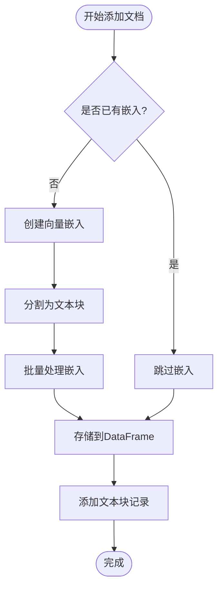

**图表来源**
- [vector_base.py](file://rdagent/components/knowledge_management/vector_base.py#L110-L150)

### 图数据库存储

图数据库通过节点和边的关系网络存储知识，支持复杂的语义关联。

#### 节点类型定义

| 节点类型 | 标签 | 用途 | 示例 |
|----------|------|------|------|
| 实验节点 | "experiment" | 记录具体实验 | "XGBoost参数调优" |
| 假设节点 | "hypothesis" | 表达研究假设 | "特征工程改进" |
| 代码节点 | "code" | 存储代码片段 | "数据预处理脚本" |
| 结论节点 | "conclusion" | 总结实验结果 | "模型性能提升" |
| 竞赛节点 | "competition" | 关联竞赛信息 | "Kaggle房价预测" |

#### 边关系定义

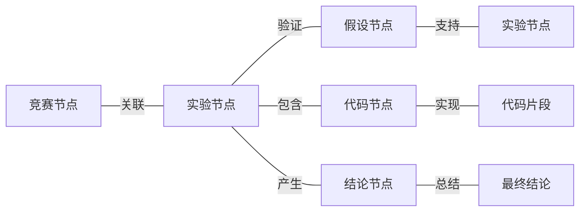

**图表来源**
- [kaggle_graph.py](file://rdagent/scenarios/kaggle/knowledge_management/graph.py#L60-L100)

**章节来源**
- [vector_base.py](file://rdagent/components/knowledge_management/vector_base.py#L110-L209)
- [graph.py](file://rdagent/components/knowledge_management/graph.py#L150-L300)

## 知识检索与查询

### 向量相似性搜索

系统使用余弦相似度进行语义相似性搜索，支持多种查询策略。

#### 搜索算法流程

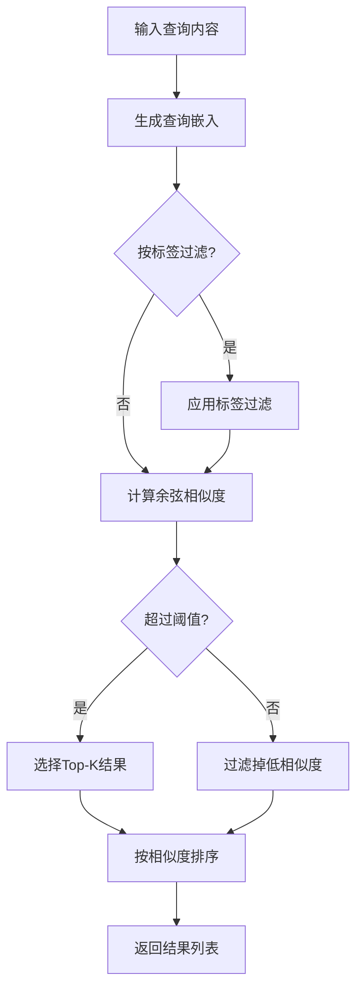

**图表来源**
- [vector_base.py](file://rdagent/components/knowledge_management/vector_base.py#L166-L207)

### 图遍历查询

图数据库支持基于语义距离的多步查询和交集查询。

#### 查询策略对比

| 查询类型 | 适用场景 | 时间复杂度 | 特点 |
|----------|----------|------------|------|
| 单步查询 | 直接关联查找 | O(1) | 快速定位直接相关知识 |
| 多步查询 | 探索间接关联 | O(V+E) | 发现潜在的知识联系 |
| 交集查询 | 寻找共同特征 | O(min(V₁,V₂)) | 找到多个条件的共同解 |
| 语义搜索 | 相似内容查找 | O(N×D) | 基于向量相似度匹配 |

#### 高级查询功能

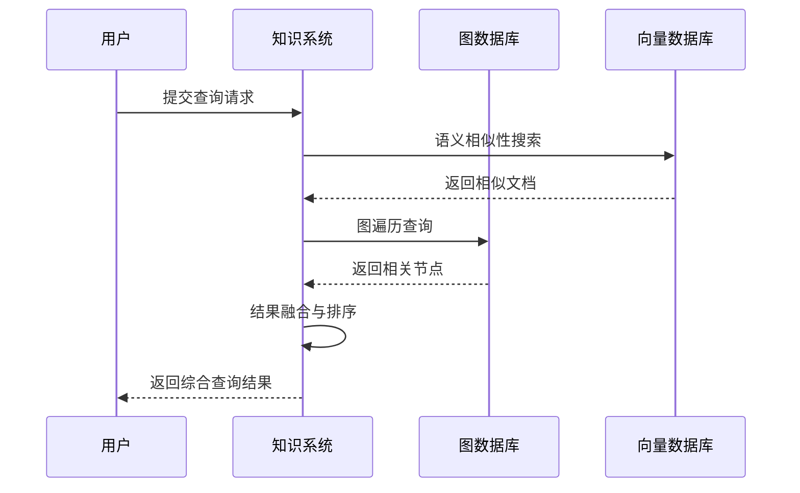

**图表来源**
- [graph.py](file://rdagent/components/knowledge_management/graph.py#L300-L400)

**章节来源**
- [vector_base.py](file://rdagent/components/knowledge_management/vector_base.py#L166-L209)
- [graph.py](file://rdagent/components/knowledge_management/graph.py#L300-L498)

## 知识提取与构建

### Kaggle竞赛知识提取

系统通过LLM自动从高分竞赛笔记中提取结构化知识。

#### 知识提取流程

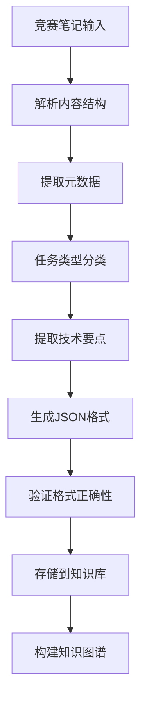

**图表来源**
- [extract_knowledge.py](file://rdagent/scenarios/kaggle/knowledge_management/extract_knowledge.py#L10-L30)

#### 提取模板结构

系统使用预定义的提示模板从非结构化文本中提取关键信息：

| 提取字段 | 模板类型 | 示例输出 |
|----------|----------|----------|
| 竞赛名称 | 系统提示 | "House Prices: Advanced Regression Techniques" |
| 任务类型 | 系统提示 | "Regression" |
| 技术领域 | 系统提示 | "Feature Engineering" |
| 排名信息 | 用户提示 | "Top 10%" |
| 关键指标 | 用户提示 | "RMSE: 0.1234" |

### CoSTEER知识管理

CoSTEER系统实现了演化的知识管理策略，支持失败追踪和成功知识的累积。

#### 知识生成流程

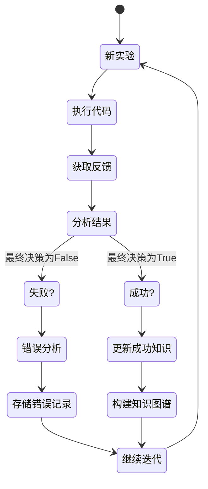

**图表来源**
- [costeer_knowledge_management.py](file://rdagent/components/coder/CoSTEER/knowledge_management.py#L280-L320)

**章节来源**
- [extract_knowledge.py](file://rdagent/scenarios/kaggle/knowledge_management/extract_knowledge.py#L1-L65)
- [kaggle_graph.py](file://rdagent/scenarios/kaggle/knowledge_management/graph.py#L1-L116)
- [costeer_knowledge_management.py](file://rdagent/components/coder/CoSTEER/knowledge_management.py#L280-L400)

## 知识一致性与版本控制

### 知识过期管理

系统实现了基于时间戳和使用频率的知识过期机制。

#### 过期策略

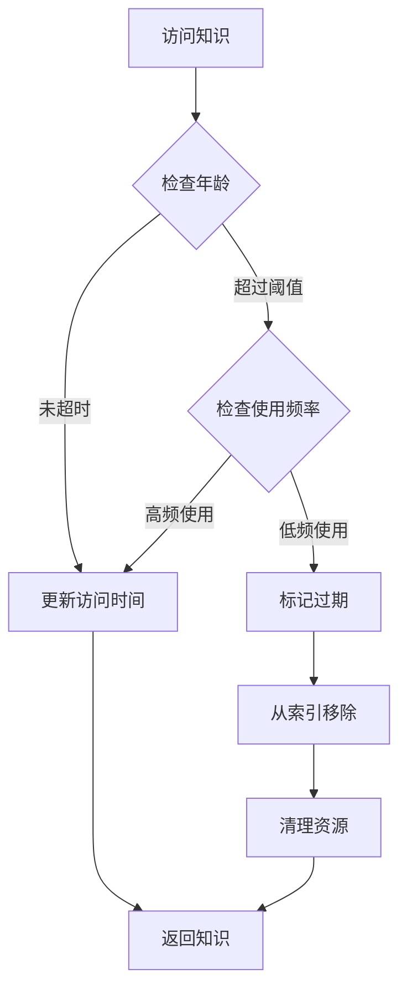

### 版本控制机制

系统通过以下机制确保知识的一致性：

1. **嵌入向量版本化**：每次知识更新都会重新生成嵌入向量
2. **图结构验证**：定期验证节点间的连接关系
3. **冲突检测**：识别和解决同名知识的冲突
4. **增量更新**：支持知识的增量式更新而非全量替换

#### 一致性保证流程

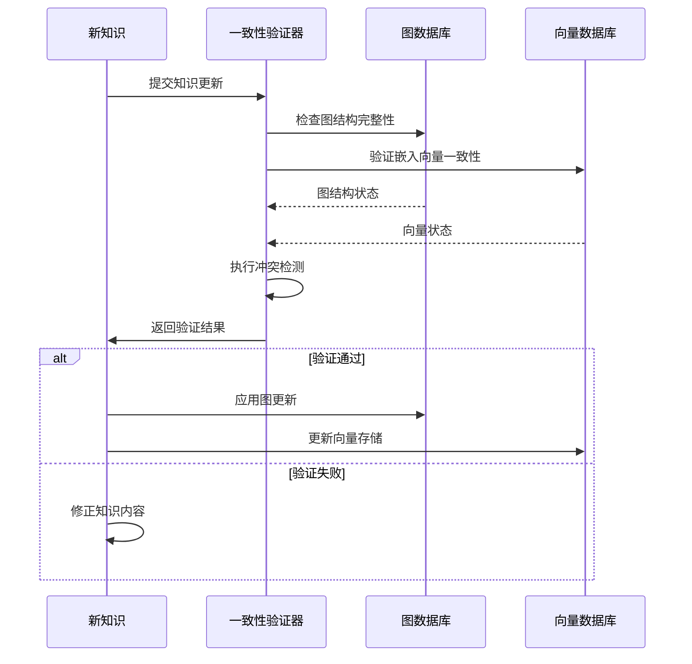

**章节来源**
- [knowledge_base.py](file://rdagent/core/knowledge_base.py#L15-L28)
- [graph.py](file://rdagent/components/knowledge_management/graph.py#L200-L250)

## 扩展指南

### 自定义知识类型

开发者可以通过继承基础类来扩展新的知识类型：

#### 创建自定义知识类型

```python
# 示例：创建领域特定的知识类型
class DomainSpecificKnowledge(KnowledgeMetaData):
    def __init__(self, content, label, domain, expertise_level):
        super().__init__(content, label)
        self.domain = domain
        self.expertise_level = expertise_level
        self.related_concepts = []
    
    def add_related_concept(self, concept):
        if concept not in self.related_concepts:
            self.related_concepts.append(concept)
```

#### 注册新知识类型

```python
# 在知识库中注册新的知识类型
class ExtendedKnowledgeBase(UndirectedGraph):
    def __init__(self, path=None):
        super().__init__(path)
        self.register_knowledge_type("domain_specific", DomainSpecificKnowledge)
    
    def add_domain_knowledge(self, content, domain, expertise_level):
        knowledge = DomainSpecificKnowledge(
            content=content,
            label="domain_specific",
            domain=domain,
            expertise_level=expertise_level
        )
        self.add_node(knowledge)
```

### 检索策略实现

#### 自定义相似性度量

```python
# 实现自定义的相似性计算方法
def custom_similarity(node1, node2):
    # 结合语义相似性和结构相似性
    semantic_sim = cosine(node1.embedding, node2.embedding)
    structural_sim = calculate_structural_similarity(node1, node2)
    
    # 加权组合
    return 0.7 * semantic_sim + 0.3 * structural_sim
```

#### 多模态检索策略

```python
# 实现多模态知识检索
class MultimodalRetrieval:
    def __init__(self, text_retriever, code_retriever, graph_retriever):
        self.text_retriever = text_retriever
        self.code_retriever = code_retriever
        self.graph_retriever = graph_retriever
    
    def retrieve(self, query, modalities=["text", "code", "graph"], top_k=5):
        results = {}
        
        if "text" in modalities:
            results["text"] = self.text_retriever.search(query, top_k)
        
        if "code" in modalities:
            results["code"] = self.code_retriever.search(query, top_k)
        
        if "graph" in modalities:
            results["graph"] = self.graph_retriever.query_by_content(query, top_k)
        
        return self.fuse_results(results)
```

### 性能优化建议

#### 索引优化

1. **分层索引**：为不同类型的查询建立专门的索引
2. **缓存策略**：缓存频繁查询的结果
3. **批处理**：对大量数据操作使用批处理模式

#### 内存管理

```python
# 实现内存友好的知识加载
class MemoryEfficientKnowledgeBase(UndirectedGraph):
    def __init__(self, path=None, memory_limit_mb=1024):
        super().__init__(path)
        self.memory_limit = memory_limit_mb * 1024 * 1024
        self.loaded_nodes = {}
    
    def load_node(self, node_id):
        if node_id not in self.loaded_nodes:
            node = self.get_node(node_id)
            if self.get_memory_usage() > self.memory_limit:
                self.evict_least_used()
            self.loaded_nodes[node_id] = node
        return self.loaded_nodes[node_id]
```

**章节来源**
- [graph.py](file://rdagent/components/knowledge_management/graph.py#L150-L200)
- [vector_base.py](file://rdagent/components/knowledge_management/vector_base.py#L110-L150)

## 总结

RD-Agent的知识管理系统展现了现代AI系统中知识管理的最佳实践。通过图数据库和向量数据库的有机结合，系统实现了：

1. **多维度知识存储**：支持结构化和非结构化知识的统一管理
2. **智能知识检索**：基于语义相似性的高效查询机制
3. **自动化知识构建**：通过LLM自动提取和组织知识
4. **演化式学习**：持续积累和优化实验经验
5. **灵活的扩展性**：支持自定义知识类型和检索策略

该系统为AI Agent提供了强大的知识基础设施，使其能够在复杂的科学计算和数据分析任务中做出更明智的决策。随着技术的不断发展，这套知识管理系统将继续演进，为更高级的AI应用提供支持。