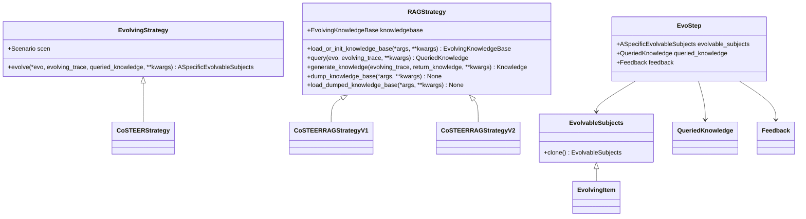

# 进化代理系统

<cite>
**本文档引用的文件**
- [evolving_agent.py](file://rdagent/core/evolving_agent.py)
- [evolving_framework.py](file://rdagent/core/evolving_framework.py)
- [scenario.py](file://rdagent/core/scenario.py)
- [experiment.py](file://rdagent/core/experiment.py)
- [proposal.py](file://rdagent/core/proposal.py)
- [developer.py](file://rdagent/core/developer.py)
- [knowledge_base.py](file://rdagent/core/knowledge_base.py)
- [CoSTEER/__init__.py](file://rdagent/components/coder/CoSTEER/__init__.py)
- [CoSTEER/evolvable_subjects.py](file://rdagent/components/coder/CoSTEER/evolvable_subjects.py)
- [CoSTEER/evolving_strategy.py](file://rdagent/components/coder/CoSTEER/evolving_strategy.py)
- [CoSTEER/knowledge_management.py](file://rdagent/components/coder/CoSTEER/knowledge_management.py)
</cite>

## 目录
1. [引言](#引言)
2. [进化代理系统架构](#进化代理系统架构)
3. [核心组件分析](#核心组件分析)
4. [EvolvingFramework协调机制](#evolvingframework协调机制)
5. [EvolvingItem抽象类设计](#evolvingitem抽象类设计)
6. [开发者角色职责](#开发者角色职责)
7. [状态管理与生命周期](#状态管理与生命周期)
8. [异常处理与超时控制](#异常处理与超时控制)
9. [继承扩展示例](#继承扩展示例)
10. [结论](#结论)

## 引言
RD-Agent的进化代理系统（EvolvingAgent）是一个复杂的自动化研发框架，旨在通过R&D双循环实现自动化迭代流程。该系统通过协调Scenario、Experiment、Proposal、Coder和Runner等组件，实现了从问题提出到解决方案生成的完整闭环。本文档将深入解析该系统的架构与实现机制，详细阐述其状态管理、任务调度和生命周期控制等核心功能。

## 进化代理系统架构


**图源**
- [evolving_agent.py](file://rdagent/core/evolving_agent.py#L1-L115)
- [evolving_framework.py](file://rdagent/core/evolving_framework.py#L1-L127)

**本节来源**
- [evolving_agent.py](file://rdagent/core/evolving_agent.py#L1-L115)
- [evolving_framework.py](file://rdagent/core/evolving_framework.py#L1-L127)

## 核心组件分析

### 进化代理（EvolvingAgent）
EvolvingAgent是整个系统的核心控制器，负责驱动R&D双循环的自动化迭代流程。它通过RAGEvoAgent类实现，继承自抽象基类EvoAgent，采用生成器模式（Generator）来yield EvolvableSubjects，便于流程控制和日志记录。


**图源**
- [evolving_agent.py](file://rdagent/core/evolving_agent.py#L1-L115)

**本节来源**
- [evolving_agent.py](file://rdagent/core/evolving_agent.py#L1-L115)

### 进化框架（EvolvingFramework）
EvolvingFramework是系统的核心框架，定义了进化过程的基本结构和组件。它包含EvolvingStrategy（进化策略）和RAGStrategy（检索增强生成策略）两个关键抽象类，为具体的进化实现提供了统一的接口。



**图源**
- [evolving_framework.py](file://rdagent/core/evolving_framework.py#L1-L127)

**本节来源**
- [evolving_framework.py](file://rdagent/core/evolving_framework.py#L1-L127)

## EvolvingFramework协调机制
EvolvingFramework通过协调Scenario、Experiment、Proposal、Coder和Runner组件的协作，实现了完整的研发自动化流程。其核心机制如下：

1. **场景管理**：Scenario类定义了研发场景的背景信息、数据描述和运行环境，为整个研发过程提供了上下文。

2. **实验管理**：Experiment类代表一个实验，包含多个子任务（sub_tasks）和对应的工作空间（sub_workspace_list），是研发过程的基本单元。

3. **提案生成**：Proposal组件通过ExpGen（实验生成器）、HypothesisGen（假设生成器）和Hypothesis2Experiment（假设到实验转换器）三个子组件，实现了从抽象想法到具体实现的转换。

4. **代码开发**：Developer组件负责代码生成，通过develop方法对实验进行开发，生成具体的代码实现。

5. **执行验证**：Runner组件负责执行生成的代码，并通过Evaluation组件对结果进行评估，形成反馈闭环。


**图源**
- [evolving_framework.py](file://rdagent/core/evolving_framework.py#L1-L127)
- [scenario.py](file://rdagent/core/scenario.py#L1-L64)
- [experiment.py](file://rdagent/core/experiment.py#L1-L482)
- [proposal.py](file://rdagent/core/proposal.py#L1-L389)
- [developer.py](file://rdagent/core/developer.py#L1-L34)

**本节来源**
- [evolving_framework.py](file://rdagent/core/evolving_framework.py#L1-L127)
- [scenario.py](file://rdagent/core/scenario.py#L1-L64)
- [experiment.py](file://rdagent/core/experiment.py#L1-L482)
- [proposal.py](file://rdagent/core/proposal.py#L1-L389)

## EvolvingItem抽象类设计
EvolvingItem是EvolvableSubjects的具体实现，作为因子实现的中间项，它继承了Experiment和EvolvableSubjects两个基类，将实验管理和进化能力结合起来。


**图源**
- [CoSTEER/evolvable_subjects.py](file://rdagent/components/coder/CoSTEER/evolvable_subjects.py#L1-L31)

**本节来源**
- [CoSTEER/evolvable_subjects.py](file://rdagent/components/coder/CoSTEER/evolvable_subjects.py#L1-L31)

### 具体实现类型
EvolvingItem在不同场景下有多种具体实现：

1. **ModelEvolvingItem**：用于模型研发场景，专注于模型架构和参数的进化。

2. **FeatureEvolvingItem**：用于特征工程场景，专注于特征选择和特征构造的进化。

3. **FactorEvolvingItem**：用于因子研发场景，专注于量化因子的生成和优化。

这些具体实现通过继承EvolvingItem基类，并根据特定场景的需求进行定制化扩展，实现了不同研发领域的专业化处理。

## 开发者角色职责
Developer是系统中的关键角色，负责代码生成与执行。它是一个泛型抽象基类，通过develop方法对实验进行开发，生成具体的代码实现。


**图源**
- [developer.py](file://rdagent/core/developer.py#L1-L34)
- [CoSTEER/__init__.py](file://rdagent/components/coder/CoSTEER/__init__.py#L1-L176)

**本节来源**
- [developer.py](file://rdagent/core/developer.py#L1-L34)
- [CoSTEER/__init__.py](file://rdagent/components/coder/CoSTEER/__init__.py#L1-L176)

### 职责划分
Developer的主要职责包括：

1. **代码生成**：根据实验需求生成具体的代码实现，包括模型架构、特征工程、数据处理等。

2. **知识管理**：利用RAG（检索增强生成）技术，从知识库中检索相关信息，辅助代码生成过程。

3. **迭代优化**：通过多轮进化策略，不断优化生成的代码，提高代码质量和性能。

4. **反馈处理**：接收评估组件的反馈，根据反馈结果调整代码生成策略。

5. **超时控制**：监控代码生成过程的执行时间，防止无限循环或长时间运行。

## 状态管理与生命周期


**图源**
- [evolving_agent.py](file://rdagent/core/evolving_agent.py#L1-L115)

**本节来源**
- [evolving_agent.py](file://rdagent/core/evolving_agent.py#L1-L115)

### 生命周期控制
EvolvingAgent的生命周期通过multistep_evolve方法实现，主要包括以下步骤：

1. **初始化**：设置最大循环次数和进化策略，初始化进化轨迹。

2. **知识检索**：根据当前状态和历史轨迹，从知识库中检索相关信息。

3. **代码进化**：应用进化策略，生成新的代码实现。

4. **代码评估**：执行新生成的代码，评估其性能和质量。

5. **状态更新**：将进化结果和评估反馈记录到进化轨迹中。

6. **知识更新**：根据新的进化结果，更新知识库中的知识。

7. **循环检查**：检查是否达到终止条件，决定是否继续下一轮进化。

## 异常处理与超时控制
系统通过多层次的异常处理和超时控制机制，确保研发过程的稳定性和可靠性。

### 异常处理机制
系统定义了多种异常类型，包括CoderError、FeedbackException等，通过统一的异常处理框架进行管理。


**图源**
- [CoSTEER/__init__.py](file://rdagent/components/coder/CoSTEER/__init__.py#L1-L176)
- [loop.py](file://rdagent/scenarios/data_science/loop.py#L1-L239)

**本节来源**
- [CoSTEER/__init__.py](file://rdagent/components/coder/CoSTEER/__init__.py#L1-L176)
- [loop.py](file://rdagent/scenarios/data_science/loop.py#L1-L239)

### 超时控制策略
系统通过全局定时器和局部超时控制相结合的方式，实现精细化的超时管理。

1. **全局定时器**：RD_Agent_TIMER_wrapper提供全局时间管理，监控整个研发过程的执行时间。

2. **局部超时**：不同组件可以根据需要设置局部超时，如代码生成超时、执行超时等。

3. **动态调整**：系统可以根据执行情况动态调整超时阈值，如在超时后增加时间限制。

4. **分阶段控制**：不同研发阶段可以设置不同的超时策略，如探索阶段允许更长的超时。

## 继承扩展示例
以下是一个简单的继承扩展示例，展示了如何定制自己的进化代理行为：

```python
from rdagent.core.developer import Developer
from rdagent.core.evolving_framework import EvolvingStrategy
from rdagent.core.experiment import Experiment

class CustomEvolvingStrategy(EvolvingStrategy):
    def evolve(self, evo, evolving_trace=None, queried_knowledge=None, **kwargs):
        # 自定义进化逻辑
        pass

class CustomDeveloper(Developer):
    def __init__(self, scen):
        super().__init__(scen)
        self.evolving_strategy = CustomEvolvingStrategy(scen)
    
    def develop(self, exp):
        # 自定义开发逻辑
        pass
```

**本节来源**
- [developer.py](file://rdagent/core/developer.py#L1-L34)
- [evolving_framework.py](file://rdagent/core/evolving_framework.py#L1-L127)

## 结论
RD-Agent的进化代理系统通过精心设计的架构和组件，实现了高效的自动化研发流程。系统通过EvolvingAgent驱动R&D双循环，利用EvolvingFramework协调各组件的协作，通过EvolvingItem抽象类实现不同场景的定制化处理。开发者角色在代码生成与执行中扮演关键角色，系统通过完善的状态管理、异常处理和超时控制机制，确保了研发过程的稳定性和可靠性。该系统为自动化研发提供了强大的基础框架，具有很高的扩展性和灵活性。