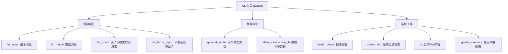
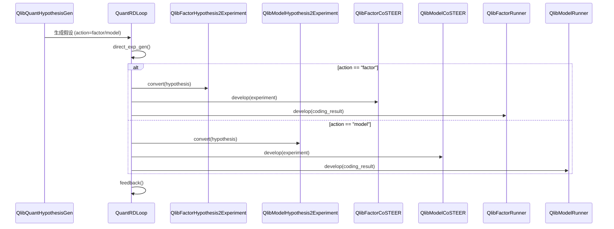

# CLI接口

<cite>
**本文档中引用的文件**  
- [cli.py](file://rdagent/app/cli.py)
- [factor.py](file://rdagent/app/qlib_rd_loop/factor.py)
- [model.py](file://rdagent/app/qlib_rd_loop/model.py)
- [quant.py](file://rdagent/app/qlib_rd_loop/quant.py)
- [general_model.py](file://rdagent/app/general_model/general_model.py)
- [loop.py](file://rdagent/app/data_science/loop.py)
- [factor_from_report.py](file://rdagent/app/qlib_rd_loop/factor_from_report.py)
- [health_check.py](file://rdagent/app/utils/health_check.py)
- [info.py](file://rdagent/app/utils/info.py)
- [mle_summary.py](file://rdagent/log/mle_summary.py)
- [conf.py](file://rdagent/app/qlib_rd_loop/conf.py)
- [conf.py](file://rdagent/app/data_science/conf.py)
</cite>

## 目录
1. [简介](#简介)
2. [命令组织结构](#命令组织结构)
3. [顶级命令详解](#顶级命令详解)
   - [fin_factor](#fin_factor)
   - [fin_model](#fin_model)
   - [fin_quant](#fin_quant)
   - [fin_factor_report](#fin_factor_report)
   - [general_model](#general_model)
   - [data_science](#data_science)
   - [health_check](#health_check)
   - [其他工具命令](#其他工具命令)
4. [调用逻辑与底层机制](#调用逻辑与底层机制)
5. [实际使用示例](#实际使用示例)
6. [总结](#总结)

## 简介
RD-Agent提供了一个基于`typer`库构建的命令行接口（CLI），作为所有功能的统一入口。该CLI允许用户通过简单的命令调用，控制自动化研发代理在不同场景下的行为，包括金融因子演化、模型研发、量化交易联合演化、Kaggle竞赛解决方案生成等。本文档详细解析`rdagent/app/cli.py`中的CLI接口，涵盖所有顶级命令、参数说明、使用示例及其底层触发的场景（Scenario）和演化代理（EvoAgent）。

## 命令组织结构
CLI的命令组织清晰，每个顶级命令对应一个特定的应用场景或功能模块。命令通过`typer.Typer`注册，其核心功能实现在`rdagent/app/`目录下的独立模块中。主要命令可分为三类：
1.  **金融量化类**：`fin_factor`, `fin_model`, `fin_quant`, `fin_factor_report`
2.  **通用模型与数据科学类**：`general_model`, `data_science`
3.  **系统工具类**：`health_check`, `collect_info`, `ui`, `grade_summary`



**Diagram sources**
- [cli.py](file://rdagent/app/cli.py#L1-L87)

## 顶级命令详解

### fin_factor
此命令启动一个自动化研发循环，专注于金融因子的迭代演化。

**参数说明**：
- `path` (可选, `str`): 会话路径。用于从指定的检查点恢复运行。
- `step_n` (可选, `int`): 运行的步数。如果未指定，则无限运行直到出错或被中断。
- `loop_n` (可选, `int`): 运行的循环次数。
- `all_duration` (可选, `str`): 运行的总时长（如 "2h" 表示2小时）。
- `checkout` (可选, `bool`): 默认为 `True`。控制日志会话路径的行为。
- `checkout_path` (可选, `str`): 指定新的检查点路径。

**默认值**：`checkout=True`

**使用示例**：
```bash
# 启动全新的因子演化循环
rdagent fin_factor

# 从指定路径恢复并运行1个步骤
rdagent fin_factor $LOG_PATH/__session__/1/0_propose --step_n 1
```

**底层机制**：
- **触发场景 (Scenario)**: `QlibFactorScenario` (由 `FACTOR_PROP_SETTING.scen` 定义)
- **演化代理 (EvoAgent)**: `FactorRDLoop` 类，继承自 `RDLoop`，实现了完整的研发循环（提出、编码、运行、反馈）。
- **核心组件**:
  - `hypothesis_gen`: `QlibFactorHypothesisGen`，负责生成因子假设。
  - `hypothesis2experiment`: `QlibFactorHypothesis2Experiment`，将假设转化为可执行的实验。
  - `coder`: `QlibFactorCoSTEER`，负责生成因子代码。
  - `runner`: `QlibFactorRunner`，负责执行因子代码并计算因子值。
  - `summarizer`: `QlibFactorExperiment2Feedback`，负责分析运行结果并生成反馈。

**Section sources**
- [factor.py](file://rdagent/app/qlib_rd_loop/factor.py#L1-L61)
- [conf.py](file://rdagent/app/qlib_rd_loop/conf.py#L30-L43)

### fin_model
此命令启动一个自动化研发循环，专注于金融模型的迭代演化。

**参数说明**：
- `path` (可选, `str`): 会话路径。用于从指定的检查点恢复运行。
- `step_n` (可选, `int`): 运行的步数。
- `loop_n` (可选, `int`): 运行的循环次数。
- `all_duration` (可选, `str`): 运行的总时长。
- `checkout` (可选, `bool`): 默认为 `True`。

**默认值**：`checkout=True`

**使用示例**：
```bash
# 启动全新的模型演化循环
rdagent fin_model

# 从指定路径恢复
rdagent fin_model $LOG_PATH/__session__/1/0_propose
```

**底层机制**：
- **触发场景 (Scenario)**: `QlibModelScenario` (由 `MODEL_PROP_SETTING.scen` 定义)
- **演化代理 (EvoAgent)**: `ModelRDLoop` 类。
- **核心组件**:
  - `hypothesis_gen`: `QlibModelHypothesisGen`
  - `hypothesis2experiment`: `QlibModelHypothesis2Experiment`
  - `coder`: `QlibModelCoSTEER`
  - `runner`: `QlibModelRunner`
  - `summarizer`: `QlibModelExperiment2Feedback`

**Section sources**
- [model.py](file://rdagent/app/qlib_rd_loop/model.py#L1-L44)
- [conf.py](file://rdagent/app/qlib_rd_loop/conf.py#L15-L28)

### fin_quant
此命令启动一个更高级的自动化研发循环，同时演化金融因子和模型，并通过一个联合决策机制来选择下一步是优化因子还是模型。

**参数说明**：
- `path` (可选, `str`): 会话路径。
- `step_n` (可选, `int`): 运行的步数。
- `loop_n` (可选, `int`): 运行的循环次数。
- `all_duration` (可选, `str`): 运行的总时长。
- `checkout` (可选, `bool`): 默认为 `True`。

**默认值**：`checkout=True`

**使用示例**：
```bash
# 启动因子与模型联合演化循环
rdagent fin_quant
```

**底层机制**：
- **触发场景 (Scenario)**: `QlibQuantScenario` (由 `QUANT_PROP_SETTING.scen` 定义)
- **演化代理 (EvoAgent)**: `QuantRDLoop` 类。这是最复杂的循环，它内部管理两个独立的演化路径（因子和模型）。
- **调用逻辑**:
  1.  **提出 (Propose)**: `QlibQuantHypothesisGen` 生成一个假设，其 `action` 字段为 `"factor"` 或 `"model"`。
  2.  **实验生成 (Exp Gen)**: 根据 `action`，调用对应的 `hypothesis2experiment` 组件（`QlibFactorHypothesis2Experiment` 或 `QlibModelHypothesis2Experiment`）。
  3.  **编码 (Coding)**: 调用对应的 `coder` 组件（`QlibFactorCoSTEER` 或 `QlibModelCoSTEER`）。
  4.  **运行 (Running)**: 调用对应的 `runner` 组件（`QlibFactorRunner` 或 `QlibModelRunner`）。
  5.  **反馈 (Feedback)**: 调用对应的 `summarizer` 组件（`QlibFactorExperiment2Feedback` 或 `QlibModelExperiment2Feedback`）生成反馈，用于指导下一个假设。
- **决策机制**: 由 `action_selection` 参数（在 `QUANT_PROP_SETTING` 中定义）控制，支持 "bandit"（多臂老虎机）、"llm"（大语言模型）或 "random"（随机）策略。



**Diagram sources**
- [quant.py](file://rdagent/app/qlib_rd_loop/quant.py#L1-L144)
- [conf.py](file://rdagent/app/qlib_rd_loop/conf.py#L75-L120)

**Section sources**
- [quant.py](file://rdagent/app/qlib_rd_loop/quant.py#L1-L144)

### fin_factor_report
此命令专门用于从金融研究报告（PDF文件）中提取因子并进行实现。

**参数说明**：
- `report_folder` (可选, `str`): 包含PDF报告文件的文件夹路径。如果未提供，则从配置文件 `report_result_json_file_path` 指定的JSON文件中读取报告列表。
- `path` (可选, `str`): 会话路径。
- `all_duration` (可选, `str`): 运行的总时长。
- `checkout` (可选, `bool`): 默认为 `True`。

**默认值**：`checkout=True`

**使用示例**：
```bash
# 处理指定文件夹中的所有报告
rdagent fin_factor_report --report-folder ./my_reports/

# 使用预定义的报告列表（从配置文件读取）
rdagent fin_factor_report
```

**底层机制**：
- **触发场景 (Scenario)**: `QlibFactorFromReportScenario` (由 `FACTOR_FROM_REPORT_PROP_SETTING.scen` 定义)
- **演化代理 (EvoAgent)**: `FactorReportLoop` 类，继承自 `FactorRDLoop`。
- **核心流程**:
  1.  **加载报告**: 使用 `FactorExperimentLoaderFromPDFfiles` 和 `langchain` 加载并解析PDF内容。
  2.  **提取实验**: 从报告中提取因子的描述、公式等信息，构建 `QlibFactorExperiment` 对象。
  3.  **生成假设**: 结合提取的因子结果和报告全文，由LLM生成一个更宏观的假设（`generate_hypothesis` 函数）。
  4.  **后续流程**: 与 `fin_factor` 相同，进入编码、运行、反馈的循环。

**Section sources**
- [factor_from_report.py](file://rdagent/app/qlib_rd_loop/factor_from_report.py#L1-L178)
- [conf.py](file://rdagent/app/qlib_rd_loop/conf.py#L45-L73)

### general_model
此命令作为一个研究助手，能够从一篇学术论文（PDF）中自动实现所提出的模型。

**参数说明**：
- `report_file_path` (**必需**, `str`): 目标PDF论文文件的URL或本地路径。

**使用示例**：
```bash
# 从arXiv论文实现模型
rdagent general_model "https://arxiv.org/pdf/2210.09789"

# 从本地PDF文件实现模型
rdagent general_model ./my_paper.pdf
```

**底层机制**：
- **触发场景 (Scenario)**: `GeneralModelScenario`
- **核心流程**:
  1.  **加载论文**: 使用 `ModelExperimentLoaderFromPDFfiles` 解析PDF。
  2.  **生成实验**: 从论文中提取模型架构、算法等信息。
  3.  **实现模型**: 使用 `QlibModelCoSTEER` 作为开发者，根据提取的信息生成可运行的代码。

**Section sources**
- [general_model.py](file://rdagent/app/general_model/general_model.py#L1-L46)

### data_science
此命令是处理数据科学竞赛（如Kaggle）的通用入口。

**参数说明**：
- `path` (可选, `str`): 会话路径。
- `checkout` (可选, `bool`): 默认为 `True`。
- `checkout_path` (可选, `str`): 指定新的检查点路径。
- `step_n` (可选, `int`): 运行的步数。
- `loop_n` (可选, `int`): 运行的循环次数。
- `timeout` (可选, `str`): 运行的总时长。
- `competition` (**必需**, `str`): 竞赛的名称（如 `playground-series-s4e9`）。
- `replace_timer` (可选, `bool`): 默认为 `True`。
- `exp_gen_cls` (可选, `str`): 指定实验生成器类的完整路径。

**默认值**：`checkout=True`, `competition="bms-molecular-translation"`

**使用示例**：
```bash
# 运行Kaggle竞赛
rdagent data_science --competition playground-series-s4e9

# 运行自定义数据科学任务
rdagent data_science --competition my_custom_task
```

**底层机制**：
- **触发场景 (Scenario)**: 由环境变量 `DS_SCEN` 决定，通常为 `KaggleScen` 或 `DataScienceScen`。
- **演化代理 (EvoAgent)**: `DataScienceRDLoop` 类。
- **配置**: 大量行为由 `DS_RD_SETTING` 配置对象控制，该对象读取以 `DS_` 为前缀的环境变量。

**Section sources**
- [loop.py](file://rdagent/app/data_science/loop.py#L1-L81)
- [conf.py](file://rdagent/app/data_science/conf.py#L1-L207)

### health_check
此命令用于检查RD-Agent运行环境的健康状况。

**参数说明**：
- `check_env` (可选, `bool`): 是否检查LLM API密钥和模型配置。默认为 `True`。
- `check_docker` (可选, `bool`): 是否检查Docker是否正常运行。默认为 `True`。
- `check_ports` (可选, `bool`): 是否检查默认端口(19899)是否被占用。默认为 `True`。

**默认值**：`check_env=True`, `check_docker=True`, `check_ports=True`

**使用示例**：
```bash
# 运行全面的健康检查
rdagent health_check

# 仅检查Docker和端口
rdagent health_check --no-check-env
```

**Section sources**
- [health_check.py](file://rdagent/app/utils/health_check.py#L1-L170)

### 其他工具命令
除了上述主要命令，CLI还提供了一些辅助工具命令：

- **`collect_info`**: 收集并打印系统、Python、Docker和RD-Agent包的版本信息。
- **`ui`**: 启动基于Streamlit的Web界面，用于可视化日志和追踪。支持 `--port`, `--log_dir`, `--debug`, `--data_science` 等参数。
- **`server_ui`**: 启动一个实时日志服务器。
- **`grade_summary`**: 为指定日志文件夹中的所有运行生成评估摘要，计算得分、排名等指标。
- **`ds_user_interact`**: 启动一个用于用户交互的Web界面。

**Section sources**
- [cli.py](file://rdagent/app/cli.py#L1-L87)
- [info.py](file://rdagent/app/utils/info.py#L1-L86)
- [mle_summary.py](file://rdagent/log/mle_summary.py#L1-L261)

## 调用逻辑与底层机制
RD-Agent的CLI命令遵循一个统一的模式：
1.  **命令注册**: 在 `cli.py` 中，通过 `app.command(name="xxx")(function)` 将函数注册为CLI命令。
2.  **函数调用**: 当用户执行 `rdagent xxx` 时，对应的函数（如 `main`）被调用。
3.  **配置加载**: 函数内部加载相应的 `PropSetting` 配置对象（如 `FACTOR_PROP_SETTING`），该对象定义了场景、组件类等。
4.  **循环初始化**: 创建一个 `RDLoop` 的子类实例（如 `FactorRDLoop`），并传入配置。
5.  **循环执行**: 调用 `loop.run()` 方法，启动一个异步循环。该循环按顺序执行以下步骤：
    - `direct_exp_gen`: 生成新的实验（提出假设）。
    - `coding`: 由Coder代理将实验转化为代码。
    - `running`: 由Runner代理执行代码。
    - `feedback`: 由Summarizer代理分析结果并生成反馈。
6.  **迭代**: 反馈信息被用于指导下一个 `direct_exp_gen` 步骤，形成一个闭环的自动化研发流程。

## 实际使用示例
以下是几个完整的使用示例：

**示例1：启动一个Kaggle竞赛解决方案**
```bash
# 1. 配置环境变量（在 .env 文件中）
DS_LOCAL_DATA_PATH="./data"
DS_SCEN=rdagent.scenarios.data_science.scen.KaggleScen

# 2. 运行CLI命令
rdagent data_science --competition playground-series-s4e9 --loop_n 5
```

**示例2：从论文实现模型**
```bash
rdagent general_model "https://arxiv.org/pdf/2305.10498"
```

**示例3：进行因子与模型联合演化**
```bash
rdagent fin_quant --all_duration 2h
```

**示例4：检查系统健康状况**
```bash
rdagent health_check --check-env --check-docker
```

## 总结
RD-Agent的CLI接口设计精良，为用户提供了控制其强大自动化研发能力的统一入口。通过理解每个命令的参数、默认值和底层触发的场景与代理，用户可以精确地定制和启动各种复杂的自动化任务，无论是金融量化研究还是通用的数据科学竞赛。该接口是连接用户意图与自动化执行的核心桥梁。