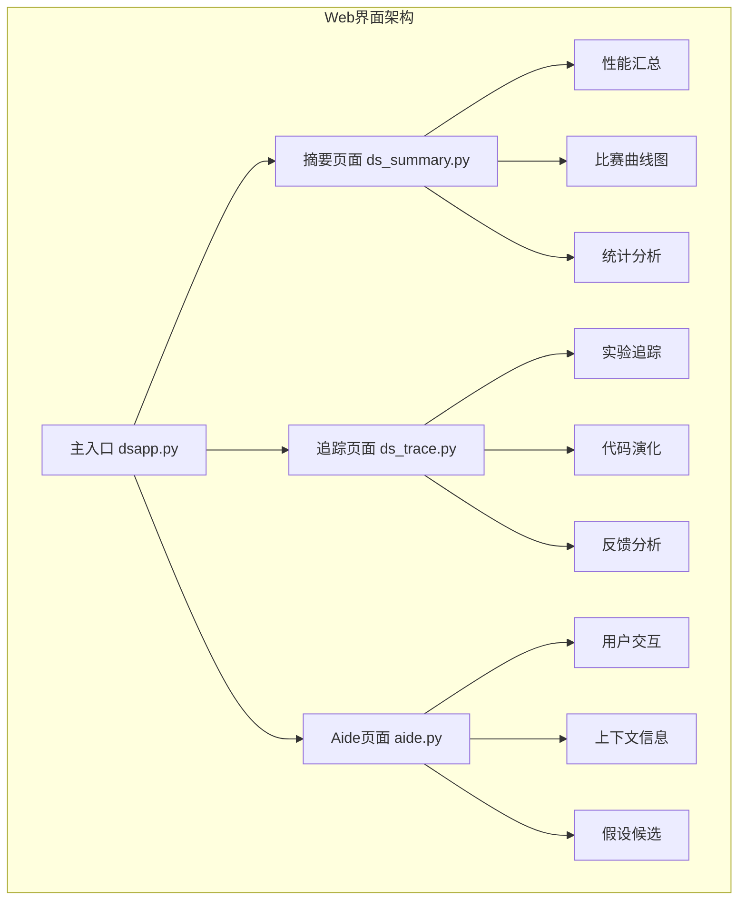
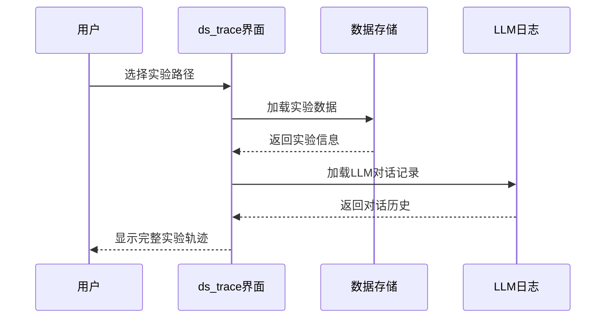
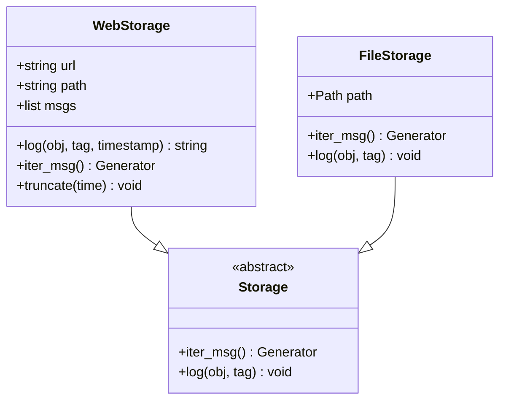
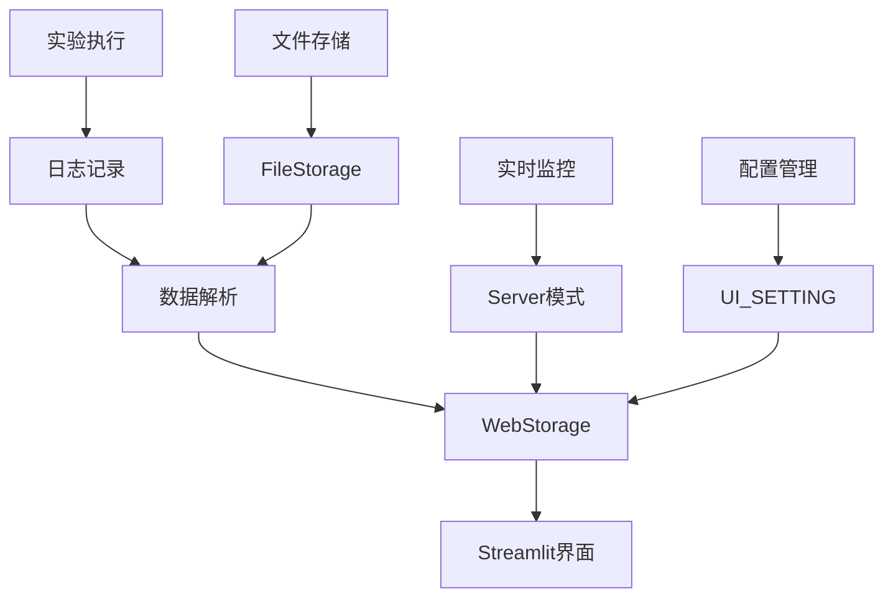
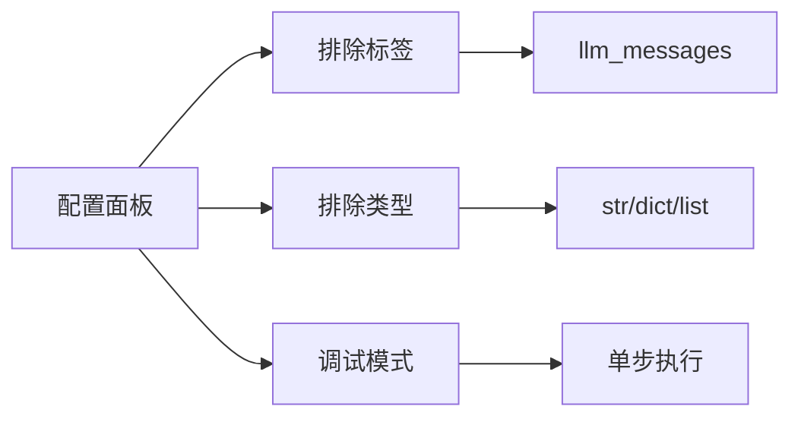
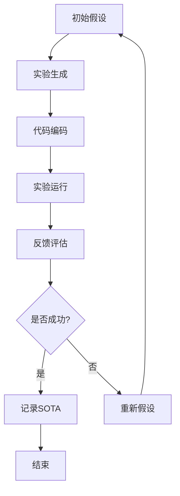

# Web用户界面

<cite>
**本文档中引用的文件**
- [app.py](file://rdagent/log/ui/app.py)
- [ds_trace.py](file://rdagent/log/ui/ds_trace.py)
- [ds_summary.py](file://rdagent/log/ui/ds_summary.py)
- [storage.py](file://rdagent/log/ui/storage.py)
- [web.py](file://rdagent/log/ui/web.py)
- [conf.py](file://rdagent/log/ui/conf.py)
- [utils.py](file://rdagent/log/ui/utils.py)
- [qlib_report_figure.py](file://rdagent/log/ui/qlib_report_figure.py)
- [dsapp.py](file://rdagent/log/ui/dsapp.py)
- [ds_user_interact.py](file://rdagent/log/ui/ds_user_interact.py)
- [cli.py](file://rdagent/app/cli.py)
</cite>

## 目录
1. [简介](#简介)
2. [启动Web界面](#启动web界面)
3. [界面架构概述](#界面架构概述)
4. [核心UI组件详解](#核心ui组件详解)
5. [数据流与存储机制](#数据流与存储机制)
6. [交互操作指南](#交互操作指南)
7. [可视化图表说明](#可视化图表说明)
8. [故障排除](#故障排除)
9. [最佳实践](#最佳实践)

## 简介

RD-Agent的Web用户界面是一个基于Streamlit构建的可视化平台，提供了直观的数据科学研发过程监控和分析工具。该界面支持实时跟踪实验演化、查看性能指标、分析反馈结果，并提供了丰富的交互式可视化功能。

## 启动Web界面

### 基本命令

通过以下命令启动Web界面：

```bash
# 启动基础UI界面
rdagent ui [--log_dir PATH] [--debug]

# 启动数据科学专用界面
rdagent ui --data_science

# 启动服务器模式
rdagent server_ui
```

### 参数说明

| 参数 | 类型 | 默认值 | 描述 |
|------|------|--------|------|
| `--log_dir` | 字符串 | `./log` | 日志文件夹路径 |
| `--debug` | 布尔值 | `false` | 启用调试模式 |
| `--data_science` | 布尔值 | `false` | 启动数据科学专用界面 |

### 界面访问

默认情况下，Web界面将在 `http://localhost:19899` 上可用。如果端口被占用，系统会自动寻找可用端口。

**章节来源**
- [cli.py](file://rdagent/app/cli.py#L33-L86)

## 界面架构概述

RD-Agent Web界面采用模块化设计，主要包含三个核心页面：



**图表来源**
- [dsapp.py](file://rdagent/log/ui/dsapp.py#L31-L39)

### 页面导航结构

界面提供清晰的导航结构：

- **📊 Summary**: 实验性能汇总和统计分析
- **📈 Trace**: 单个实验的完整演化追踪
- **🧑‍🏫 Aide**: 用户交互和上下文信息

**章节来源**
- [dsapp.py](file://rdagent/log/ui/dsapp.py#L31-L39)

## 核心UI组件详解

### ds_trace - 实验追踪组件

`ds_trace` 是核心的实验追踪组件，提供单个实验的完整演化历史可视化。

#### 主要功能模块

1. **实验生成窗口 (Exp Gen)**
   - 显示假设提案
   - 展示待完成任务列表
   - 显示实验工作空间

2. **编码窗口 (Coding)**
   - 跟踪代码演化过程
   - 对比不同版本的代码差异
   - 显示演化反馈信息

3. **运行窗口 (Running)**
   - 展示实验执行结果
   - 对比当前实验与最优实验
   - 显示最终评分和提交状态

4. **反馈窗口 (Feedback)**
   - 显示实验反馈信息
   - 展示SOTA实验信息
   - 提供性能对比分析

#### 交互特性



**图表来源**
- [ds_trace.py](file://rdagent/log/ui/ds_trace.py#L400-L500)

**章节来源**
- [ds_trace.py](file://rdagent/log/ui/ds_trace.py#L400-L600)

### ds_summary - 性能汇总组件

`ds_summary` 提供实验的聚合指标和性能概览，支持多维度数据分析。

#### 核心功能

1. **比赛性能曲线**
   - 展示验证集和测试集分数趋势
   - 支持多种显示模式（标准/精简）
   - 提供性能对比分析

2. **统计分析面板**
   - 成功完成率统计
   - 奖牌获得情况
   - 时间效率分析
   - 性能提升对比

3. **筛选和排序功能**
   - 多比赛项目筛选
   - 级别分类（HIGH/MEDIUM/LITE）
   - 最佳表现筛选

#### 数据表格配置

| 指标类别 | 包含指标 | 描述 |
|----------|----------|------|
| **成功率** | 成功最终决策 | 实验循环中代码正确执行的比例 |
| **成就等级** | 铜牌/银牌/金牌 | 实验达到的不同成就级别 |
| **时间效率** | 执行时间/编码时间/运行时间 | 各阶段耗时统计 |
| **性能对比** | 我们vs基准 | 当前实验与基线模型的性能对比 |

**章节来源**
- [ds_summary.py](file://rdagent/log/ui/ds_summary.py#L50-L150)

### storage模块 - 数据持久化

`storage` 模块负责实验数据的持久化管理和Web界面的数据传输。

#### 存储架构



**图表来源**
- [storage.py](file://rdagent/log/ui/storage.py#L10-L50)

#### 数据转换机制

系统支持多种数据格式的转换和标准化：

- **假设提案** → `research.hypothesis`
- **实验生成** → `research.tasks`
- **代码演化** → `evolving.codes`
- **反馈信息** → `evolving.feedbacks`
- **运行结果** → `feedback.metric`

**章节来源**
- [storage.py](file://rdagent/log/ui/storage.py#L50-L200)

## 数据流与存储机制

### 数据流向图



**图表来源**
- [app.py](file://rdagent/log/ui/app.py#L100-L200)
- [storage.py](file://rdagent/log/ui/storage.py#L15-L50)

### 配置系统

UI配置通过 `UI_SETTING` 进行统一管理：

| 配置项 | 默认值 | 描述 |
|--------|--------|------|
| `default_log_folders` | `["./log"]` | 默认日志文件夹 |
| `static_path` | `"./git_ignore_folder/static"` | 静态资源路径 |
| `enable_cache` | `true` | 启用缓存功能 |
| `baseline_result_path` | `"./baseline.csv"` | 基线结果路径 |

**章节来源**
- [conf.py](file://rdagent/log/ui/conf.py#L5-L25)

## 交互操作指南

### 控制面板操作

界面左侧提供完整的控制面板，支持以下操作：

#### 基础控制

1. **日志路径设置**
   - 自动检测可用的日志文件夹
   - 支持手动输入路径
   - 实时刷新数据

2. **导航按钮**
   - **全部循环**: 显示所有实验循环
   - **重置**: 重置到初始状态
   - **下一循环**: 跳转到下一个实验循环
   - **下一步**: 移动到下一个步骤

#### 高级配置



**图表来源**
- [app.py](file://rdagent/log/ui/app.py#L760-L800)

### 侧边栏导航

界面提供直观的侧边栏导航：

- **页面链接**: 快速跳转到各功能页面
- **设置面板**: 配置日志路径和显示选项
- **实时状态**: 显示当前实验状态

**章节来源**
- [app.py](file://rdagent/log/ui/app.py#L749-L820)

## 可视化图表说明

### 性能趋势图

系统提供多种性能可视化图表：

#### 折线图配置

| 图表类型 | 数据源 | 显示指标 |
|----------|--------|----------|
| **验证集曲线** | `valid_scores` | 各轮次验证分数 |
| **测试集曲线** | `test_scores` | 各轮次测试分数 |
| **集成模型** | `ensemble` | 集成模型性能 |

#### 演化路径图



**图表来源**
- [utils.py](file://rdagent/log/ui/utils.py#L700-L800)

### 回归分析图表

对于量化投资场景，系统提供专门的回归分析图表：

- **累计收益曲线**: 无成本和有成本的累计收益对比
- **最大回撤分析**: 收益回撤的可视化分析
- **超额收益**: 基准收益与策略收益的差值

**章节来源**
- [qlib_report_figure.py](file://rdagent/log/ui/qlib_report_figure.py#L300-L446)

## 故障排除

### 常见问题及解决方案

#### 界面无法加载

1. **检查端口占用**
   ```bash
   netstat -an | grep 19899
   ```

2. **验证日志路径**
   ```bash
   rdagent ui --log_dir ./your_log_path
   ```

3. **启用调试模式**
   ```bash
   rdagent ui --debug
   ```

#### 数据加载失败

1. **确认数据完整性**
   - 检查日志文件是否存在
   - 验证数据格式是否正确
   - 确认权限设置

2. **清理缓存**
   - 删除 `./git_ignore_folder/static` 目录
   - 重启Web服务

#### 性能优化

1. **启用缓存**
   ```python
   # 在 conf.py 中设置
   UI_SETTING.enable_cache = True
   ```

2. **限制显示数据量**
   - 使用排除标签功能
   - 调整时间范围过滤

**章节来源**
- [app.py](file://rdagent/log/ui/app.py#L850-L900)

## 最佳实践

### 数据组织建议

1. **日志文件夹结构**
   ```
   ./log/
   ├── experiment_1/
   │   ├── direct_exp_gen/
   │   ├── coding/
   │   └── running/
   └── experiment_2/
   ```

2. **命名规范**
   - 使用有意义的实验名称
   - 保持路径结构一致性
   - 定期备份重要数据

### 监控策略

1. **定期检查**
   - 每日查看性能趋势
   - 关注异常波动
   - 记录关键里程碑

2. **性能分析**
   - 对比不同实验组
   - 分析瓶颈环节
   - 优化资源配置

### 团队协作

1. **共享配置**
   - 统一日志路径设置
   - 标准化数据格式
   - 建立检查清单

2. **知识分享**
   - 记录实验经验
   - 分享最佳实践
   - 建立文档库

通过遵循这些最佳实践，团队可以更有效地利用RD-Agent Web界面进行数据科学研发过程的监控和分析，提高实验效率和质量。