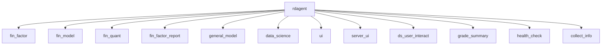
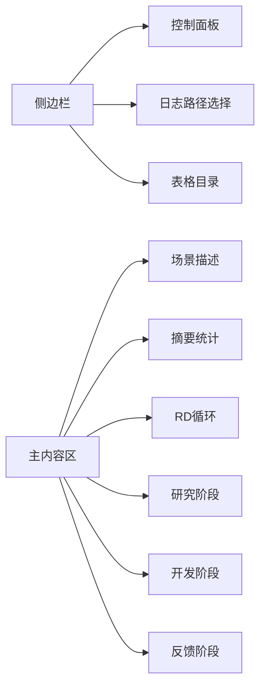
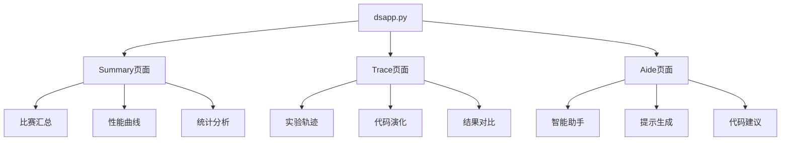
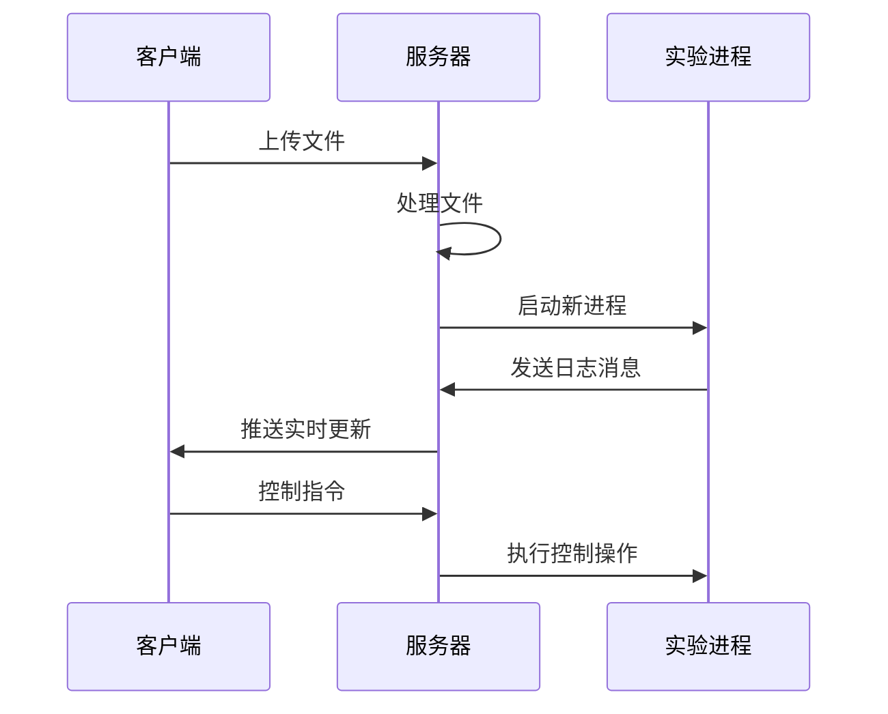
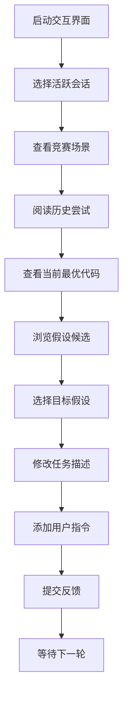

# 用户接口使用指南

<cite>
**本文档引用的文件**
- [cli.py](file://rdagent/app/cli.py)
- [app.py](file://rdagent/log/ui/app.py)
- [ds_trace.py](file://rdagent/log/ui/ds_trace.py)
- [ds_summary.py](file://rdagent/log/ui/ds_summary.py)
- [ds_user_interact.py](file://rdagent/log/ui/ds_user_interact.py)
- [dsapp.py](file://rdagent/log/ui/dsapp.py)
- [conf.py](file://rdagent/log/ui/conf.py)
- [loop.py](file://rdagent/app/data_science/loop.py)
- [app.py](file://rdagent/log/server/app.py)
</cite>

## 目录
1. [简介](#简介)
2. [CLI接口](#cli接口)
3. [Web UI接口](#web-ui接口)
4. [数据科学界面](#数据科学界面)
5. [服务器端界面](#服务器端界面)
6. [用户交互界面](#用户交互界面)
7. [配置管理](#配置管理)
8. [故障排除](#故障排除)

## 简介

RD-Agent提供了两种主要的用户接口：命令行界面(CLI)和Web用户界面(Web UI)。CLI接口通过`rdagent`命令提供各种功能，而Web UI则通过Streamlit框架提供直观的可视化界面，帮助用户监控和管理实验过程。

## CLI接口

### 命令概览

RD-Agent CLI接口基于`typer`框架构建，提供了以下主要命令：



**图表来源**
- [cli.py](file://rdagent/app/cli.py#L36-L86)

### 主要命令详解

#### 1. fin_factor - 量化因子开发
```bash
# 基本用法
rdagent fin_factor

# 参数选项
rdagent fin_factor --loop_n <循环次数>
rdagent fin_factor --timeout <超时时间>
rdagent fin_factor --path <检查点路径>
```

#### 2. fin_model - 量化模型实现
```bash
# 基本用法
rdagent fin_model

# 参数选项
rdagent fin_model --loop_n <循环次数>
rdagent fin_model --timeout <超时时间>
rdagent fin_model --path <检查点路径>
```

#### 3. fin_quant - 完整量化流程
```bash
# 基本用法
rdagent fin_quant

# 参数选项
rdagent fin_quant --loop_n <循环次数>
rdagent fin_quant --timeout <超时时间>
rdagent fin_quant --path <检查点路径>
```

#### 4. fin_factor_report - 报告因子提取
```bash
# 基本用法
rdagent fin_factor_report --report-folder=<报告文件夹路径>

# 示例
wget https://github.com/SunsetWolf/rdagent_resource/releases/download/reports/all_reports.zip
unzip all_reports.zip -d git_ignore_folder/reports
rdagent fin_factor_report --report-folder=git_ignore_folder/reports
```

#### 5. general_model - 通用模型实现
```bash
# 基本用法
rdagent general_model <论文URL>

# 示例
rdagent general_model "https://arxiv.org/pdf/2210.09789"
```

#### 6. data_science - 数据科学竞赛
```bash
# 基本用法
rdagent data_science --competition <竞赛名称>

# 示例配置
mkdir -p ./git_ignore_folder/ds_data
dotenv set DS_LOCAL_DATA_PATH "$(pwd)/git_ignore_folder/ds_data"
dotenv set DS_CODER_ON_WHOLE_PIPELINE True
dotenv set DS_IF_USING_MLE_DATA True
dotenv set DS_SAMPLE_DATA_BY_LLM True
dotenv set DS_SCEN rdagent.scenarios.data_science.scen.KaggleScen

rdagent data_science --competition tabular-playground-series-dec-2021
```

#### 7. ui - 启动Web界面
```bash
# 基本用法
rdagent ui

# 参数选项
rdagent ui --port <端口号>
rdagent ui --log_dir <日志目录>
rdagent ui --debug
rdagent ui --data_science  # 启动数据科学界面
```

#### 8. server_ui - 实时监控界面
```bash
# 基本用法
rdagent server_ui --port <端口号>
```

#### 9. ds_user_interact - 用户交互界面
```bash
# 基本用法
rdagent ds_user_interact --port <端口号>
```

#### 10. grade_summary - 总结评分
```bash
# 基本用法
rdagent grade_summary
```

#### 11. health_check - 健康检查
```bash
# 基本用法
rdagent health_check
```

#### 12. collect_info - 收集信息
```bash
# 基本用法
rdagent collect_info
```

**章节来源**
- [cli.py](file://rdagent/app/cli.py#L36-L86)
- [loop.py](file://rdagent/app/data_science/loop.py#L10-L80)

## Web UI接口

### 界面启动

Web UI界面通过Streamlit框架提供，支持实时监控和交互式实验跟踪。

#### 启动命令
```bash
# 标准界面
rdagent ui --port 19899 --log_dir ./logs

# 数据科学界面
rdagent ui --data_science --port 19899

# 调试模式
rdagent ui --debug --port 19899
```

#### 界面布局



**图表来源**
- [app.py](file://rdagent/log/ui/app.py#L750-L800)

### 主要功能模块

#### 1. 场景描述 (Scenario Description)
显示当前实验的背景信息和设置。

#### 2. 摘要统计 (Summary)
- **指标图表**: 展示实验过程中的关键指标变化
- **假设状态**: 显示假设生成和验证的状态
- **性能对比**: 对比基线和当前实验结果

#### 3. RD循环 (RD Loops)
包含三个核心阶段：
- **研究阶段 (Research)**: 提出假设和实验设计
- **开发阶段 (Development)**: 执行实验和代码演化
- **反馈阶段 (Feedback)**: 分析结果和迭代改进

**章节来源**
- [app.py](file://rdagent/log/ui/app.py#L100-L200)

## 数据科学界面

### dsapp.py - 数据科学专用界面

数据科学界面专门针对Kaggle竞赛场景优化，提供更详细的实验跟踪和分析功能。

#### 界面特点
- **多页面导航**: Summary、Trace、Aide三个主要页面
- **竞赛特定分析**: 针对Kaggle竞赛的数据和指标
- **实时进度跟踪**: 监控实验执行状态

#### 页面功能



**图表来源**
- [dsapp.py](file://rdagent/log/ui/dsapp.py#L20-L30)

**章节来源**
- [dsapp.py](file://rdagent/log/ui/dsapp.py#L1-L52)

## 服务器端界面

### server_ui.py - 实时监控服务器

服务器端界面提供集中式的实验监控和管理功能。

#### 功能特性
- **实时消息推送**: WebSocket实现实时更新
- **多用户支持**: 支持多个客户端同时访问
- **进程控制**: 可以暂停、恢复和停止实验进程
- **文件上传**: 支持报告和数据文件上传

#### API接口



**图表来源**
- [app.py](file://rdagent/log/server/app.py#L100-L200)

**章节来源**
- [app.py](file://rdagent/log/server/app.py#L1-L270)

## 用户交互界面

### ds_user_interact.py - 人工干预界面

用户交互界面允许研究人员直接参与实验过程，提供人工决策支持。

#### 主要功能
- **会话管理**: 管理多个活跃的交互会话
- **上下文展示**: 显示当前竞赛场景和历史尝试
- **假设候选**: 提供多个假设候选供选择
- **用户指令**: 允许添加自定义用户指令

#### 交互流程



**图表来源**
- [ds_user_interact.py](file://rdagent/log/ui/ds_user_interact.py#L50-L150)

**章节来源**
- [ds_user_interact.py](file://rdagent/log/ui/ds_user_interact.py#L1-L173)

## 配置管理

### UI配置 (conf.py)

Web界面的配置通过`UI_SETTING`对象管理，支持多种自定义选项。

#### 主要配置项

| 配置项 | 类型 | 默认值 | 描述 |
|--------|------|--------|------|
| `default_log_folders` | List[str] | ["./log"] | 默认日志文件夹路径 |
| `baseline_result_path` | str | "./baseline.csv" | 基线结果文件路径 |
| `aide_path` | str | "./aide" | AI助手文件路径 |
| `amlt_path` | str | "/data/share_folder_local/amlt" | AMLT数据路径 |
| `static_path` | str | "./git_ignore_folder/static" | 静态文件路径 |
| `trace_folder` | str | "./traces" | 追踪文件夹路径 |
| `enable_cache` | bool | True | 是否启用缓存 |

**章节来源**
- [conf.py](file://rdagent/log/ui/conf.py#L1-L25)

## 故障排除

### 常见问题及解决方案

#### 1. CLI命令无法识别
**问题**: `rdagent: command not found`
**解决方案**: 
- 确保已正确安装项目依赖
- 检查PYTHONPATH环境变量
- 使用完整路径调用: `python -m rdagent.app.cli`

#### 2. Web UI无法启动
**问题**: 端口被占用或权限不足
**解决方案**:
```bash
# 更换端口
rdagent ui --port 19900

# 检查端口占用
lsof -i :19899
```

#### 3. 日志文件找不到
**问题**: `Log dir does not exist`
**解决方案**:
```bash
# 创建日志目录
mkdir -p ./logs

# 指定正确的日志路径
rdagent ui --log_dir ./logs
```

#### 4. 数据科学竞赛配置错误
**问题**: 环境变量未正确设置
**解决方案**:
```bash
# 设置必需的环境变量
dotenv set DS_LOCAL_DATA_PATH "$(pwd)/git_ignore_folder/ds_data"
dotenv set DS_CODER_ON_WHOLE_PIPELINE True
dotenv set DS_IF_USING_MLE_DATA False
dotenv set DS_SAMPLE_DATA_BY_LLM False
```

#### 5. 权限问题
**问题**: 文件读写权限不足
**解决方案**:
```bash
# 修改文件权限
chmod -R 755 ./logs
chmod -R 755 ./git_ignore_folder
```

### 调试技巧

#### 启用调试模式
```bash
# CLI调试
rdagent ui --debug --log_dir ./logs

# 服务器调试
rdagent server_ui --port 19899 --debug
```

#### 查看详细日志
```bash
# 设置环境变量
export RDAGENT_LOG_LEVEL=DEBUG
rdagent data_science --competition test_competition
```

#### 检查健康状态
```bash
rdagent health_check
```

## 总结

RD-Agent的用户接口设计旨在提供灵活且强大的实验管理和监控能力。CLI接口适合自动化脚本和批量处理，而Web UI界面则提供了直观的可视化体验，特别适合研究人员进行实验分析和决策制定。通过合理配置和使用这些接口，用户可以高效地进行科学研究和实验开发。