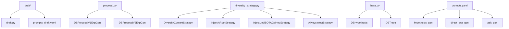
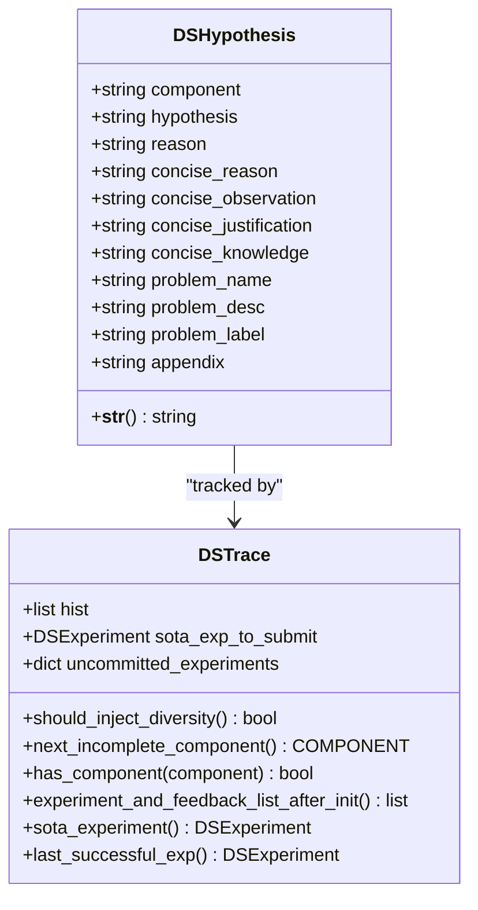
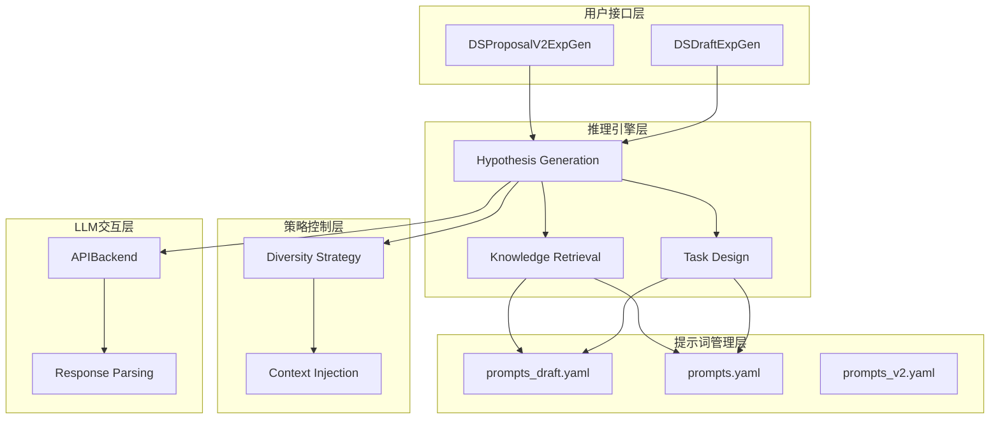
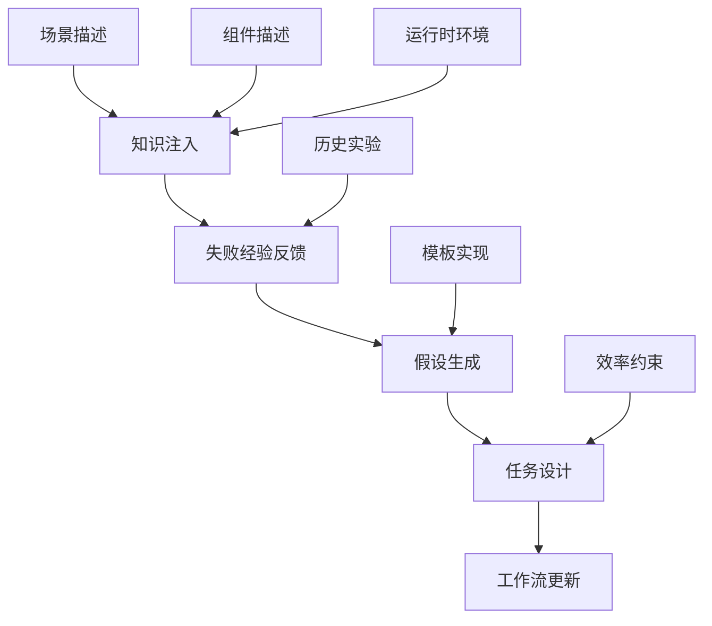
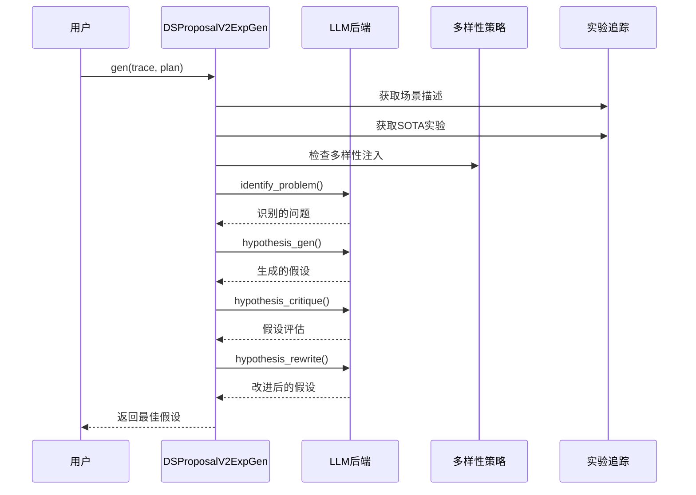
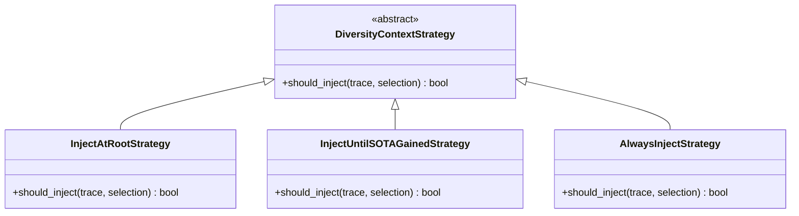
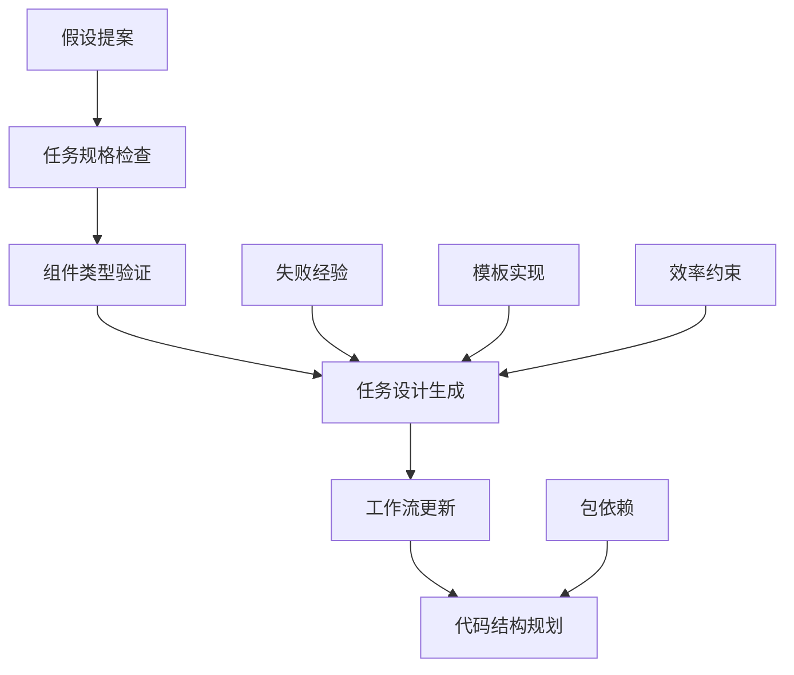
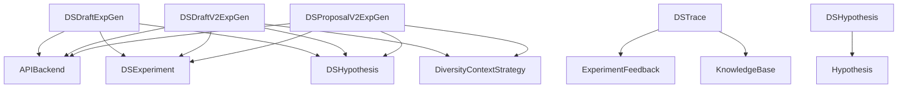
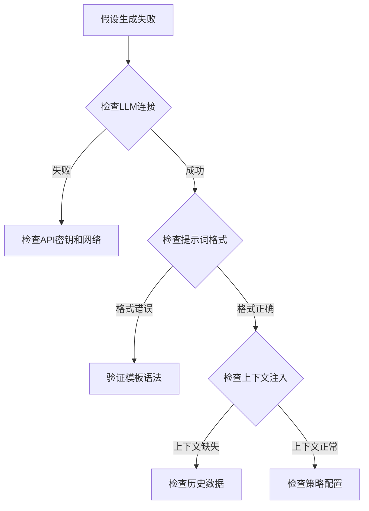

# 假设生成

<cite>
**本文档中引用的文件**
- [draft.py](file://rdagent/scenarios/data_science/proposal/exp_gen/draft/draft.py)
- [prompts_draft.yaml](file://rdagent/scenarios/data_science/proposal/exp_gen/draft/prompts_draft.yaml)
- [diversity_strategy.py](file://rdagent/scenarios/data_science/proposal/exp_gen/diversity_strategy.py)
- [proposal.py](file://rdagent/scenarios/data_science/proposal/exp_gen/proposal.py)
- [base.py](file://rdagent/scenarios/data_science/proposal/exp_gen/base.py)
- [prompts.yaml](file://rdagent/scenarios/data_science/proposal/exp_gen/prompts.yaml)
</cite>

## 目录
1. [简介](#简介)
2. [项目结构](#项目结构)
3. [核心组件](#核心组件)
4. [架构概览](#架构概览)
5. [详细组件分析](#详细组件分析)
6. [依赖关系分析](#依赖关系分析)
7. [性能考虑](#性能考虑)
8. [故障排除指南](#故障排除指南)
9. [结论](#结论)

## 简介

假设生成是RD-Agent数据科学场景中一个关键的推理机制，负责基于初始任务描述和领域知识生成多样化且可测试的研究假设。该系统通过两套不同的实现策略：`DSDraftExpGen`（草稿版）和`DSDraftV2ExpGen`（增强版），实现了从问题识别到假设生成再到任务设计的完整流程。

系统的核心目标是在Kaggle竞赛等复杂数据科学任务中，为研究人员提供可执行、可验证的假设，这些假设能够指导后续的实验设计和模型开发。

## 项目结构

假设生成模块位于`rdagent/scenarios/data_science/proposal/exp_gen/`目录下，包含以下核心文件：

**图表来源**
- [draft.py](file://rdagent/scenarios/data_science/proposal/exp_gen/draft/draft.py#L1-L50)
- [proposal.py](file://rdagent/scenarios/data_science/proposal/exp_gen/proposal.py#L1-L50)
- [diversity_strategy.py](file://rdagent/scenarios/data_science/proposal/exp_gen/diversity_strategy.py#L1-L30)

**章节来源**
- [draft.py](file://rdagent/scenarios/data_science/proposal/exp_gen/draft/draft.py#L1-L291)
- [proposal.py](file://rdagent/scenarios/data_science/proposal/exp_gen/proposal.py#L1-L100)

## 核心组件

### DSDraftV2ExpGen类

`DSDraftV2ExpGen`是假设生成的主要实现类，继承自`ExpGen`基类，提供了完整的假设生成流水线：

#### 主要方法
- `gen()`: 主入口方法，协调整个假设生成流程
- `hypothesis_gen()`: 基于领域知识和失败经验生成具体假设
- `knowledge_gen()`: 收集和整理通用领域的知识
- `task_gen()`: 将假设转化为具体的任务设计

#### 关键特性
- 支持响应模式(schema)和JSON模式两种输出格式
- 集成多样性策略以避免假设趋同
- 提供丰富的提示词模板和上下文注入机制

**章节来源**
- [draft.py](file://rdagent/scenarios/data_science/proposal/exp_gen/draft/draft.py#L120-L291)

### 假设对象模型

**图表来源**
- [base.py](file://rdagent/scenarios/data_science/proposal/exp_gen/base.py#L10-L50)
- [base.py](file://rdagent/scenarios/data_science/proposal/exp_gen/base.py#L50-L150)

**章节来源**
- [base.py](file://rdagent/scenarios/data_science/proposal/exp_gen/base.py#L10-L100)

## 架构概览

假设生成系统采用分层架构设计，包含以下几个核心层次：

**图表来源**
- [proposal.py](file://rdagent/scenarios/data_science/proposal/exp_gen/proposal.py#L600-L700)
- [draft.py](file://rdagent/scenarios/data_science/proposal/exp_gen/draft/draft.py#L120-L200)

## 详细组件分析

### 提示词模板设计逻辑

#### prompts_draft.yaml中的提示词结构

提示词模板采用多层次的设计，确保上下文注入、约束条件和输出格式的完整性：

**图表来源**
- [prompts_draft.yaml](file://rdagent/scenarios/data_science/proposal/exp_gen/draft/prompts_draft.yaml#L1-L100)

#### 上下文注入机制

系统通过多种方式注入上下文信息：

1. **领域知识注入**: 通过`knowledge_gen()`方法收集通用数据科学知识
2. **失败经验注入**: 分析历史失败实验，提取可学习的经验
3. **多样性注入**: 基于多样性策略决定是否注入跨轨迹的上下文

**章节来源**
- [prompts_draft.yaml](file://rdagent/scenarios/data_science/proposal/exp_gen/draft/prompts_draft.yaml#L1-L255)

### 假设生成流程分析

#### DSProposalV2ExpGen的假设生成流程

**图表来源**
- [proposal.py](file://rdagent/scenarios/data_science/proposal/exp_gen/proposal.py#L1380-L1480)

#### LLM交互和响应解析

假设生成过程中的LLM交互遵循严格的模式：

1. **系统提示构建**: 包含角色定义、任务描述和输出格式要求
2. **用户提示构建**: 包含具体上下文、历史信息和当前状态
3. **响应解析**: 支持JSON模式和响应模式两种输出格式
4. **错误处理**: 实现重试机制和降级策略

**章节来源**
- [proposal.py](file://rdagent/scenarios/data_science/proposal/exp_gen/proposal.py#L600-L700)

### 多样性策略实现

#### DiversityContextStrategy抽象基类

**图表来源**
- [diversity_strategy.py](file://rdagent/scenarios/data_science/proposal/exp_gen/diversity_strategy.py#L10-L68)

#### 策略选择逻辑

不同策略适用于不同的探索场景：

- **InjectAtRootStrategy**: 仅在创建新子轨迹根节点时注入多样性
- **InjectUntilSOTAGainedStrategy**: 在获得SOTA之前持续注入多样性
- **AlwaysInjectStrategy**: 总是注入多样性上下文

**章节来源**
- [diversity_strategy.py](file://rdagent/scenarios/data_science/proposal/exp_gen/diversity_strategy.py#L1-L69)

### 任务设计和工作流生成

#### 从假设到任务的转换

**图表来源**
- [draft.py](file://rdagent/scenarios/data_science/proposal/exp_gen/draft/draft.py#L200-L291)

**章节来源**
- [draft.py](file://rdagent/scenarios/data_science/proposal/exp_gen/draft/draft.py#L200-L291)

## 依赖关系分析

### 组件间依赖关系

**图表来源**
- [draft.py](file://rdagent/scenarios/data_science/proposal/exp_gen/draft/draft.py#L1-L20)
- [proposal.py](file://rdagent/scenarios/data_science/proposal/exp_gen/proposal.py#L1-L30)

### 外部依赖

系统依赖以下外部组件：
- **APIBackend**: 提供LLM服务接口
- **T模板引擎**: 用于提示词模板渲染
- **RAGAgent**: 可选的知识检索功能
- **等待重试机制**: 处理LLM调用失败

**章节来源**
- [draft.py](file://rdagent/scenarios/data_science/proposal/exp_gen/draft/draft.py#L1-L30)
- [proposal.py](file://rdagent/scenarios/data_science/proposal/exp_gen/proposal.py#L1-L50)

## 性能考虑

### 温度参数调优

假设生成过程中的随机性控制主要通过以下方式实现：

1. **默认温度设置**: 根据任务复杂度动态调整
2. **多样性注入**: 通过策略控制增加假设的多样性
3. **重试机制**: 在失败时重新生成假设

### 对抗性示例引入

系统支持通过以下方式引入对抗性示例：

- **失败经验分析**: 从历史失败中提取反面案例
- **Sibling比较**: 确保假设的多样性
- **边界情况检查**: 验证假设的鲁棒性

## 故障排除指南

### 日志定位方法

#### 调试假设生成过程

1. **启用详细日志**:
   - 设置`logger.info`级别以获取中间结果
   - 监控LLM调用的成功率和响应时间

2. **关键位置日志**:
   - 假设生成前后的上下文信息
   - 多样性策略的决策过程
   - LLM响应的解析结果

#### 常见问题诊断

**图表来源**
- [proposal.py](file://rdagent/scenarios/data_science/proposal/exp_gen/proposal.py#L1420-L1480)

### 提示词优化建议

#### 温度参数调整

- **创造性任务**: 使用较高温度(0.7-0.9)
- **准确性任务**: 使用较低温度(0.1-0.3)
- **平衡任务**: 使用中等温度(0.4-0.6)

#### 对抗性示例策略

1. **引入失败案例**: 在提示词中包含典型失败模式
2. **多角度思考**: 设计多个视角的问题描述
3. **边界条件**: 明确处理边缘情况的指导原则

**章节来源**
- [proposal.py](file://rdagent/scenarios/data_science/proposal/exp_gen/proposal.py#L1420-L1480)

## 结论

假设生成系统通过精心设计的架构和策略，实现了从复杂数据科学问题到可执行假设的有效转化。系统的核心优势包括：

1. **模块化设计**: 清晰的职责分离和可扩展的架构
2. **多样性保证**: 多种策略确保假设的多样性
3. **上下文丰富**: 全面的上下文注入机制
4. **容错能力**: 完善的错误处理和重试机制

该系统为数据科学领域的自动化实验设计提供了强有力的工具，能够显著提升研究效率和假设质量。通过持续的优化和扩展，系统有望在更广泛的场景中发挥重要作用。