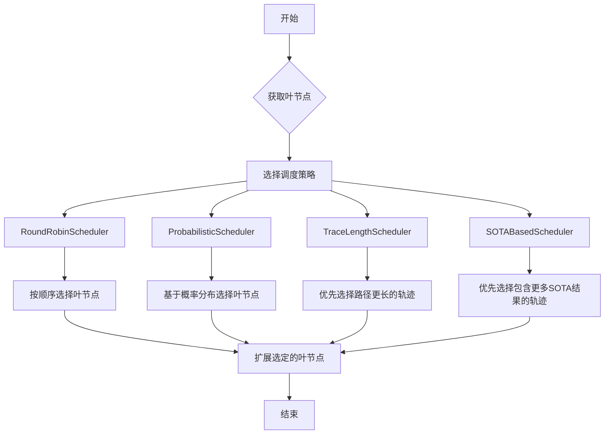
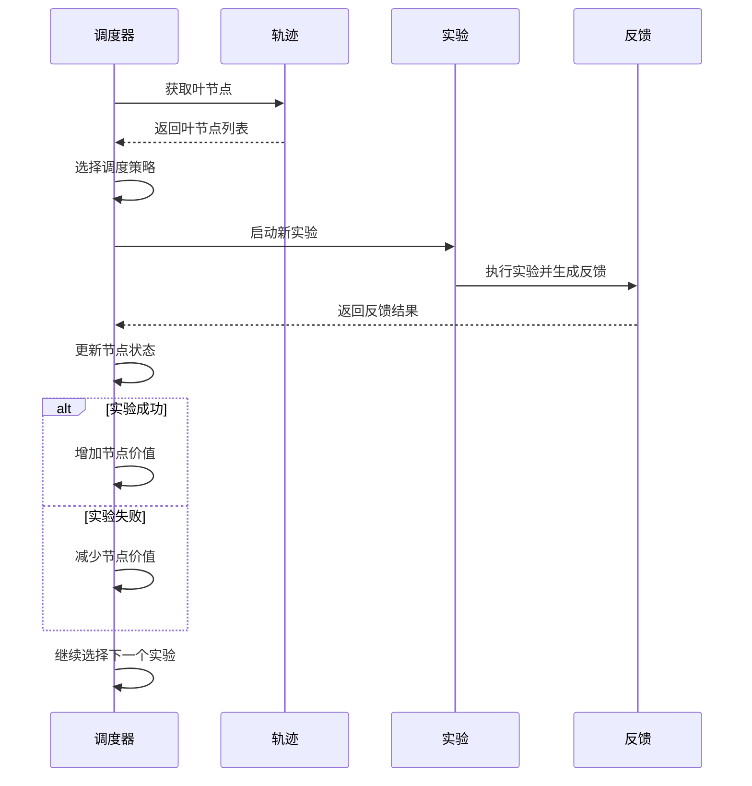
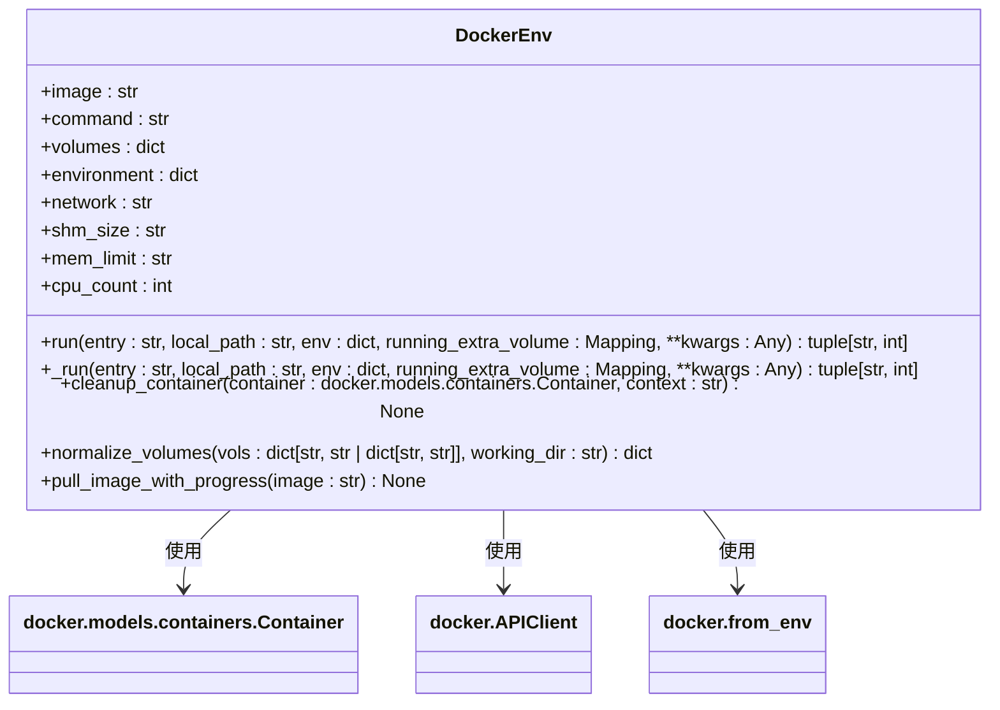
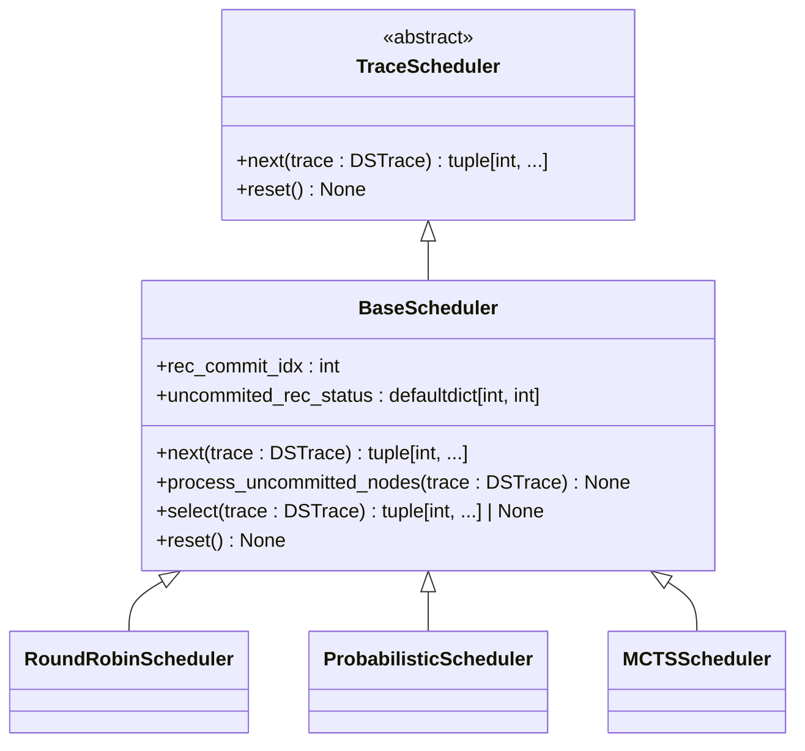
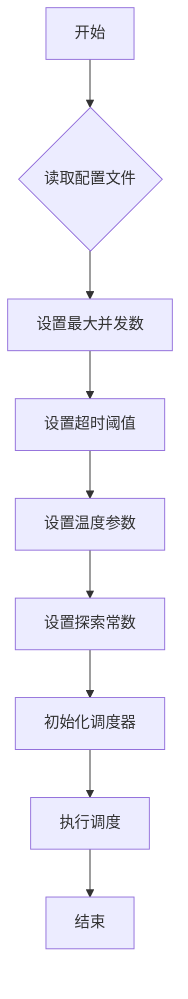
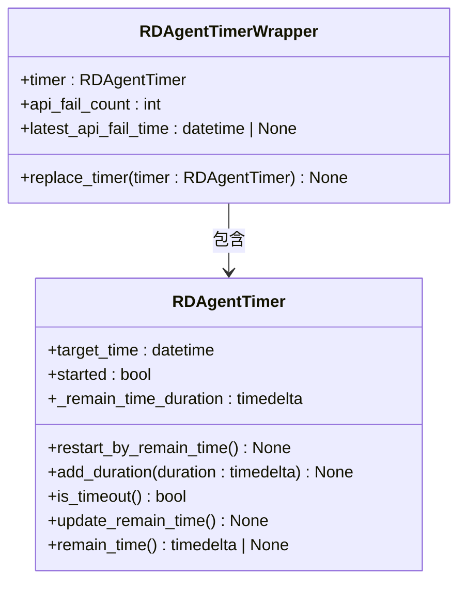
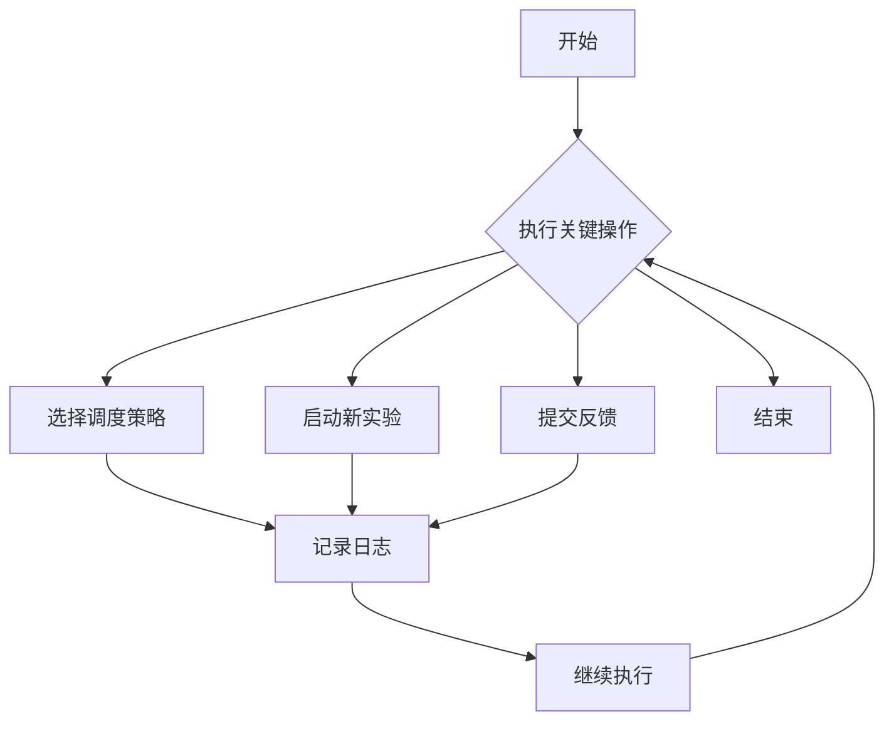

# 执行调度

<cite>
**本文档中引用的文件**  
- [trace_scheduler.py](file://rdagent/scenarios/data_science/proposal/exp_gen/trace_scheduler.py)
- [idea_pool.py](file://rdagent/scenarios/data_science/proposal/exp_gen/idea_pool.py)
- [base.py](file://rdagent/scenarios/data_science/proposal/exp_gen/base.py)
- [conf.py](file://rdagent/app/data_science/conf.py)
- [env.py](file://rdagent/utils/env.py)
- [timer.py](file://rdagent/log/timer.py)
</cite>

## 目录
1. [引言](#引言)
2. [提案执行时序与资源分配管理](#提案执行时序与资源分配管理)
3. [基于优先级和依赖关系的执行计划构建](#基于优先级和依赖关系的执行计划构建)
4. [并行任务处理与失败重试机制](#并行任务处理与失败重试机制)
5. [资源隔离机制（Docker容器）](#资源隔离机制docker容器)
6. [Scheduler接口的公共方法](#scheduler接口的公共方法)
7. [调度策略配置示例](#调度策略配置示例)
8. [RAGEvoAgent循环中的稳定性保障机制](#ragevoagent循环中的稳定性保障机制)
9. [日志追踪任务状态](#日志追踪任务状态)
10. [结论](#结论)

## 引言
`trace_scheduler.py` 是 RD-Agent 系统中负责管理数据科学实验提案执行时序与资源分配的核心组件。该模块通过与 `idea_pool.py` 中的优先级和依赖关系协同工作，构建高效的执行计划。调度器不仅处理并行任务的协调与失败重试，还通过 Docker 容器实现资源隔离，确保实验环境的稳定性和可重复性。本文档将详细阐述 `trace_scheduler.py` 的工作原理，包括其如何基于 `idea_pool.py` 构建执行计划、处理并行任务、实现资源隔离，以及如何通过日志追踪任务状态。同时，结合 `base.py` 中的基类定义，阐明 `Scheduler` 接口的公共方法，并提供配置调度策略的示例。

## 提案执行时序与资源分配管理
`trace_scheduler.py` 模块中的 `TraceScheduler` 类是管理提案执行时序与资源分配的核心。该类是一个抽象基类，定义了调度策略的基本接口。具体的调度器如 `RoundRobinScheduler`、`ProbabilisticScheduler` 等继承自 `BaseScheduler`，实现了不同的调度逻辑。

调度器通过 `next` 方法选择下一个要执行的实验。该方法在 `BaseScheduler` 中实现了原子性操作，确保在并发环境下调度的正确性。`next` 方法首先提交待定的选择，然后更新未提交的记录状态和提交索引，最后调用 `select` 方法选择父节点。`select` 方法的具体实现由子类提供，决定了调度策略的核心逻辑。

资源分配方面，调度器通过 `max_trace_num` 参数控制最大并行轨迹数，确保系统资源不会被过度消耗。例如，`RoundRobinScheduler` 在初始化时接收 `max_trace_num` 参数，并在 `select` 方法中检查当前轨迹数是否小于目标数，若是则启动新的轨迹。

**Section sources**
- [trace_scheduler.py](file://rdagent/scenarios/data_science/proposal/exp_gen/trace_scheduler.py#L1-L444)

## 基于优先级和依赖关系的执行计划构建
`trace_scheduler.py` 与 `idea_pool.py` 协同工作，基于优先级和依赖关系构建执行计划。`idea_pool.py` 中的 `DSKnowledgeBase` 类维护了一个知识图谱，存储了从历史实验中提取的 `DSIdea` 对象。每个 `DSIdea` 包含了实验的核心概念、方法、上下文和假设。

调度器通过 `DSKnowledgeBase` 的 `sample_ideas` 方法获取与当前问题相关的创意。该方法首先通过语义搜索找到与问题描述最相似的创意节点，然后使用 LLM 从这些创意中选择最适合的创意。选择过程考虑了场景描述、实验反馈列表描述、SOTA 实验描述和竞赛描述等因素。

构建执行计划时，调度器利用 `DSTrace` 类中的 `get_leaves` 方法获取当前 DAG 中的所有叶节点，即尚未扩展的实验。然后根据调度策略选择一个或多个叶节点进行扩展。例如，`TraceLengthScheduler` 会优先选择路径更长的轨迹进行扩展，而 `SOTABasedScheduler` 会优先选择包含更多 SOTA 结果的轨迹。

**Diagram sources**
- [trace_scheduler.py](file://rdagent/scenarios/data_science/proposal/exp_gen/trace_scheduler.py#L1-L444)
- [idea_pool.py](file://rdagent/scenarios/data_science/proposal/exp_gen/idea_pool.py#L1-L186)
- [base.py](file://rdagent/scenarios/data_science/proposal/exp_gen/base.py#L1-L349)

## 并行任务处理与失败重试机制
`trace_scheduler.py` 模块通过 `BaseScheduler` 类中的 `uncommited_rec_status` 字典管理未提交的记录状态，确保在并行任务处理中的正确性。`uncommited_rec_status` 记录了每个节点的未提交状态，防止同一节点被多次扩展。

失败重试机制通过 `MCTSScheduler` 类中的 `observe_feedback` 方法实现。当一个实验完成后，`observe_feedback` 方法会根据反馈结果更新节点的访问次数和价值总和。如果实验成功（`feedback.decision` 为 `True`），则增加节点的价值；如果实验失败，则减少节点的价值。这样，调度器在后续选择时会倾向于选择价值更高的节点，从而实现失败重试。

**Diagram sources**
- [trace_scheduler.py](file://rdagent/scenarios/data_science/proposal/exp_gen/trace_scheduler.py#L1-L444)

## 资源隔离机制（Docker容器）
`trace_scheduler.py` 模块通过 `env.py` 中的 `DockerEnv` 类实现资源隔离。`DockerEnv` 类使用 Docker 容器运行实验，确保每个实验都在独立的环境中执行，避免资源冲突和环境污染。

`DockerEnv` 类在 `run` 方法中创建并运行 Docker 容器。容器的配置包括镜像、命令、卷、环境变量、网络、共享内存大小、内存限制和 CPU 限制等。通过这些配置，可以精确控制每个实验的资源使用。

**Diagram sources**
- [env.py](file://rdagent/utils/env.py#L49-L948)

## Scheduler接口的公共方法
`Scheduler` 接口的公共方法定义在 `trace_scheduler.py` 模块的 `TraceScheduler` 抽象基类中。这些方法包括：

- `next(trace: DSTrace) -> tuple[int, ...]`: 选择下一个要执行的实验。该方法是调度器的核心，决定了实验的执行顺序。
- `reset() -> None`: 重置调度器到初始状态。该方法在需要重新开始调度时调用。

`BaseScheduler` 类实现了 `next` 方法的基本逻辑，包括提交待定选择、更新未提交记录状态和调用 `select` 方法。`select` 方法是一个抽象方法，由子类具体实现。

**Diagram sources**
- [trace_scheduler.py](file://rdagent/scenarios/data_science/proposal/exp_gen/trace_scheduler.py#L1-L444)

## 调度策略配置示例
调度策略的配置主要在 `conf.py` 文件中进行。以下是一些常见的配置示例：

- **最大并发数**: 通过 `max_trace_num` 参数设置最大并行轨迹数。例如，`max_trace_num = 3` 表示最多同时运行 3 个轨迹。
- **超时阈值**: 通过 `full_timeout` 和 `debug_timeout` 参数设置全量数据和调试数据的超时时间。例如，`full_timeout = 3600` 表示全量数据的超时时间为 3600 秒。
- **温度参数**: 通过 `scheduler_temperature` 参数设置概率调度器的温度。例如，`scheduler_temperature = 1.0` 表示使用默认温度。
- **探索常数**: 通过 `scheduler_c_puct` 参数设置 MCTS 调度器的探索常数。例如，`scheduler_c_puct = 1.0` 表示使用默认探索常数。

**Diagram sources**
- [conf.py](file://rdagent/app/data_science/conf.py#L1-L207)

## RAGEvoAgent循环中的稳定性保障机制
`RAGEvoAgent` 循环中的稳定性保障机制主要通过 `timer.py` 模块中的 `RDAgentTimer` 类实现。`RDAgentTimer` 类提供了超时检测和剩余时间管理功能。

`RDAgentTimer` 类的 `is_timeout` 方法用于检测是否超时。该方法检查当前时间是否超过了目标时间，若是则返回 `True`。`remain_time` 方法返回剩余时间，用于监控任务的执行进度。

`RDAgentTimerWrapper` 类是一个单例类，用于全局管理 `RDAgentTimer` 实例。它还记录了 API 调用失败次数和最近一次失败时间，用于分析系统稳定性。

**Diagram sources**
- [timer.py](file://rdagent/log/timer.py#L40-L180)

## 日志追踪任务状态
日志追踪任务状态主要通过 `trace_scheduler.py` 模块中的 `logger` 对象实现。`logger` 对象使用 `rdagent.log` 模块中的 `rdagent_logger`，提供了详细的日志记录功能。

调度器在关键操作点记录日志，例如选择调度策略、启动新实验、提交反馈等。这些日志信息有助于调试和分析系统行为。例如，`RoundRobinScheduler` 在初始化时记录 `max_trace_num` 参数，`MCTSScheduler` 在选择节点时记录 Q 值和 U 值。

**Diagram sources**
- [trace_scheduler.py](file://rdagent/scenarios/data_science/proposal/exp_gen/trace_scheduler.py#L1-L444)

## 结论
`trace_scheduler.py` 模块是 RD-Agent 系统中管理提案执行时序与资源分配的核心组件。通过与 `idea_pool.py` 中的优先级和依赖关系协同工作，调度器能够构建高效的执行计划。调度器支持多种调度策略，如轮询、概率和 MCTS，能够灵活应对不同的实验需求。通过 Docker 容器实现资源隔离，确保了实验环境的稳定性和可重复性。`Scheduler` 接口的公共方法定义清晰，便于扩展和维护。配置调度策略的示例展示了如何通过配置文件调整系统行为。`RAGEvoAgent` 循环中的稳定性保障机制和日志追踪功能进一步增强了系统的可靠性和可调试性。