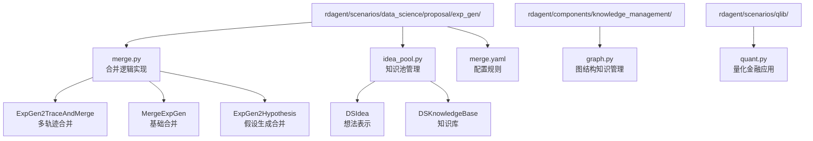
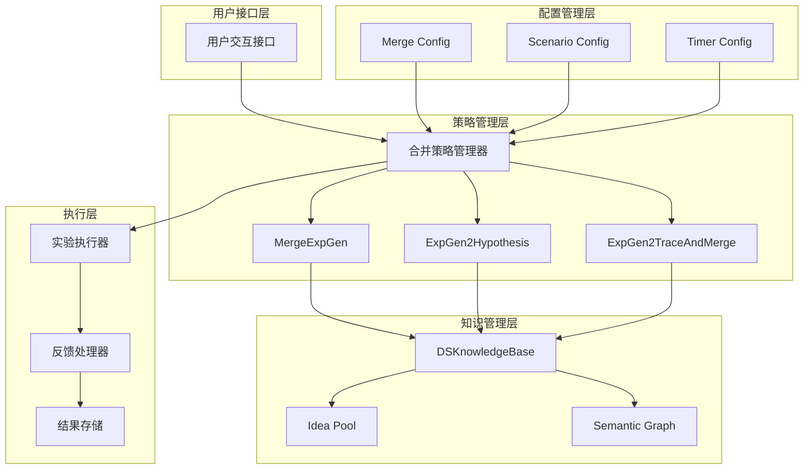
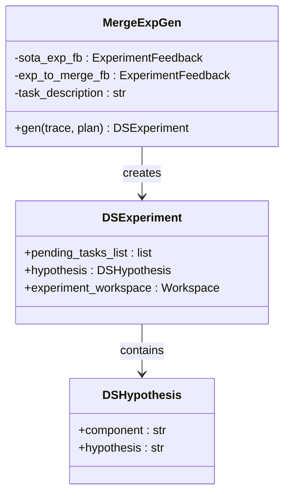
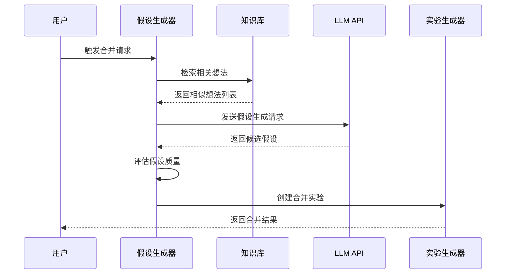
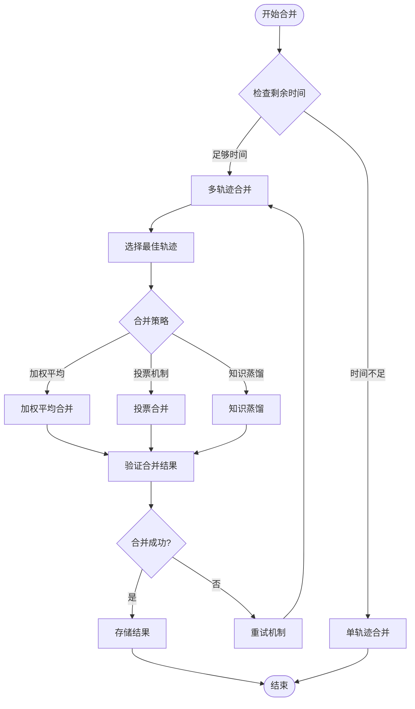
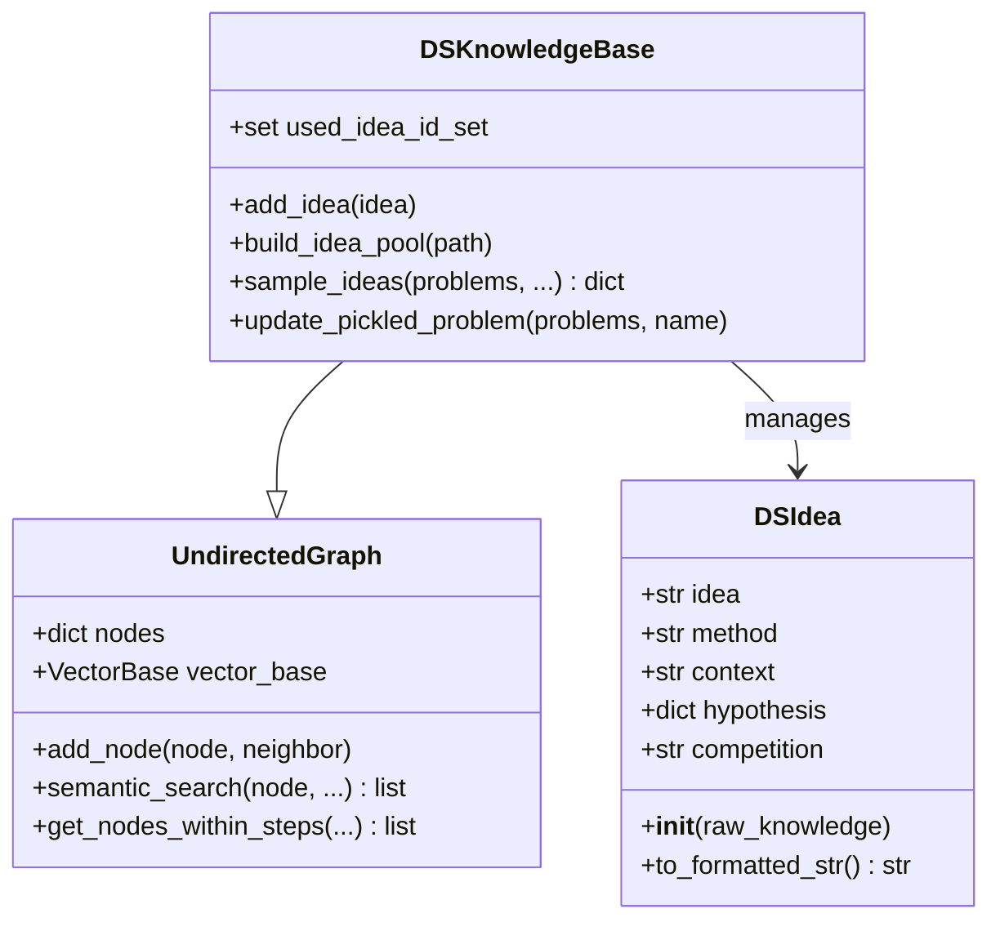
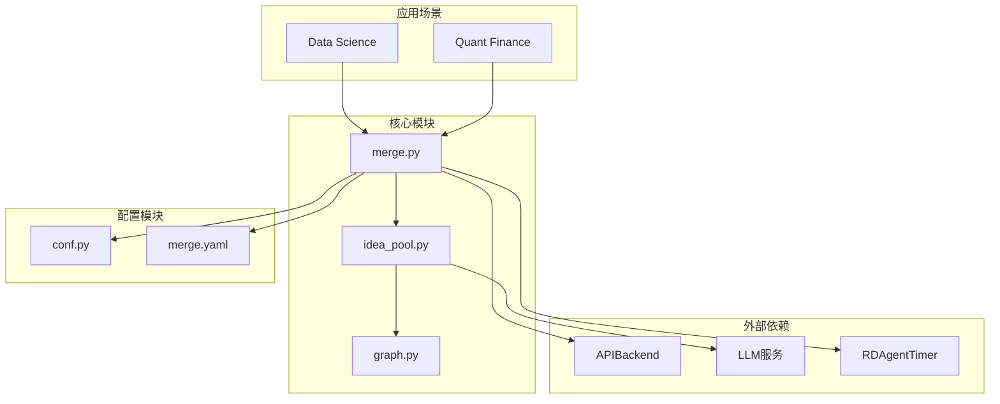

# 提案合并

<cite>
**本文档中引用的文件**
- [merge.py](file://rdagent/scenarios/data_science/proposal/exp_gen/merge.py)
- [idea_pool.py](file://rdagent/scenarios/data_science/proposal/exp_gen/idea_pool.py)
- [merge.yaml](file://rdagent/scenarios/data_science/proposal/exp_gen/merge.yaml)
- [graph.py](file://rdagent/components/knowledge_management/graph.py)
- [conf.py](file://rdagent/app/data_science/conf.py)
- [quant.py](file://rdagent/scenarios/qlib/quant.py)
</cite>

## 目录
1. [引言](#引言)
2. [项目结构概述](#项目结构概述)
3. [核心组件分析](#核心组件分析)
4. [架构概览](#架构概览)
5. [详细组件分析](#详细组件分析)
6. [依赖关系分析](#依赖关系分析)
7. [性能考虑](#性能考虑)
8. [故障排除指南](#故障排除指南)
9. [结论](#结论)

## 引言

提案合并系统是RD-Agent框架中用于多轮实验结果融合的核心机制。该系统通过智能算法识别并保留高性能代码片段，同时淘汰低效实现，实现了知识的跨轮次继承和优化。本文档全面阐述了`merge.py`中定义的多轮实验结果融合策略，解释了`merge.yaml`配置文件中的合并规则，并深入分析了`idea_pool.py`作为中央存储在管理历史假设及其执行结果方面的作用。

## 项目结构概述

提案合并系统主要分布在以下关键目录中：



**图表来源**
- [merge.py](file://rdagent/scenarios/data_science/proposal/exp_gen/merge.py#L1-L50)
- [idea_pool.py](file://rdagent/scenarios/data_science/proposal/exp_gen/idea_pool.py#L1-L50)
- [graph.py](file://rdagent/components/knowledge_management/graph.py#L1-L50)

**章节来源**
- [merge.py](file://rdagent/scenarios/data_science/proposal/exp_gen/merge.py#L1-L448)
- [idea_pool.py](file://rdagent/scenarios/data_science/proposal/exp_gen/idea_pool.py#L1-L186)

## 核心组件分析

### 合并策略类型

提案合并系统实现了三种主要的合并策略：

1. **基础合并策略（MergeExpGen）**：处理两个不同版本解决方案的简单合并
2. **假设生成合并（ExpGen2Hypothesis）**：基于历史反馈生成新的假设进行合并
3. **多轨迹合并（ExpGen2TraceAndMerge）**：处理多个并发轨迹的复杂合并场景

### 知识池管理

`idea_pool.py`提供了完整的知识池管理系统，包括：

- **DSIdea类**：表示单个想法的基本单元
- **DSKnowledgeBase类**：管理整个想法池的图结构知识库
- **语义搜索功能**：基于向量相似度的想法检索

**章节来源**
- [merge.py](file://rdagent/scenarios/data_science/proposal/exp_gen/merge.py#L25-L100)
- [idea_pool.py](file://rdagent/scenarios/data_science/proposal/exp_gen/idea_pool.py#L15-L80)

## 架构概览

提案合并系统采用分层架构设计，支持多种合并策略和知识管理功能：



**图表来源**
- [merge.py](file://rdagent/scenarios/data_science/proposal/exp_gen/merge.py#L25-L150)
- [idea_pool.py](file://rdagent/scenarios/data_science/proposal/exp_gen/idea_pool.py#L80-L150)

## 详细组件分析

### 基础合并组件（MergeExpGen）

基础合并组件负责处理两个不同版本解决方案的直接合并：



**图表来源**
- [merge.py](file://rdagent/scenarios/data_science/proposal/exp_gen/merge.py#L25-L80)

#### 合并流程

基础合并遵循以下步骤：

1. **叶子节点选择**：从当前轨迹中选择最佳的叶子节点
2. **实验反馈获取**：获取主解决方案和待合并解决方案的反馈
3. **任务描述构建**：生成包含合并上下文的任务描述
4. **实验创建**：创建包含合并假设的新实验

**章节来源**
- [merge.py](file://rdagent/scenarios/data_science/proposal/exp_gen/merge.py#L25-L80)

### 假设生成合并组件（ExpGen2Hypothesis）

该组件通过分析历史实验反馈生成新的假设进行合并：



**图表来源**
- [merge.py](file://rdagent/scenarios/data_science/proposal/exp_gen/merge.py#L85-L180)

#### 假设生成机制

假设生成组件使用以下策略：

1. **问题识别**：从历史反馈中识别重复出现的问题
2. **想法检索**：基于语义相似度检索相关想法
3. **假设评估**：使用多维度评分体系评估假设
4. **选择优化**：通过LLM选择最优假设

**章节来源**
- [merge.py](file://rdagent/scenarios/data_science/proposal/exp_gen/merge.py#L85-L200)

### 多轨迹合并组件（ExpGen2TraceAndMerge）

多轨迹合并组件处理多个并发轨迹的复杂合并场景：



**图表来源**
- [merge.py](file://rdagent/scenarios/data_science/proposal/exp_gen/merge.py#L200-L300)

**章节来源**
- [merge.py](file://rdagent/scenarios/data_science/proposal/exp_gen/merge.py#L200-L448)

### 知识池管理组件（DSKnowledgeBase）

知识池管理组件提供了完整的知识存储和检索功能：



**图表来源**
- [idea_pool.py](file://rdagent/scenarios/data_science/proposal/exp_gen/idea_pool.py#L15-L100)
- [graph.py](file://rdagent/components/knowledge_management/graph.py#L80-L150)

#### 知识池构建流程

知识池的构建遵循以下流程：

1. **JSON加载**：从指定路径加载想法池JSON文件
2. **想法解析**：将原始数据转换为DSIdea对象
3. **图结构构建**：建立想法之间的关联关系
4. **向量化存储**：为每个想法创建向量表示

**章节来源**
- [idea_pool.py](file://rdagent/scenarios/data_science/proposal/exp_gen/idea_pool.py#L80-L140)

### 配置系统（merge.yaml）

配置系统定义了合并过程中的各种参数和规则：

| 配置项 | 类型 | 默认值 | 描述 |
|--------|------|--------|------|
| task | str | - | 合并任务的基本描述模板 |
| trace | str | - | 轨迹信息的格式化模板 |
| hypothesis_gen.system | str | - | 假设生成的系统提示模板 |
| hypothesis_gen.user | str | - | 假设生成的用户提示模板 |
| multi_trace | str | - | 多轨迹合并的特殊模板 |

**章节来源**
- [merge.yaml](file://rdagent/scenarios/data_science/proposal/exp_gen/merge.yaml#L1-L122)

## 依赖关系分析

提案合并系统的依赖关系体现了清晰的分层架构：



**图表来源**
- [merge.py](file://rdagent/scenarios/data_science/proposal/exp_gen/merge.py#L1-L20)
- [idea_pool.py](file://rdagent/scenarios/data_science/proposal/exp_gen/idea_pool.py#L1-L20)

**章节来源**
- [merge.py](file://rdagent/scenarios/data_science/proposal/exp_gen/merge.py#L1-L30)
- [idea_pool.py](file://rdagent/scenarios/data_science/proposal/exp_gen/idea_pool.py#L1-L30)

## 性能考虑

### 时间管理策略

系统实现了智能的时间管理机制：

- **剩余时间检查**：通过`RDAgentTimer`监控可用时间
- **阈值控制**：当剩余时间超过`merge_hours`时启用合并策略
- **资源分配**：在合并阶段禁用重试机制以节省时间

### 内存优化

知识池管理采用了多项内存优化技术：

- **延迟加载**：只在需要时加载想法池数据
- **向量缓存**：缓存计算好的向量表示
- **增量更新**：支持知识库的增量更新

### 并发处理

系统支持多轨迹并发处理：

- **独立轨迹**：每个轨迹独立运行和评估
- **资源共享**：共享知识库和配置信息
- **冲突避免**：通过版本控制避免知识冲突

## 故障排除指南

### 常见合并失败原因

#### API兼容性问题

**症状**：合并过程中出现API调用错误

**原因分析**：
- LLM API响应格式不匹配
- 请求超时或网络连接问题
- 认证凭据过期

**解决方案**：
1. 检查API密钥配置
2. 验证网络连接稳定性
3. 实现重试机制和指数退避

#### 知识池加载失败

**症状**：无法正确加载想法池数据

**原因分析**：
- JSON格式错误
- 文件编码问题
- 权限访问限制

**解决方案**：
1. 验证JSON文件格式
2. 检查文件编码（UTF-8）
3. 确认文件读取权限

#### 内存溢出问题

**症状**：大规模知识池导致内存不足

**原因分析**：
- 知识池过大
- 向量计算内存占用高
- 缓存策略不当

**解决方案**：
1. 实现分批加载机制
2. 优化向量存储格式
3. 添加内存监控和清理

### 调试技巧

#### 日志分析

系统提供了详细的日志记录功能：

```python
# 关键日志点示例
logger.info(f"Remain time: {timer.remain_time()}")
logger.info(f"Select {len(success_fb_list)} from {len(trace_fbs)} SOTA experiments")
```

#### 性能监控

- **时间统计**：监控各阶段执行时间
- **内存使用**：跟踪内存消耗情况
- **API调用**：记录API响应时间和成功率

**章节来源**
- [merge.py](file://rdagent/scenarios/data_science/proposal/exp_gen/merge.py#L250-L300)
- [idea_pool.py](file://rdagent/scenarios/data_science/proposal/exp_gen/idea_pool.py#L120-L150)

## 结论

提案合并系统通过精心设计的架构和算法，实现了高效的知识融合和优化。系统的主要优势包括：

1. **灵活的合并策略**：支持多种合并方法适应不同场景需求
2. **智能知识管理**：通过图结构和语义搜索实现精准的知识检索
3. **时间友好的设计**：智能的时间管理和资源分配确保系统效率
4. **可扩展的架构**：模块化设计支持功能扩展和定制

该系统在量化金融联合演化等复杂场景中展现出强大的应用价值，为自动化实验优化提供了可靠的技术支撑。随着AI技术的不断发展，提案合并系统将继续演进，为科学研究和工程实践提供更加强大的工具支持。