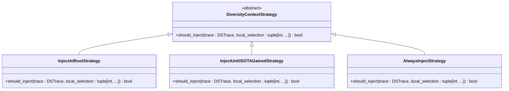

# 提案生成器

<cite>
**本文档中引用的文件**   
- [base.py](file://rdagent/scenarios/data_science/proposal/exp_gen/base.py)
- [proposal.py](file://rdagent/scenarios/data_science/proposal/exp_gen/proposal.py)
- [diversity_strategy.py](file://rdagent/scenarios/data_science/proposal/exp_gen/diversity_strategy.py)
- [idea_pool.py](file://rdagent/scenarios/data_science/proposal/exp_gen/idea_pool.py)
- [trace_scheduler.py](file://rdagent/scenarios/data_science/proposal/exp_gen/trace_scheduler.py)
- [merge.py](file://rdagent/scenarios/data_science/proposal/exp_gen/merge.py)
- [naive.py](file://rdagent/scenarios/data_science/proposal/exp_gen/naive.py)
- [prompts.yaml](file://rdagent/scenarios/data_science/proposal/exp_gen/prompts.yaml)
- [merge.yaml](file://rdagent/scenarios/data_science/proposal/exp_gen/merge.yaml)
- [naive.yaml](file://rdagent/scenarios/data_science/proposal/exp_gen/naive.yaml)
- [conf.py](file://rdagent/app/data_science/conf.py)
- [scen.py](file://rdagent/scenarios/data_science/scen/__init__.py)
</cite>

## 目录
1. [简介](#简介)
2. [核心组件](#核心组件)
3. [提案生成流程](#提案生成流程)
4. [多样性策略](#多样性策略)
5. [创意池管理](#创意池管理)
6. [提案调度机制](#提案调度机制)
7. [多轮实验结果合并](#多轮实验结果合并)
8. [提示词工程](#提示词工程)
9. [配置选项与使用模式](#配置选项与使用模式)
10. [调试与优化指南](#调试与优化指南)

## 简介
提案生成器（Proposal）是RD-Agent框架中的核心组件，负责在数据科学场景下生成、选择和优化实验假设。该系统通过多轮迭代的实验循环，结合大语言模型（LLM）的推理能力，自动生成高质量的解决方案。其核心功能包括：基于当前最佳实践生成初始假设（`HypothesisGen`）、从候选方案中选择最优路径（`select`模块）、整合多轮实验结果（`merge`机制）、确保探索多样性的策略（`diversity_strategy.py`）、管理假设生命周期的创意池（`idea_pool.py`），以及调度提案执行的机制（`trace_scheduler.py`）。本文件将全面阐述这些组件的工作原理与实现细节。

## 核心组件

提案生成器的核心由多个协同工作的模块构成。`HypothesisGen`负责生成初始假设，`select`模块实现候选方案的选择，`merge`机制处理多轮实验结果的整合。`diversity_strategy.py`确保探索的多样性，`idea_pool.py`管理假设的生命周期，`trace_scheduler.py`则调度提案的执行。这些组件共同构成了一个完整的自动化实验生成框架。

**本节来源**
- [base.py](file://rdagent/scenarios/data_science/proposal/exp_gen/base.py#L1-L349)
- [proposal.py](file://rdagent/scenarios/data_science/proposal/exp_gen/proposal.py#L1-L1502)

## 提案生成流程

提案生成流程始于`HypothesisGen`模块，该模块根据当前场景和历史实验反馈生成新的假设。`DSProposalV2ExpGen`类是主要的假设生成器，它通过分析场景问题和反馈问题来识别改进挑战，并生成相应的假设。流程包括识别场景问题、识别反馈问题、综合问题识别、生成假设、批判和重写假设等步骤。`hypothesis_gen`方法生成假设，`hypothesis_critique`方法批判假设，`hypothesis_rewrite`方法重写假设。

**图表来源**
- [proposal.py](file://rdagent/scenarios/data_science/proposal/exp_gen/proposal.py#L150-L799)

**本节来源**
- [proposal.py](file://rdagent/scenarios/data_science/proposal/exp_gen/proposal.py#L150-L799)

## 多样性策略

多样性策略通过`diversity_strategy.py`文件实现，旨在确保探索的多样性。该文件定义了多种策略，包括`InjectAtRootStrategy`、`InjectUntilSOTAGainedStrategy`和`AlwaysInjectStrategy`。`InjectAtRootStrategy`仅在创建新子轨迹根时注入多样性上下文，`InjectUntilSOTAGainedStrategy`在当前子轨迹获得首个SOTA实验前持续注入多样性上下文，`AlwaysInjectStrategy`则始终注入多样性上下文。这些策略通过`should_inject`方法决定是否注入多样性上下文。

**图表来源**
- [diversity_strategy.py](file://rdagent/scenarios/data_science/proposal/exp_gen/diversity_strategy.py#L1-L69)

**本节来源**
- [diversity_strategy.py](file://rdagent/scenarios/data_science/proposal/exp_gen/diversity_strategy.py#L1-L69)

## 创意池管理

创意池管理通过`idea_pool.py`文件实现，用于管理假设的生命周期。`DSIdea`类表示一个创意，包含创意名称、方法、上下文和假设等属性。`DSKnowledgeBase`类是知识库，继承自`UndirectedGraph`，用于存储和管理创意。`add_idea`方法添加创意，`build_idea_pool`方法构建创意池，`sample_ideas`方法采样创意，`update_pickled_problem`方法更新已挑选的问题。

**图表来源**
- [idea_pool.py](file://rdagent/scenarios/data_science/proposal/exp_gen/idea_pool.py#L1-L186)

**本节来源**
- [idea_pool.py](file://rdagent/scenarios/data_science/proposal/exp_gen/idea_pool.py#L1-L186)

## 提案调度机制

提案调度机制通过`trace_scheduler.py`文件实现，负责调度提案的执行。`TraceScheduler`是抽象基类，定义了`next`方法。`BaseScheduler`是基础调度器，`RoundRobinScheduler`是轮询调度器，`ProbabilisticScheduler`是概率调度器，`TraceLengthScheduler`是轨迹长度调度器，`SOTABasedScheduler`是基于SOTA的调度器，`RandomScheduler`是随机调度器，`MCTSScheduler`是MCTS调度器。这些调度器通过`select`方法选择下一个要扩展的轨迹。

**图表来源**
- [trace_scheduler.py](file://rdagent/scenarios/data_science/proposal/exp_gen/trace_scheduler.py#L1-L444)

**本节来源**
- [trace_scheduler.py](file://rdagent/scenarios/data_science/proposal/exp_gen/trace_scheduler.py#L1-L444)

## 多轮实验结果合并

多轮实验结果合并通过`merge.py`文件实现，负责整合多轮实验的结果。`MergeExpGen`类是合并实验生成器，`ExpGen2Hypothesis`类是假设生成器，`ExpGen2TraceAndMerge`类是轨迹和合并生成器，`MergeExpGen_MultiTrace`类是多轨迹合并生成器，`ExpGen2TraceAndMergeV2`类是版本2的轨迹和合并生成器，`ExpGen2TraceAndMergeV3`类是版本3的轨迹和合并生成器。这些类通过`gen`方法生成合并实验。

**图表来源**
- [merge.py](file://rdagent/scenarios/data_science/proposal/exp_gen/merge.py#L1-L448)

**本节来源**
- [merge.py](file://rdagent/scenarios/data_science/proposal/exp_gen/merge.py#L1-L448)

## 提示词工程

提示词工程在引导LLM生成高质量提案中起着关键作用。`prompts.yaml`文件定义了各种提示词模板，包括`hypothesis_gen`、`direct_exp_gen`、`component_gen`等。这些模板通过系统提示和用户提示引导LLM生成假设和任务。`merge.yaml`文件定义了合并实验的提示词模板，`naive.yaml`文件定义了朴素实验生成的提示词模板。

**图表来源**
- [prompts.yaml](file://rdagent/scenarios/data_science/proposal/exp_gen/prompts.yaml#L1-L350)
- [merge.yaml](file://rdagent/scenarios/data_science/proposal/exp_gen/merge.yaml#L1-L122)
- [naive.yaml](file://rdagent/scenarios/data_science/proposal/exp_gen/naive.yaml#L1-L57)

**本节来源**
- [prompts.yaml](file://rdagent/scenarios/data_science/proposal/exp_gen/prompts.yaml#L1-L350)
- [merge.yaml](file://rdagent/scenarios/data_science/proposal/exp_gen/merge.yaml#L1-L122)
- [naive.yaml](file://rdagent/scenarios/data_science/proposal/exp_gen/naive.yaml#L1-L57)

## 配置选项与使用模式

配置选项通过`conf.py`文件定义，包括`DS_RD_SETTING`对象中的各种设置。这些设置控制提案生成器的行为，如`max_trace_num`控制最大轨迹数，`merge_hours`控制合并时间，`enable_knowledge_base`控制是否启用知识库等。在`KaggleScen`或`QlibScen`中的使用模式涉及初始化场景、生成假设、选择路径、执行实验和合并结果等步骤。

**图表来源**
- [conf.py](file://rdagent/app/data_science/conf.py#L1-L207)
- [scen.py](file://rdagent/scenarios/data_science/scen/__init__.py#L1-L290)

**本节来源**
- [conf.py](file://rdagent/app/data_science/conf.py#L1-L207)
- [scen.py](file://rdagent/scenarios/data_science/scen/__init__.py#L1-L290)

## 调试与优化指南

调试与优化指南包括如何调试提案生成逻辑和优化提示词。调试时应检查日志输出、验证假设生成、确认选择逻辑和验证合并结果。优化提示词时应确保提示词清晰、具体，避免模糊或笼统的描述，并根据反馈不断调整和改进提示词。

**本节来源**
- [base.py](file://rdagent/scenarios/data_science/proposal/exp_gen/base.py#L1-L349)
- [proposal.py](file://rdagent/scenarios/data_science/proposal/exp_gen/proposal.py#L1-L1502)
- [diversity_strategy.py](file://rdagent/scenarios/data_science/proposal/exp_gen/diversity_strategy.py#L1-L69)
- [idea_pool.py](file://rdagent/scenarios/data_science/proposal/exp_gen/idea_pool.py#L1-L186)
- [trace_scheduler.py](file://rdagent/scenarios/data_science/proposal/exp_gen/trace_scheduler.py#L1-L444)
- [merge.py](file://rdagent/scenarios/data_science/proposal/exp_gen/merge.py#L1-L448)