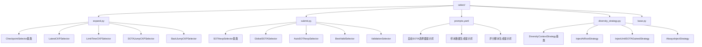
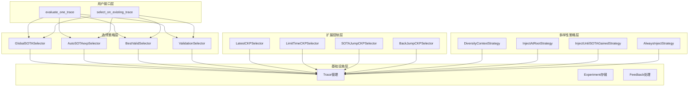
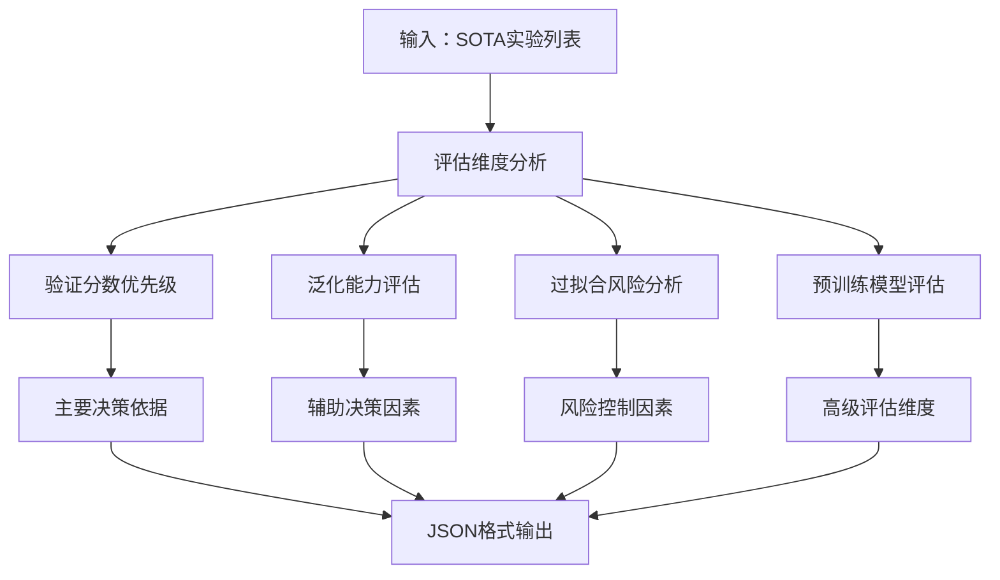
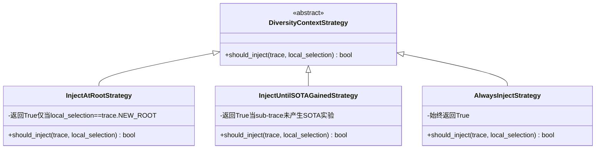
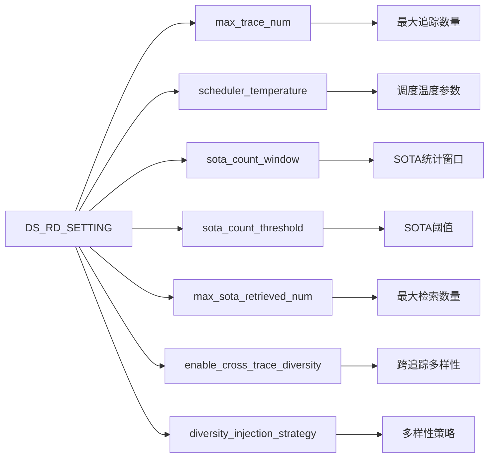
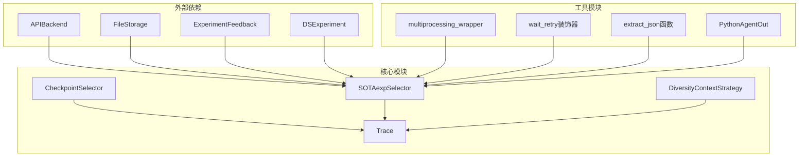

# 提案选择

<cite>
**本文档中引用的文件**
- [expand.py](file://rdagent/scenarios/data_science/proposal/exp_gen/select/expand.py)
- [submit.py](file://rdagent/scenarios/data_science/proposal/exp_gen/select/submit.py)
- [prompts.yaml](file://rdagent/scenarios/data_science/proposal/exp_gen/select/prompts.yaml)
- [diversity_strategy.py](file://rdagent/scenarios/data_science/proposal/exp_gen/diversity_strategy.py)
- [base.py](file://rdagent/scenarios/data_science/proposal/exp_gen/base.py)
- [conf.py](file://rdagent/app/data_science/conf.py)
- [scenario.py](file://rdagent/scenarios/kaggle/experiment/scenario.py)
</cite>

## 目录
1. [简介](#简介)
2. [项目结构概览](#项目结构概览)
3. [核心组件分析](#核心组件分析)
4. [架构概览](#架构概览)
5. [详细组件分析](#详细组件分析)
6. [依赖关系分析](#依赖关系分析)
7. [性能考虑](#性能考虑)
8. [故障排除指南](#故障排除指南)
9. [结论](#结论)

## 简介

提案选择模块是RD-Agent数据科学实验生成系统的核心组件，负责将初始假设扩展为可执行的实验方案，并对候选提案进行评分与筛选。该模块通过`expand.py`实现假设的扩展机制，通过`submit.py`实现候选提案的评估与选择，同时利用`prompts.yaml`中的提示词模板进行智能决策，通过`diversity_strategy.py`确保选中的提案在技术路径上具有互补性。

## 项目结构概览

提案选择模块位于`rdagent/scenarios/data_science/proposal/exp_gen/select/`目录下，包含以下关键文件：

**图表来源**
- [expand.py](file://rdagent/scenarios/data_science/proposal/exp_gen/select/expand.py#L1-L245)
- [submit.py](file://rdagent/scenarios/data_science/proposal/exp_gen/select/submit.py#L1-L878)
- [diversity_strategy.py](file://rdagent/scenarios/data_science/proposal/exp_gen/diversity_strategy.py#L1-L69)

**章节来源**
- [expand.py](file://rdagent/scenarios/data_science/proposal/exp_gen/select/expand.py#L1-L50)
- [submit.py](file://rdagent/scenarios/data_science/proposal/exp_gen/select/submit.py#L1-L50)

## 核心组件分析

### 假设扩展机制（expand.py）

假设扩展机制通过多种检查点选择器（CheckpointSelector）实现不同策略的实验扩展：

#### LatestCKPSelector
- **功能**：从最新的试验开始继续当前子追踪
- **适用场景**：保持实验连续性，避免频繁重启
- **实现特点**：返回`(-1,)`表示使用最新试验

#### LimitTimeCKPSelector
- **功能**：基于时间限制的子追踪切换机制
- **核心逻辑**：
  - 计算每个子追踪的时间配额
  - 监控当前子追踪的执行时间
  - 超时时启动新的子追踪
- **配置参数**：
  - `MAX_TRACE_NUM`：最大子追踪数量
  - `time_limit_pre_trace`：每个追踪的时间限制

#### SOTAJumpCKPSelector
- **功能**：基于最优解统计的跳跃策略
- **算法逻辑**：
  - 在指定窗口内统计最优解数量
  - 达到阈值时继续当前追踪
  - 未达到阈值时启动新追踪
- **关键参数**：
  - `SOTA_COUNT_WINDOW`：统计窗口大小
  - `SOTA_COUNT_THRESHOLD`：最优解阈值

#### BackJumpCKPSelector
- **功能**：回溯跳跃策略，结合概率选择
- **决策逻辑**：
  - 低于阈值时有50%概率重启新追踪
  - 50%概率回溯到最近的最优解
  - 支持复杂的实验路径优化

**章节来源**
- [expand.py](file://rdagent/scenarios/data_science/proposal/exp_gen/select/expand.py#L10-L245)

### 候选提案评估与选择（submit.py）

候选提案评估系统提供了多层次的选择策略：

#### SOTAexpSelector基类
- **功能**：所有SOTA实验选择器的抽象基类
- **核心方法**：`get_sota_exp_to_submit()`定义具体选择逻辑

#### GlobalSOTASelector
- **策略**：全局最优选择
- **实现**：从整个追踪历史中选择最佳实验
- **优势**：简单直接，适合稳定场景

#### AutoSOTAexpSelector
- **智能选择**：基于LLM的自动化选择
- **工作流程**：
  1. 收集SOTA候选实验
  2. 构建LLM提示词
  3. 使用LLM进行综合评估
  4. 返回最优选择
- **评估维度**：
  - 验证分数（Valid Score）
  - 泛化能力（Generalizability）
  - 过拟合风险（Overfitting Risk）
  - 预训练模型质量
  - 微调策略有效性

#### BestValidSelector
- **功能**：基于验证分数的最佳选择
- **配置选项**：
  - `num_candidates`：候选数量
  - `use_decision`：是否考虑决策反馈
  - `each_trace`：是否按分支选择
- **排序策略**：优先考虑决策反馈，然后是验证分数

#### ValidationSelector
- **功能**：验证重测选择器
- **核心机制**：
  - 生成一致性验证数据集
  - 重新运行所有候选实验
  - 基于重测结果选择最优
- **验证流程**：
  1. 准备验证脚本
  2. 并行处理多个候选实验
  3. 解析验证和测试分数
  4. 返回最佳实验

**章节来源**
- [submit.py](file://rdagent/scenarios/data_science/proposal/exp_gen/select/submit.py#L40-L878)

## 架构概览

提案选择系统采用分层架构设计，支持多种选择策略的灵活组合：

**图表来源**
- [submit.py](file://rdagent/scenarios/data_science/proposal/exp_gen/select/submit.py#L700-L878)
- [expand.py](file://rdagent/scenarios/data_science/proposal/exp_gen/select/expand.py#L10-L100)

## 详细组件分析

### 方案评估提示词设计（prompts.yaml）

`prompts.yaml`文件定义了用于方案评估的提示词模板，重点关注Kaggle竞赛场景下的评估维度：

#### 自动SOTA选择器提示词

**图表来源**
- [prompts.yaml](file://rdagent/scenarios/data_science/proposal/exp_gen/select/prompts.yaml#L1-L114)

#### 评估维度详解

1. **验证分数作为首要标准**
   - 验证分数是最关键的信息
   - 优先考虑高验证分数的实验
   - 在分数接近时考虑其他维度

2. **泛化能力评估**
   - 数据多样性：利用更多样化的数据或输入模态
   - 稳定性：收敛快、效率高的解决方案
   - 特征学习：学习通用、鲁棒特征的能力

3. **过拟合风险控制**
   - 激进微调的风险识别
   - 正则化技术的应用
   - 跨验证稳定性评估

4. **预训练模型评估**
   - 预训练质量与表征能力
   - 多模态预训练的优势
   - 现代骨干网络的偏好

**章节来源**
- [prompts.yaml](file://rdagent/scenarios/data_science/proposal/exp_gen/select/prompts.yaml#L1-L114)

### 多样性策略协同机制（diversity_strategy.py）

多样性策略确保选中的提案在技术路径上具有互补性：

#### DiversityContextStrategy基类

**图表来源**
- [diversity_strategy.py](file://rdagent/scenarios/data_science/proposal/exp_gen/diversity_strategy.py#L8-L69)

#### 策略对比分析

| 策略名称 | 触发条件 | 适用场景 | 优势 |
|---------|---------|---------|------|
| InjectAtRootStrategy | 新建根节点时 | 初始探索阶段 | 控制多样性注入时机 |
| InjectUntilSOTAGainedStrategy | 未获得SOTA时 | 探索不足时 | 确保充分探索 |
| AlwaysInjectStrategy | 总是触发 | 全局多样性维护 | 最大化多样性 |

**章节来源**
- [diversity_strategy.py](file://rdagent/scenarios/data_science/proposal/exp_gen/diversity_strategy.py#L1-L69)

### 配置参数与权重设置

#### 关键配置参数

**图表来源**
- [conf.py](file://rdagent/app/data_science/conf.py#L100-L200)

#### Kaggle竞赛类型动态调整

系统能够根据不同的Kaggle竞赛类型动态调整选择标准：

1. **竞赛类型识别**
   - 通过竞赛描述自动识别任务类型
   - 分类包括：分类、回归、聚类等
   - 评估指标方向判断

2. **动态参数调整**
   - 根据竞赛复杂度调整超参数
   - 适应不同数据规模的处理需求
   - 优化资源分配策略

3. **领域知识集成**
   - 利用历史竞赛经验
   - 集成特定领域的最佳实践
   - 支持领域专家的定制化配置

**章节来源**
- [scenario.py](file://rdagent/scenarios/kaggle/experiment/scenario.py#L42-L130)

## 依赖关系分析

提案选择系统的依赖关系体现了清晰的分层架构：

**图表来源**
- [submit.py](file://rdagent/scenarios/data_science/proposal/exp_gen/select/submit.py#L1-L30)
- [expand.py](file://rdagent/scenarios/data_science/proposal/exp_gen/select/expand.py#L1-L20)

**章节来源**
- [submit.py](file://rdagent/scenarios/data_science/proposal/exp_gen/select/submit.py#L1-L50)
- [expand.py](file://rdagent/scenarios/data_science/proposal/exp_gen/select/expand.py#L1-L50)

## 性能考虑

### 并行处理优化

提案选择系统实现了多项性能优化措施：

1. **多进程并行验证**
   - 使用`multiprocessing_wrapper`并行处理候选实验
   - 动态调整工作进程数量
   - 支持超时控制和错误恢复

2. **缓存机制**
   - 实验结果缓存避免重复计算
   - LLM响应缓存减少API调用
   - 中间结果持久化

3. **资源管理**
   - 内存使用监控和优化
   - 文件系统清理机制
   - 异常情况下的资源释放

### 时间复杂度分析

| 组件 | 时间复杂度 | 空间复杂度 | 优化策略 |
|------|-----------|-----------|----------|
| 扩展选择器 | O(n) | O(1) | 状态机模式 |
| SOTA选择器 | O(k log k) | O(k) | 排序优化 |
| 多样性策略 | O(m) | O(1) | 策略模式 |
| 验证选择器 | O(k×p) | O(k+p) | 并行处理 |

其中：n=追踪长度，k=候选数量，m=策略状态数，p=并行进程数

## 故障排除指南

### 常见问题及解决方案

#### 1. LLM选择失败
**症状**：AutoSOTAexpSelector无法生成有效选择
**原因**：Token限制或LLM响应格式错误
**解决方案**：
- 检查`LLM_SETTINGS.chat_token_limit`
- 验证JSON格式输出
- 增加重试次数配置

#### 2. 验证失败
**症状**：ValidationSelector无法完成验证
**原因**：数据生成或评分脚本错误
**解决方案**：
- 检查数据路径和权限
- 验证脚本语法正确性
- 调整超时设置

#### 3. 多样性策略冲突
**症状**：enable_cross_trace_diversity与llm_select_hypothesis同时启用
**原因**：配置冲突
**解决方案**：
- 确保两个选项不同时启用
- 根据需求选择合适的策略组合

**章节来源**
- [submit.py](file://rdagent/scenarios/data_science/proposal/exp_gen/select/submit.py#L100-L200)
- [conf.py](file://rdagent/app/data_science/conf.py#L200-L207)

## 结论

提案选择模块通过精心设计的多层次架构，实现了高效、智能的实验方案选择机制。其核心优势包括：

1. **灵活性**：支持多种选择策略的组合和动态调整
2. **智能化**：集成LLM进行智能评估和决策
3. **多样性**：通过专门的策略确保技术路径的互补性
4. **可扩展性**：模块化设计便于功能扩展和定制

该系统在Kaggle竞赛场景下表现出色，能够根据竞赛类型动态调整选择标准，为数据科学实验提供了强有力的支持。通过合理的配置和优化，可以显著提升实验效率和成功率。