# 提示词工程

<cite>
**本文档中引用的文件**
- [rdagent/components/proposal/prompts.yaml](file://rdagent/components/proposal/prompts.yaml)
- [rdagent/scenarios/data_science/proposal/exp_gen/prompts_v2.yaml](file://rdagent/scenarios/data_science/proposal/exp_gen/prompts_v2.yaml)
- [rdagent/scenarios/data_science/proposal/exp_gen/prompts.yaml](file://rdagent/scenarios/data_science/proposal/exp_gen/prompts.yaml)
- [rdagent/scenarios/data_science/proposal/exp_gen/draft/prompts_draft.yaml](file://rdagent/scenarios/data_science/proposal/exp_gen/draft/prompts_draft.yaml)
- [rdagent/core/prompts.py](file://rdagent/core/prompts.py)
- [rdagent/utils/agent/tpl.py](file://rdagent/utils/agent/tpl.py)
- [rdagent/scenarios/data_science/proposal/exp_gen/base.py](file://rdagent/scenarios/data_science/proposal/exp_gen/base.py)
</cite>

## 目录
1. [简介](#简介)
2. [项目结构概览](#项目结构概览)
3. [核心组件分析](#核心组件分析)
4. [架构概览](#架构概览)
5. [详细组件分析](#详细组件分析)
6. [版本演进对比](#版本演进对比)
7. [模板继承机制](#模板继承机制)
8. [关键提示词设计](#关键提示词设计)
9. [调试与测试最佳实践](#调试与测试最佳实践)
10. [性能考虑](#性能考虑)
11. [故障排除指南](#故障排除指南)
12. [结论](#结论)

## 简介

提示词工程是RD-Agent提案生成器的核心技术，通过精心设计的提示词模板引导大语言模型生成高质量的实验假设和解决方案。本文档系统性地分析了`prompts.yaml`系列文件在提案生成过程中的核心作用，对比了不同版本的结构演进，并提供了完整的调试和优化指南。

## 项目结构概览

RD-Agent的提示词工程采用分层架构设计，主要包含以下层次：

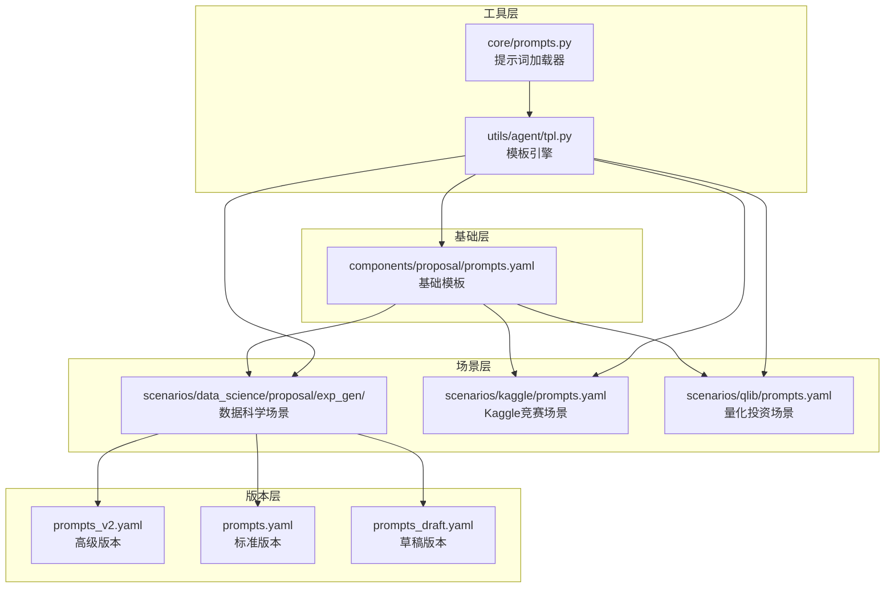

**图表来源**
- [rdagent/components/proposal/prompts.yaml](file://rdagent/components/proposal/prompts.yaml#L1-L65)
- [rdagent/scenarios/data_science/proposal/exp_gen/prompts_v2.yaml](file://rdagent/scenarios/data_science/proposal/exp_gen/prompts_v2.yaml#L1-L50)
- [rdagent/core/prompts.py](file://rdagent/core/prompts.py#L1-L20)

## 核心组件分析

### 基础提示词组件

RD-Agent的核心提示词组件分为以下几个关键部分：

| 组件名称 | 功能描述 | 主要用途 |
|---------|----------|----------|
| `hypothesis_gen` | 假设生成 | 引导LLM分析历史实验，生成新的研究假设 |
| `hypothesis2experiment` | 假设到实验转换 | 将抽象假设转化为具体的实验任务 |
| `task_gen` | 任务生成 | 设计详细的实验实施方案 |
| `problem_identification` | 问题识别 | 从历史经验中提取关键挑战 |

**章节来源**
- [rdagent/components/proposal/prompts.yaml](file://rdagent/components/proposal/prompts.yaml#L1-L65)

### 场景特定组件

不同应用场景下的提示词组件具有针对性的设计：

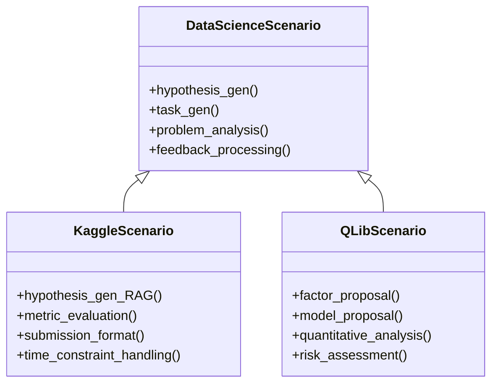

**图表来源**
- [rdagent/scenarios/data_science/proposal/exp_gen/prompts_v2.yaml](file://rdagent/scenarios/data_science/proposal/exp_gen/prompts_v2.yaml#L1-L100)
- [rdagent/scenarios/kaggle/prompts.yaml](file://rdagent/scenarios/kaggle/prompts.yaml#L1-L50)

## 架构概览

RD-Agent的提示词架构采用模板继承和动态渲染机制：

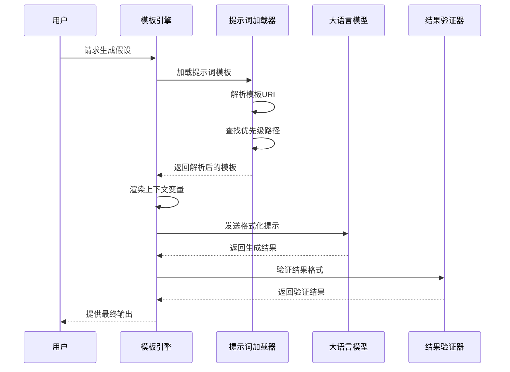

**图表来源**
- [rdagent/utils/agent/tpl.py](file://rdagent/utils/agent/tpl.py#L1-L149)
- [rdagent/core/prompts.py](file://rdagent/core/prompts.py#L1-L20)

## 详细组件分析

### 假设生成组件

假设生成是提案生成的核心环节，通过分析历史实验和当前挑战来生成新的研究方向：

#### 基础假设生成流程

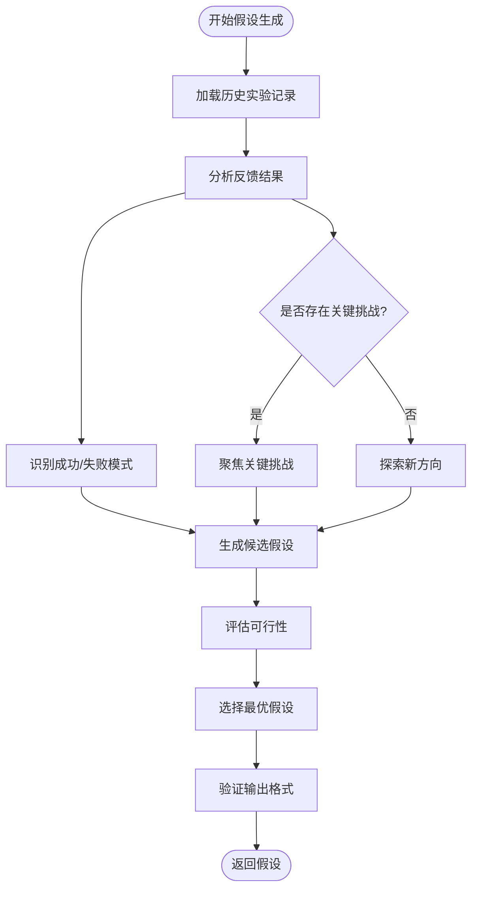

**图表来源**
- [rdagent/components/proposal/prompts.yaml](file://rdagent/components/proposal/prompts.yaml#L1-L20)

#### 高级假设生成（prompts_v2.yaml）

prompts_v2.yaml引入了更复杂的假设生成机制，支持多维度评估和多样化策略：

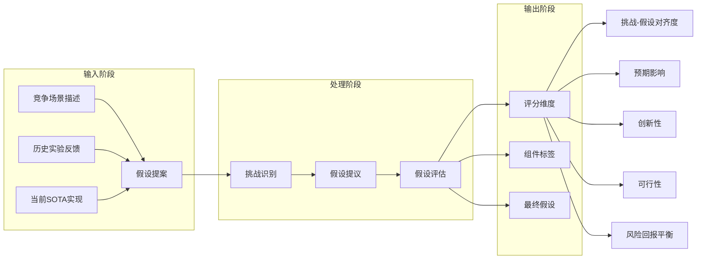

**图表来源**
- [rdagent/scenarios/data_science/proposal/exp_gen/prompts_v2.yaml](file://rdagent/scenarios/data_science/proposal/exp_gen/prompts_v2.yaml#L150-L300)

**章节来源**
- [rdagent/scenarios/data_science/proposal/exp_gen/prompts_v2.yaml](file://rdagent/scenarios/data_science/proposal/exp_gen/prompts_v2.yaml#L150-L400)

### 任务生成组件

任务生成负责将抽象的假设转化为具体的实验实施方案：

#### 任务生成决策树

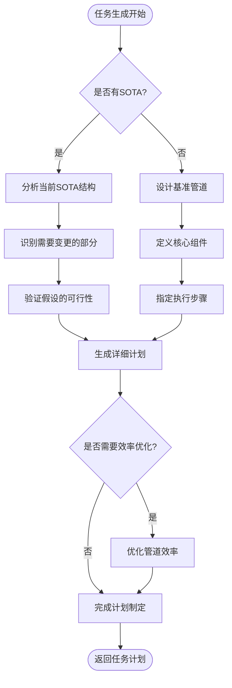

**图表来源**
- [rdagent/scenarios/data_science/proposal/exp_gen/prompts_v2.yaml](file://rdagent/scenarios/data_science/proposal/exp_gen/prompts_v2.yaml#L600-L800)

**章节来源**
- [rdagent/scenarios/data_science/proposal/exp_gen/prompts_v2.yaml](file://rdagent/scenarios/data_science/proposal/exp_gen/prompts_v2.yaml#L600-L900)

## 版本演进对比

### prompts.yaml vs prompts_v2.yaml 对比

| 特性 | prompts.yaml | prompts_v2.yaml |
|------|-------------|-----------------|
| **角色定义** | 基础的用户-助手对话 | 明确的数据科学家角色定位 |
| **输出格式** | 较宽松的格式要求 | 严格的JSON Schema输出 |
| **评估维度** | 基础的功能性评估 | 五个维度的全面评估体系 |
| **多样性控制** | 基础的多样性检查 | 完善的并行探索多样性机制 |
| **时间约束** | 基础的时间管理 | 精细化的资源分配策略 |
| **组件标签** | 简单的组件分类 | 详细的组件边界定义 |

### 关键改进点

#### 1. 更清晰的角色定义

prompts_v2.yaml引入了明确的角色定位：
- **世界一流的Data Scientist**: 强调专家级的专业知识
- **统计学、数学和计算机科学的深度理解**: 明确知识背景要求
- **复杂现实问题的解决能力**: 突出实际应用导向

#### 2. 更严格的输出格式

prompts_v2.yaml采用了严格的JSON Schema格式：
- **组件标签标准化**: 统一的组件分类体系
- **评分维度规范化**: 五个维度的评分体系
- **输出结构一致性**: 确保结果的可解析性

#### 3. 增强的多样性控制

prompts_v2.yaml实现了完善的多样性机制：
- **并行探索优化**: 支持多个独立的探索轨迹
- **兄弟假设检查**: 避免重复的解决方案
- **跨轨迹协调**: 确保探索空间的有效覆盖

**章节来源**
- [rdagent/scenarios/data_science/proposal/exp_gen/prompts_v2.yaml](file://rdagent/scenarios/data_science/proposal/exp_gen/prompts_v2.yaml#L1-L200)

## 模板继承机制

### 继承层次结构

RD-Agent采用多层级的模板继承机制：

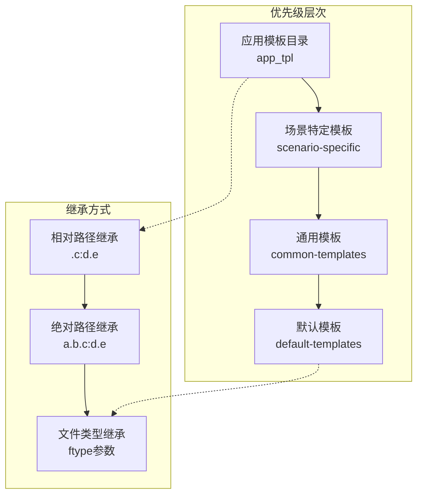

**图表来源**
- [rdagent/utils/agent/tpl.py](file://rdagent/utils/agent/tpl.py#L30-L80)

### 模板加载优先级

模板加载遵循严格的优先级顺序：

1. **应用模板目录**: 优先查找应用级别的自定义模板
2. **场景特定模板**: 查找针对特定场景的定制模板
3. **通用模板**: 使用通用的基础模板
4. **默认模板**: 最终回退到框架提供的默认模板

### 继承语法

模板继承使用灵活的URI语法：

- `.c:d.e`: 当前目录下的c.yaml文件中d.e节点
- `a.b.c:d.e`: 路径a/b/c.yaml文件中d.e节点
- `a.b.c:ftype=txt`: 指定文件类型为文本

**章节来源**
- [rdagent/utils/agent/tpl.py](file://rdagent/utils/agent/tpl.py#L1-L149)

## 关键提示词设计

### 可验证假设的引导机制

提示词设计特别注重生成可验证的假设：

#### 假设特异性原则

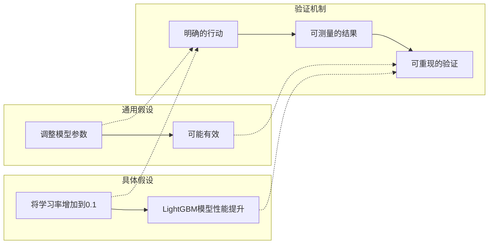

#### 避免不切实际代码的机制

提示词通过以下方式确保假设的可行性：

1. **资源约束检查**: 考虑计算资源限制
2. **时间预算评估**: 确保在比赛时间范围内可执行
3. **数据可用性验证**: 基于实际数据特征提出假设
4. **渐进式复杂度**: 从简单方案开始逐步优化

### 组件标签系统

prompts_v2.yaml引入了详细的组件标签系统：

| 组件标签 | 描述 | 示例 |
|---------|------|------|
| `DataLoadSpec` | 数据加载规范 | 修复zipfile.BadZipFile错误 |
| `FeatureEng` | 特征工程 | 数据预处理和特征变换 |
| `Model` | 模型构建 | 模型选择、调优或移除 |
| `Ensemble` | 集成策略 | 多模型集成方法 |
| `Workflow` | 工作流集成 | 端到端管道协调 |

**章节来源**
- [rdagent/scenarios/data_science/proposal/exp_gen/prompts_v2.yaml](file://rdagent/scenarios/data_science/proposal/exp_gen/prompts_v2.yaml#L200-L300)

## 调试与测试最佳实践

### rdagent debug命令使用

RD-Agent提供了专门的调试命令来测试提示词效果：

#### 局部测试流程

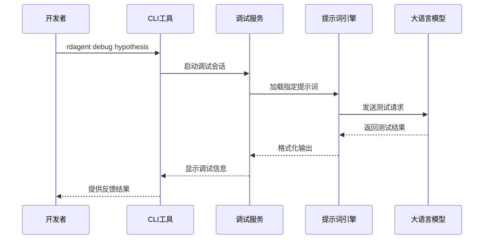

**图表来源**
- [rdagent/log/server/debug_app.py](file://rdagent/log/server/debug_app.py#L1-L50)

### prompts_draft.yaml的A/B测试

prompts_draft.yaml专门用于假设生成的A/B测试：

#### 草稿版本特点

1. **简化的目标**: 专注于创建第一个可运行的基准
2. **模板驱动**: 基于成功的竞赛解决方案模板
3. **失败分析**: 从历史失败中提取教训
4. **快速验证**: 确保管道的正确性和可运行性

#### A/B测试策略

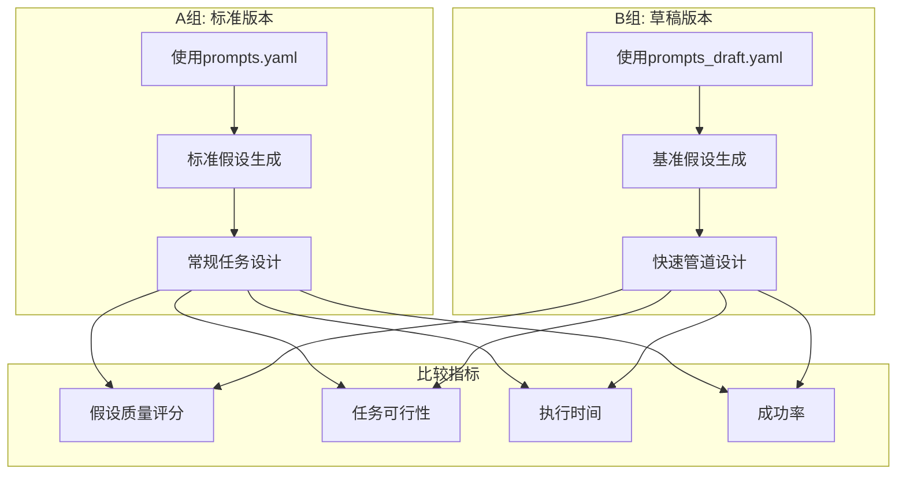

**图表来源**
- [rdagent/scenarios/data_science/proposal/exp_gen/draft/prompts_draft.yaml](file://rdagent/scenarios/data_science/proposal/exp_gen/draft/prompts_draft.yaml#L1-L100)

### 评估反馈迭代优化

提示词优化采用闭环反馈机制：

#### 反馈循环流程

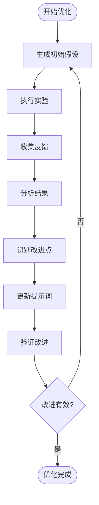

#### 迭代优化策略

1. **定量指标跟踪**: 记录假设质量和执行成功率
2. **定性反馈收集**: 分析专家评审意见
3. **自动化评估**: 开发自动化的质量评估工具
4. **人工验证**: 保留人工审核的关键环节

**章节来源**
- [rdagent/scenarios/data_science/proposal/exp_gen/draft/prompts_draft.yaml](file://rdagent/scenarios/data_science/proposal/exp_gen/draft/prompts_draft.yaml#L100-L200)

## 性能考虑

### 提示词优化策略

为了确保提示词工程的高效运行，采用了多种优化策略：

#### 内存管理

- **延迟加载**: 按需加载提示词模板
- **缓存机制**: 缓存常用的模板内容
- **垃圾回收**: 及时释放不再使用的模板实例

#### 计算优化

- **并行处理**: 支持多个提示词同时处理
- **批处理**: 批量处理相似的提示词请求
- **智能调度**: 根据资源状况动态调整处理优先级

#### 网络优化

- **本地缓存**: 减少网络请求次数
- **压缩传输**: 压缩模板数据传输
- **断线重连**: 自动处理网络异常

## 故障排除指南

### 常见问题及解决方案

#### 提示词加载失败

**症状**: 提示词文件无法加载或解析错误

**解决方案**:
1. 检查文件路径是否正确
2. 验证YAML语法格式
3. 确认文件编码为UTF-8
4. 检查文件权限设置

#### 模板渲染错误

**症状**: Jinja2模板渲染失败

**解决方案**:
1. 验证上下文字典完整性
2. 检查模板语法正确性
3. 确认变量名拼写无误
4. 添加适当的错误处理逻辑

#### 输出格式不符合预期

**症状**: LLM返回的结果格式不正确

**解决方案**:
1. 检查JSON Schema定义
2. 验证输出格式说明
3. 测试不同的提示词变体
4. 调整模型参数设置

### 调试工具和技术

#### 日志记录

RD-Agent提供了详细的日志记录功能：

```python
# 日志配置示例
logger.log_object(
    obj={
        "uri": self.uri,
        "template": self.template,
        "context": context,
        "rendered": rendered,
    },
    tag="debug_tpl",
)
```

#### 单元测试

建议为关键提示词组件编写单元测试：

```python
# 测试示例
def test_hypothesis_generation():
    # 测试假设生成的基本功能
    pass

def test_template_inheritance():
    # 测试模板继承机制
    pass
```

**章节来源**
- [rdagent/utils/agent/tpl.py](file://rdagent/utils/agent/tpl.py#L130-L149)

## 结论

RD-Agent的提示词工程通过精心设计的多层次架构，实现了高效、可维护的假设生成系统。从基础的`prompts.yaml`到高级的`prompts_v2.yaml`，系统不断演进以满足更复杂的应用需求。

### 主要优势

1. **模块化设计**: 清晰的组件分离和职责划分
2. **灵活继承**: 支持多层次的模板继承机制
3. **严格验证**: 完善的质量控制和验证机制
4. **持续优化**: 基于反馈的迭代优化流程

### 未来发展方向

1. **智能化提示词**: 利用机器学习自动优化提示词
2. **多模态支持**: 扩展到图像、音频等多模态数据
3. **实时协作**: 支持团队协作的提示词开发
4. **性能监控**: 实时监控提示词系统的性能指标

通过持续的技术创新和实践优化，RD-Agent的提示词工程将继续为数据科学领域的研究和应用提供强有力的支持。