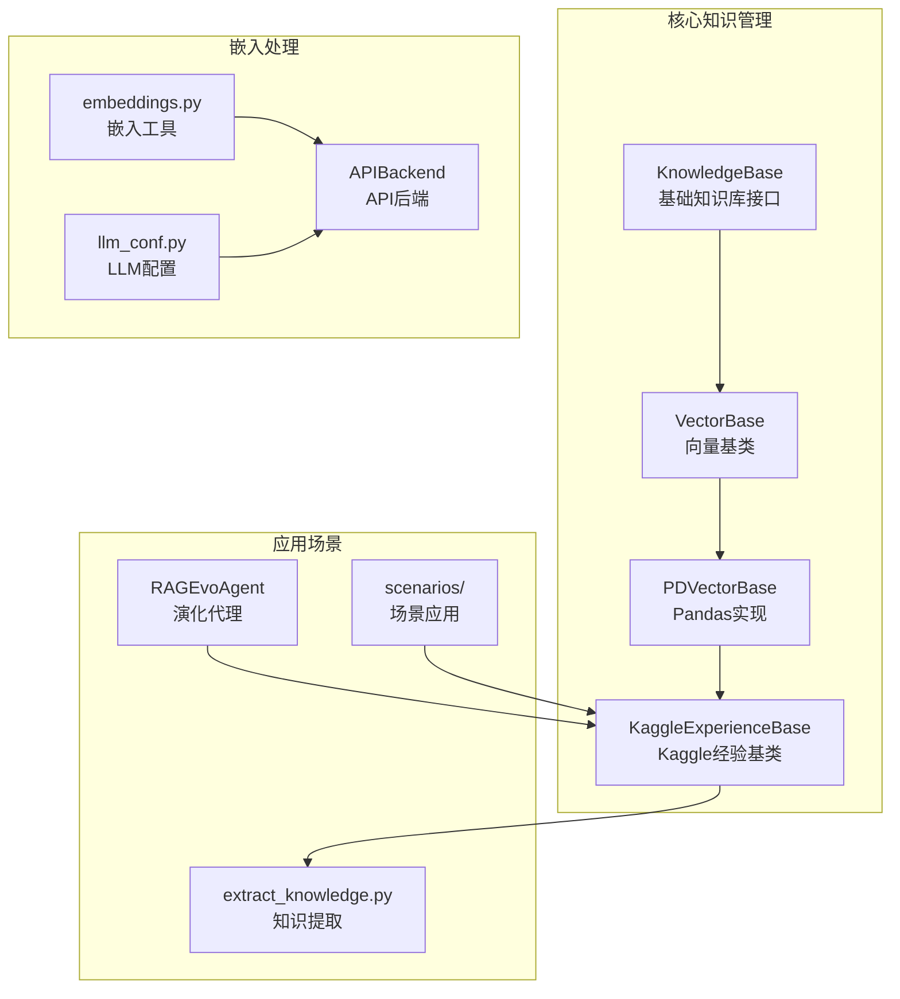
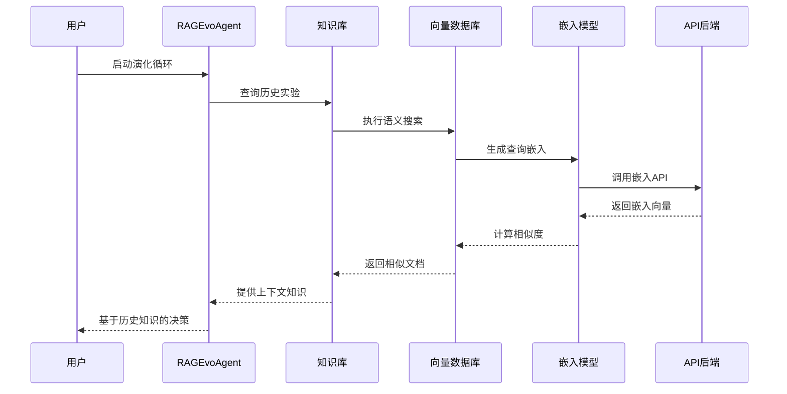
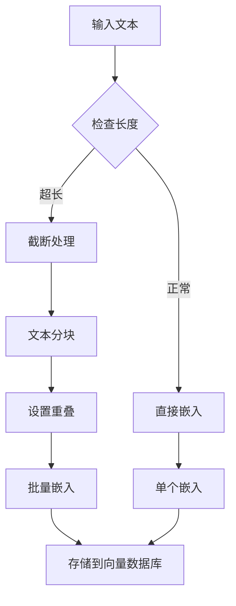
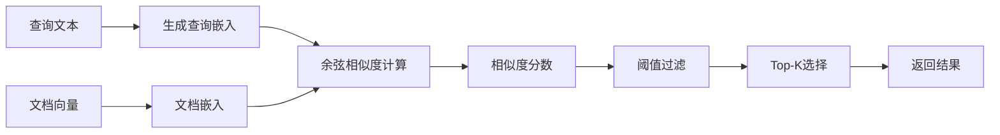
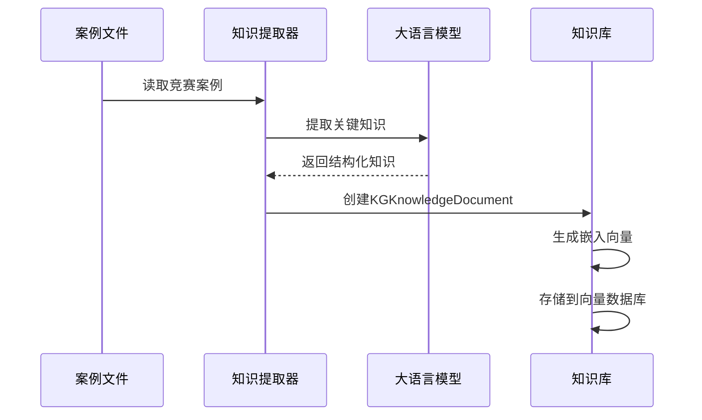
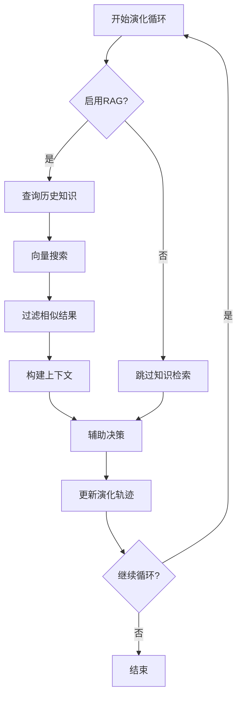
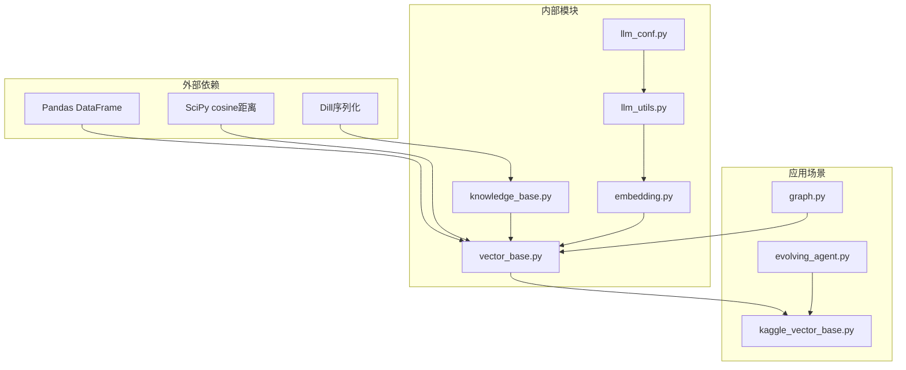

# 向量数据库技术文档

<cite>
**本文档引用的文件**
- [vector_base.py](file://rdagent/components/knowledge_management/vector_base.py)
- [knowledge_base.py](file://rdagent/core/knowledge_base.py)
- [llm_conf.py](file://rdagent/oai/llm_conf.py)
- [embedding.py](file://rdagent/oai/utils/embedding.py)
- [kaggle_vector_base.py](file://rdagent/scenarios/kaggle/knowledge_management/vector_base.py)
- [extract_knowledge.py](file://rdagent/scenarios/kaggle/knowledge_management/extract_knowledge.py)
- [evolving_agent.py](file://rdagent/core/evolving_agent.py)
- [graph.py](file://rdagent/components/knowledge_management/graph.py)
</cite>

## 目录
1. [简介](#简介)
2. [项目结构](#项目结构)
3. [核心组件](#核心组件)
4. [架构概览](#架构概览)
5. [详细组件分析](#详细组件分析)
6. [依赖关系分析](#依赖关系分析)
7. [性能考虑](#性能考虑)
8. [故障排除指南](#故障排除指南)
9. [结论](#结论)

## 简介

本文档详细介绍了RD-Agent系统中基于向量数据库的RAG（检索增强生成）模块实现。该系统通过ChromaDB或Faiss构建向量索引，支持大规模知识库的语义搜索和相似性检索。核心组件包括`KnowledgeBase`类、`VectorBase`类及其具体实现`PDVectorBase`，以及专门针对Kaggle竞赛场景的`KaggleExperienceBase`类。

系统采用分层架构设计，支持多种嵌入模型（由`oai.llm_conf`配置），提供灵活的文本分块策略和元数据过滤功能。在演化代理（RAGEvoAgent）中，该向量数据库为智能体提供历史实验上下文，支持基于相似性的知识检索和决策辅助。

## 项目结构

**图表来源**
- [knowledge_base.py](file://rdagent/core/knowledge_base.py#L1-L28)
- [vector_base.py](file://rdagent/components/knowledge_management/vector_base.py#L101-L209)
- [kaggle_vector_base.py](file://rdagent/scenarios/kaggle/knowledge_management/vector_base.py#L100-L312)

**章节来源**
- [vector_base.py](file://rdagent/components/knowledge_management/vector_base.py#L1-L209)
- [knowledge_base.py](file://rdagent/core/knowledge_base.py#L1-L28)

## 核心组件

### KnowledgeMetaData类

`KnowledgeMetaData`是系统的核心数据结构，负责存储和管理知识元数据：

- **内容管理**：支持文本内容存储和分块处理
- **嵌入生成**：自动调用APIBackend生成文本嵌入
- **唯一标识**：使用UUID确保每个文档的唯一性
- **分块策略**：支持可配置的文本分块大小和重叠

### VectorBase抽象类

定义了向量数据库的基本操作接口：

- **添加功能**：支持单个或批量文档添加
- **搜索功能**：基于语义相似度的向量搜索
- **约束过滤**：支持标签和相似度阈值过滤

### PDVectorBase实现

基于Pandas的数据结构实现：

- **DataFrame存储**：使用Pandas DataFrame存储向量数据
- **内存管理**：高效的内存使用和数据访问
- **批处理支持**：支持大规模数据的批处理操作

**章节来源**
- [vector_base.py](file://rdagent/components/knowledge_management/vector_base.py#L15-L100)
- [vector_base.py](file://rdagent/components/knowledge_management/vector_base.py#L101-L209)

## 架构概览

**图表来源**
- [evolving_agent.py](file://rdagent/core/evolving_agent.py#L65-L85)
- [vector_base.py](file://rdagent/components/knowledge_management/vector_base.py#L167-L207)

## 详细组件分析

### 文本预处理和分块

系统实现了智能的文本预处理流程：

**图表来源**
- [vector_base.py](file://rdagent/components/knowledge_management/vector_base.py#L25-L45)
- [embedding.py](file://rdagent/oai/utils/embedding.py#L50-L90)

#### 分块策略

- **固定大小分块**：默认1000字符，支持自定义调整
- **重叠机制**：相邻分块间设置重叠区域，保持语义连续性
- **动态调整**：根据嵌入模型的最大token限制自动调整

#### 嵌入模型配置

系统支持多种嵌入模型，通过`oai.llm_conf`进行配置：

| 配置项 | 默认值 | 描述 |
|--------|--------|------|
| embedding_model | text-embedding-3-small | 主要嵌入模型 |
| embedding_max_length | 8192 | 最大文本长度 |
| embedding_max_str_num | 50 | 单次请求最大字符串数 |

**章节来源**
- [vector_base.py](file://rdagent/components/knowledge_management/vector_base.py#L25-L45)
- [llm_conf.py](file://rdagent/oai/llm_conf.py#L60-L70)

### 语义搜索实现

#### 相似度计算

系统采用余弦相似度进行语义匹配：

**图表来源**
- [vector_base.py](file://rdagent/components/knowledge_management/vector_base.py#L190-L207)

#### 搜索参数

| 参数 | 类型 | 默认值 | 描述 |
|------|------|--------|------|
| topk_k | int \| None | None | 返回的最相似结果数量 |
| similarity_threshold | float | 0 | 相似度阈值 |
| constraint_labels | list[str] \| None | None | 标签约束列表 |

**章节来源**
- [vector_base.py](file://rdagent/components/knowledge_management/vector_base.py#L167-L207)

### Kaggle专用扩展

#### KGKnowledgeDocument类

专门为Kaggle竞赛场景设计的知识文档类：

- **竞赛元数据**：存储竞赛名称、任务类别、领域等信息
- **评分系统**：支持排名和分数的存储
- **实体关系**：支持知识图谱实体和关系的存储

#### 知识提取流程

**图表来源**
- [extract_knowledge.py](file://rdagent/scenarios/kaggle/knowledge_management/extract_knowledge.py#L15-L35)
- [kaggle_vector_base.py](file://rdagent/scenarios/kaggle/knowledge_management/vector_base.py#L127-L180)

**章节来源**
- [kaggle_vector_base.py](file://rdagent/scenarios/kaggle/knowledge_management/vector_base.py#L15-L100)
- [extract_knowledge.py](file://rdagent/scenarios/kaggle/knowledge_management/extract_knowledge.py#L1-L65)

### RAGEvoAgent集成

#### 演化循环中的知识检索

**图表来源**
- [evolving_agent.py](file://rdagent/core/evolving_agent.py#L65-L85)

#### 上下文注入机制

在每次演化步骤中，系统会：
1. 查询与当前实验相似的历史实验
2. 过滤出高相似度的结果
3. 将相关知识注入到当前决策过程中
4. 支持基于历史经验的学习和改进

**章节来源**
- [evolving_agent.py](file://rdagent/core/evolving_agent.py#L48-L115)

## 依赖关系分析

**图表来源**
- [vector_base.py](file://rdagent/components/knowledge_management/vector_base.py#L1-L10)
- [knowledge_base.py](file://rdagent/core/knowledge_base.py#L1-L5)

**章节来源**
- [vector_base.py](file://rdagent/components/knowledge_management/vector_base.py#L1-L10)
- [knowledge_base.py](file://rdagent/core/knowledge_base.py#L1-L28)

## 性能考虑

### 索引优化策略

#### 内存管理

- **分批处理**：避免一次性加载大量数据到内存
- **增量更新**：支持知识库的增量更新，减少全量重建开销
- **缓存机制**：嵌入结果缓存，避免重复计算

#### 查询优化

- **相似度阈值**：通过设置合理的相似度阈值减少不必要的计算
- **Top-K剪枝**：只保留最相关的前K个结果
- **标签过滤**：利用标签约束快速缩小搜索范围

### 大规模知识库处理

#### 数据分片策略

对于大规模知识库，建议采用以下策略：

1. **水平分片**：按时间或主题将知识库分割
2. **垂直分片**：分离高频查询字段和低频元数据
3. **混合策略**：结合时间和内容特征进行分片

#### 索引类型选择

| 场景 | 推荐索引类型 | 优势 | 适用条件 |
|------|-------------|------|----------|
| 小规模知识库 | 简单向量索引 | 实现简单，查询快 | < 10万条记录 |
| 中等规模 | HNSW索引 | 平衡准确性和速度 | 10万-100万条记录 |
| 大规模 | IVF索引 | 内存效率高 | > 100万条记录 |

### 嵌入模型优化

#### 微调策略

- **领域适应**：在特定领域的语料上微调嵌入模型
- **多任务学习**：同时训练多个相关任务提升泛化能力
- **对比学习**：使用对比学习增强语义表示

#### 缓存和批处理

- **嵌入缓存**：缓存常用文本的嵌入向量
- **批量处理**：将多个查询合并为批量请求
- **异步处理**：使用异步方式处理嵌入生成

## 故障排除指南

### 常见问题及解决方案

#### 嵌入生成失败

**问题症状**：
- API调用超时
- 嵌入维度不匹配
- 文本编码错误

**解决方案**：
1. 检查API密钥配置
2. 验证文本长度是否超过限制
3. 使用文本截断工具处理超长文本

#### 搜索结果质量差

**问题症状**：
- 相似度分数过低
- 结果与查询无关
- 搜索速度过慢

**解决方案**：
1. 调整相似度阈值
2. 优化查询文本的质量
3. 考虑使用更高质量的嵌入模型

#### 内存使用过高

**问题症状**：
- 系统内存不足
- 查询响应缓慢
- 程序频繁崩溃

**解决方案**：
1. 减少单次查询的文档数量
2. 实施数据分页加载
3. 使用更高效的向量存储格式

**章节来源**
- [embedding.py](file://rdagent/oai/utils/embedding.py#L50-L135)

## 结论

RD-Agent的向量数据库系统提供了一个完整、高效的知识检索解决方案。通过分层架构设计，系统支持从简单的本地存储到复杂的分布式部署的各种需求。主要特点包括：

1. **灵活的架构**：支持多种向量存储实现和嵌入模型
2. **智能的预处理**：自动化的文本分块和嵌入生成
3. **高效的搜索**：基于余弦相似度的语义匹配
4. **丰富的应用场景**：从通用知识管理到特定领域的专业应用

该系统为RD-Agent的智能演化提供了强大的知识支撑，使得智能体能够基于历史经验和相似案例做出更好的决策。随着知识库的不断增长和应用场景的扩展，系统将继续演进以满足更高的性能和功能要求。