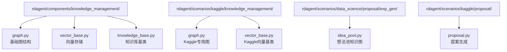
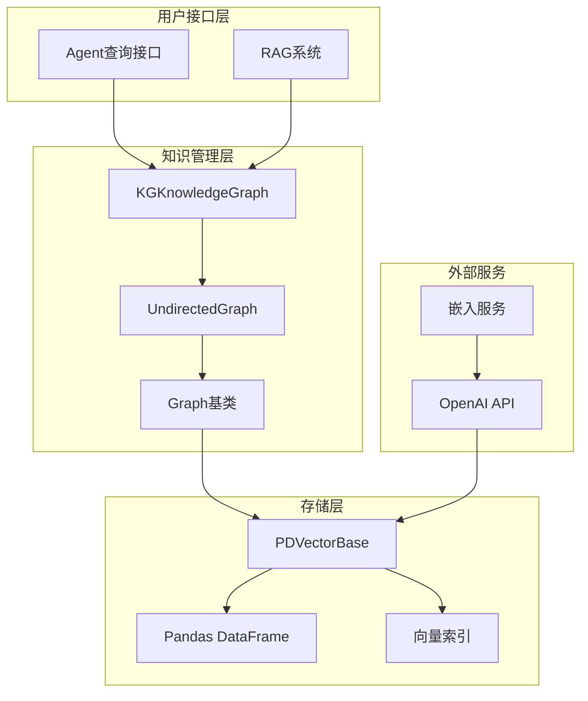
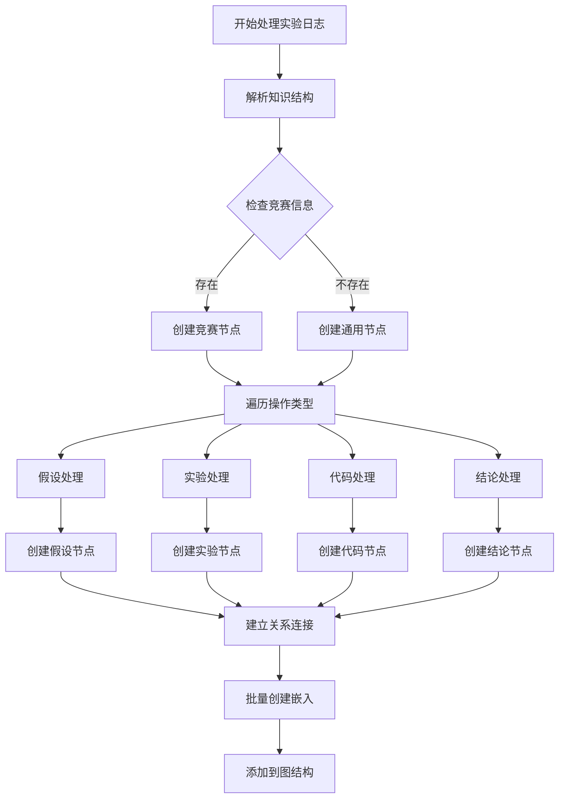
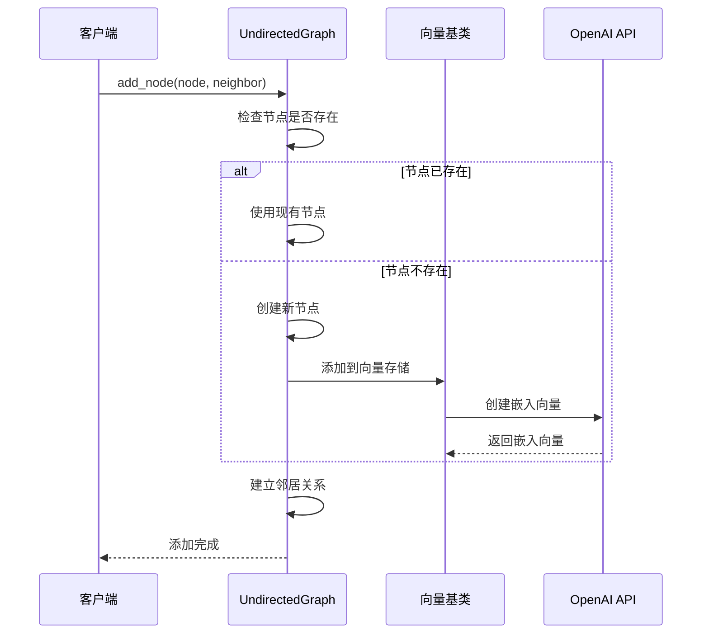
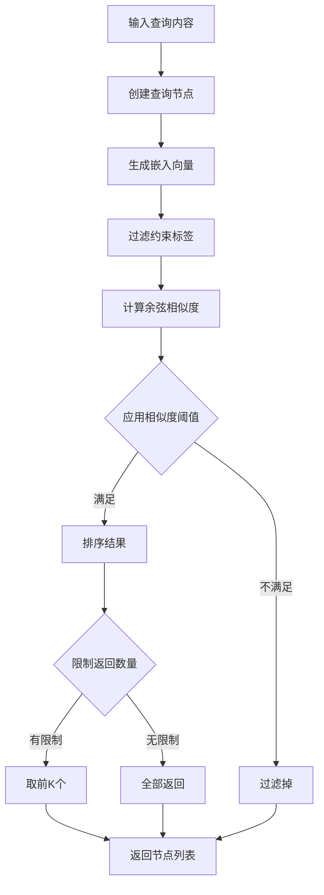
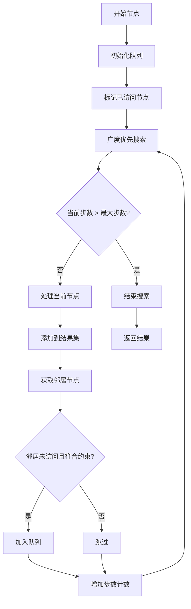
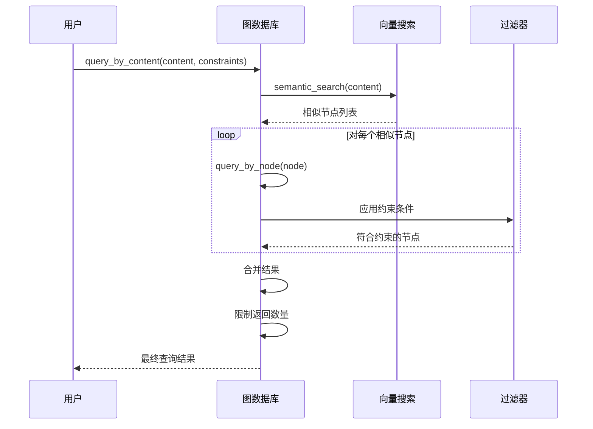
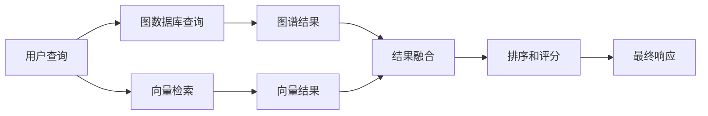
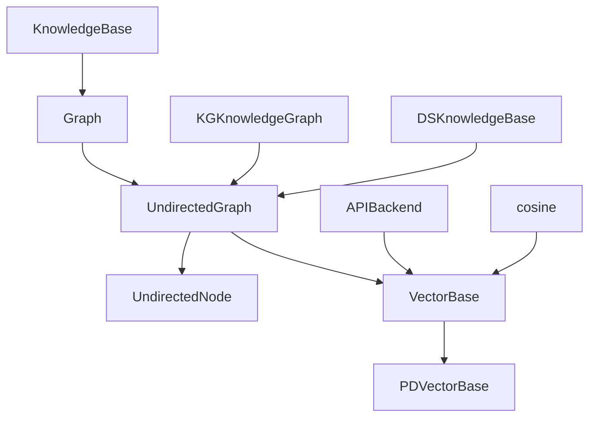

# 图数据库

<cite>
**本文档引用的文件**
- [graph.py](file://rdagent/components/knowledge_management/graph.py)
- [vector_base.py](file://rdagent/components/knowledge_management/vector_base.py)
- [knowledge_base.py](file://rdagent/core/knowledge_base.py)
- [kaggle_graph.py](file://rdagent/scenarios/kaggle/knowledge_management/graph.py)
- [kaggle_vector_base.py](file://rdagent/scenarios/kaggle/knowledge_management/vector_base.py)
- [idea_pool.py](file://rdagent/scenarios/data_science/proposal/exp_gen/idea_pool.py)
- [proposal.py](file://rdagent/scenarios/kaggle/proposal/proposal.py)
</cite>

## 目录
1. [简介](#简介)
2. [项目结构](#项目结构)
3. [核心组件](#核心组件)
4. [架构概览](#架构概览)
5. [详细组件分析](#详细组件分析)
6. [依赖关系分析](#依赖关系分析)
7. [性能考虑](#性能考虑)
8. [故障排除指南](#故障排除指南)
9. [结论](#结论)

## 简介

图数据库是结构化知识存储的核心组件，在RD-Agent系统中扮演着至关重要的角色。该系统通过图数据库技术构建了复杂的知识图谱，实现了实验、模型、因子等实体之间的智能关联和推理。图数据库不仅提供了高效的查询能力，还支持语义相似性搜索和上下文感知的推荐功能。

## 项目结构

RD-Agent的图数据库实现主要分布在以下目录结构中：

**图表来源**
- [graph.py](file://rdagent/components/knowledge_management/graph.py#L1-L50)
- [kaggle_graph.py](file://rdagent/scenarios/kaggle/knowledge_management/graph.py#L1-L30)

**章节来源**
- [graph.py](file://rdagent/components/knowledge_management/graph.py#L1-L498)
- [vector_base.py](file://rdagent/components/knowledge_management/vector_base.py#L1-L209)

## 核心组件

### 基础图结构

图数据库的核心由以下关键组件构成：

#### 节点类型定义
- **UndirectedNode**: 无向节点，包含内容、标签、嵌入向量和附加信息
- **KnowledgeMetaData**: 知识元数据，支持内容分割和嵌入创建
- **Document**: 文档对象，用于向量存储

#### 关系类型
- **邻居关系**: 无向边连接相关节点
- **竞争关系**: 实验与竞赛之间的关联
- **假设关系**: 实验与假设之间的联系

#### 查询类型
- **语义搜索**: 基于向量相似性的内容匹配
- **图遍历**: 按步数限制的邻域搜索
- **交集查询**: 多节点共同邻域的交集计算

**章节来源**
- [graph.py](file://rdagent/components/knowledge_management/graph.py#L15-L81)
- [vector_base.py](file://rdagent/components/knowledge_management/vector_base.py#L10-L50)

## 架构概览

RD-Agent的图数据库采用分层架构设计，实现了知识存储、检索和推理的完整流程：

**图表来源**
- [graph.py](file://rdagent/components/knowledge_management/graph.py#L83-L120)
- [vector_base.py](file://rdagent/components/knowledge_management/vector_base.py#L120-L160)

## 详细组件分析

### 图构建过程

#### 实体识别和关系提取

图数据库通过以下规则从实验日志中提取实体和关系：

**图表来源**
- [kaggle_graph.py](file://rdagent/scenarios/kaggle/knowledge_management/graph.py#L60-L115)

#### 核心方法实现

##### add_node方法
该方法负责添加新节点并建立邻居关系：

**图表来源**
- [graph.py](file://rdagent/components/knowledge_management/graph.py#L120-L180)

##### semantic_search方法
实现基于语义相似性的搜索功能：

**图表来源**
- [graph.py](file://rdagent/components/knowledge_management/graph.py#L284-L315)

**章节来源**
- [graph.py](file://rdagent/components/knowledge_management/graph.py#L120-L200)
- [kaggle_graph.py](file://rdagent/scenarios/kaggle/knowledge_management/graph.py#L60-L115)

### 图遍历查询

#### 邻域搜索算法

图数据库实现了多种图遍历查询模式：

##### get_nodes_within_steps方法
按指定步数范围搜索节点：

**图表来源**
- [graph.py](file://rdagent/components/knowledge_management/graph.py#L195-L232)

##### query_by_content方法
结合语义相似性和图结构的复合查询：

**图表来源**
- [graph.py](file://rdagent/components/knowledge_management/graph.py#L353-L434)

**章节来源**
- [graph.py](file://rdagent/components/knowledge_management/graph.py#L195-L282)
- [graph.py](file://rdagent/components/knowledge_management/graph.py#L353-L434)

### 向量检索与上下文融合

#### RAG系统集成

图数据库与向量检索系统的结合提供了更精准的上下文信息：

**图表来源**
- [proposal.py](file://rdagent/scenarios/kaggle/proposal/proposal.py#L57-L89)

#### 上下文增强机制

系统通过以下方式增强查询上下文：

1. **竞赛特定查询**: 基于当前竞赛的上下文进行搜索
2. **多模态融合**: 结合图结构和向量相似性
3. **动态权重调整**: 根据查询类型调整不同源的权重

**章节来源**
- [proposal.py](file://rdagent/scenarios/kaggle/proposal/proposal.py#L57-L89)

## 依赖关系分析

### 组件间依赖关系

**图表来源**
- [graph.py](file://rdagent/components/knowledge_management/graph.py#L1-L15)
- [vector_base.py](file://rdagent/components/knowledge_management/vector_base.py#L1-L15)

### 外部依赖

系统依赖以下外部组件：
- **OpenAI API**: 提供文本嵌入服务
- **Pandas**: 向量存储和查询
- **Scipy**: 余弦距离计算
- **Dill**: 对象序列化

**章节来源**
- [graph.py](file://rdagent/components/knowledge_management/graph.py#L1-L15)
- [vector_base.py](file://rdagent/components/knowledge_management/vector_base.py#L1-L15)

## 性能考虑

### 查询性能优化

#### 索引策略
- **向量索引**: 使用Pandas DataFrame的高效向量存储
- **标签过滤**: 支持按节点标签快速筛选
- **相似度阈值**: 预过滤低相似度结果

#### 批量处理优化
- **批量嵌入创建**: 每批次最多16个元素
- **并发处理**: 多进程文档分析
- **缓存机制**: 避免重复计算

### 内存管理

#### 数据结构优化
- **稀疏矩阵**: 使用集合存储邻居关系
- **延迟加载**: 按需加载节点数据
- **垃圾回收**: 及时清理无用节点

#### 存储优化
- **增量保存**: 只保存变化的部分
- **压缩存储**: 使用dill进行高效序列化
- **路径管理**: 自动创建目录结构

## 故障排除指南

### 常见问题及解决方案

#### 嵌入创建失败
**问题**: OpenAI API调用失败
**解决方案**: 
1. 检查API密钥配置
2. 验证网络连接
3. 实现重试机制

#### 内存不足
**问题**: 大规模图数据导致内存溢出
**解决方案**:
1. 分批处理节点
2. 使用流式处理
3. 增加系统内存

#### 查询性能下降
**问题**: 图规模增大导致查询变慢
**解决方案**:
1. 添加索引优化
2. 实现查询缓存
3. 优化约束条件

**章节来源**
- [graph.py](file://rdagent/components/knowledge_management/graph.py#L83-L120)
- [vector_base.py](file://rdagent/components/knowledge_management/vector_base.py#L120-L160)

## 结论

RD-Agent的图数据库系统提供了一个强大而灵活的知识存储和检索平台。通过结合图结构和向量检索技术，系统能够有效地组织和利用复杂的实验知识，为智能决策提供支持。

### 主要优势
1. **结构化知识表示**: 清晰的节点和关系模型
2. **语义相似性搜索**: 基于嵌入向量的智能匹配
3. **可扩展架构**: 支持多种应用场景
4. **性能优化**: 高效的查询和存储机制

### 发展方向
1. **图数据库引擎**: 考虑使用专门的图数据库系统
2. **实时更新**: 支持动态知识演化
3. **多模态融合**: 集成更多类型的数据
4. **推理能力**: 增强自动推理和预测功能

该图数据库系统为RD-Agent的智能化研究和开发提供了坚实的基础，是实现智能实验设计和知识发现的关键技术组件。