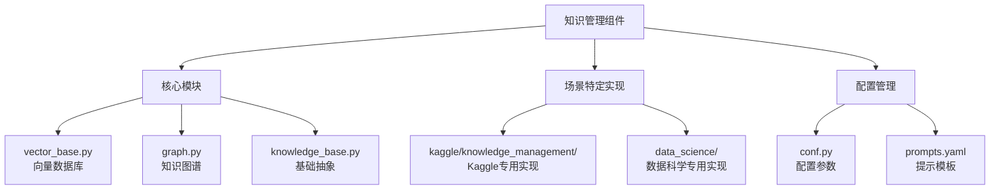
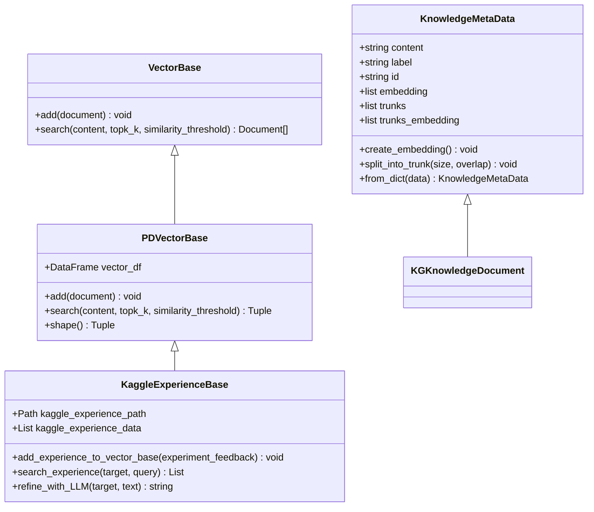
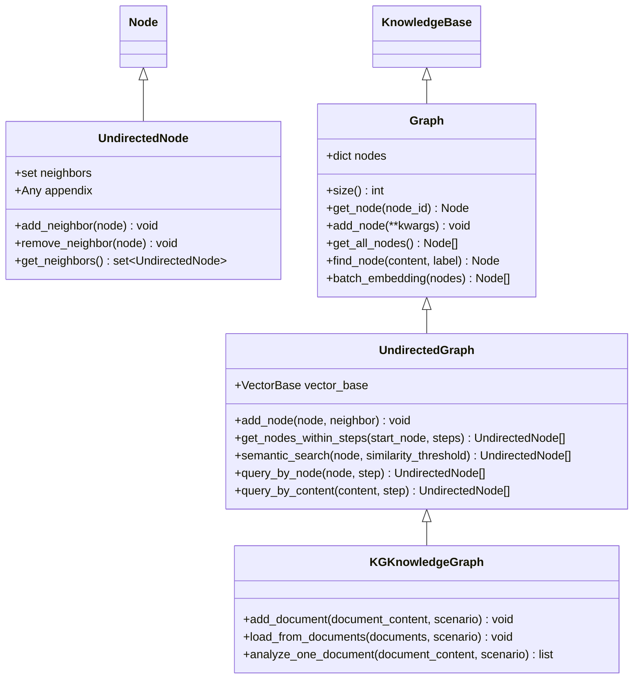
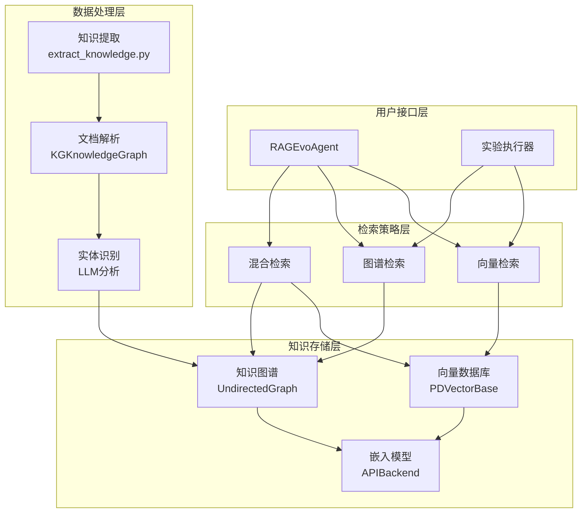
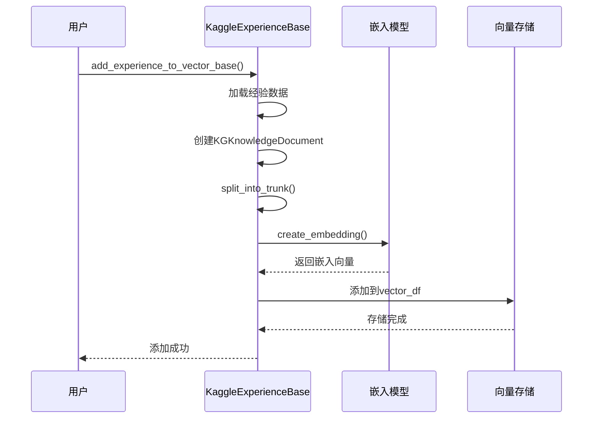
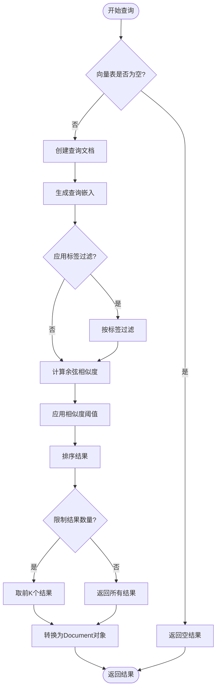
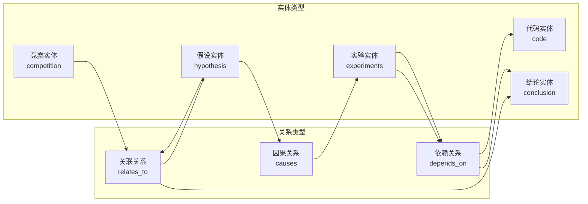
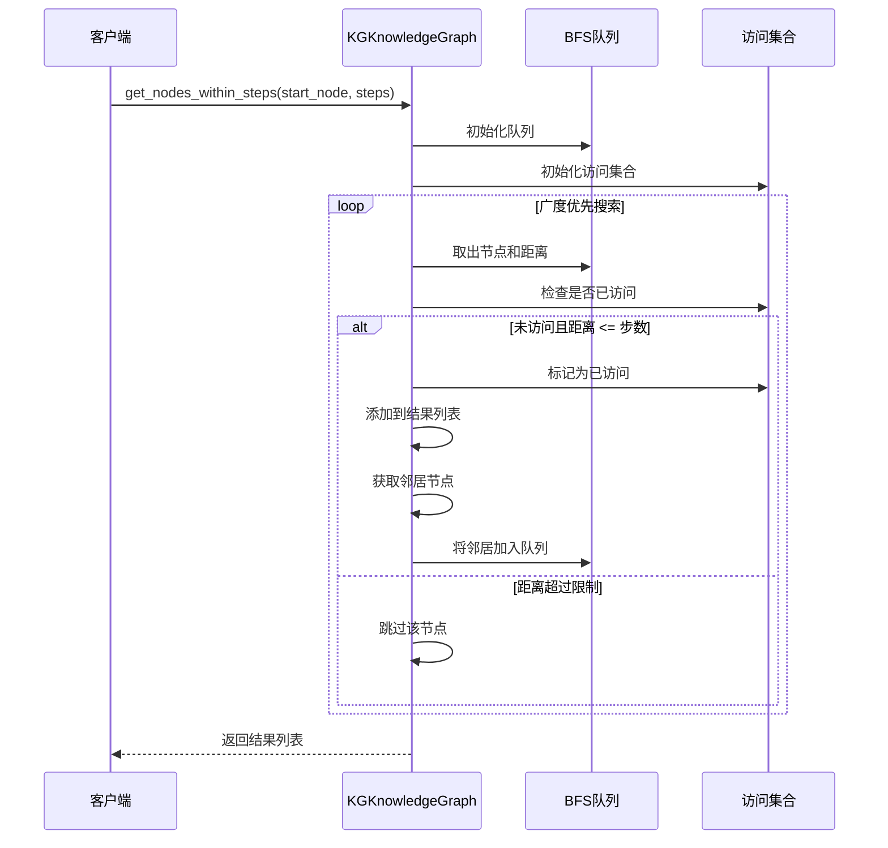
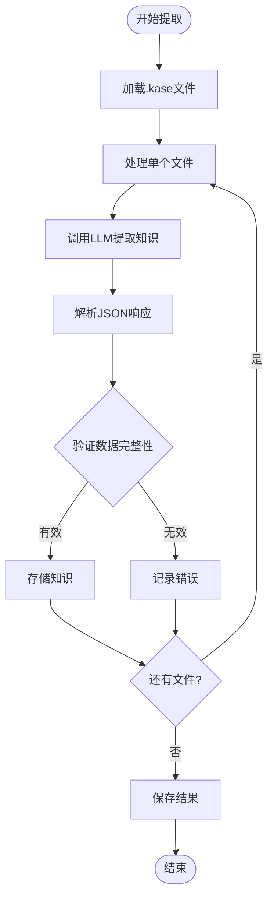
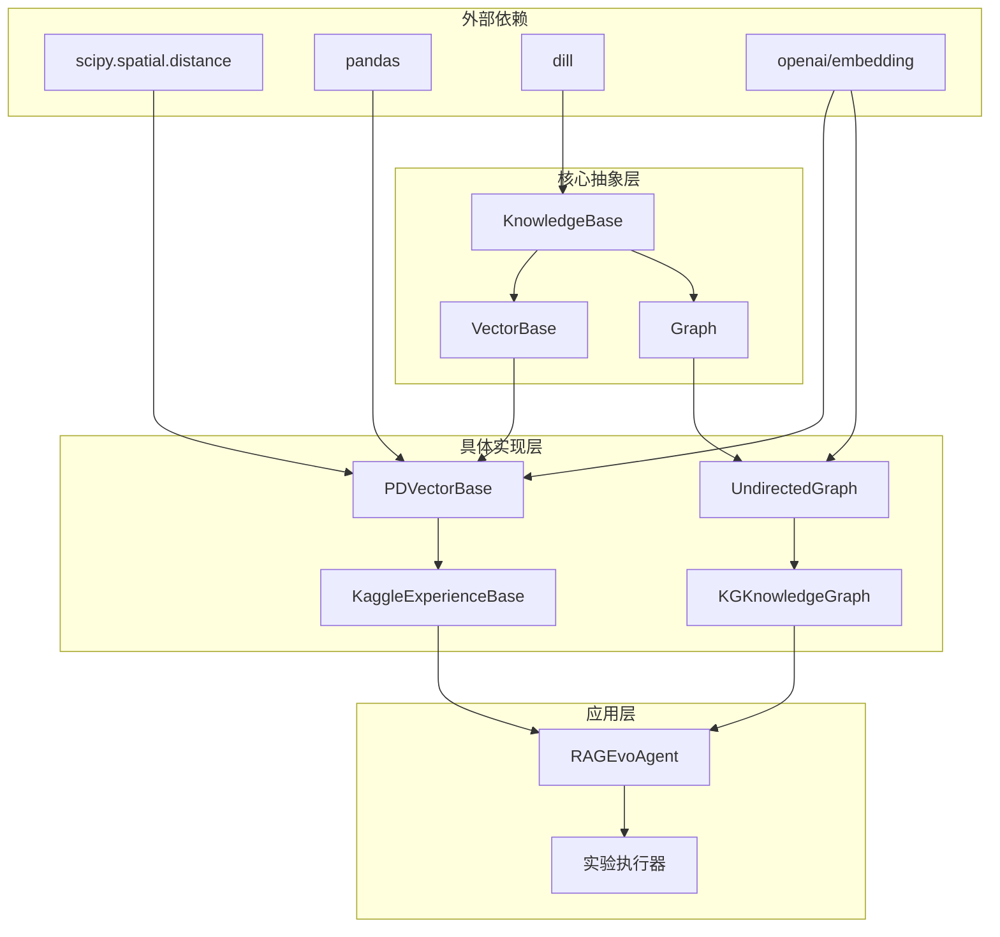

# 知识管理

<cite>
**本文档中引用的文件**
- [vector_base.py](file://rdagent/components/knowledge_management/vector_base.py)
- [graph.py](file://rdagent/components/knowledge_management/graph.py)
- [knowledge_base.py](file://rdagent/core/knowledge_base.py)
- [extract_knowledge.py](file://rdagent/scenarios/kaggle/knowledge_management/extract_knowledge.py)
- [vector_base.py](file://rdagent/scenarios/kaggle/knowledge_management/vector_base.py)
- [graph.py](file://rdagent/scenarios/kaggle/knowledge_management/graph.py)
- [conf.py](file://rdagent/app/kaggle/conf.py)
- [prompts.yaml](file://rdagent/scenarios/kaggle/knowledge_management/prompts.yaml)
- [evolving_agent.py](file://rdagent/core/evolving_agent.py)
</cite>

## 目录
1. [简介](#简介)
2. [项目结构](#项目结构)
3. [核心组件](#核心组件)
4. [架构概览](#架构概览)
5. [详细组件分析](#详细组件分析)
6. [依赖关系分析](#依赖关系分析)
7. [性能考虑](#性能考虑)
8. [故障排除指南](#故障排除指南)
9. [结论](#结论)

## 简介

知识管理组件是RAG（检索增强生成）系统的核心部分，负责存储、管理和检索历史实验数据和领域知识。该系统通过向量数据库和知识图谱相结合的方式，为RAGEvoAgent提供丰富的上下文信息，支持智能决策和知识推理。

该组件主要包含两个核心模块：
- **向量基础模块（vector_base.py）**：基于ChromaDB或Faiss构建向量数据库，实现语义检索功能
- **图谱模块（graph.py）**：构建知识图谱，管理实体间的关系，支持复杂推理

## 项目结构

知识管理组件在项目中的组织结构如下：

**图表来源**
- [vector_base.py](file://rdagent/components/knowledge_management/vector_base.py#L1-L209)
- [graph.py](file://rdagent/components/knowledge_management/graph.py#L1-L498)
- [knowledge_base.py](file://rdagent/core/knowledge_base.py#L1-L28)

**章节来源**
- [vector_base.py](file://rdagent/components/knowledge_management/vector_base.py#L1-L50)
- [graph.py](file://rdagent/components/knowledge_management/graph.py#L1-L50)

## 核心组件

### 向量数据库模块

向量数据库模块负责存储和检索基于嵌入向量的知识条目，支持高效的语义相似性搜索。

#### 主要类结构

**图表来源**
- [vector_base.py](file://rdagent/components/knowledge_management/vector_base.py#L12-L99)
- [vector_base.py](file://rdagent/scenarios/kaggle/knowledge_management/vector_base.py#L15-L120)

### 知识图谱模块

知识图谱模块构建实体间的关系网络，支持复杂的推理和路径查找。

#### 主要类结构

**图表来源**
- [graph.py](file://rdagent/components/knowledge_management/graph.py#L18-L117)
- [graph.py](file://rdagent/scenarios/kaggle/knowledge_management/graph.py#L15-L115)

**章节来源**
- [vector_base.py](file://rdagent/components/knowledge_management/vector_base.py#L1-L209)
- [graph.py](file://rdagent/components/knowledge_management/graph.py#L1-L498)

## 架构概览

知识管理系统采用分层架构设计，支持多种检索策略和知识表示形式：

**图表来源**
- [evolving_agent.py](file://rdagent/core/evolving_agent.py#L48-L80)
- [vector_base.py](file://rdagent/components/knowledge_management/vector_base.py#L101-L209)
- [graph.py](file://rdagent/components/knowledge_management/graph.py#L118-L200)

## 详细组件分析

### 向量数据库实现

#### 索引构建过程

向量数据库的索引构建遵循以下流程：

**图表来源**
- [vector_base.py](file://rdagent/scenarios/kaggle/knowledge_management/vector_base.py#L127-L159)
- [vector_base.py](file://rdagent/components/knowledge_management/vector_base.py#L30-L45)

#### 查询接口实现

向量数据库提供灵活的查询接口，支持多种过滤条件：

**图表来源**
- [vector_base.py](file://rdagent/components/knowledge_management/vector_base.py#L167-L207)

**章节来源**
- [vector_base.py](file://rdagent/components/knowledge_management/vector_base.py#L101-L209)
- [vector_base.py](file://rdagent/scenarios/kaggle/knowledge_management/vector_base.py#L127-L311)

### 知识图谱实现

#### 实体关系管理

知识图谱通过节点和边的结构化表示实体间的关系：

**图表来源**
- [graph.py](file://rdagent/scenarios/kaggle/knowledge_management/graph.py#L60-L115)

#### 路径查询算法

知识图谱支持多步距离内的节点查询：

**图表来源**
- [graph.py](file://rdagent/components/knowledge_management/graph.py#L180-L220)

**章节来源**
- [graph.py](file://rdagent/components/knowledge_management/graph.py#L118-L498)
- [graph.py](file://rdagent/scenarios/kaggle/knowledge_management/graph.py#L15-L115)

### 知识提取与处理

#### Kaggle经验提取

系统通过LLM自动从高分笔记中提取有价值的知识：

**图表来源**
- [extract_knowledge.py](file://rdagent/scenarios/kaggle/knowledge_management/extract_knowledge.py#L40-L64)

**章节来源**
- [extract_knowledge.py](file://rdagent/scenarios/kaggle/knowledge_management/extract_knowledge.py#L1-L65)

## 依赖关系分析

知识管理组件的依赖关系体现了清晰的分层架构：

**图表来源**
- [knowledge_base.py](file://rdagent/core/knowledge_base.py#L1-L28)
- [vector_base.py](file://rdagent/components/knowledge_management/vector_base.py#L1-L10)
- [graph.py](file://rdagent/components/knowledge_management/graph.py#L1-L17)

**章节来源**
- [knowledge_base.py](file://rdagent/core/knowledge_base.py#L1-L28)
- [vector_base.py](file://rdagent/components/knowledge_management/vector_base.py#L1-L209)
- [graph.py](file://rdagent/components/knowledge_management/graph.py#L1-L498)

## 性能考虑

### 索引优化策略

1. **批量嵌入处理**：每次最多处理16个文本片段，平衡API限制和性能
2. **分块处理**：大文档自动分割为1000字符的块，提高检索精度
3. **缓存机制**：向量嵌入结果被持久化存储，避免重复计算

### 内存管理

1. **延迟加载**：知识库支持按需加载，减少内存占用
2. **增量更新**：支持增量添加新知识，无需重建整个索引
3. **垃圾回收**：定期清理无用的临时对象和缓存

### 查询优化

1. **相似度阈值过滤**：预先过滤低相似度结果，减少不必要的计算
2. **标签约束**：支持按实体类型过滤，缩小搜索范围
3. **Top-K限制**：只返回最相关的前K个结果，控制输出大小

## 故障排除指南

### 常见问题及解决方案

#### 向量数据库问题

| 问题类型 | 症状 | 解决方案 |
|---------|------|----------|
| 空向量表 | 查询返回空结果 | 检查知识库初始化是否正确，确保有数据导入 |
| 嵌入失败 | API调用超时 | 检查网络连接，调整重试策略 |
| 相似度过低 | 检索结果不相关 | 调整相似度阈值，优化查询内容 |
| 内存不足 | 处理大数据集时崩溃 | 减少批处理大小，启用流式处理 |

#### 图谱查询问题

| 问题类型 | 症状 | 解决方案 |
|---------|------|----------|
| 路径过长 | 查询时间过长 | 限制最大步数，使用启发式搜索 |
| 内存泄漏 | 长时间运行后内存增长 | 检查循环引用，及时释放不需要的对象 |
| 关系缺失 | 查询不到预期的连接 | 检查实体识别准确性，完善知识提取逻辑 |

#### 配置问题

| 问题类型 | 症状 | 解决方案 |
|---------|------|----------|
| 路径错误 | 文件找不到 | 检查配置中的路径设置，确保文件存在 |
| API密钥 | 认证失败 | 验证OpenAI API密钥的有效性 |
| 权限问题 | 无法写入文件 | 检查文件权限，确保有写入权限 |

**章节来源**
- [vector_base.py](file://rdagent/components/knowledge_management/vector_base.py#L167-L207)
- [graph.py](file://rdagent/components/knowledge_management/graph.py#L180-L220)

## 结论

知识管理组件为RAG系统提供了强大的知识存储和检索能力。通过向量数据库和知识图谱的有机结合，系统能够：

1. **高效存储**：支持大规模知识条目的快速存储和检索
2. **智能检索**：基于语义相似性的精确知识匹配
3. **复杂推理**：通过图谱结构支持多跳推理和关系发现
4. **动态更新**：支持知识的增量更新和版本管理
5. **灵活扩展**：模块化设计便于适应不同的应用场景

该组件的成功实施为RAGEvoAgent提供了坚实的知识基础，显著提升了智能决策的质量和效率。随着知识库的不断丰富和算法的持续优化，系统的性能将进一步提升，为复杂的数据科学任务提供更强大的支持。