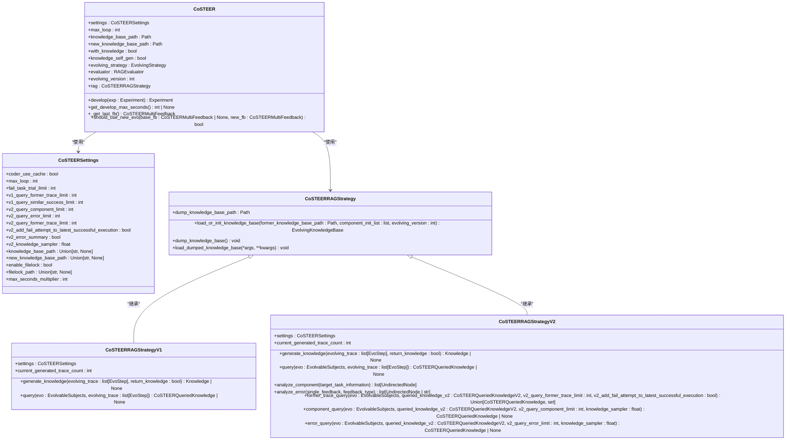
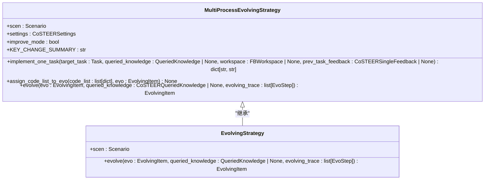
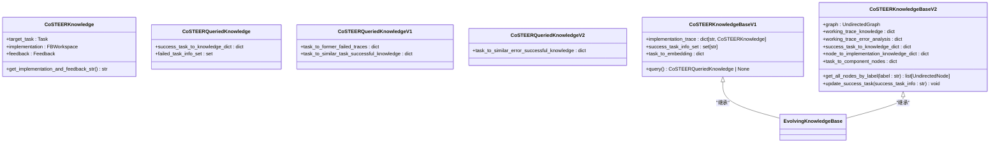
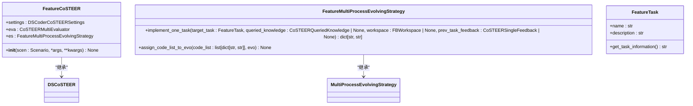
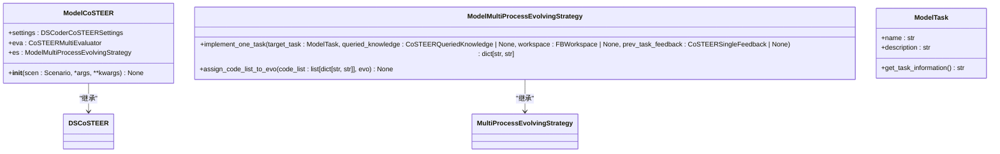
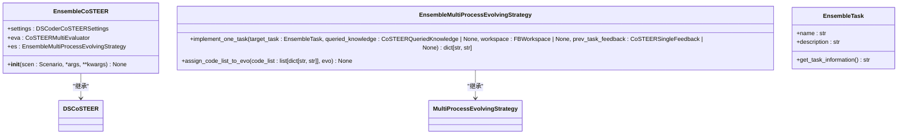
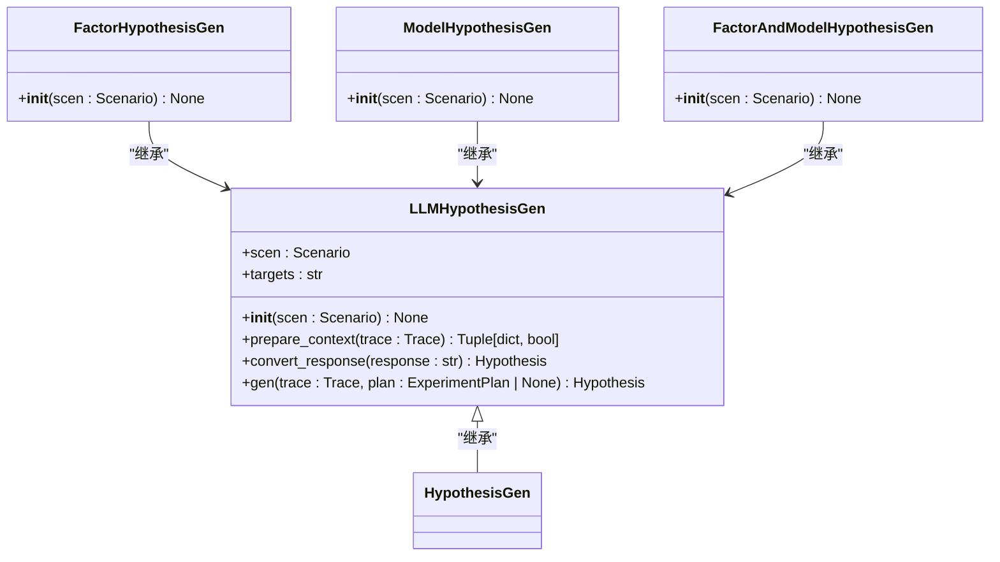
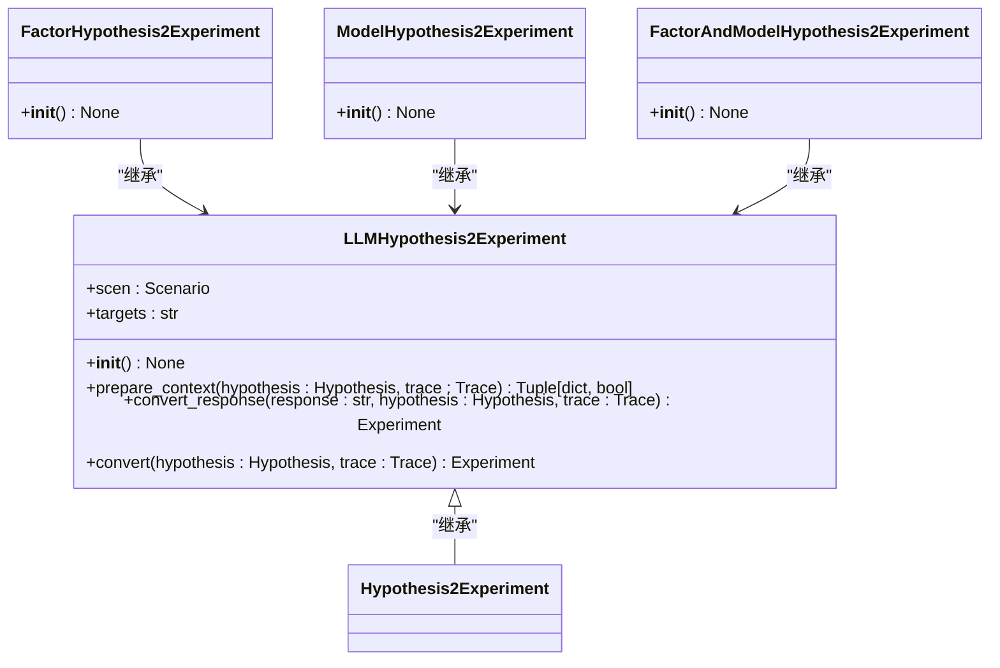
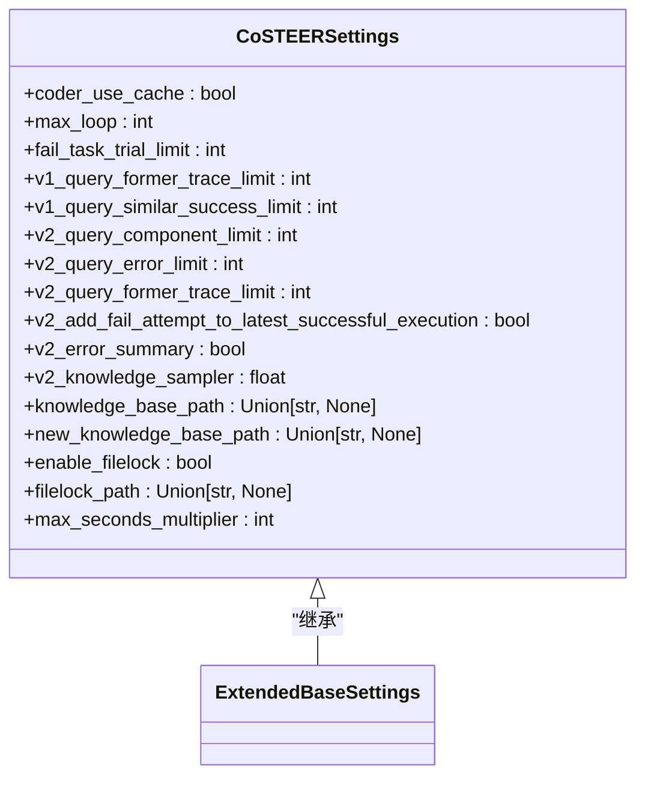
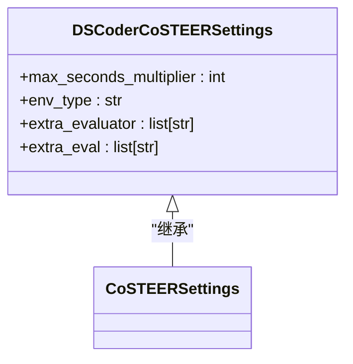

# 组件库

<cite>
**本文档中引用的文件**   
- [CoSTEER/__init__.py](file://rdagent/components/coder/CoSTEER/__init__.py)
- [CoSTEER/config.py](file://rdagent/components/coder/CoSTEER/config.py)
- [CoSTEER/evaluators.py](file://rdagent/components/coder/CoSTEER/evaluators.py)
- [CoSTEER/knowledge_management.py](file://rdagent/components/coder/CoSTEER/knowledge_management.py)
- [CoSTEER/evolving_strategy.py](file://rdagent/components/coder/CoSTEER/evolving_strategy.py)
- [data_science/conf.py](file://rdagent/components/coder/data_science/conf.py)
- [data_science/pipeline/__init__.py](file://rdagent/components/coder/data_science/pipeline/__init__.py)
- [data_science/feature/__init__.py](file://rdagent/components/coder/data_science/feature/__init__.py)
- [data_science/model/__init__.py](file://rdagent/components/coder/data_science/model/__init__.py)
- [data_science/share/ds_costeer.py](file://rdagent/components/coder/data_science/share/ds_costeer.py)
- [proposal/__init__.py](file://rdagent/components/proposal/__init__.py)
- [scenarios/data_science/proposal/exp_gen/base.py](file://rdagent/scenarios/data_science/proposal/exp_gen/base.py)
- [scenarios/data_science/proposal/exp_gen/proposal.py](file://rdagent/scenarios/data_science/proposal/exp_gen/proposal.py)
</cite>

## 目录
1. [引言](#引言)
2. [编码器（Coder）组件](#编码器coder组件)
3. [数据科学编码器](#数据科学编码器)
4. [提案生成器（Proposal）](#提案生成器proposal)
5. [组件接口与配置](#组件接口与配置)
6. [API使用示例](#api使用示例)
7. [结论](#结论)

## 引言
本文档全面记录RD-Agent的可复用组件库，重点介绍编码器（Coder）组件中的`CoSTEER`策略、数据科学编码器以及提案生成器（Proposal）组件。文档详细说明了这些组件的实现机制、公共接口、配置选项和使用模式，为开发者提供全面的技术参考。

## 编码器（Coder）组件

编码器（Coder）组件是RD-Agent的核心模块之一，负责将实验任务转化为可执行的代码实现。其中，`CoSTEER`策略是编码器的核心实现，它通过并行任务处理和知识增强机制来提高代码生成的质量和效率。

`CoSTEER`策略通过继承`Developer`类实现，其主要功能包括任务开发、知识管理和反馈评估。该策略支持两种知识库版本（V1和V2），并提供了灵活的配置选项来控制演化过程的最大循环次数、知识库路径等参数。

**组件来源**
- [CoSTEER/__init__.py](file://rdagent/components/coder/CoSTEER/__init__.py#L1-L176)
- [CoSTEER/config.py](file://rdagent/components/coder/CoSTEER/config.py#L1-L42)

### CoSTEER策略的实现

`CoSTEER`策略的实现基于一个迭代演化框架，通过多轮循环逐步改进代码实现。该策略的核心机制包括并行任务处理和知识增强。

在并行任务处理方面，`CoSTEER`使用`MultiProcessEvolvingStrategy`来并行处理多个子任务。每个子任务由`implement_one_task`方法独立处理，然后通过`assign_code_list_to_evo`方法将结果合并到演化项中。这种并行处理机制显著提高了代码生成的效率。



**图表来源**
- [CoSTEER/__init__.py](file://rdagent/components/coder/CoSTEER/__init__.py#L1-L176)
- [CoSTEER/config.py](file://rdagent/components/coder/CoSTEER/config.py#L1-L42)
- [CoSTEER/knowledge_management.py](file://rdagent/components/coder/CoSTEER/knowledge_management.py#L1-L799)

### 并行任务处理

`CoSTEER`策略通过`MultiProcessEvolvingStrategy`实现并行任务处理。该策略继承自`EvolvingStrategy`，并实现了`implement_one_task`和`assign_code_list_to_evo`两个抽象方法。

`implement_one_task`方法负责处理单个任务，它接收目标任务、查询到的知识、工作空间和前一个任务的反馈作为输入，返回需要更新的文件字典。该方法使用LLM生成代码，并确保生成的代码与之前的不同。

`assign_code_list_to_evo`方法负责将生成的代码列表分配给演化项。该方法遍历代码列表，将每个任务的实现代码注入到相应的工作空间中。



**图表来源**
- [CoSTEER/evolving_strategy.py](file://rdagent/components/coder/CoSTEER/evolving_strategy.py#L1-L134)
- [CoSTEER/__init__.py](file://rdagent/components/coder/CoSTEER/__init__.py#L1-L176)

### 知识增强

`CoSTEER`策略通过知识增强机制来提高代码生成的质量。该机制基于一个知识库，存储了之前成功和失败的任务实现及其反馈。在生成新代码时，系统会查询知识库，获取相关知识并将其作为上下文提供给LLM。

知识增强机制由`CoSTEERRAGStrategy`类实现，该类提供了两种版本：V1和V2。V1版本主要基于任务描述的相似性来查询知识，而V2版本则引入了更复杂的查询策略，包括组件查询和错误查询。



**图表来源**
- [CoSTEER/knowledge_management.py](file://rdagent/components/coder/CoSTEER/knowledge_management.py#L1-L799)

## 数据科学编码器

数据科学编码器是针对数据科学任务的专用编码器，它实现了特征工程、模型训练和集成等具体功能。该编码器基于`CoSTEER`策略，并针对数据科学任务的特点进行了定制化。

数据科学编码器的主要功能包括：
- 特征工程：自动生成功能特征，提高模型性能
- 模型训练：实现多种机器学习模型的训练和调优
- 集成：将多个模型的预测结果进行集成，提高预测准确性

**组件来源**
- [data_science/pipeline/__init__.py](file://rdagent/components/coder/data_science/pipeline/__init__.py#L1-L165)
- [data_science/feature/__init__.py](file://rdagent/components/coder/data_science/feature/__init__.py#L1-L140)
- [data_science/model/__init__.py](file://rdagent/components/coder/data_science/model/__init__.py#L1-L173)

### 特征工程

特征工程组件负责生成和优化数据特征。该组件通过`FeatureCoSTEER`类实现，继承自`DSCoSTEER`基类。`FeatureCoSTEER`使用`FeatureMultiProcessEvolvingStrategy`来并行处理特征工程任务。

`FeatureMultiProcessEvolvingStrategy`的`implement_one_task`方法负责生成特征代码。该方法首先查询知识库，获取相似成功任务的知识和之前失败任务的痕迹，然后使用这些知识作为上下文，通过LLM生成新的特征代码。



**图表来源**
- [data_science/feature/__init__.py](file://rdagent/components/coder/data_science/feature/__init__.py#L1-L140)

### 模型训练

模型训练组件负责实现和优化机器学习模型。该组件通过`ModelCoSTEER`类实现，继承自`DSCoSTEER`基类。`ModelCoSTEER`使用`ModelMultiProcessEvolvingStrategy`来并行处理模型训练任务。

`ModelMultiProcessEvolvingStrategy`的`implement_one_task`方法负责生成模型代码。该方法与特征工程类似，但需要处理更复杂的代码结构，因为它可能涉及多个模型文件的更新。



**图表来源**
- [data_science/model/__init__.py](file://rdagent/components/coder/data_science/model/__init__.py#L1-L173)

### 集成

集成组件负责将多个模型的预测结果进行集成。该组件通过`EnsembleCoSTEER`类实现，继承自`DSCoSTEER`基类。`EnsembleCoSTEER`使用`EnsembleMultiProcessEvolvingStrategy`来并行处理集成任务。

集成策略通常包括简单的平均、加权平均或更复杂的堆叠方法。该组件的目标是通过结合多个模型的优势，提高最终预测的准确性和稳定性。



**图表来源**
- [data_science/ensemble/__init__.py](file://rdagent/components/coder/data_science/ensemble/__init__.py)

## 提案生成器（Proposal）

提案生成器（Proposal）组件负责将模糊的想法转化为具体的实验任务。该组件通过`HypothesisGen`和`Hypothesis2Experiment`两个核心类实现，分别负责生成假设和将假设转化为实验。

提案生成器的工作机制包括：
1. 生成假设：基于场景描述、SOTA实现和历史反馈，生成改进假设
2. 转化为实验：将生成的假设转化为具体的实验任务，包括任务设计和代码生成

**组件来源**
- [proposal/__init__.py](file://rdagent/components/proposal/__init__.py#L1-L138)
- [scenarios/data_science/proposal/exp_gen/proposal.py](file://rdagent/scenarios/data_science/proposal/exp_gen/proposal.py#L1-L799)

### HypothesisGen

`HypothesisGen`类负责生成改进假设。该类通过`gen`方法实现，接收跟踪信息和实验计划作为输入，返回生成的假设。

`gen`方法首先准备上下文，包括系统提示和用户提示。系统提示包含目标、场景描述、假设输出格式和假设规范。用户提示包含假设和反馈、最后的假设和反馈、SOTA假设和反馈以及RAG信息。



**图表来源**
- [proposal/__init__.py](file://rdagent/components/proposal/__init__.py#L1-L138)

### Hypothesis2Experiment

`Hypothesis2Experiment`类负责将假设转化为具体的实验任务。该类通过`convert`方法实现，接收假设和跟踪信息作为输入，返回生成的实验。

`convert`方法首先准备上下文，包括系统提示和用户提示。系统提示包含目标、场景描述和实验输出格式。用户提示包含目标假设、假设和反馈、最后的假设和反馈、SOTA假设和反馈、目标列表和RAG信息。



**图表来源**
- [proposal/__init__.py](file://rdagent/components/proposal/__init__.py#L1-L138)

## 组件接口与配置

本节详细说明各组件的公共接口、配置选项和使用模式。

### CoSTEER配置

`CoSTEER`策略的配置通过`CoSTEERSettings`类实现，该类继承自`ExtendedBaseSettings`。主要配置选项包括：

- `coder_use_cache`: 是否使用缓存
- `max_loop`: 最大任务实现循环次数
- `fail_task_trial_limit`: 失败任务尝试限制
- `knowledge_base_path`: 知识库路径
- `new_knowledge_base_path`: 新知识库路径
- `enable_filelock`: 是否启用文件锁
- `max_seconds_multiplier`: 最大秒数乘数



**图表来源**
- [CoSTEER/config.py](file://rdagent/components/coder/CoSTEER/config.py#L1-L42)

### 数据科学编码器配置

数据科学编码器的配置通过`DSCoderCoSTEERSettings`类实现，该类继承自`CoSTEERSettings`。主要配置选项包括：

- `max_seconds_multiplier`: 最大秒数乘数
- `env_type`: 环境类型
- `extra_evaluator`: 额外评估器列表
- `extra_eval`: 额外评估列表



**图表来源**
- [data_science/conf.py](file://rdagent/components/coder/data_science/conf.py#L1-L87)

## API使用示例

本节提供如何调用这些组件API的代码示例。

### 初始化CoSTEER

```python
from rdagent.components.coder.CoSTEER import CoSTEER
from rdagent.components.coder.CoSTEER.config import CoSTEERSettings
from rdagent.components.coder.CoSTEER.evaluators import CoSTEERMultiEvaluator
from rdagent.components.coder.CoSTEER.evolving_strategy import MultiProcessEvolvingStrategy
from rdagent.core.scenario import Scenario

# 创建场景实例
scen = Scenario()

# 创建配置
settings = CoSTEERSettings()

# 创建评估器
evaluator = CoSTEERMultiEvaluator(single_evaluator=[], scen=scen)

# 创建演化策略
evolving_strategy = MultiProcessEvolvingStrategy(scen=scen, settings=settings)

# 初始化CoSTEER
costeer = CoSTEER(
    settings=settings,
    eva=evaluator,
    es=evolving_strategy,
    scen=scen,
    max_loop=10,
    with_knowledge=True,
    knowledge_self_gen=True
)
```

### 使用数据科学编码器

```python
from rdagent.components.coder.data_science.pipeline import PipelineCoSTEER
from rdagent.components.coder.data_science.feature import FeatureCoSTEER
from rdagent.components.coder.data_science.model import ModelCoSTEER
from rdagent.core.scenario import Scenario

# 创建场景实例
scen = Scenario()

# 初始化管道编码器
pipeline_costeer = PipelineCoSTEER(scen=scen)

# 初始化特征编码器
feature_costeer = FeatureCoSTEER(scen=scen)

# 初始化模型编码器
model_costeer = ModelCoSTEER(scen=scen)
```

### 使用提案生成器

```python
from rdagent.components.proposal import FactorHypothesisGen, ModelHypothesisGen
from rdagent.components.proposal import FactorHypothesis2Experiment, ModelHypothesis2Experiment
from rdagent.core.scenario import Scenario
from rdagent.core.proposal import Trace

# 创建场景实例
scen = Scenario()

# 创建跟踪实例
trace = Trace(scen=scen)

# 初始化假设生成器
factor_hypothesis_gen = FactorHypothesisGen(scen=scen)
model_hypothesis_gen = ModelHypothesisGen(scen=scen)

# 生成假设
factor_hypothesis = factor_hypothesis_gen.gen(trace=trace)
model_hypothesis = model_hypothesis_gen.gen(trace=trace)

# 初始化假设到实验转换器
factor_hypothesis2exp = FactorHypothesis2Experiment()
model_hypothesis2exp = ModelHypothesis2Experiment()

# 转换为实验
factor_experiment = factor_hypothesis2exp.convert(hypothesis=factor_hypothesis, trace=trace)
model_experiment = model_hypothesis2exp.convert(hypothesis=model_hypothesis, trace=trace)
```

**代码示例来源**
- [CoSTEER/__init__.py](file://rdagent/components/coder/CoSTEER/__init__.py#L1-L176)
- [data_science/pipeline/__init__.py](file://rdagent/components/coder/data_science/pipeline/__init__.py#L1-L165)
- [data_science/feature/__init__.py](file://rdagent/components/coder/data_science/feature/__init__.py#L1-L140)
- [data_science/model/__init__.py](file://rdagent/components/coder/data_science/model/__init__.py#L1-L173)
- [proposal/__init__.py](file://rdagent/components/proposal/__init__.py#L1-L138)

## 结论
本文档全面介绍了RD-Agent的可复用组件库，重点阐述了编码器（Coder）组件中的`CoSTEER`策略、数据科学编码器以及提案生成器（Proposal）组件的实现机制和使用方法。通过并行任务处理和知识增强机制，`CoSTEER`策略能够高效地生成高质量的代码实现。数据科学编码器针对特征工程、模型训练和集成等具体任务提供了专用的解决方案。提案生成器则能够将模糊的想法转化为具体的实验任务，为自动化机器学习提供了强大的支持。