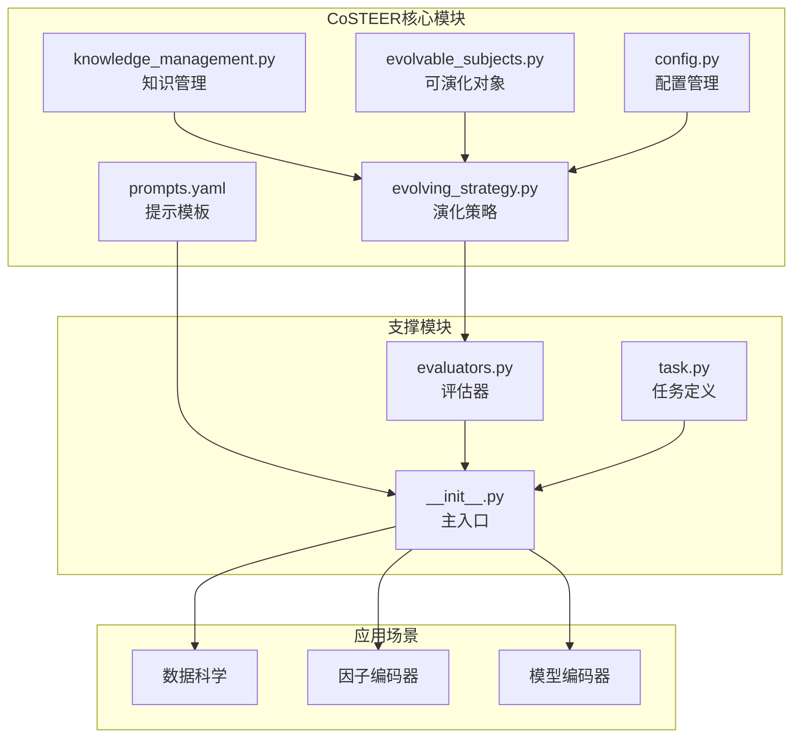
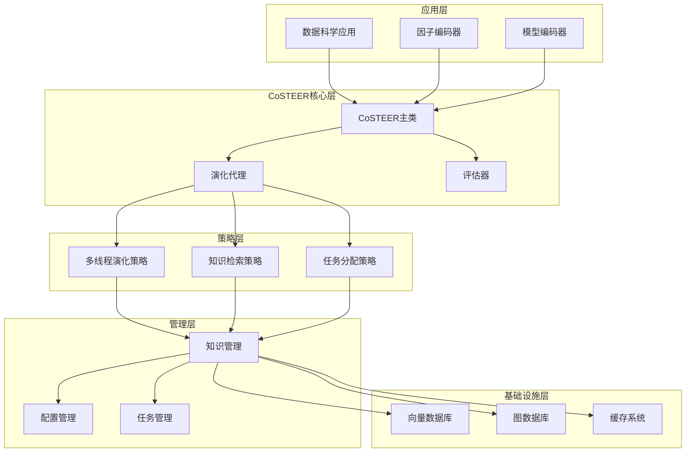
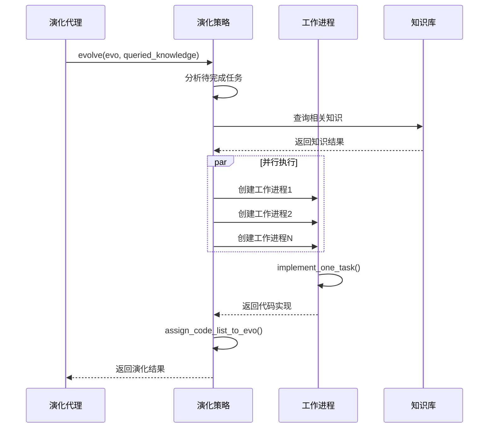
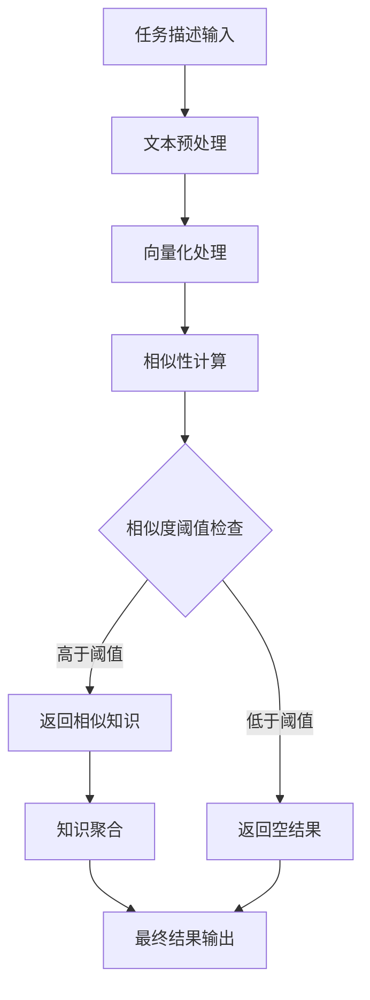
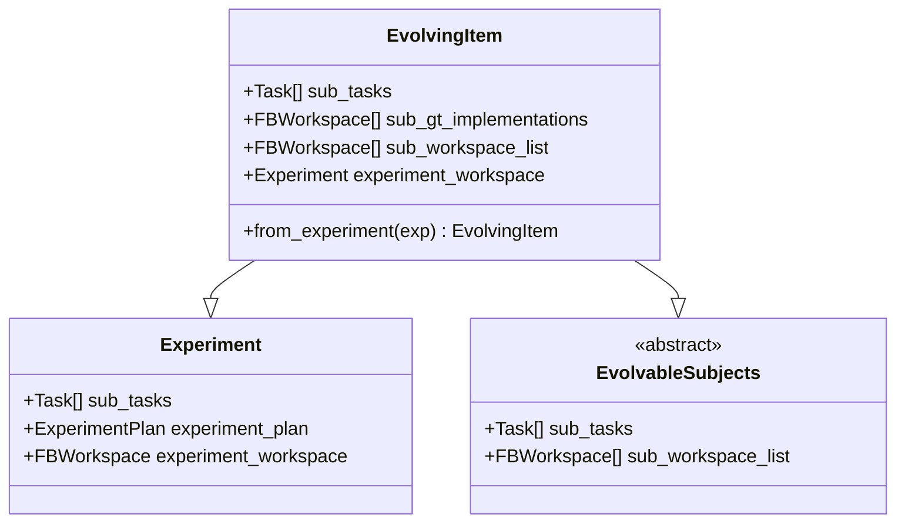
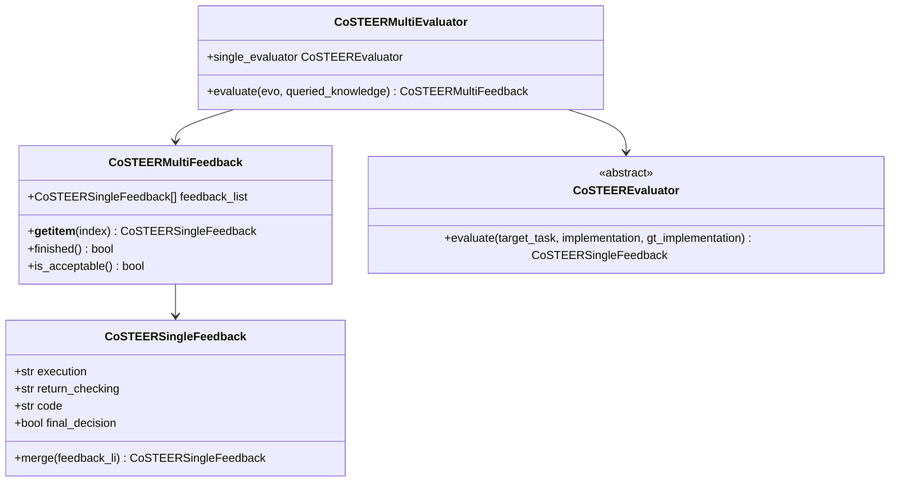
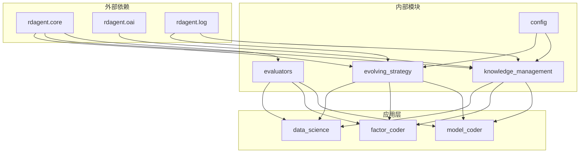

# CoSTEER编码器技术文档

<cite>
**本文档引用的文件**
- [evolving_strategy.py](file://rdagent/components/coder/CoSTEER/evolving_strategy.py)
- [knowledge_management.py](file://rdagent/components/coder/CoSTEER/knowledge_management.py)
- [evolvable_subjects.py](file://rdagent/components/coder/CoSTEER/evolvable_subjects.py)
- [config.py](file://rdagent/components/coder/CoSTEER/config.py)
- [prompts.yaml](file://rdagent/components/coder/CoSTEER/prompts.yaml)
- [evaluators.py](file://rdagent/components/coder/CoSTEER/evaluators.py)
- [task.py](file://rdagent/components/coder/CoSTEER/task.py)
- [__init__.py](file://rdagent/components/coder/CoSTEER/__init__.py)
- [evolving_agent.py](file://rdagent/core/evolving_agent.py)
- [raw_data_loader/__init__.py](file://rdagent/components/coder/data_science/raw_data_loader/__init__.py)
- [feature/__init__.py](file://rdagent/components/coder/data_science/feature/__init__.py)
</cite>

## 目录
1. [简介](#简介)
2. [项目结构](#项目结构)
3. [核心组件](#核心组件)
4. [架构概览](#架构概览)
5. [详细组件分析](#详细组件分析)
6. [依赖关系分析](#依赖关系分析)
7. [性能考虑](#性能考虑)
8. [故障排除指南](#故障排除指南)
9. [结论](#结论)

## 简介

CoSTEER（Collaborative Software TEchnology Evolution Engine）是一个先进的代码演化系统，专为数据科学和机器学习项目设计。该系统通过多线程并行演化机制、智能知识管理和基于LLM的代码生成，实现了高效的自动化代码开发流程。

CoSTEER的核心设计理念是模拟生物进化过程，在软件开发中应用自然选择原理。系统通过迭代优化、知识复用和并行处理，显著提升了代码生成的质量和效率。

## 项目结构

CoSTEER编码器采用模块化架构，主要包含以下核心模块：



**图表来源**
- [evolving_strategy.py](file://rdagent/components/coder/CoSTEER/evolving_strategy.py#L1-L135)
- [knowledge_management.py](file://rdagent/components/coder/CoSTEER/knowledge_management.py#L1-L964)
- [config.py](file://rdagent/components/coder/CoSTEER/config.py#L1-L43)

**章节来源**
- [evolving_strategy.py](file://rdagent/components/coder/CoSTEER/evolving_strategy.py#L1-L135)
- [knowledge_management.py](file://rdagent/components/coder/CoSTEER/knowledge_management.py#L1-L964)
- [config.py](file://rdagent/components/coder/CoSTEER/config.py#L1-L43)

## 核心组件

### 多线程演化策略（MultiProcessEvolvingStrategy）

MultiProcessEvolvingStrategy是CoSTEER的核心演化引擎，负责协调并行代码生成和优化过程。该策略实现了以下关键功能：

- **并行任务调度**：利用多进程并行处理多个子任务
- **智能任务分配**：根据历史知识动态分配任务优先级
- **失败重试机制**：对失败的任务实施改进模式
- **知识融合**：整合查询到的相关知识进行代码生成

### 知识管理系统

知识管理系统是CoSTEER的智慧核心，负责存储、检索和更新演化过程中的经验知识：

- **向量数据库集成**：支持语义相似性搜索
- **图数据库结构**：构建知识图谱表示
- **多版本兼容**：支持V1和V2知识库格式
- **实时更新**：动态维护知识库内容

### 可演化对象（EvolvingItem）

EvolvingItem作为演化过程中的中间状态，连接了实验环境和演化策略：

- **任务封装**：将多个子任务封装为统一对象
- **状态跟踪**：记录演化过程中的状态变化
- **继承特性**：同时继承Experiment和EvolvableSubjects特性

**章节来源**
- [evolving_strategy.py](file://rdagent/components/coder/CoSTEER/evolving_strategy.py#L18-L135)
- [knowledge_management.py](file://rdagent/components/coder/CoSTEER/knowledge_management.py#L761-L850)
- [evolvable_subjects.py](file://rdagent/components/coder/CoSTEER/evolvable_subjects.py#L1-L33)

## 架构概览

CoSTEER采用分层架构设计，从底层的知识管理到顶层的应用场景，形成了完整的演化生态系统：



**图表来源**
- [__init__.py](file://rdagent/components/coder/CoSTEER/__init__.py#L1-L177)
- [evolving_agent.py](file://rdagent/core/evolving_agent.py#L1-L116)
- [knowledge_management.py](file://rdagent/components/coder/CoSTEER/knowledge_management.py#L54-L139)

## 详细组件分析

### 演化策略组件

#### 多线程并行演化机制

MultiProcessEvolvingStrategy实现了高效的并行演化机制：



**图表来源**
- [evolving_strategy.py](file://rdagent/components/coder/CoSTEER/evolving_strategy.py#L65-L135)

#### 任务调度逻辑

任务调度遵循以下优先级规则：
1. **成功任务跳过**：已成功的任务不再重复执行
2. **失败限制检查**：超过失败尝试次数的任务被标记为失败
3. **知识驱动**：优先使用相关成功知识
4. **改进模式**：在改进模式下只处理失败任务

**章节来源**
- [evolving_strategy.py](file://rdagent/components/coder/CoSTEER/evolving_strategy.py#L65-L135)

### 知识管理组件

#### 向量数据库交互

知识管理系统通过向量数据库实现语义相似性搜索：



**图表来源**
- [knowledge_management.py](file://rdagent/components/coder/CoSTEER/knowledge_management.py#L761-L850)

#### 知识检索与存储

知识检索采用多维度策略：
- **历史轨迹查询**：检索类似任务的历史成功实现
- **组件分析**：基于任务组件的语义匹配
- **错误分析**：识别和解决常见错误模式
- **嵌入相似性**：基于向量嵌入的语义搜索

#### 知识更新机制

系统支持实时知识更新：
- **增量学习**：每次成功演化都更新知识库
- **冲突解决**：处理知识冲突和不一致性
- **版本控制**：维护知识库的版本历史
- **持久化存储**：使用pickle序列化保存知识

**章节来源**
- [knowledge_management.py](file://rdagent/components/coder/CoSTEER/knowledge_management.py#L276-L450)

### 可演化对象抽象

#### EvolvingItem设计

EvolvingItem作为演化过程中的核心数据结构：



**图表来源**
- [evolvable_subjects.py](file://rdagent/components/coder/CoSTEER/evolvable_subjects.py#L7-L33)

#### 实验迭代作用

EvolvingItem在实验迭代中发挥关键作用：
- **状态保持**：维护演化过程中的完整状态
- **进度跟踪**：记录每个子任务的进展
- **回滚支持**：提供失败时的状态恢复
- **结果验证**：确保演化结果的有效性

**章节来源**
- [evolvable_subjects.py](file://rdagent/components/coder/CoSTEER/evolvable_subjects.py#L1-L33)

### 配置管理系统

#### 关键配置参数

CoSTEER提供了丰富的配置选项：

| 参数名称 | 默认值 | 描述 |
|---------|--------|------|
| `coder_use_cache` | False | 是否启用代码缓存 |
| `max_loop` | 10 | 最大演化循环次数 |
| `fail_task_trial_limit` | 20 | 失败任务的最大尝试次数 |
| `v2_query_component_limit` | 1 | 组件查询限制 |
| `v2_query_error_limit` | 1 | 错误查询限制 |
| `v2_query_former_trace_limit` | 3 | 历史轨迹查询限制 |
| `v2_knowledge_sampler` | 1.0 | 知识采样率 |

#### 配置加载机制

配置系统支持多种加载方式：
- **环境变量**：通过`CoSTEER_`前缀设置
- **配置文件**：支持YAML格式配置
- **运行时修改**：允许动态调整参数
- **默认值保护**：确保关键参数有合理默认值

**章节来源**
- [config.py](file://rdagent/components/coder/CoSTEER/config.py#L1-L43)

### 提示模板系统

#### LLM引导机制

CoSTEER通过精心设计的提示模板引导LLM生成高质量代码：

```yaml
analyze_component_prompt_v1_system: |-
  User is getting a new task that might consist of the components below (given in component_index: component_description):
  {{all_component_content}}

  You should find out what components does the new task have, and put their indices in a list.
  Please response the critic in the json format. Here is an example structure for the JSON output, please strictly follow the format:
  {
      "component_no_list": the list containing indices of components.
  }
```

#### 提示模板类型

系统包含多种类型的提示模板：
- **组件分析**：识别任务涉及的代码组件
- **代码生成**：指导LLM生成具体代码实现
- **规范制定**：生成项目规范文档
- **错误诊断**：分析和修复代码错误

**章节来源**
- [prompts.yaml](file://rdagent/components/coder/CoSTEER/prompts.yaml#L1-L10)

### 评估器系统

#### 反馈机制

CoSTEER实现了多层次的反馈机制：



**图表来源**
- [evaluators.py](file://rdagent/components/coder/CoSTEER/evaluators.py#L1-L312)

#### 评估流程

评估过程包括以下阶段：
1. **代码执行**：运行生成的代码
2. **返回值检查**：验证函数返回值的正确性
3. **代码质量评估**：检查代码风格和最佳实践
4. **最终决策**：综合判断是否接受该实现

**章节来源**
- [evaluators.py](file://rdagent/components/coder/CoSTEER/evaluators.py#L1-L312)

## 依赖关系分析

CoSTEER的依赖关系体现了清晰的分层架构：



**图表来源**
- [evolving_strategy.py](file://rdagent/components/coder/CoSTEER/evolving_strategy.py#L1-L17)
- [knowledge_management.py](file://rdagent/components/coder/CoSTEER/knowledge_management.py#L1-L30)

### 核心依赖关系

1. **框架依赖**：依赖rdagent核心框架提供的基础功能
2. **LLM集成**：通过OAI模块集成大型语言模型
3. **日志系统**：使用统一的日志系统进行调试和监控
4. **工具库**：利用multiprocessing_wrapper等工具函数

**章节来源**
- [evolving_strategy.py](file://rdagent/components/coder/CoSTEER/evolving_strategy.py#L1-L17)
- [knowledge_management.py](file://rdagent/components/coder/CoSTEER/knowledge_management.py#L1-L30)

## 性能考虑

### 并行处理优化

CoSTEER通过以下方式优化性能：

- **进程池管理**：合理配置并行度避免资源竞争
- **任务负载均衡**：动态分配任务减少等待时间
- **内存管理**：及时清理临时数据释放内存
- **I/O优化**：异步处理文件读写操作

### 知识库性能

知识库性能优化策略：
- **索引优化**：建立高效的向量和图索引
- **缓存机制**：缓存频繁访问的知识条目
- **增量更新**：只更新变化的部分减少全量重建
- **压缩存储**：使用pickle压缩减少存储空间

### 内存使用优化

- **流式处理**：大数据集采用流式处理避免内存溢出
- **懒加载**：按需加载知识库内容
- **垃圾回收**：定期清理无用对象释放内存
- **内存映射**：对于大型知识库使用内存映射文件

## 故障排除指南

### 常见问题及解决方案

#### 知识库加载失败

**症状**：启动时知识库加载错误
**原因**：知识库文件损坏或版本不兼容
**解决方案**：
1. 检查知识库文件完整性
2. 清理旧知识库重新初始化
3. 确认版本兼容性

#### 并行处理超时

**症状**：多进程任务执行超时
**原因**：系统资源不足或任务复杂度过高
**解决方案**：
1. 调整并行度设置
2. 增加系统资源
3. 优化任务复杂度

#### LLM响应异常

**症状**：代码生成过程中LLM响应失败
**原因**：API限制或网络问题
**解决方案**：
1. 检查API配额和权限
2. 实现重试机制
3. 使用备用API服务

**章节来源**
- [knowledge_management.py](file://rdagent/components/coder/CoSTEER/knowledge_management.py#L54-L139)
- [evolving_strategy.py](file://rdagent/components/coder/CoSTEER/evolving_strategy.py#L65-L135)

### 性能调优建议

#### 系统级调优

1. **硬件配置**：确保充足的CPU和内存资源
2. **网络优化**：优化网络连接减少延迟
3. **存储优化**：使用SSD提高I/O性能
4. **并发控制**：合理设置并发数避免资源争用

#### 应用级调优

1. **知识库优化**：定期清理无用知识减少查询时间
2. **缓存策略**：实现多级缓存提高响应速度
3. **任务分解**：将复杂任务分解为简单子任务
4. **监控告警**：建立完善的监控和告警机制

## 结论

CoSTEER编码器代表了自动化代码生成领域的先进实践，通过创新的演化算法、智能知识管理和高效的并行处理机制，实现了高质量的自动化代码开发。

### 主要优势

1. **高效并行**：多线程并行处理显著提升效率
2. **智能知识**：基于向量和图的知识管理系统
3. **自适应学习**：持续优化的演化策略
4. **模块化设计**：清晰的架构便于扩展和维护

### 技术创新点

- **多版本知识库**：支持V1和V2知识库格式
- **组件分析**：基于LLM的自动组件识别
- **错误诊断**：智能的错误分析和修复机制
- **实时更新**：动态维护和更新知识库

### 应用前景

CoSTEER编码器已在数据科学、因子工程和模型开发等多个领域展现出强大的应用潜力，为自动化软件开发提供了新的解决方案。

通过持续的优化和扩展，CoSTEER有望成为软件开发自动化的重要工具，推动整个行业的技术进步。