# 因子编码器专项技术文档

<cite>
**本文档引用的文件**
- [factor.py](file://rdagent/components/coder/factor_coder/factor.py)
- [evolving_strategy.py](file://rdagent/components/coder/factor_coder/evolving_strategy.py)
- [evaluators.py](file://rdagent/components/coder/factor_coder/evaluators.py)
- [eva_utils.py](file://rdagent/components/coder/factor_coder/eva_utils.py)
- [config.py](file://rdagent/components/coder/factor_coder/config.py)
- [prompts.yaml](file://rdagent/components/coder/factor_coder/prompts.yaml)
- [factor_execution_template.txt](file://rdagent/components/coder/factor_coder/factor_execution_template.txt)
- [qlib_rd_loop/factor.py](file://rdagent/app/qlib_rd_loop/factor.py)
- [conf.py](file://rdagent/app/qlib_rd_loop/conf.py)
- [prompts.yaml](file://rdagent/app/qlib_rd_loop/prompts.yaml)
</cite>

## 目录
1. [引言](#引言)
2. [项目结构概览](#项目结构概览)
3. [核心组件分析](#核心组件分析)
4. [架构设计](#架构设计)
5. [详细组件分析](#详细组件分析)
6. [因子代码生成机制](#因子代码生成机制)
7. [因子评估体系](#因子评估体系)
8. [配置管理](#配置管理)
9. [性能优化与问题解决](#性能优化与问题解决)
10. [故障排除指南](#故障排除指南)
11. [总结](#总结)

## 引言

因子编码器是RD-Agent系统中专门针对量化金融场景设计的因子代码生成和优化系统。该系统通过结合大语言模型(LLM)的自然语言理解和代码生成能力，以及专门设计的演化策略和评估机制，实现了从金融理论到可执行因子代码的自动化转换。

该系统的核心价值在于：
- **专用性**：深度集成Qlib框架，确保生成的因子代码符合量化金融的最佳实践
- **智能化**：利用LLM进行因子概念的理解和代码生成，支持复杂的金融逻辑表达
- **自动化**：完整的演化循环，包括因子生成、代码生成、评估和优化
- **可靠性**：多维度的评估体系，确保因子代码的质量和稳定性

## 项目结构概览

因子编码器系统采用模块化设计，主要分为以下几个层次：

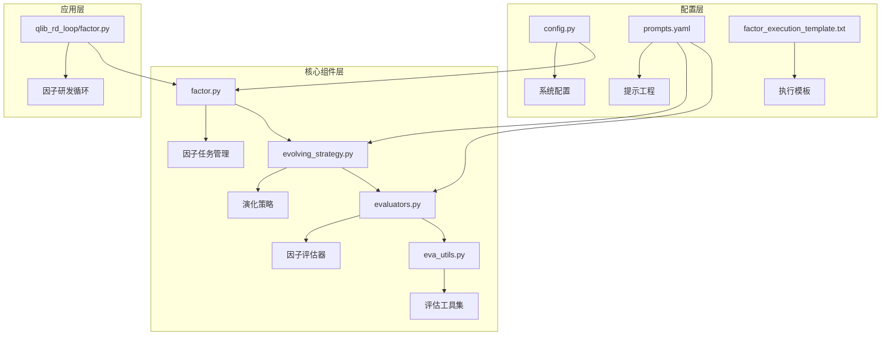

**图表来源**
- [factor.py](file://rdagent/components/coder/factor_coder/factor.py#L1-L50)
- [evolving_strategy.py](file://rdagent/components/coder/factor_coder/evolving_strategy.py#L1-L30)
- [evaluators.py](file://rdagent/components/coder/factor_coder/evaluators.py#L1-L30)

## 核心组件分析

### 因子任务管理器(FactorTask)

因子任务管理器是整个系统的核心控制器，负责管理因子的生命周期：

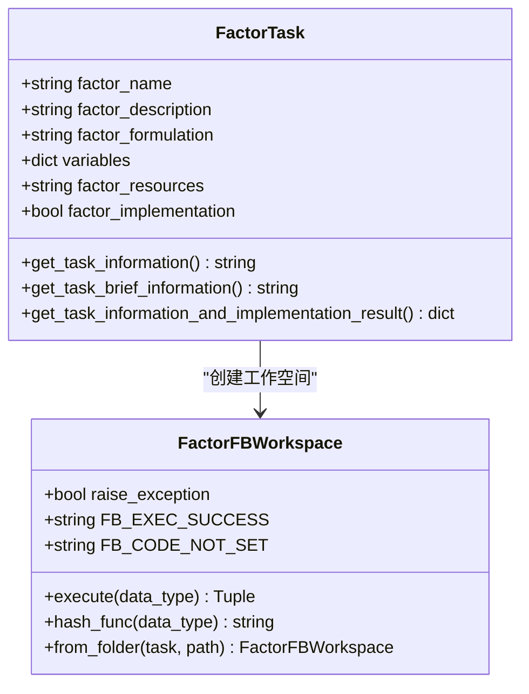

**图表来源**
- [factor.py](file://rdagent/components/coder/factor_coder/factor.py#L15-L80)
- [factor.py](file://rdagent/components/coder/factor_coder/factor.py#L82-L150)

### 演化策略引擎

演化策略引擎采用CoSTEER框架，实现了智能的因子代码生成和优化：

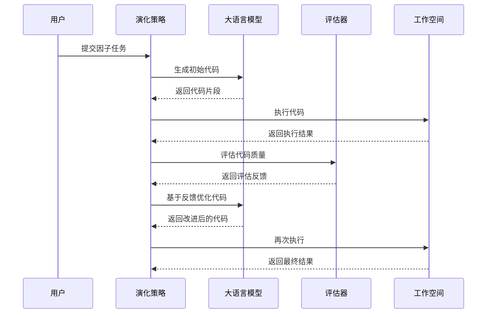

**图表来源**
- [evolving_strategy.py](file://rdagent/components/coder/factor_coder/evolving_strategy.py#L40-L120)

**节来源**
- [factor.py](file://rdagent/components/coder/factor_coder/factor.py#L1-L232)
- [evolving_strategy.py](file://rdagent/components/coder/factor_coder/evolving_strategy.py#L1-L174)

## 架构设计

因子编码器采用分层架构设计，确保系统的可扩展性和维护性：

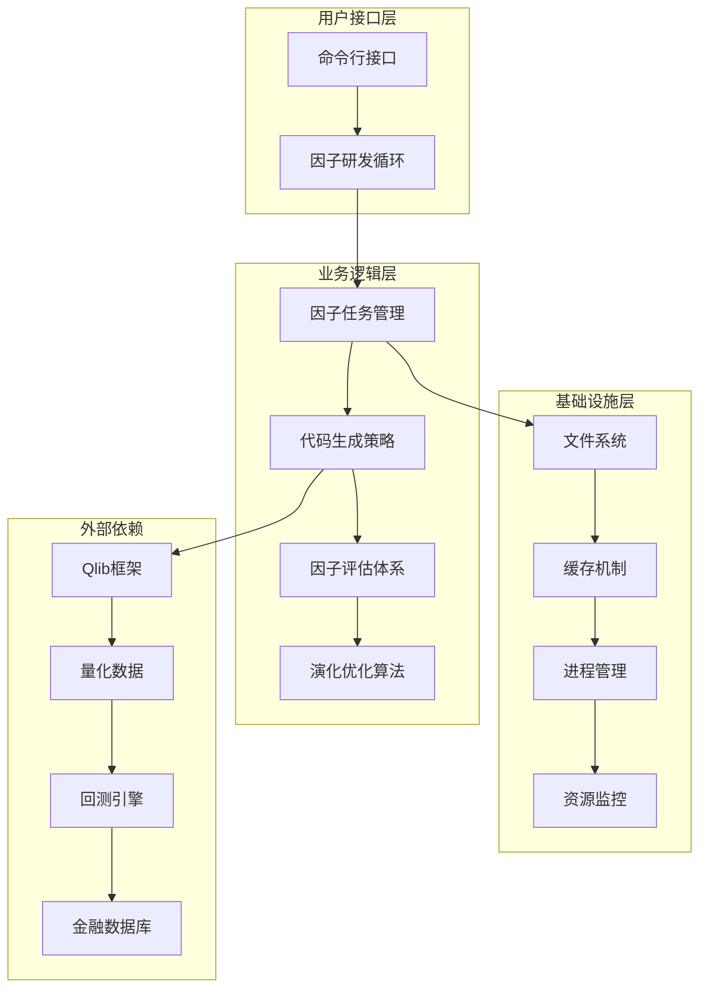

**图表来源**
- [factor.py](file://rdagent/app/qlib_rd_loop/factor.py#L1-L61)
- [config.py](file://rdagent/components/coder/factor_coder/config.py#L1-L50)

## 详细组件分析

### 因子代码生成流程

因子代码生成是系统的核心功能，通过以下步骤实现：

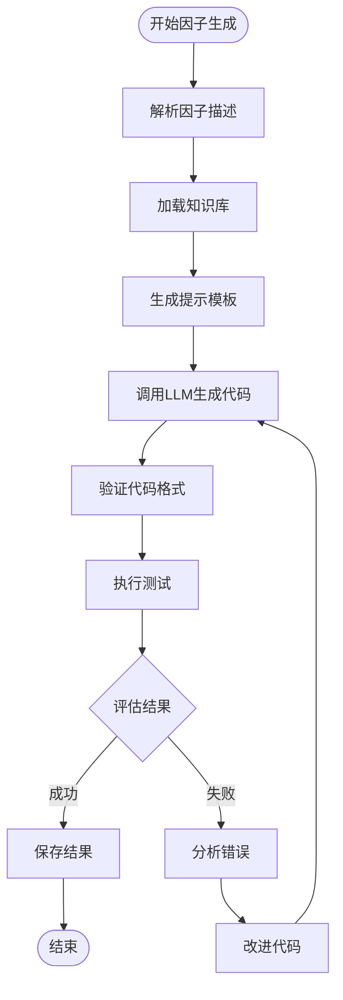

**图表来源**
- [evolving_strategy.py](file://rdagent/components/coder/factor_coder/evolving_strategy.py#L50-L120)

### 因子评估指标体系

系统实现了多层次的因子评估指标：

| 评估维度 | 具体指标 | 权重 | 描述 |
|---------|---------|------|------|
| 数值准确性 | 等值比率 | 30% | 生成值与基准值的相等比例 |
| 相关性 | IC值 | 25% | 信息系数，衡量因子与收益的相关性 |
| 相关性 | Rank IC | 20% | 秩相关系数，非线性相关性度量 |
| 数据格式 | 输出格式 | 15% | DataFrame格式规范性检查 |
| 稳定性 | Inf值检测 | 10% | 检测数值异常和无穷值 |

**节来源**
- [eva_utils.py](file://rdagent/components/coder/factor_coder/eva_utils.py#L350-L450)

## 因子代码生成机制

### 基于模板的代码生成

系统使用预定义的执行模板来确保因子代码的一致性和兼容性：

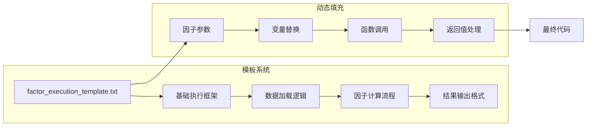

**图表来源**
- [factor_execution_template.txt](file://rdagent/components/coder/factor_coder/factor_execution_template.txt#L1-L16)

### LLM提示工程技巧

系统采用了精心设计的提示工程技术来提高因子代码生成的质量：

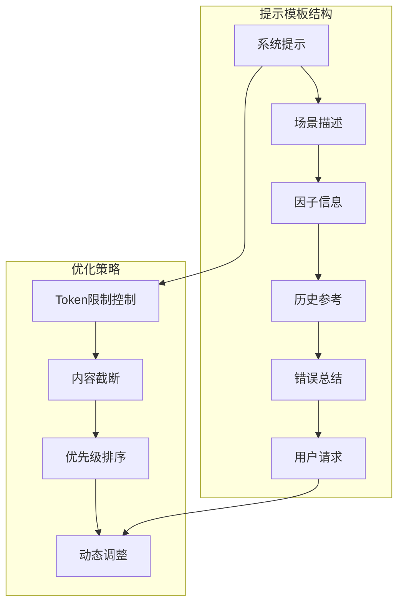

**图表来源**
- [prompts.yaml](file://rdagent/components/coder/factor_coder/prompts.yaml#L40-L120)

**节来源**
- [factor_execution_template.txt](file://rdagent/components/coder/factor_coder/factor_execution_template.txt#L1-L16)
- [prompts.yaml](file://rdagent/components/coder/factor_coder/prompts.yaml#L1-L210)

## 因子评估体系

### 多维度评估机制

系统实现了全面的因子评估体系，涵盖代码质量、数值准确性和业务合理性：

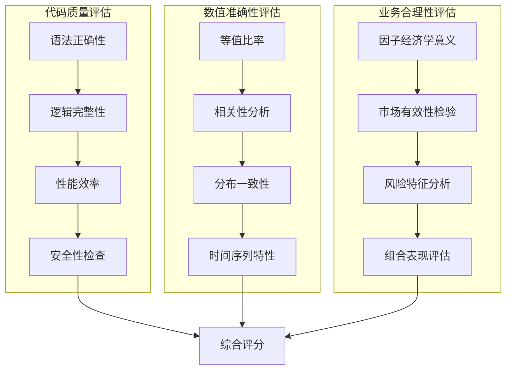

**图表来源**
- [evaluators.py](file://rdagent/components/coder/factor_coder/evaluators.py#L20-L80)
- [eva_utils.py](file://rdagent/components/coder/factor_coder/eva_utils.py#L388-L450)

### IC和IR指标实现

系统实现了专业的因子评估指标计算：

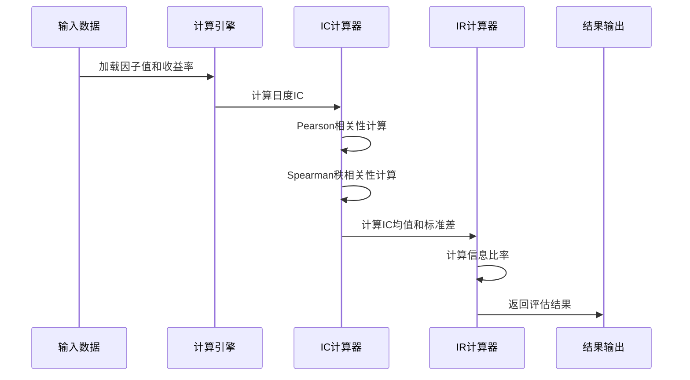

**图表来源**
- [eva_utils.py](file://rdagent/components/coder/factor_coder/eva_utils.py#L352-L385)

**节来源**
- [evaluators.py](file://rdagent/components/coder/factor_coder/evaluators.py#L1-L131)
- [eva_utils.py](file://rdagent/components/coder/factor_coder/eva_utils.py#L350-L400)

## 配置管理

### 因子相关配置项

系统提供了丰富的配置选项来适应不同的量化金融场景：

| 配置项 | 默认值 | 描述 | 影响范围 |
|-------|--------|------|----------|
| data_folder | git_ignore_folder/factor_implementation_source_data | 财务数据存储路径 | 数据访问 |
| data_folder_debug | git_ignore_folder/factor_implementation_source_data_debug | 调试数据存储路径 | 开发调试 |
| file_based_execution_timeout | 3600秒 | 因子执行超时时间 | 性能控制 |
| python_bin | python | Python解释器路径 | 环境兼容 |
| select_method | random | 因子选择方法 | 实验设计 |

### 环境配置管理

系统支持多种环境配置模式：

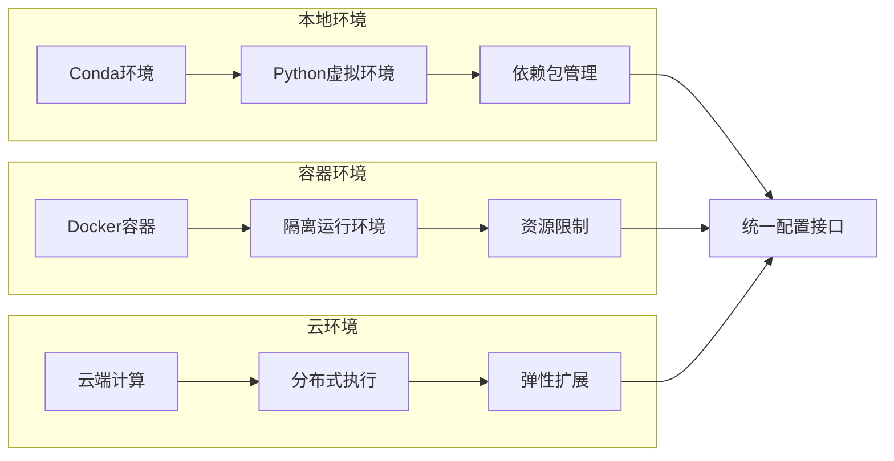

**图表来源**
- [config.py](file://rdagent/components/coder/factor_coder/config.py#L25-L50)

**节来源**
- [config.py](file://rdagent/components/coder/factor_coder/config.py#L1-L50)

## 性能优化与问题解决

### 执行性能优化

系统实现了多层次的性能优化策略：

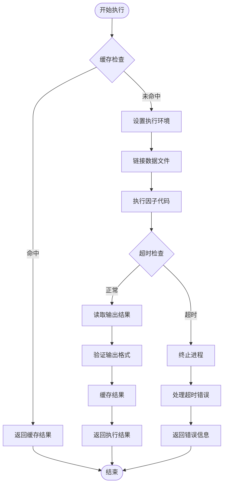

**图表来源**
- [factor.py](file://rdagent/components/coder/factor_coder/factor.py#L105-L180)

### 内存管理策略

系统采用多种内存管理策略来处理大规模金融数据：

| 策略类型 | 实现方式 | 适用场景 | 效果 |
|---------|---------|----------|------|
| 分块处理 | Pandas chunked读取 | 大规模数据集 | 减少内存占用 |
| 缓存机制 | Pickle序列化缓存 | 重复计算避免 | 提升执行速度 |
| 进程隔离 | 子进程执行 | 安全性保障 | 防止内存泄漏 |
| 资源清理 | 文件锁机制 | 并发安全 | 避免资源冲突 |

### 常见性能问题及解决方案

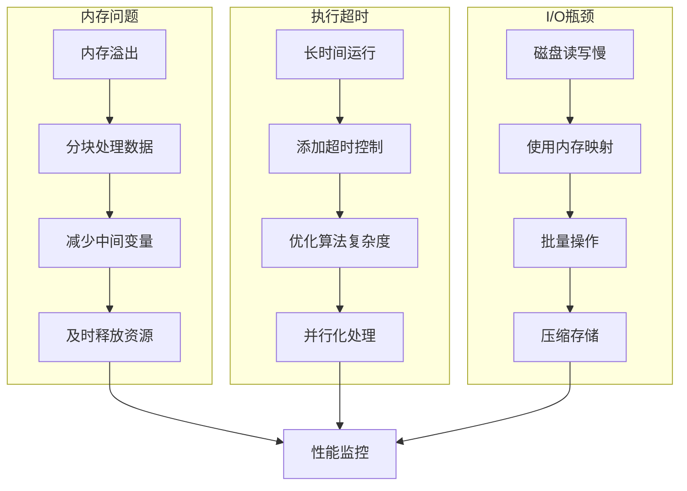

**节来源**
- [factor.py](file://rdagent/components/coder/factor_coder/factor.py#L105-L200)

## 故障排除指南

### 常见错误类型

系统识别并处理多种类型的因子生成错误：

| 错误类型 | 错误代码 | 可能原因 | 解决方案 |
|---------|---------|----------|----------|
| 代码格式错误 | FB_CODE_NOT_SET | 代码未正确生成 | 检查LLM提示配置 |
| 执行超时 | TIMEOUT_ERROR | 算法复杂度过高 | 优化因子逻辑 |
| 输出格式错误 | OUTPUT_FORMAT_ERROR | 结果格式不正确 | 验证DataFrame格式 |
| 内存不足 | MEMORY_ERROR | 数据量过大 | 启用分块处理 |

### 调试和诊断工具

系统提供了完善的调试和诊断功能：

**节来源**
- [factor.py](file://rdagent/components/coder/factor_coder/factor.py#L82-L150)

## 总结

因子编码器作为RD-Agent系统的核心组件，成功地将大语言模型的自然语言理解能力与量化金融的专业知识相结合，实现了从金融理论到可执行因子代码的自动化转换。系统的主要优势包括：

1. **专业性强**：深度集成Qlib框架，确保生成的因子代码符合量化金融的最佳实践
2. **智能化程度高**：利用LLM进行复杂的因子概念理解和代码生成
3. **评估体系完善**：多维度的评估指标确保因子代码的质量和稳定性
4. **性能优化到位**：多层次的性能优化策略保证系统的高效运行
5. **可扩展性好**：模块化设计便于功能扩展和定制

该系统为量化金融领域的研究者和从业者提供了一个强大的工具，大大降低了因子开发的门槛，提高了因子开发的效率和质量。随着系统的不断完善和优化，它将在量化投资领域发挥越来越重要的作用。