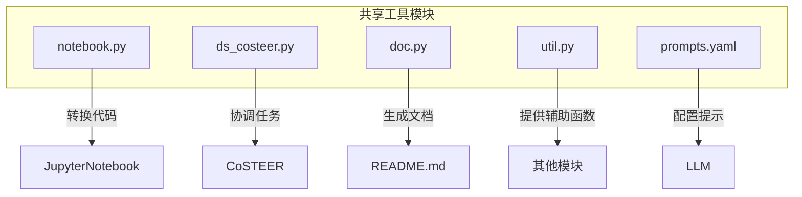
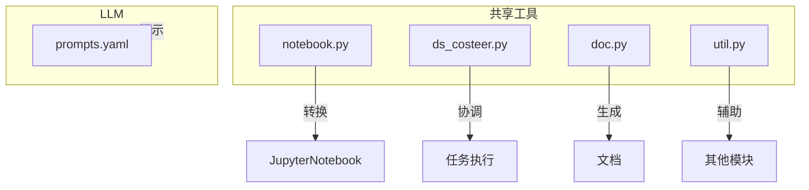
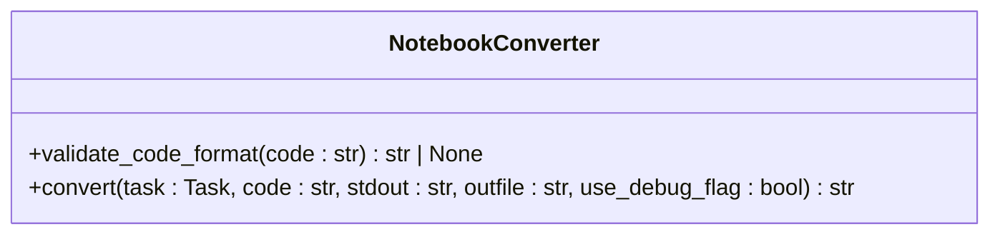
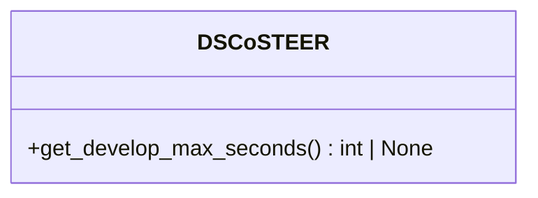
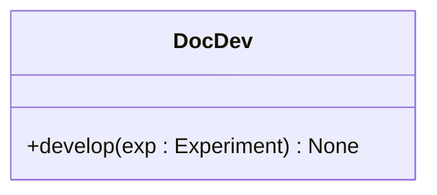
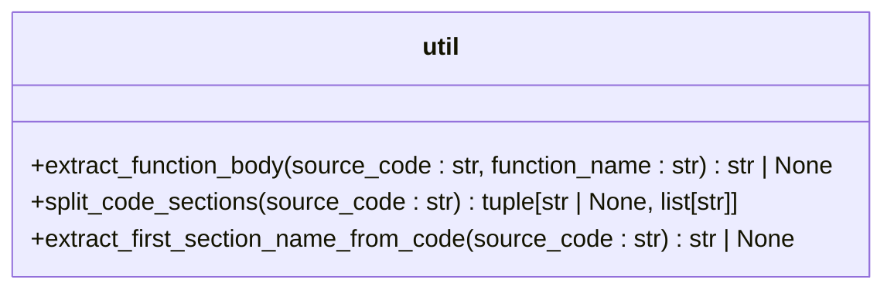
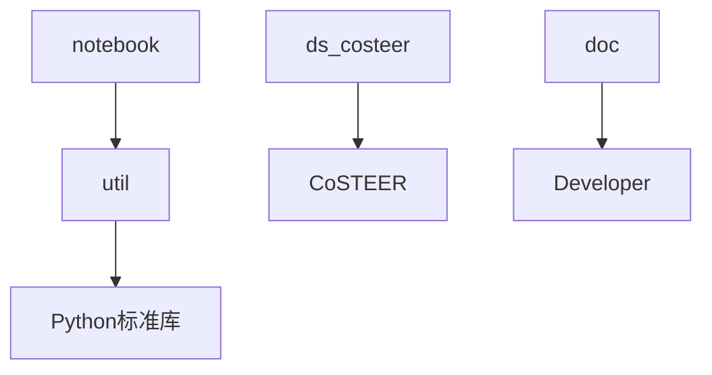

# 共享工具

<cite>
**本文档中引用的文件**  
- [notebook.py](file://rdagent/components/coder/data_science/share/notebook.py)
- [ds_costeer.py](file://rdagent/components/coder/data_science/share/ds_costeer.py)
- [doc.py](file://rdagent/components/coder/data_science/share/doc.py)
- [util.py](file://rdagent/components/coder/data_science/share/util.py)
- [prompts.yaml](file://rdagent/components/coder/data_science/share/prompts.yaml)
- [feature/__init__.py](file://rdagent/components/coder/data_science/feature/__init__.py)
- [model/__init__.py](file://rdagent/components/coder/data_science/model/__init__.py)
- [pipeline/eval.py](file://rdagent/components/coder/data_science/pipeline/eval.py)
</cite>

## 目录
1. [简介](#简介)
2. [项目结构](#项目结构)
3. [核心组件](#核心组件)
4. [架构概述](#架构概述)
5. [详细组件分析](#详细组件分析)
6. [依赖分析](#依赖分析)
7. [性能考虑](#性能考虑)
8. [故障排除指南](#故障排除指南)
9. [结论](#结论)

## 简介
本文档详细介绍了RD-Agent项目中的共享工具模块，重点阐述了`notebook.py`、`ds_costeer.py`、`doc.py`和`util.py`等核心文件的功能与实现。这些工具在数据科学场景下协同工作，支持Jupyter Notebook环境下的代码生成与交互，实现CoSTEER策略的并行任务协调与知识管理，生成代码文档，并提供通用辅助函数。通过`prompts.yaml`配置文件，这些工具被其他模块调用以增强功能，展示了其在`feature`和`model`模块中的实际应用。

## 项目结构
共享工具模块位于`rdagent/components/coder/data_science/share/`目录下，包含多个关键文件，每个文件负责不同的功能。这些工具通过`prompts.yaml`配置文件与LLM交互，实现自动化代码生成、文档生成和错误处理。

**图源**  
- [notebook.py](file://rdagent/components/coder/data_science/share/notebook.py)
- [ds_costeer.py](file://rdagent/components/coder/data_science/share/ds_costeer.py)
- [doc.py](file://rdagent/components/coder/data_science/share/doc.py)
- [util.py](file://rdagent/components/coder/data_science/share/util.py)
- [prompts.yaml](file://rdagent/components/coder/data_science/share/prompts.yaml)

**本节来源**  
- [notebook.py](file://rdagent/components/coder/data_science/share/notebook.py)
- [ds_costeer.py](file://rdagent/components/coder/data_science/share/ds_costeer.py)
- [doc.py](file://rdagent/components/coder/data_science/share/doc.py)
- [util.py](file://rdagent/components/coder/data_science/share/util.py)
- [prompts.yaml](file://rdagent/components/coder/data_science/share/prompts.yaml)

## 核心组件
共享工具模块的核心组件包括`notebook.py`、`ds_costeer.py`、`doc.py`和`util.py`，每个组件都有明确的职责和功能。

**本节来源**  
- [notebook.py](file://rdagent/components/coder/data_science/share/notebook.py)
- [ds_costeer.py](file://rdagent/components/coder/data_science/share/ds_costeer.py)
- [doc.py](file://rdagent/components/coder/data_science/share/doc.py)
- [util.py](file://rdagent/components/coder/data_science/share/util.py)

## 架构概述
共享工具模块的架构设计旨在支持数据科学场景下的自动化代码生成和文档生成。通过`notebook.py`实现Python代码到Jupyter Notebook的转换，`ds_costeer.py`协调并行任务和知识管理，`doc.py`生成代码文档，`util.py`提供通用辅助函数。这些工具通过`prompts.yaml`配置文件与LLM交互，实现高效的任务执行。

**图源**  
- [notebook.py](file://rdagent/components/coder/data_science/share/notebook.py)
- [ds_costeer.py](file://rdagent/components/coder/data_science/share/ds_costeer.py)
- [doc.py](file://rdagent/components/coder/data_science/share/doc.py)
- [util.py](file://rdagent/components/coder/data_science/share/util.py)
- [prompts.yaml](file://rdagent/components/coder/data_science/share/prompts.yaml)

## 详细组件分析

### notebook.py 分析
`notebook.py`模块负责将Python代码转换为Jupyter Notebook格式，支持在Jupyter环境中执行和展示代码。

#### 功能分析
`notebook.py`通过`NotebookConverter`类实现代码转换功能。该类首先验证代码格式，确保包含`main`函数和`print("Section: <section name>")`作为部分分隔符。然后，它将代码和输出分割成多个部分，每个部分对应一个Notebook单元格。最后，它使用LLM生成Notebook的介绍单元格，并将所有单元格组合成一个完整的Notebook。

**图源**  
- [notebook.py](file://rdagent/components/coder/data_science/share/notebook.py#L39-L135)

#### 实际应用
`notebook.py`在`pipeline/eval.py`中被调用，用于验证和转换生成的代码。当`DS_RD_SETTING.enable_notebook_conversion`启用时，系统会检查代码格式并生成Notebook文件。

**本节来源**  
- [notebook.py](file://rdagent/components/coder/data_science/share/notebook.py)
- [pipeline/eval.py](file://rdagent/components/coder/data_science/pipeline/eval.py#L100-L115)

### ds_costeer.py 分析
`ds_costeer.py`模块实现了数据科学场景下的CoSTEER策略，协调并行任务和知识管理。

#### 功能分析
`ds_costeer.py`通过继承`CoSTEER`类实现`DSCoSTEER`类。该类重写了`get_develop_max_seconds`方法，使用场景的真实调试超时作为开发的最大秒数。

**图源**  
- [ds_costeer.py](file://rdagent/components/coder/data_science/share/ds_costeer.py#L4-L9)

#### 实际应用
`ds_costeer.py`在`feature/__init__.py`和`model/__init__.py`中被用作基类，实现`FeatureCoSTEER`和`ModelCoSTEER`类。这些类继承了`DSCoSTEER`的功能，用于协调特征工程和模型开发任务。

**本节来源**  
- [ds_costeer.py](file://rdagent/components/coder/data_science/share/ds_costeer.py)
- [feature/__init__.py](file://rdagent/components/coder/data_science/feature/__init__.py#L23)
- [model/__init__.py](file://rdagent/components/coder/data_science/model/__init__.py#L23)

### doc.py 分析
`doc.py`模块负责生成代码文档，帮助用户理解生成的代码和模型。

#### 功能分析
`doc.py`通过`DocDev`类实现文档生成功能。该类继承自`Developer`类，重写了`develop`方法。该方法首先获取工作区中的所有文件列表，然后使用LLM生成Markdown格式的文档，并将其注入到工作区中。

**图源**  
- [doc.py](file://rdagent/components/coder/data_science/share/doc.py#L15-L36)

#### 实际应用
`doc.py`在`pipeline/eval.py`中被间接调用，用于生成代码文档。当需要生成文档时，系统会调用`DocDev`类的`develop`方法。

**本节来源**  
- [doc.py](file://rdagent/components/coder/data_science/share/doc.py)
- [pipeline/eval.py](file://rdagent/components/coder/data_science/pipeline/eval.py)

### util.py 分析
`util.py`模块提供了多个通用辅助函数，用于代码处理和分析。

#### 功能分析
`util.py`包含多个函数，如`extract_function_body`、`split_code_sections`、`extract_first_section_name_from_code`等。这些函数用于提取函数体、分割代码部分、提取部分名称等。

**图源**  
- [util.py](file://rdagent/components/coder/data_science/share/util.py#L39-L365)

#### 实际应用
`util.py`在`notebook.py`中被广泛使用，用于处理和分析代码。例如，`NotebookConverter`类使用`extract_function_body`和`split_code_sections`函数来分割代码和输出。

**本节来源**  
- [util.py](file://rdagent/components/coder/data_science/share/util.py)
- [notebook.py](file://rdagent/components/coder/data_science/share/notebook.py)

## 依赖分析
共享工具模块的依赖关系清晰，各组件之间通过明确的接口进行交互。`notebook.py`依赖`util.py`进行代码处理，`ds_costeer.py`继承`CoSTEER`类，`doc.py`继承`Developer`类，`util.py`提供通用辅助函数。

**图源**  
- [notebook.py](file://rdagent/components/coder/data_science/share/notebook.py)
- [ds_costeer.py](file://rdagent/components/coder/data_science/share/ds_costeer.py)
- [doc.py](file://rdagent/components/coder/data_science/share/doc.py)
- [util.py](file://rdagent/components/coder/data_science/share/util.py)

**本节来源**  
- [notebook.py](file://rdagent/components/coder/data_science/share/notebook.py)
- [ds_costeer.py](file://rdagent/components/coder/data_science/share/ds_costeer.py)
- [doc.py](file://rdagent/components/coder/data_science/share/doc.py)
- [util.py](file://rdagent/components/coder/data_science/share/util.py)

## 性能考虑
共享工具模块在设计时考虑了性能优化。例如，`notebook.py`通过预处理代码和输出，减少了LLM的调用次数。`ds_costeer.py`通过设置合理的开发最大秒数，避免了长时间的无效计算。`doc.py`通过批量处理文件，提高了文档生成效率。

## 故障排除指南
在使用共享工具模块时，可能会遇到一些常见问题。以下是一些故障排除建议：

1. **代码格式错误**：确保代码包含`main`函数和`print("Section: <section name>")`作为部分分隔符。
2. **LLM调用失败**：检查网络连接和LLM配置，确保能够正常调用LLM。
3. **文件路径错误**：确保所有文件路径正确，避免因路径错误导致的文件读取失败。
4. **依赖缺失**：确保所有依赖库已正确安装，避免因依赖缺失导致的运行错误。

**本节来源**  
- [notebook.py](file://rdagent/components/coder/data_science/share/notebook.py)
- [ds_costeer.py](file://rdagent/components/coder/data_science/share/ds_costeer.py)
- [doc.py](file://rdagent/components/coder/data_science/share/doc.py)
- [util.py](file://rdagent/components/coder/data_science/share/util.py)

## 结论
共享工具模块是RD-Agent项目中的重要组成部分，通过`notebook.py`、`ds_costeer.py`、`doc.py`和`util.py`等核心文件，实现了代码生成、任务协调、文档生成和辅助函数提供等功能。这些工具通过`prompts.yaml`配置文件与LLM交互，支持数据科学场景下的自动化开发。通过详细的分析和实际应用示例，本文档为用户提供了全面的理解和使用指南。