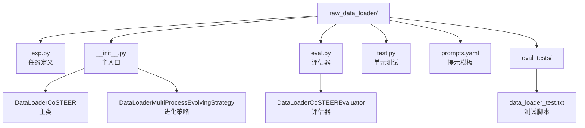
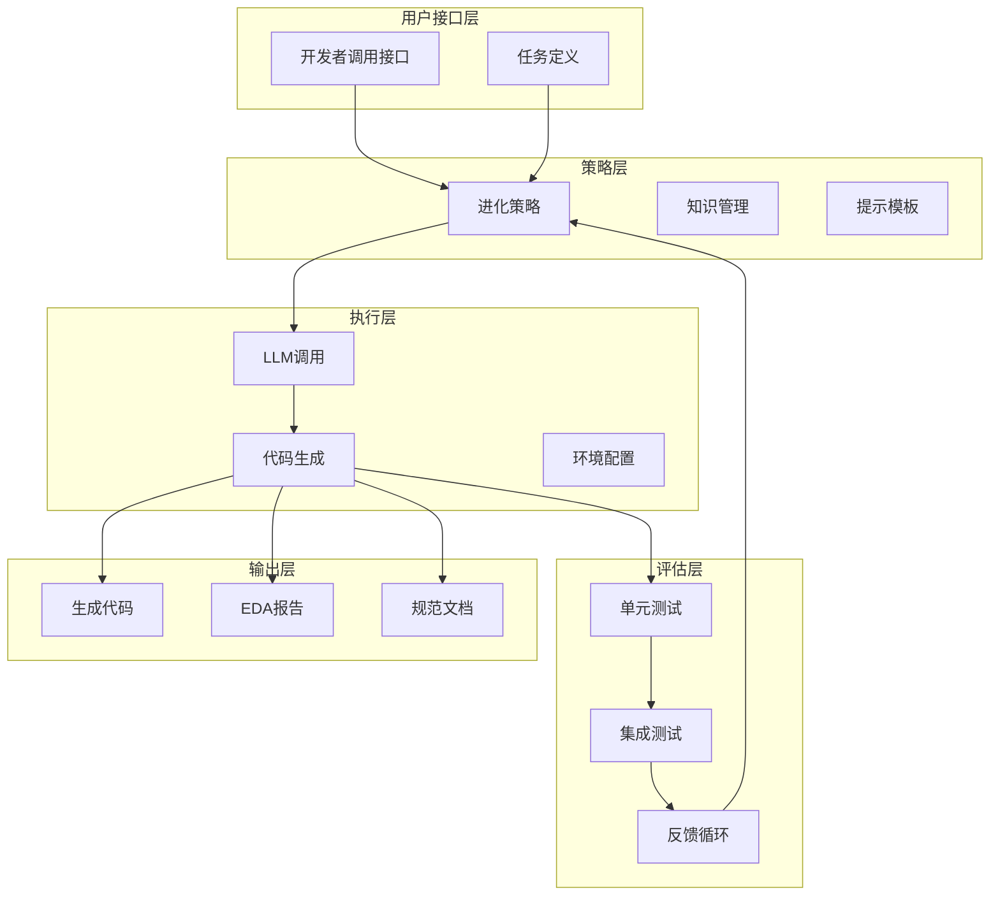
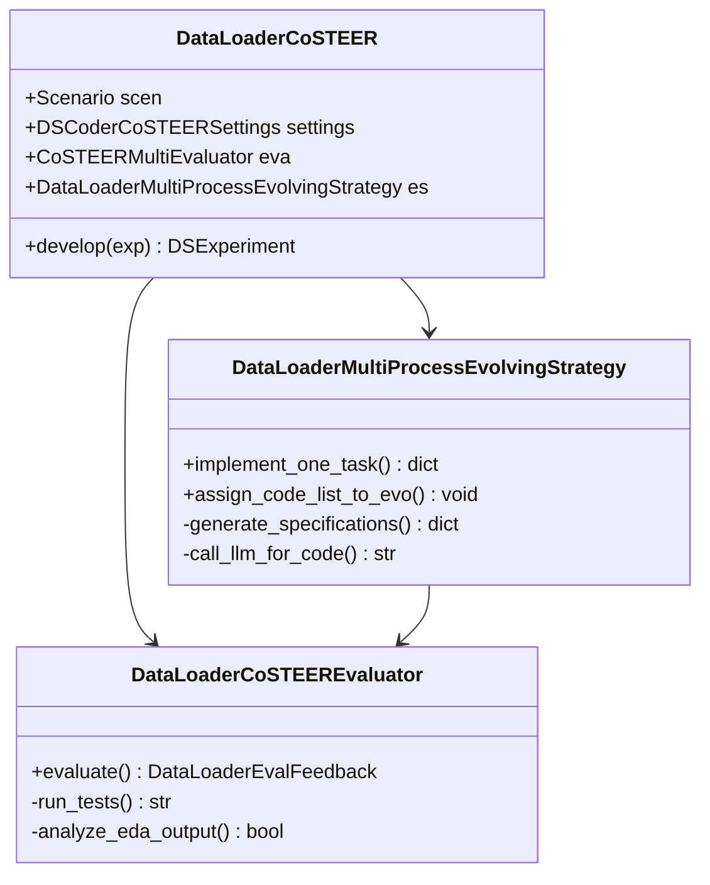
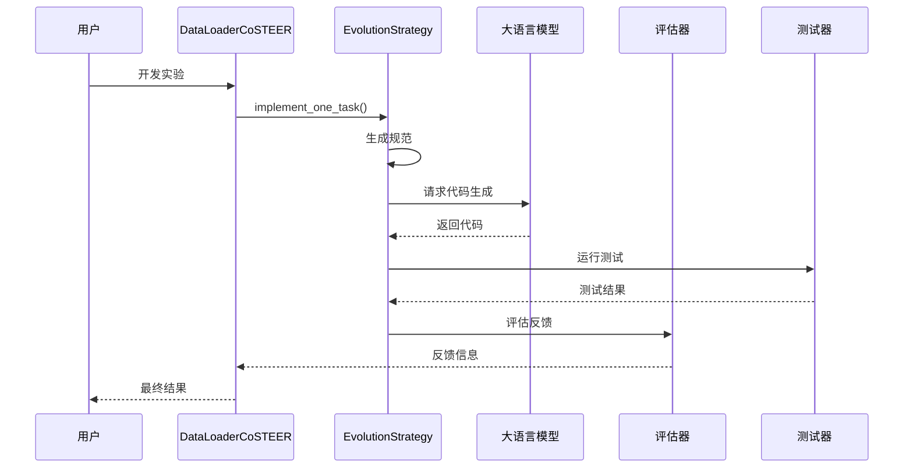
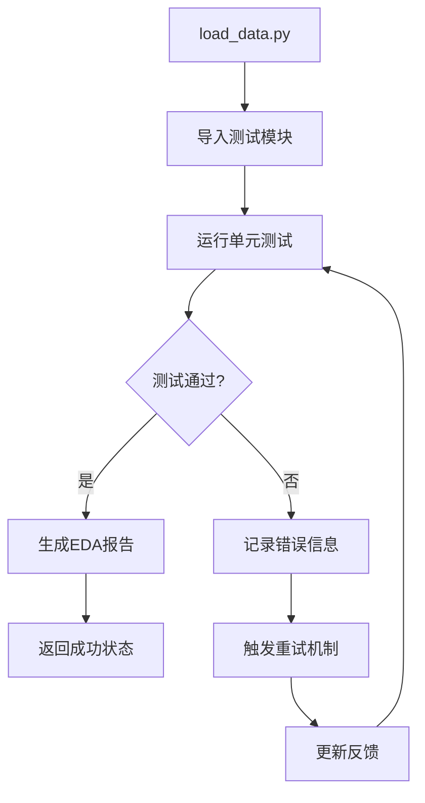
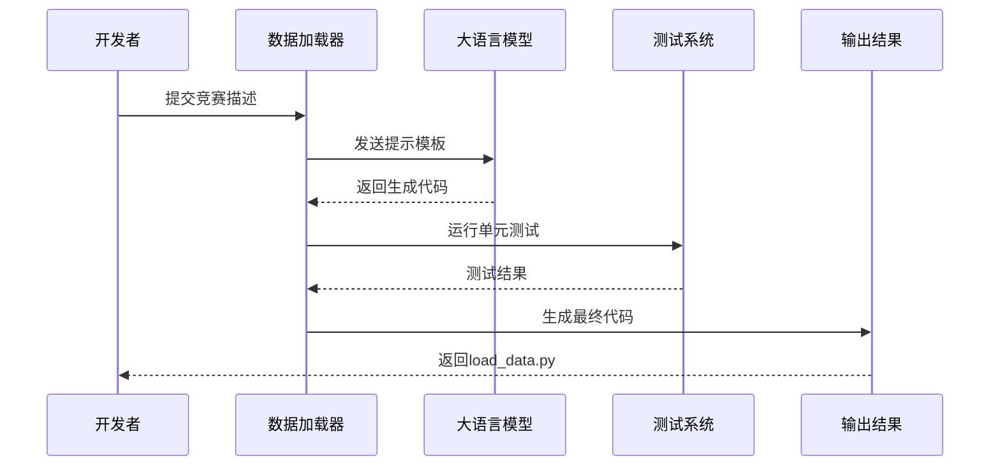
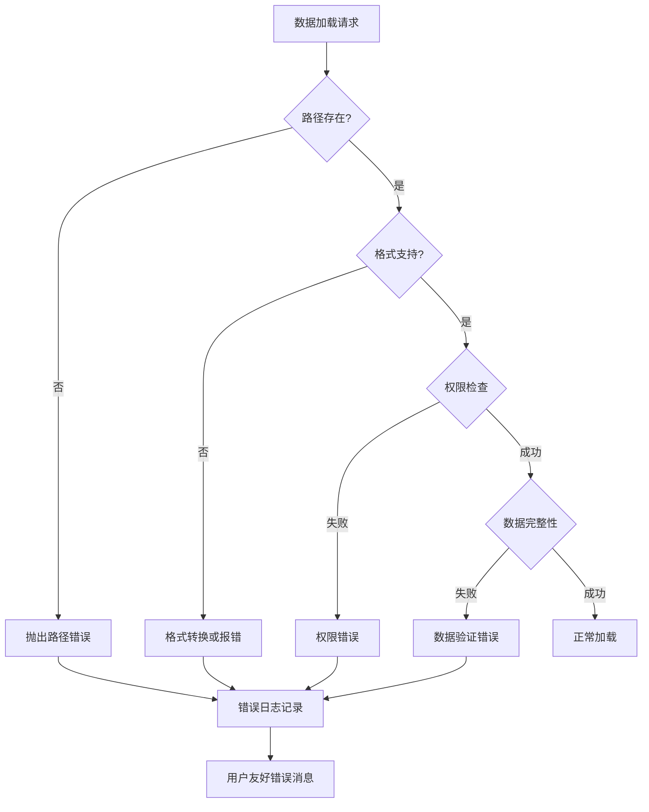

# 原始数据加载器

<cite>
**本文档引用的文件**
- [exp.py](file://rdagent/components/coder/data_science/raw_data_loader/exp.py)
- [eval.py](file://rdagent/components/coder/data_science/raw_data_loader/eval.py)
- [test.py](file://rdagent/components/coder/data_science/raw_data_loader/test.py)
- [prompts.yaml](file://rdagent/components/coder/data_science/raw_data_loader/prompts.yaml)
- [__init__.py](file://rdagent/components/coder/data_science/raw_data_loader/__init__.py)
- [load_data.py](file://rdagent/scenarios/kaggle/tpl_ex/aerial-cactus-identification/load_data.py)
- [data_loader_test.txt](file://rdagent/components/coder/data_science/raw_data_loader/eval_tests/data_loader_test.txt)
- [data.py](file://rdagent/scenarios/data_science/debug/data.py)
- [conf.py](file://rdagent/components/coder/data_science/conf.py)
</cite>

## 目录
1. [简介](#简介)
2. [项目结构](#项目结构)
3. [核心组件](#核心组件)
4. [架构概览](#架构概览)
5. [详细组件分析](#详细组件分析)
6. [数据源适配机制](#数据源适配机制)
7. [评估标准与测试](#评估标准与测试)
8. [LLM提示模板系统](#llm提示模板系统)
9. [实际应用案例](#实际应用案例)
10. [常见问题与解决方案](#常见问题与解决方案)
11. [总结](#总结)

## 简介

原始数据加载器是RD-Agent框架中的核心组件，专门负责根据任务描述自动生成数据加载代码。该组件能够智能识别多种数据源格式（CSV、Parquet、JSON、HDF5等），并为不同的机器学习竞赛提供定制化的数据加载解决方案。

该系统采用基于LLM的自动化代码生成方法，通过CoSTEER框架实现智能迭代优化，确保生成的数据加载代码既符合规范又具有良好的性能特征。

## 项目结构

原始数据加载器位于`rdagent/components/coder/data_science/raw_data_loader/`目录下，包含以下关键文件：



**图表来源**
- [exp.py](file://rdagent/components/coder/data_science/raw_data_loader/exp.py#L1-L7)
- [__init__.py](file://rdagent/components/coder/data_science/raw_data_loader/__init__.py#L1-L50)
- [eval.py](file://rdagent/components/coder/data_science/raw_data_loader/eval.py#L1-L30)

**章节来源**
- [exp.py](file://rdagent/components/coder/data_science/raw_data_loader/exp.py#L1-L7)
- [__init__.py](file://rdagent/components/coder/data_science/raw_data_loader/__init__.py#L1-L243)

## 核心组件

### DataLoaderTask任务类

`DataLoaderTask`继承自`CoSTEERTask`，用于表示数据加载任务的基本结构。该类作为任务识别的基础，支持不同类型的数据加载需求。

### DataLoaderCoSTEER主类

`DataLoaderCoSTEER`是数据加载器的主要入口点，继承自`DSCoSTEER`基类，提供了完整的数据加载代码生成和优化功能。

### DataLoaderMultiProcessEvolvingStrategy进化策略

该策略类实现了多进程并行进化算法，负责：
- 生成数据加载规范
- 调用LLM生成代码
- 管理代码迭代优化过程

**章节来源**
- [exp.py](file://rdagent/components/coder/data_science/raw_data_loader/exp.py#L1-L7)
- [__init__.py](file://rdagent/components/coder/data_science/raw_data_loader/__init__.py#L120-L180)

## 架构概览

原始数据加载器采用分层架构设计，包含以下几个主要层次：



**图表来源**
- [__init__.py](file://rdagent/components/coder/data_science/raw_data_loader/__init__.py#L54-L120)
- [eval.py](file://rdagent/components/coder/data_science/raw_data_loader/eval.py#L20-L60)

## 详细组件分析

### 数据加载器主类分析

`DataLoaderCoSTEER`类是整个系统的核心，它整合了多个子组件的功能：



**图表来源**
- [__init__.py](file://rdagent/components/coder/data_science/raw_data_loader/__init__.py#L120-L150)
- [eval.py](file://rdagent/components/coder/data_science/raw_data_loader/eval.py#L20-L50)

### 实现流程分析

数据加载器的实现遵循严格的迭代流程：



**图表来源**
- [__init__.py](file://rdagent/components/coder/data_science/raw_data_loader/__init__.py#L54-L120)
- [eval.py](file://rdagent/components/coder/data_science/raw_data_loader/eval.py#L30-L80)

**章节来源**
- [__init__.py](file://rdagent/components/coder/data_science/raw_data_loader/__init__.py#L54-L180)
- [eval.py](file://rdagent/components/coder/data_science/raw_data_loader/eval.py#L20-L95)

## 数据源适配机制

### 自动格式检测

系统内置了强大的数据格式自动检测机制，支持多种数据源格式：

| 文件格式 | 检测方式 | 读取函数 | 写入函数 | 特殊处理 |
|---------|---------|---------|---------|---------|
| CSV | 扩展名匹配 | `pd.read_csv()` | `df.to_csv()` | UTF-8编码，无索引 |
| Parquet | 扩展名匹配 | `pd.read_parquet()` | `df.to_parquet()` | 支持压缩，带索引 |
| JSON | 扩展名匹配 | `pd.read_json()` | `df.to_json()` | 支持JSON Lines格式 |
| HDF5 | 扩展名匹配 | `pd.read_hdf()` | `df.to_hdf()` | 需要指定key |
| Pickle | 扩展名匹配 | `pd.read_pickle()` | `df.to_pickle()` | Python原生序列化 |
| BSON | 扩展名匹配 | `bson.decode_file_iter()` | 自定义写入 | MongoDB格式 |

### 数据源适配流程

```mermaid
flowchart TD
A[输入文件路径] --> B{检测文件扩展名}
B --> |.csv| C[CSV处理器]
B --> |.parquet| D[Parquet处理器]
B --> |.json| E[JSON处理器]
B --> |.h5/.hdf/.hdf5| F[HDF5处理器]
B --> |.pkl| G[Pickle处理器]
B --> |.bson| H[BSON处理器]
C --> I[pd.read_csv]
D --> J[pd.read_parquet]
E --> K{JSON Lines?}
F --> L[pd.read_hdf]
G --> M[pd.read_pickle]
H --> N[bson.decode_file_iter]
K --> |是| O[pd.read_json(lines=True)]
K --> |否| P[pd.read_json(lines=False)]
I --> Q[返回DataFrame]
J --> Q
O --> Q
P --> Q
L --> Q
M --> Q
N --> Q
```

**图表来源**
- [data.py](file://rdagent/scenarios/data_science/debug/data.py#L37-L66)

**章节来源**
- [data.py](file://rdagent/scenarios/data_science/debug/data.py#L37-L108)

## 评估标准与测试

### 评估指标体系

数据加载器的评估采用多层次的评价体系：

#### 1. 功能完整性检查
- **数据完整性**：验证训练数据、标签、测试数据和测试ID的正确性
- **形状一致性**：确保训练数据与标签长度一致，测试数据与ID长度匹配
- **数据类型验证**：检查返回值的数据类型是否符合预期

#### 2. 性能指标评估
- **执行时间**：监控代码执行效率
- **内存使用**：评估内存占用情况
- **缓存效果**：验证缓存机制的有效性

#### 3. EDA质量评估
- **数据探索深度**：检查EDA部分是否包含足够的信息
- **数据类型识别**：验证数据类型的准确识别
- **缺失值检测**：评估缺失值的发现能力

### 单元测试框架

测试框架提供了全面的验证机制：



**图表来源**
- [data_loader_test.txt](file://rdagent/components/coder/data_science/raw_data_loader/eval_tests/data_loader_test.txt#L40-L84)

**章节来源**
- [eval.py](file://rdagent/components/coder/data_science/raw_data_loader/eval.py#L20-L95)
- [data_loader_test.txt](file://rdagent/components/coder/data_science/raw_data_loader/eval_tests/data_loader_test.txt#L1-L84)

## LLM提示模板系统

### 提示模板结构

系统采用分层的提示模板设计，包含规范生成和代码生成两个主要阶段：

#### 规范生成模板
- **系统提示**：定义数据科学家角色和任务背景
- **用户提示**：提供具体的竞赛信息和数据源描述
- **输出格式**：markdown格式的函数定义和文档字符串

#### 代码生成模板
- **上下文信息**：包含相似成功案例和失败教训
- **编码指南**：详细的编码规范和最佳实践
- **EDA要求**：强制性的数据探索分析部分

### 提示模板示例

系统为不同类型的竞赛提供定制化的提示模板，确保生成的代码符合特定需求。

**章节来源**
- [prompts.yaml](file://rdagent/components/coder/data_science/raw_data_loader/prompts.yaml#L1-L403)

## 实际应用案例

### Kaggle竞赛数据集加载示例

以"aerial-cactus-identification"竞赛为例，展示完整的数据加载流程：

#### 输入数据结构
- 训练数据：CSV文件包含图像ID和标签
- 图像数据：训练和测试目录中的图像文件
- 输出格式：统一的numpy数组格式

#### 生成的代码特点
- **模块化设计**：分离图像加载和标签处理逻辑
- **类型注解**：完整的类型声明
- **EDA集成**：自动化的数据探索分析
- **错误处理**：健壮的异常处理机制

### 完整工作流程



**图表来源**
- [load_data.py](file://rdagent/scenarios/kaggle/tpl_ex/aerial-cactus-identification/load_data.py#L1-L83)

**章节来源**
- [load_data.py](file://rdagent/scenarios/kaggle/tpl_ex/aerial-cactus-identification/load_data.py#L1-L83)
- [test.py](file://rdagent/components/coder/data_science/raw_data_loader/test.py#L1-L31)

## 常见问题与解决方案

### 路径错误问题

#### 问题描述
- **相对路径问题**：代码尝试访问当前工作目录而非指定数据目录
- **权限问题**：缺乏对数据文件的读取权限
- **路径分隔符**：不同操作系统间的路径格式差异

#### 解决方案
- 使用绝对路径配置，确保从正确的数据源位置加载
- 实现路径验证机制，提前检测路径有效性
- 采用跨平台的路径处理库

### 格式不支持问题

#### 问题描述
- **未知文件格式**：遇到不支持的文件扩展名
- **编码问题**：文本文件的字符编码不匹配
- **结构不匹配**：数据结构与预期不符

#### 解决策略
- 实现格式检测和降级处理机制
- 提供默认编码设置和手动配置选项
- 添加数据验证和转换逻辑

### 性能优化问题

#### 问题表现
- **内存溢出**：大数据集加载导致内存不足
- **加载缓慢**：I/O操作成为性能瓶颈
- **缓存失效**：缓存机制未能有效提升性能

#### 优化措施
- 实现分块加载和流式处理
- 启用多线程和异步I/O操作
- 优化缓存策略和存储格式

### 错误处理机制

系统提供了完善的错误处理框架：



**章节来源**
- [conf.py](file://rdagent/components/coder/data_science/conf.py#L30-L88)

## 总结

原始数据加载器是一个高度智能化的数据处理系统，它通过以下核心特性实现了高效的数据加载自动化：

### 主要优势
1. **智能格式识别**：自动检测和处理多种数据格式
2. **LLM驱动生成**：利用大语言模型生成高质量代码
3. **严格评估机制**：多层次的质量保证体系
4. **灵活配置选项**：适应不同场景和需求
5. **健壮错误处理**：完善的异常管理和恢复机制

### 技术创新
- **CoSTEER框架集成**：实现了智能的代码迭代优化
- **知识管理系统**：积累和复用历史成功经验
- **多进程并行处理**：提升大规模数据处理效率
- **EDA强制集成**：确保数据质量的可视化验证

### 应用价值
该系统显著降低了数据科学项目的开发门槛，提高了数据处理的一致性和可靠性，为机器学习竞赛和实际项目提供了强有力的技术支撑。

通过持续的迭代优化和社区贡献，原始数据加载器将继续演进，为更广泛的数据科学应用场景提供支持。