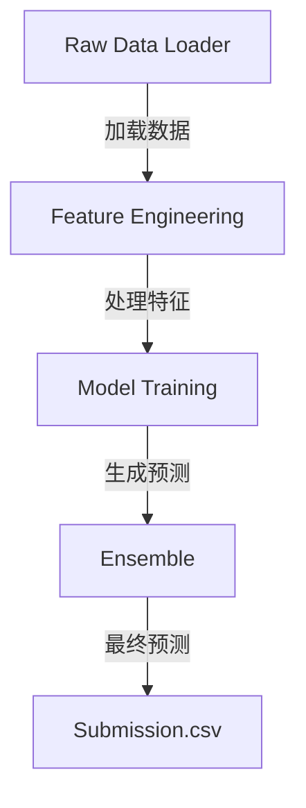
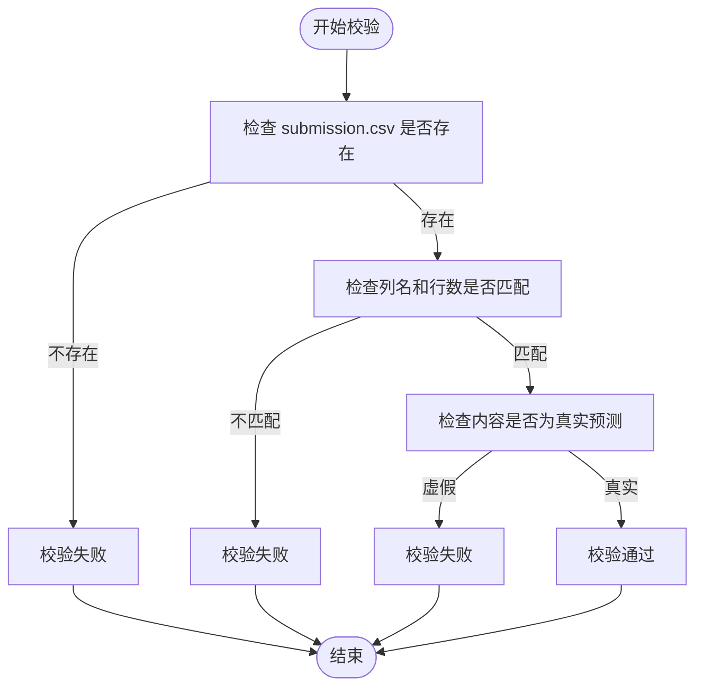

# 工作流编排

<cite>
**本文档中引用的文件**  
- [exp.py](file://rdagent/components/coder/data_science/pipeline/exp.py)
- [eval.py](file://rdagent/components/coder/data_science/pipeline/eval.py)
- [prompts.yaml](file://rdagent/components/coder/data_science/pipeline/prompts.yaml)
- [__init__.py](file://rdagent/components/coder/data_science/pipeline/__init__.py)
- [notebook.py](file://rdagent/components/coder/data_science/share/notebook.py)
- [test_eval.py](file://rdagent/scenarios/data_science/test_eval.py)
</cite>

## 目录
1. [引言](#引言)
2. [工作流编排核心机制](#工作流编排核心机制)
3. [模块整合与端到端管道](#模块整合与端到端管道)
4. [工作流验证机制](#工作流验证机制)
5. [提示模板与主运行脚本生成](#提示模板与主运行脚本生成)
6. [提交文件格式校验](#提交文件格式校验)
7. [端到端示例流程](#端到端示例流程)
8. [工作流中断恢复策略](#工作流中断恢复策略)
9. [结论](#结论)

## 引言
本文档详细阐述了RD-Agent系统中工作流编排模块的实现机制。该模块负责将`raw_data_loader`、`feature`、`model`和`ensemble`等独立组件的输出整合成一个可执行的端到端数据科学管道。文档将深入解析`exp.py`如何协调各组件，`eval.py`如何验证工作流的连贯性，以及`prompts.yaml`中用于生成主运行脚本的提示模板。同时，文档将重点说明提交文件格式的校验逻辑和工作流中断后的恢复策略。

## 工作流编排核心机制

工作流编排模块的核心是`PipelineTask`类，它继承自`CoSTEERTask`，作为数据科学管道的顶层任务单元。该模块通过`PipelineMultiProcessEvolvingStrategy`策略来实现任务的并行演化，确保各组件能够独立发展并最终被整合。

**Section sources**
- [exp.py](file://rdagent/components/coder/data_science/pipeline/exp.py#L1-L9)
- [__init__.py](file://rdagent/components/coder/data_science/pipeline/__init__.py#L1-L166)

## 模块整合与端到端管道

`exp.py`文件中的`PipelineTask`是构建端到端管道的核心。它通过继承`CoSTEERTask`来定义管道任务的元数据和行为。当系统需要生成一个完整的数据科学解决方案时，`PipelineMultiProcessEvolvingStrategy`的`implement_one_task`方法会被调用，该方法负责协调`raw_data_loader`、`feature`、`model`和`ensemble`等组件的输出，并将它们整合成一个可执行的`main.py`脚本。

整合过程遵循严格的步骤：
1.  **数据加载**: 从指定的输入路径加载数据，确保数据加载器的输出格式与其他组件兼容。
2.  **特征工程**: 将`feature`组件生成的特征处理逻辑集成到管道中。
3.  **模型训练**: 将`model`组件的训练脚本和超参数配置整合进来。
4.  **模型集成**: 最后，将`ensemble`组件的集成策略（如投票、堆叠等）添加到管道的末尾，用于生成最终的预测结果。



**Diagram sources**
- [exp.py](file://rdagent/components/coder/data_science/pipeline/exp.py#L1-L9)
- [__init__.py](file://rdagent/components/coder/data_science/pipeline/__init__.py#L1-L166)

**Section sources**
- [exp.py](file://rdagent/components/coder/data_science/pipeline/exp.py#L1-L9)
- [__init__.py](file://rdagent/components/coder/data_science/pipeline/__init__.py#L1-L166)

## 工作流验证机制

`eval.py`文件中的`PipelineCoSTEEREvaluator`类负责验证整个工作流的连贯性。它通过一系列检查来确保管道的正确性和鲁棒性：

1.  **执行成功性检查**: 验证`main.py`脚本能否成功执行，不产生运行时错误。
2.  **数据格式兼容性检查**: 确保各组件间传递的数据格式（如DataFrame的列名、数据类型）保持一致。
3.  **依赖关系验证**: 检查组件间的调用顺序和依赖是否正确，例如，确保特征工程在模型训练之前完成。
4.  **调试模式合规性**: 验证代码是否支持`--debug`模式，该模式下应使用小样本数据快速验证代码逻辑。
5.  **评分文件检查**: 确保生成的`scores.csv`文件包含所有必需的模型（包括`ensemble`），且指标列名与竞赛要求一致。

```mermaid
sequenceDiagram
participant Evaluator as PipelineCoSTEEREvaluator
participant Workspace as FBWorkspace
participant Env as Execution Environment
Evaluator->>Workspace : execute(env, entry="python main.py")
Workspace->>Env : 执行代码
Env-->>Workspace : 返回stdout和exit_code
Evaluator->>Evaluator : 分析stdout和生成的文件
Evaluator->>Evaluator : 检查scores.csv和submission.csv
Evaluator->>Evaluator : 生成DSCoderFeedback
Evaluator-->> : 返回评估结果
```

**Diagram sources**
- [eval.py](file://rdagent/components/coder/data_science/pipeline/eval.py#L1-L349)

**Section sources**
- [eval.py](file://rdagent/components/coder/data_science/pipeline/eval.py#L1-L349)

## 提示模板与主运行脚本生成

`prompts.yaml`文件中的`pipeline_coder`模板是生成主运行脚本`main.py`的关键。该模板为LLM提供了详细的指令，包括：

*   **任务描述**: 明确管道需要完成的具体任务。
*   **运行环境**: 描述代码将运行的环境，包括可用的包和版本。
*   **规范要求**: 定义代码必须遵循的结构和格式，例如必须包含EDA分析、必须支持调试模式等。
*   **工作流概述**: 指导LLM按顺序完成数据加载、EDA、特征工程、模型训练和集成等步骤。

LLM根据这些提示，结合`raw_data_loader`、`feature`、`model`和`ensemble`等组件的代码，生成一个完整的、可执行的`main.py`脚本。

**Section sources**
- [prompts.yaml](file://rdagent/components/coder/data_science/pipeline/prompts.yaml#L1-L348)

## 提交文件格式校验

确保输出符合Kaggle等平台的要求是工作流的关键环节。校验逻辑主要在`eval.py`和`test_eval.py`中实现：

1.  **文件存在性检查**: 首先确认`submission.csv`文件已生成。
2.  **结构一致性检查**: 使用`submission_format_test.py`脚本，通过比较`submission.csv`与`sample_submission.csv`的列名和行数来验证格式。
3.  **内容真实性检查**: 评估器会检查`submission.csv`是否由真实的模型推理生成，而非由占位符或常量填充。
4.  **集成校验**: 对于MLE-Bench竞赛，系统会调用`mlebench`工具进行更严格的格式验证。



**Diagram sources**
- [eval.py](file://rdagent/components/coder/data_science/pipeline/eval.py#L251-L279)
- [test_eval.py](file://rdagent/scenarios/data_science/test_eval.py#L1-L147)

**Section sources**
- [eval.py](file://rdagent/components/coder/data_science/pipeline/eval.py#L251-L279)
- [test_eval.py](file://rdagent/scenarios/data_science/test_eval.py#L1-L147)

## 端到端示例流程

一个完整的端到端流程如下：
1.  **组件开发**: 系统分别开发`raw_data_loader`、`feature`、`model`和`ensemble`组件。
2.  **管道生成**: `exp.py`创建`PipelineTask`，`__init__.py`中的策略调用`prompts.yaml`模板，指导LLM生成`main.py`。
3.  **执行与验证**: `eval.py`在沙箱环境中执行`main.py`，验证其执行成功性、数据流和输出文件。
4.  **格式校验**: `test_eval.py`调用相应的验证脚本，确保`submission.csv`符合竞赛要求。
5.  **结果输出**: 如果所有检查通过，最终的`submission.csv`文件被提交。

**Section sources**
- [exp.py](file://rdagent/components/coder/data_science/pipeline/exp.py#L1-L9)
- [__init__.py](file://rdagent/components/coder/data_science/pipeline/__init__.py#L1-L166)
- [eval.py](file://rdagent/components/coder/data_science/pipeline/eval.py#L1-L349)
- [test_eval.py](file://rdagent/scenarios/data_science/test_eval.py#L1-L147)

## 工作流中断恢复策略

当工作流在某个环节失败时，系统具备恢复能力：
1.  **错误反馈**: `eval.py`会生成详细的`DSCoderFeedback`，指出失败原因（如代码错误、格式不符）。
2.  **知识查询**: 系统会查询`queried_knowledge`，寻找类似任务的成功实现，为修复提供参考。
3.  **迭代修复**: `PipelineMultiProcessEvolvingStrategy`会利用反馈信息，重新生成`main.py`代码，避免重复之前的错误。
4.  **文档搜索**: 如果启用了`enable_mcp_documentation_search`，系统会自动查询API文档，解决因环境或包版本导致的问题。

**Section sources**
- [eval.py](file://rdagent/components/coder/data_science/pipeline/eval.py#L1-L349)
- [__init__.py](file://rdagent/components/coder/data_science/pipeline/__init__.py#L1-L166)

## 结论
RD-Agent的工作流编排模块通过`exp.py`、`eval.py`和`prompts.yaml`的协同工作，实现了从独立组件到端到端解决方案的自动化整合。该系统不仅能够生成符合规范的代码，还能通过严格的验证和校验机制确保输出质量，并具备从失败中学习和恢复的能力，为自动化数据科学竞赛提供了一个强大而可靠的框架。