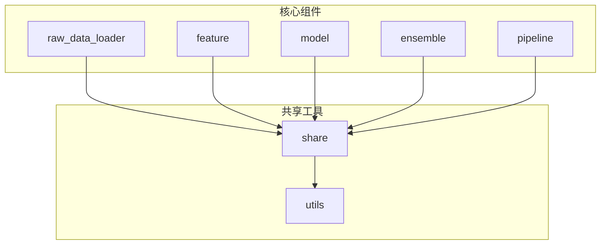
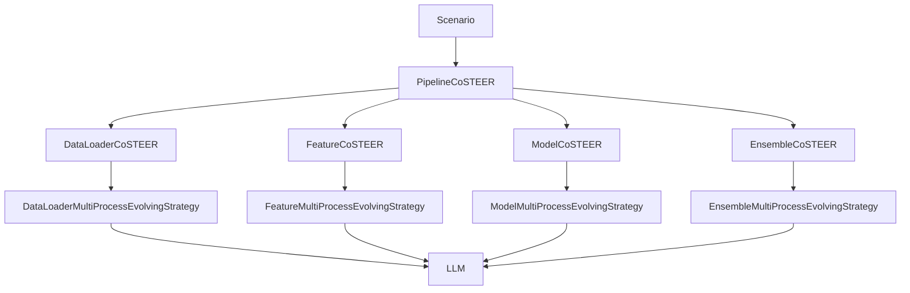
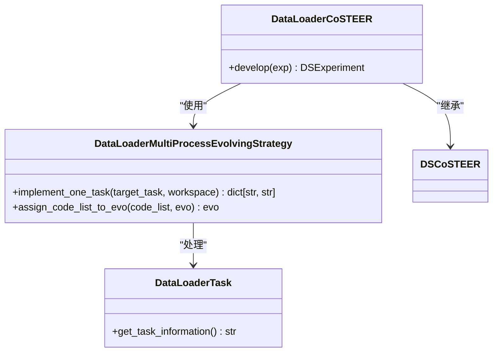
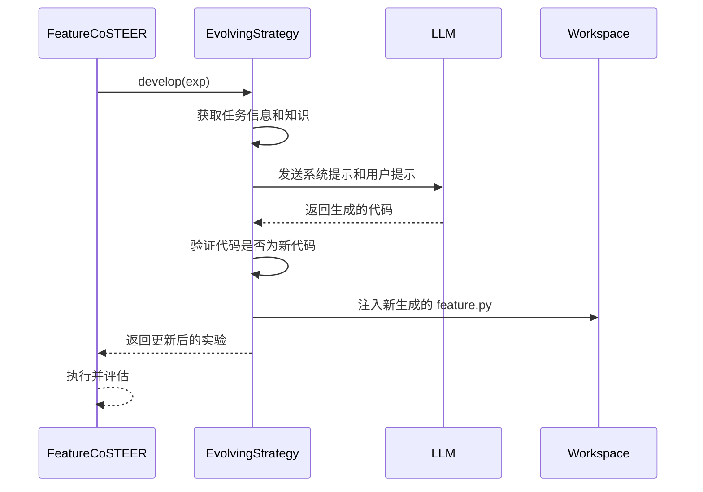
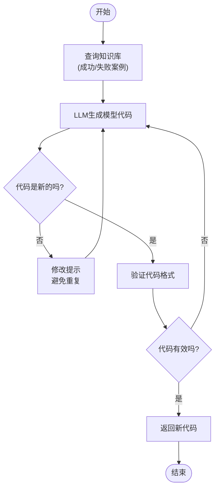
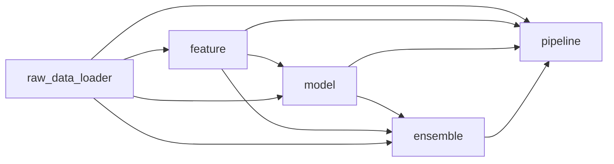

# 数据科学编码器

<cite>
**本文档中引用的文件**  
- [conf.py](file://rdagent/app/data_science/conf.py)
- [raw_data_loader/__init__.py](file://rdagent/components/coder/data_science/raw_data_loader/__init__.py)
- [feature/__init__.py](file://rdagent/components/coder/data_science/feature/__init__.py)
- [model/__init__.py](file://rdagent/components/coder/data_science/model/__init__.py)
- [ensemble/__init__.py](file://rdagent/components/coder/data_science/ensemble/__init__.py)
- [pipeline/__init__.py](file://rdagent/components/coder/data_science/pipeline/__init__.py)
- [share/notebook.py](file://rdagent/components/coder/data_science/share/notebook.py)
- [share/ds_costeer.py](file://rdagent/components/coder/data_science/share/ds_costeer.py)
- [share/util.py](file://rdagent/components/coder/data_science/share/util.py)
- [utils.py](file://rdagent/components/coder/data_science/utils.py)
- [loop.py](file://rdagent/app/data_science/loop.py)
- [pipeline/__init__.py](file://rdagent/components/coder/data_science/pipeline/__init__.py)
- [share/notebook.py](file://rdagent/components/coder/data_science/share/notebook.py)
- [scenarios/data_science/share.yaml](file://rdagent/scenarios/data_science/share.yaml)
</cite>

## 更新摘要
**变更内容**   
- 增强了`main`函数的文档说明，增加了详细的参数、返回值、异常和使用示例
- 更新了与`main`函数相关的依赖分析和故障排除指南
- 新增了`main`函数在代码生成和执行流程中的作用说明

## 目录
1. [简介](#简介)
2. [项目结构](#项目结构)
3. [核心组件](#核心组件)
4. [架构概述](#架构概述)
5. [详细组件分析](#详细组件分析)
6. [依赖分析](#依赖分析)
7. [性能考虑](#性能考虑)
8. [故障排除指南](#故障排除指南)
9. [结论](#结论)

## 简介
数据科学编码器是一个模块化系统，旨在自动化数据科学工作流，从原始数据加载到特征工程、模型训练、集成学习，最终通过端到端管道生成提交结果。该系统专为Kaggle等数据科学竞赛设计，利用大语言模型（LLM）和反馈循环来迭代改进解决方案。其核心设计理念是将复杂的机器学习流程分解为可独立开发和评估的模块，从而实现高效、可扩展的自动化。

## 项目结构
该项目采用清晰的模块化结构，将数据科学工作流的各个阶段分离到独立的组件中。主要目录包括`app`（应用程序入口）、`components`（核心功能模块）和`scenarios`（特定场景配置）。在`components/coder/data_science`目录下，包含了`raw_data_loader`、`feature`、`model`、`ensemble`和`pipeline`等关键子模块，每个模块都遵循一致的设计模式，包含`__init__.py`、`exp.py`、`eval.py`等文件。

**图源**
- [raw_data_loader/__init__.py](file://rdagent/components/coder/data_science/raw_data_loader/__init__.py)
- [feature/__init__.py](file://rdagent/components/coder/data_science/feature/__init__.py)
- [model/__init__.py](file://rdagent/components/coder/data_science/model/__init__.py)
- [ensemble/__init__.py](file://rdagent/components/coder/data_science/ensemble/__init__.py)
- [pipeline/__init__.py](file://rdagent/components/coder/data_science/pipeline/__init__.py)
- [share/notebook.py](file://rdagent/components/coder/data_science/share/notebook.py)
- [share/ds_costeer.py](file://rdagent/components/coder/data_science/share/ds_costeer.py)

**章节源**
- [raw_data_loader/__init__.py](file://rdagent/components/coder/data_science/raw_data_loader/__init__.py)
- [feature/__init__.py](file://rdagent/components/coder/data_science/feature/__init__.py)
- [model/__init__.py](file://rdagent/components/coder/data_science/model/__init__.py)
- [ensemble/__init__.py](file://rdagent/components/coder/data_science/ensemble/__init__.py)
- [pipeline/__init__.py](file://rdagent/components/coder/data_science/pipeline/__init__.py)

## 核心组件
数据科学编码器的核心由五个主要模块构成：`raw_data_loader`负责解析和加载原始数据集；`feature`模块执行特征工程的具体方法和评估流程；`model`模块支持多种模型类型的训练和评估逻辑；`ensemble`模块实现投票、堆叠等集成策略；`pipeline`则将这些步骤串联成一个端到端的工作流。这些模块通过共享的`share`目录下的工具和`conf.py`中的配置进行协调。

**章节源**
- [conf.py](file://rdagent/app/data_science/conf.py)
- [raw_data_loader/__init__.py](file://rdagent/components/coder/data_science/raw_data_loader/__init__.py)
- [feature/__init__.py](file://rdagent/components/coder/data_science/feature/__init__.py)
- [model/__init__.py](file://rdagent/components/coder/data_science/model/__init__.py)
- [ensemble/__init__.py](file://rdagent/components/coder/data_science/ensemble/__init__.py)
- [pipeline/__init__.py](file://rdagent/components/coder/data_science/pipeline/__init__.py)

## 架构概述
该系统的架构基于CoSTEER框架，采用“假设-执行-评估-反馈”的循环模式。每个数据科学模块（如数据加载、特征工程）都实现为一个`CoSTEER`编码器，它继承自`DSCoSTEER`基类。编码器通过`EvolvingStrategy`生成代码，通过`Evaluator`评估结果，并根据反馈迭代改进。`Scenario`类（如`KaggleScen`）提供特定竞赛的上下文信息，而`Pipeline`则协调整个流程。

**图源**
- [pipeline/__init__.py](file://rdagent/components/coder/data_science/pipeline/__init__.py)
- [raw_data_loader/__init__.py](file://rdagent/components/coder/data_science/raw_data_loader/__init__.py)
- [feature/__init__.py](file://rdagent/components/coder/data_science/feature/__init__.py)
- [model/__init__.py](file://rdagent/components/coder/data_science/model/__init__.py)
- [ensemble/__init__.py](file://rdagent/components/coder/data_science/ensemble/__init__.py)
- [share/ds_costeer.py](file://rdagent/components/coder/data_science/share/ds_costeer.py)

## 详细组件分析
本节将深入分析数据科学编码器的各个核心模块，解释其内部工作原理、接口和交互方式。

### raw_data_loader 模块分析
`raw_data_loader`模块负责解析和加载原始数据集。它通过`DataLoaderCoSTEER`类实现，该类使用`DataLoaderMultiProcessEvolvingStrategy`来生成加载数据的Python代码（`load_data.py`）。该策略会查询知识库中的成功和失败案例，并结合竞赛描述和文件夹结构信息，通过LLM生成代码。如果启用了规范（spec），它还会生成`spec/data_loader.md`文件来指导代码开发。

**图源**
- [raw_data_loader/__init__.py](file://rdagent/components/coder/data_science/raw_data_loader/__init__.py)
- [raw_data_loader/exp.py](file://rdagent/components/coder/data_science/raw_data_loader/exp.py)

**章节源**
- [raw_data_loader/__init__.py](file://rdagent/components/coder/data_science/raw_data_loader/__init__.py)
- [raw_data_loader/test.py](file://rdagent/components/coder/data_science/raw_data_loader/test.py)

### feature 模块分析
`feature`模块执行特征工程。`FeatureCoSTEER`类利用`FeatureMultiProcessEvolvingStrategy`生成特征工程代码（`feature.py`）。该策略的关键输入是前一个`raw_data_loader`模块生成的`load_data.py`代码，以确保特征工程代码能正确处理已加载的数据。它同样会查询知识库，并根据`spec/feature.md`规范生成代码，从而实现有指导的特征创建。

**图源**
- [feature/__init__.py](file://rdagent/components/coder/data_science/feature/__init__.py)
- [feature/exp.py](file://rdagent/components/coder/data_science/feature/exp.py)

**章节源**
- [feature/__init__.py](file://rdagent/components/coder/data_science/feature/__init__.py)
- [feature/test.py](file://rdagent/components/coder/data_science/feature/test.py)

### model 模块分析
`model`模块负责模型的实现和训练。`ModelCoSTEER`使用`ModelMultiProcessEvolvingStrategy`来生成或修改模型代码（如`model_xgboost.py`）。它接收来自`raw_data_loader`和`feature`模块的代码作为上下文，确保模型能正确地使用预处理后的数据。该模块支持多种模型类型，并通过`PythonBatchEditOut`允许对多个模型文件进行批量编辑。

**图源**
- [model/__init__.py](file://rdagent/components/coder/data_science/model/__init__.py)
- [model/exp.py](file://rdagent/components/coder/data_science/model/exp.py)

**章节源**
- [model/__init__.py](file://rdagent/components/coder/data_science/model/__init__.py)
- [model/test.py](file://rdagent/components/coder/data_science/model/test.py)

### ensemble 模块分析
`ensemble`模块实现模型集成策略，如投票或堆叠。`EnsembleCoSTEER`生成`ensemble.py`代码，该代码将多个模型的预测结果组合起来。该策略会获取工作区中所有现有的模型代码（`model_*.py`），并基于竞赛的度量标准（metric_name）和集成规范（`spec/ensemble.md`）来生成集成逻辑。

**章节源**
- [ensemble/__init__.py](file://rdagent/components/coder/data_science/ensemble/__init__.py)
- [ensemble/test.py](file://rdagent/components/coder/data_science/ensemble/test.py)

### pipeline 模块分析
`pipeline`模块是整个工作流的协调者。`PipelineCoSTEER`生成`main.py`，该文件将`raw_data_loader`、`feature`、`model`和`ensemble`模块的输出串联起来，形成一个完整的端到端执行脚本。它负责管理数据流，确保每个步骤的输出能作为下一个步骤的输入。

**章节源**
- [pipeline/__init__.py](file://rdagent/components/coder/data_science/pipeline/__init__.py)

### 共享工具分析
`share`目录包含多个公共工具。`notebook.py`中的`NotebookConverter`类能将Python脚本（如`main.py`）转换为Jupyter笔记本，便于可视化和调试。`ds_costeer.py`定义了`DSCoSTEER`基类，为所有数据科学编码器提供通用功能，如设置开发超时时间。`util.py`提供了代码解析和分割的实用函数。

**章节源**
- [share/notebook.py](file://rdagent/components/coder/data_science/share/notebook.py)
- [share/ds_costeer.py](file://rdagent/components/coder/data_science/share/ds_costeer.py)
- [share/util.py](file://rdagent/components/coder/data_science/share/util.py)

## 依赖分析
系统内的模块通过明确的依赖关系进行连接。`pipeline`模块依赖于所有其他模块的输出。`model`模块依赖于`raw_data_loader`和`feature`模块的代码。`ensemble`模块依赖于`model`模块生成的多个模型。这些依赖关系通过工作区（`FBWorkspace`）中的文件注入来实现，确保了模块间的松耦合。

**图源**
- [pipeline/__init__.py](file://rdagent/components/coder/data_science/pipeline/__init__.py)
- [feature/__init__.py](file://rdagent/components/coder/data_science/feature/__init__.py)
- [model/__init__.py](file://rdagent/components/coder/data_science/model/__init__.py)
- [ensemble/__init__.py](file://rdagent/components/coder/data_science/ensemble/__init__.py)

**章节源**
- [components/coder/data_science](file://rdagent/components/coder/data_science)

## 性能考虑
系统通过配置文件（`conf.py`）中的超时设置来管理性能。例如，`debug_timeout`和`full_timeout`分别定义了在调试数据和完整数据上运行的超时限制。`max_loop`参数限制了每个编码器的迭代次数，防止无限循环。此外，`enable_cache`和`extra_volumes`配置支持环境缓存，可以加速重复的开发任务。

**章节源**
- [conf.py](file://rdagent/app/data_science/conf.py)
- [components/coder/data_science/conf.py](file://rdagent/components/coder/data_science/conf.py)

## 故障排除指南
当特征或模型选择失败时，系统会记录失败的痕迹（failed traces）并将其注入到后续的LLM提示中，以避免重复错误。`enable_mcp_documentation_search`配置可以启用文档搜索来帮助解决错误。常见的调试方法包括检查生成的代码是否符合规范、验证数据加载是否正确，以及分析LLM反馈以理解失败原因。

**章节源**
- [conf.py](file://rdagent/app/data_science/conf.py)
- [core/exception.py](file://rdagent/core/exception.py)

## 结论
数据科学编码器是一个强大且模块化的自动化框架，它通过将复杂的机器学习流程分解为可管理的组件，实现了高效的迭代开发。通过对Kaggle竞赛的完整示例分析，展示了从数据加载到模型提交的端到端代码生成过程。该系统通过共享工具和配置实现了灵活性和可扩展性，为自动化数据科学提供了一个坚实的平台。