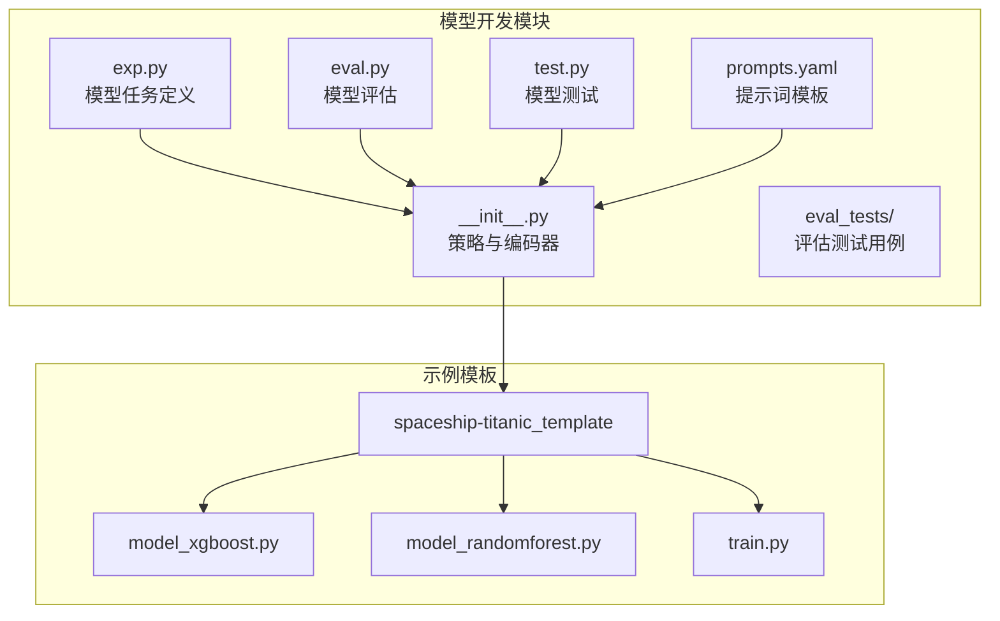
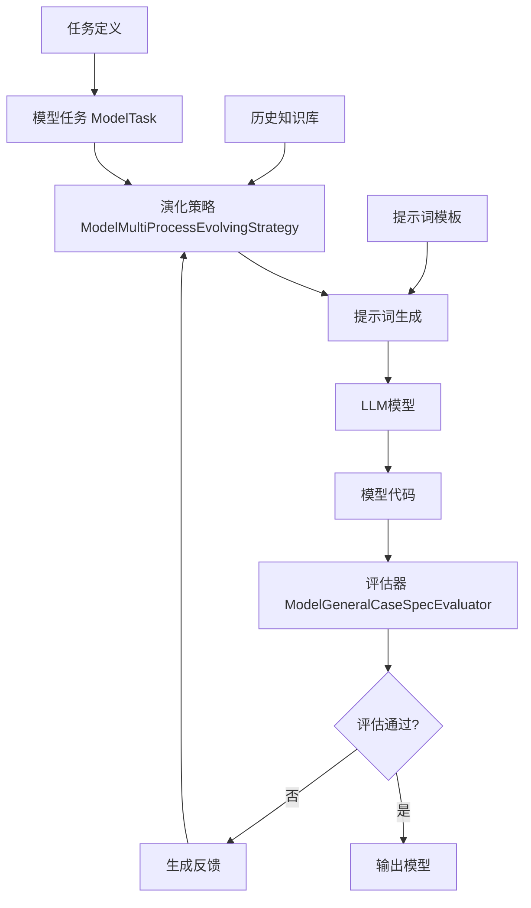
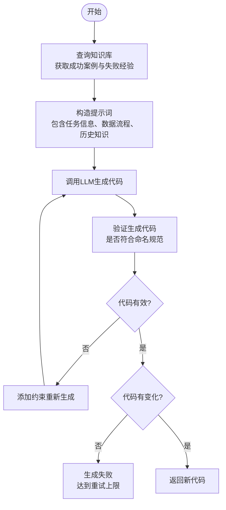
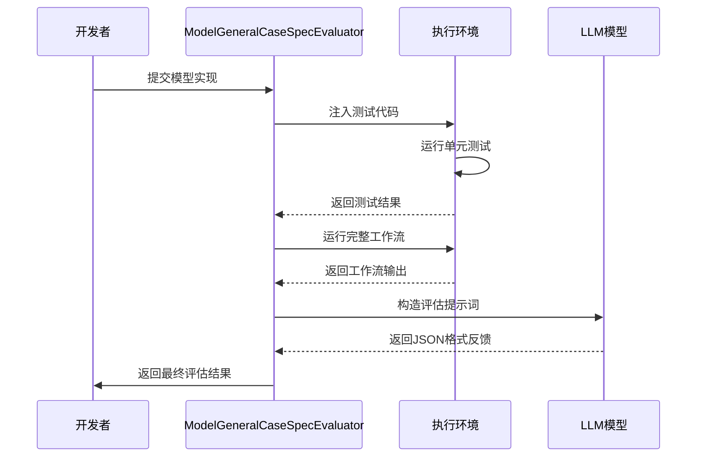
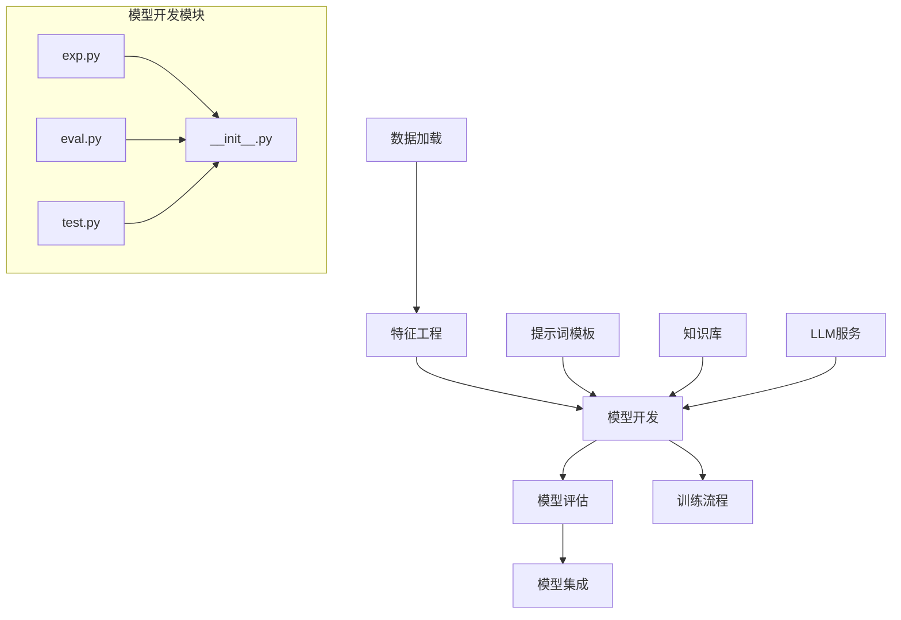
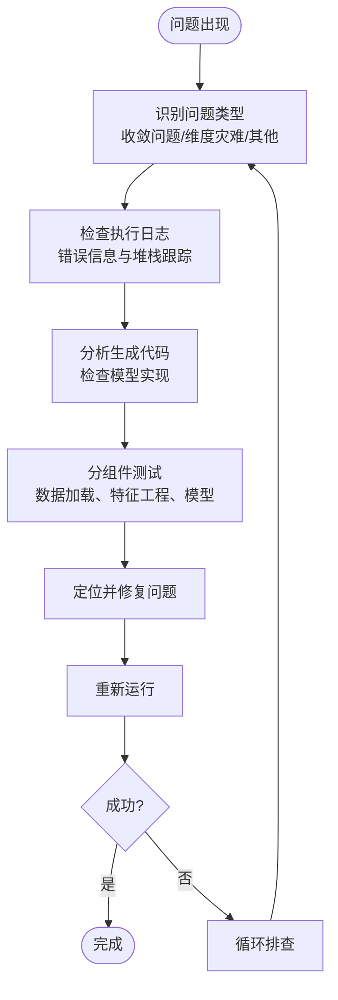

# 模型开发

<cite>
**本文档中引用的文件**  
- [exp.py](file://rdagent/components/coder/data_science/model/exp.py)
- [eval.py](file://rdagent/components/coder/data_science/model/eval.py)
- [test.py](file://rdagent/components/coder/data_science/model/test.py)
- [prompts.yaml](file://rdagent/components/coder/data_science/model/prompts.yaml)
- [model_xgboost.py](file://rdagent/scenarios/kaggle/experiment/spaceship-titanic_template/model/model_xgboost.py)
- [model_randomforest.py](file://rdagent/scenarios/kaggle/experiment/spaceship-titanic_template/model/model_randomforest.py)
- [model_test.txt](file://rdagent/components/coder/data_science/model/eval_tests/model_test.txt)
- [train.py](file://rdagent/scenarios/kaggle/experiment/spaceship-titanic_template/train.py)
- [__init__.py](file://rdagent/components/coder/data_science/model/__init__.py)
</cite>

## 目录
1. [引言](#引言)
2. [项目结构](#项目结构)
3. [核心组件](#核心组件)
4. [架构概述](#架构概述)
5. [详细组件分析](#详细组件分析)
6. [依赖分析](#依赖分析)
7. [性能考虑](#性能考虑)
8. [故障排查指南](#故障排查指南)
9. [结论](#结论)

## 引言
本文档详细阐述了RD-Agent框架中模型开发模块的设计与实现。该系统通过自动化流程实现机器学习模型的生成、评估和验证，支持分类与回归任务，并能根据任务特性选择合适的算法（如XGBoost、RandomForest等）。文档将深入解析`exp.py`中的模型选择机制、`eval.py`的评估指标与交叉验证策略、`test.py`的验证流程，以及如何通过`prompts.yaml`中的提示词约束模型复杂度以防止过拟合。以泰坦尼克号生存预测为例，展示从任务定义到生成`model_xgboost.py`的完整流程，并讨论模型训练失败的排查步骤。

## 项目结构
模型开发模块位于`rdagent/components/coder/data_science/model/`目录下，包含实验定义、评估逻辑、测试脚本和提示词配置等核心文件。该模块与特征工程、数据加载等组件协同工作，形成完整的机器学习流水线。



**图示来源**  
- [exp.py](file://rdagent/components/coder/data_science/model/exp.py)
- [eval.py](file://rdagent/components/coder/data_science/model/eval.py)
- [test.py](file://rdagent/components/coder/data_science/model/test.py)
- [prompts.yaml](file://rdagent/components/coder/data_science/model/prompts.yaml)
- [__init__.py](file://rdagent/components/coder/data_science/model/__init__.py)
- [model_xgboost.py](file://rdagent/scenarios/kaggle/experiment/spaceship-titanic_template/model/model_xgboost.py)
- [model_randomforest.py](file://rdagent/scenarios/kaggle/experiment/spaceship-titanic_template/model/model_randomforest.py)
- [train.py](file://rdagent/scenarios/kaggle/experiment/spaceship-titanic_template/train.py)

## 核心组件
模型开发模块的核心组件包括：
- **ModelTask**: 定义模型任务的基类，包含任务名称、描述、模型类型等元信息
- **ModelMultiProcessEvolvingStrategy**: 多进程演化策略，负责生成和优化模型代码
- **ModelGeneralCaseSpecEvaluator**: 模型评估器，执行单元测试并生成反馈
- **ModelCoSTEER**: 模型编码器，协调演化策略与评估器完成开发循环

这些组件共同实现了从任务定义到代码生成再到评估验证的自动化闭环。

**本节来源**  
- [exp.py](file://rdagent/components/coder/data_science/model/exp.py)
- [__init__.py](file://rdagent/components/coder/data_science/model/__init__.py)
- [eval.py](file://rdagent/components/coder/data_science/model/eval.py)

## 架构概述
模型开发模块采用基于提示工程的自动化编码架构，通过LLM生成符合规范的机器学习模型代码。系统接收数据加载、特征工程等前置步骤的输出，根据任务类型选择合适的模型架构，并生成训练和预测代码。



**图示来源**  
- [exp.py](file://rdagent/components/coder/data_science/model/exp.py#L1-L21)
- [__init__.py](file://rdagent/components/coder/data_science/model/__init__.py#L1-L173)
- [eval.py](file://rdagent/components/coder/data_science/model/eval.py#L1-L123)
- [prompts.yaml](file://rdagent/components/coder/data_science/model/prompts.yaml#L1-L186)

## 详细组件分析

### ModelTask 任务定义分析
`ModelTask`类继承自`CoSTEERTask`，用于封装模型开发任务的元信息。任务包含名称、描述、模型类型、架构公式、超参数等属性，这些信息将作为提示词输入到LLM中，指导模型代码的生成。

```mermaid
classDiagram
class ModelTask {
+name : str
+description : str
+model_type : str
+architecture : str
+hyperparameters : str
+base_code : str
+__init__(name, description, ...)
+get_task_information()
}
ModelTask --> CoSTEERTask : 继承
CoSTEERTask : +name : str
CoSTEERTask : +description : str
CoSTEERTask : +get_task_information()
```

**图示来源**  
- [exp.py](file://rdagent/components/coder/data_science/model/exp.py#L1-L21)

### 模型代码生成策略分析
`ModelMultiProcessEvolvingStrategy`实现了模型代码的生成逻辑。该策略首先从知识库中检索相似成功案例和历史失败经验，然后构造包含任务信息、竞赛背景、数据加载代码、特征工程代码和历史知识的提示词，发送给LLM生成新的模型实现。



**图示来源**  
- [__init__.py](file://rdagent/components/coder/data_science/model/__init__.py#L1-L173)

### 模型评估机制分析
`ModelGeneralCaseSpecEvaluator`负责评估生成的模型代码。评估过程分为两个阶段：首先使用训练和验证数据测试模型训练和输出，然后使用训练和测试数据进行重训练测试。评估器会检查超参数处理、输出形状匹配度等关键指标。



**图示来源**  
- [eval.py](file://rdagent/components/coder/data_science/model/eval.py#L1-L123)

## 依赖分析
模型开发模块与其他组件存在紧密依赖关系，形成了完整的机器学习开发流水线。



**图示来源**  
- [exp.py](file://rdagent/components/coder/data_science/model/exp.py)
- [eval.py](file://rdagent/components/coder/data_science/model/eval.py)
- [test.py](file://rdagent/components/coder/data_science/model/test.py)
- [__init__.py](file://rdagent/components/coder/data_science/model/__init__.py)

## 性能考虑
模型开发模块在设计时考虑了多个性能因素：
1. **缓存机制**: 使用joblib的Memory装饰器缓存函数结果，避免重复计算
2. **并行处理**: 采用多进程演化策略，支持并行生成和评估多个模型变体
3. **资源限制**: 设置执行超时和内存限制，防止资源耗尽
4. **代码优化**: 提示词中明确要求使用GPU加速和多线程优化

这些设计确保了系统在处理大规模数据集和复杂模型时仍能保持高效运行。

## 故障排查指南
当模型训练失败时，可按照以下步骤进行排查：

**本节来源**  
- [eval.py](file://rdagent/components/coder/data_science/model/eval.py#L1-L123)
- [model_test.txt](file://rdagent/components/coder/data_science/model/eval_tests/model_test.txt)
- [train.py](file://rdagent/scenarios/kaggle/experiment/spaceship-titanic_template/train.py)

### 收敛问题排查
1. **检查超参数**: 确认学习率、迭代次数等超参数设置合理
2. **验证数据质量**: 检查训练数据是否存在缺失值、异常值
3. **监控训练过程**: 查看损失函数变化曲线，判断是否收敛
4. **调整模型复杂度**: 对于过拟合，可减少树的数量或增加正则化

### 维度灾难排查
1. **特征选择**: 使用select_xgboost.py等选择器减少特征维度
2. **降维技术**: 应用PCA等方法降低数据维度
3. **正则化**: 增加L1/L2正则化项
4. **采样策略**: 对高维稀疏数据采用适当的采样方法

### 具体排查流程


**图示来源**  
- [eval.py](file://rdagent/components/coder/data_science/model/eval.py#L1-L123)
- [model_test.txt](file://rdagent/components/coder/data_science/model/eval_tests/model_test.txt)

## 结论
RD-Agent的模型开发模块通过自动化流程实现了机器学习模型的智能生成与优化。系统能够根据任务类型选择合适的算法，利用提示词工程指导LLM生成高质量的模型代码，并通过严格的评估机制确保代码的正确性。以泰坦尼克号生存预测为例，系统可以自动生成XGBoost、RandomForest等多种模型实现，并通过集成学习提升预测性能。未来可进一步优化知识库的构建和检索机制，提高模型生成的效率和质量。