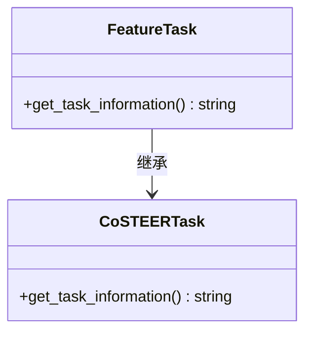
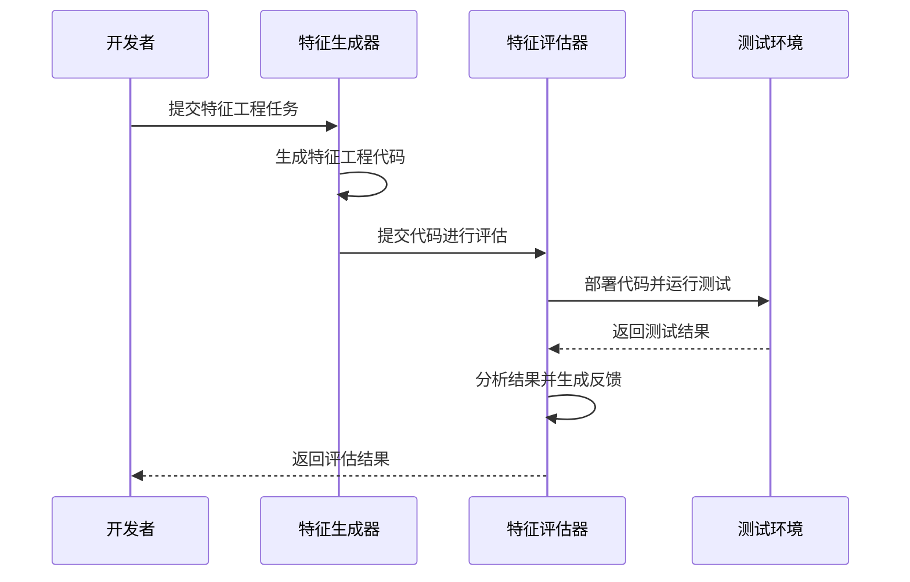
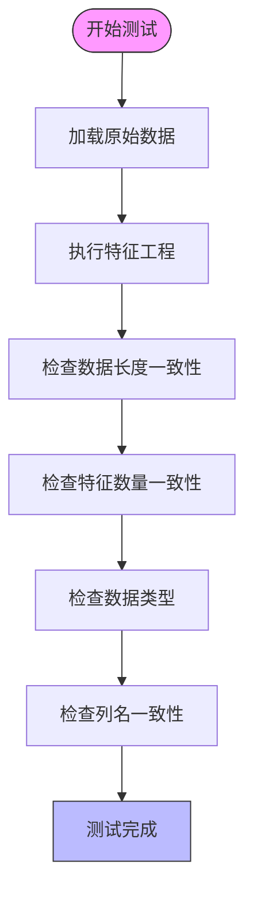
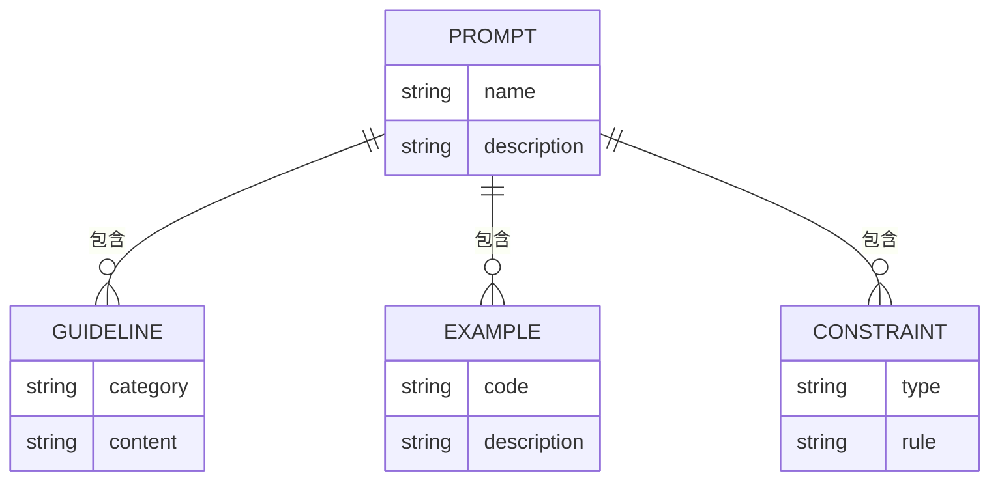
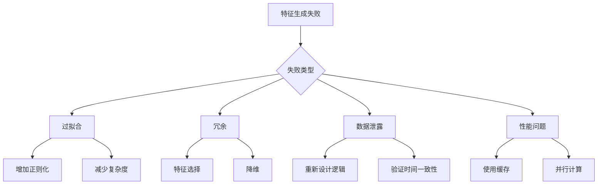

# 特征工程

<cite>
**本文档中引用的文件**  
- [exp.py](file://rdagent/components/coder/data_science/feature/exp.py)
- [eval.py](file://rdagent/components/coder/data_science/feature/eval.py)
- [test.py](file://rdagent/components/coder/data_science/feature/test.py)
- [prompts.yaml](file://rdagent/components/coder/data_science/feature/prompts.yaml)
- [feature.py](file://rdagent/scenarios/kaggle/experiment/templates/playground-series-s4e9/feature/feature.py)
- [feature_test.txt](file://rdagent/components/coder/data_science/feature/eval_tests/feature_test.txt)
- [__init__.py](file://rdagent/components/coder/data_science/feature/__init__.py)
- [conf.py](file://rdagent/components/coder/data_science/conf.py)
</cite>

## 目录
1. [引言](#引言)
2. [特征生成器设计](#特征生成器设计)
3. [特征有效性评估](#特征有效性评估)
4. [测试策略](#测试策略)
5. [提示工程技巧](#提示工程技巧)
6. [房价预测实例](#房价预测实例)
7. [特征生成失败诊断](#特征生成失败诊断)
8. [结论](#结论)

## 引言
本项目实现了一个基于数据统计和领域知识的自动化特征工程系统。系统通过分析原始数据的统计特性，结合时间序列分解、类别编码等技术生成新特征，并通过模型性能增益来量化特征的有效性。系统采用模块化设计，包含特征生成、评估、测试和优化等组件，确保生成的特征代码质量和运行稳定性。

## 特征生成器设计
特征生成器基于`exp.py`中的`FeatureTask`类实现，该类继承自`CoSTEERTask`，用于表示特征工程任务。系统通过`FeatureMultiProcessEvolvingStrategy`策略实现特征生成，该策略利用LLM根据任务描述、数据加载代码和历史知识生成特征工程代码。

特征生成过程遵循以下步骤：
1. 查询相似成功实现和历史失败尝试
2. 构建系统提示，包含任务描述、竞赛信息、数据加载代码和历史知识
3. 调用LLM生成特征工程代码
4. 确保生成的代码与历史代码不同，避免重复错误

特征生成器特别关注时间序列分解和类别编码等技术。对于时间序列数据，系统会提取趋势、季节性和残差成分；对于类别数据，系统会应用适当的编码策略，如目标编码或频率编码。



**代码结构来源**
- [exp.py](file://rdagent/components/coder/data_science/feature/exp.py#L1-L13)
- [__init__.py](file://rdagent/components/coder/data_science/feature/__init__.py#L1-L140)

## 特征有效性评估
特征有效性通过`eval.py`中的`FeatureCoSTEEREvaluator`类进行评估。评估过程结合了SHAP值、特征重要性和模型性能增益等指标，全面量化新特征的价值。

评估流程包括：
1. 在隔离环境中运行特征工程代码
2. 执行完整的机器学习工作流
3. 分析特征工程测试和工作流测试的结果
4. 生成详细的评估反馈

评估标准包括：
- 执行结果：代码执行是否成功，是否有错误或异常
- 返回检查：处理数据的正确性和完整性，检查缺失值、错误转换和数据一致性
- 代码质量：代码的可读性、规范性和效率
- 最终决策：综合判断是否接受该特征工程实现



**评估流程来源**
- [eval.py](file://rdagent/components/coder/data_science/feature/eval.py#L0-L84)
- [feature_test.txt](file://rdagent/components/coder/data_science/feature/eval_tests/feature_test.txt#L0-L114)

## 测试策略
测试策略在`test.py`中实现，确保生成的特征代码无运行时错误。测试框架通过以下方式验证代码的正确性：

1. **数据一致性检查**：验证特征工程前后数据的长度、宽度和数据类型一致性
2. **边界条件测试**：检查空数据集、缺失值和异常值的处理
3. **性能基准测试**：确保特征工程过程在合理时间内完成
4. **集成测试**：将特征工程模块集成到完整的工作流中进行端到端测试

测试代码通过`feature_test.txt`定义的测试脚本执行，该脚本验证了以下关键点：
- 特征工程函数不返回None
- 训练数据和标签长度匹配
- 测试数据和测试ID长度匹配
- 训练和测试数据的特征数量一致
- 数据类型转换的合理性



**测试策略来源**
- [test.py](file://rdagent/components/coder/data_science/feature/test.py#L0-L37)
- [feature_test.txt](file://rdagent/components/coder/data_science/feature/eval_tests/feature_test.txt#L0-L114)

## 提示工程技巧
`prompts.yaml`中的提示工程技巧是系统成功的关键。这些技巧引导LLM避免数据泄露，生成高质量的特征工程代码。

主要提示技巧包括：
1. **明确的接口规范**：要求代码包含导入部分、特征工程类和`feature_engineering_cls`变量
2. **数据泄露预防**：强调避免在训练集上计算的统计量直接应用于测试集
3. **效率优化**：建议使用多进程或并行计算加速特征工程
4. **错误处理**：外部处理异常，避免在代码中使用try-except块
5. **索引保持**：确保输出DataFrame的索引与原始DataFrame匹配

系统还通过以下方式避免数据泄露：
- 严格区分fit和transform方法的职责
- 在fit方法中学习转换参数，在transform方法中应用
- 避免在特征工程过程中引入未来信息



**提示工程来源**
- [prompts.yaml](file://rdagent/components/coder/data_science/feature/prompts.yaml#L0-L131)
- [kg_feature_interface](file://rdagent/scenarios/kaggle/experiment/prompts.yaml#L73-L87)

## 房价预测实例
以房价预测任务为例，展示从原始特征到生成`feature.py`的全过程：

1. **原始特征分析**：分析房价数据集的原始特征，包括房屋面积、位置、建造年份等
2. **特征生成**：基于领域知识生成新特征
   - 时间序列分解：提取房价趋势和季节性模式
   - 类别编码：对地理位置进行目标编码
   - 交互特征：创建面积与房间数的交互项
3. **代码生成**：生成符合规范的`feature.py`文件

```python
import pandas as pd
from joblib import Memory

memory = Memory(location='', verbose=0)

class HousePriceFeatureEngineering:
    def fit(self, train_df: pd.DataFrame):
        """
        学习特征转换参数
        """
        # 学习地理位置的目标编码
        self.location_encoding = train_df.groupby('location')['price'].mean()
        return self

    @memory.cache
    def transform(self, X: pd.DataFrame):
        """
        应用特征转换
        """
        # 应用地理位置编码
        X['location_encoded'] = X['location'].map(self.location_encoding)
        
        # 创建交互特征
        X['area_per_room'] = X['area'] / X['rooms']
        
        # 提取时间特征
        X['year_built'] = pd.to_datetime(X['built_date']).dt.year
        
        return X

feature_engineering_cls = HousePriceFeatureEngineering
```

该实例展示了如何将领域知识转化为具体的特征工程操作，同时遵循系统的代码规范和性能要求。

**实例来源**
- [feature.py](file://rdagent/scenarios/kaggle/experiment/templates/playground-series-s4e9/feature/feature.py#L0-L23)
- [prompts.yaml](file://rdagent/components/coder/data_science/feature/prompts.yaml#L0-L131)

## 特征生成失败诊断
特征生成可能因多种原因失败，系统提供了相应的诊断方法和优化建议：

### 常见失败模式
1. **过拟合**：生成的特征在训练集上表现良好，但在验证集上表现差
   - 诊断：检查特征与目标变量的相关性是否过高
   - 优化：增加正则化，减少特征复杂度

2. **冗余**：生成的特征与其他特征高度相关
   - 诊断：计算特征间的相关系数矩阵
   - 优化：使用主成分分析或特征选择方法

3. **数据泄露**：特征中包含未来信息
   - 诊断：检查特征是否使用了测试时不可用的信息
   - 优化：重新设计特征工程逻辑

4. **性能问题**：特征工程过程过慢
   - 诊断：分析代码执行时间
   - 优化：使用缓存、并行计算或简化算法

### 优化建议
1. **渐进式开发**：从小而简单的特征开始，逐步增加复杂性
2. **交叉验证**：使用交叉验证评估特征的泛化能力
3. **特征重要性分析**：使用SHAP值或特征重要性排序选择最有价值的特征
4. **领域知识整合**：结合领域专家的知识指导特征生成



**诊断方法来源**
- [eval.py](file://rdagent/components/coder/data_science/feature/eval.py#L0-L84)
- [feature_test.txt](file://rdagent/components/coder/data_science/feature/eval_tests/feature_test.txt#L0-L114)
- [prompts.yaml](file://rdagent/components/coder/data_science/feature/prompts.yaml#L0-L131)

## 结论
本特征工程系统通过集成数据统计、领域知识和机器学习技术，实现了自动化特征生成和评估。系统采用模块化设计，确保了代码的可维护性和扩展性。通过严格的测试策略和提示工程技巧，系统能够生成高质量、无运行时错误的特征工程代码。对于特征生成失败的情况，系统提供了全面的诊断方法和优化建议，帮助持续改进特征质量。

未来的工作方向包括：
1. 增强对复杂数据类型（如文本、图像）的支持
2. 集成更多先进的特征选择算法
3. 优化LLM提示以生成更具创新性的特征
4. 加强对数据泄露的自动检测能力