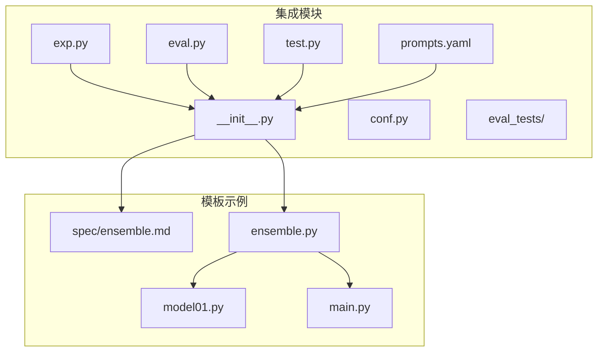
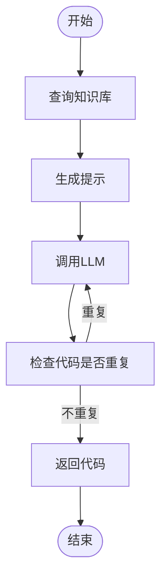
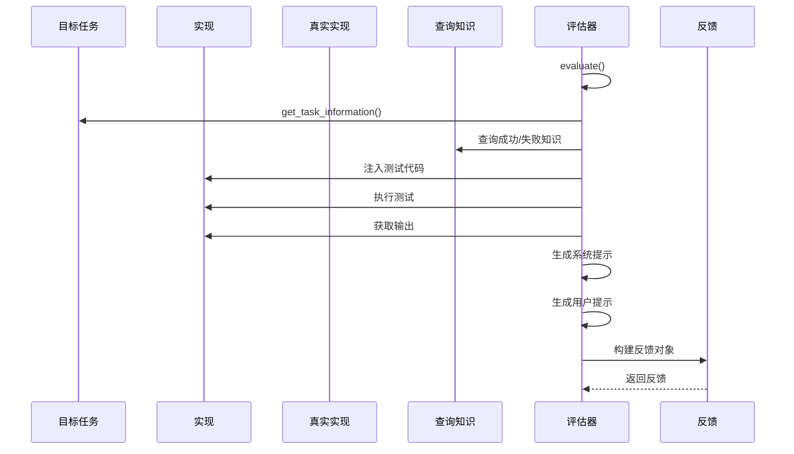
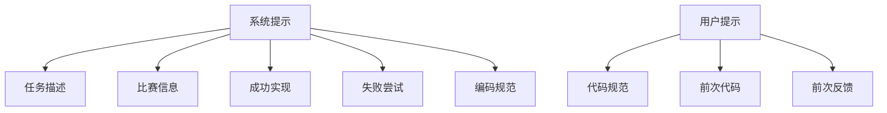
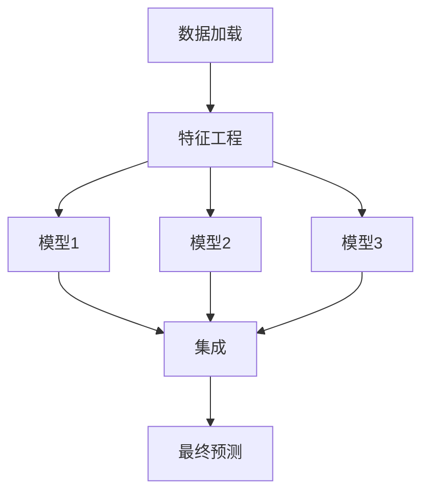

# 集成方法

<cite>
**本文档引用的文件**  
- [exp.py](file://rdagent/components/coder/data_science/ensemble/exp.py)
- [eval.py](file://rdagent/components/coder/data_science/ensemble/eval.py)
- [test.py](file://rdagent/components/coder/data_science/ensemble/test.py)
- [prompts.yaml](file://rdagent/components/coder/data_science/ensemble/prompts.yaml)
- [__init__.py](file://rdagent/components/coder/data_science/ensemble/__init__.py)
- [ensemble_test.txt](file://rdagent/components/coder/data_science/ensemble/eval_tests/ensemble_test.txt)
- [aerial-cactus-identification/spec/ensemble.md](file://rdagent/scenarios/kaggle/tpl_ex/aerial-cactus-identification/spec/ensemble.md)
- [aerial-cactus-identification/ensemble.py](file://rdagent/scenarios/kaggle/tpl_ex/aerial-cactus-identification/ensemble.py)
- [aerial-cactus-identification/model01.py](file://rdagent/scenarios/kaggle/tpl_ex/aerial-cactus-identification/model01.py)
- [aerial-cactus-identification/main.py](file://rdagent/scenarios/kaggle/tpl_ex/aerial-cactus-identification/main.py)
</cite>

## 目录
1. [项目结构](#项目结构)
2. [核心组件](#核心组件)
3. [集成策略实现](#集成策略实现)
4. [性能评估机制](#性能评估机制)
5. [测试用例分析](#测试用例分析)
6. [LLM指导策略](#llm指导策略)
7. [完整集成示例](#完整集成示例)
8. [调优指南](#调优指南)

## 项目结构

集成方法模块位于 `rdagent/components/coder/data_science/ensemble/` 目录下，包含核心实现文件和测试文件。



**图示来源**
- [__init__.py](file://rdagent/components/coder/data_science/ensemble/__init__.py)
- [exp.py](file://rdagent/components/coder/data_science/ensemble/exp.py)
- [eval.py](file://rdagent/components/coder/data_science/ensemble/eval.py)
- [test.py](file://rdagent/components/coder/data_science/ensemble/test.py)
- [aerial-cactus-identification/spec/ensemble.md](file://rdagent/scenarios/kaggle/tpl_ex/aerial-cactus-identification/spec/ensemble.md)

## 核心组件

集成方法模块由多个核心组件构成，包括任务定义、评估器、演化策略和测试框架。

**组件来源**
- [exp.py](file://rdagent/components/coder/data_science/ensemble/exp.py#L1-L12)
- [eval.py](file://rdagent/components/coder/data_science/ensemble/eval.py#L1-L100)
- [__init__.py](file://rdagent/components/coder/data_science/ensemble/__init__.py#L1-L164)
- [test.py](file://rdagent/components/coder/data_science/ensemble/test.py#L1-L58)

## 集成策略实现

集成策略的实现基于 `EnsembleTask` 类和 `EnsembleMultiProcessEvolvingStrategy` 类，通过 LLM 生成集成代码。

### 任务定义

`EnsembleTask` 类继承自 `CoSTEERTask`，用于表示集成任务。

```python
class EnsembleTask(CoSTEERTask):
    pass
```

### 演化策略

`EnsembleMultiProcessEvolvingStrategy` 类实现了集成代码的生成逻辑，包括知识查询、提示生成和代码生成。



**图示来源**
- [__init__.py](file://rdagent/components/coder/data_science/ensemble/__init__.py#L73-L106)
- [exp.py](file://rdagent/components/coder/data_science/ensemble/exp.py#L1-L12)

**本节来源**
- [__init__.py](file://rdagent/components/coder/data_science/ensemble/__init__.py#L73-L106)
- [exp.py](file://rdagent/components/coder/data_science/ensemble/exp.py#L1-L12)

## 性能评估机制

集成模型的性能评估通过 `EnsembleCoSTEEREvaluator` 类实现，包括测试脚本执行和结果分析。

### 评估流程



**图示来源**
- [eval.py](file://rdagent/components/coder/data_science/ensemble/eval.py#L1-L100)

**本节来源**
- [eval.py](file://rdagent/components/coder/data_science/ensemble/eval.py#L1-L100)

## 测试用例分析

集成代码的测试通过 `ensemble_test.txt` 文件中的测试脚本进行，确保代码的稳定性和效率。

### 测试内容

测试脚本验证以下内容：
- 输入输出形状正确性
- 预测类型一致性
- scores.csv 文件生成
- 模型名称完整性
- 指标列正确性
- 无 NaN 值

```python
# 检查类型
assert isinstance(final_pred, pred_type)

# 检查形状
assert get_length(final_pred) == get_length(test_X)

# 检查 scores.csv
assert Path("scores.csv").exists()
assert not score_df.isnull().values.any()
```

**本节来源**
- [eval_tests/ensemble_test.txt](file://rdagent/components/coder/data_science/ensemble/eval_tests/ensemble_test.txt#L1-L137)
- [eval.py](file://rdagent/components/coder/data_science/ensemble/eval.py#L1-L100)

## LLM指导策略

`prompts.yaml` 文件中的提示模板指导 LLM 选择最优的基模型组合和元学习器。

### 系统提示

系统提示包含以下信息：
- 任务描述
- 比赛信息
- 成功实现示例
- 失败尝试记录
- 编码规范

### 用户提示

用户提示包含：
- 代码规范
- 前次代码
- 前次反馈



**本节来源**
- [prompts.yaml](file://rdagent/components/coder/data_science/ensemble/prompts.yaml#L1-L124)

## 完整集成示例

以二分类竞赛为例，展示从多个 `model_*.py` 文件到生成 `ensemble.py` 的完整过程。

### 示例结构



### 集成实现

`ensemble.py` 文件实现了加权平均集成策略，根据验证集上的 AUROC 分数分配权重。

```python
def ensemble_workflow(test_pred_l, val_pred_l, val_label):
    # 计算每个模型的AUROC分数
    scores = []
    for val_pred in val_pred_l:
        scores.append(roc_auc_score(val_label, val_pred))
    
    # 归一化分数得到权重
    weights = [score / sum(scores) for score in scores]
    
    # 加权平均预测
    weighted_test_pred = np.zeros_like(test_pred_l[0])
    for weight, test_pred in zip(weights, test_pred_l):
        weighted_test_pred += weight * test_pred
    
    # 二值化预测
    pred_binary_l = [0 if value < 0.50 else 1 for value in weighted_test_pred]
    return np.array(pred_binary_l)
```

**本节来源**
- [aerial-cactus-identification/ensemble.py](file://rdagent/scenarios/kaggle/tpl_ex/aerial-cactus-identification/ensemble.py#L1-L55)
- [aerial-cactus-identification/model01.py](file://rdagent/scenarios/kaggle/tpl_ex/aerial-cactus-identification/model01.py#L1-L165)
- [aerial-cactus-identification/main.py](file://rdagent/scenarios/kaggle/tpl_ex/aerial-cactus-identification/main.py#L1-L37)

## 调优指南

当集成效果不佳时，可参考以下调优指南。

### 多样性不足

当基模型预测高度相关时，集成效果可能不佳。解决方案包括：
- 增加模型多样性（不同算法、不同特征）
- 使用不同的超参数配置
- 引入随机性（如随机森林）

### 权重优化

- 尝试不同的权重分配策略（等权重、基于性能的权重、学习权重）
- 使用交叉验证优化权重
- 考虑模型间的相关性

### 阈值调整

- 优化分类阈值而非固定使用 0.5
- 使用验证集确定最佳阈值
- 考虑业务需求调整阈值

**本节来源**
- [eval.py](file://rdagent/components/coder/data_science/ensemble/eval.py#L1-L100)
- [prompts.yaml](file://rdagent/components/coder/data_science/ensemble/prompts.yaml#L1-L124)
- [aerial-cactus-identification/ensemble.py](file://rdagent/scenarios/kaggle/tpl_ex/aerial-cactus-identification/ensemble.py#L1-L55)