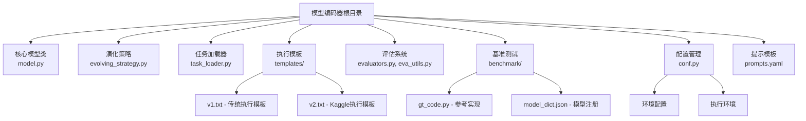
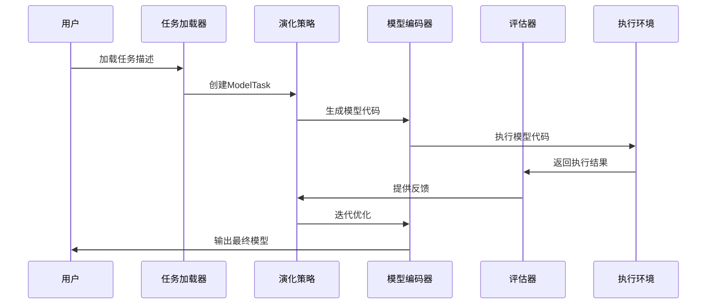
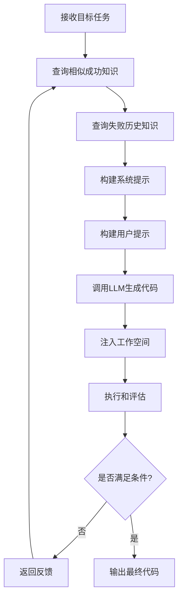
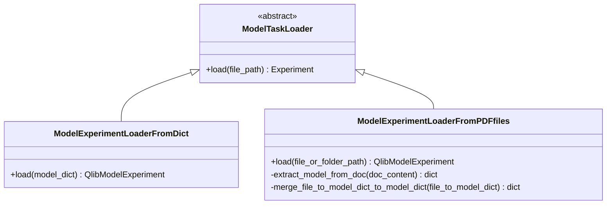
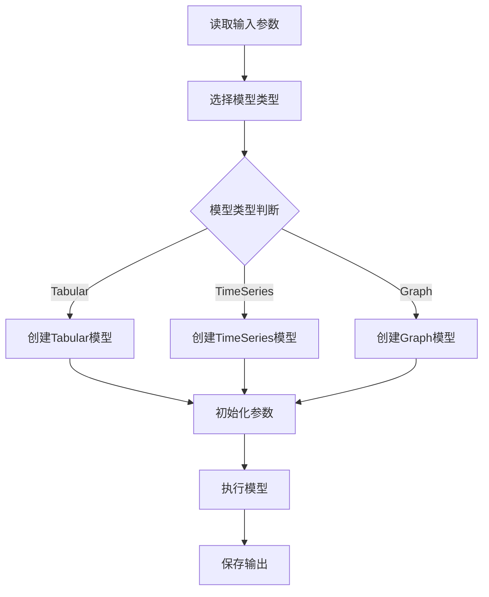
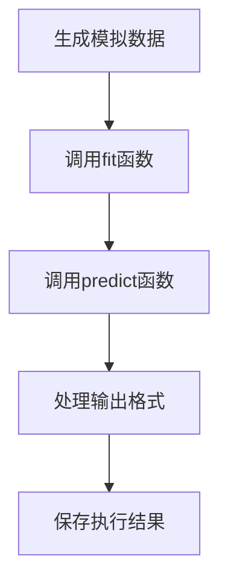
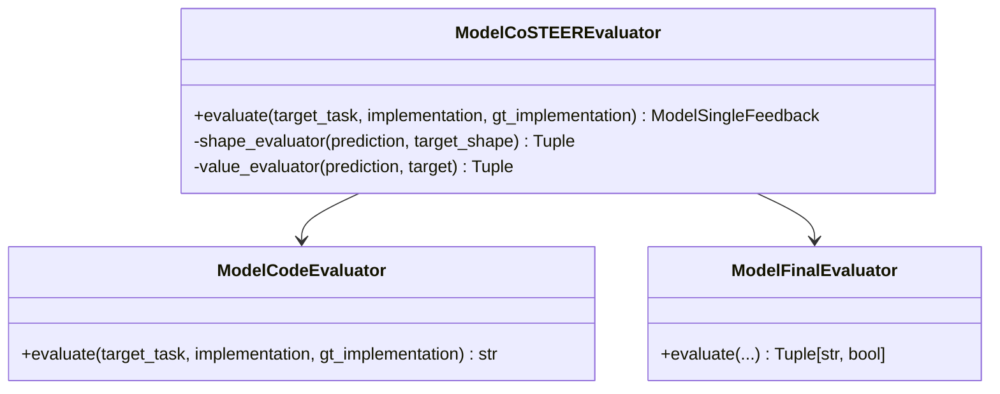
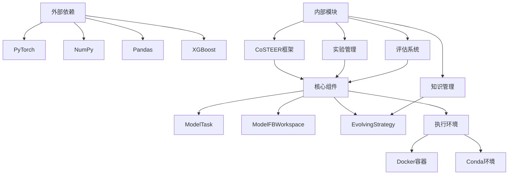

# 模型编码器

<cite>
**本文档中引用的文件**
- [model.py](file://rdagent/components/coder/model_coder/model.py)
- [evolving_strategy.py](file://rdagent/components/coder/model_coder/evolving_strategy.py)
- [task_loader.py](file://rdagent/components/coder/model_coder/task_loader.py)
- [model_execute_template_v1.txt](file://rdagent/components/coder/model_coder/model_execute_template_v1.txt)
- [model_execute_template_v2.txt](file://rdagent/components/coder/model_coder/model_execute_template_v2.txt)
- [evaluators.py](file://rdagent/components/coder/model_coder/evaluators.py)
- [eva_utils.py](file://rdagent/components/coder/model_coder/eva_utils.py)
- [gt_code.py](file://rdagent/components/coder/model_coder/gt_code.py)
- [model_dict.json](file://rdagent/components/coder/model_coder/benchmark/model_dict.json)
- [prompt.yaml](file://rdagent/components/coder/model_coder/one_shot/prompt.yaml)
- [conf.py](file://rdagent/components/coder/model_coder/conf.py)
- [prompts.yaml](file://rdagent/components/coder/model_coder/prompts.yaml)
</cite>

## 目录
1. [简介](#简介)
2. [项目结构](#项目结构)
3. [核心组件](#核心组件)
4. [架构概览](#架构概览)
5. [详细组件分析](#详细组件分析)
6. [依赖关系分析](#依赖关系分析)
7. [性能考虑](#性能考虑)
8. [故障排除指南](#故障排除指南)
9. [结论](#结论)

## 简介

模型编码器是一个先进的机器学习模型生成和演化系统，专门设计用于自动生成和优化机器学习模型代码。该系统的核心功能包括基于提示的模型定义生成、智能演化策略、多版本执行模板支持，以及全面的模型评估体系。

系统采用CoSTEER框架，结合了知识管理、演化策略和评估机制，能够从简单的提示快速生成复杂的机器学习模型，并通过迭代优化不断提升模型质量。特别针对图神经网络、时间序列模型和传统机器学习算法（如XGBoost）提供了专门的支持。

## 项目结构

模型编码器项目采用模块化架构，主要组织在`rdagent/components/coder/model_coder/`目录下：

**图表来源**
- [model.py](file://rdagent/components/coder/model_coder/model.py#L1-L164)
- [evolving_strategy.py](file://rdagent/components/coder/model_coder/evolving_strategy.py#L1-L90)
- [task_loader.py](file://rdagent/components/coder/model_coder/task_loader.py#L1-L129)

**章节来源**
- [model.py](file://rdagent/components/coder/model_coder/model.py#L1-L164)
- [evolving_strategy.py](file://rdagent/components/coder/model_coder/evolving_strategy.py#L1-L90)

## 核心组件

### ModelTask 类

ModelTask 是系统的核心数据结构，负责封装模型的所有相关信息：

- **模型基本信息**：名称、描述、公式、变量定义
- **架构参数**：超参数、训练超参数、模型类型标识
- **任务信息管理**：提供详细的任务描述和简要信息接口

### ModelFBWorkspace 类

ModelFBWorkspace 提供了模型代码的执行环境，支持两种执行模式：

- **版本1**：适用于QLib框架，使用导入方式执行模型
- **版本2**：适用于Kaggle竞赛，使用fit/predict函数模式

### 执行模板系统

系统提供两个主要的执行模板：

- **v1模板**：支持张量形状验证和参数初始化
- **v2模板**：提供完整的训练预测流程

**章节来源**
- [model.py](file://rdagent/components/coder/model_coder/model.py#L15-L164)

## 架构概览

模型编码器采用分层架构设计，实现了从任务定义到模型生成的完整流水线：

**图表来源**
- [task_loader.py](file://rdagent/components/coder/model_coder/task_loader.py#L80-L129)
- [evolving_strategy.py](file://rdagent/components/coder/model_coder/evolving_strategy.py#L15-L89)
- [model.py](file://rdagent/components/coder/model_coder/model.py#L80-L164)

## 详细组件分析

### 演化策略组件

演化策略是模型编码器的核心创新点，实现了智能的代码生成和优化机制：

**图表来源**
- [evolving_strategy.py](file://rdagent/components/coder/model_coder/evolving_strategy.py#L15-L89)

演化策略的关键特性：
- **知识驱动生成**：利用历史成功案例指导新模型生成
- **失败学习机制**：从错误中学习并避免重复
- **动态提示优化**：根据Token限制调整提示长度
- **多进程支持**：支持并行演化多个子任务

**章节来源**
- [evolving_strategy.py](file://rdagent/components/coder/model_coder/evolving_strategy.py#L15-L89)

### 任务加载器组件

任务加载器负责从多种数据源提取和解析模型信息：

**图表来源**
- [task_loader.py](file://rdagent/components/coder/model_coder/task_loader.py#L80-L129)

任务加载器的主要功能：
- **文档解析**：从PDF文件中提取模型信息
- **JSON格式支持**：直接从字典加载模型定义
- **模型去重**：合并来自不同源的相同模型信息
- **结构化提取**：将非结构化文档转换为结构化模型定义

**章节来源**
- [task_loader.py](file://rdagent/components/coder/model_coder/task_loader.py#L80-L129)

### 执行模板详解

#### v1执行模板

v1模板适用于传统的深度学习模型执行场景：

**图表来源**
- [model_execute_template_v1.txt](file://rdagent/components/coder/model_coder/model_execute_template_v1.txt#L1-L45)

#### v2执行模板

v2模板专为Kaggle竞赛设计，提供完整的训练预测流程：

**图表来源**
- [model_execute_template_v2.txt](file://rdagent/components/coder/model_coder/model_execute_template_v2.txt#L1-L25)

**章节来源**
- [model_execute_template_v1.txt](file://rdagent/components/coder/model_coder/model_execute_template_v1.txt#L1-L45)
- [model_execute_template_v2.txt](file://rdagent/components/coder/model_coder/model_execute_template_v2.txt#L1-L25)

### 评估系统

评估系统包含多层次的质量检查机制：

**图表来源**
- [evaluators.py](file://rdagent/components/coder/model_coder/evaluators.py#L15-L104)
- [eva_utils.py](file://rdagent/components/coder/model_coder/eva_utils.py#L31-L167)

评估指标包括：
- **形状评估**：检查输出张量维度是否正确
- **值评估**：计算预测值与真实值之间的差异
- **代码评估**：分析代码质量和一致性
- **最终决策**：综合所有指标做出最终判断

**章节来源**
- [evaluators.py](file://rdagent/components/coder/model_coder/evaluators.py#L15-L104)
- [eva_utils.py](file://rdagent/components/coder/model_coder/eva_utils.py#L31-L167)

### 基准测试系统

基准测试系统提供了标准化的模型评估框架：

| 组件 | 功能 | 输入 | 输出 |
|------|------|------|------|
| model_dict.json | 模型注册表 | 模型名称和元数据 | 结构化模型定义 |
| gt_code.py | 参考实现 | 模型公式和变量 | 完整的PyTorch实现 |
| eval.py | 评估脚本 | 预测结果和标签 | 性能指标 |

**章节来源**
- [model_dict.json](file://rdagent/components/coder/model_coder/benchmark/model_dict.json#L1-L80)
- [gt_code.py](file://rdagent/components/coder/model_coder/gt_code.py#L1-L137)

## 依赖关系分析

模型编码器的依赖关系体现了清晰的分层架构：

**图表来源**
- [model.py](file://rdagent/components/coder/model_coder/model.py#L1-L15)
- [evolving_strategy.py](file://rdagent/components/coder/model_coder/evolving_strategy.py#L1-L15)

**章节来源**
- [model.py](file://rdagent/components/coder/model_coder/model.py#L1-L15)
- [evolving_strategy.py](file://rdagent/components/coder/model_coder/evolving_strategy.py#L1-L15)

## 性能考虑

### 执行效率优化

系统采用了多种性能优化策略：

- **缓存机制**：使用MD5哈希缓存执行结果
- **并行处理**：支持多进程并行演化
- **Token优化**：动态调整提示长度以适应API限制
- **环境隔离**：Docker和Conda环境确保执行稳定性

### 内存管理

- **张量操作**：使用CPU/GPU内存优化的数据处理
- **批量处理**：支持批量输入提高效率
- **资源清理**：自动清理临时文件和缓存

### 扩展性设计

- **插件架构**：支持新的模型类型和执行模板
- **配置驱动**：通过配置文件控制行为
- **模块化设计**：各组件独立可替换

## 故障排除指南

### 常见问题及解决方案

#### 执行失败问题

**症状**：模型代码执行失败
**原因**：可能是环境配置、依赖缺失或代码语法错误
**解决方案**：
1. 检查环境配置（Docker/Conda）
2. 验证依赖包安装
3. 查看详细的错误日志
4. 使用简化版本进行调试

#### 评估不通过问题

**症状**：模型评估分数过低
**原因**：输出形状错误、数值偏差过大或代码质量问题
**解决方案**：
1. 检查模型输出维度
2. 验证数值精度
3. 分析代码反馈建议
4. 对比参考实现

#### 演化停滞问题

**症状**：模型生成陷入循环
**原因**：知识库不足或提示设计不当
**解决方案**：
1. 扩展相似成功案例库
2. 优化系统提示内容
3. 调整演化参数
4. 引入更多失败案例学习

**章节来源**
- [model.py](file://rdagent/components/coder/model_coder/model.py#L100-L164)
- [evaluators.py](file://rdagent/components/coder/model_coder/evaluators.py#L20-L104)

## 结论

模型编码器代表了机器学习模型自动生成领域的重大进展。通过整合先进的演化算法、智能知识管理和全面的评估体系，该系统能够高效地生成高质量的机器学习模型代码。

### 主要优势

1. **智能化生成**：基于历史知识和失败经验的智能代码生成
2. **多模态支持**：支持传统机器学习算法和现代深度学习模型
3. **标准化评估**：提供全面的模型质量评估体系
4. **灵活扩展**：模块化设计支持新功能的快速集成

### 应用前景

该系统在以下领域具有广阔的应用前景：
- **自动化机器学习**：降低ML开发门槛
- **研究辅助工具**：加速算法原型开发
- **教育平台**：提供交互式学习体验
- **工业应用**：支持大规模模型生成需求

### 发展方向

未来的发展重点包括：
- **更大规模模型支持**：扩展到更复杂的神经网络架构
- **多语言支持**：支持更多编程语言和框架
- **实时协作**：支持团队协作的模型开发流程
- **云端集成**：提供云端部署和管理能力

模型编码器为机器学习模型的自动化生成开辟了新的道路，有望成为AI时代的重要基础设施。