# 编码器

<cite>
**本文档中引用的文件**  
- [CoSTEER/\_\_init\_\_.py](file://rdagent/components/coder/CoSTEER/__init__.py)
- [CoSTEER/evolving_strategy.py](file://rdagent/components/coder/CoSTEER/evolving_strategy.py)
- [CoSTEER/knowledge_management.py](file://rdagent/components/coder/CoSTEER/knowledge_management.py)
- [data_science/conf.py](file://rdagent/app/data_science/conf.py)
- [data_science/pipeline/\_\_init\_\_.py](file://rdagent/components/coder/data_science/pipeline/__init__.py)
- [data_science/feature/\_\_init\_\_.py](file://rdagent/components/coder/data_science/feature/__init__.py)
- [data_science/model/\_\_init\_\_.py](file://rdagent/components/coder/data_science/model/__init__.py)
- [factor_coder/\_\_init\_\_.py](file://rdagent/components/coder/factor_coder/__init__.py)
- [model_coder/\_\_init\_\_.py](file://rdagent/components/coder/model_coder/__init__.py)
- [CoSTEER/config.py](file://rdagent/components/coder/CoSTEER/config.py)
- [data_science/share/ds_costeer.py](file://rdagent/components/coder/data_science/share/ds_costeer.py)
- [factor_coder/config.py](file://rdagent/components/coder/factor_coder/config.py)
- [model_coder/conf.py](file://rdagent/components/coder/model_coder/conf.py)
</cite>

## 目录
1. [引言](#引言)
2. [CoSTEER策略核心机制](#costeer策略核心机制)
3. [知识管理模块](#知识管理模块)
4. [演化策略](#演化策略)
5. [数据科学编码器](#数据科学编码器)
6. [因子编码器](#因子编码器)
7. [模型编码器](#模型编码器)
8. [公共接口与配置](#公共接口与配置)
9. [常见问题与优化建议](#常见问题与优化建议)
10. [结论](#结论)

## 引言

RD-Agent中的编码器组件是系统的核心组成部分，负责将实验设计转化为可执行的代码。该组件采用CoSTEER策略，通过并行任务处理和知识管理机制，实现高效的代码演化。编码器家族包括数据科学编码器、因子编码器和模型编码器，分别针对不同的应用场景。这些编码器通过与EvolvingAgent协同工作，实现了从实验设计到代码实现的自动化流程。

## CoSTEER策略核心机制

CoSTEER（Coder for Systematic Task Evolution and Execution Refinement）是一种系统化的任务演化与执行优化策略。其核心机制基于并行任务处理流程，通过多进程演化策略实现高效的任务实现。

CoSTEER类继承自Developer，其主要功能是通过演化代理（RAGEvoAgent）对实验进行多步演化。在`develop`方法中，系统初始化演化代理，并通过`multistep_evolve`方法执行演化过程。演化过程中，系统会记录每次演化的反馈，并根据`should_use_new_evo`方法决定是否采用新的演化结果作为回退方案。

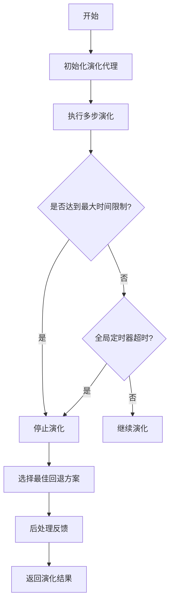

**图源**  
- [CoSTEER/\_\_init\_\_.py](file://rdagent/components/coder/CoSTEER/__init__.py#L1-L177)

**本节来源**  
- [CoSTEER/\_\_init\_\_.py](file://rdagent/components/coder/CoSTEER/__init__.py#L1-L177)

## 知识管理模块

知识管理模块在CoSTEER策略中扮演着关键角色，通过`knowledge_management.py`文件实现。该模块采用知识图谱和向量数据库相结合的方式，增强演化过程的智能性。

知识管理的核心是`CoSTEERRAGStrategyV2`类，它实现了版本2的知识检索与生成策略。该策略通过三个主要查询方法来获取相关知识：`former_trace_query`（历史轨迹查询）、`component_query`（组件查询）和`error_query`（错误查询）。

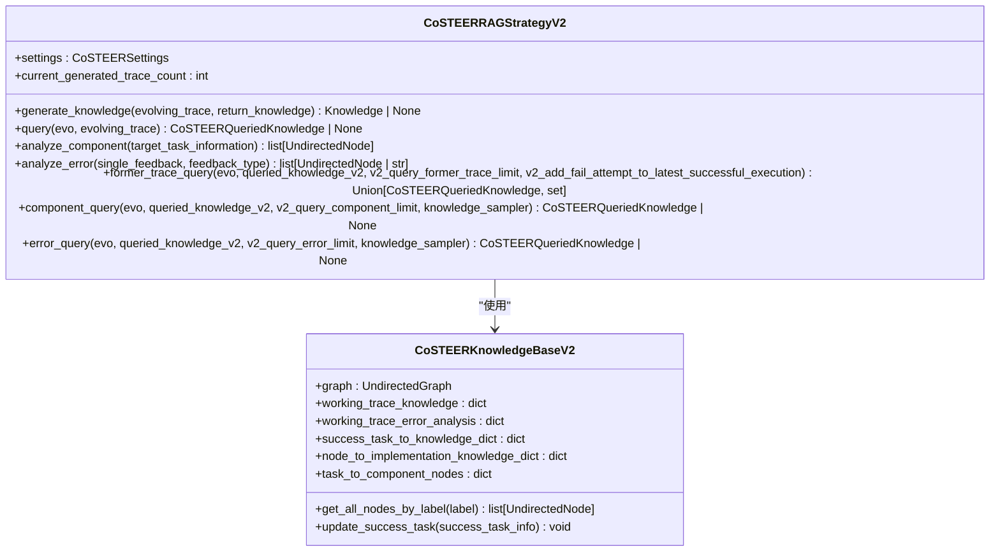

**图源**  
- [CoSTEER/knowledge_management.py](file://rdagent/components/coder/CoSTEER/knowledge_management.py#L246-L799)

**本节来源**  
- [CoSTEER/knowledge_management.py](file://rdagent/components/coder/CoSTEER/knowledge_management.py#L246-L799)

## 演化策略

演化策略在`evolving_strategy.py`文件中定义，核心是`MultiProcessEvolvingStrategy`类。该策略通过并行处理多个任务，显著提高了演化效率。

`MultiProcessEvolvingStrategy`类实现了`evolve`方法，该方法首先确定需要演化的任务，然后使用多进程包装器并行执行`implement_one_task`方法。对于每个任务，系统会检查是否可以从知识库中直接获取成功实现，或者是否需要重新实现。

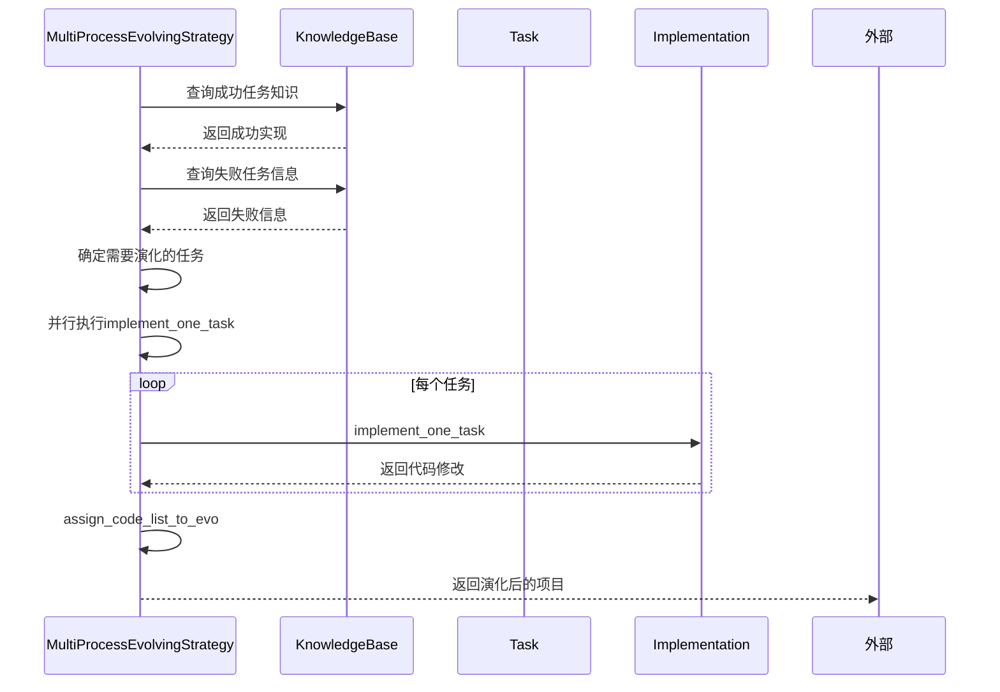

**图源**  
- [CoSTEER/evolving_strategy.py](file://rdagent/components/coder/CoSTEER/evolving_strategy.py#L0-L134)

**本节来源**  
- [CoSTEER/evolving_strategy.py](file://rdagent/components/coder/CoSTEER/evolving_strategy.py#L0-L134)

## 数据科学编码器

数据科学编码器是针对数据科学任务的专用编码器，实现了特征工程、模型训练和集成预测等功能。该编码器通过`pipeline`、`feature`、`model`等子模块协同工作。

### 管道编码器

管道编码器（PipelineCoSTEER）负责整体工作流程的编排。它继承自`DSCoSTEER`，并使用`PipelineMultiProcessEvolvingStrategy`作为演化策略。在`implement_one_task`方法中，系统会生成管道代码，确保代码与之前的实现不同。

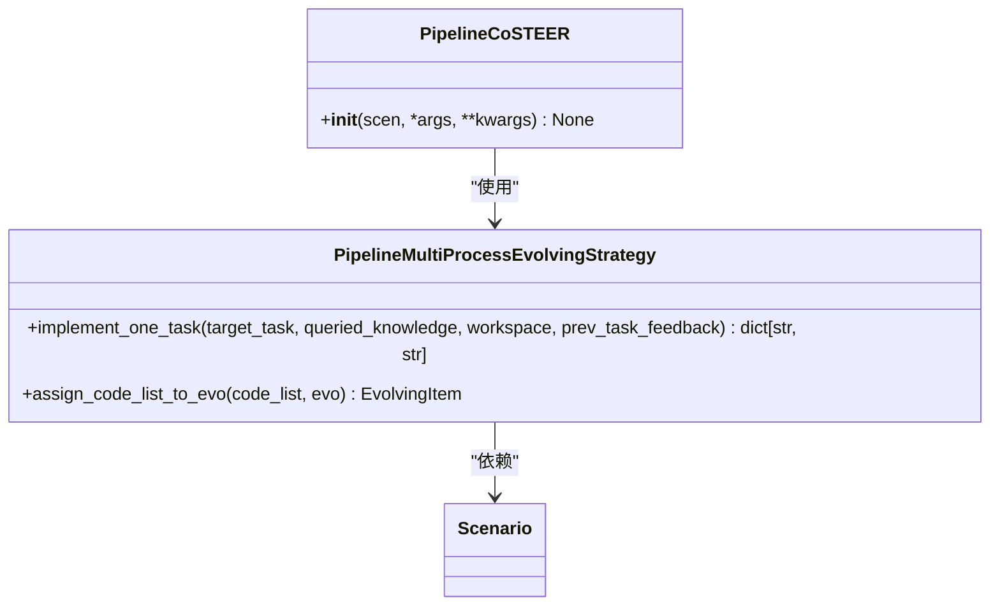

**图源**  
- [data_science/pipeline/\_\_init\_\_.py](file://rdagent/components/coder/data_science/pipeline/__init__.py#L0-L165)

**本节来源**  
- [data_science/pipeline/\_\_init\_\_.py](file://rdagent/components/coder/data_science/pipeline/__init__.py#L0-L165)

### 特征编码器

特征编码器（FeatureCoSTEER）专注于特征工程任务。它使用`FeatureMultiProcessEvolvingStrategy`作为演化策略，在`implement_one_task`方法中生成特征代码。

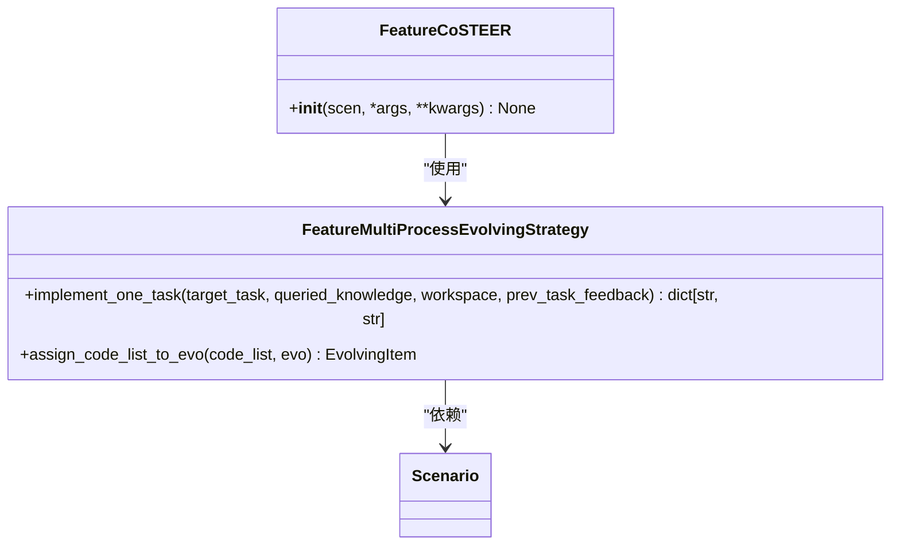

**图源**  
- [data_science/feature/\_\_init\_\_.py](file://rdagent/components/coder/data_science/feature/__init__.py#L0-L140)

**本节来源**  
- [data_science/feature/\_\_init\_\_.py](file://rdagent/components/coder/data_science/feature/__init__.py#L0-L140)

### 模型编码器

模型编码器（ModelCoSTEER）负责模型训练和预测任务。它使用`ModelMultiProcessEvolvingStrategy`作为演化策略，在`implement_one_task`方法中生成模型代码。

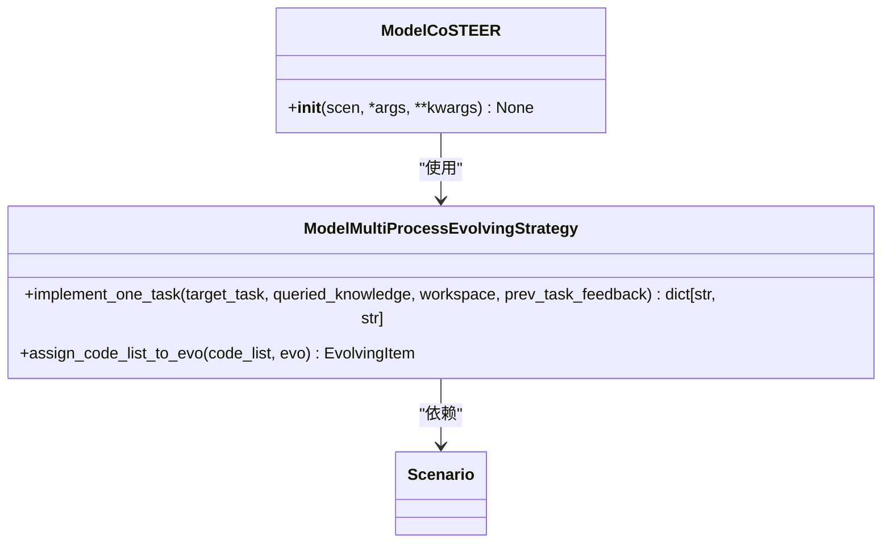

**图源**  
- [data_science/model/\_\_init\_\_.py](file://rdagent/components/coder/data_science/model/__init__.py#L0-L173)

**本节来源**  
- [data_science/model/\_\_init\_\_.py](file://rdagent/components/coder/data_science/model/__init__.py#L0-L173)

## 因子编码器

因子编码器（FactorCoSTEER）是针对量化金融场景的专用编码器，主要用于因子代码生成。该编码器继承自CoSTEER基类，并使用特定的配置和演化策略。

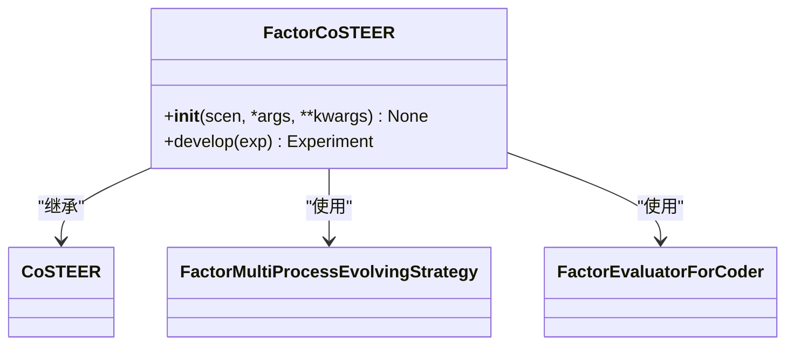

**图源**  
- [factor_coder/\_\_init\_\_.py](file://rdagent/components/coder/factor_coder/__init__.py#L0-L32)

**本节来源**  
- [factor_coder/\_\_init\_\_.py](file://rdagent/components/coder/factor_coder/__init__.py#L0-L32)

## 模型编码器

模型编码器（ModelCoSTEER）是针对量化金融模型的专用编码器，主要用于模型执行模板的使用。该编码器同样继承自CoSTEER基类，并使用特定的配置和演化策略。

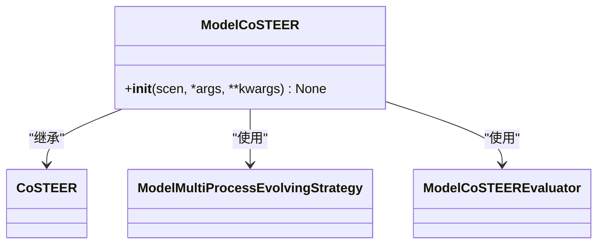

**图源**  
- [model_coder/\_\_init\_\_.py](file://rdagent/components/coder/model_coder/__init__.py#L0-L21)

**本节来源**  
- [model_coder/\_\_init\_\_.py](file://rdagent/components/coder/model_coder/__init__.py#L0-L21)

## 公共接口与配置

编码器的公共接口和配置通过`conf.py`文件定义。这些配置参数控制编码器的行为，包括最大循环次数、知识库路径、超时设置等。

### CoSTEER配置

`CoSTEERSettings`类定义了CoSTEER策略的基本配置：

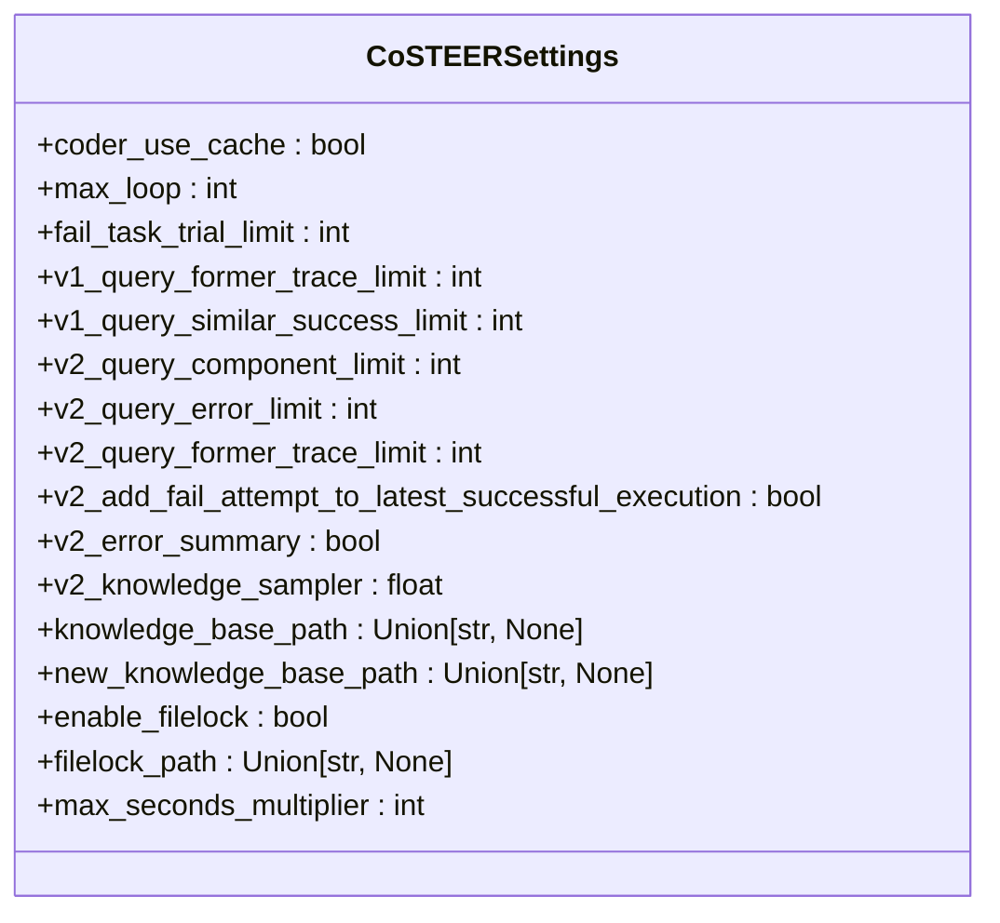

**图源**  
- [CoSTEER/config.py](file://rdagent/components/coder/CoSTEER/config.py#L0-L42)

**本节来源**  
- [CoSTEER/config.py](file://rdagent/components/coder/CoSTEER/config.py#L0-L42)

### 数据科学编码器配置

`DSCoderCoSTEERSettings`类扩展了CoSTEERSettings，为数据科学编码器提供了特定配置：

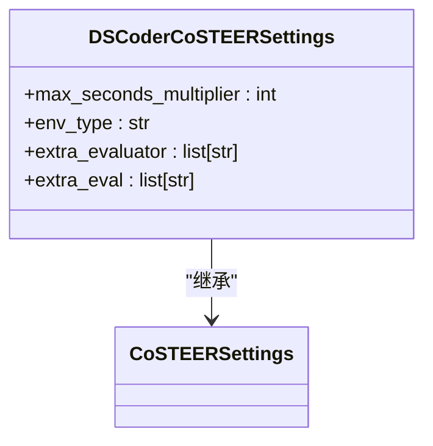

**图源**  
- [data_science/conf.py](file://rdagent/components/coder/data_science/conf.py#L0-L87)

**本节来源**  
- [data_science/conf.py](file://rdagent/components/coder/data_science/conf.py#L0-L87)

### 因子编码器配置

`FactorCoSTEERSettings`类为因子编码器提供了特定配置：

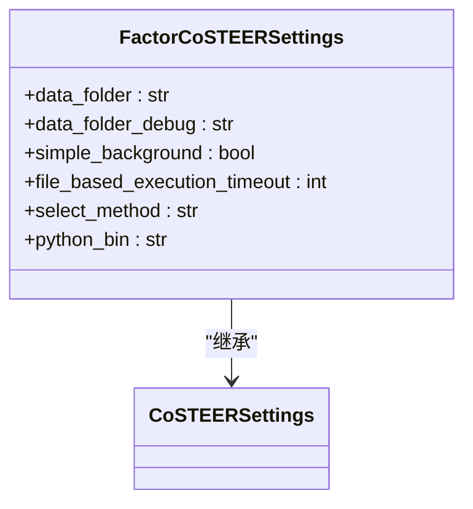

**图源**  
- [factor_coder/config.py](file://rdagent/components/coder/factor_coder/config.py#L0-L49)

**本节来源**  
- [factor_coder/config.py](file://rdagent/components/coder/factor_coder/config.py#L0-L49)

### 模型编码器配置

`ModelCoSTEERSettings`类为模型编码器提供了特定配置：

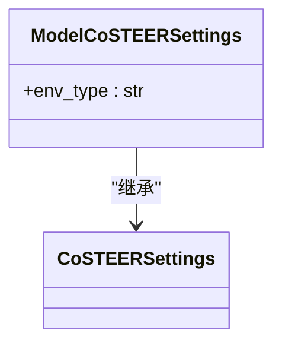

**图源**  
- [model_coder/conf.py](file://rdagent/components/coder/model_coder/conf.py#L0-L38)

**本节来源**  
- [model_coder/conf.py](file://rdagent/components/coder/model_coder/conf.py#L0-L38)

## 常见问题与优化建议

### 代码生成失败的排查方法

当编码器无法生成有效代码时，可以按照以下步骤进行排查：

1. **检查知识库**：确认知识库是否包含相关任务的成功实现。
2. **检查反馈信息**：分析`CoSTEERSingleFeedback`中的执行、返回值和代码反馈。
3. **检查配置参数**：确认`max_loop`、`fail_task_trial_limit`等参数设置是否合理。
4. **检查环境配置**：确认运行环境（Docker或Conda）配置正确。

### 性能优化建议

1. **调整并行度**：根据系统资源调整`RD_AGENT_SETTINGS.multi_proc_n`参数。
2. **优化知识库查询**：合理设置`v2_query_component_limit`和`v2_query_error_limit`参数。
3. **缓存机制**：启用`coder_use_cache`配置以提高重复任务的处理效率。
4. **超时设置**：根据任务复杂度调整`max_seconds_multiplier`参数。

## 结论

RD-Agent的编码器组件通过CoSTEER策略实现了高效的代码演化。该策略结合了并行任务处理、知识管理和智能演化机制，能够有效应对复杂的数据科学和量化金融任务。通过模块化设计，系统支持多种专用编码器，满足不同场景的需求。未来的工作可以进一步优化知识管理机制，提高系统的自学习能力。