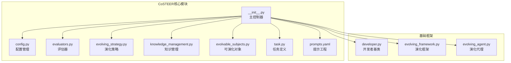
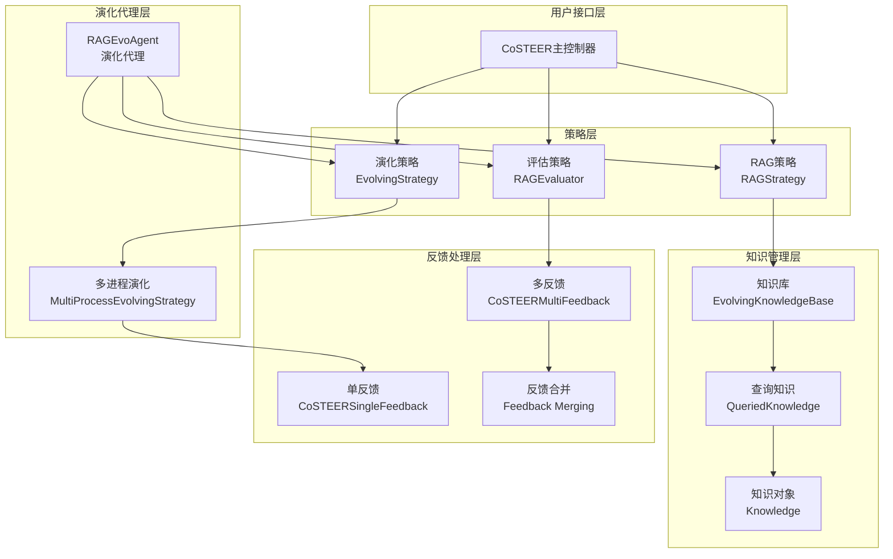
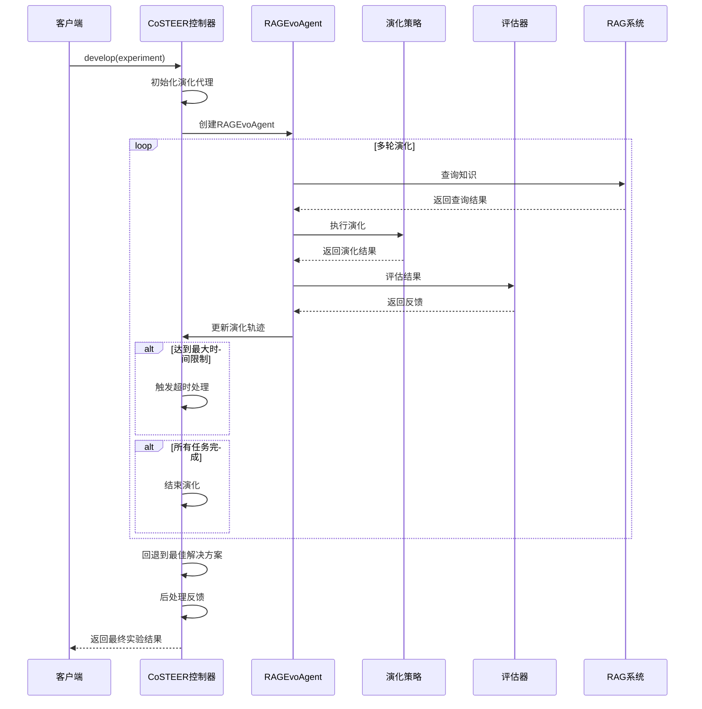
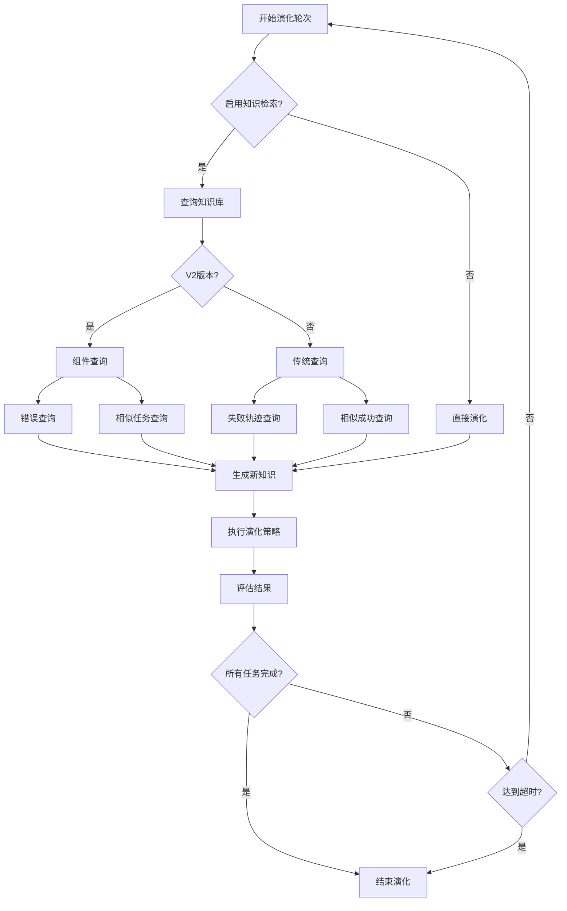
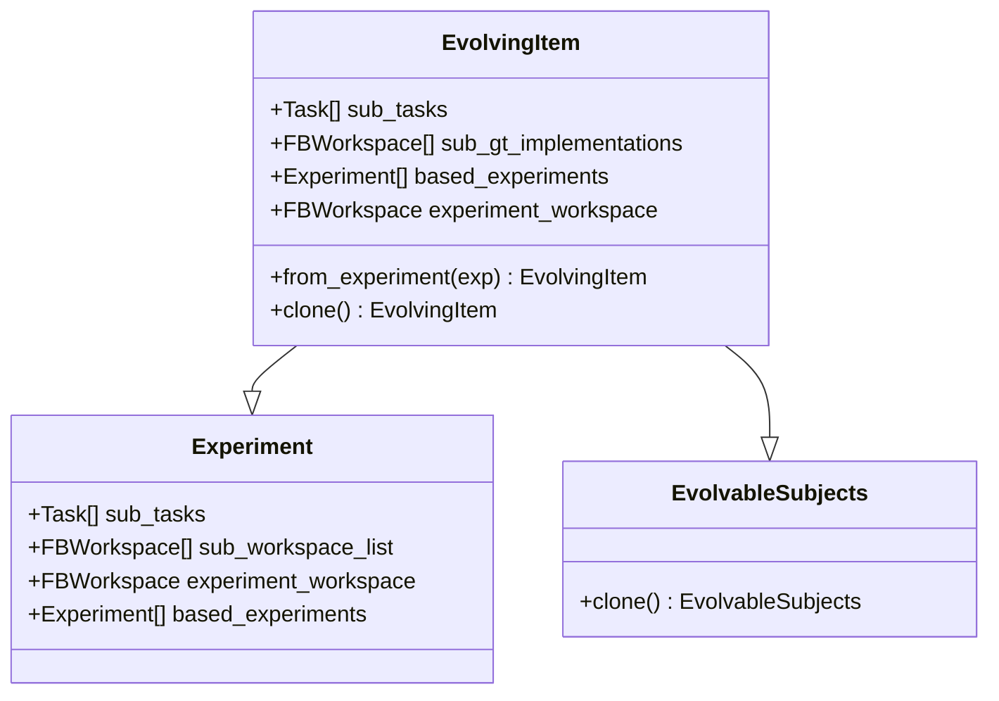
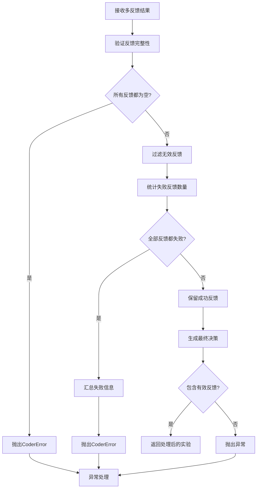
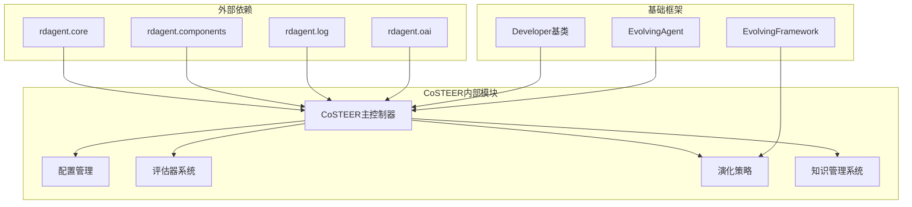

# CoSTEER框架详细文档

<cite>
**本文档引用的文件**
- [__init__.py](file://rdagent/components/coder/CoSTEER/__init__.py)
- [config.py](file://rdagent/components/coder/CoSTEER/config.py)
- [evaluators.py](file://rdagent/components/coder/CoSTEER/evaluators.py)
- [evolving_strategy.py](file://rdagent/components/coder/CoSTEER/evolving_strategy.py)
- [knowledge_management.py](file://rdagent/components/coder/CoSTEER/knowledge_management.py)
- [evolvable_subjects.py](file://rdagent/components/coder/CoSTEER/evolvable_subjects.py)
- [task.py](file://rdagent/components/coder/CoSTEER/task.py)
- [prompts.yaml](file://rdagent/components/coder/CoSTEER/prompts.yaml)
- [developer.py](file://rdagent/core/developer.py)
- [evolving_framework.py](file://rdagent/core/evolving_framework.py)
- [evolving_agent.py](file://rdagent/core/evolving_agent.py)
</cite>

## 目录
1. [简介](#简介)
2. [项目结构](#项目结构)
3. [核心组件](#核心组件)
4. [架构概览](#架构概览)
5. [详细组件分析](#详细组件分析)
6. [依赖关系分析](#依赖关系分析)
7. [性能考虑](#性能考虑)
8. [故障排除指南](#故障排除指南)
9. [结论](#结论)

## 简介

CoSTEER（Code STEERING）是一个先进的代码生成与进化引擎，作为RD-Agent框架的核心组件，专门用于自动化代码开发和优化。该框架通过继承Developer基类实现了智能的演化机制，集成了RAGEvaluator评估器、EvolvingStrategy演化策略和完整的知识管理系统，为复杂的代码任务提供持续的学习和改进能力。

CoSTEER框架的核心优势在于其多轮演化机制，能够通过RAG（检索增强生成）策略不断优化代码实现，同时具备强大的知识积累和重用能力。框架支持多种演化版本（V1和V2），提供了灵活的知识检索和反馈处理机制。

## 项目结构

CoSTEER框架采用模块化设计，主要包含以下核心模块：



**图表来源**
- [__init__.py](file://rdagent/components/coder/CoSTEER/__init__.py#L1-L177)
- [config.py](file://rdagent/components/coder/CoSTEER/config.py#L1-L43)
- [evaluators.py](file://rdagent/components/coder/CoSTEER/evaluators.py#L1-L312)

**章节来源**
- [__init__.py](file://rdagent/components/coder/CoSTEER/__init__.py#L1-L177)
- [config.py](file://rdagent/components/coder/CoSTEER/config.py#L1-L43)

## 核心组件

### CoSTEER主控制器

CoSTEER类是整个框架的核心控制器，继承自Developer基类，负责协调各个子系统的协同工作。该类的主要职责包括：

- **初始化管理**：配置演化参数、知识库路径和演化版本
- **演化控制**：管理多轮演化过程，包括超时处理和回退机制
- **反馈处理**：处理评估结果，决定是否采用新的演化方案

### 配置体系（CoSTEERSettings）

CoSTEERSettings提供了完整的配置管理机制，支持多种演化参数的定制：

- **演化参数**：最大循环次数、失败尝试限制等
- **知识库配置**：知识库路径、采样比例等
- **性能优化**：缓存设置、并发控制等

### 评估器系统

评估器系统负责对代码实现进行多维度的质量评估：

- **单反馈机制**：针对单一任务的详细反馈
- **多反馈聚合**：整合多个评估器的结果
- **质量判断**：基于执行、返回值和代码质量的综合评估

**章节来源**
- [__init__.py](file://rdagent/components/coder/CoSTEER/__init__.py#L15-L177)
- [config.py](file://rdagent/components/coder/CoSTEER/config.py#L5-L42)
- [evaluators.py](file://rdagent/components/coder/CoSTEER/evaluators.py#L25-L311)

## 架构概览

CoSTEER框架采用分层架构设计，实现了高度的模块化和可扩展性：



**图表来源**
- [__init__.py](file://rdagent/components/coder/CoSTEER/__init__.py#L15-L50)
- [evolving_strategy.py](file://rdagent/components/coder/CoSTEER/evolving_strategy.py#L15-L134)
- [knowledge_management.py](file://rdagent/components/coder/CoSTEER/knowledge_management.py#L50-L150)

## 详细组件分析

### develop方法中的多轮演化实现

CoSTEER的核心功能体现在develop方法中，该方法实现了复杂的多轮演化逻辑：



**图表来源**
- [__init__.py](file://rdagent/components/coder/CoSTEER/__init__.py#L70-L150)
- [evolving_agent.py](file://rdagent/core/evolving_agent.py#L46-L114)

#### RAGEvoAgent循环控制

RAGEvoAgent负责管理整个演化过程的循环控制：

- **循环管理**：控制最大循环次数，防止无限演化
- **知识查询**：在每轮演化前查询相关知识
- **反馈收集**：收集每轮的评估反馈
- **轨迹维护**：维护完整的演化历史记录

#### 知识库检索增强机制

CoSTEER支持两种演化版本的知识检索机制：

**V1版本**：
- 基于相似度的任务查询
- 失败轨迹的重用
- 成功知识的存储

**V2版本**（推荐）：
- 组件级别的知识分析
- 错误节点的图结构表示
- 更精细的知识采样策略



**图表来源**
- [knowledge_management.py](file://rdagent/components/coder/CoSTEER/knowledge_management.py#L300-L500)
- [evolving_agent.py](file://rdagent/core/evolving_agent.py#L60-L90)

#### fallback解决方案选择策略

CoSTEER实现了智能的fallback机制：

- **最佳解决方案保存**：在每轮演化中保存表现最好的解决方案
- **回退决策**：当演化过程中出现失败时，回退到最佳已知解决方案
- **检查点机制**：确保回退时能够恢复到正确的状态

#### 超时处理机制

框架提供了多层次的超时保护：

- **全局定时器**：基于RD_Agent_TIMER_wrapper的全局超时控制
- **轮次计时**：每轮演化的时间限制
- **优雅终止**：超时时的清理和回退操作

**章节来源**
- [__init__.py](file://rdagent/components/coder/CoSTEER/__init__.py#L70-L150)
- [knowledge_management.py](file://rdagent/components/coder/CoSTEER/knowledge_management.py#L300-L600)

### EvolvingItem封装机制

EvolvingItem类是CoSTEER框架中的核心数据结构，负责封装实验进行迭代：



**图表来源**
- [evolvable_subjects.py](file://rdagent/components/coder/CoSTEER/evolvable_subjects.py#L6-L32)

EvolvingItem的主要特性：

- **任务封装**：封装多个子任务及其对应的实现
- **对比参考**：支持与基准实现的对比
- **实验继承**：支持基于已有实验的进一步演化
- **克隆机制**：提供深度复制功能以避免副作用

**章节来源**
- [evolvable_subjects.py](file://rdagent/components/coder/CoSTEER/evolvable_subjects.py#L6-L32)

### _feedback后处理流程

反馈后处理是CoSTEER框架的关键环节，负责对执行、返回值和代码质量进行综合判断：



**图表来源**
- [__init__.py](file://rdagent/components/coder/CoSTEER/__init__.py#L160-L177)

反馈处理的核心逻辑：

- **完整性检查**：确保至少有一个有效的反馈
- **质量评估**：基于执行、返回值和代码质量的综合判断
- **错误聚合**：将失败的反馈信息进行汇总
- **异常处理**：提供清晰的错误信息和上下文

**章节来源**
- [__init__.py](file://rdagent/components/coder/CoSTEER/__init__.py#L160-L177)

### 提示工程系统

CoSTEER框架通过prompts.yaml文件实现了完整的提示工程体系：

#### 组件分析提示

框架提供了专门的组件分析功能，通过LLM辅助识别任务的关键组件：

```yaml
analyze_component_prompt_v1_system: |
  User is getting a new task that might consist of the components below (given in component_index: component_description):
  {{all_component_content}}

  You should find out what components does the new task have, and put their indices in a list.
  Please response the critic in the json format. Here is an example structure for the JSON output, please strictly follow the format:
  {
      "component_no_list": the list containing indices of components.
  }
```

该提示系统的作用：

- **任务分解**：帮助识别复杂任务的关键组成部分
- **知识匹配**：将新任务与已有知识进行关联
- **智能推荐**：基于组件相似性推荐相关解决方案

**章节来源**
- [prompts.yaml](file://rdagent/components/coder/CoSTEER/prompts.yaml#L1-L10)

## 依赖关系分析

CoSTEER框架的依赖关系体现了清晰的分层架构：



**图表来源**
- [__init__.py](file://rdagent/components/coder/CoSTEER/__init__.py#L1-L15)
- [developer.py](file://rdagent/core/developer.py#L1-L35)

### 核心依赖关系

1. **继承关系**：CoSTEER继承Developer基类，获得演化能力
2. **组合关系**：通过组合模式集成各种策略和组件
3. **依赖注入**：通过构造函数注入评估器和演化策略
4. **观察者模式**：演化代理观察演化过程的变化

**章节来源**
- [__init__.py](file://rdagent/components/coder/CoSTEER/__init__.py#L1-L15)
- [developer.py](file://rdagent/core/developer.py#L1-L35)

## 性能考虑

CoSTEER框架在设计时充分考虑了性能优化：

### 并发处理

- **多进程演化**：支持并行执行多个任务的演化
- **知识库锁定**：使用文件锁防止并发写入冲突
- **内存管理**：合理的对象生命周期管理

### 缓存策略

- **知识缓存**：缓存查询结果减少重复计算
- **评估缓存**：缓存评估结果提高效率
- **模型调用缓存**：减少不必要的API调用

### 内存优化

- **增量更新**：只更新变化的部分
- **延迟加载**：按需加载知识库内容
- **垃圾回收**：及时释放不需要的对象

## 故障排除指南

### 常见问题及解决方案

#### 演化超时问题

**症状**：演化过程长时间运行或卡住
**原因**：可能是知识库过大、评估器效率低或演化策略不当
**解决方案**：
- 调整`max_seconds_multiplier`参数
- 优化评估器逻辑
- 使用更精确的知识查询策略

#### 知识库访问冲突

**症状**：并发环境下出现文件访问错误
**原因**：多个进程同时访问知识库文件
**解决方案**：
- 启用`enable_filelock`选项
- 设置合适的`filelock_path`
- 减少并发进程数

#### 反馈处理异常

**症状**：评估反馈格式不正确导致异常
**原因**：评估器输出不符合预期格式
**解决方案**：
- 检查评估器实现的正确性
- 验证反馈数据的完整性
- 添加适当的错误处理逻辑

**章节来源**
- [__init__.py](file://rdagent/components/coder/CoSTEER/__init__.py#L160-L177)
- [config.py](file://rdagent/components/coder/CoSTEER/config.py#L25-L35)

## 结论

CoSTEER框架代表了代码生成与进化领域的先进实践，通过精心设计的架构实现了智能化的代码开发能力。框架的核心优势包括：

1. **模块化设计**：清晰的分层架构便于维护和扩展
2. **智能演化**：基于知识的迭代优化机制
3. **灵活配置**：丰富的配置选项适应不同场景需求
4. **性能优化**：多层次的性能优化策略
5. **错误处理**：完善的异常处理和恢复机制

该框架为自动化代码开发提供了强大的基础设施，特别适用于需要持续优化和学习的复杂代码任务。通过合理配置和使用，可以显著提高代码开发的效率和质量。