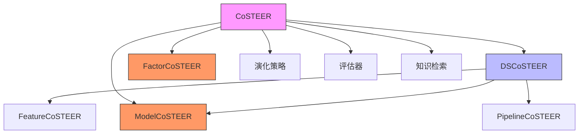
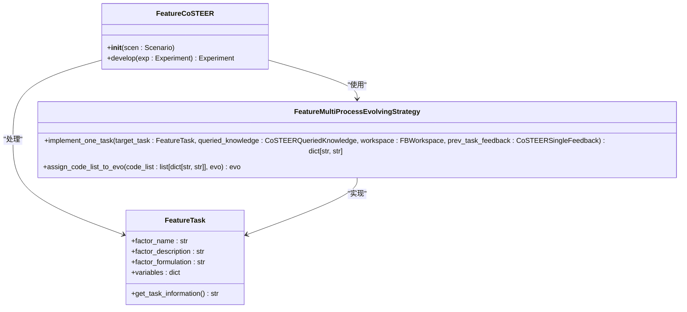
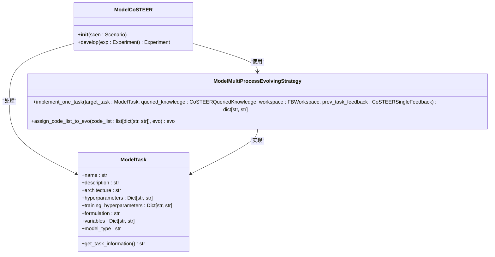
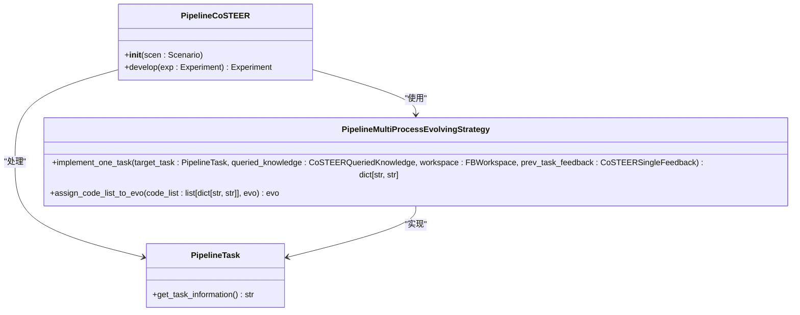
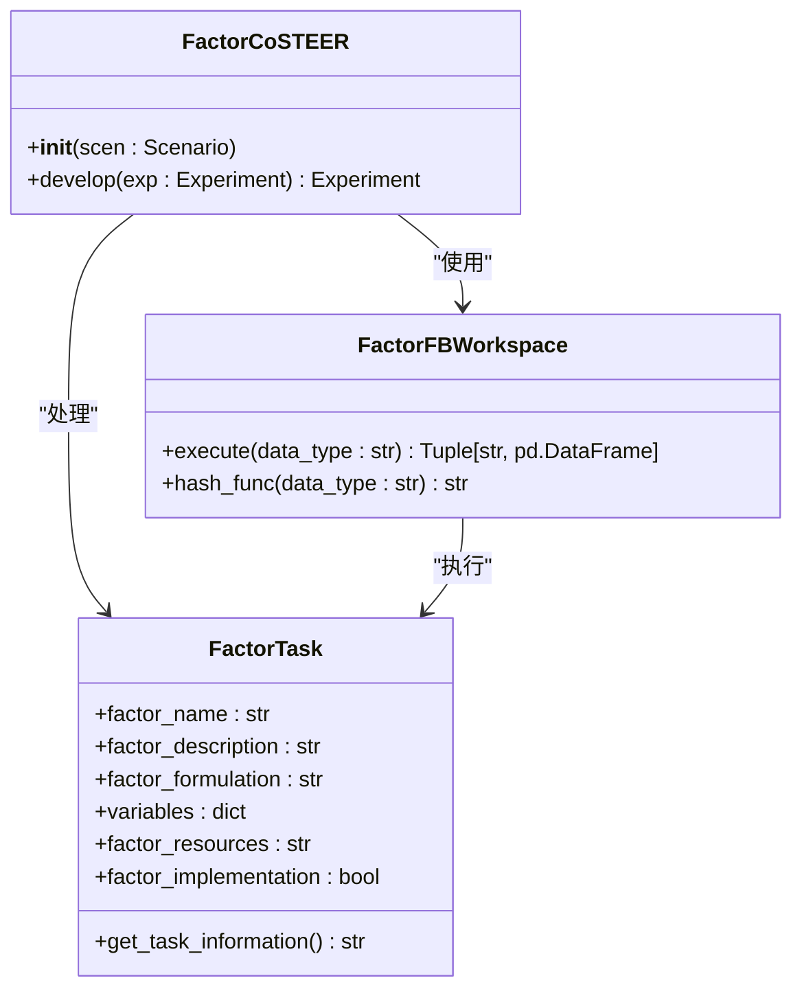
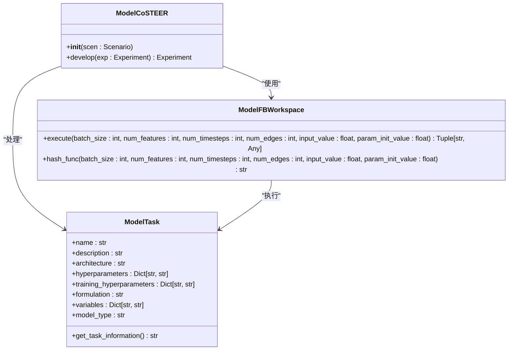
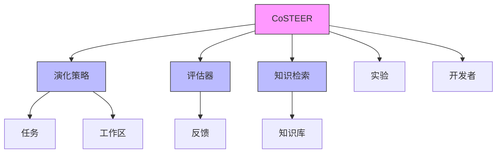
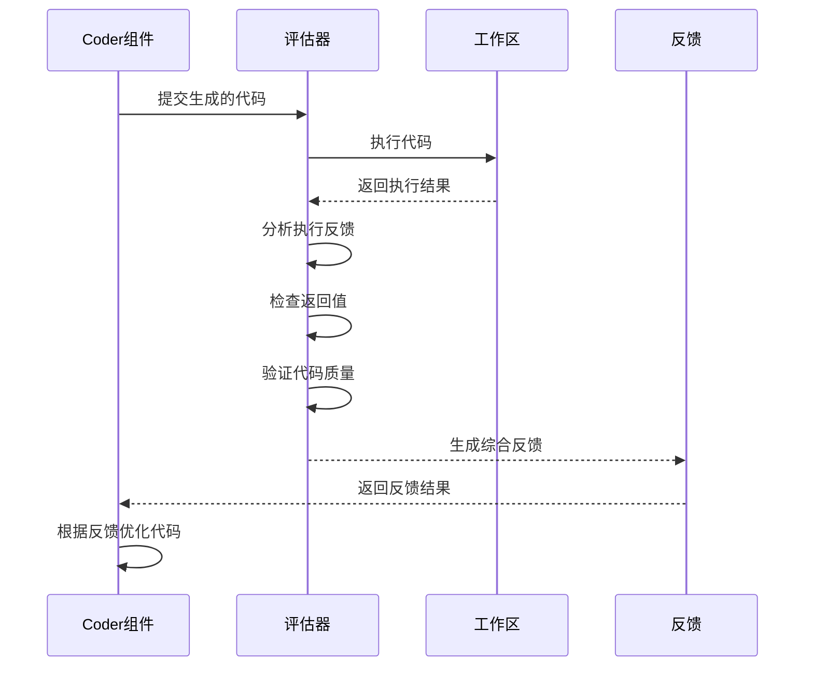
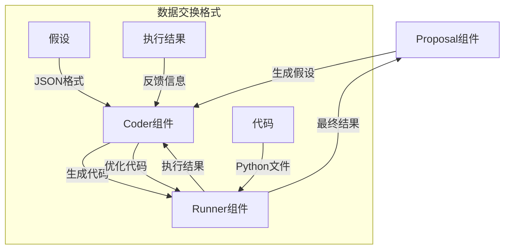

# Coder组件

<cite>
**本文档引用的文件**
- [CoSTEER/\_\_init\_\_.py](file://rdagent\components\coder\CoSTEER\__init__.py)
- [CoSTEER/config.py](file://rdagent\components\coder\CoSTEER\config.py)
- [CoSTEER/evaluators.py](file://rdagent\components\coder\CoSTEER\evaluators.py)
- [CoSTEER/evolvable_subjects.py](file://rdagent\components\coder\CoSTEER\evolvable_subjects.py)
- [data_science/conf.py](file://rdagent\components\coder\data_science\conf.py)
- [data_science/share/ds_costeer.py](file://rdagent\components\coder\data_science\share\ds_costeer.py)
- [data_science/feature/\_\_init\_\_.py](file://rdagent\components\coder\data_science\feature\__init__.py)
- [data_science/model/\_\_init\_\_.py](file://rdagent\components\coder\data_science\model\__init__.py)
- [data_science/pipeline/\_\_init\_\_.py](file://rdagent\components\coder\data_science\pipeline\__init__.py)
- [factor_coder/\_\_init\_\_.py](file://rdagent\components\coder\factor_coder\__init__.py)
- [factor_coder/factor.py](file://rdagent\components\coder\factor_coder\factor.py)
- [model_coder/\_\_init\_\_.py](file://rdagent\components\coder\model_coder\__init__.py)
- [model_coder/model.py](file://rdagent\components\coder\model_coder\model.py)
- [CoSTEER/prompts.yaml](file://rdagent\components\coder\CoSTEER\prompts.yaml)
</cite>

## 目录
1. [引言](#引言)
2. [架构概述](#架构概述)
3. [核心组件](#核心组件)
4. [详细组件分析](#详细组件分析)
5. [依赖分析](#依赖分析)
6. [配置与提示工程](#配置与提示工程)
7. [评估器作用](#评估器作用)
8. [协作关系](#协作关系)
9. [结论](#结论)

## 引言
Coder组件是RD-Agent系统中的核心代码生成引擎，负责将假设和提案转化为可执行的代码。该组件基于CoSTEER框架，实现了特征工程、机器学习模型、数据管道等不同类型代码的自动化生成与迭代优化。在量化金融场景下，factor_coder和model_coder提供了专用的代码生成逻辑，确保生成的代码符合特定领域的规范和要求。

## 架构概述
Coder组件采用分层架构设计，以CoSTEER为核心框架，通过继承和组合的方式实现不同领域的代码生成器。整体架构遵循单一职责原则，将代码生成、评估、演化等职责分离，确保系统的可扩展性和可维护性。



**图源**
- [CoSTEER/\_\_init\_\_.py](file://rdagent\components\coder\CoSTEER\__init__.py)
- [data_science/share/ds_costeer.py](file://rdagent\components\coder\data_science\share\ds_costeer.py)
- [factor_coder/\_\_init\_\_.py](file://rdagent\components\coder\factor_coder\__init__.py)
- [model_coder/\_\_init\_\_.py](file://rdagent\components\coder\model_coder\__init__.py)

## 核心组件
Coder组件的核心是CoSTEER框架，它提供了一个通用的代码生成和演化框架。CoSTEER继承自Developer类，实现了develop方法，通过多步演化过程生成高质量的代码。演化过程包括知识检索、代码生成、执行评估和反馈循环等阶段。

**组件源**
- [CoSTEER/\_\_init\_\_.py](file://rdagent\components\coder\CoSTEER\__init__.py#L1-L176)
- [CoSTEER/config.py](file://rdagent\components\coder\CoSTEER\config.py#L1-L42)

## 详细组件分析

### data_science子模块分析
data_science子模块包含了特征工程、模型和数据管道等具体实现类，每个类都遵循相同的职责划分和扩展机制。

#### 特征工程组件
特征工程组件（FeatureCoSTEER）负责生成特征提取代码，它继承自DSCoSTEER类，实现了特定的演化策略和评估器。



**图源**
- [data_science/feature/\_\_init\_\_.py](file://rdagent\components\coder\data_science\feature\__init__.py#L1-L140)
- [data_science/feature/exp.py](file://rdagent\components\coder\data_science\feature\exp.py)

**组件源**
- [data_science/feature/\_\_init\_\_.py](file://rdagent\components\coder\data_science\feature\__init__.py#L1-L140)

#### 模型组件
模型组件（ModelCoSTEER）负责生成机器学习模型代码，它同样继承自DSCoSTEER类，但使用了不同的演化策略和评估器。



**图源**
- [data_science/model/\_\_init\_\_.py](file://rdagent\components\coder\data_science\model\__init__.py#L1-L173)
- [data_science/model/exp.py](file://rdagent\components\coder\data_science\model\exp.py)

**组件源**
- [data_science/model/\_\_init\_\_.py](file://rdagent\components\coder\data_science\model\__init__.py#L1-L173)

#### 数据管道组件
数据管道组件（PipelineCoSTEER）负责生成端到端的数据处理和模型训练管道代码。



**图源**
- [data_science/pipeline/\_\_init\_\_.py](file://rdagent\components\coder\data_science\pipeline\__init__.py#L1-L165)
- [data_science/pipeline/exp.py](file://rdagent\components\coder\data_science\pipeline\exp.py)

**组件源**
- [data_science/pipeline/\_\_init\_\_.py](file://rdagent\components\coder\data_science\pipeline\__init__.py#L1-L165)

### 量化金融场景专用组件

#### factor_coder分析
factor_coder是针对量化金融场景的专用代码生成器，它实现了特定的因子生成逻辑。



**图源**
- [factor_coder/\_\_init\_\_.py](file://rdagent\components\coder\factor_coder\__init__.py#L1-L32)
- [factor_coder/factor.py](file://rdagent\components\coder\factor_coder\factor.py#L1-L231)

**组件源**
- [factor_coder/\_\_init\_\_.py](file://rdagent\components\coder\factor_coder\__init__.py#L1-L32)
- [factor_coder/factor.py](file://rdagent\components\coder\factor_coder\factor.py#L1-L231)

#### model_coder分析
model_coder是针对量化金融场景的模型代码生成器，它支持多种模型类型和执行环境。



**图源**
- [model_coder/\_\_init\_\_.py](file://rdagent\components\coder\model_coder\__init__.py#L1-L21)
- [model_coder/model.py](file://rdagent\components\coder\model_coder\model.py#L1-L163)

**组件源**
- [model_coder/\_\_init\_\_.py](file://rdagent\components\coder\model_coder\__init__.py#L1-L21)
- [model_coder/model.py](file://rdagent\components\coder\model_coder\model.py#L1-L163)

## 依赖分析
Coder组件的依赖关系清晰，遵循依赖倒置原则。核心依赖包括：



**图源**
- [CoSTEER/\_\_init\_\_.py](file://rdagent\components\coder\CoSTEER\__init__.py)
- [CoSTEER/evolving_strategy.py](file://rdagent\components\coder\CoSTEER\evolving_strategy.py)
- [CoSTEER/evaluators.py](file://rdagent\components\coder\CoSTEER\evaluators.py)
- [CoSTEER/knowledge_management.py](file://rdagent\components\coder\CoSTEER\knowledge_management.py)

**组件源**
- [CoSTEER/\_\_init\_\_.py](file://rdagent\components\coder\CoSTEER\__init__.py#L1-L176)
- [CoSTEER/evolving_strategy.py](file://rdagent\components\coder\CoSTEER\evolving_strategy.py)
- [CoSTEER/evaluators.py](file://rdagent\components\coder\CoSTEER\evaluators.py)
- [CoSTEER/knowledge_management.py](file://rdagent\components\coder\CoSTEER\knowledge_management.py)

## 配置与提示工程
Coder组件的配置和提示工程设计精细，确保了代码生成的质量和一致性。

### 接口定义
所有Coder组件都实现了统一的接口，主要包括evolve和develop方法：

- **evolve**: 多步演化方法，通过迭代优化生成代码
- **develop**: 开发方法，协调演化过程并返回最终结果

### 配置选项
配置选项通过CoSTEERSettings类管理，主要配置包括：

```python
class CoSTEERSettings(ExtendedBaseSettings):
    coder_use_cache: bool = False
    max_loop: int = 10
    fail_task_trial_limit: int = 20
    knowledge_base_path: Union[str, None] = None
    new_knowledge_base_path: Union[str, None] = None
    enable_filelock: bool = False
    filelock_path: Union[str, None] = None
    max_seconds_multiplier: int = 10**6
```

**组件源**
- [CoSTEER/config.py](file://rdagent\components\coder\CoSTEER\config.py#L1-L42)

### 提示工程设计
提示工程通过prompts.yaml文件配置，采用模板化设计：

```yaml
analyze_component_prompt_v1_system: |-
  User is getting a new task that might consist of the components below (given in component_index: component_description):
  {{all_component_content}}

  You should find out what components does the new task have, and put their indices in a list.
  Please response the critic in the json format. Here is an example structure for the JSON output, please strictly follow the format:
  {
      "component_no_list": the list containing indices of components.
  }
```

**组件源**
- [CoSTEER/prompts.yaml](file://rdagent\components\coder\CoSTEER\prompts.yaml#L1-L9)

## 评估器作用
评估器在代码质量验证中起着关键作用，通过多层次的反馈机制确保生成代码的正确性。



**图源**
- [CoSTEER/evaluators.py](file://rdagent\components\coder\CoSTEER\evaluators.py#L1-L311)
- [CoSTEER/\_\_init\_\_.py](file://rdagent\components\coder\CoSTEER\__init__.py#L1-L176)

**组件源**
- [CoSTEER/evaluators.py](file://rdagent\components\coder\CoSTEER\evaluators.py#L1-L311)

## 协作关系
Coder组件与Proposal、Runner组件通过明确定义的数据交换格式进行协作。



**图源**
- [CoSTEER/\_\_init\_\_.py](file://rdagent\components\coder\CoSTEER\__init__.py)
- [core/proposal.py](file://rdagent\core\proposal.py)
- [components/runner/\_\_init\_\_.py](file://rdagent\components\runner\__init__.py)

## 结论
Coder组件作为RD-Agent系统的核心代码生成引擎，通过CoSTEER框架实现了高效、可靠的代码自动化生成。该组件采用模块化设计，支持多种数据科学任务的代码生成，并在量化金融场景下提供了专用的factor_coder和model_coder实现。通过精细的配置管理、提示工程设计和评估机制，Coder组件能够生成高质量的代码，并与Proposal、Runner组件协同工作，形成完整的自动化研发闭环。