# 因子Coder：量化金融场景下的专用实现

<cite>
**本文档中引用的文件**
- [__init__.py](file://rdagent/components/coder/factor_coder/__init__.py)
- [config.py](file://rdagent/components/coder/factor_coder/config.py)
- [prompts.yaml](file://rdagent/components/coder/factor_coder/prompts.yaml)
- [evaluators.py](file://rdagent/components/coder/factor_coder/evaluators.py)
- [eva_utils.py](file://rdagent/components/coder/factor_coder/eva_utils.py)
- [factor.py](file://rdagent/components/coder/factor_coder/factor.py)
- [evolving_strategy.py](file://rdagent/components/coder/factor_coder/evolving_strategy.py)
- [factor_execution_template.txt](file://rdagent/components/coder/factor_coder/factor_execution_template.txt)
- [CoSTEER/__init__.py](file://rdagent/components/coder/CoSTEER/__init__.py)
- [CoSTEER/task.py](file://rdagent/components/coder/CoSTEER/task.py)
- [CoSTEER/evaluators.py](file://rdagent/components/coder/CoSTEER/evaluators.py)
- [qlib/prompts.yaml](file://rdagent/scenarios/qlib/prompts.yaml)
</cite>

## 目录
1. [引言](#引言)
2. [项目结构概览](#项目结构概览)
3. [核心组件分析](#核心组件分析)
4. [架构设计](#架构设计)
5. [详细组件分析](#详细组件分析)
6. [三阶段评审流程](#三阶段评审流程)
7. [因子代码质量评估](#因子代码质量评估)
8. [配置与提示模板](#配置与提示模板)
9. [性能考虑](#性能考虑)
10. [故障排除指南](#故障排除指南)
11. [结论](#结论)

## 引言

因子Coder（FactorCoSTEER）是专门为量化金融场景设计的专用代码生成器，基于CoSTEER框架构建。它能够处理复杂的FactorTask任务，生成符合量化研究规范的因子代码，并通过三阶段评审流程确保代码质量和有效性。

该系统特别针对量化金融领域的因子开发需求进行了优化，包括：
- 支持多种因子类型的生成和验证
- 提供完整的代码质量评估机制
- 集成金融数据处理和回测环境
- 实现智能的知识管理和学习机制

## 项目结构概览

因子Coder的项目结构体现了清晰的分层架构设计：

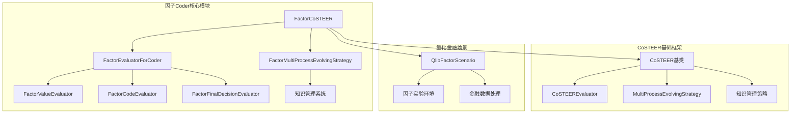

**图表来源**
- [__init__.py](file://rdagent/components/coder/factor_coder/__init__.py#L1-L33)
- [CoSTEER/__init__.py](file://rdagent/components/coder/CoSTEER/__init__.py#L1-L50)

**章节来源**
- [__init__.py](file://rdagent/components/coder/factor_coder/__init__.py#L1-L33)
- [CoSTEER/__init__.py](file://rdagent/components/coder/CoSTEER/__init__.py#L1-L177)

## 核心组件分析

### FactorCoSTEER主类

FactorCoSTEER继承自CoSTEER基类，专门负责因子代码的生成和优化。它集成了三个核心组件：

1. **FactorEvaluatorForCoder**：负责三阶段评审流程
2. **FactorMultiProcessEvolvingStrategy**：实现多进程演化策略
3. **FactorCoSTEERSettings**：提供专门的配置选项

### FactorTask任务定义

FactorTask是系统中的核心任务抽象，包含以下关键属性：

- `factor_name`：因子名称
- `factor_description`：因子描述
- `factor_formulation`：数学公式
- `variables`：使用的变量字典
- `factor_resources`：资源路径

### FactorFBWorkspace工作空间

FactorFBWorkspace提供了因子代码的执行环境，支持：
- 文件级别的代码管理
- 数据文件的自动链接
- 执行结果的缓存机制
- 多版本的数据源支持

**章节来源**
- [__init__.py](file://rdagent/components/coder/factor_coder/__init__.py#L10-L33)
- [factor.py](file://rdagent/components/coder/factor_coder/factor.py#L15-L76)
- [factor.py](file://rdagent/components/coder/factor_coder/factor.py#L80-L231)

## 架构设计

因子Coder采用分层架构设计，从底层的基础框架到顶层的应用接口：

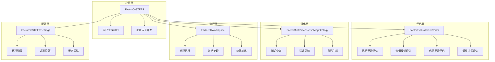

**图表来源**
- [__init__.py](file://rdagent/components/coder/factor_coder/__init__.py#L10-L33)
- [evaluators.py](file://rdagent/components/coder/factor_coder/evaluators.py#L15-L40)
- [evolving_strategy.py](file://rdagent/components/coder/factor_coder/evolving_strategy.py#L20-L50)

## 详细组件分析

### FactorEvaluatorForCoder评估器

FactorEvaluatorForCoder是三阶段评审流程的核心实现，负责对因子代码进行全面的质量评估：

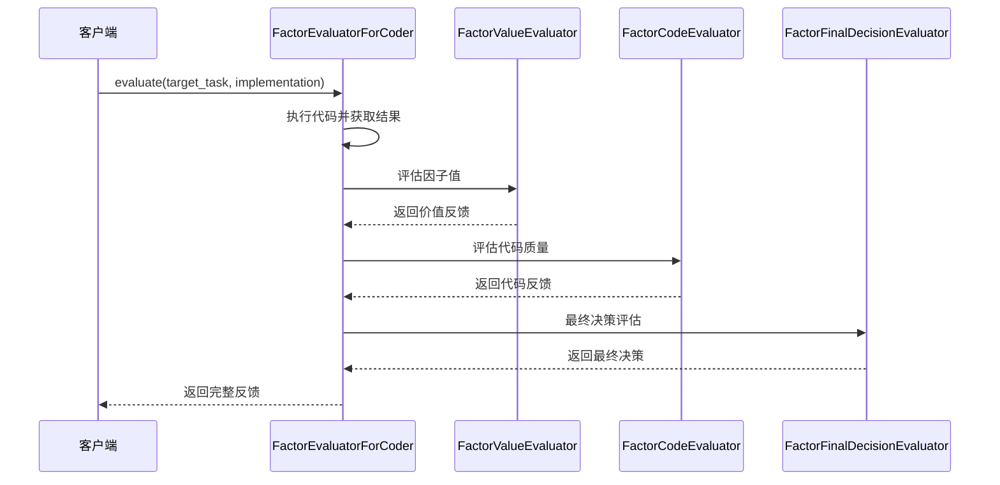

**图表来源**
- [evaluators.py](file://rdagent/components/coder/factor_coder/evaluators.py#L25-L130)

#### 执行反馈处理

系统首先执行生成的因子代码，获取执行结果和因子值。为了处理长执行日志，系统实现了智能截断策略：

- 使用正则表达式识别长数字序列
- 自动截断超过阈值的输出内容
- 保留关键的错误信息和警告

#### 价值反馈评估

价值反馈评估涵盖多个维度：

1. **数值精度检查**：验证因子值的准确性
2. **格式合规性**：确保输出格式符合要求
3. **时间序列完整性**：检查日期索引的正确性
4. **缺失值处理**：评估缺失值的处理方式

#### 代码反馈评估

代码反馈专注于代码质量和最佳实践：

- 检查代码是否遵循金融编程规范
- 评估变量命名和注释质量
- 分析算法复杂度和效率
- 确保代码的可维护性和可读性

**章节来源**
- [evaluators.py](file://rdagent/components/coder/factor_coder/evaluators.py#L25-L130)

### FactorCodeEvaluator代码质量评估

FactorCodeEvaluator专门负责对生成的因子代码进行质量评审：

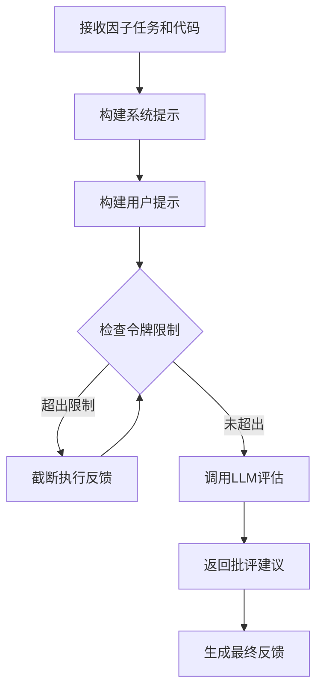

**图表来源**
- [eva_utils.py](file://rdagent/components/coder/factor_coder/eva_utils.py#L60-L90)

#### LLM评估机制

FactorCodeEvaluator利用大型语言模型进行代码质量评估：

1. **系统提示构建**：提供量化金融背景信息
2. **用户提示组装**：包含因子信息、代码和反馈
3. **令牌限制处理**：动态调整输入长度以适应模型限制
4. **JSON模式输出**：确保评估结果的结构化格式

#### 长执行日志截断策略

为应对长执行日志导致的令牌限制问题，系统实现了智能截断：

- 识别长数字序列模式
- 保留关键的错误信息
- 维护上下文的连贯性
- 提供截断标记说明

**章节来源**
- [eva_utils.py](file://rdagent/components/coder/factor_coder/eva_utils.py#L60-L90)

### FactorMultiProcessEvolvingStrategy演化策略

FactorMultiProcessEvolvingStrategy实现了多进程的因子演化策略：

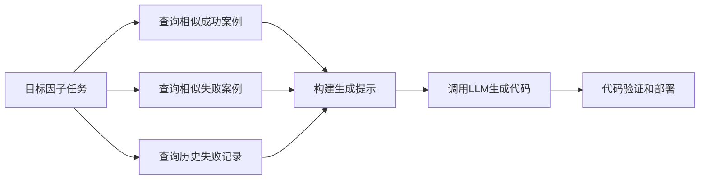

**图表来源**
- [evolving_strategy.py](file://rdagent/components/coder/factor_coder/evolving_strategy.py#L56-L173)

#### 知识查询机制

系统通过多维度的知识查询来指导代码生成：

1. **相似成功案例**：查找类似因子的成功实现
2. **相似失败案例**：分析失败原因并避免重复错误
3. **历史失败记录**：了解常见的失败模式
4. **最新尝试记录**：避免重复相同的错误

#### 错误总结功能

当检测到重复失败时，系统会自动生成错误总结：

- 归纳常见错误类型
- 提供解决方案建议
- 基于相似案例的学习
- 避免相同错误再次发生

**章节来源**
- [evolving_strategy.py](file://rdagent/components/coder/factor_coder/evolving_strategy.py#L20-L173)

## 三阶段评审流程

因子Coder采用严格的三阶段评审流程，确保因子代码的质量和有效性：

### 第一阶段：执行反馈（Execution）

执行反馈阶段主要关注代码的运行时表现：

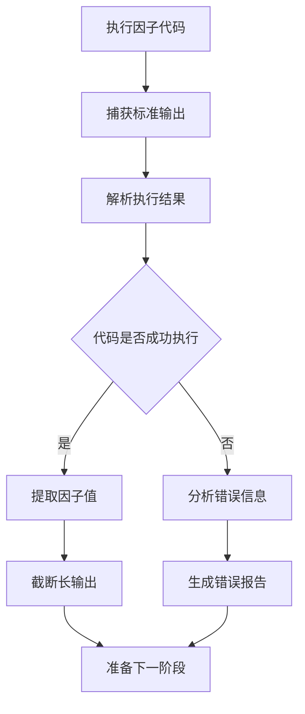

**图表来源**
- [evaluators.py](file://rdagent/components/coder/factor_coder/evaluators.py#L61-L75)

#### 执行反馈处理细节

1. **输出截断**：自动处理长数字序列输出
2. **警告过滤**：移除非关键警告信息
3. **错误分类**：区分语法错误和运行时错误
4. **结果验证**：确认因子值的有效性

### 第二阶段：价值反馈（Value）

价值反馈阶段评估因子的实际效果：

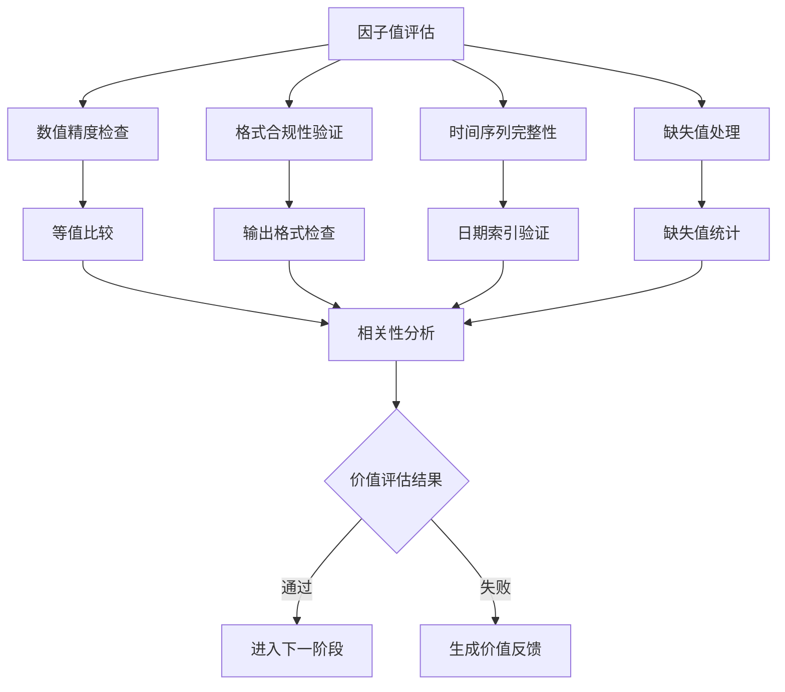

**图表来源**
- [eva_utils.py](file://rdagent/components/coder/factor_coder/eva_utils.py#L488-L550)

#### 价值评估指标

价值反馈涵盖多个技术指标：

1. **等值比率**：计算生成值与基准值的一致性
2. **相关性分析**：计算IC（信息系数）和Rank IC
3. **格式合规性**：验证输出格式的正确性
4. **时间序列完整性**：检查日期索引的连续性

### 第三阶段：代码反馈（Code）

代码反馈阶段专注于代码质量和最佳实践：

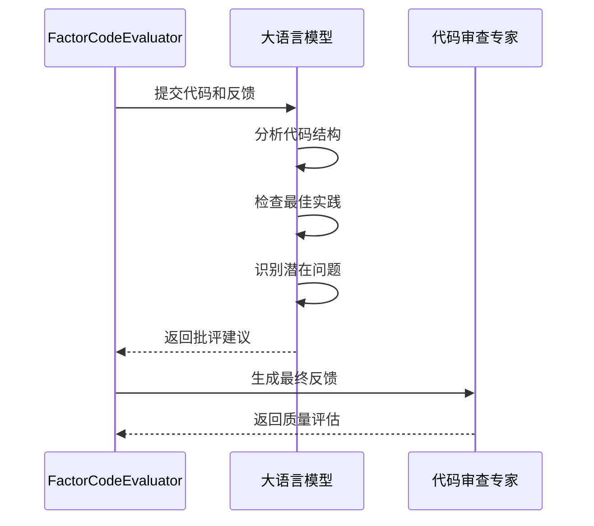

**图表来源**
- [eva_utils.py](file://rdagent/components/coder/factor_coder/eva_utils.py#L60-L90)

#### 代码质量维度

代码反馈评估涵盖以下维度：

1. **语法正确性**：检查Python语法错误
2. **逻辑正确性**：验证算法逻辑的正确性
3. **性能效率**：评估代码执行效率
4. **可读性**：检查代码的可维护性
5. **最佳实践**：遵循金融编程规范

### 最终决策（Final Decision）

最终决策阶段综合所有反馈做出判断：

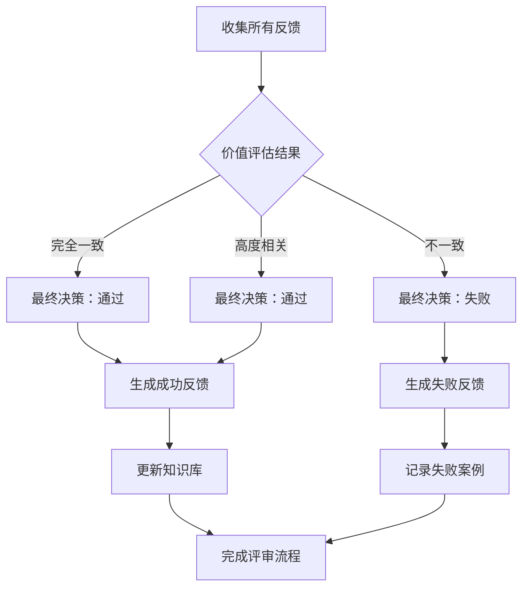

**图表来源**
- [eva_utils.py](file://rdagent/components/coder/factor_coder/eva_utils.py#L520-L550)

#### 决策逻辑规则

最终决策遵循以下规则：

1. **精确匹配**：生成值与基准值在容差范围内完全一致
2. **高相关性**：IC或Rank IC达到预设阈值
3. **成功执行**：无异常抛出且代码可正常运行
4. **格式正确**：输出格式符合量化金融规范

**章节来源**
- [evaluators.py](file://rdagent/components/coder/factor_coder/evaluators.py#L25-L130)
- [eva_utils.py](file://rdagent/components/coder/factor_coder/eva_utils.py#L488-L550)

## 因子代码质量评估

FactorCodeEvaluator利用LLM对生成的因子代码进行深度质量评估，这是量化金融场景下特有的需求。

### 评估机制详解

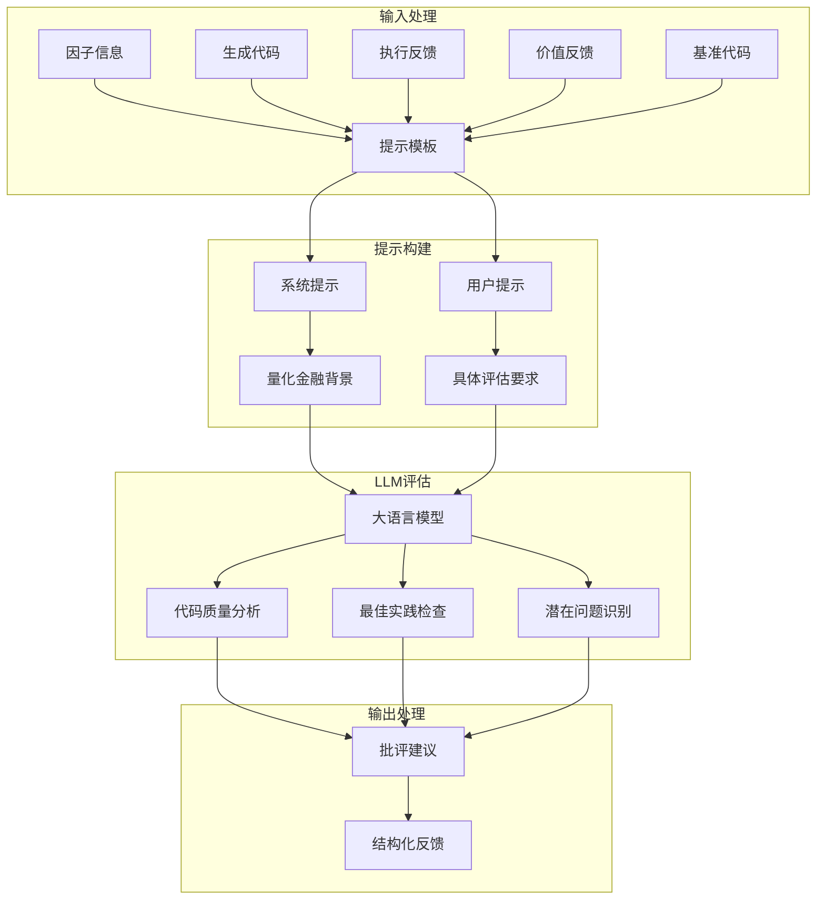

**图表来源**
- [eva_utils.py](file://rdagent/components/coder/factor_coder/eva_utils.py#L60-L90)

### 长执行日志处理策略

在量化金融场景中，因子代码可能产生大量的执行日志，特别是涉及大量数据处理的情况。系统实现了智能的日志截断策略：

#### 截断算法

1. **模式识别**：使用正则表达式识别长数字序列
2. **智能截断**：只截断不必要的详细输出
3. **上下文保持**：确保关键错误信息不被截断
4. **标记说明**：明确标识被截断的内容

#### 实现细节

截断过程遵循以下原则：
- 保留前1000个字符和后1000个字符
- 在中间插入"....hidden long error message...."标记
- 仅对超过50个连续数字的序列进行截断
- 保持错误信息的可读性

### 金融领域特殊考量

FactorCodeEvaluator针对量化金融领域进行了特殊优化：

#### 数学公式验证

- 检查公式符号的正确性
- 验证数学运算的合理性
- 确保数值计算的精度

#### 时间序列处理

- 验证日期索引的正确性
- 检查频率一致性
- 确保数据对齐

#### 风险控制

- 检查潜在的数值溢出风险
- 验证边界条件处理
- 确保异常情况的妥善处理

**章节来源**
- [eva_utils.py](file://rdagent/components/coder/factor_coder/eva_utils.py#L60-L90)

## 配置与提示模板

因子Coder通过专门的配置文件和提示模板来支持量化金融场景的特定需求。

### FactorCoSTEERSettings配置

FactorCoSTEERSettings提供了量化金融场景下的专用配置选项：

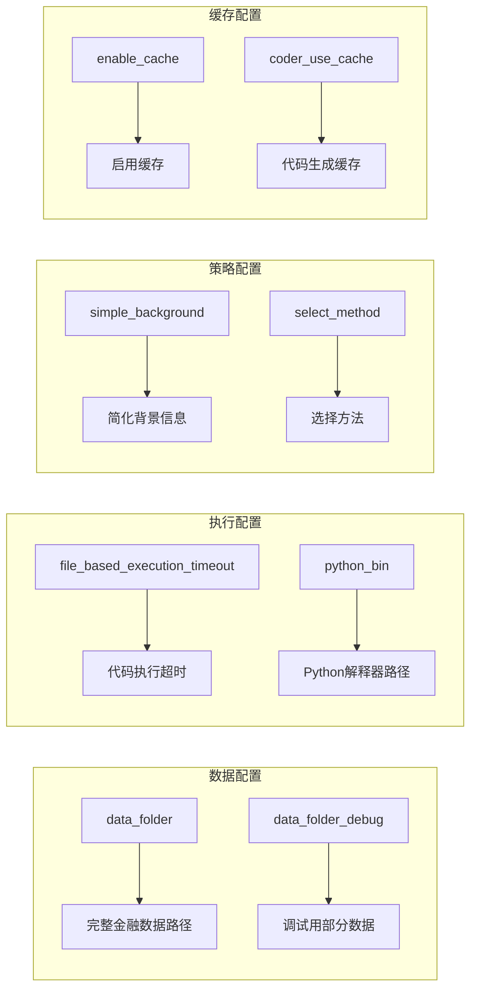

**图表来源**
- [config.py](file://rdagent/components/coder/factor_coder/config.py#L8-L49)

#### 关键配置项说明

1. **数据路径配置**
   - `data_folder`：指向包含基本面数据的完整数据集
   - `data_folder_debug`：用于调试的精简数据集

2. **执行超时设置**
   - `file_based_execution_timeout`：单次因子执行的最大时间限制

3. **环境配置**
   - `python_bin`：指定Python解释器路径
   - `simple_background`：控制背景信息的详细程度

### 提示模板系统

因子Coder使用YAML格式的提示模板来指导各个评估阶段：

#### 评估器代码反馈模板

评估器代码反馈模板专门针对因子代码的质量评估：

```yaml
evaluator_code_feedback_v1_system: |
  用户正在尝试在以下场景中实现某些因子：
  {{ scenario }}
  用户将提供因子的相关信息。
  
  你的任务是检查用户的代码是否符合因子和场景的要求。
  用户会提供源Python代码和执行错误消息（如果执行失败）。
  用户可能会提供基准代码供你参考。你不应该泄露基准代码给用户，
  但可以使用它来提供批评意见。
  
  用户还比较了用户代码和基准代码计算的因子值。用户会提供一些
  分析结果来比较两个输出。你可以发现代码中的错误，这些错误
  导致了两个输出之间的差异。
```

#### 演化策略模板

演化策略模板用于指导因子代码的生成过程：

```yaml
evolving_strategy_factor_implementation_v2_user: |
  --------------目标因子信息:---------------
  {{ factor_information_str }}
  
  
  
  回顾你上次的失败，你的实现遇到了一些错误。
  在执行其他任务时，你遇到了一些类似的错误，
  但你最终解决了它们。这里是一些例子：
   
  --------------类似错误的因子信息({{error_content}}):---------------
  {{ similar_error_knowledge[0].target_task.get_task_information() }}
  =====类似错误的代码({{error_content}}):=====
  {{ similar_error_knowledge[0].implementation.all_codes }}
  =====成功修正的代码({{error_content}}):=====
  {{ similar_error_knowledge[1].implementation.all_codes }}
  
  
  回顾你上次的失败，你的实现遇到了一些错误。
  在查看了一些类似错误及其解决方案后，
  这里有一些建议帮助你修正代码：
  {{error_summary_critics}}
  
  
```

#### 最终决策模板

最终决策模板用于综合所有反馈做出最终判断：

```yaml
evaluator_final_decision_v1_system: |
  用户正在尝试在以下场景中实现某些因子：
  {{ scenario }}
  用户已完成评估并获得了一些来自评估器的反馈。
  评估器运行代码并获得因子值数据框，并提供关于用户代码和代码输出的几个反馈。
  你应该分析反馈并考虑场景和因子描述来给出关于评估结果的最终决定。
  最终决定确定因子是否被正确实现，如果不正确，则详细反馈包含原因和建议。
  
  实现最终决定考虑以下逻辑：
  1. 如果值和基准值在小容差下完全相同，则认为实现是正确的。
  2. 如果值和基准值在IC或Rank IC上有高相关性，则认为实现是正确的。
  3. 如果没有提供基准值，则认为实现是正确的，如果代码成功执行
     （假设提供的数据是正确的）。任何异常，包括主动引发的异常，
     被视为代码的错误。此外，代码反馈必须符合场景和因子描述。
     无论原因如何，代码执行失败都不能被视为正确的实现。
```

### 因子公式和变量处理

提示模板特别针对因子公式的处理进行了优化：

#### 公式处理能力

1. **LaTeX公式支持**：直接处理数学公式表示
2. **变量映射**：自动识别和验证变量定义
3. **上下文关联**：理解因子与其变量的关系
4. **语义分析**：分析公式的数学含义和可行性

#### 变量管理

提示模板支持复杂的变量定义和管理：

- **基本变量**：简单的数值变量
- **时间序列变量**：时间相关的数据序列
- **复合变量**：由其他变量组合而成的变量
- **参数变量**：可调节的算法参数

**章节来源**
- [config.py](file://rdagent/components/coder/factor_coder/config.py#L8-L49)
- [prompts.yaml](file://rdagent/components/coder/factor_coder/prompts.yaml#L1-L210)

## 性能考虑

因子Coder在设计时充分考虑了量化金融场景下的性能需求：

### 并发执行优化

系统采用多进程并发策略来提高因子生成效率：

1. **并行演化**：同时处理多个因子任务
2. **异步执行**：因子代码的异步执行和监控
3. **资源隔离**：每个因子在独立环境中执行
4. **负载均衡**：智能分配计算资源

### 缓存机制

多层次的缓存策略显著提升系统性能：

1. **代码缓存**：缓存已验证的因子代码
2. **执行缓存**：避免重复执行相同代码
3. **知识缓存**：存储成功的案例和失败教训
4. **结果缓存**：保存因子值计算结果

### 内存管理

针对量化金融数据的特点，系统实现了高效的内存管理：

1. **流式处理**：避免加载全部数据到内存
2. **数据压缩**：减少内存占用
3. **垃圾回收**：及时释放不需要的资源
4. **分块处理**：大数据集的分块处理

### 执行超时控制

严格的超时控制确保系统稳定性：

1. **固定超时**：每个因子执行的固定时间限制
2. **动态调整**：根据历史数据动态调整超时时间
3. **优雅降级**：超时时的处理策略
4. **资源清理**：超时后的资源清理机制

## 故障排除指南

### 常见问题及解决方案

#### 1. 执行超时问题

**症状**：因子代码执行时间过长，触发超时限制

**解决方案**：
- 检查数据规模，考虑使用调试数据集
- 优化算法复杂度，避免不必要的循环
- 启用缓存机制，重用之前的结果
- 调整超时设置（谨慎操作）

#### 2. 内存不足问题

**症状**：因子执行过程中出现内存溢出

**解决方案**：
- 减少数据处理的批次大小
- 使用流式处理替代全量加载
- 清理临时变量和中间结果
- 增加系统内存或使用分布式处理

#### 3. 代码质量评估失败

**症状**：FactorCodeEvaluator无法正确评估代码质量

**解决方案**：
- 检查提示模板的配置
- 验证LLM服务的可用性
- 确认令牌限制设置合理
- 检查输入数据的格式

#### 4. 知识库访问问题

**症状**：无法正确查询历史知识

**解决方案**：
- 检查知识库路径配置
- 验证知识库文件的完整性
- 确认文件权限设置
- 重新初始化知识库

### 调试技巧

#### 1. 日志分析

系统提供了详细的日志记录功能：

- **执行日志**：记录因子代码的执行过程
- **评估日志**：显示各个评估器的输出
- **错误日志**：详细记录错误信息和堆栈跟踪
- **性能日志**：监控系统性能指标

#### 2. 状态检查

定期检查系统状态以确保正常运行：

- **资源使用率**：监控CPU和内存使用情况
- **网络连接**：验证LLM服务的连接状态
- **文件系统**：检查磁盘空间和文件权限
- **数据库状态**：确认知识库的健康状态

#### 3. 性能优化

持续优化系统性能：

- **批处理优化**：调整批处理大小
- **并发控制**：优化并发进程数量
- **缓存策略**：改进缓存命中率
- **算法优化**：提升核心算法效率

**章节来源**
- [config.py](file://rdagent/components/coder/factor_coder/config.py#L20-L35)
- [factor.py](file://rdagent/components/coder/factor_coder/factor.py#L150-L200)

## 结论

因子Coder（FactorCoSTEER）是一个专为量化金融场景设计的强大代码生成系统。通过其独特的三阶段评审流程、专业的配置管理和智能的知识学习机制，它能够有效地生成高质量的因子代码。

### 主要优势

1. **专业性强**：专门针对量化金融领域的需求设计
2. **质量保证**：严格的三阶段评审确保代码质量
3. **智能学习**：基于历史经验的智能演化策略
4. **可扩展性**：模块化的架构支持功能扩展
5. **稳定性好**：完善的错误处理和性能优化机制

### 应用前景

因子Coder在量化金融领域的应用前景广阔：

- **因子开发**：快速生成新的因子策略
- **模型优化**：辅助机器学习模型的开发
- **研究支持**：为量化研究人员提供工具支持
- **教育培训**：作为量化金融教育的实践平台

### 发展方向

未来的发展重点包括：

1. **算法增强**：引入更先进的机器学习算法
2. **领域扩展**：支持更多的金融产品和市场
3. **性能优化**：进一步提升系统性能和效率
4. **用户体验**：改善用户界面和交互体验

因子Coder代表了AI驱动的量化金融研究的重要进展，为量化投资者和研究人员提供了强大的技术支持。